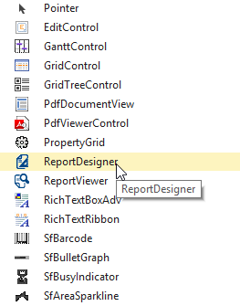
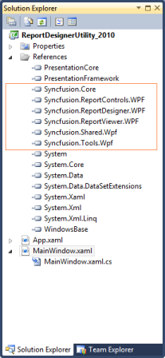
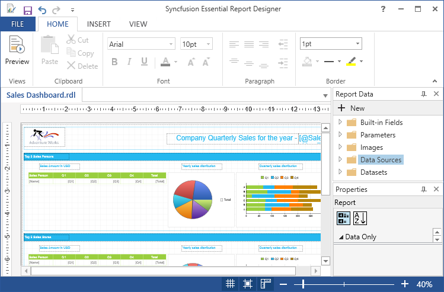

# Getting Started with WPF Report Designer

## Creating Report Designer through Visual Studio

You can create a simple application through the Visual Studio Designer with the Syncfusion WPF Report Designer control by using the following steps.

1. Create new WPF application in Visual Studio.

2. Add the ReportDesigner from the Toolbox.

   Drag and drop the ReportDesigner control from the Toolbox to the XAML Page.
   
   
   
3. Add the following assemblies.

   * Syncfusion.Chart.Wpf
   * Syncfusion.Gauge.Wpf
   * Syncfusion.Grid.Wpf
   * Syncfusion.Linq.Base
   * Syncfusion.PropertyGrid.Wpf
   * Syncfusion.ReportControls.Wpf
   * Syncfusion.ReportDesigner.Wpf
   * Syncfusion.ReportViewer.Wpf
   * Syncfusion.SfMaps.Wpf
   * Syncfusion.SfSkinManager.Wpf
   * Syncfusion.Shared.Wpf
   * Syncfusion.Tools.Wpf

   N> Refer the above assemblies from the installed location, C:\Program Files (x86)\Syncfusion\Essential Studio\WPF\{{ site.releaseversion }}\Assemblies
   
4. For creating ReportDesigner using code in Xaml.cs
   
   ~~~ xml
   <syncfusion:RibbonWindow x:Class="ReportDesignerSampleApplication.MainWindow"
       xmlns:syncfusion="clr-namespace:Syncfusion.Windows.Tools.Controls;assembly=Syncfusion.Tools.WPF"
       xmlns:Reporting="clr-namespace:Syncfusion.Windows.Reports.Designer;assembly=Syncfusion.ReportDesigner.WPF"
       WindowStartupLocation="CenterScreen"
       xmlns="http://schemas.microsoft.com/winfx/2006/xaml/presentation"
       xmlns:x="http://schemas.microsoft.com/winfx/2006/xaml"
	   xmlns:syncfusion="http://schemas.syncfusion.com/wpf" 
       Title="MainWindow" Height="600" Width="1000" Icon="App.ico" WindowState="Maximized">  
	   <Grid>
           <Reporting:ReportDesigner />
       </Grid>
   </syncfusion:RibbonWindow>
   ~~~
   
5. Set Visual Style to the Report Designer.

   ~~~ csharp
   SkinStorage.SetVisualStyle(this, "Office2013");
   ~~~
   
6. Run the sample application and you can see the Report Designer as displayed in the following screenshot.

   

## Load RDL Reports

1. Set RDL Report path.

   ~~~ csharp
   this.ReportDesignerControl.OpenReport(@"../../../ReportTemplate/Sales Dashboard.rdl");
   ~~~
   
2. Run the sample application and you can see the Report Designer for corresponding RDL report as displayed in the following screenshot.

   
   
## Load RDLC Reports

1. Set RDLC Report path.

   ~~~ csharp
   this.ReportDesignerControl.DesignMode = DesignMode.RDLC;
   this.ReportDesignerControl.OpenReport(@"../../../ReportTemplate/RDLC/Sales Dashboard.rdlc");
   ~~~
   
2. Run the sample application and you can see the Report Designer for corresponding RDLC report as displayed in the following screenshot.

   
