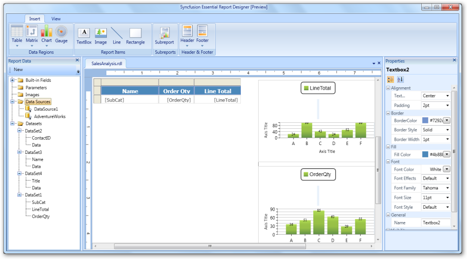

##  Overview

The Essential Report Designer helps you design and easily organize the data from a database. With the Report Designer, you can quickly build the needed reports and display the data in both tabular and visualization formats.

The important features of the Essential Report Designer for WPF are:

* RDL Specification - Supports RDL Specification for the SQL Server 2008 and RDL Specification for the SQL Server 2008 R2 only. List of available report definition formats: https://msdn.microsoft.com/library/dd297486(SQL.100).aspx.
* Data sources - You can use advanced database servers DataSources in Report Designer (SQL and Oracle).
* Data sets - You can add data sets to the DataSource.
* Tablix - Shows summaries and simple [tables](http://docs.syncfusion.com/wpf/grid.htm).
* Textbox - Shows textbox data with expression [support](http://docs.syncfusion.com/wpf/grid.htm).
* Report Parameter - Views the report based on the report parameter value.
* Basic Expression - You can use expression to handle the reports.
* Customization - Customizes the appearance of the Report Designer.

It can be used to design data in a variety of interactive formats and place report items such as data regions, text boxes, images, rectangles, and lines in the report. You can also add groups, expressions, parameters, filters, visibility options, and formatting to the report items.

