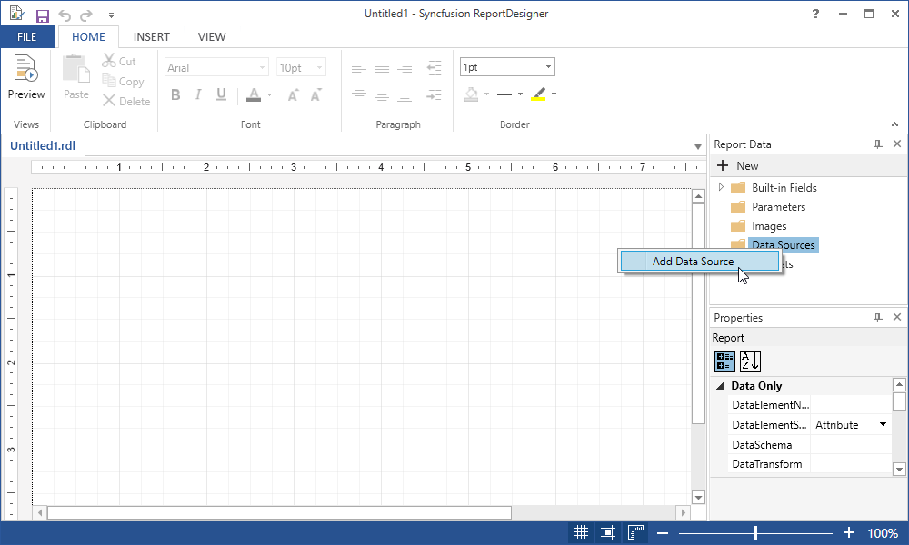
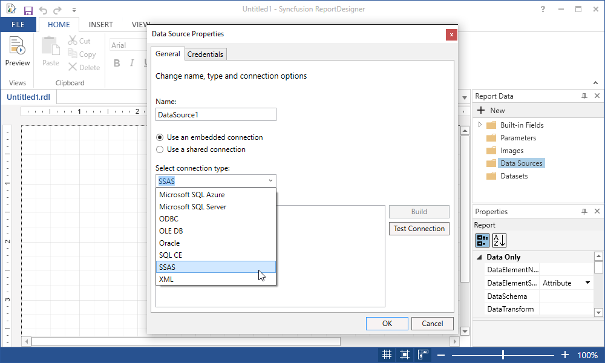
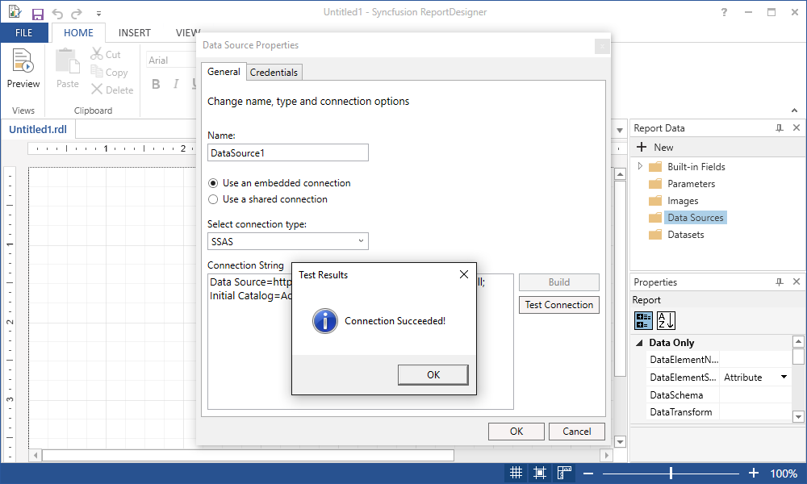
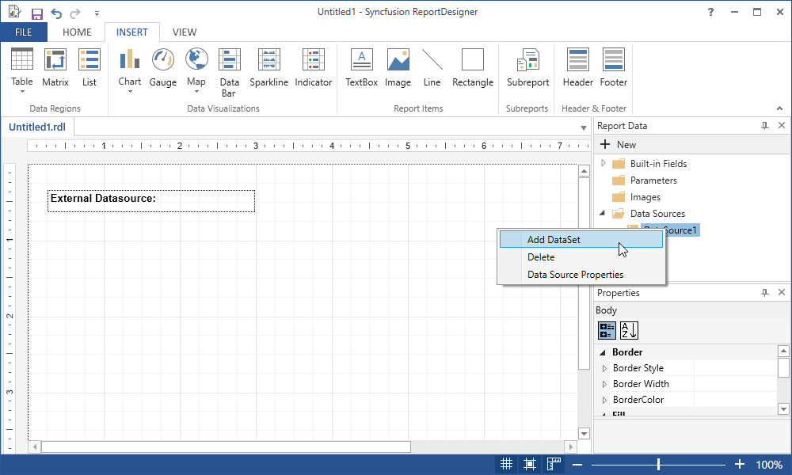
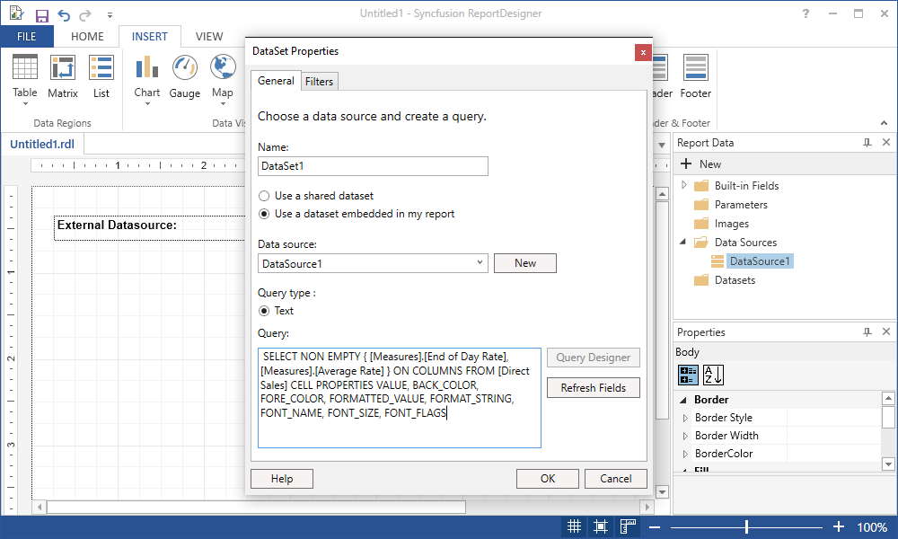
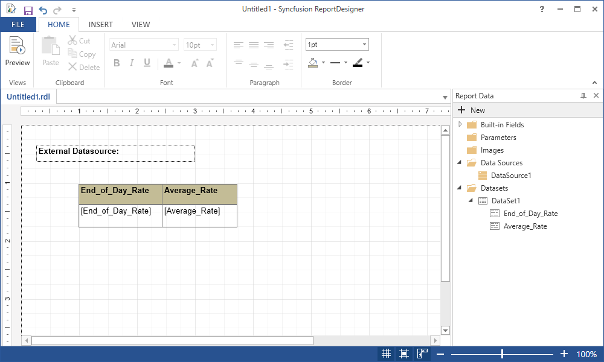

## Data Source Extension

Data source extension is to provide the additional data source supports using ADO.NET providers which is not available in built-in of Report Designer.

## Why we to have built Data Source extension?

We are providing the built-in data source supports only for the .NET Libraries that built-in of .NET Framework. If the database assemblies do not come with .NET Framework then you have built the Data Source extension for additional data sources such as MySQL, SSAS, Firebird, OData, PervasiveSQL, PostgreSQL etc.

## Do we need to create Data extension if we have a ODBC driver for unavailable data source such as MySQL, OData?

If you are going to create data set though ODBC driver for additional data source, then there is no need to create data source extension for your un available data source support.

## Create Data Extension

This article explains you how to create PostgreSQL Data Source extension with Report Designer,

## Configure Dependent Assemblies

We should add Syncfusion.ReportControls.WPF reference with application to provide the Extension support for PostgreSQL data source. And refer the data source ADO.Net library that we are going to provide the support. For this, add the PostgreSQL reference with application to provide thee Date Extension support.

Note: If you are going to create separate library for the DataExtension then you have added Syncfusion.ReportControls.WPF and PostgreSQL references with your class library.

## Implementing Data Extension
IDataExtension interface need to be implemented with your Data Extension class to provide the extension support and IDataExtension members will be invoked from Report Designer.

## ValidateConnection
Data Extension ValidateConnection member will be invoked from Report Designer for configured data source when Test Connection performed with Data source creation. We should write the implementation in this method to perform the connection testing of the configured data source.

## Implementation for PostgreSQL Extension

~~~ csharp

public bool ValidateConnection(string connectionString)
 {
     this.ConnectionString = connectionString;
     AdomdConnection connection = new AdomdConnection(GetConnectionString());
 
     try
     {
         connection.Open();
         return true;
     }
     catch
     {
         return false;
     }
     finally
     {
         connection.Close();
         connection.Dispose();
     }
 }

 ~~~

## GetSchemaData

Data Extension GetSchemaData member will be invoked from Report Designer for configured data source while changing the CommandText/Query in DataSet designer. It is invoked to generate the fields for DataSet based on dataset query.

## Implementation for PostgreSQL Extension

~~~ csharp

Public object GetSchemaData()
        {
            return null;
        }

~~~

## GetData

Data Extension GetData member will be invoked from ReportViewer to get the data for configured data source. We should write the implementation in this method to execute the data source query through ADO.NET adapters and return the query result with this method.

## Implementation for PostgreSQL Extension

~~~ csharp

public object GetData()
        {
            var connectionString = this.GetConnectionString();
            using (AdomdConnection connection = new AdomdConnection(connectionString))
            {
                try
                {
                    connection.Open();
                    DataTable dataTable = this.GetTable(connection, this.CommandText);
                    return dataTable;
                }
                catch (Exception ex)
                {
                    throw ex;
                }
                finally
                {
                    connection.Close();
                }
            }

~~~

## Data Extension Configuration

To configure the prepared Data Extension with Report Designer, add the DataExtension information with following format in application configuration,



<configuration>
    <configSections>
    <section name="ReportingExtensions" type="Syncfusion.Reporting.Extensions,  Syncfusion.ReportControls.WPF" allowLocation="true" allowDefinition="Everywhere" />
    </configSections>
<ReportingExtensions>
    <DataExtension>
      <Extension Name="SSAS" Type="Syncfusion.Reporting.DataExtensions.SSAS.SSASDataExtension"/>
    </DataExtension>
  </ReportingExtensions>
</configuration>



Note: `We should add the dependent assemblies with application or it should be there in the application location.`

## Configuration with Extension Assembly

You can use the following format if the Data Extension prepared with Class library,



<configuration>
    <configSections>
    <section name="ReportingExtensions" type="Syncfusion.Reporting.Extensions,  Syncfusion.ReportControls.WPF" allowLocation="true" allowDefinition="Everywhere" />
    </configSections>
<ReportingExtensions>
    <DataExtension>
      <Extension Name="SSAS" Assembly="Syncfusion.Reporting.DataExtensions.SSAS" Type="Syncfusion.Reporting.DataExtensions.SSAS.SSASDataExtension"/>
    </DataExtension>
  </ReportingExtensions>
</configuration>



Note: `We should add the data extension assemblies and dependent assemblies with application or it should be there the application location.`

## Attributes Reference

<Table>
<tr>
<th> Attribute Name </th>
<th> Description </th>
</tr>
<td> Name </td>
<td> Name of your data source type that going to display in list. </td>
<tr>
<td> Assembly </td>
<td> Name of newly created extension assembly. If you implemented the Extension with application, then no need to provide the assembly information. </td>
</tr>
<tr>
<td> Type </td>
<td> Extension class name with the namespace. </td>
</tr>
<tr>
</tr>
</Table>

## Do you have templated projects for Report Data Extension in Essential Studio?

Yes, we are having the template following data sources,

1.	SSAS
2.	PostgreSQL
3.	MySQL
4.	Pervasive SQL
5.	Firebird

You can use the following Data Extension Utility to generate the Data Extension assemblies based on your requirement,

## Data Extension Utility Reference

Will update it later Today. (You can add this in MD)

## Report Designer with Extension Data Source

Once you have configured the extension for Report Designer, Extension data source will be available with Data Source list,

1.	Run report designer utility.

2.	Right Click on DataSources in Report Data to add datasource.

3.	Now, in datasource properties dialog you can view added external datasource under connection type.

 

4.	Give connection string to connect with external data source.
~~~ xml

Data Source=http://bi.syncfusion.com/olap/msmdpump.dll; Initial Catalog=Adventure Works DW 2008 SE;

~~~

5.	You can add dataset to external data sources,
 
 

6.	Provide the query command text in dataset properties dialog.
 

 