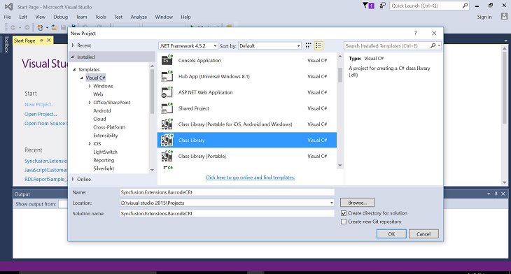
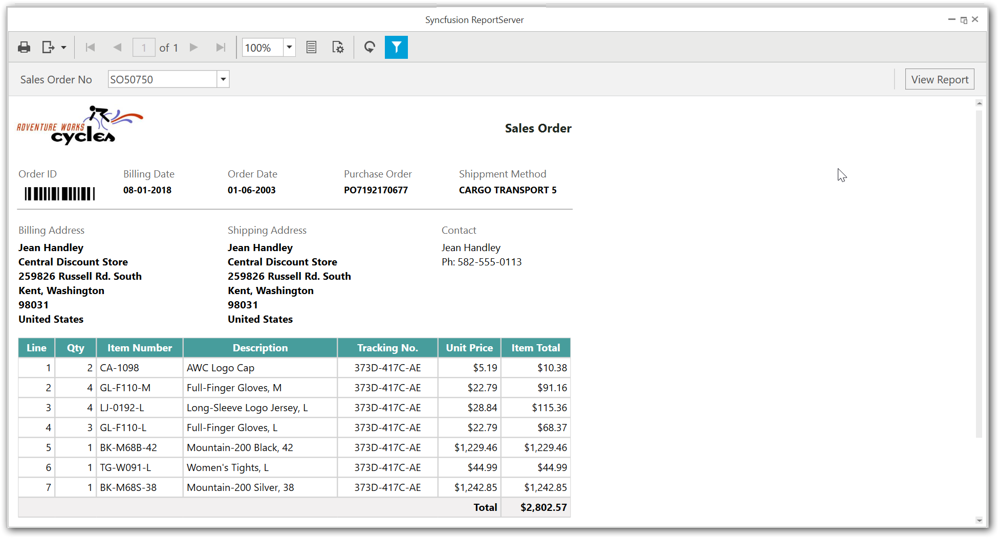

A custom report item allows you to add the functionality that is not natively supported in the RDL or extend the functionality of existing controls in the RDL standard. The run-time component allows to render the custom report item in report viewer.

## Creating a custom report item run-time component

The run-time component of the custom report item is implemented by using CLS-compliant language, and is called by the report processor at run-time. The below section provides detail to create run-time component with the barcode custom report item in report viewer.

### Create report item assembly

1.	Open the Visual Studio and select the class library project type, then name the project as "Syncfusion.Extensions.BarcodeCRI" for the run-time component.
    
2.	Add the reference "Syncfusion.ReportControls.Wpf", "Syncfusion.SfBarcode.WPF" and "Syncfusion.Shared.WPF" for the extension project.
    
    
    N> Refer the above assemblies from the below installed location.For Essential Studio: C:\Program Files (x86)\Syncfusion\Essential Studio{{ site.releaseversion }}\Assemblies   
3.  Add a class "BarcodeCustomReportItem" by inheriting the `ICustomReportItem` interface.

### Implementing the ICustomReportItem interface

To create a CustomReportItem run-time component, you should implement the `ICustomReportItem` interface, it generates the following two method stubs.
<table>
<tr>
<th>Interface methods</th>
<th>Definition</th>
</tr>
<tr>
<td>GenerateReportItemDefinition</td>
<td>Called first and is used for setting definition properties and creating the image object that contains both the definition and instance properties that are used for rendering the item.</td>
</tr>
<tr>
<td>EvaluateReportItemInstance</td>
<td>Called after the definition objects have been evaluated, and it provides the instance objects that will be used for rendering the item.</td>
</tr>
</table>


namespace Syncfusion.Extensions.BarcodeCRI
{
    public class BarcodeCustomReportItem : RDL.Data.ICustomReportItem
    {
        #region ICustomReportItem Members

        public void GenerateReportItemDefinition(CustomReportItem cri)
        {
            //It will create the Image object
            cri.CreateCriImageDefinition();
        }

        public void EvaluateReportItemInstance(CustomReportItem cri)
        {
            Thread thread = new Thread(delegate ()
            {
                RDL.Data.Image imageReportItem = (RDL.Data.Image)cri.GeneratedReportItem;
                imageReportItem.ImageData = DrawImage(cri);
            }, (1024 * 1024 * 64));

            thread.SetApartmentState(ApartmentState.STA);
            thread.Start();
            thread.Join();
        }

        #endregion

        //To create image from custom report item control
        private byte[] DrawImage(CustomReportItem customReportItem)
        {
            try
            {
                byte[] imageData = null;
                SfBarcode barcodeControl = new SfBarcode();
                barcodeControl.Background = new SolidColorBrush(Colors.Transparent);
                barcodeControl.Height = customReportItem.Height.ToPixels();
                barcodeControl.Width = customReportItem.Width.ToPixels();
                barcodeControl.Text = (string)LookupCustomProperty(customReportItem.CustomProperties, "BarcodeValue");
                barcodeControl.InvalidateArrange();
                barcodeControl.UpdateLayout();
                MemoryStream stream = new ImageConversion().CovertToImage(barcodeControl);
                imageData = new byte[(int)stream.Length];
                stream.Seek(0, SeekOrigin.Begin);
                stream.Read(imageData, 0, (int)stream.Length);
                return imageData;
            } 
            catch
            {
                return null;
            }
        }
    }
}


### Convert custom report item as image

The custom report item is rendered as image in report viewer, so that the run-time component need to be converted as an image. The following converter is used to generate the image for rendering.



internal partial class ImageConversion : UserControl
{
    Canvas InnerCanvas;

    public MemoryStream CovertToImage(Control innerControl)
    {
        try
        {
            this.InnerCanvas = new Canvas();
            this.Content = this.InnerCanvas;

            innerControl.Margin = new Thickness(0);
            InnerCanvas.Children.Add(innerControl);

            InnerCanvas.Width = innerControl.Width;
            InnerCanvas.Height = innerControl.Height;

            Canvas canvas = this.InnerCanvas;
            canvas.Measure(new Size((int)canvas.Width, (int)canvas.Height));
            canvas.Arrange(new Rect(new Size((int)canvas.Width, (int)canvas.Height)));

            int Height = ((int)(InnerCanvas.ActualHeight));
            int Width = ((int)(InnerCanvas.ActualWidth));

            this.Height = InnerCanvas.Height;
            this.Width = InnerCanvas.Width;
            InnerCanvas.LayoutTransform = null;

            Size size = new Size(InnerCanvas.ActualWidth, InnerCanvas.ActualHeight);

            InnerCanvas.Background = Brushes.White;
            InnerCanvas.Arrange(new Rect(size));
            InnerCanvas.UpdateLayout();

            RenderTargetBitmap rtb = new RenderTargetBitmap(Width, Height, 300, 300, PixelFormats.Default);
            rtb.Render(InnerCanvas);

            var Source = new MemoryStream();
            BitmapEncoder encoder = new BmpBitmapEncoder();
            encoder.Frames.Add(BitmapFrame.Create(rtb));
            encoder.Save(Source);
            return Source;
        }
        catch
        {
            return null;
        }
    }
}


#### Build project

You can clean and build the extension project, it will generate the run-time component assembly "Syncfusion.Extensions.BarcodeCRI.dll" in the bin folder of the project.

N> You can create a standalone report viewer application with the help of given [Getting Started Documentation.](/wpf/reportviewer/getting-started)

You can download the extension project with barcode custom report item for report viewer from [here](http://www.syncfusion.com/downloads/support/directtrac/general/ze/Syncfusion.Extensions.BarcodeCRI1898349564).

## Deploy a custom report item 

To deploy a custom report item, you must modify the application configuration files or create "ReportExtensions.config" file and copy the run-time component assembly (Syncfusion.Extensions.BarcodeCRI) and its dependent assemblies to the bin folder of your application. The deployment requires configuration to process the extensions, and the following describes about configuration settings.

Create a "ReportExtensions.config" file in your application. The following "configSections" section is mandatory to process the extension in the control, so add it as shown in the following code.


<configSections>
    <section name="ReportingExtensions" type="Syncfusion.Reporting.Extensions,  Syncfusion.ReportControls.WPF" allowLocation="true" allowDefinition="Everywhere" />
</configSections>


You must add the `ReportItem` tag for all newly added custom report item with the following attributes.

<table>
<tr>
<th>Attribute</th>
<th>Description</th>
</tr>
<tr>
<td>Name</td>
<td>Name of your report item that is going to be displayed in the list.</td>
</tr>
<tr>
<td>Assembly</td>
<td>Name of the newly created report item assembly.</td>
</tr>
<tr>
<td>Type</td>
<td>Report item class name with the namespace.</td>
</tr>
</table>


 <ReportingExtensions>
    <ReportItems>
      <ReportItem Name="Barcode" Assembly="Syncfusion.Extensions.BarcodeCRI" Type="Syncfusion.Extensions.BarcodeCRI.BarcodeCustomReportItem" />
    </ReportItems>
  </ReportingExtensions>


After creating the config file, add it to the report viewer application. Run the application, output with the barcode custom report item is rendered as below.

Shows the invoice report rendered with the barcode custom report item.
   {:.caption}	

