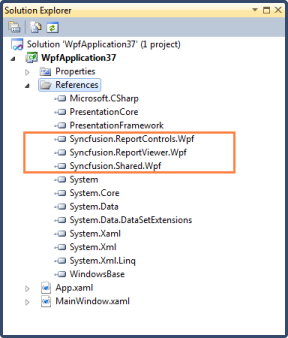

# Show RDL Report in Report Viewer through Code

You can create a simple sample through code with the Syncfusion WPF ReportViewer control by using the following steps.

1. Create a new WPF application in VS2008/VS2010.
2. To add related references to the created application, right-click on References and select Add Reference.
   
   

   Adding References
   {:.caption}

   N> The added references appeared under References folder.
   
   
   
   Added References
   {:.caption}
   
3. Set Grid name in auto generated XAML of MainWindow.

   ~~~xml
   <Window x:Class="WpfApplication13.MainWindow"

   xmlns="http://schemas.microsoft.com/winfx/2006/xaml/presentation" xmlns:x="http://schemas.microsoft.com/winfx/2006/xaml"

   Title=" Mail Merge" Height="350" Width="525">

   <Grid Name="grid1">

   </Grid>

   </Window>

   ~~~
  

4. Add Report Viewer in MainWindowgrid.

   ~~~js
   // ReportViewer control initialization
   
   Syncfusion.Windows.Reports.Viewer.ReportViewer reportViewer1 = new Syncfusion.Windows.Reports.Viewer.ReportViewer();
   // Sets ReportPath to view the Report in ReportViewer.
   
   reportViewer1.ReportPath=@"D:\MailMerge.rdl";
   // Adds ReportViewer in MainWindow grid
   
   this.grid1.Children.Add(reportViewer1);
   
   this.Loaded += (sender, arg) =>
   {
   
   //Renders the Report in ReportViewer.
   
   reportViewer1.RefreshReport();
   
   };
   ~~~
  
5. Run the application. The following output is displayed.

   
   
   Report Viewer Sample RDL demo
   {:.caption}
