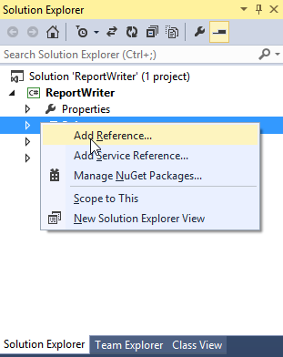
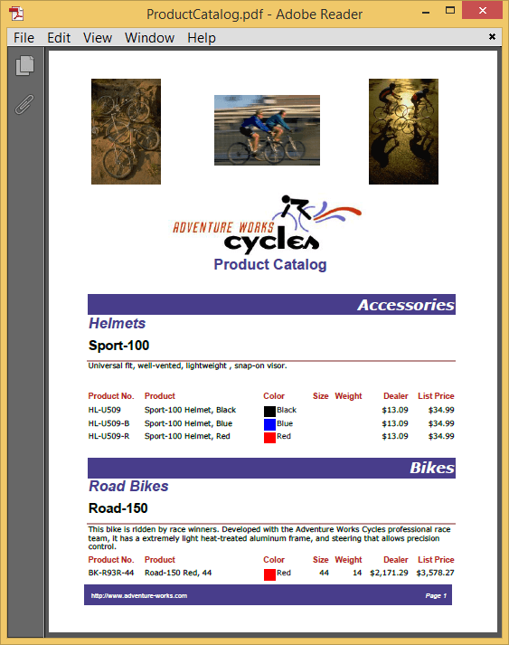
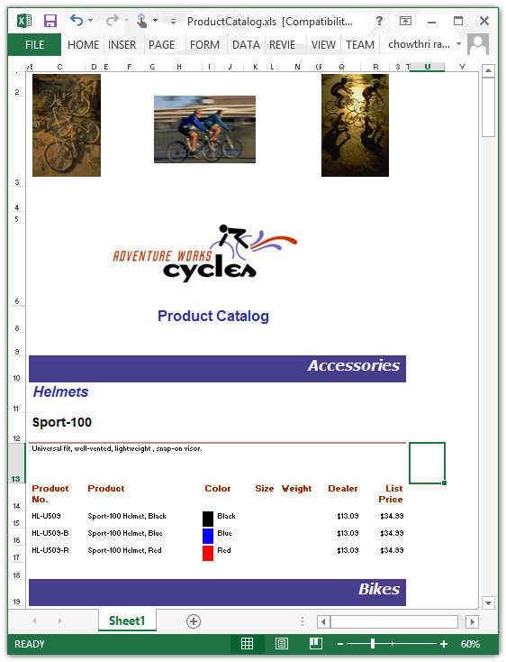
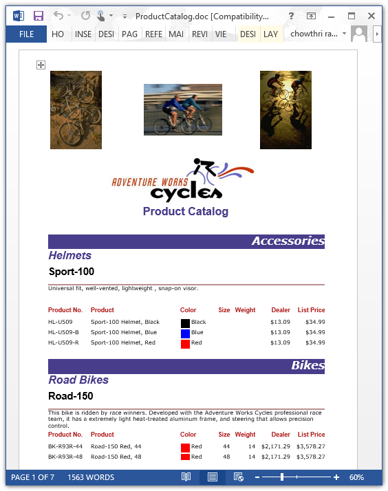

# Getting Started with WPF ReportWriter

## Adding ReportWriter to an application

This section illustrates how to add ReportWriter to the WPF application. It includes the following steps.

1. Create a new WPF application in Visual Studio.

2. In the Solution Explorer, Right-click the References folder and then click Add Reference.

    

3. Add the following references

   * Syncfusion.Chart.Wpf
   * Syncfusion.Compression.Base
   * Syncfusion.DocIO.Base
   * Syncfusion.Gauge.Wpf
   * Syncfusion.Linq.Base
   * Syncfusion.Pdf.Base
   * Syncfusion.ReportControls.Wpf
   * Syncfusion.ReportWriter.Base 
   * Syncfusion.SfMaps.Wpf
   * Syncfusion.Shared.Wpf
   * Syncfusion.XlsIO.Base

   N> Refer the above assemblies from the installed location, C:\Program Files (x86)\Syncfusion\Essential Studio\WPF\{{ site.releaseversion }}\Assemblies
   
4. Set the following properties of ReportWriter.   

   * ReportPath - Set the local file system path of the report.
   
   * ReportProcessingMode - Set ProcessingMode as Remote for RDL report and Local for RDLC report.
   
   * Export format - Set Export format as PDF, Excel, Word or HTML.
   
5. Add the following code to export RDL report to the required export formats.

   ~~~ csharp
   string fileName = null;
   WriterFormat format;
   string reportPath = @"..\ReportTemplate\Product Catalog.rdl";
   
   //Step 1 : Instantiate the report writer with the parameter "ReportPath".
   ReportWriter reportWriter = new ReportWriter(reportPath);
   reportWriter.ReportProcessingMode = ProcessingMode.Remote;
   //Step 2 : Save the report as Pdf or Word or Excel
   if (pdf.IsChecked == true)
   {
       fileName = "ProductCatalog.pdf";
       format = WriterFormat.PDF;
   }
   else if (word.IsChecked == true)
   {
       fileName = "ProductCatalog.doc";
       format = WriterFormat.Word;
   }
   else if (excel.IsChecked == true)
   {
       fileName = "ProductCatalog.xls";
       format = WriterFormat.Excel;
   }
   else
   {
       fileName = "ProductCatalog.html";
       format = WriterFormat.HTML;
   }
   reportWriter.Save(fileName, format);
   ~~~
   
5. Run the application. The following output displays exported report in PDF format.

    

## Export RDL Reports

The ReportWriter allows you to export the RDL report to popular file formats PDF, WORD, EXCEL and HTML. The following code helps you to bind data to ReportWriter.

1. Assign `ReportPath`, `ReportProcessingMode` and `ExportFormat` to ReportWriter.

   ~~~ csharp
   string reportPath = @"..\ReportTemplate\Product Catalog.rdl";
   ReportWriter reportWriter = new ReportWriter(reportPath);
   reportWriter.ReportProcessingMode = ProcessingMode.Remote;
   reportWriter.Save("ProductCatalog.xls", WriterFormat.Excel);
   ~~~
   
2. Run the application. The following output displays exported report in Excel format.

    

## Export RDLC Reports

The ReportWriter allows you to export the RDLC report to popular file formats PDF, WORD, EXCEL and HTML. The following code helps you to bind data to ReportWriter.

1. Assign `ReportPath`, `ReportProcessingMode` and `ExportFormat` to ReportWriter.

   ~~~ csharp
   string reportPath = @"..ReportTemplate\RDLC\ProductCatalog.rdlc";
   ReportWriter reportWriter = new ReportWriter(reportPath, dataSources);
   reportWriter.ReportProcessingMode = ProcessingMode.Local;
   reportWriter.Save("ProductCatalog.doc", WriterFormat.WORD);
   ~~~
   
2. Add data source to the RDLC report.

   ~~~ csharp
   ReportDataSourceCollection dataSources = new ReportDataSourceCollection();
   dataSources.Add(new ReportDataSource { Name = "ProductCatalog", Value = ProductCatalogSource.GetData() });
   ~~~

3. Assign values for the data source which is given in the RDLC.

   ~~~ csharp
   #region ProductCatalog Details
   public class ProductCatalogSource
   {
       public string ProdSubCat { get; set; }
       public string ProdModel { get; set; }
       public string ProdCat { get; set; }
       public string Description { get; set; }
       public string ProdName { get; set; }
       public string ProductNumber { get; set; }
       public string Color { get; set; }
       public string Size { get; set; }
       public double? Weight { get; set; }
       public double? StandardCost { get; set; }
       public string Style { get; set; }
       public string Class { get; set; }
       public double? ListPrice { get; set; }
       public static IList GetData()
       {
           List<ProductCatalogSource> datas = new List<ProductCatalogSource>();
           ProductCatalogSource data = null;
           data = new ProductCatalogSource()
           {
               ProdSubCat = "Road Frames",
               ProdModel = "HL Road Frame",
               ProdCat = "Components",
               Description = "Our lightest and best quality aluminum frame made from the newest alloy; it is welded and heat-treated for strength. Our innovative design results in maximum comfort and performance.",
               ProdName = "HL Road Frame - Black, 58",
               ProductNumber = "FR-R92B-58",
               Color = "Black",
               Size = "58",
               Weight = 2.24,
               StandardCost = 1059.3100,
               Style = "U ",
               Class = "H ",
               ListPrice = 1431.5000
           };
           datas.Add(data);
           data = new ProductCatalogSource()
           {
               ProdSubCat = "Road Frames",
               ProdModel = "HL Road Frame",
               ProdCat = "Components",
               Description = "Our lightest and best quality aluminum frame made from the newest alloy; it is welded and heat-treated for strength. Our innovative design results in maximum comfort and performance.",
               ProdName = "HL Road Frame - Red, 58",
               ProductNumber = "FR-R92R-58",
               Color = "Red",
               Size = "58",
               Weight = 2.24,
               StandardCost = 1059.3100,
               Style = "U ",
               Class = "H ",
               ListPrice = 1431.5000
           };
           datas.Add(data);
           data = new ProductCatalogSource()
           {
               ProdSubCat = "Helmets",
               ProdModel = "Sport-100",
               ProdCat = "Accessories",
               Description = "Universal fit, well-vented, lightweight , snap-on visor.",
               ProdName = "Sport-100 Helmet, Red",
               ProductNumber = "HL-U509-R",
               Color = "Red",
               Size = "",
               Weight = null,
               StandardCost = 13.0863,
               Style = "",
               Class = "",
               ListPrice = 34.9900
           };
           datas.Add(data);
           return datas;
       }
   }
   #endregion
   ~~~
   
4. Run the application. The following output displays exported report in Word format.

    