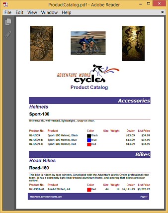
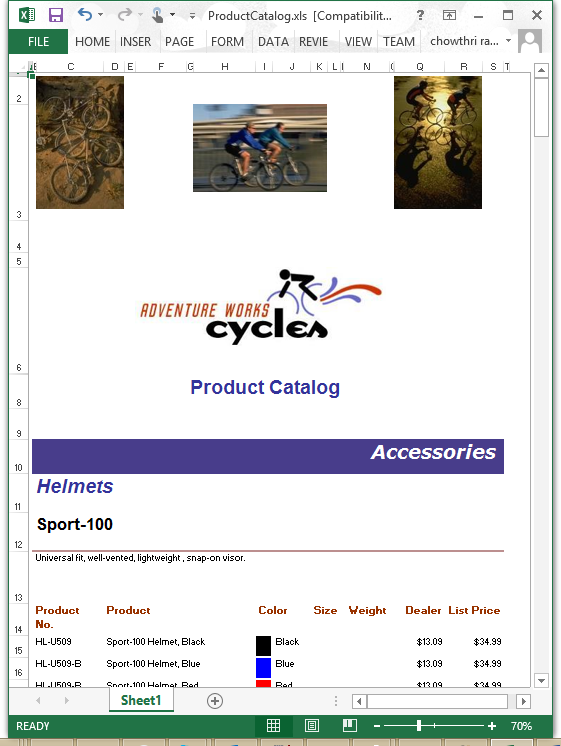
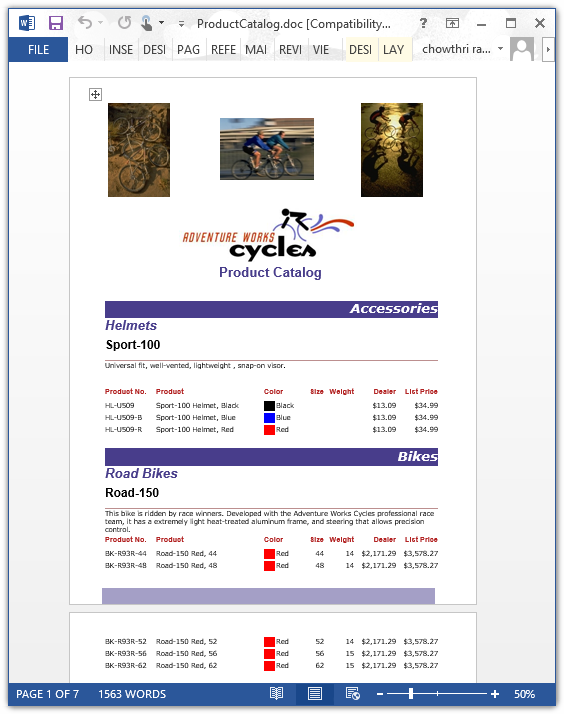
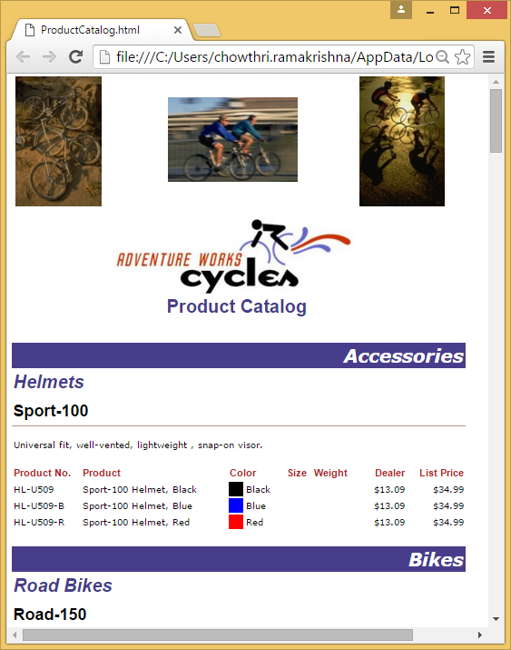

# Saving reports in WPF ReportWriter Control

Essential ReportWriter provides support for saving a report as a PDF, Word, Excel and HTML documents with the help of the class ReportWriter. The report elements such as Tablix, matrices, charts, gauges, shapes, and text boxes are supported in this feature. 

## Saving report as PDF 

The report generated using the ReportDesigner can be exported as a PDF document using the following code.



//Instantiate the report writer with the parameter "ReportPath" and "ReportDataSourceCollection".
ReportWriter reportWriter = new ReportWriter(reportpath, dataSources);
reportWriter.Save("Sample.pdf", WriterFormat.PDF);


'Instantiate the report writer with the parameter "ReportPath" and "ReportDataSourceCollection".
Dim reportWriter As New ReportWriter (reportpath, dataSources)
reportWriter.Save("Sample.pdf", WriterFormat.PDF)



 

## Saving report as Excel 

The report generated using the ReportDesigner can be exported as an Excel document using the following code example. 



//Instantiate the report writer with the parameter "ReportPath" and "ReportDataSourceCollection".
ReportWriter reportWriter = new ReportWriter(reportPath, dataSources);
reportWriter.Save("Sample.xls", WriterFormat.Excel);


'Instantiate the report writer with the parameter "ReportPath" and "ReportDataSourceCollection".
Dim reportWriter As New ReportWriter (reportPath, dataSources)
reportWriter.Save("Sample.xls", WriterFormat.Excel)



 

## Saving report as Word 

The report generated using the ReportDesigner can also be exported as a Word document using the following code example.



// Instantiate the report writer with the parameter "ReportPath" and "ReportDataSourceCollection".
ReportWriter reportWriter = new ReportWriter(reportPath, dataSources);
reportWriter.Save("Sample.doc", WriterFormat.WORD);


'Instantiate the report writer with the parameter "ReportPath" and "ReportDataSourceCollection".
Dim reportWriter As New ReportWriter (reportPath, dataSources)
reportWriter.Save("Sample.doc", WriterFormat.WORD)



 

## Saving report as an HTML 

The report generated using the ReportDesigner can be exported as an HTML document using the following code example. 



//Instantiate the report writer with the parameter "ReportPath" and "ReportDataSourceCollection".
ReportWriter reportWriter = new ReportWriter(reportPath, dataSources);
reportWriter.Save("Sample.html", WriterFormat.HTML);


'Instantiate the report writer with the parameter "ReportPath" and "ReportDataSourceCollection".
Dim reportWriter As New ReportWriter (reportPath, dataSources)
reportWriter.Save("Sample.html", WriterFormat.HTML)



 