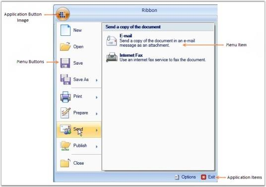

# Adding Application Items to the Application Menu

Application Items are the items that are displayed in the right pane of the Application menu. Application Items are used to add items like recently used programs, Recent Documents, and so on. The following lines of code are used to add Application Items to the Application Menu.

[XAML]

&lt;ribbon:ApplicationMenu.ApplicationItems&gt;

  &lt;ribbon:ButtonPanel Margin="5,0,5,0"&gt;

    &lt;ribbon:RibbonButton SizeForm = "Small" Label="Options SmallIcon="SampleImages/Options.png"/&gt;

  &lt;/ribbon:ButtonPanel&gt;

  &lt;ribbon:ButtonPanel&gt;

    &lt;ribbon:RibbonButton SizeForm = "Small" Label="Exit" Command="ApplicationCommands.Close" SmallIcon="SampleImages/Exit.png"/&gt;

  &lt;/ribbon:ButtonPanel&gt;

&lt;/ribbon:ApplicationMenu.ApplicationItems&gt;

{  | markdownify }
{:.image }

See Also

Adding Application Menu to the Ribbon Window, Adding Items to the Application Menu

