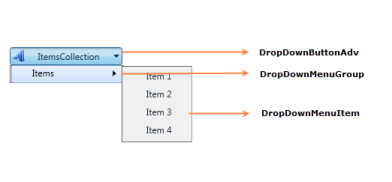
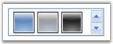

# Adding Controls to the Ribbon Instance

This section illustrates how to add the following controls to the Ribbon instance.

## MenuButton

MenuButton control is used in the menu bars to display items. It can have sub menu items. The following code snippets are used to add a MenuButton control to the application. This control when added outside the ribbon instance will not have desired look and feel.

[XAML]

<ribbon:MenuButton Label="Prepare" Icon="SampleImages/Prepare32.png" >

  <ribbon:ApplicationMenuGroup Header="Prepare document for distribution">

    <ribbon:SimpleMenuButton Label="Properties" Description="View and edit document properties, such as Title, Author. and Keywords."  Icon="SampleImages/Properties32.png"/>

    <ribbon:SimpleMenuButton Label="Inspect Document" Description="Checks the document for hidden metadata or personal information"  Icon="SampleImages/InspectDocument32.png"/>

    <ribbon:SimpleMenuButton Label="Encrypt Document" Description="Increase the security of the document by adding encryption"  Icon="SampleImages/EncryptDocument32.png"/>

    <ribbon:MenuButton Label="Restrict Permissions" Description="Grant people access while restricting their ability to edit, copy, and print."

Icon="SampleImages/RestrictPermissions32.png">

    <ribbon:RibbonMenuItem Header="Unrestricted Access" IsChecked="True" IsCheckable="True"/>

    <ribbon:RibbonMenuItem Header="Restricted Access" IsChecked="False" IsCheckable="True"/>

  </ribbon:ApplicationMenuGroup>

</ribbon:MenuButton>

{{ '' | markdownify }}
{:.image }

### DropDownMenuItem

The DropDownButtonAdv control contains the DropDownMenuGroups container. DropDownMenuGroups is nothing but a collection of items, which uses DropDownMenuItem.

The following image gives you an idea of the hierarchy and appearance of the DropDownMenuItem:

{{ '' | markdownify }}
{:.image }

#### Adding DropDownMenuItem to a WPF project

You have two ways in which you could add the DropDownMenuItem to the WPF project, depending on your requirement. Both require you to add the DropDownMenuGroup to the DropDownButtonAdv.

##### Creating DropDownMenuItem Control for a single item

You can create a DropDownMenuItem control either by using XAML code or C# code. 
Here is the code you will need to use to create a DropDownMenuItem control for a single item in the DropDownMenuGroup:

<table>
<tr>
<td>
[XAML]<!-- Adding DropDownMenuItem --><sync:DropDownMenuItem Header="Item 1"></sync:DropDownMenuItem></td></tr>
<tr>
<td>
[C#]// Creating an instance of TabSplitterDropDownMenuItem drop = new DropDownMenuItem(); // Adding DropDownMenuItem to DropDownMenuGroup DropDownMenuGroup dgrp = new DropDownMenuGroup();dgrp.Items.Add(drop);</td></tr>
</table>

##### Adding DropDownMenuItem to the DropDownMenuGroup 

DropDownMenuGroup contains one or more items that are defined as DropDownMenuItem Items. 

You will have to use the following code to add a DropDownMenuItem to the DropDownMenuGroup control:

<table>
<tr>
<td>
[XAML] <!-- Adding DropDownMenuItem -->  <sync:DropDownMenuGroup Width="150">            <sync:DropDownMenuItem Header="Items">            <sync:DropDownMenuItem Header="Item 1"></sync:DropDownMenuItem>            <sync:DropDownMenuItem Header="Item 2"></sync:DropDownMenuItem>            <sync:DropDownMenuItem Header="Item 3"></sync:DropDownMenuItem>            <sync:DropDownMenuItem Header="Item 4"></sync:DropDownMenuItem>            </sync:DropDownMenuItem>  </sync:DropDownMenuGroup></td></tr>
<tr>
<td>
[C#]// Creating an instance of DropDownMenuItemDropDownMenuItem drop = new DropDownMenuItem();// Adding DropDownMenuItem inside DropDownMenuItemdrop.Items.Add(new DropDownMenuItem());drop.Items.Add(new DropDownMenuItem());drop.Items.Add(new DropDownMenuItem());drop.Items.Add(new DropDownMenuItem());// Adding DropDownMenuItem inside DropDownMenuGroupDropDownMenuGroup dgrp = new DropDownMenuGroup();dgrp.Items.Add(drop);</td></tr>
</table>

##### Adding DropDownMenuGroup to the DropDownButtonAdv Control

In order to add the DropDownMenuGroup to the DropDownButtonAdv control, use the following code:

<table>
<tr>
<td>
[XAML] <!-- Adding DropDownMenuGroup in DropDownButtonAdv -->   <sync:DropDownButtonAdv Label="ItemsCollection" Width="150"    IsMultiLine="True">            <sync:DropDownMenuGroup Width="150">            <sync:DropDownMenuItem Header="Items">            <sync:DropDownMenuItem Header="Item 1"></sync:DropDownMenuItem>            <sync:DropDownMenuItem Header="Item 2"></sync:DropDownMenuItem>            <sync:DropDownMenuItem Header="Item 3"></sync:DropDownMenuItem>            <sync:DropDownMenuItem Header="Item 4"></sync:DropDownMenuItem>            </sync:DropDownMenuItem>            </sync:DropDownMenuGroup>   </sync:DropDownButtonAdv></td></tr>
<tr>
<td>
[C#]// Creating an instance of DropDownMenuItemDropDownMenuItem drop = new DropDownMenuItem();// Adding DropDownMenuItem inside DropDownMenuItemdrop.Items.Add(new DropDownMenuItem());drop.Items.Add(new DropDownMenuItem());drop.Items.Add(new DropDownMenuItem());drop.Items.Add(new DropDownMenuItem());// Adding DropDownMenuItem inside DropDownMenuGroupDropDownMenuGroup dgrp = new DropDownMenuGroup();dgrp.Items.Add(drop);// Adding DropDownGroup inside DropDownButtonAdvDropDownButtonAdv dbtn = new DropDownButtonAdv();dbtn.Content = dbtn;</td></tr>
</table>

#### Properties, Methods and Events tables

Properties

_Property table:_

<table>
<tr>
<td>
Property </td><td>
Description </td><td>
Type </td><td>
Values accepted </td><td>
Reference links </td></tr>
<tr>
<td>
DropDirection </td><td>
DropDirection property is used for the popup position that should be displayed in DropDownMenuAdv control.</td><td>
Enum </td><td>
* BottomLeft* BottomRight* Left* Right* TopLeft* TopRight</td><td>
 NA</td></tr>
<tr>
<td>
IsDropDown</td><td>
IsDropDown property is a Boolean property that is used for the popup that should be in Open state or in closed state by default</td><td>
Boolean</td><td>
* True- (Open)* False- (closed) Default is Closed</td><td>
NA</td></tr>
</table>

This is the code that you will need to use in order to create a DropDownMenuItem on the right of a DropDownAdv control. It uses the DropDirection property:

[XAML]

 <!-- Adding DropDirection Proerty in DropDownButtonAdv -->

   <sync:DropDownButtonAdv Label="ItemsCollection" Width="150" DropDirection="Right">

            <sync:DropDownMenuGroup Width="150">

            <sync:DropDownMenuItem Header="Items">

            <sync:DropDownMenuItem Header="Item 1"></sync:DropDownMenuItem>

            <sync:DropDownMenuItem Header="Item 2"></sync:DropDownMenuItem>

            <sync:DropDownMenuItem Header="Item 3"></sync:DropDownMenuItem>

            <sync:DropDownMenuItem Header="Item 4"></sync:DropDownMenuItem>

            </sync:DropDownMenuItem>

            </sync:DropDownMenuGroup>

   </sync:DropDownButtonAdv>

Here is the code that you will use in order to keep the dropdown menu open. It uses the IsDropDown property:

[XAML]

 <!-- Adding IsDropDown Proerty in DropDownButtonAdv -->

   <sync:DropDownButtonAdv Label="ItemsCollection" Width="150" IsDropDownOpen="True">

            <sync:DropDownMenuGroup Width="150">

            <sync:DropDownMenuItem Header="Items">

            <sync:DropDownMenuItem Header="Item 1"></sync:DropDownMenuItem>

            <sync:DropDownMenuItem Header="Item 2"></sync:DropDownMenuItem>

            <sync:DropDownMenuItem Header="Item 3"></sync:DropDownMenuItem>

            <sync:DropDownMenuItem Header="Item 4"></sync:DropDownMenuItem>

            </sync:DropDownMenuItem>

            </sync:DropDownMenuGroup>

  </sync:DropDownButtonAdv>

Methods

The methods from the ItemsControl base class are applicable for this control.

Events

The events from the ItemsControl base class are applicable for this control.

## SplitButton

Split Button in the Ribbon instance enables to display a menu when the split button is clicked. This also enables to perform multiple operations by using a button. The Split Button contains a drop arrow, when clicked on it; the menu related to the button is displayed.

<table>
<tr>
<td>
[XAML]<ribbon:SplitButton Label=" Split1 " Command="sample:SampleCommands.CustomCommand" SizeForm="Small"  HitTestArea="ImageOnly"   SmallIcon="SampleImages/TextHighlight.png" /><ribbon:SplitButton Label=" Split2 " Command="sample:SampleCommands.CustomCommand" SizeForm="Small" SmallIcon="SampleImages/TextHighlight.png" /></td></tr>
<tr>
<td>
[C#]SplitButton splitbutton = new SplitButton();splitbutton.Label = "Split 1";SplitButton splitbutton 1= new SplitButton();splitbutton1.Label = "Split 2";</td></tr>
</table>

{{ '' | markdownify }}
{:.image }

In SplitButton, which is more preferable, RibbonButton or RibbonMenuItem?

In SplitButton, RibbonButton is more preferable since it has "Toggle" and "IsChecked" options. RibbonMenuItem is more applicable for Application Menus.

## SplitMenuButton

SplitMenuButton is similar to MenuButton. It is used to perform multiple operations. Events are raised, when main menubutton is clicked as well as when the sub item in the splitmenubutton is clicked. The following lines of code can be used to add a splitmenubutton control.

[XAML]

<ribbon:SplitMenuButton Label="Save As" Icon="/SampleImages/SaveAs32.png">

<ribbon:ApplicationMenuGroup Header="Header1" IconBarEnabled="True">

<ribbon:RibbonButton SizeForm = "Small" Label="Item1"

SmallIcon="SampleImages/Document32.png"/>

<ribbon:RibbonButton SizeForm = "Small" Label="Item3" SmallIcon="SampleImages/Save32.png"/>

<ribbon:RibbonButton SizeForm = "Small" Label="Item4" SmallIcon="SampleImages/Close32.png"/>

<ribbon:RibbonButton SizeForm = "Small" Label="Item5"	 SmallIcon="SampleImages/Print32.png"/>

<ribbon:RibbonButton SizeForm = "Small" Label="Item6" SmallIcon="SampleImages/Open32.png"/>

</ribbon:ApplicationMenuGroup>

</ribbon:SplitMenuButton>

{{ '' | markdownify }}
{:.image }

## SimpleMenuButton

The difference between the other menu button and SimpleMenuButton is that it cannot have a sub menu. The following code snippet is used to add a SimpleMenuButton. This control when added outside the ribbon instance will not have the desired appearance.

[XAML]

<ribbon:SimpleMenuButton Label="New" Icon="/SampleImages/Document32.png"/>

{{ '' | markdownify }}
{:.image }

## RibbonMenuItem

RibbonMenuItems are used as entities in menus like ApplicationMenu, Split Button Menu, context menu, and so on. RibbonMenuItems are used to perform operations when selected. The following code snippet is used to add a RibbonMenuItem to the Ribbon.

<table>
<tr>
<td>
[XAML]<ribbon:RibbonMenuItem  Header="Paste" IsCheckable="True" Command="ApplicationCommands.Paste"><ribbon:RibbonMenuItem.Icon><Image Source="SampleImages/Paste16.png"/></ribbon:RibbonMenuItem.Icon></ribbon:RibbonMenuItem></td></tr>
<tr>
<td>
[C#]RibbonMenuItem menuitem = new RibbonMenuItem();menuitem.Header = "Paste";menuitem.Icon = new BitmapImage(new Uri("/Images/Paste16.Png", UriKind.Relative));</td></tr>
</table>

{{ '' | markdownify }}
{:.image }

## RibbonTextBox

RibbonTextBox control is similar to a normal text box. RibbonTextBox has all the functionalities of an Office2007 UI Text box. This control is added using the following code snippet.

<table>
<tr>
<td>
[XAML]<ribbon:RibbonTextBox> Ribbon Text Box </ribbon:RibbonTextBox></td></tr>
<tr>
<td>
[C#]RibbonTextBox textbox = new RibbonTextBox();textbox.Text = "Ribbon textbox";</td></tr>
</table>

{{ '' | markdownify }}
{:.image }

## RibbonComboBox

RibbonComboBox control is used to display the list of items, as drop-down menu in Ribbon instance. You can add any number of items to the RibbonComboBox. The following lines of code can be used to add RibbonComboBox and items to RibbonComboBox respectively.

<table>
<tr>
<td>
[XAML]<ribbon:RibbonComboBox Width="100" IsEditable="True" ><ComboBoxItem>Arial</ComboBoxItem><ComboBoxItem>Tahoma</ComboBoxItem><ComboBoxItem>Verdana</ComboBoxItem></ribbon:RibbonComboBox></td></tr>
<tr>
<td>
[C#]RibbonComboBox combo = new RibbonComboBox();ComboBoxItem item1 = new ComboBoxItem();item1.Content = "Arial";combo.Items.Add(item1);ComboBoxItem item2 = new ComboBoxItem();item2.Content = "Tahoma";combo.Items.Add(item2);ComboBoxItem item3 = new ComboBoxItem();item3.Content = "Verdana";combo.Items.Add(item3);</td></tr>
</table>

{{ '' | markdownify }}
{:.image }

## RibbonCheckBox

RibbonCheckBox control is similar to a normal check box control. It is used to select or unselect options from the users. RibbonCheckBox is added to the RibbonWindow using the following code.

<table>
<tr>
<td>
[XAML]<ribbon:RibbonCheckBox Content="Check box" ></ribbon:RibbonCheckBox></td></tr>
<tr>
<td>
[C#]RibbonCheckBox checkbox = new RibbonCheckBox();checkbox.Content = "Check box";</td></tr>
</table>

{{ '' | markdownify }}
{:.image }

## RibbonRadioButton

RibbonRadioButton control is used to select options among a group. RibbonRadioButton has similar set of functionalities as in WPF controls. A RibbonRadioButton is added to the application using the following code snippet.

<table>
<tr>
<td>
[XAML]<ribbon:RibbonRadioButton Content="Radio button 1" ></ribbon:RibbonRadioButton></td></tr>
<tr>
<td>
[C#]RibbonRadioButton radiobutton = new RibbonRadioButton();radiobutton.Content = "Radio Button 1";</td></tr>
</table>

{{ '' | markdownify }}
{:.image }

## RibbonListBox

RibbonListBox control is used to display a list of items in a Ribbon instance. You can add any type of content as RibbonListBox items. 

To add this control is to the application, use the following code snippet. 

<table>
<tr>
<td>
[XAML]<ribbon:RibbonListBox Width="128" Height="36"><ComboBoxItem><StackPanel Orientation="Horizontal"><Image Source="SampleImages/SchemeBlue.png"/><Image Source="SampleImages/SchemeSilver.png"/><Image Source="SampleImages/SchemeBlack.png"/></StackPanel></ComboBoxItem></ribbon:RibbonListBox></td></tr>
<tr>
<td>
[C#]RibbonListBox listbox = new RibbonListBox();ComboBoxItem item = new ComboBoxItem();item.Content = "Item1";listbox.Items.Add(item);</td></tr>
</table>

{{ '' | markdownify }}
{:.image }

## RibbonStatusBar

RibbonStatusBar control is added to a RibbonWindow to display the current status of the application. The following code snippet can be used to add a status bar to the RibbonWindow.

[XAML]

<ribbon:RibbonWindow.StatusBar>

<ribbon:RibbonStatusBar>

<TextBlock VerticalAlignment="Center" Margin="7,3,0,0" Foreground="{Binding 					Path=Foreground, Mode=OneWay, RelativeSource={RelativeSource FindAncestor, 					AncestorType={x:Type ribbon:RibbonStatusBar}}}">Ready</TextBlock>

</ribbon:RibbonStatusBar>

</ribbon:RibbonWindow.StatusBar>

{{ '' | markdownify }}
{:.image }

## Ribbon TabPanelItem

This section elaborates about the supports provided by Ribbon TabPanelItem. The TabPanalItem property is used to set the buttons at the right of the Ribbon Window.

Structure

The _TabPanelItem_ is located at the right corner below the main window close button in the following screen shot.

{{ '' | markdownify }}
{:.image }

Configuring Ribbon TabPanelItem

This following code snippet explains how to create and configure _TabPanelItem_.

XAML

<syncfusion:Ribbon.TabPanelItem>

<syncfusion:RibbonButton SizeForm="ExtraSmall" SmallIcon="help16.png" />

</syncfusion:Ribbon.TabPanelItem>

The Collapse button is visible in Office2010Blue, Office2010Silver, Office2010Black and later themes.

