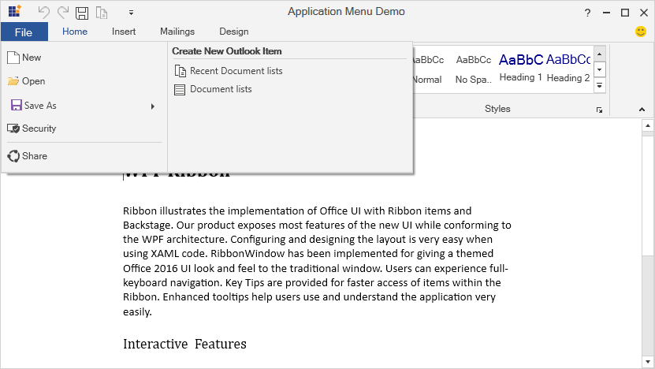

# Application Menu in WPF Ribbon

The [`ApplicationMenu`](https://help.syncfusion.com/cr/wpf/Syncfusion.Windows.Tools.Controls.ApplicationMenu.html) can be added by using [`ApplicationMenu`](https://help.syncfusion.com/cr/wpf/Syncfusion.Windows.Tools.Controls.Ribbon.html#Syncfusion_Windows_Tools_Controls_Ribbon_ApplicationMenu) property of Ribbon. To show the [`ApplicationMenu`](https://help.syncfusion.com/cr/wpf/Syncfusion.Windows.Tools.Controls.ApplicationMenu.html), click the **FILE** button in Ribbon like in Microsoft Outlook.

The [`IsPopupOpen`](https://help.syncfusion.com/cr/wpf/Syncfusion.Windows.Tools.Controls.ApplicationMenu.html#Syncfusion_Windows_Tools_Controls_ApplicationMenu_IsPopupOpen) boolean property is used to show the [`ApplicationMenu`](https://help.syncfusion.com/cr/wpf/Syncfusion.Windows.Tools.Controls.ApplicationMenu.html) while launching itself.

N> The [`BackStage`](https://help.syncfusion.com/cr/wpf/Syncfusion.Windows.Tools.Controls.Ribbon.html#Syncfusion_Windows_Tools_Controls_Ribbon_BackStage) is not applicable when the ApplicationMenu is needed.

## Adding MenuItems in ApplicationMenu

[`MenuItems`](https://help.syncfusion.com/cr/wpf/Syncfusion.Windows.Tools.Controls.ApplicationMenu.html#Syncfusion_Windows_Tools_Controls_ApplicationMenu_MenuItems) are displayed in right of the [`ApplicationMenu`](https://help.syncfusion.com/cr/wpf/Syncfusion.Windows.Tools.Controls.ApplicationMenu.html). Different [`MenuItems`](https://help.syncfusion.com/cr/wpf/Syncfusion.Windows.Tools.Controls.ApplicationMenu.html#Syncfusion_Windows_Tools_Controls_ApplicationMenu_MenuItems) are added to an application menu using its [`MenuItems`](https://help.syncfusion.com/cr/wpf/Syncfusion.Windows.Tools.Controls.ApplicationMenu.html#Syncfusion_Windows_Tools_Controls_ApplicationMenu_MenuItems) property.





<syncfusion:RibbonWindow
    x:Class="ApplicationMenu.MainWindow"
    xmlns="http://schemas.microsoft.com/winfx/2006/xaml/presentation"
    xmlns:x="http://schemas.microsoft.com/winfx/2006/xaml"
    xmlns:interactivity="http://schemas.microsoft.com/xaml/behaviors"
    xmlns:syncfusion="http://schemas.syncfusion.com/wpf"
    xmlns:syncfusionskin="clr-namespace:Syncfusion.SfSkinManager;assembly=Syncfusion.SfSkinManager.WPF"
    xmlns:system="clr-namespace:System;assembly=mscorlib"
    xmlns:local="clr-namespace:ApplicationMenu"
    xmlns:tools="clr-namespace:Syncfusion.Windows.Tools;assembly=Syncfusion.Tools.Wpf"
    Width="1100" Height="700"
    Title="Application Menu Demo"
    syncfusionskin:SfSkinManager.Theme="{syncfusionskin:SkinManagerExtension ThemeName=Office2019Colorful}"
    WindowStartupLocation="CenterScreen">
    <syncfusion:RibbonWindow.DataContext>
        <local:ViewModel />
    </syncfusion:RibbonWindow.DataContext>
    <syncfusion:RibbonWindow.Resources>
        <syncfusion:ColorToBrushConverter x:Key="ColorToBrushConverter" />
        <syncfusion:RibbonContextMenu
            x:Key="GalleryContextMenu"
            x:Name="contextMenu"
            ItemsSource="{Binding}">
            <syncfusion:RibbonMenuItem
                Command="{Binding ButtonCommand}"
                Header="Apply Style"
                IconBarEnabled="True" />
            <syncfusion:RibbonMenuItem
                Command="{Binding RemoveStyleCommand}"
                Header="Remove from Style Gallery"
                IconBarEnabled="True" />
            <Separator />
            <syncfusion:RibbonMenuItem
                Command="{Binding MinimizeRibbonCommand}"
                Header="Minimize Ribbon"
                IconBarEnabled="True" />
        </syncfusion:RibbonContextMenu>
    </syncfusion:RibbonWindow.Resources>
    <Grid>
        <Grid.RowDefinitions>
            <RowDefinition Height="Auto" />
            <RowDefinition Height="*" />
        </Grid.RowDefinitions>
        <Grid.Resources>
            <ResourceDictionary>
                <ResourceDictionary.MergedDictionaries>
                    <ResourceDictionary Source="/ApplicationMenu;component/Assets/Ribbon/PathIcon.xaml"/>
                </ResourceDictionary.MergedDictionaries>
            </ResourceDictionary>
        </Grid.Resources>
        <Grid x:Name="ribbonGrid">
            <syncfusion:Ribbon
                Name="mainRibbon"
                local:ViewModel.Ribbon="{Binding ElementName=mainRibbon}"
                syncfusion:Ribbon.IsAutoSizeFormEnabled="True"
                BackStageCornerImageVisibility="Collapsed"
                BackStageHeader="File" EnableMoreCommands="True" ShowCustomizeRibbon="True">
                <syncfusion:Ribbon.ApplicationMenu>
                    <syncfusion:ApplicationMenu
                        Name="_applicationMenu"
                        Width="38"
                        Height="38"
                        IsBelowAppButton="True"
                        syncfusion:Ribbon.KeyTip="F"
                        ApplicationButtonImage="/ApplicationMenu;component/Assets/Ribbon/App.ico"
                        IsPopupOpen="False">
                        <syncfusion:RibbonButton
                            Width="200" Height="30" Label="New"
                            SizeForm="Small" Command="local:RibbonCommand.ButtonCommand"
                            IconTemplate="{StaticResource New}"/>
                        <syncfusion:RibbonButton
                            Width="200" Height="30" Command="local:RibbonCommand.OpenCommand"
                            Label="Open" SizeForm="Small"  SmallIcon="/ApplicationMenu;component/Assets/Ribbon/Open32.png"/>
                        <syncfusion:SplitMenuButton
                            Width="200" Height="30" Label="Save As"
                            Icon="/ApplicationMenu;component/Assets/Ribbon/Save_20.png">
                            <syncfusion:ApplicationMenuGroup Header="Save in another format" IconBarEnabled="False">
                                <syncfusion:RibbonButton
                                    Height="30" Label="DOC Files" SizeForm="Small"
                                    Command="local:RibbonCommand.SaveAsCommand" IconTemplate="{StaticResource DOC}"/>
                                <syncfusion:RibbonButton
                                    Height="30" Label="PDF Files" SizeForm="Small"
                                    Command="local:RibbonCommand.SaveAsCommand" IconTemplate="{StaticResource PDF}"/>
                                <syncfusion:RibbonButton
                                    Height="30" Label="XLS Files" SizeForm="Small"
                                    Command="local:RibbonCommand.SaveAsCommand" IconTemplate="{StaticResource XLS}"/>
                                <syncfusion:RibbonButton
                                    Height="30" Label="ZIP Files" SizeForm="Small"
                                    Command="local:RibbonCommand.SaveAsCommand" IconTemplate="{StaticResource ZIP}"/>
                            </syncfusion:ApplicationMenuGroup>
                        </syncfusion:SplitMenuButton>
                        <syncfusion:RibbonButton
                            Width="200" Height="30" Label="Security" SizeForm="Small"
                            Command="local:RibbonCommand.ButtonCommand" IconTemplate="{StaticResource Security}"/>
                        <Separator />
                        <syncfusion:RibbonButton
                            Width="200" Height="30" Label="Share" Command="local:RibbonCommand.ButtonCommand"
                            SizeForm="Small" IconTemplate="{StaticResource Sharing}"/>
                        <syncfusion:ApplicationMenu.MenuItems>
                            <TextBlock MinWidth="300" FontWeight="Bold">Create New Outlook Item</TextBlock>
                            <Separator />
                            <syncfusion:SimpleMenuButton Label="Recent Document lists" Command="local:RibbonCommand.ButtonCommand" IconTemplate="{StaticResource Copy}"/>
                            <syncfusion:SimpleMenuButton Label="Document lists" Command="local:RibbonCommand.ButtonCommand" IconTemplate="{StaticResource OnePage}"/>
                        </syncfusion:ApplicationMenu.MenuItems>
                    </syncfusion:ApplicationMenu>
                </syncfusion:Ribbon.ApplicationMenu>
                <syncfusion:Ribbon.TabPanelItem>
                    <syncfusion:RibbonButton SizeForm="ExtraSmall" SmallIcon="/ApplicationMenu;component/Assets/Ribbon/Smile16.png" />
                </syncfusion:Ribbon.TabPanelItem>
                <syncfusion:Ribbon.QuickAccessToolBar>
                    <syncfusion:QuickAccessToolBar>
                        <syncfusion:QuickAccessToolBar.QATMenuItems>
                            <syncfusion:RibbonButton syncfusion:RibbonCommandManager.SynchronizedItem="Save" Label="Save" />
                            <syncfusion:RibbonButton syncfusion:RibbonCommandManager.SynchronizedItem="Quick Print" Label="Quick Print" />
                            <syncfusion:RibbonButton syncfusion:RibbonCommandManager.SynchronizedItem="Print Preview" Label="Print Preview" />
                            <syncfusion:RibbonButton syncfusion:RibbonCommandManager.SynchronizedItem="Undo" Label="Undo" />
                            <syncfusion:RibbonButton syncfusion:RibbonCommandManager.SynchronizedItem="Redo" Label="Redo" />
                            <syncfusion:RibbonButton syncfusion:RibbonCommandManager.SynchronizedItem="Paste" Label="Paste" />
                        </syncfusion:QuickAccessToolBar.QATMenuItems>
                        <syncfusion:RibbonButton
                            Width="24"
                            Height="24"
                            syncfusion:RibbonCommandManager.SynchronizedItem="Undo"
                            Command="ApplicationCommands.Undo"
                            Label="Undo"
                            SizeForm="ExtraSmall"
                            IconTemplate="{StaticResource Undo}"
                            ToolTip="Undo">
                        </syncfusion:RibbonButton>
                        <syncfusion:RibbonButton
                            Width="24"
                            Height="24"
                            syncfusion:RibbonCommandManager.SynchronizedItem="Redo"
                            Command="ApplicationCommands.Redo"
                            IconTemplate="{StaticResource Redo}"
                            Label="Redo"
                            SizeForm="ExtraSmall"
                            ToolTip="Redo"/>
                        <syncfusion:RibbonButton
                            Width="24"
                            Height="24"
                            syncfusion:RibbonCommandManager.SynchronizedItem="Save"
                            Command="{Binding ButtonCommand}"
                            Label="Save"
                            IconTemplate="{StaticResource Save}" 
                            SizeForm="ExtraSmall"/>
                        <syncfusion:RibbonButton
                            Width="24"
                            Height="24"
                            syncfusion:RibbonCommandManager.SynchronizedItem="Copy"
                            Label="Copy"
                            Command="ApplicationCommands.Copy"
                            SizeForm="ExtraSmall"
                            ToolTip="Copy"
                            IconTemplate="{StaticResource Copy}">
                        </syncfusion:RibbonButton>
                    </syncfusion:QuickAccessToolBar>
                </syncfusion:Ribbon.QuickAccessToolBar>
                <syncfusion:RibbonTab
                    syncfusion:Ribbon.KeyTip="H"
                    Caption="Home"
                    IsChecked="True">
                    <syncfusion:RibbonBar
                        Name="formatBarClipBoard" syncfusion:Ribbon.KeyTip="FN"
                        syncfusion:Ribbon.ShowInMoreCommands="True" Header="Clipboard">
                        <interactivity:Interaction.Triggers>
                            <interactivity:EventTrigger EventName="LauncherClick">
                                <interactivity:InvokeCommandAction Command="{Binding Path=ButtonCommand}" />
                            </interactivity:EventTrigger>
                        </interactivity:Interaction.Triggers>
                        <syncfusion:RibbonButton
                            syncfusion:Ribbon.KeyTip="CP" syncfusion:RibbonCommandManager.SynchronizedItem="Paste"
                            Command="ApplicationCommands.Paste" IconTemplate="{StaticResource Paste}" Label="Paste" SizeForm="Large">
                            <syncfusion:RibbonButton.ToolTip>
                                <syncfusion:ScreenTip Content="Paste the contents of clipboard." Description="Paste (Ctrl+V)" />
                            </syncfusion:RibbonButton.ToolTip>
                        </syncfusion:RibbonButton>
                        <syncfusion:RibbonButton
                            x:Name="cut" HorizontalAlignment="Left" syncfusion:Ribbon.KeyTip="CT" Command="ApplicationCommands.Cut"                            
                            IconTemplate="{StaticResource Cut}" Label="Cut" SizeForm="Small">
                            <syncfusion:RibbonButton.ToolTip>
                                <syncfusion:ScreenTip Description="Cut (Ctrl+X)">
                                    <TextBlock
                                        Width="130" HorizontalAlignment="Left" Text="Cut the selection and put it on the clipboard."
                                        TextWrapping="Wrap" />
                                </syncfusion:ScreenTip>
                            </syncfusion:RibbonButton.ToolTip>
                        </syncfusion:RibbonButton>
                        <syncfusion:RibbonButton
                            x:Name="copy" HorizontalAlignment="Left" syncfusion:Ribbon.KeyTip="CY" Command="ApplicationCommands.Copy"                            
                            IconTemplate="{StaticResource Copy}" Label="Copy" SizeForm="Small">
                            <syncfusion:RibbonButton.ToolTip>
                                <syncfusion:ScreenTip Description="Copy (Ctrl+C)">
                                    <TextBlock Width="130" HorizontalAlignment="Left" Foreground="#FF4C4C4C"
                                        Text="Copy the selection and put it on the clipboard." TextWrapping="Wrap" />
                                </syncfusion:ScreenTip>
                            </syncfusion:RibbonButton.ToolTip>
                        </syncfusion:RibbonButton>
                        <syncfusion:RibbonButton
                            x:Name="formatPainter" syncfusion:Ribbon.KeyTip="CR" Command="{Binding ButtonCommand}"
                            IconType="VectorImage" Label="Format Painter" SizeForm="Small" IconTemplate="{StaticResource FormatPainter}">
                            <syncfusion:RibbonButton.ToolTip>
                                <syncfusion:ScreenTip Description="Format painter (Ctrl+Shift+C)" HelpText="Press F1 for more help.">
                                    <TextBlock Width="175"  HorizontalAlignment="Left" Foreground="#FF4C4C4C" TextWrapping="Wrap">
                                        <Run Text="Copy formatting from one place and apply it to another." />
                                        <LineBreak />
                                        <LineBreak />
                                        <Run Text="Double-click this button to apply the same formatting to multiple places in the document." />
                                    </TextBlock>
                                </syncfusion:ScreenTip>
                            </syncfusion:RibbonButton.ToolTip>
                        </syncfusion:RibbonButton>
                    </syncfusion:RibbonBar>
                    <syncfusion:RibbonBar
                        Name="barFont" syncfusion:Ribbon.KeyTip="HF" Header="Font"
                        IsLargeButtonPanel="False" KeyTipOnCollapsed="ZF">
                        <interactivity:Interaction.Triggers>
                            <interactivity:EventTrigger EventName="LauncherClick">
                                <interactivity:InvokeCommandAction Command="{Binding Path=ButtonCommand}" />
                            </interactivity:EventTrigger>
                        </interactivity:Interaction.Triggers>
                        <syncfusion:ButtonPanel SeparatorVisibility="Collapsed">
                            <syncfusion:RibbonComboBox
                                Name="fontFamilyComboBox" Width="100" syncfusion:Ribbon.KeyTip="FF" syncfusion:Ribbon.ShowInMoreCommands="False"
                                DisplayMemberPath="FontFamily" IsEditable="True" ItemsSource="{Binding FontFamilyList}" SelectedIndex="2">
                                <interactivity:Interaction.Triggers>
                                    <interactivity:EventTrigger EventName="SelectionChanged">
                                        <interactivity:InvokeCommandAction Command="{Binding Path=RibbonComboBoxCommand}" CommandParameter="{Binding ElementName=fontFamilyComboBox, Path=SelectedItem}" />
                                    </interactivity:EventTrigger>
                                </interactivity:Interaction.Triggers>
                            </syncfusion:RibbonComboBox>
                            <syncfusion:RibbonComboBox
                                Name="fontSizeComboBox"
                                Width="40"
                                syncfusion:Ribbon.KeyTip="FZ"
                                syncfusion:Ribbon.ShowInMoreCommands="False"
                                syncfusion:SimplifiedLayoutSettings.DisplayMode="Normal"
                                DisplayMemberPath="FontSize"
                                IsEditable="True"
                                ItemsSource="{Binding FontSizeList}"
                                SelectedIndex="5">
                                <interactivity:Interaction.Triggers>
                                    <interactivity:EventTrigger EventName="SelectionChanged">
                                        <interactivity:InvokeCommandAction Command="{Binding Path=RibbonComboBoxCommand}" CommandParameter="{Binding ElementName=fontSizeComboBox, Path=SelectedItem}" />
                                    </interactivity:EventTrigger>
                                </interactivity:Interaction.Triggers>
                            </syncfusion:RibbonComboBox>
                        </syncfusion:ButtonPanel>
                        <syncfusion:ButtonPanel SeparatorVisibility="Collapsed">
                            <syncfusion:RibbonButton
                                Name="increaseFontSize" syncfusion:Ribbon.KeyTip="IF" Command="EditingCommands.IncreaseFontSize"
                                IconTemplate="{StaticResource IncreaseFontSize}" Label="Increase Font Size" SizeForm="ExtraSmall"/>
                            <syncfusion:RibbonButton
                                Name="decreaseFontSize" syncfusion:Ribbon.KeyTip="DF" Command="EditingCommands.DecreaseFontSize"                                
                                IconTemplate="{StaticResource DecreaseFontSize}" Label="Decrease Font Size" SizeForm="ExtraSmall"/>
                        </syncfusion:ButtonPanel>
                        <syncfusion:ButtonPanel SeparatorVisibility="Collapsed">
                            <syncfusion:RibbonButton
                                Name="formatBold" syncfusion:Ribbon.KeyTip="B" Command="EditingCommands.ToggleBold"                                
                                IconTemplate="{StaticResource Bold}" IsSelected="{Binding FormatBoldIsSelectedProperty}"
                                IsToggle="True" Label="Bold" SizeForm="ExtraSmall"/>
                            <syncfusion:RibbonButton
                                Name="formatItalic" syncfusion:Ribbon.KeyTip="I" Command="EditingCommands.ToggleItalic"                                
                                IconTemplate="{StaticResource Italics}" IsSelected="{Binding FormatItalicIsSelectedProperty}"
                                IsToggle="True" Label="Italic" SizeForm="ExtraSmall"/>
                            <syncfusion:RibbonButton
                                Name="formatUnderLine" syncfusion:Ribbon.KeyTip="U" Command="EditingCommands.ToggleUnderline" IconTemplate="{StaticResource Underline}"
                                IsSelected="{Binding FormatUnderLineIsSelectedProperty}" Label="Underline" SizeForm="ExtraSmall"/>
                        </syncfusion:ButtonPanel>
                        <syncfusion:ButtonPanel syncfusion:SimplifiedLayoutSettings.DisplayMode="Normal" SeparatorVisibility="Collapsed">
                            <syncfusion:SplitButton
                                x:Name="textHighlight" syncfusion:Ribbon.KeyTip="TH" IconTemplate="{StaticResource TextHighlight}"
                                Label="Text Highlight Color" SizeForm="ExtraSmall">
                                <syncfusion:ColorPickerPalette
                                    x:Name="highlightColorPicker" IsExpanded="True" Color="#5B99EE" />
                            </syncfusion:SplitButton>
                            <syncfusion:SplitButton
                                x:Name="fontColor" syncfusion:Ribbon.KeyTip="FC"   IconTemplate="{StaticResource FontColor}"
                                Label="Font Color" SizeForm="ExtraSmall">
                                <syncfusion:ColorPickerPalette
                                    x:Name="fontColoPicker" IsExpanded="True" Color="Black" />
                            </syncfusion:SplitButton>
                            <syncfusion:SplitButton
                                Name="formatShading" syncfusion:Ribbon.KeyTip="FS"    IconTemplate="{StaticResource Shading}"
                                Label="Shading" SizeForm="ExtraSmall">
                                <syncfusion:ColorPickerPalette
                                    x:Name="shadingColorPicker" Margin="3" IsExpanded="True" Color="White" />
                            </syncfusion:SplitButton>
                            <syncfusion:SplitButton
                                Name="formatBorder" syncfusion:Ribbon.KeyTip="BF"  IconTemplate="{StaticResource FormatBorder}"
                                Label="Borders" SizeForm="ExtraSmall">
                                <ListBox BorderThickness="0">
                                    <interactivity:Interaction.Triggers>
                                        <interactivity:EventTrigger EventName="SelectionChanged">
                                            <interactivity:InvokeCommandAction Command="{Binding Path=DropDownCommand}" />
                                        </interactivity:EventTrigger>
                                    </interactivity:Interaction.Triggers>
                                    <ListBoxItem Margin="5">Full Border</ListBoxItem>
                                    <ListBoxItem Margin="5">Half Border</ListBoxItem>
                                    <ListBoxItem Margin="5">Inside Border</ListBoxItem>
                                    <ListBoxItem Margin="5">Outside Border</ListBoxItem>
                                </ListBox>
                            </syncfusion:SplitButton>
                        </syncfusion:ButtonPanel>
                    </syncfusion:RibbonBar>
                    <syncfusion:RibbonBar
                        Name="formatParagraph" syncfusion:Ribbon.KeyTip="HP" Header="Paragraph"
                        IsLargeButtonPanel="False" KeyTipOnCollapsed="ZP">
                        <interactivity:Interaction.Triggers>
                            <interactivity:EventTrigger EventName="LauncherClick">
                                <interactivity:InvokeCommandAction Command="{Binding Path=ButtonCommand}" />
                            </interactivity:EventTrigger>
                        </interactivity:Interaction.Triggers>
                        <syncfusion:ButtonPanel syncfusion:SimplifiedLayoutSettings.DisplayMode="Normal" SeparatorVisibility="Collapsed">
                            <syncfusion:SplitButton
                                Name="formatBullet" syncfusion:Ribbon.KeyTip="FN" syncfusion:SimplifiedLayoutSettings.DisplayMode="Normal"
                                Command="EditingCommands.ToggleBullets" IconTemplate="{StaticResource Bullets}" Label="Bullets" SizeForm="ExtraSmall">
                            </syncfusion:SplitButton>
                            <syncfusion:SplitButton
                                Name="formatNumbering" syncfusion:Ribbon.KeyTip="FB" syncfusion:SimplifiedLayoutSettings.DisplayMode="Normal"
                                Command="EditingCommands.ToggleNumbering"  IconTemplate="{StaticResource Numbering}"
                                Label="Numbering" SizeForm="ExtraSmall">
                            </syncfusion:SplitButton>
                            <syncfusion:SplitButton
                                Name="formatLineSpacing" syncfusion:Ribbon.KeyTip="FA" syncfusion:SimplifiedLayoutSettings.DisplayMode="Normal"
                                Command="{Binding ButtonCommand}" IconTemplate="{StaticResource LineSpacing}"
                                Label="Line Spacing" SizeForm="ExtraSmall">
                            </syncfusion:SplitButton>
                        </syncfusion:ButtonPanel>
                        <syncfusion:ButtonPanel SeparatorVisibility="Collapsed">
                            <syncfusion:RibbonButton
                                Name="formatLeftAlign" syncfusion:Ribbon.KeyTip="LA" Command="EditingCommands.AlignLeft"                                
                                IconTemplate="{StaticResource AlignLeft}" Label="Align Left" SizeForm="ExtraSmall"/>
                            <syncfusion:RibbonButton
                                Name="formatCenterAlign" syncfusion:Ribbon.KeyTip="CA" Command="EditingCommands.AlignCenter"                                
                                IconTemplate="{StaticResource AlignCenter}" Label="Align Center" SizeForm="ExtraSmall"/>
                            <syncfusion:RibbonButton
                                Name="formatRightAlign" syncfusion:Ribbon.KeyTip="RA" Command="EditingCommands.AlignRight"                                
                                IconTemplate="{StaticResource AlignRight}" Label="Align Right" SizeForm="ExtraSmall"/>
                            <syncfusion:RibbonButton
                                Name="formatJustify" syncfusion:Ribbon.KeyTip="JA" Command="EditingCommands.AlignJustify"                                
                                IconTemplate="{StaticResource AlignJustify}" Label="Align Justify" SizeForm="ExtraSmall"/>
                        </syncfusion:ButtonPanel>
                    </syncfusion:RibbonBar>
                    <syncfusion:RibbonBar IconTemplate="{StaticResource IncreaseFontSize}"  Header="Styles">
                        <interactivity:Interaction.Triggers>
                            <interactivity:EventTrigger EventName="LauncherClick">
                                <interactivity:InvokeCommandAction Command="{Binding Path=ButtonCommand}" />
                            </interactivity:EventTrigger>
                        </interactivity:Interaction.Triggers>
                        <syncfusion:RibbonGallery
                            x:Name="gallery" Width="380" ContextMenu="{DynamicResource GalleryContextMenu}" 
                            IconTemplate="{StaticResource Styling}" ItemHeight="60" ItemWidth="60" Label="Styles"
                            MenuIconBarEnabled="True" SelectedItem="{Binding RibbonGallerySelectedItem}" SizeForm="Large">
                            <interactivity:Interaction.Triggers>
                                <interactivity:EventTrigger EventName="SelectedItemChanged">
                                    <interactivity:InvokeCommandAction Command="{Binding Path=DropDownCommand}" />
                                </interactivity:EventTrigger>
                            </interactivity:Interaction.Triggers>
                            <syncfusion:RibbonGalleryItem
                                x:Name="firstItem" CheckOnClick="True" Command="{Binding GalleryItemOneCommand}" Tag="firstItem">
                                <StackPanel>
                                    <TextBlock
                                        Margin="0,9,0,0" Text="AaBbCc" TextAlignment="Center" />
                                    <TextBlock
                                        Margin="0,11,0,0" Text="Normal" TextAlignment="Center" />
                                </StackPanel>
                            </syncfusion:RibbonGalleryItem>
                            <syncfusion:RibbonGalleryItem
                                x:Name="secondItem"
                                CheckOnClick="True"
                                Command="{Binding GalleryItemTwoCommand}"
                                Tag="secondItem">
                                <StackPanel>
                                    <TextBlock
                                        Margin="0,9,0,0"
                                        Text="AaBbCc"
                                        TextAlignment="Center" />
                                    <TextBlock
                                        Margin="0,11,0,0"
                                        Text="No Spa.."
                                        TextAlignment="Center" />
                                </StackPanel>
                            </syncfusion:RibbonGalleryItem>
                            <syncfusion:RibbonGalleryItem
                                x:Name="thirdItem"
                                CheckOnClick="True"
                                Command="{Binding GalleryItemThreeCommand}"
                                Tag="thirdItem">
                                <StackPanel>
                                    <TextBlock
                                        Margin="0,5,0,0"
                                        FontSize="18"
                                        Foreground="DarkBlue"
                                        Text="AaBbCc"
                                        TextAlignment="Center" />
                                    <TextBlock
                                        Margin="0,6,0,0"
                                        Text="Heading 1"
                                        TextAlignment="Center" />
                                </StackPanel>
                            </syncfusion:RibbonGalleryItem>
                            <syncfusion:RibbonGalleryItem
                                x:Name="fourthItem"
                                CheckOnClick="True"
                                Command="{Binding GalleryItemFourCommand}"
                                Tag="fourthItem">
                                <StackPanel>
                                    <TextBlock
                                        Margin="0,6,0,0"
                                        FontSize="16"
                                        Foreground="DarkBlue"
                                        Text="AaBbCc"
                                        TextAlignment="Center" />
                                    <TextBlock
                                        Margin="0,8,0,0"
                                        Text="Heading 2"
                                        TextAlignment="Center" />
                                </StackPanel>
                            </syncfusion:RibbonGalleryItem>
                            <syncfusion:RibbonGalleryItem
                                x:Name="fifthItem"
                                CheckOnClick="True"
                                Command="{Binding GalleryItemFiveCommand}"
                                Tag="fifthItem">
                                <StackPanel>
                                    <TextBlock
                                        Margin="0,7,0,0"
                                        FontSize="15"
                                        Foreground="DarkBlue"
                                        Text="AaBbCc"
                                        TextAlignment="Center" />
                                    <TextBlock
                                        Margin="0,9,0,0"
                                        Text="Heading 3"
                                        TextAlignment="Center" />
                                </StackPanel>
                            </syncfusion:RibbonGalleryItem>
                            <syncfusion:RibbonGalleryItem
                                x:Name="sixthItem"
                                CheckOnClick="True"
                                Command="{Binding GalleryItemSixCommand}"
                                Tag="sixthItem">
                                <StackPanel>
                                    <TextBlock
                                        Margin="0,7,0,0"
                                        FontSize="14"
                                        Foreground="DarkBlue"
                                        Text="AaBbCc"
                                        TextAlignment="Center" />
                                    <TextBlock
                                        Margin="0,9,0,0"
                                        Text="Heading 4"
                                        TextAlignment="Center" />
                                </StackPanel>
                            </syncfusion:RibbonGalleryItem>
                            <syncfusion:RibbonGalleryItem
                                x:Name="seventhItem"
                                CheckOnClick="True"
                                Command="{Binding GalleryItemSevenCommand}"
                                Tag="seventhItem">
                                <StackPanel>
                                    <TextBlock
                                        FontSize="24"
                                        Text="AaBbCc"
                                        TextAlignment="Center" />
                                    <TextBlock
                                        Margin="0,5,0,0"
                                        Text="Title"
                                        TextAlignment="Center" />
                                </StackPanel>
                            </syncfusion:RibbonGalleryItem>
                            <syncfusion:RibbonGalleryItem
                                x:Name="eighthItem"
                                CheckOnClick="True"
                                Command="{Binding GalleryItemEightCommand}"
                                Tag="eighthItem">
                                <StackPanel>
                                    <TextBlock
                                        Margin="0,7,0,0"
                                        FontStyle="Italic"
                                        Text="AaBbCc"
                                        TextAlignment="Center" />
                                    <TextBlock
                                        Margin="0,13,0,0"
                                        Text="Emphasis"
                                        TextAlignment="Center" />
                                </StackPanel>
                            </syncfusion:RibbonGalleryItem>
                            <syncfusion:RibbonGalleryItem
                                x:Name="ninthItem"
                                CheckOnClick="True"
                                Command="{Binding GalleryItemNineCommand}"
                                Tag="ninthItem">
                                <StackPanel>
                                    <TextBlock
                                        Margin="0,9,0,0"
                                        FontWeight="Bold"
                                        Text="AaBbCc"
                                        TextAlignment="Center" />
                                    <TextBlock
                                        Margin="0,10,0,0"
                                        Text="Strong"
                                        TextAlignment="Center" />
                                </StackPanel>
                            </syncfusion:RibbonGalleryItem>
                            <syncfusion:RibbonGalleryItem
                                x:Name="tenthItem"
                                CheckOnClick="True"
                                Command="{Binding GalleryItemTenCommand}"
                                Tag="tenthItem">
                                <StackPanel>
                                    <TextBlock
                                        Margin="0,9,0,0"
                                        Text="AaBbCc"
                                        TextAlignment="Center"
                                        TextDecorations="Underline" />
                                    <TextBlock
                                        Margin="0,10,0,0"
                                        Text="Underline"
                                        TextAlignment="Center" />
                                </StackPanel>
                            </syncfusion:RibbonGalleryItem>
                            <syncfusion:RibbonGalleryItem
                                x:Name="eleventhItem"
                                CheckOnClick="True"
                                Command="{Binding GalleryItemElevenCommand}"
                                Tag="eleventhItem">
                                <StackPanel>
                                    <TextBlock
                                        Margin="0,9,0,0"
                                        Foreground="Red"
                                        Text="AaBbCc"
                                        TextAlignment="Center" />
                                    <TextBlock
                                        Margin="0,10,0,0"
                                        Text="Important"
                                        TextAlignment="Center" />
                                </StackPanel>
                            </syncfusion:RibbonGalleryItem>
                            <syncfusion:RibbonGalleryItem
                                x:Name="italicItem"
                                CheckOnClick="True"
                                Command="{Binding GalleryItemTwelveCommand}"
                                Tag="italicItem">
                                <StackPanel>
                                    <TextBlock
                                        Margin="0,9,0,0"
                                        FontStyle="Italic"
                                        Text="AaBbCc"
                                        TextAlignment="Center" />
                                    <TextBlock
                                        Margin="0,10,0,0"
                                        Text="Italic"
                                        TextAlignment="Center" />
                                </StackPanel>
                            </syncfusion:RibbonGalleryItem>
                            <syncfusion:RibbonGalleryItem
                                x:Name="superString"
                                CheckOnClick="True"
                                Command="{Binding GalleryItemThirteenCommand}"
                                Tag="superString">
                                <StackPanel>
                                    <TextBlock
                                        Margin="0,9,0,0"
                                        FontWeight="ExtraBold"
                                        Text="AaBbCc"
                                        TextAlignment="Center" />
                                    <TextBlock
                                        Margin="0,10,0,0"
                                        Text="Super Str.."
                                        TextAlignment="Center" />
                                </StackPanel>
                            </syncfusion:RibbonGalleryItem>
                            <syncfusion:RibbonGallery.MenuItems>
                                <syncfusion:RibbonButton
                                    Label="Create a style" IconTemplate="{StaticResource IncreaseFontSize}" />
                                <syncfusion:RibbonButton
                                    Command="{Binding ClearFormattingCommand}"                                   
                                    IconTemplate="{StaticResource ClearFormatting}"
                                    Label="Clear Formatting"/>
                            </syncfusion:RibbonGallery.MenuItems>
                        </syncfusion:RibbonGallery>
                    </syncfusion:RibbonBar>
                </syncfusion:RibbonTab>
                <syncfusion:RibbonTab
                            syncfusion:Ribbon.KeyTip="I"
                            Caption="Insert"
                            IsChecked="False">
                </syncfusion:RibbonTab>
                <syncfusion:RibbonTab syncfusion:Ribbon.KeyTip="M" Caption="Mailings">
                   
                </syncfusion:RibbonTab>
                <syncfusion:RibbonTab
                            syncfusion:Ribbon.KeyTip="D"
                            Caption="Design"
                            IsChecked="False">
                </syncfusion:RibbonTab>
            </syncfusion:Ribbon>
        </Grid>
        <ScrollViewer
            x:Name="scrollViewer"
            Grid.Row="1"
            Grid.ColumnSpan="2"
            VerticalScrollBarVisibility="Auto">
            <Grid>
                <RichTextBox
                    Name="editor"
                    Margin="100,10"
                    Padding="50"
                    local:ViewModel.RichTextBox="richTextBoxText"
                    AcceptsTab="True"
                    Background="{Binding ElementName=shadingColorPicker, Path=Color, Mode=OneWay, Converter={StaticResource ColorToBrushConverter}}"
                    BorderBrush="Transparent"
                    BorderThickness="0">
                    <interactivity:Interaction.Triggers>
                        <interactivity:EventTrigger EventName="SelectionChanged">
                            <interactivity:InvokeCommandAction Command="{Binding Path=RichTextBoxSelectionChangedCommand}" />
                        </interactivity:EventTrigger>
                        <interactivity:EventTrigger EventName="PreviewMouseLeftButtonUp">
                            <interactivity:InvokeCommandAction Command="{Binding Path=RichTextBoxPreviewMouseLeftButtonUpCommand}" />
                        </interactivity:EventTrigger>
                    </interactivity:Interaction.Triggers>
                    <FlowDocument
                        Name="flowDocumentName"
                        Background="{Binding ElementName=shadingColorPicker, Path=Color, Mode=OneWay, Converter={StaticResource ColorToBrushConverter}}"
                        FontFamily="Calibri"
                        FontSize="14"
                        Foreground="{Binding ElementName=fontColoPicker, Path=Color, Mode=OneWay, Converter={StaticResource ColorToBrushConverter}}"
                        TextAlignment="Left">
                        <Paragraph
                            FontFamily="Cambria"
                            FontSize="24"
                            FontWeight="Bold">
                            <Run Text="{Binding TitleText}" />
                        </Paragraph>
                        <Paragraph
                            x:Name="firstPara"
                            FontFamily="Calibri"
                            FontSize="15">
                            <Run Text="{Binding FirstParagraphText}" />
                        </Paragraph>
                        <Paragraph
                            x:Name="secondPara"
                            FontFamily="Cambria"
                            FontSize="18">
                            <Run Text="{Binding SecondTitleText}" />
                        </Paragraph>
                        <List MarkerStyle="Square">
                            <ListItem>
                                <Paragraph
                                    x:Name="pointOne"
                                    FontFamily="Calibri"
                                    FontSize="15">
                                    <Run Text="{Binding PointOne}" />
                                </Paragraph>
                            </ListItem>
                            <ListItem>
                                <Paragraph
                                    x:Name="pointTwo"
                                    FontFamily="Calibri"
                                    FontSize="15">
                                    <Run Text="{Binding PointTwo}" />
                                </Paragraph>
                            </ListItem>
                            <ListItem>
                                <Paragraph
                                    x:Name="pointThree"
                                    FontFamily="Calibri"
                                    FontSize="15">
                                    <Run Text="{Binding PointThree}" />
                                </Paragraph>
                            </ListItem>
                            <ListItem>
                                <Paragraph
                                    x:Name="pointFour"
                                    FontFamily="Calibri"
                                    FontSize="15">
                                    <Run Text="{Binding PointFour}" />
                                </Paragraph>
                            </ListItem>
                            <ListItem>
                                <Paragraph
                                    x:Name="pointFive"
                                    FontFamily="Calibri"
                                    FontSize="15">
                                    <Run Text="{Binding PointFive}" />
                                </Paragraph>
                            </ListItem>
                            <ListItem>
                                <Paragraph
                                    x:Name="pointSix"
                                    FontFamily="Calibri"
                                    FontSize="15">
                                    <Run Text="{Binding PointSix}" />
                                </Paragraph>
                            </ListItem>
                            <ListItem>
                                <Paragraph
                                    x:Name="pointSeven"
                                    FontFamily="Calibri"
                                    FontSize="15">
                                    <Run Text="{Binding PointSeven}" />
                                </Paragraph>
                            </ListItem>
                            <ListItem>
                                <Paragraph
                                    x:Name="pointEight"
                                    FontFamily="Calibri"
                                    FontSize="15">
                                    <Run Text="{Binding PointEight}" />
                                </Paragraph>
                            </ListItem>
                            <ListItem>
                                <Paragraph
                                    x:Name="pointNine"
                                    FontFamily="Calibri"
                                    FontSize="15">
                                    <Run Text="{Binding PointNine}" />
                                </Paragraph>
                            </ListItem>
                        </List>
                    </FlowDocument>
                </RichTextBox>
            </Grid>
        </ScrollViewer>
    </Grid>
</syncfusion:RibbonWindow>

 

 

## Adding ApplicationItems in ApplicationMenu

[`ApplicationItems`](https://help.syncfusion.com/cr/wpf/Syncfusion.Windows.Tools.Controls.ApplicationMenu.html#Syncfusion_Windows_Tools_Controls_ApplicationMenu_ApplicationItems) are displayed in bottom of the [`ApplicationMenu`](https://help.syncfusion.com/cr/wpf/Syncfusion.Windows.Tools.Controls.ApplicationMenu.html). Different [`ApplicationItems`](https://help.syncfusion.com/cr/wpf/Syncfusion.Windows.Tools.Controls.ApplicationMenu.html#Syncfusion_Windows_Tools_Controls_ApplicationMenu_ApplicationItems) are added to an application menu using its [`ApplicationItems`](https://help.syncfusion.com/cr/wpf/Syncfusion.Windows.Tools.Controls.ApplicationMenu.html#Syncfusion_Windows_Tools_Controls_ApplicationMenu_ApplicationItems) property.

 

 

<syncfusion:RibbonWindow
    x:Class="ApplicationMenu.MainWindow"
    xmlns="http://schemas.microsoft.com/winfx/2006/xaml/presentation"
    xmlns:x="http://schemas.microsoft.com/winfx/2006/xaml"
    xmlns:interactivity="http://schemas.microsoft.com/xaml/behaviors"
    xmlns:syncfusion="http://schemas.syncfusion.com/wpf"
    xmlns:syncfusionskin="clr-namespace:Syncfusion.SfSkinManager;assembly=Syncfusion.SfSkinManager.WPF"
    xmlns:system="clr-namespace:System;assembly=mscorlib"
    xmlns:local="clr-namespace:ApplicationMenu"
    xmlns:tools="clr-namespace:Syncfusion.Windows.Tools;assembly=Syncfusion.Tools.Wpf"
    Width="1100" Height="700"
    Title="Application Menu Demo"
    syncfusionskin:SfSkinManager.Theme="{syncfusionskin:SkinManagerExtension ThemeName=Office2019Colorful}"
    WindowStartupLocation="CenterScreen">
    <syncfusion:RibbonWindow.DataContext>
        <local:ViewModel />
    </syncfusion:RibbonWindow.DataContext>
    <syncfusion:RibbonWindow.Resources>
        <syncfusion:ColorToBrushConverter x:Key="ColorToBrushConverter" />
        <syncfusion:RibbonContextMenu
            x:Key="GalleryContextMenu"
            x:Name="contextMenu"
            ItemsSource="{Binding}">
            <syncfusion:RibbonMenuItem
                Command="{Binding ButtonCommand}"
                Header="Apply Style"
                IconBarEnabled="True" />
            <syncfusion:RibbonMenuItem
                Command="{Binding RemoveStyleCommand}"
                Header="Remove from Style Gallery"
                IconBarEnabled="True" />
            <Separator />
            <syncfusion:RibbonMenuItem
                Command="{Binding MinimizeRibbonCommand}"
                Header="Minimize Ribbon"
                IconBarEnabled="True" />
        </syncfusion:RibbonContextMenu>
    </syncfusion:RibbonWindow.Resources>
    <Grid>
        <Grid.RowDefinitions>
            <RowDefinition Height="Auto" />
            <RowDefinition Height="*" />
        </Grid.RowDefinitions>
        <Grid.Resources>
            <ResourceDictionary>
                <ResourceDictionary.MergedDictionaries>
                    <ResourceDictionary Source="/ApplicationMenu;component/Assets/Ribbon/PathIcon.xaml"/>
                </ResourceDictionary.MergedDictionaries>
            </ResourceDictionary>
        </Grid.Resources>
        <Grid x:Name="ribbonGrid">
            <syncfusion:Ribbon
                Name="mainRibbon"
                local:ViewModel.Ribbon="{Binding ElementName=mainRibbon}"
                syncfusion:Ribbon.IsAutoSizeFormEnabled="True"
                BackStageCornerImageVisibility="Collapsed"
                BackStageHeader="File" EnableMoreCommands="True" ShowCustomizeRibbon="True">
                <syncfusion:Ribbon.ApplicationMenu>
                    <syncfusion:ApplicationMenu
                        Name="_applicationMenu"
                        Width="38"
                        Height="38"
                        IsBelowAppButton="True"
                        syncfusion:Ribbon.KeyTip="F"
                        ApplicationButtonImage="/ApplicationMenu;component/Assets/Ribbon/App.ico"
                        IsPopupOpen="False">
                        <syncfusion:RibbonButton
                            Width="200" Height="30" Label="New"
                            SizeForm="Small" Command="local:RibbonCommand.ButtonCommand"
                            IconTemplate="{StaticResource New}"/>
                        <syncfusion:RibbonButton
                            Width="200" Height="30" Command="local:RibbonCommand.OpenCommand"
                            Label="Open" SizeForm="Small"  SmallIcon="/ApplicationMenu;component/Assets/Ribbon/Open32.png"/>
                        <syncfusion:SplitMenuButton
                            Width="200" Height="30" Label="Save As"
                            Icon="/ApplicationMenu;component/Assets/Ribbon/Save_20.png">
                            <syncfusion:ApplicationMenuGroup Header="Save in another format" IconBarEnabled="False">
                                <syncfusion:RibbonButton
                                    Height="30" Label="DOC Files" SizeForm="Small"
                                    Command="local:RibbonCommand.SaveAsCommand" IconTemplate="{StaticResource DOC}"/>
                                <syncfusion:RibbonButton
                                    Height="30" Label="PDF Files" SizeForm="Small"
                                    Command="local:RibbonCommand.SaveAsCommand" IconTemplate="{StaticResource PDF}"/>
                                <syncfusion:RibbonButton
                                    Height="30" Label="XLS Files" SizeForm="Small"
                                    Command="local:RibbonCommand.SaveAsCommand" IconTemplate="{StaticResource XLS}"/>
                                <syncfusion:RibbonButton
                                    Height="30" Label="ZIP Files" SizeForm="Small"
                                    Command="local:RibbonCommand.SaveAsCommand" IconTemplate="{StaticResource ZIP}"/>
                            </syncfusion:ApplicationMenuGroup>
                        </syncfusion:SplitMenuButton>
                        <syncfusion:RibbonButton
                            Width="200" Height="30" Label="Security" SizeForm="Small"
                            Command="local:RibbonCommand.ButtonCommand" IconTemplate="{StaticResource Security}"/>
                        <Separator />
                        <syncfusion:RibbonButton
                            Width="200" Height="30" Label="Share" Command="local:RibbonCommand.ButtonCommand"
                            SizeForm="Small" IconTemplate="{StaticResource Sharing}"/>
                        <syncfusion:ApplicationMenu.MenuItems>
                            <TextBlock MinWidth="300" FontWeight="Bold">Create New Outlook Item</TextBlock>
                            <Separator />
                            <syncfusion:SimpleMenuButton Label="Recent Document lists" Command="local:RibbonCommand.ButtonCommand" IconTemplate="{StaticResource Copy}"/>
                            <syncfusion:SimpleMenuButton Label="Document lists" Command="local:RibbonCommand.ButtonCommand" IconTemplate="{StaticResource OnePage}"/>
                        </syncfusion:ApplicationMenu.MenuItems>
                        <syncfusion:ApplicationMenu.ApplicationItems>
                            <syncfusion:ButtonAdv
                Background="Transparent"
                Label="Options"
                SizeMode="Normal"
                Command="local:RibbonCommand.ButtonCommand"
                SmallIcon="/ApplicationMenu;component/Assets/Ribbon/Display.png"/>
                            <syncfusion:ButtonAdv
                Background="Transparent"
                Label="Close"
                SizeMode="Normal"
                Command="{Binding ApplicationMenuCommand}"
                IconTemplate="{StaticResource CloseTab}"/>
                        </syncfusion:ApplicationMenu.ApplicationItems>
                    </syncfusion:ApplicationMenu>
                </syncfusion:Ribbon.ApplicationMenu>
                <syncfusion:Ribbon.TabPanelItem>
                    <syncfusion:RibbonButton SizeForm="ExtraSmall" SmallIcon="/ApplicationMenu;component/Assets/Ribbon/Smile16.png" />
                </syncfusion:Ribbon.TabPanelItem>
                <syncfusion:Ribbon.QuickAccessToolBar>
                    <syncfusion:QuickAccessToolBar>
                        <syncfusion:QuickAccessToolBar.QATMenuItems>
                            <syncfusion:RibbonButton syncfusion:RibbonCommandManager.SynchronizedItem="Save" Label="Save" />
                            <syncfusion:RibbonButton syncfusion:RibbonCommandManager.SynchronizedItem="Quick Print" Label="Quick Print" />
                            <syncfusion:RibbonButton syncfusion:RibbonCommandManager.SynchronizedItem="Print Preview" Label="Print Preview" />
                            <syncfusion:RibbonButton syncfusion:RibbonCommandManager.SynchronizedItem="Undo" Label="Undo" />
                            <syncfusion:RibbonButton syncfusion:RibbonCommandManager.SynchronizedItem="Redo" Label="Redo" />
                            <syncfusion:RibbonButton syncfusion:RibbonCommandManager.SynchronizedItem="Paste" Label="Paste" />
                        </syncfusion:QuickAccessToolBar.QATMenuItems>
                        <syncfusion:RibbonButton
                            Width="24"
                            Height="24"
                            syncfusion:RibbonCommandManager.SynchronizedItem="Undo"
                            Command="ApplicationCommands.Undo"
                            Label="Undo"
                            SizeForm="ExtraSmall"
                            IconTemplate="{StaticResource Undo}"
                            ToolTip="Undo">
                        </syncfusion:RibbonButton>
                        <syncfusion:RibbonButton
                            Width="24"
                            Height="24"
                            syncfusion:RibbonCommandManager.SynchronizedItem="Redo"
                            Command="ApplicationCommands.Redo"
                            IconTemplate="{StaticResource Redo}"
                            Label="Redo"
                            SizeForm="ExtraSmall"
                            ToolTip="Redo"/>
                        <syncfusion:RibbonButton
                            Width="24"
                            Height="24"
                            syncfusion:RibbonCommandManager.SynchronizedItem="Save"
                            Command="{Binding ButtonCommand}"
                            Label="Save"
                            IconTemplate="{StaticResource Save}" 
                            SizeForm="ExtraSmall"/>
                        <syncfusion:RibbonButton
                            Width="24"
                            Height="24"
                            syncfusion:RibbonCommandManager.SynchronizedItem="Copy"
                            Label="Copy"
                            Command="ApplicationCommands.Copy"
                            SizeForm="ExtraSmall"
                            ToolTip="Copy"
                            IconTemplate="{StaticResource Copy}">
                        </syncfusion:RibbonButton>
                    </syncfusion:QuickAccessToolBar>
                </syncfusion:Ribbon.QuickAccessToolBar>
                <syncfusion:RibbonTab
                    syncfusion:Ribbon.KeyTip="H"
                    Caption="Home"
                    IsChecked="True">
                    <syncfusion:RibbonBar
                        Name="formatBarClipBoard" syncfusion:Ribbon.KeyTip="FN"
                        syncfusion:Ribbon.ShowInMoreCommands="True" Header="Clipboard">
                        <interactivity:Interaction.Triggers>
                            <interactivity:EventTrigger EventName="LauncherClick">
                                <interactivity:InvokeCommandAction Command="{Binding Path=ButtonCommand}" />
                            </interactivity:EventTrigger>
                        </interactivity:Interaction.Triggers>
                        <syncfusion:RibbonButton
                            syncfusion:Ribbon.KeyTip="CP" syncfusion:RibbonCommandManager.SynchronizedItem="Paste"
                            Command="ApplicationCommands.Paste" IconTemplate="{StaticResource Paste}" Label="Paste" SizeForm="Large">
                            <syncfusion:RibbonButton.ToolTip>
                                <syncfusion:ScreenTip Content="Paste the contents of clipboard." Description="Paste (Ctrl+V)" />
                            </syncfusion:RibbonButton.ToolTip>
                        </syncfusion:RibbonButton>
                        <syncfusion:RibbonButton
                            x:Name="cut" HorizontalAlignment="Left" syncfusion:Ribbon.KeyTip="CT" Command="ApplicationCommands.Cut"                            
                            IconTemplate="{StaticResource Cut}" Label="Cut" SizeForm="Small">
                            <syncfusion:RibbonButton.ToolTip>
                                <syncfusion:ScreenTip Description="Cut (Ctrl+X)">
                                    <TextBlock
                                        Width="130" HorizontalAlignment="Left" Text="Cut the selection and put it on the clipboard."
                                        TextWrapping="Wrap" />
                                </syncfusion:ScreenTip>
                            </syncfusion:RibbonButton.ToolTip>
                        </syncfusion:RibbonButton>
                        <syncfusion:RibbonButton
                            x:Name="copy" HorizontalAlignment="Left" syncfusion:Ribbon.KeyTip="CY" Command="ApplicationCommands.Copy"                            
                            IconTemplate="{StaticResource Copy}" Label="Copy" SizeForm="Small">
                            <syncfusion:RibbonButton.ToolTip>
                                <syncfusion:ScreenTip Description="Copy (Ctrl+C)">
                                    <TextBlock Width="130" HorizontalAlignment="Left" Foreground="#FF4C4C4C"
                                        Text="Copy the selection and put it on the clipboard." TextWrapping="Wrap" />
                                </syncfusion:ScreenTip>
                            </syncfusion:RibbonButton.ToolTip>
                        </syncfusion:RibbonButton>
                        <syncfusion:RibbonButton
                            x:Name="formatPainter" syncfusion:Ribbon.KeyTip="CR" Command="{Binding ButtonCommand}"
                            IconType="VectorImage" Label="Format Painter" SizeForm="Small" IconTemplate="{StaticResource FormatPainter}">
                            <syncfusion:RibbonButton.ToolTip>
                                <syncfusion:ScreenTip Description="Format painter (Ctrl+Shift+C)" HelpText="Press F1 for more help.">
                                    <TextBlock Width="175"  HorizontalAlignment="Left" Foreground="#FF4C4C4C" TextWrapping="Wrap">
                                        <Run Text="Copy formatting from one place and apply it to another." />
                                        <LineBreak />
                                        <LineBreak />
                                        <Run Text="Double-click this button to apply the same formatting to multiple places in the document." />
                                    </TextBlock>
                                </syncfusion:ScreenTip>
                            </syncfusion:RibbonButton.ToolTip>
                        </syncfusion:RibbonButton>
                    </syncfusion:RibbonBar>
                    <syncfusion:RibbonBar
                        Name="barFont" syncfusion:Ribbon.KeyTip="HF" Header="Font"
                        IsLargeButtonPanel="False" KeyTipOnCollapsed="ZF">
                        <interactivity:Interaction.Triggers>
                            <interactivity:EventTrigger EventName="LauncherClick">
                                <interactivity:InvokeCommandAction Command="{Binding Path=ButtonCommand}" />
                            </interactivity:EventTrigger>
                        </interactivity:Interaction.Triggers>
                        <syncfusion:ButtonPanel SeparatorVisibility="Collapsed">
                            <syncfusion:RibbonComboBox
                                Name="fontFamilyComboBox" Width="100" syncfusion:Ribbon.KeyTip="FF" syncfusion:Ribbon.ShowInMoreCommands="False"
                                DisplayMemberPath="FontFamily" IsEditable="True" ItemsSource="{Binding FontFamilyList}" SelectedIndex="2">
                                <interactivity:Interaction.Triggers>
                                    <interactivity:EventTrigger EventName="SelectionChanged">
                                        <interactivity:InvokeCommandAction Command="{Binding Path=RibbonComboBoxCommand}" CommandParameter="{Binding ElementName=fontFamilyComboBox, Path=SelectedItem}" />
                                    </interactivity:EventTrigger>
                                </interactivity:Interaction.Triggers>
                            </syncfusion:RibbonComboBox>
                            <syncfusion:RibbonComboBox
                                Name="fontSizeComboBox"
                                Width="40"
                                syncfusion:Ribbon.KeyTip="FZ"
                                syncfusion:Ribbon.ShowInMoreCommands="False"
                                syncfusion:SimplifiedLayoutSettings.DisplayMode="Normal"
                                DisplayMemberPath="FontSize"
                                IsEditable="True"
                                ItemsSource="{Binding FontSizeList}"
                                SelectedIndex="5">
                                <interactivity:Interaction.Triggers>
                                    <interactivity:EventTrigger EventName="SelectionChanged">
                                        <interactivity:InvokeCommandAction Command="{Binding Path=RibbonComboBoxCommand}" CommandParameter="{Binding ElementName=fontSizeComboBox, Path=SelectedItem}" />
                                    </interactivity:EventTrigger>
                                </interactivity:Interaction.Triggers>
                            </syncfusion:RibbonComboBox>
                        </syncfusion:ButtonPanel>
                        <syncfusion:ButtonPanel SeparatorVisibility="Collapsed">
                            <syncfusion:RibbonButton
                                Name="increaseFontSize" syncfusion:Ribbon.KeyTip="IF" Command="EditingCommands.IncreaseFontSize"
                                IconTemplate="{StaticResource IncreaseFontSize}" Label="Increase Font Size" SizeForm="ExtraSmall"/>
                            <syncfusion:RibbonButton
                                Name="decreaseFontSize" syncfusion:Ribbon.KeyTip="DF" Command="EditingCommands.DecreaseFontSize"                                
                                IconTemplate="{StaticResource DecreaseFontSize}" Label="Decrease Font Size" SizeForm="ExtraSmall"/>
                        </syncfusion:ButtonPanel>
                        <syncfusion:ButtonPanel SeparatorVisibility="Collapsed">
                            <syncfusion:RibbonButton
                                Name="formatBold" syncfusion:Ribbon.KeyTip="B" Command="EditingCommands.ToggleBold"                                
                                IconTemplate="{StaticResource Bold}" IsSelected="{Binding FormatBoldIsSelectedProperty}"
                                IsToggle="True" Label="Bold" SizeForm="ExtraSmall"/>
                            <syncfusion:RibbonButton
                                Name="formatItalic" syncfusion:Ribbon.KeyTip="I" Command="EditingCommands.ToggleItalic"                                
                                IconTemplate="{StaticResource Italics}" IsSelected="{Binding FormatItalicIsSelectedProperty}"
                                IsToggle="True" Label="Italic" SizeForm="ExtraSmall"/>
                            <syncfusion:RibbonButton
                                Name="formatUnderLine" syncfusion:Ribbon.KeyTip="U" Command="EditingCommands.ToggleUnderline" IconTemplate="{StaticResource Underline}"
                                IsSelected="{Binding FormatUnderLineIsSelectedProperty}" Label="Underline" SizeForm="ExtraSmall"/>
                        </syncfusion:ButtonPanel>
                        <syncfusion:ButtonPanel syncfusion:SimplifiedLayoutSettings.DisplayMode="Normal" SeparatorVisibility="Collapsed">
                            <syncfusion:SplitButton
                                x:Name="textHighlight" syncfusion:Ribbon.KeyTip="TH" IconTemplate="{StaticResource TextHighlight}"
                                Label="Text Highlight Color" SizeForm="ExtraSmall">
                                <syncfusion:ColorPickerPalette
                                    x:Name="highlightColorPicker" IsExpanded="True" Color="#5B99EE" />
                            </syncfusion:SplitButton>
                            <syncfusion:SplitButton
                                x:Name="fontColor" syncfusion:Ribbon.KeyTip="FC"   IconTemplate="{StaticResource FontColor}"
                                Label="Font Color" SizeForm="ExtraSmall">
                                <syncfusion:ColorPickerPalette
                                    x:Name="fontColoPicker" IsExpanded="True" Color="Black" />
                            </syncfusion:SplitButton>
                            <syncfusion:SplitButton
                                Name="formatShading" syncfusion:Ribbon.KeyTip="FS"    IconTemplate="{StaticResource Shading}"
                                Label="Shading" SizeForm="ExtraSmall">
                                <syncfusion:ColorPickerPalette
                                    x:Name="shadingColorPicker" Margin="3" IsExpanded="True" Color="White" />
                            </syncfusion:SplitButton>
                            <syncfusion:SplitButton
                                Name="formatBorder" syncfusion:Ribbon.KeyTip="BF"  IconTemplate="{StaticResource FormatBorder}"
                                Label="Borders" SizeForm="ExtraSmall">
                                <ListBox BorderThickness="0">
                                    <interactivity:Interaction.Triggers>
                                        <interactivity:EventTrigger EventName="SelectionChanged">
                                            <interactivity:InvokeCommandAction Command="{Binding Path=DropDownCommand}" />
                                        </interactivity:EventTrigger>
                                    </interactivity:Interaction.Triggers>
                                    <ListBoxItem Margin="5">Full Border</ListBoxItem>
                                    <ListBoxItem Margin="5">Half Border</ListBoxItem>
                                    <ListBoxItem Margin="5">Inside Border</ListBoxItem>
                                    <ListBoxItem Margin="5">Outside Border</ListBoxItem>
                                </ListBox>
                            </syncfusion:SplitButton>
                        </syncfusion:ButtonPanel>
                    </syncfusion:RibbonBar>
                    <syncfusion:RibbonBar
                        Name="formatParagraph" syncfusion:Ribbon.KeyTip="HP" Header="Paragraph"
                        IsLargeButtonPanel="False" KeyTipOnCollapsed="ZP">
                        <interactivity:Interaction.Triggers>
                            <interactivity:EventTrigger EventName="LauncherClick">
                                <interactivity:InvokeCommandAction Command="{Binding Path=ButtonCommand}" />
                            </interactivity:EventTrigger>
                        </interactivity:Interaction.Triggers>
                        <syncfusion:ButtonPanel syncfusion:SimplifiedLayoutSettings.DisplayMode="Normal" SeparatorVisibility="Collapsed">
                            <syncfusion:SplitButton
                                Name="formatBullet" syncfusion:Ribbon.KeyTip="FN" syncfusion:SimplifiedLayoutSettings.DisplayMode="Normal"
                                Command="EditingCommands.ToggleBullets" IconTemplate="{StaticResource Bullets}" Label="Bullets" SizeForm="ExtraSmall">
                            </syncfusion:SplitButton>
                            <syncfusion:SplitButton
                                Name="formatNumbering" syncfusion:Ribbon.KeyTip="FB" syncfusion:SimplifiedLayoutSettings.DisplayMode="Normal"
                                Command="EditingCommands.ToggleNumbering"  IconTemplate="{StaticResource Numbering}"
                                Label="Numbering" SizeForm="ExtraSmall">
                            </syncfusion:SplitButton>
                            <syncfusion:SplitButton
                                Name="formatLineSpacing" syncfusion:Ribbon.KeyTip="FA" syncfusion:SimplifiedLayoutSettings.DisplayMode="Normal"
                                Command="{Binding ButtonCommand}" IconTemplate="{StaticResource LineSpacing}"
                                Label="Line Spacing" SizeForm="ExtraSmall">
                            </syncfusion:SplitButton>
                        </syncfusion:ButtonPanel>
                        <syncfusion:ButtonPanel SeparatorVisibility="Collapsed">
                            <syncfusion:RibbonButton
                                Name="formatLeftAlign" syncfusion:Ribbon.KeyTip="LA" Command="EditingCommands.AlignLeft"                                
                                IconTemplate="{StaticResource AlignLeft}" Label="Align Left" SizeForm="ExtraSmall"/>
                            <syncfusion:RibbonButton
                                Name="formatCenterAlign" syncfusion:Ribbon.KeyTip="CA" Command="EditingCommands.AlignCenter"                                
                                IconTemplate="{StaticResource AlignCenter}" Label="Align Center" SizeForm="ExtraSmall"/>
                            <syncfusion:RibbonButton
                                Name="formatRightAlign" syncfusion:Ribbon.KeyTip="RA" Command="EditingCommands.AlignRight"                                
                                IconTemplate="{StaticResource AlignRight}" Label="Align Right" SizeForm="ExtraSmall"/>
                            <syncfusion:RibbonButton
                                Name="formatJustify" syncfusion:Ribbon.KeyTip="JA" Command="EditingCommands.AlignJustify"                                
                                IconTemplate="{StaticResource AlignJustify}" Label="Align Justify" SizeForm="ExtraSmall"/>
                        </syncfusion:ButtonPanel>
                    </syncfusion:RibbonBar>
                    <syncfusion:RibbonBar IconTemplate="{StaticResource IncreaseFontSize}"  Header="Styles">
                        <interactivity:Interaction.Triggers>
                            <interactivity:EventTrigger EventName="LauncherClick">
                                <interactivity:InvokeCommandAction Command="{Binding Path=ButtonCommand}" />
                            </interactivity:EventTrigger>
                        </interactivity:Interaction.Triggers>
                        <syncfusion:RibbonGallery
                            x:Name="gallery" Width="380" ContextMenu="{DynamicResource GalleryContextMenu}" 
                            IconTemplate="{StaticResource Styling}" ItemHeight="60" ItemWidth="60" Label="Styles"
                            MenuIconBarEnabled="True" SelectedItem="{Binding RibbonGallerySelectedItem}" SizeForm="Large">
                            <interactivity:Interaction.Triggers>
                                <interactivity:EventTrigger EventName="SelectedItemChanged">
                                    <interactivity:InvokeCommandAction Command="{Binding Path=DropDownCommand}" />
                                </interactivity:EventTrigger>
                            </interactivity:Interaction.Triggers>
                            <syncfusion:RibbonGalleryItem
                                x:Name="firstItem" CheckOnClick="True" Command="{Binding GalleryItemOneCommand}" Tag="firstItem">
                                <StackPanel>
                                    <TextBlock
                                        Margin="0,9,0,0" Text="AaBbCc" TextAlignment="Center" />
                                    <TextBlock
                                        Margin="0,11,0,0" Text="Normal" TextAlignment="Center" />
                                </StackPanel>
                            </syncfusion:RibbonGalleryItem>
                            <syncfusion:RibbonGalleryItem
                                x:Name="secondItem"
                                CheckOnClick="True"
                                Command="{Binding GalleryItemTwoCommand}"
                                Tag="secondItem">
                                <StackPanel>
                                    <TextBlock
                                        Margin="0,9,0,0"
                                        Text="AaBbCc"
                                        TextAlignment="Center" />
                                    <TextBlock
                                        Margin="0,11,0,0"
                                        Text="No Spa.."
                                        TextAlignment="Center" />
                                </StackPanel>
                            </syncfusion:RibbonGalleryItem>
                            <syncfusion:RibbonGalleryItem
                                x:Name="thirdItem"
                                CheckOnClick="True"
                                Command="{Binding GalleryItemThreeCommand}"
                                Tag="thirdItem">
                                <StackPanel>
                                    <TextBlock
                                        Margin="0,5,0,0"
                                        FontSize="18"
                                        Foreground="DarkBlue"
                                        Text="AaBbCc"
                                        TextAlignment="Center" />
                                    <TextBlock
                                        Margin="0,6,0,0"
                                        Text="Heading 1"
                                        TextAlignment="Center" />
                                </StackPanel>
                            </syncfusion:RibbonGalleryItem>
                            <syncfusion:RibbonGalleryItem
                                x:Name="fourthItem"
                                CheckOnClick="True"
                                Command="{Binding GalleryItemFourCommand}"
                                Tag="fourthItem">
                                <StackPanel>
                                    <TextBlock
                                        Margin="0,6,0,0"
                                        FontSize="16"
                                        Foreground="DarkBlue"
                                        Text="AaBbCc"
                                        TextAlignment="Center" />
                                    <TextBlock
                                        Margin="0,8,0,0"
                                        Text="Heading 2"
                                        TextAlignment="Center" />
                                </StackPanel>
                            </syncfusion:RibbonGalleryItem>
                            <syncfusion:RibbonGalleryItem
                                x:Name="fifthItem"
                                CheckOnClick="True"
                                Command="{Binding GalleryItemFiveCommand}"
                                Tag="fifthItem">
                                <StackPanel>
                                    <TextBlock
                                        Margin="0,7,0,0"
                                        FontSize="15"
                                        Foreground="DarkBlue"
                                        Text="AaBbCc"
                                        TextAlignment="Center" />
                                    <TextBlock
                                        Margin="0,9,0,0"
                                        Text="Heading 3"
                                        TextAlignment="Center" />
                                </StackPanel>
                            </syncfusion:RibbonGalleryItem>
                            <syncfusion:RibbonGalleryItem
                                x:Name="sixthItem"
                                CheckOnClick="True"
                                Command="{Binding GalleryItemSixCommand}"
                                Tag="sixthItem">
                                <StackPanel>
                                    <TextBlock
                                        Margin="0,7,0,0"
                                        FontSize="14"
                                        Foreground="DarkBlue"
                                        Text="AaBbCc"
                                        TextAlignment="Center" />
                                    <TextBlock
                                        Margin="0,9,0,0"
                                        Text="Heading 4"
                                        TextAlignment="Center" />
                                </StackPanel>
                            </syncfusion:RibbonGalleryItem>
                            <syncfusion:RibbonGalleryItem
                                x:Name="seventhItem"
                                CheckOnClick="True"
                                Command="{Binding GalleryItemSevenCommand}"
                                Tag="seventhItem">
                                <StackPanel>
                                    <TextBlock
                                        FontSize="24"
                                        Text="AaBbCc"
                                        TextAlignment="Center" />
                                    <TextBlock
                                        Margin="0,5,0,0"
                                        Text="Title"
                                        TextAlignment="Center" />
                                </StackPanel>
                            </syncfusion:RibbonGalleryItem>
                            <syncfusion:RibbonGalleryItem
                                x:Name="eighthItem"
                                CheckOnClick="True"
                                Command="{Binding GalleryItemEightCommand}"
                                Tag="eighthItem">
                                <StackPanel>
                                    <TextBlock
                                        Margin="0,7,0,0"
                                        FontStyle="Italic"
                                        Text="AaBbCc"
                                        TextAlignment="Center" />
                                    <TextBlock
                                        Margin="0,13,0,0"
                                        Text="Emphasis"
                                        TextAlignment="Center" />
                                </StackPanel>
                            </syncfusion:RibbonGalleryItem>
                            <syncfusion:RibbonGalleryItem
                                x:Name="ninthItem"
                                CheckOnClick="True"
                                Command="{Binding GalleryItemNineCommand}"
                                Tag="ninthItem">
                                <StackPanel>
                                    <TextBlock
                                        Margin="0,9,0,0"
                                        FontWeight="Bold"
                                        Text="AaBbCc"
                                        TextAlignment="Center" />
                                    <TextBlock
                                        Margin="0,10,0,0"
                                        Text="Strong"
                                        TextAlignment="Center" />
                                </StackPanel>
                            </syncfusion:RibbonGalleryItem>
                            <syncfusion:RibbonGalleryItem
                                x:Name="tenthItem"
                                CheckOnClick="True"
                                Command="{Binding GalleryItemTenCommand}"
                                Tag="tenthItem">
                                <StackPanel>
                                    <TextBlock
                                        Margin="0,9,0,0"
                                        Text="AaBbCc"
                                        TextAlignment="Center"
                                        TextDecorations="Underline" />
                                    <TextBlock
                                        Margin="0,10,0,0"
                                        Text="Underline"
                                        TextAlignment="Center" />
                                </StackPanel>
                            </syncfusion:RibbonGalleryItem>
                            <syncfusion:RibbonGalleryItem
                                x:Name="eleventhItem"
                                CheckOnClick="True"
                                Command="{Binding GalleryItemElevenCommand}"
                                Tag="eleventhItem">
                                <StackPanel>
                                    <TextBlock
                                        Margin="0,9,0,0"
                                        Foreground="Red"
                                        Text="AaBbCc"
                                        TextAlignment="Center" />
                                    <TextBlock
                                        Margin="0,10,0,0"
                                        Text="Important"
                                        TextAlignment="Center" />
                                </StackPanel>
                            </syncfusion:RibbonGalleryItem>
                            <syncfusion:RibbonGalleryItem
                                x:Name="italicItem"
                                CheckOnClick="True"
                                Command="{Binding GalleryItemTwelveCommand}"
                                Tag="italicItem">
                                <StackPanel>
                                    <TextBlock
                                        Margin="0,9,0,0"
                                        FontStyle="Italic"
                                        Text="AaBbCc"
                                        TextAlignment="Center" />
                                    <TextBlock
                                        Margin="0,10,0,0"
                                        Text="Italic"
                                        TextAlignment="Center" />
                                </StackPanel>
                            </syncfusion:RibbonGalleryItem>
                            <syncfusion:RibbonGalleryItem
                                x:Name="superString"
                                CheckOnClick="True"
                                Command="{Binding GalleryItemThirteenCommand}"
                                Tag="superString">
                                <StackPanel>
                                    <TextBlock
                                        Margin="0,9,0,0"
                                        FontWeight="ExtraBold"
                                        Text="AaBbCc"
                                        TextAlignment="Center" />
                                    <TextBlock
                                        Margin="0,10,0,0"
                                        Text="Super Str.."
                                        TextAlignment="Center" />
                                </StackPanel>
                            </syncfusion:RibbonGalleryItem>
                            <syncfusion:RibbonGallery.MenuItems>
                                <syncfusion:RibbonButton
                                    Label="Create a style" IconTemplate="{StaticResource IncreaseFontSize}" />
                                <syncfusion:RibbonButton
                                    Command="{Binding ClearFormattingCommand}"                                   
                                    IconTemplate="{StaticResource ClearFormatting}"
                                    Label="Clear Formatting"/>
                            </syncfusion:RibbonGallery.MenuItems>
                        </syncfusion:RibbonGallery>
                    </syncfusion:RibbonBar>
                </syncfusion:RibbonTab>
                <syncfusion:RibbonTab
                            syncfusion:Ribbon.KeyTip="I"
                            Caption="Insert"
                            IsChecked="False">
                </syncfusion:RibbonTab>
                <syncfusion:RibbonTab syncfusion:Ribbon.KeyTip="M" Caption="Mailings">
                   
                </syncfusion:RibbonTab>
                <syncfusion:RibbonTab
                            syncfusion:Ribbon.KeyTip="D"
                            Caption="Design"
                            IsChecked="False">
                </syncfusion:RibbonTab>
            </syncfusion:Ribbon>
        </Grid>
        <ScrollViewer
            x:Name="scrollViewer"
            Grid.Row="1"
            Grid.ColumnSpan="2"
            VerticalScrollBarVisibility="Auto">
            <Grid>
                <RichTextBox
                    Name="editor"
                    Margin="100,10"
                    Padding="50"
                    local:ViewModel.RichTextBox="richTextBoxText"
                    AcceptsTab="True"
                    Background="{Binding ElementName=shadingColorPicker, Path=Color, Mode=OneWay, Converter={StaticResource ColorToBrushConverter}}"
                    BorderBrush="Transparent"
                    BorderThickness="0">
                    <interactivity:Interaction.Triggers>
                        <interactivity:EventTrigger EventName="SelectionChanged">
                            <interactivity:InvokeCommandAction Command="{Binding Path=RichTextBoxSelectionChangedCommand}" />
                        </interactivity:EventTrigger>
                        <interactivity:EventTrigger EventName="PreviewMouseLeftButtonUp">
                            <interactivity:InvokeCommandAction Command="{Binding Path=RichTextBoxPreviewMouseLeftButtonUpCommand}" />
                        </interactivity:EventTrigger>
                    </interactivity:Interaction.Triggers>
                    <FlowDocument
                        Name="flowDocumentName"
                        Background="{Binding ElementName=shadingColorPicker, Path=Color, Mode=OneWay, Converter={StaticResource ColorToBrushConverter}}"
                        FontFamily="Calibri"
                        FontSize="14"
                        Foreground="{Binding ElementName=fontColoPicker, Path=Color, Mode=OneWay, Converter={StaticResource ColorToBrushConverter}}"
                        TextAlignment="Left">
                        <Paragraph
                            FontFamily="Cambria"
                            FontSize="24"
                            FontWeight="Bold">
                            <Run Text="{Binding TitleText}" />
                        </Paragraph>
                        <Paragraph
                            x:Name="firstPara"
                            FontFamily="Calibri"
                            FontSize="15">
                            <Run Text="{Binding FirstParagraphText}" />
                        </Paragraph>
                        <Paragraph
                            x:Name="secondPara"
                            FontFamily="Cambria"
                            FontSize="18">
                            <Run Text="{Binding SecondTitleText}" />
                        </Paragraph>
                        <List MarkerStyle="Square">
                            <ListItem>
                                <Paragraph
                                    x:Name="pointOne"
                                    FontFamily="Calibri"
                                    FontSize="15">
                                    <Run Text="{Binding PointOne}" />
                                </Paragraph>
                            </ListItem>
                            <ListItem>
                                <Paragraph
                                    x:Name="pointTwo"
                                    FontFamily="Calibri"
                                    FontSize="15">
                                    <Run Text="{Binding PointTwo}" />
                                </Paragraph>
                            </ListItem>
                            <ListItem>
                                <Paragraph
                                    x:Name="pointThree"
                                    FontFamily="Calibri"
                                    FontSize="15">
                                    <Run Text="{Binding PointThree}" />
                                </Paragraph>
                            </ListItem>
                            <ListItem>
                                <Paragraph
                                    x:Name="pointFour"
                                    FontFamily="Calibri"
                                    FontSize="15">
                                    <Run Text="{Binding PointFour}" />
                                </Paragraph>
                            </ListItem>
                            <ListItem>
                                <Paragraph
                                    x:Name="pointFive"
                                    FontFamily="Calibri"
                                    FontSize="15">
                                    <Run Text="{Binding PointFive}" />
                                </Paragraph>
                            </ListItem>
                            <ListItem>
                                <Paragraph
                                    x:Name="pointSix"
                                    FontFamily="Calibri"
                                    FontSize="15">
                                    <Run Text="{Binding PointSix}" />
                                </Paragraph>
                            </ListItem>
                            <ListItem>
                                <Paragraph
                                    x:Name="pointSeven"
                                    FontFamily="Calibri"
                                    FontSize="15">
                                    <Run Text="{Binding PointSeven}" />
                                </Paragraph>
                            </ListItem>
                            <ListItem>
                                <Paragraph
                                    x:Name="pointEight"
                                    FontFamily="Calibri"
                                    FontSize="15">
                                    <Run Text="{Binding PointEight}" />
                                </Paragraph>
                            </ListItem>
                            <ListItem>
                                <Paragraph
                                    x:Name="pointNine"
                                    FontFamily="Calibri"
                                    FontSize="15">
                                    <Run Text="{Binding PointNine}" />
                                </Paragraph>
                            </ListItem>
                        </List>
                    </FlowDocument>
                </RichTextBox>
            </Grid>
        </ScrollViewer>
    </Grid>
</syncfusion:RibbonWindow>

 

 

N> View [sample](https://github.com/SyncfusionExamples/How-to-set-application-menu-in-Ribbon) in GitHub.
