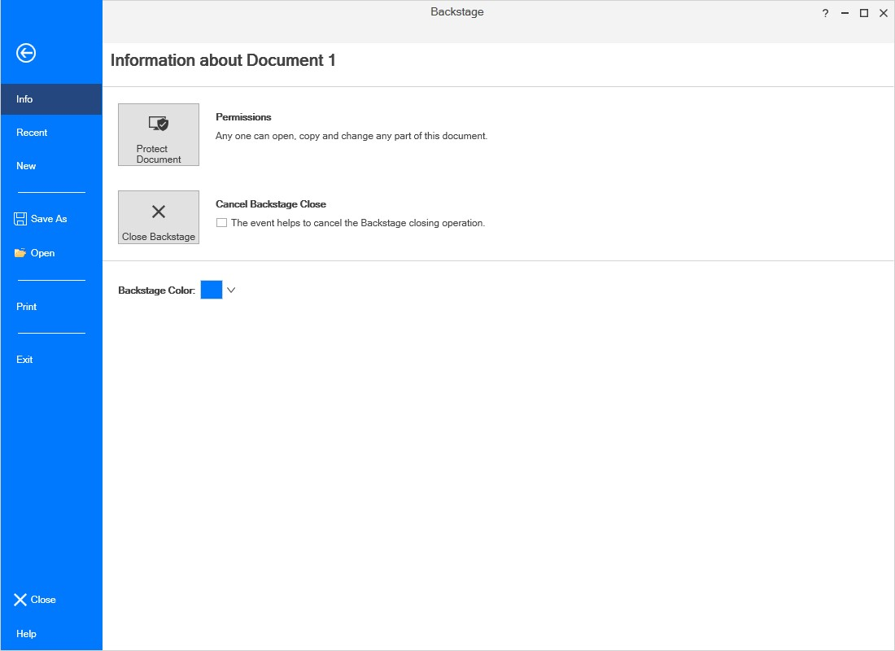
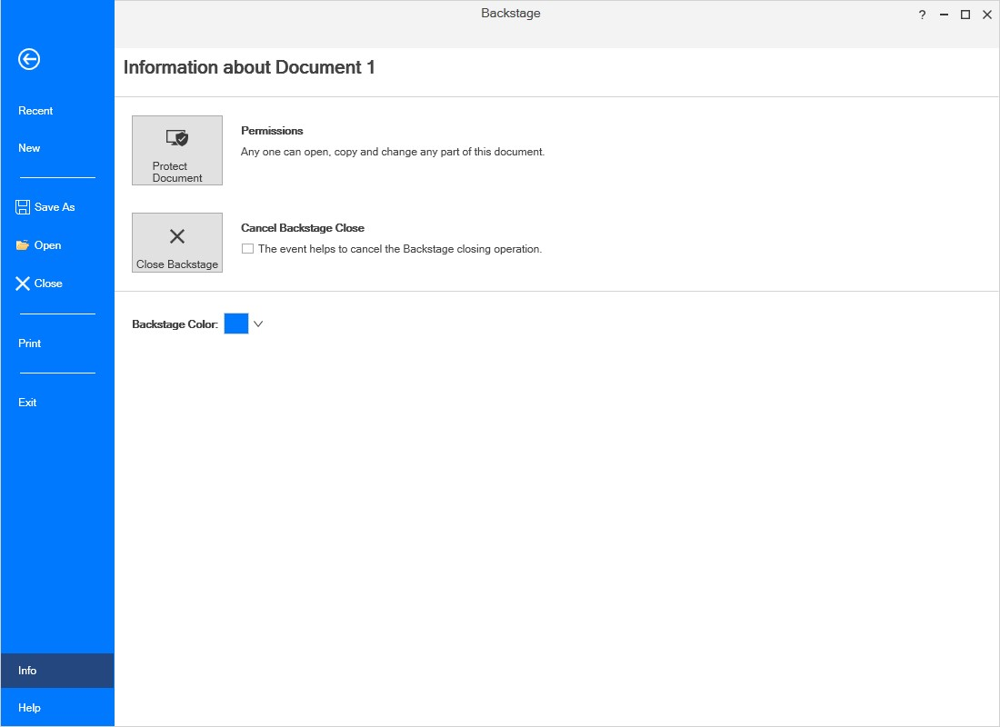
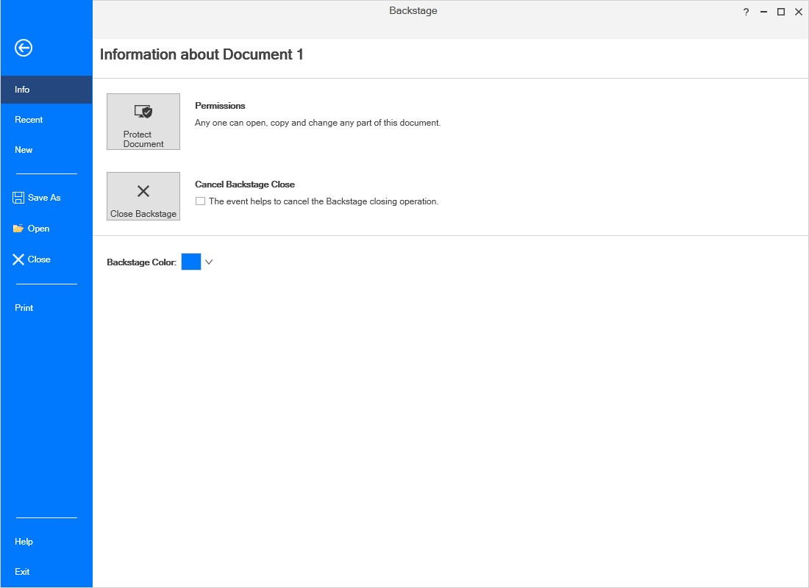

## BackStage settings in Ribbon

The BackStage can be added by using [BackStage](https://help.syncfusion.com/cr/wpf/Syncfusion.Windows.Tools.Controls.Ribbon.html#Syncfusion_Windows_Tools_Controls_Ribbon_BackStage) property of Ribbon. To show the BackStage by, click the `FILE` Menu in Ribbon like in Microsoft Outlook. 





<syncfusion:RibbonWindow
xmlns="http://schemas.microsoft.com/winfx/2006/xaml/presentation"
xmlns:x="http://schemas.microsoft.com/winfx/2006/xaml"
xmlns:syncfusion="http://schemas.syncfusion.com/wpf" x:Class="RibbonControl.MainWindow"
xmlns:syncfusionskin="clr-namespace:Syncfusion.SfSkinManager;assembly=Syncfusion.SfSkinManager.WPF"
syncfusionskin:SfSkinManager.VisualStyle="Office2013White" >
    <Grid>
        <syncfusion:Ribbon x:Name="_ribbon" VerticalAlignment="Top">
            <syncfusion:RibbonTab Caption="HOME"  IsChecked="True">
                <syncfusion:RibbonBar Name="New" Width="90"  Header="New">
                    <syncfusion:RibbonButton SizeForm="Large" Label="New Email"/>
                    <syncfusion:DropDownButton SizeForm="Large" Label="New Items">
                        <syncfusion:DropDownMenuItem Header="E-mail Message"/>
                        <syncfusion:DropDownMenuItem Header="Appointment"/>
                        <syncfusion:DropDownMenuItem Header="Meeting"/>
                        <syncfusion:DropDownMenuItem Header="Contact"/>
                        <syncfusion:DropDownMenuItem Header="Task"/>
                    </syncfusion:DropDownButton>
                </syncfusion:RibbonBar>
                <syncfusion:RibbonBar Name="Delete" Width="130"  Header="Delete">
                    <syncfusion:RibbonButton Label="Ignore"/>
                    <syncfusion:SplitButton Label="Clean Up">
                        <syncfusion:DropDownMenuItem Header="Clean Up Folder"/>
                        <syncfusion:DropDownMenuItem Header="Clean Up Conversation"/>
                        <syncfusion:DropDownMenuItem Header="Clean Up Folder/SubFolder"/>
                    </syncfusion:SplitButton>
                    <syncfusion:SplitButton Label="Junk" Margin="0,0,12,0" Width="76"/>
                    <syncfusion:RibbonButton Label="Delete" SizeForm="Large"/>
                </syncfusion:RibbonBar>
                <syncfusion:RibbonBar Name="Respond" Width="200" Header="Respond">
                    <syncfusion:RibbonButton Label="Reply" SizeForm="Large"/>
                    <syncfusion:RibbonButton Label="Reply All" SizeForm="Large"/>
                    <syncfusion:RibbonButton Label="Forward" SizeForm="Large"/>
                    <syncfusion:RibbonButton Label="Meeting"/>
                    <syncfusion:SplitButton Label="IM" Margin="-2,0,6,0" Width="68"/>
                    <syncfusion:SplitButton Label="More" Margin="-2,0,6,0" Width="68"/>
                </syncfusion:RibbonBar>
                <syncfusion:RibbonBar Width="170" Name="QuickSteps" Header="Quick Steps">
                    <syncfusion:RibbonGallery Width="160"    VisualMode="InRibbon" ItemHeight="20" ItemWidth="70">
                        <syncfusion:RibbonGalleryItem  Content="Move to?"/>
                        <syncfusion:RibbonGalleryItem  Content="Team Email"/>
                        <syncfusion:RibbonGalleryItem  Content="ReplyDelete"/>
                        <syncfusion:RibbonGalleryItem  Content="To Manager"/>
                        <syncfusion:RibbonGalleryItem  Content="Done"/>
                        <syncfusion:RibbonGalleryItem  Content="Create New"/>
                    </syncfusion:RibbonGallery>
                </syncfusion:RibbonBar>
                <syncfusion:RibbonBar Width="170" Header="Find" Name="Find"  >
                    <syncfusion:RibbonComboBox Label="Filter Email" Width="160">
                        <ComboBoxItem>Person1@mail.com</ComboBoxItem>
                        <ComboBoxItem>Person2@mail.com</ComboBoxItem>
                        <ComboBoxItem>Person3@mail.com</ComboBoxItem>
                    </syncfusion:RibbonComboBox>
                </syncfusion:RibbonBar>
            </syncfusion:RibbonTab>
            <syncfusion:RibbonTab Caption="SEND/RCEIVE"  IsChecked="False"/>
            <syncfusion:RibbonTab Caption="FOLDER"  IsChecked="False"/>
            <syncfusion:RibbonTab Caption="VIEW"  IsChecked="False"/>
            <syncfusion:Ribbon.QuickAccessToolBar>
                <syncfusion:QuickAccessToolBar>
                    <syncfusion:RibbonButton SizeForm="ExtraSmall"/>
                    <syncfusion:RibbonButton SizeForm="ExtraSmall" />          
                    <syncfusion:QuickAccessToolBar.QATMenuItems>
                        <syncfusion:RibbonButton Label="Send" />
                        <syncfusion:RibbonButton Label="Forward" />
                        <syncfusion:RibbonButton Label="ReplyAll" />
                        <syncfusion:RibbonButton Label="Delete" />
                        <syncfusion:RibbonButton Label="Print" />
                    </syncfusion:QuickAccessToolBar.QATMenuItems>
                </syncfusion:QuickAccessToolBar>
            </syncfusion:Ribbon.QuickAccessToolBar>
            <syncfusion:Ribbon.BackStage>
                <syncfusion:Backstage/>
            </syncfusion:Ribbon.BackStage>
        </syncfusion:Ribbon>
    </Grid>
</syncfusion:RibbonWindow>





### Customize the BackStage Visibility 

The [`IsBackStageVisible`](https://help.syncfusion.com/cr/wpf/Syncfusion.Windows.Tools.Controls.Ribbon.html#Syncfusion_Windows_Tools_Controls_Ribbon_IsBackStageVisible) property of Ribbon enables you to show/hide the BackStage. The following code example illustrates how to show or hide BackStage.

1) Through Property 





<syncfusion:Ribbon x:Name="_ribbon" VerticalAlignment="Top" IsBackStageVisible ="True"/>





_ribbon.IsBackStageVisible = true;





2) Through Methods





private void ShowBackstage_Click(object sender, RoutedEventArgs e)
{
    //to show back stage
    _ribbon.ShowBackStage();
}

private void HideBackstage_Click(object sender, RoutedEventArgs e)
{
    //to hide the back stage
    _ribbon.HideBackStage();
}





Private Sub ShowBackstage_Click(ByVal sender As Object, ByVal e As RoutedEventArgs)
	'to show back stage
	_ribbon.ShowBackStage()
End Sub

Private Sub HideBackstage_Click(ByVal sender As Object, ByVal e As RoutedEventArgs)
	'to hide the back stage
	_ribbon.HideBackStage()
End Sub





3) Through Commands

Ribbon control provides the static command [OpenBackStage](https://help.syncfusion.com/cr/wpf/Syncfusion.Windows.Tools.Controls.RibbonCommands.html#Syncfusion_Windows_Tools_Controls_RibbonCommands_OpenBackStage) to show/hide the BackStage based on the parameter passed to it.





<syncfusion:RibbonButton x:Name="ribbonButton" Label="Open Backstage" Command="{x:Static syncfusion:RibbonCommands.OpenBackStage}" CommandTarget="{Binding ElementName=ribbon}">
    <syncfusion:RibbonButton.CommandParameter>
        <!--If we passes false it will hide the backstage otherwise it will show the backstage-->
        <sys:Boolean>true</sys:Boolean>
    </syncfusion:RibbonButton.CommandParameter>
</syncfusion:RibbonButton>




N> In order to bind the [`OpenBackStage`](https://help.syncfusion.com/cr/wpf/Syncfusion.Windows.Tools.Controls.RibbonCommands.html#Syncfusion_Windows_Tools_Controls_RibbonCommands_OpenBackStage) command, CommandTarget and CommandParameter must be defined.

## Add BackStageCommandButton

`BackStageCommandButton` added to BackStage as BackStage Element. Here four BackStageCommandButtons are added with `Header` property value as "Save", "SaveAttachments", "Options" and "Exit". 





<syncfusion:RibbonWindow
xmlns="http://schemas.microsoft.com/winfx/2006/xaml/presentation"
xmlns:x="http://schemas.microsoft.com/winfx/2006/xaml"
xmlns:syncfusion="http://schemas.syncfusion.com/wpf" x:Class="RibbonControl.MainWindow"
xmlns:syncfusionskin="clr-namespace:Syncfusion.SfSkinManager;assembly=Syncfusion.SfSkinManager.WPF"
syncfusionskin:SfSkinManager.VisualStyle="Office2013White" >
    <Grid>
        <syncfusion:Ribbon x:Name="_ribbon" VerticalAlignment="Top">
            <syncfusion:RibbonTab Caption="HOME"  IsChecked="True">
                <syncfusion:RibbonBar Name="New" Width="90"  Header="New">
                    <syncfusion:RibbonButton SizeForm="Large" Label="New Email"/>
                    <syncfusion:DropDownButton SizeForm="Large" Label="New Items">
                        <syncfusion:DropDownMenuItem Header="E-mail Message"/>
                        <syncfusion:DropDownMenuItem Header="Appointment"/>
                        <syncfusion:DropDownMenuItem Header="Meeting"/>
                        <syncfusion:DropDownMenuItem Header="Contact"/>
                        <syncfusion:DropDownMenuItem Header="Task"/>
                    </syncfusion:DropDownButton>
                </syncfusion:RibbonBar>
                <syncfusion:RibbonBar Name="Delete" Width="130"  Header="Delete">
                    <syncfusion:RibbonButton Label="Ignore"/>
                    <syncfusion:SplitButton Label="Clean Up">
                        <syncfusion:DropDownMenuItem Header="Clean Up Folder"/>
                        <syncfusion:DropDownMenuItem Header="Clean Up Conversation"/>
                        <syncfusion:DropDownMenuItem Header="Clean Up Folder/SubFolder"/>
                    </syncfusion:SplitButton>
                    <syncfusion:SplitButton Label="Junk" Margin="0,0,12,0" Width="76"/>
                    <syncfusion:RibbonButton Label="Delete" SizeForm="Large"/>
                </syncfusion:RibbonBar>
                <syncfusion:RibbonBar Name="Respond" Width="200" Header="Respond">
                    <syncfusion:RibbonButton Label="Reply" SizeForm="Large"/>
                    <syncfusion:RibbonButton Label="Reply All" SizeForm="Large"/>
                    <syncfusion:RibbonButton Label="Forward" SizeForm="Large"/>
                    <syncfusion:RibbonButton Label="Meeting"/>
                    <syncfusion:SplitButton Label="IM" Margin="-2,0,6,0" Width="68"/>
                    <syncfusion:SplitButton Label="More" Margin="-2,0,6,0" Width="68"/>
                </syncfusion:RibbonBar>
                <syncfusion:RibbonBar Width="170" Name="QuickSteps" Header="Quick Steps">
                    <syncfusion:RibbonGallery Width="160"    VisualMode="InRibbon" ItemHeight="20" ItemWidth="70">
                        <syncfusion:RibbonGalleryItem  Content="Move to?"/>
                        <syncfusion:RibbonGalleryItem  Content="Team Email"/>
                        <syncfusion:RibbonGalleryItem  Content="ReplyDelete"/>
                        <syncfusion:RibbonGalleryItem  Content="To Manager"/>
                        <syncfusion:RibbonGalleryItem  Content="Done"/>
                        <syncfusion:RibbonGalleryItem  Content="Create New"/>
                    </syncfusion:RibbonGallery>
                </syncfusion:RibbonBar>
                <syncfusion:RibbonBar Width="170" Header="Find" Name="Find"  >
                    <syncfusion:RibbonComboBox Label="Filter Email" Width="160">
                        <ComboBoxItem>Person1@mail.com</ComboBoxItem>
                        <ComboBoxItem>Person2@mail.com</ComboBoxItem>
                        <ComboBoxItem>Person3@mail.com</ComboBoxItem>
                    </syncfusion:RibbonComboBox>
                </syncfusion:RibbonBar>
            </syncfusion:RibbonTab>
            <syncfusion:RibbonTab Caption="SEND/RCEIVE"  IsChecked="False"/>
            <syncfusion:RibbonTab Caption="FOLDER"  IsChecked="False"/>
            <syncfusion:RibbonTab Caption="VIEW"  IsChecked="False"/>
            <syncfusion:Ribbon.QuickAccessToolBar>
                <syncfusion:QuickAccessToolBar>
                    <syncfusion:RibbonButton SizeForm="ExtraSmall"/>
                    <syncfusion:RibbonButton SizeForm="ExtraSmall" />
                    <syncfusion:QuickAccessToolBar.QATMenuItems>
                        <syncfusion:RibbonButton Label="Send" />
                        <syncfusion:RibbonButton Label="Forward" />
                        <syncfusion:RibbonButton Label="ReplyAll" />
                        <syncfusion:RibbonButton Label="Delete" />
                        <syncfusion:RibbonButton Label="Print" />
                    </syncfusion:QuickAccessToolBar.QATMenuItems>
                </syncfusion:QuickAccessToolBar>
            </syncfusion:Ribbon.QuickAccessToolBar>
            <syncfusion:Ribbon.BackStage>
                <syncfusion:Backstage>
                    <syncfusion:BackStageCommandButton Header="Save" />
                    <syncfusion:BackStageCommandButton Header="SaveAttachments" />
                    <syncfusion:BackStageCommandButton Header="Options" />
                    <syncfusion:BackStageCommandButton Header="Exit" />
                </syncfusion:Backstage>
            </syncfusion:Ribbon.BackStage>
        </syncfusion:Ribbon>
    </Grid>
</syncfusion:RibbonWindow>





### Positioning BackStageCommandButton

The [`Position`](https://help.syncfusion.com/cr/wpf/Syncfusion.Windows.Tools.Controls.RibbonCommands.html#Syncfusion_Windows_Tools_Controls_BackStageCommandButton_Position) property of BackStageCommandButton enables you to position top/bottom. The following code example illustrates how to position the BackStageCommandButton whether top or bottom.





<syncfusion:BackStageCommandButton x:Name="_closeCommandButton" Header="Close" Position="Bottom">





_closeCommandButton.Position = VerticalPosition.Bottom;





## Add BackStageTabItem

`BackStageTabItem` can also be added inside the BackStage Element.Here four BackStageCommandButtons are added with `Header` property value as "Open", "Print" and "Office Account". 





<syncfusion:RibbonWindow
xmlns="http://schemas.microsoft.com/winfx/2006/xaml/presentation"
xmlns:x="http://schemas.microsoft.com/winfx/2006/xaml"
xmlns:syncfusion="http://schemas.syncfusion.com/wpf" x:Class="RibbonControl.MainWindow"
xmlns:syncfusionskin="clr-namespace:Syncfusion.SfSkinManager;assembly=Syncfusion.SfSkinManager.WPF"
syncfusionskin:SfSkinManager.VisualStyle="Office2013White" >
    <Grid>
        <syncfusion:Ribbon x:Name="_ribbon" VerticalAlignment="Top">
            <syncfusion:RibbonTab Caption="HOME"  IsChecked="True">
                <syncfusion:RibbonBar Name="New" Width="90"  Header="New">
                    <syncfusion:RibbonButton SizeForm="Large" Label="New Email"/>
                    <syncfusion:DropDownButton SizeForm="Large" Label="New Items">
                        <syncfusion:DropDownMenuItem Header="E-mail Message"/>
                        <syncfusion:DropDownMenuItem Header="Appointment"/>
                        <syncfusion:DropDownMenuItem Header="Meeting"/>
                        <syncfusion:DropDownMenuItem Header="Contact"/>
                        <syncfusion:DropDownMenuItem Header="Task"/>
                    </syncfusion:DropDownButton>
                </syncfusion:RibbonBar>
                <syncfusion:RibbonBar Name="Delete" Width="130"  Header="Delete">
                    <syncfusion:RibbonButton Label="Ignore"/>
                    <syncfusion:SplitButton Label="Clean Up">
                        <syncfusion:DropDownMenuItem Header="Clean Up Folder"/>
                        <syncfusion:DropDownMenuItem Header="Clean Up Conversation"/>
                        <syncfusion:DropDownMenuItem Header="Clean Up Folder/SubFolder"/>
                    </syncfusion:SplitButton>
                    <syncfusion:SplitButton Label="Junk" Margin="0,0,12,0" Width="76"/>
                    <syncfusion:RibbonButton Label="Delete" SizeForm="Large"/>
                </syncfusion:RibbonBar>
                <syncfusion:RibbonBar Name="Respond" Width="200" Header="Respond">
                    <syncfusion:RibbonButton Label="Reply" SizeForm="Large"/>
                    <syncfusion:RibbonButton Label="Reply All" SizeForm="Large"/>
                    <syncfusion:RibbonButton Label="Forward" SizeForm="Large"/>
                    <syncfusion:RibbonButton Label="Meeting"/>
                    <syncfusion:SplitButton Label="IM" Margin="-2,0,6,0" Width="68"/>
                    <syncfusion:SplitButton Label="More" Margin="-2,0,6,0" Width="68"/>
                </syncfusion:RibbonBar>
                <syncfusion:RibbonBar Width="170" Name="QuickSteps" Header="Quick Steps">
                    <syncfusion:RibbonGallery Width="160"    VisualMode="InRibbon" ItemHeight="20" ItemWidth="70">
                        <syncfusion:RibbonGalleryItem  Content="Move to?"/>
                        <syncfusion:RibbonGalleryItem  Content="Team Email"/>
                        <syncfusion:RibbonGalleryItem  Content="ReplyDelete"/>
                        <syncfusion:RibbonGalleryItem  Content="To Manager"/>
                        <syncfusion:RibbonGalleryItem  Content="Done"/>
                        <syncfusion:RibbonGalleryItem  Content="Create New"/>
                    </syncfusion:RibbonGallery>
                </syncfusion:RibbonBar>
                <syncfusion:RibbonBar Width="170" Header="Find" Name="Find"  >
                    <syncfusion:RibbonComboBox Label="Filter Email" Width="160">
                        <ComboBoxItem>Person1@mail.com</ComboBoxItem>
                        <ComboBoxItem>Person2@mail.com</ComboBoxItem>
                        <ComboBoxItem>Person3@mail.com</ComboBoxItem>
                    </syncfusion:RibbonComboBox>
                </syncfusion:RibbonBar>
            </syncfusion:RibbonTab>
            <syncfusion:RibbonTab Caption="SEND/RCEIVE"  IsChecked="False"/>
            <syncfusion:RibbonTab Caption="FOLDER"  IsChecked="False"/>
            <syncfusion:RibbonTab Caption="VIEW"  IsChecked="False"/>
            <syncfusion:Ribbon.QuickAccessToolBar>
                <syncfusion:QuickAccessToolBar>
                    <syncfusion:RibbonButton SizeForm="ExtraSmall"/>
                    <syncfusion:RibbonButton SizeForm="ExtraSmall" />
                    <syncfusion:QuickAccessToolBar.QATMenuItems>
                        <syncfusion:RibbonButton Label="Send" />
                        <syncfusion:RibbonButton Label="Forward" />
                        <syncfusion:RibbonButton Label="ReplyAll" />
                        <syncfusion:RibbonButton Label="Delete" />
                        <syncfusion:RibbonButton Label="Print" />
                    </syncfusion:QuickAccessToolBar.QATMenuItems>
                </syncfusion:QuickAccessToolBar>
            </syncfusion:Ribbon.QuickAccessToolBar>
            <syncfusion:Ribbon.BackStage>
                <syncfusion:Backstage>
                    <syncfusion:BackstageTabItem  Header="Info">
                        <StackPanel>
                            <TextBlock FontSize="20" Text="Account Information"/>
                            <TextBlock FontSize="12" Text="Employ1@syncfusion.com"/>
                        </StackPanel>
                    </syncfusion:BackstageTabItem>
                    <syncfusion:BackstageTabItem  Header="Open"/>
                    <syncfusion:BackStageCommandButton Header="Save" />
                    <syncfusion:BackStageCommandButton Header="SaveAttachments" />
                    <syncfusion:BackstageTabItem  Header="print"/>
                    <syncfusion:BackstageTabItem  Header="OfficeAccount"/>
                    <syncfusion:BackStageCommandButton Header="Options" />
                    <syncfusion:BackStageCommandButton Header="Exit" />
                </syncfusion:Backstage>
            </syncfusion:Ribbon.BackStage>
        </syncfusion:Ribbon>
    </Grid>
</syncfusion:RibbonWindow>





### Positioning BackStageTabItem

The [`Position`](https://help.syncfusion.com/cr/wpf/Syncfusion.Windows.Tools.Controls.RibbonCommands.html#Syncfusion_Windows_Tools_Controls_BackstageTabItem_Position) property of BackstageTabItem enables you to position top/bottom. The following code example illustrates how to position the BackstageTabItem whether top or bottom.





<syncfusion:BackstageTabItem x:Name="_informationTabItem" Header="Information" Position="Bottom">





_informationTabItem.Position = VerticalPosition.Bottom;





## Add BackStage separator			

BackStageSeparator used to group out similar backstage elements in BackStage. Here BackStageCommandButtons, BackStageTabItems are separated by [BackStageSeparator](https://help.syncfusion.com/cr/wpf/Syncfusion.Windows.Tools.Controls.BackStageSeparator.html) according to their use.





<syncfusion:RibbonWindow
xmlns="http://schemas.microsoft.com/winfx/2006/xaml/presentation"
xmlns:x="http://schemas.microsoft.com/winfx/2006/xaml"
xmlns:syncfusion="http://schemas.syncfusion.com/wpf" x:Class="RibbonControl.MainWindow"
xmlns:syncfusionskin="clr-namespace:Syncfusion.SfSkinManager;assembly=Syncfusion.SfSkinManager.WPF"
syncfusionskin:SfSkinManager.VisualStyle="Office2013White" >
    <Grid>
        <syncfusion:Ribbon x:Name="_ribbon" VerticalAlignment="Top">
            <syncfusion:RibbonTab Caption="HOME"  IsChecked="True">
                <syncfusion:RibbonBar Name="New" Width="90"  Header="New">
                    <syncfusion:RibbonButton SizeForm="Large" Label="New Email"/>
                    <syncfusion:DropDownButton SizeForm="Large" Label="New Items">
                        <syncfusion:DropDownMenuItem Header="E-mail Message"/>
                        <syncfusion:DropDownMenuItem Header="Appointment"/>
                        <syncfusion:DropDownMenuItem Header="Meeting"/>
                        <syncfusion:DropDownMenuItem Header="Contact"/>
                        <syncfusion:DropDownMenuItem Header="Task"/>
                    </syncfusion:DropDownButton>
                </syncfusion:RibbonBar>
                <syncfusion:RibbonBar Name="Delete" Width="130"  Header="Delete">
                    <syncfusion:RibbonButton Label="Ignore"/>
                    <syncfusion:SplitButton Label="Clean Up">
                        <syncfusion:DropDownMenuItem Header="Clean Up Folder"/>
                        <syncfusion:DropDownMenuItem Header="Clean Up Conversation"/>
                        <syncfusion:DropDownMenuItem Header="Clean Up Folder/SubFolder"/>
                    </syncfusion:SplitButton>
                    <syncfusion:SplitButton Label="Junk" Margin="0,0,12,0" Width="76"/>
                    <syncfusion:RibbonButton Label="Delete" SizeForm="Large"/>
                </syncfusion:RibbonBar>
                <syncfusion:RibbonBar Name="Respond" Width="200" Header="Respond">
                    <syncfusion:RibbonButton Label="Reply" SizeForm="Large"/>
                    <syncfusion:RibbonButton Label="Reply All" SizeForm="Large"/>
                    <syncfusion:RibbonButton Label="Forward" SizeForm="Large"/>
                    <syncfusion:RibbonButton Label="Meeting"/>
                    <syncfusion:SplitButton Label="IM" Margin="-2,0,6,0" Width="68"/>
                    <syncfusion:SplitButton Label="More" Margin="-2,0,6,0" Width="68"/>
                </syncfusion:RibbonBar>
                <syncfusion:RibbonBar Width="170" Name="QuickSteps" Header="Quick Steps">
                    <syncfusion:RibbonGallery Width="160"    VisualMode="InRibbon" ItemHeight="20" ItemWidth="70">
                        <syncfusion:RibbonGalleryItem  Content="Move to?"/>
                        <syncfusion:RibbonGalleryItem  Content="Team Email"/>
                        <syncfusion:RibbonGalleryItem  Content="ReplyDelete"/>
                        <syncfusion:RibbonGalleryItem  Content="To Manager"/>
                        <syncfusion:RibbonGalleryItem  Content="Done"/>
                        <syncfusion:RibbonGalleryItem  Content="Create New"/>
                    </syncfusion:RibbonGallery>
                </syncfusion:RibbonBar>
                <syncfusion:RibbonBar Width="170" Header="Find" Name="Find"  >
                    <syncfusion:RibbonComboBox Label="Filter Email" Width="160">
                        <ComboBoxItem>Person1@mail.com</ComboBoxItem>
                        <ComboBoxItem>Person2@mail.com</ComboBoxItem>
                        <ComboBoxItem>Person3@mail.com</ComboBoxItem>
                    </syncfusion:RibbonComboBox>
                </syncfusion:RibbonBar>
            </syncfusion:RibbonTab>
            <syncfusion:RibbonTab Caption="SEND/RCEIVE"  IsChecked="False"/>
            <syncfusion:RibbonTab Caption="FOLDER"  IsChecked="False"/>
            <syncfusion:RibbonTab Caption="VIEW"  IsChecked="False"/>
            <syncfusion:Ribbon.QuickAccessToolBar>
                <syncfusion:QuickAccessToolBar>
                    <syncfusion:RibbonButton SizeForm="ExtraSmall"/>
                    <syncfusion:RibbonButton SizeForm="ExtraSmall" />
                    <syncfusion:QuickAccessToolBar.QATMenuItems>
                        <syncfusion:RibbonButton Label="Send" />
                        <syncfusion:RibbonButton Label="Forward" />
                        <syncfusion:RibbonButton Label="ReplyAll" />
                        <syncfusion:RibbonButton Label="Delete" />
                        <syncfusion:RibbonButton Label="Print" />
                    </syncfusion:QuickAccessToolBar.QATMenuItems>
                </syncfusion:QuickAccessToolBar>
            </syncfusion:Ribbon.QuickAccessToolBar>
            <syncfusion:Ribbon.BackStage>
                <syncfusion:Backstage>
                    <syncfusion:BackstageTabItem  Header="Info">
                        <StackPanel>
                            <TextBlock FontSize="20" Text="Account Information"/>
                            <TextBlock FontSize="12" Text="Employ1@syncfusion.com"/>
                        </StackPanel>
                    </syncfusion:BackstageTabItem>
                    <syncfusion:BackstageTabItem  Header="Open"/>
                    <syncfusion:BackStageCommandButton Header="Save" />
                    <syncfusion:BackStageCommandButton Header="SaveAttachments" />
                    <syncfusion:BackstageTabItem  Header="print"/>
                    <syncfusion:BackStageSeparator/>
                    <syncfusion:BackstageTabItem  Header="OfficeAccount"/>
                    <syncfusion:BackStageCommandButton Header="Options" />
                    <syncfusion:BackStageCommandButton Header="Exit" />
                </syncfusion:Backstage>
            </syncfusion:Ribbon.BackStage>
        </syncfusion:Ribbon>
    </Grid>
</syncfusion:RibbonWindow>





### Positioning BackStageSeparator

The [`Position`](https://help.syncfusion.com/cr/wpf/Syncfusion.Windows.Tools.Controls.RibbonCommands.html#Syncfusion_Windows_Tools_Controls_BackStageSeparator_Position) property of BackStageSeparator enables you to position top/bottom. The following code example illustrates how to position the BackStageSeparator whether top or bottom.





<syncfusion:BackStageSeparator x:Name="_backstageSeparator " Position="Bottom">





_backstageSeparator.Position = VerticalPosition.Bottom;





