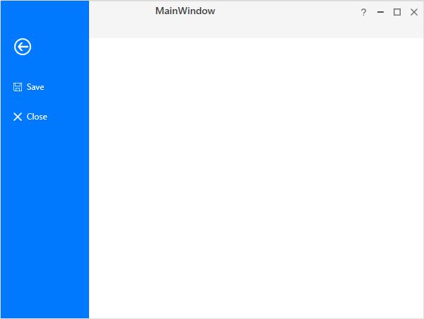
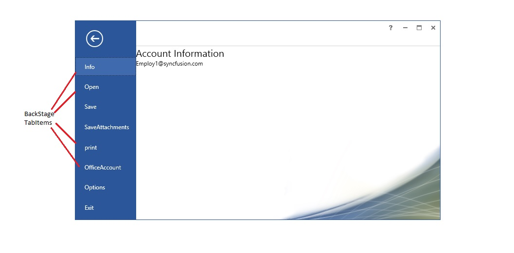

## BackStage settings in Ribbon

The BackStage can be added by using [BackStage](https://help.syncfusion.com/cr/wpf/Syncfusion.Windows.Tools.Controls.Ribbon.html#Syncfusion_Windows_Tools_Controls_Ribbon_BackStage) property of Ribbon. To show the BackStage by, click the `FILE` Menu in Ribbon like in Microsoft Outlook. 





<syncfusion:RibbonWindow
xmlns="http://schemas.microsoft.com/winfx/2006/xaml/presentation"
xmlns:x="http://schemas.microsoft.com/winfx/2006/xaml"
xmlns:syncfusion="http://schemas.syncfusion.com/wpf" x:Class="RibbonControl.MainWindow"
xmlns:syncfusionskin="clr-namespace:Syncfusion.SfSkinManager;assembly=Syncfusion.SfSkinManager.WPF"
syncfusionskin:SfSkinManager.VisualStyle="Office2013White" >
    <Grid>
        <syncfusion:Ribbon x:Name="_ribbon" VerticalAlignment="Top">
            <syncfusion:RibbonTab Caption="HOME"  IsChecked="True">
                <syncfusion:RibbonBar Name="New" Width="90"  Header="New">
                    <syncfusion:RibbonButton SizeForm="Large" Label="New Email"/>
                    <syncfusion:DropDownButton SizeForm="Large" Label="New Items">
                        <syncfusion:DropDownMenuItem Header="E-mail Message"/>
                        <syncfusion:DropDownMenuItem Header="Appointment"/>
                        <syncfusion:DropDownMenuItem Header="Meeting"/>
                        <syncfusion:DropDownMenuItem Header="Contact"/>
                        <syncfusion:DropDownMenuItem Header="Task"/>
                    </syncfusion:DropDownButton>
                </syncfusion:RibbonBar>
                <syncfusion:RibbonBar Name="Delete" Width="130"  Header="Delete">
                    <syncfusion:RibbonButton Label="Ignore"/>
                    <syncfusion:SplitButton Label="Clean Up">
                        <syncfusion:DropDownMenuItem Header="Clean Up Folder"/>
                        <syncfusion:DropDownMenuItem Header="Clean Up Conversation"/>
                        <syncfusion:DropDownMenuItem Header="Clean Up Folder/SubFolder"/>
                    </syncfusion:SplitButton>
                    <syncfusion:SplitButton Label="Junk" Margin="0,0,12,0" Width="76"/>
                    <syncfusion:RibbonButton Label="Delete" SizeForm="Large"/>
                </syncfusion:RibbonBar>
                <syncfusion:RibbonBar Name="Respond" Width="200" Header="Respond">
                    <syncfusion:RibbonButton Label="Reply" SizeForm="Large"/>
                    <syncfusion:RibbonButton Label="Reply All" SizeForm="Large"/>
                    <syncfusion:RibbonButton Label="Forward" SizeForm="Large"/>
                    <syncfusion:RibbonButton Label="Meeting"/>
                    <syncfusion:SplitButton Label="IM" Margin="-2,0,6,0" Width="68"/>
                    <syncfusion:SplitButton Label="More" Margin="-2,0,6,0" Width="68"/>
                </syncfusion:RibbonBar>
                <syncfusion:RibbonBar Width="170" Name="QuickSteps" Header="Quick Steps">
                    <syncfusion:RibbonGallery Width="160"    VisualMode="InRibbon" ItemHeight="20" ItemWidth="70">
                        <syncfusion:RibbonGalleryItem  Content="Move to?"/>
                        <syncfusion:RibbonGalleryItem  Content="Team Email"/>
                        <syncfusion:RibbonGalleryItem  Content="ReplyDelete"/>
                        <syncfusion:RibbonGalleryItem  Content="To Manager"/>
                        <syncfusion:RibbonGalleryItem  Content="Done"/>
                        <syncfusion:RibbonGalleryItem  Content="Create New"/>
                    </syncfusion:RibbonGallery>
                </syncfusion:RibbonBar>
                <syncfusion:RibbonBar Width="170" Header="Find" Name="Find"  >
                    <syncfusion:RibbonComboBox Label="Filter Email" Width="160">
                        <ComboBoxItem>Person1@mail.com</ComboBoxItem>
                        <ComboBoxItem>Person2@mail.com</ComboBoxItem>
                        <ComboBoxItem>Person3@mail.com</ComboBoxItem>
                    </syncfusion:RibbonComboBox>
                </syncfusion:RibbonBar>
            </syncfusion:RibbonTab>
            <syncfusion:RibbonTab Caption="SEND/RCEIVE"  IsChecked="False"/>
            <syncfusion:RibbonTab Caption="FOLDER"  IsChecked="False"/>
            <syncfusion:RibbonTab Caption="VIEW"  IsChecked="False"/>
            <syncfusion:Ribbon.QuickAccessToolBar>
                <syncfusion:QuickAccessToolBar>
                    <syncfusion:RibbonButton SizeForm="ExtraSmall"/>
                    <syncfusion:RibbonButton SizeForm="ExtraSmall" />          
                    <syncfusion:QuickAccessToolBar.QATMenuItems>
                        <syncfusion:RibbonButton Label="Send" />
                        <syncfusion:RibbonButton Label="Forward" />
                        <syncfusion:RibbonButton Label="ReplyAll" />
                        <syncfusion:RibbonButton Label="Delete" />
                        <syncfusion:RibbonButton Label="Print" />
                    </syncfusion:QuickAccessToolBar.QATMenuItems>
                </syncfusion:QuickAccessToolBar>
            </syncfusion:Ribbon.QuickAccessToolBar>
            <syncfusion:Ribbon.BackStage>
                <syncfusion:Backstage/>
            </syncfusion:Ribbon.BackStage>
        </syncfusion:Ribbon>
    </Grid>
</syncfusion:RibbonWindow>





### Customize the BackStage Visibility 

The [`IsBackStageVisible`](https://help.syncfusion.com/cr/wpf/Syncfusion.Windows.Tools.Controls.Ribbon.html#Syncfusion_Windows_Tools_Controls_Ribbon_IsBackStageVisible) property of Ribbon enables you to show/hide the BackStage. The following code example illustrates how to show or hide BackStage.

1) Through Property 





<syncfusion:Ribbon x:Name="_ribbon" VerticalAlignment="Top" IsBackStageVisible ="True"/>





_ribbon.IsBackStageVisible = true;





2) Through Methods





private void ShowBackstage_Click(object sender, RoutedEventArgs e)
{
    //to show back stage
    _ribbon.ShowBackStage();
}

private void HideBackstage_Click(object sender, RoutedEventArgs e)
{
    //to hide the back stage
    _ribbon.HideBackStage();
}





Private Sub ShowBackstage_Click(ByVal sender As Object, ByVal e As RoutedEventArgs)
	'to show back stage
	_ribbon.ShowBackStage()
End Sub

Private Sub HideBackstage_Click(ByVal sender As Object, ByVal e As RoutedEventArgs)
	'to hide the back stage
	_ribbon.HideBackStage()
End Sub





3) Through Commands

Ribbon control provides the static command [OpenBackStage](https://help.syncfusion.com/cr/wpf/Syncfusion.Windows.Tools.Controls.RibbonCommands.html#Syncfusion_Windows_Tools_Controls_RibbonCommands_OpenBackStage) to show/hide the BackStage based on the parameter passed to it.





<syncfusion:RibbonButton x:Name="ribbonButton" Label="Open Backstage" Command="{x:Static syncfusion:RibbonCommands.OpenBackStage}" CommandTarget="{Binding ElementName=ribbon}">
    <syncfusion:RibbonButton.CommandParameter>
        <!--If we passes false it will hide the backstage otherwise it will show the backstage-->
        <sys:Boolean>true</sys:Boolean>
    </syncfusion:RibbonButton.CommandParameter>
</syncfusion:RibbonButton>




N> In order to bind the [`OpenBackStage`](https://help.syncfusion.com/cr/wpf/Syncfusion.Windows.Tools.Controls.RibbonCommands.html#Syncfusion_Windows_Tools_Controls_RibbonCommands_OpenBackStage) command, CommandTarget and CommandParameter must be defined.

## Add BackStageCommandButton

`BackStageCommandButton` added to BackStage as BackStage Element. Here four BackStageCommandButtons are added with `Header` property value as "Save", "SaveAttachments", "Options" and "Exit". 





<syncfusion:RibbonWindow
xmlns="http://schemas.microsoft.com/winfx/2006/xaml/presentation"
xmlns:x="http://schemas.microsoft.com/winfx/2006/xaml"
xmlns:syncfusion="http://schemas.syncfusion.com/wpf" x:Class="RibbonControl.MainWindow"
xmlns:syncfusionskin="clr-namespace:Syncfusion.SfSkinManager;assembly=Syncfusion.SfSkinManager.WPF"
syncfusionskin:SfSkinManager.VisualStyle="Office2013White" >
    <Grid>
        <syncfusion:Ribbon x:Name="_ribbon" VerticalAlignment="Top">
            <syncfusion:RibbonTab Caption="HOME"  IsChecked="True">
                <syncfusion:RibbonBar Name="New" Width="90"  Header="New">
                    <syncfusion:RibbonButton SizeForm="Large" Label="New Email"/>
                    <syncfusion:DropDownButton SizeForm="Large" Label="New Items">
                        <syncfusion:DropDownMenuItem Header="E-mail Message"/>
                        <syncfusion:DropDownMenuItem Header="Appointment"/>
                        <syncfusion:DropDownMenuItem Header="Meeting"/>
                        <syncfusion:DropDownMenuItem Header="Contact"/>
                        <syncfusion:DropDownMenuItem Header="Task"/>
                    </syncfusion:DropDownButton>
                </syncfusion:RibbonBar>
                <syncfusion:RibbonBar Name="Delete" Width="130"  Header="Delete">
                    <syncfusion:RibbonButton Label="Ignore"/>
                    <syncfusion:SplitButton Label="Clean Up">
                        <syncfusion:DropDownMenuItem Header="Clean Up Folder"/>
                        <syncfusion:DropDownMenuItem Header="Clean Up Conversation"/>
                        <syncfusion:DropDownMenuItem Header="Clean Up Folder/SubFolder"/>
                    </syncfusion:SplitButton>
                    <syncfusion:SplitButton Label="Junk" Margin="0,0,12,0" Width="76"/>
                    <syncfusion:RibbonButton Label="Delete" SizeForm="Large"/>
                </syncfusion:RibbonBar>
                <syncfusion:RibbonBar Name="Respond" Width="200" Header="Respond">
                    <syncfusion:RibbonButton Label="Reply" SizeForm="Large"/>
                    <syncfusion:RibbonButton Label="Reply All" SizeForm="Large"/>
                    <syncfusion:RibbonButton Label="Forward" SizeForm="Large"/>
                    <syncfusion:RibbonButton Label="Meeting"/>
                    <syncfusion:SplitButton Label="IM" Margin="-2,0,6,0" Width="68"/>
                    <syncfusion:SplitButton Label="More" Margin="-2,0,6,0" Width="68"/>
                </syncfusion:RibbonBar>
                <syncfusion:RibbonBar Width="170" Name="QuickSteps" Header="Quick Steps">
                    <syncfusion:RibbonGallery Width="160"    VisualMode="InRibbon" ItemHeight="20" ItemWidth="70">
                        <syncfusion:RibbonGalleryItem  Content="Move to?"/>
                        <syncfusion:RibbonGalleryItem  Content="Team Email"/>
                        <syncfusion:RibbonGalleryItem  Content="ReplyDelete"/>
                        <syncfusion:RibbonGalleryItem  Content="To Manager"/>
                        <syncfusion:RibbonGalleryItem  Content="Done"/>
                        <syncfusion:RibbonGalleryItem  Content="Create New"/>
                    </syncfusion:RibbonGallery>
                </syncfusion:RibbonBar>
                <syncfusion:RibbonBar Width="170" Header="Find" Name="Find"  >
                    <syncfusion:RibbonComboBox Label="Filter Email" Width="160">
                        <ComboBoxItem>Person1@mail.com</ComboBoxItem>
                        <ComboBoxItem>Person2@mail.com</ComboBoxItem>
                        <ComboBoxItem>Person3@mail.com</ComboBoxItem>
                    </syncfusion:RibbonComboBox>
                </syncfusion:RibbonBar>
            </syncfusion:RibbonTab>
            <syncfusion:RibbonTab Caption="SEND/RCEIVE"  IsChecked="False"/>
            <syncfusion:RibbonTab Caption="FOLDER"  IsChecked="False"/>
            <syncfusion:RibbonTab Caption="VIEW"  IsChecked="False"/>
            <syncfusion:Ribbon.QuickAccessToolBar>
                <syncfusion:QuickAccessToolBar>
                    <syncfusion:RibbonButton SizeForm="ExtraSmall"/>
                    <syncfusion:RibbonButton SizeForm="ExtraSmall" />
                    <syncfusion:QuickAccessToolBar.QATMenuItems>
                        <syncfusion:RibbonButton Label="Send" />
                        <syncfusion:RibbonButton Label="Forward" />
                        <syncfusion:RibbonButton Label="ReplyAll" />
                        <syncfusion:RibbonButton Label="Delete" />
                        <syncfusion:RibbonButton Label="Print" />
                    </syncfusion:QuickAccessToolBar.QATMenuItems>
                </syncfusion:QuickAccessToolBar>
            </syncfusion:Ribbon.QuickAccessToolBar>
            <syncfusion:Ribbon.BackStage>
                <syncfusion:Backstage>
                    <syncfusion:BackStageCommandButton Header="Save" />
                    <syncfusion:BackStageCommandButton Header="SaveAttachments" />
                    <syncfusion:BackStageCommandButton Header="Options" />
                    <syncfusion:BackStageCommandButton Header="Exit" />
                </syncfusion:Backstage>
            </syncfusion:Ribbon.BackStage>
        </syncfusion:Ribbon>
    </Grid>
</syncfusion:RibbonWindow>





## Setting image to BackStageCommandButton

 The [`BackStageCommandButton`](https://help.syncfusion.com/cr/wpf/Syncfusion.Windows.Tools.Controls.BackStageCommandButton.html) allows to display any type of image such as glyph or any custom control using the  [`IconTemplate`](https://help.syncfusion.com/cr/wpf/Syncfusion.Windows.Tools.Controls.RibbonButton.html#Syncfusion_Windows_Tools_Controls_RibbonButton_IconTemplate) property, which is the preferred option. It also allows to display a normal image or vector image using the [`IconType`](https://help.syncfusion.com/cr/wpf/Syncfusion.Windows.Tools.Controls.RibbonButton.html#Syncfusion_Windows_Tools_Controls_RibbonButton_IconType) enumeration property. The default value of the [`IconType`](https://help.syncfusion.com/cr/wpf/Syncfusion.Windows.Tools.Controls.RibbonButton.html#Syncfusion_Windows_Tools_Controls_RibbonButton_IconType) property is **Icon**. The [`IconType`](https://help.syncfusion.com/cr/wpf/Syncfusion.Windows.Tools.IconType.html) enumeration has the following values:

 * **Icon** - Gets the details of the icon from the [`Icon`](https://help.syncfusion.com/cr/wpf/Syncfusion.Windows.Tools.Controls.BackStageCommandButton.html#Syncfusion_Windows_Tools_Controls_BackStageCommandButton_Icon) property and sets it to the [`BackStageCommandButton`](https://help.syncfusion.com/cr/wpf/Syncfusion.Windows.Tools.Controls.BackStageCommandButton.html).
 * **VectorImage** - Gets the details of the icon path from the [`VectorImage`](https://help.syncfusion.com/cr/wpf/Syncfusion.Windows.Tools.Controls.RibbonButton.html#Syncfusion_Windows_Tools_Controls_RibbonButton_VectorImage) property and sets it to the [`BackStageCommandButton`](https://help.syncfusion.com/cr/wpf/Syncfusion.Windows.Tools.Controls.BackStageCommandButton.html).

 N> [`BackStageCommandButton`](https://help.syncfusion.com/cr/wpf/Syncfusion.Windows.Tools.Controls.BackStageCommandButton.html) loads icon in the following priority order,
 * [`IconTemplate`](https://help.syncfusion.com/cr/wpf/Syncfusion.Windows.Tools.Controls.RibbonButton.html#Syncfusion_Windows_Tools_Controls_RibbonButton_IconTemplate)
 * [`VectorImage`](https://help.syncfusion.com/cr/wpf/Syncfusion.Windows.Tools.Controls.RibbonButton.html#Syncfusion_Windows_Tools_Controls_RibbonButton_VectorImage)
 * [`Icon`](https://help.syncfusion.com/cr/wpf/Syncfusion.Windows.Tools.Controls.BackStageCommandButton.html#Syncfusion_Windows_Tools_Controls_BackStageCommandButton_Icon)

### Setting icon template

The [`IconTemplate`](https://help.syncfusion.com/cr/wpf/Syncfusion.Windows.Tools.Controls.RibbonButton.html#Syncfusion_Windows_Tools_Controls_RibbonButton_IconTemplate) property provides support to set any type of image such as glyphs or any custom control to the [`BackStageCommandButton`](https://help.syncfusion.com/cr/wpf/Syncfusion.Windows.Tools.Controls.BackStageCommandButton.html). The [`BackStageCommandButton`](https://help.syncfusion.com/cr/wpf/Syncfusion.Windows.Tools.Controls.BackStageCommandButton.html) displays the [`IconTemplate`](https://help.syncfusion.com/cr/wpf/Syncfusion.Windows.Tools.Controls.RibbonButton.html#Syncfusion_Windows_Tools_Controls_RibbonButton_IconTemplate) in 16 * 16 size.





 <syncfusion:RibbonWindow x:Class="WpfApp1.MainWindow"
        xmlns="http://schemas.microsoft.com/winfx/2006/xaml/presentation"
        xmlns:x="http://schemas.microsoft.com/winfx/2006/xaml"
        xmlns:d="http://schemas.microsoft.com/expression/blend/2008"
        xmlns:mc="http://schemas.openxmlformats.org/markup-compatibility/2006"
        xmlns:local="clr-namespace:WpfApp1"
        mc:Ignorable="d" xmlns:syncfusion="http://schemas.syncfusion.com/wpf"
        xmlns:skin="clr-namespace:Syncfusion.SfSkinManager;assembly=Syncfusion.SfSkinManager.WPF"
        skin:SfSkinManager.VisualStyle="MaterialLight"
        Title="MainWindow" Height="450" Width="600">
    <Grid>
        <syncfusion:Ribbon VerticalAlignment="Top" EnableSimplifiedLayoutMode="True" >
            <syncfusion:Ribbon.BackStage>
                <syncfusion:Backstage>
                    <syncfusion:BackStageCommandButton Header="Save" >
                        <syncfusion:BackStageCommandButton.IconTemplate>
                            <DataTemplate>
                                <Path Width="12" Height="12" HorizontalAlignment="Center" VerticalAlignment="Center"
                         Data="M5.0000019,11 L5.0000019,15 11.000002,15 11.000002,11 z M4.0000019,1 L4.0000019,6 12.000002,6 12.000002,1 z M1,1 L1,13.174 2.7160001,15 4.0000019,15 4.0000019,10 12.000002,10 12.000002,15 15,15 15,1 13.000002,1 13.000002,7 3.0000019,7 3.0000019,1 z M0,0 L3.0000019,0 13.000002,0 16,0 16,16 12.000002,16 4.0000019,16 2.2840004,16 0,13.57 z"
                         Fill="{Binding RelativeSource={RelativeSource Mode=Self}, Path=(TextBlock.Foreground)}" Stretch="Uniform" />
                            </DataTemplate>
                        </syncfusion:BackStageCommandButton.IconTemplate>
                    </syncfusion:BackStageCommandButton>
                    <syncfusion:BackStageCommandButton Header="Close" >
                        <syncfusion:BackStageCommandButton.IconTemplate>
                            <DataTemplate>
                                <Grid Width="12" Height="12" HorizontalAlignment="Center" VerticalAlignment="Center" SnapsToDevicePixels="true">
                                    <Path
                                        Width="12" Height="12" HorizontalAlignment="Center" VerticalAlignment="Center"
                                        Data="M1.4139423,0L7.0029922,5.5845888 12.592018,0 14.006015,1.4149939 8.4180527,6.9985202 14.006,12.582007 12.591996,13.997001 7.0030056,8.4124444 1.4140122,13.997001 1.5026823E-05,12.582007 5.5879484,6.9985092 0,1.4149939z "
                                        Fill="{Binding RelativeSource={RelativeSource Mode=Self}, Path=(TextBlock.Foreground)}" 
                                        SnapsToDevicePixels="True" Stretch="Fill" />
                                </Grid>
                            </DataTemplate>
                        </syncfusion:BackStageCommandButton.IconTemplate>
                    </syncfusion:BackStageCommandButton>
                </syncfusion:Backstage>
            </syncfusion:Ribbon.BackStage>
            <syncfusion:Ribbon.QuickAccessToolBar>
                <syncfusion:QuickAccessToolBar/>
            </syncfusion:Ribbon.QuickAccessToolBar>
            <syncfusion:RibbonTab Caption="Home">
                <syncfusion:RibbonBar Header="Clipboard">
                </syncfusion:RibbonBar>
            </syncfusion:RibbonTab>
        </syncfusion:Ribbon>
    </Grid>
</syncfusion:RibbonWindow>

 

 

 Ribbon ribbon = new Ribbon();
 ribbon.VerticalAlignment = VerticalAlignment.Top;
 // Creating new tabs
 RibbonTab homeTab = new RibbonTab();
 homeTab.Caption = "Home";
 homeTab.IsChecked = true;
 
 Backstage backstage = new Backstage();
 
 BackStageCommandButton backStageCommandButton = new BackStageCommandButton();
 backStageCommandButton.Header = "Save";
 
 DataTemplate iconDataTemplate = new DataTemplate();
 FrameworkElementFactory gridElement = new FrameworkElementFactory(typeof(Grid));
 FrameworkElementFactory pathElement1 = new FrameworkElementFactory(typeof(Path));
 
 pathElement1.SetValue(Path.DataProperty, Geometry.Parse("M5.0000019,11 L5.0000019,15 11.000002,15 11.000002,11 z M4.0000019,1 L4.0000019,6 12.000002,6 12.000002,1 z M1,1 L1,13.174 2.7160001,15 4.0000019,15 4.0000019,10 12.000002,10 12.000002,15 15,15 15,1 13.000002,1 13.000002,7 3.0000019,7 3.0000019,1 z M0,0 L3.0000019,0 13.000002,0 16,0 16,16 12.000002,16 4.0000019,16 2.2840004,16 0,13.57 z"));
 pathElement1.SetValue(Path.HeightProperty, (double)12);
 pathElement1.SetValue(Path.WidthProperty, (double)12);
 pathElement1.SetValue(Path.FillProperty, new SolidColorBrush(Colors.White));
 pathElement1.SetValue(Path.StretchProperty, Stretch.Fill);
 
 gridElement.AppendChild(pathElement1);
 
 iconDataTemplate.VisualTree = gridElement;
 backStageCommandButton.IconTemplate = iconDataTemplate;
 backstage.Items.Add(backStageCommandButton);
 
 BackStageCommandButton backStageCommandButton2 = new BackStageCommandButton();
 backStageCommandButton2.Header = "Close";
 
 DataTemplate iconDataTemplate2 = new DataTemplate();
 FrameworkElementFactory gridElement2 = new FrameworkElementFactory(typeof(Grid));
 FrameworkElementFactory pathElement2 = new FrameworkElementFactory(typeof(Path));
 
 gridElement2.SetValue(Grid.WidthProperty, (double)12);
 gridElement2.SetValue(Grid.HeightProperty, (double)12);
 pathElement2.SetValue(Path.DataProperty, Geometry.Parse("M1.4139423,0L7.0029922,5.5845888 12.592018,0 14.006015,1.4149939 8.4180527,6.9985202 14.006,12.582007 12.591996,13.997001 7.0030056,8.4124444 1.4140122,13.997001 1.5026823E-05,12.582007 5.5879484,6.9985092 0,1.4149939z"));
 pathElement2.SetValue(Path.HeightProperty, (double)12);
 pathElement2.SetValue(Path.WidthProperty, (double)12);
 pathElement2.SetValue(Path.FillProperty, new SolidColorBrush(Colors.White));
 pathElement2.SetValue(Path.StretchProperty, Stretch.Fill);
 
 gridElement2.AppendChild(pathElement2);
 
 iconDataTemplate2.VisualTree = gridElement2;
 backStageCommandButton2.IconTemplate = iconDataTemplate2;
 backstage.Items.Add(backStageCommandButton2);
 
 //Setting backstage to ribbon
 ribbon.BackStage = backstage;
 ribbon.Items.Add(homeTab);
 grid.Children.Add(ribbon);
 SfSkinManager.SetVisualStyle(this, VisualStyles.MaterialLight);

 

 

 

### Setting image path

 The [`BackStageCommandButton`](https://help.syncfusion.com/cr/wpf/Syncfusion.Windows.Tools.Controls.BackStageCommandButton.html) allows to set the image using its [`Icon`](https://help.syncfusion.com/cr/wpf/Syncfusion.Windows.Tools.Controls.BackStageCommandButton.html#Syncfusion_Windows_Tools_Controls_BackStageCommandButton_Icon) property. The [`BackStageCommandButton`](https://help.syncfusion.com/cr/wpf/Syncfusion.Windows.Tools.Controls.BackStageCommandButton.html) displays the [`Icon`](https://help.syncfusion.com/cr/wpf/Syncfusion.Windows.Tools.Controls.BackStageCommandButton.html#Syncfusion_Windows_Tools_Controls_BackStageCommandButton_Icon) in 16 * 16 size.





 <syncfusion:RibbonWindow x:Class="WpfApp1.MainWindow"
        xmlns="http://schemas.microsoft.com/winfx/2006/xaml/presentation"
        xmlns:x="http://schemas.microsoft.com/winfx/2006/xaml"
        xmlns:d="http://schemas.microsoft.com/expression/blend/2008"
        xmlns:mc="http://schemas.openxmlformats.org/markup-compatibility/2006"
        xmlns:local="clr-namespace:WpfApp1"
        mc:Ignorable="d" xmlns:syncfusion="http://schemas.syncfusion.com/wpf"
        xmlns:skin="clr-namespace:Syncfusion.SfSkinManager;assembly=Syncfusion.SfSkinManager.WPF"
        skin:SfSkinManager.VisualStyle="MaterialLight"
        Title="MainWindow" Height="450" Width="600">
    <Grid x:Name="grid">
        <syncfusion:Ribbon VerticalAlignment="Top" EnableSimplifiedLayoutMode="True" >
            <syncfusion:Ribbon.BackStage>
                <syncfusion:Backstage>
                    <syncfusion:BackStageCommandButton Header="Save" Icon="Resources/Save.png" />
                    <syncfusion:BackStageCommandButton Header="Close" Icon="Resources/Close.png"/>
                </syncfusion:Backstage>
            </syncfusion:Ribbon.BackStage>
            <syncfusion:Ribbon.QuickAccessToolBar>
                <syncfusion:QuickAccessToolBar/>
            </syncfusion:Ribbon.QuickAccessToolBar>
            <syncfusion:RibbonTab Caption="Home">
                <syncfusion:RibbonBar Header="Clipboard">
                </syncfusion:RibbonBar>
            </syncfusion:RibbonTab>
        </syncfusion:Ribbon>
    </Grid>
 </syncfusion:RibbonWindow>





 Ribbon ribbon = new Ribbon();
 ribbon.VerticalAlignment = VerticalAlignment.Top;
 // Creating new tabs
 RibbonTab homeTab = new RibbonTab();
 homeTab.Caption = "Home";
 homeTab.IsChecked = true;
 
 Backstage backstage = new Backstage();
 BackStageCommandButton backStageCommandButton = new BackStageCommandButton();
 backStageCommandButton.Header = "Save";
 backStageCommandButton.Icon = new BitmapImage(new Uri(@"/Resources/Save.png", UriKind.RelativeOrAbsolute));
 backstage.Items.Add(backStageCommandButton);
 
 BackStageCommandButton backStageCommandButton2 = new BackStageCommandButton();
 backStageCommandButton2.Header = "Close";
 backStageCommandButton2.Icon = new BitmapImage(new Uri(@"/Resources/Close.png", UriKind.RelativeOrAbsolute));
 backstage.Items.Add(backStageCommandButton2);
 
 //Setting backstage to ribbon
 ribbon.BackStage = backstage;
 ribbon.Items.Add(homeTab);
 grid.Children.Add(ribbon);
 SfSkinManager.SetVisualStyle(this, VisualStyles.MaterialLight);

 

 

 

 ### Setting vector image 

 The [`VectorImage`](https://help.syncfusion.com/cr/wpf/Syncfusion.Windows.Tools.Controls.RibbonButton.html#Syncfusion_Windows_Tools_Controls_RibbonButton_VectorImage) property is of the type `ObservableCollection<Path>` which allows the image to be set as path type. The [`BackStageCommandButton`](https://help.syncfusion.com/cr/wpf/Syncfusion.Windows.Tools.Controls.BackStageCommandButton.html) displays the [`VectorImage`](https://help.syncfusion.com/cr/wpf/Syncfusion.Windows.Tools.Controls.RibbonButton.html#Syncfusion_Windows_Tools_Controls_RibbonButton_VectorImage) in 16 * 16 size.

 

 

 <syncfusion:RibbonWindow x:Class="WpfApp1.MainWindow"
        xmlns="http://schemas.microsoft.com/winfx/2006/xaml/presentation"
        xmlns:x="http://schemas.microsoft.com/winfx/2006/xaml"
        xmlns:d="http://schemas.microsoft.com/expression/blend/2008"
        xmlns:mc="http://schemas.openxmlformats.org/markup-compatibility/2006"
        xmlns:local="clr-namespace:WpfApp1"
        mc:Ignorable="d" xmlns:syncfusion="http://schemas.syncfusion.com/wpf"
        xmlns:skin="clr-namespace:Syncfusion.SfSkinManager;assembly=Syncfusion.SfSkinManager.WPF"
        skin:SfSkinManager.VisualStyle="MaterialLight"
        Title="MainWindow" Height="450" Width="600">
    <Grid x:Name="grid">
        <syncfusion:Ribbon VerticalAlignment="Top" EnableSimplifiedLayoutMode="True" >
            <syncfusion:Ribbon.BackStage>
                <syncfusion:Backstage>
                    <syncfusion:BackStageCommandButton Header="Save" IconType="VectorImage" >
                        <syncfusion:BackStageCommandButton.VectorImage>
                                <Path Width="12" Height="12" HorizontalAlignment="Center" VerticalAlignment="Center"
                         Data="M5.0000019,11 L5.0000019,15 11.000002,15 11.000002,11 z M4.0000019,1 L4.0000019,6 12.000002,6 12.000002,1 z M1,1 L1,13.174 2.7160001,15 4.0000019,15 4.0000019,10 12.000002,10 12.000002,15 15,15 15,1 13.000002,1 13.000002,7 3.0000019,7 3.0000019,1 z M0,0 L3.0000019,0 13.000002,0 16,0 16,16 12.000002,16 4.0000019,16 2.2840004,16 0,13.57 z"
                         Fill="{Binding RelativeSource={RelativeSource Mode=Self}, Path=(TextBlock.Foreground)}" Stretch="Uniform" />
                        </syncfusion:BackStageCommandButton.VectorImage>
                    </syncfusion:BackStageCommandButton>
                    <syncfusion:BackStageCommandButton Header="Close" IconType="VectorImage">
                        <syncfusion:BackStageCommandButton.VectorImage>
                             <Path
                                 Width="12" Height="12" HorizontalAlignment="Center" VerticalAlignment="Center"
                                 Data="M1.4139423,0L7.0029922,5.5845888 12.592018,0 14.006015,1.4149939 8.4180527,6.9985202 14.006,12.582007 12.591996,13.997001 7.0030056,8.4124444 1.4140122,13.997001 1.5026823E-05,12.582007 5.5879484,6.9985092 0,1.4149939z"
                                 Fill="{Binding RelativeSource={RelativeSource Mode=Self}, Path=(TextBlock.Foreground)}" 
                                 SnapsToDevicePixels="True" Stretch="Fill" />
                        </syncfusion:BackStageCommandButton.VectorImage>
                    </syncfusion:BackStageCommandButton>
                </syncfusion:Backstage>
            </syncfusion:Ribbon.BackStage>
            <syncfusion:Ribbon.QuickAccessToolBar>
                <syncfusion:QuickAccessToolBar/>
            </syncfusion:Ribbon.QuickAccessToolBar>
            <syncfusion:RibbonTab Caption="Home">
                <syncfusion:RibbonBar Header="Clipboard">
                </syncfusion:RibbonBar>
            </syncfusion:RibbonTab>
        </syncfusion:Ribbon>
    </Grid>
 </syncfusion:RibbonWindow>

 

 

 Ribbon ribbon = new Ribbon();
 ribbon.VerticalAlignment = VerticalAlignment.Top;
 // Creating new tabs
 RibbonTab homeTab = new RibbonTab();
 homeTab.Caption = "Home";
 homeTab.IsChecked = true;
 
 Backstage backstage = new Backstage();
 BackStageCommandButton backStageCommandButton = new BackStageCommandButton();
 backStageCommandButton.Header = "Save";
 
 Path savePath1 = new Path();
 savePath1.Data = Geometry.Parse("M5.0000019,11 L5.0000019,15 11.000002,15 11.000002,11 z M4.0000019,1 L4.0000019,6 12.000002,6 12.000002,1 z M1,1 L1,13.174 2.7160001,15 4.0000019,15 4.0000019,10 12.000002,10 12.000002,15 15,15 15,1 13.000002,1 13.000002,7 3.0000019,7 3.0000019,1 z M0,0 L3.0000019,0 13.000002,0 16,0 16,16 12.000002,16 4.0000019,16 2.2840004,16 0,13.57 z");
 savePath1.Height = 12;
 savePath1.Width = 12;
 savePath1.Fill = new SolidColorBrush(Colors.White);
 savePath1.Stretch = Stretch.Fill;
 
 backStageCommandButton.VectorImage.Add(savePath1);
 backstage.Items.Add(backStageCommandButton);
 
 BackStageCommandButton backStageCommandButton2 = new BackStageCommandButton();
 backStageCommandButton2.Header = "Close";
 
 Path closePath1 = new Path();
 closePath1.Data = Geometry.Parse("M1.4139423,0L7.0029922,5.5845888 12.592018,0 14.006015,1.4149939 8.4180527,6.9985202 14.006,12.582007 12.591996,13.997001 7.0030056,8.4124444 1.4140122,13.997001 1.5026823E-05,12.582007 5.5879484,6.9985092 0,1.4149939z");
 closePath1.Height = 12;
 closePath1.Width = 12;
 closePath1.Fill = new SolidColorBrush(Colors.White);
 closePath1.Stretch = Stretch.Fill;
 
 backStageCommandButton2.VectorImage.Add(closePath1);
 backstage.Items.Add(backStageCommandButton2);
 
 //Setting backstage to ribbon
 ribbon.BackStage = backstage;
 ribbon.Items.Add(homeTab);
 grid.Children.Add(ribbon);
 SfSkinManager.SetVisualStyle(this, VisualStyles.MaterialLight);

 

 

 

## Add BackStageTabItem

`BackStageTabItem` can also be added inside the BackStage Element.Here four BackStageCommandButtons are added with `Header` property value as "Open", "Print" and "Office Account". 





<syncfusion:RibbonWindow
xmlns="http://schemas.microsoft.com/winfx/2006/xaml/presentation"
xmlns:x="http://schemas.microsoft.com/winfx/2006/xaml"
xmlns:syncfusion="http://schemas.syncfusion.com/wpf" x:Class="RibbonControl.MainWindow"
xmlns:syncfusionskin="clr-namespace:Syncfusion.SfSkinManager;assembly=Syncfusion.SfSkinManager.WPF"
syncfusionskin:SfSkinManager.VisualStyle="Office2013White" >
    <Grid>
        <syncfusion:Ribbon x:Name="_ribbon" VerticalAlignment="Top">
            <syncfusion:RibbonTab Caption="HOME"  IsChecked="True">
                <syncfusion:RibbonBar Name="New" Width="90"  Header="New">
                    <syncfusion:RibbonButton SizeForm="Large" Label="New Email"/>
                    <syncfusion:DropDownButton SizeForm="Large" Label="New Items">
                        <syncfusion:DropDownMenuItem Header="E-mail Message"/>
                        <syncfusion:DropDownMenuItem Header="Appointment"/>
                        <syncfusion:DropDownMenuItem Header="Meeting"/>
                        <syncfusion:DropDownMenuItem Header="Contact"/>
                        <syncfusion:DropDownMenuItem Header="Task"/>
                    </syncfusion:DropDownButton>
                </syncfusion:RibbonBar>
                <syncfusion:RibbonBar Name="Delete" Width="130"  Header="Delete">
                    <syncfusion:RibbonButton Label="Ignore"/>
                    <syncfusion:SplitButton Label="Clean Up">
                        <syncfusion:DropDownMenuItem Header="Clean Up Folder"/>
                        <syncfusion:DropDownMenuItem Header="Clean Up Conversation"/>
                        <syncfusion:DropDownMenuItem Header="Clean Up Folder/SubFolder"/>
                    </syncfusion:SplitButton>
                    <syncfusion:SplitButton Label="Junk" Margin="0,0,12,0" Width="76"/>
                    <syncfusion:RibbonButton Label="Delete" SizeForm="Large"/>
                </syncfusion:RibbonBar>
                <syncfusion:RibbonBar Name="Respond" Width="200" Header="Respond">
                    <syncfusion:RibbonButton Label="Reply" SizeForm="Large"/>
                    <syncfusion:RibbonButton Label="Reply All" SizeForm="Large"/>
                    <syncfusion:RibbonButton Label="Forward" SizeForm="Large"/>
                    <syncfusion:RibbonButton Label="Meeting"/>
                    <syncfusion:SplitButton Label="IM" Margin="-2,0,6,0" Width="68"/>
                    <syncfusion:SplitButton Label="More" Margin="-2,0,6,0" Width="68"/>
                </syncfusion:RibbonBar>
                <syncfusion:RibbonBar Width="170" Name="QuickSteps" Header="Quick Steps">
                    <syncfusion:RibbonGallery Width="160"    VisualMode="InRibbon" ItemHeight="20" ItemWidth="70">
                        <syncfusion:RibbonGalleryItem  Content="Move to?"/>
                        <syncfusion:RibbonGalleryItem  Content="Team Email"/>
                        <syncfusion:RibbonGalleryItem  Content="ReplyDelete"/>
                        <syncfusion:RibbonGalleryItem  Content="To Manager"/>
                        <syncfusion:RibbonGalleryItem  Content="Done"/>
                        <syncfusion:RibbonGalleryItem  Content="Create New"/>
                    </syncfusion:RibbonGallery>
                </syncfusion:RibbonBar>
                <syncfusion:RibbonBar Width="170" Header="Find" Name="Find"  >
                    <syncfusion:RibbonComboBox Label="Filter Email" Width="160">
                        <ComboBoxItem>Person1@mail.com</ComboBoxItem>
                        <ComboBoxItem>Person2@mail.com</ComboBoxItem>
                        <ComboBoxItem>Person3@mail.com</ComboBoxItem>
                    </syncfusion:RibbonComboBox>
                </syncfusion:RibbonBar>
            </syncfusion:RibbonTab>
            <syncfusion:RibbonTab Caption="SEND/RCEIVE"  IsChecked="False"/>
            <syncfusion:RibbonTab Caption="FOLDER"  IsChecked="False"/>
            <syncfusion:RibbonTab Caption="VIEW"  IsChecked="False"/>
            <syncfusion:Ribbon.QuickAccessToolBar>
                <syncfusion:QuickAccessToolBar>
                    <syncfusion:RibbonButton SizeForm="ExtraSmall"/>
                    <syncfusion:RibbonButton SizeForm="ExtraSmall" />
                    <syncfusion:QuickAccessToolBar.QATMenuItems>
                        <syncfusion:RibbonButton Label="Send" />
                        <syncfusion:RibbonButton Label="Forward" />
                        <syncfusion:RibbonButton Label="ReplyAll" />
                        <syncfusion:RibbonButton Label="Delete" />
                        <syncfusion:RibbonButton Label="Print" />
                    </syncfusion:QuickAccessToolBar.QATMenuItems>
                </syncfusion:QuickAccessToolBar>
            </syncfusion:Ribbon.QuickAccessToolBar>
            <syncfusion:Ribbon.BackStage>
                <syncfusion:Backstage>
                    <syncfusion:BackstageTabItem  Header="Info">
                        <StackPanel>
                            <TextBlock FontSize="20" Text="Account Information"/>
                            <TextBlock FontSize="12" Text="Employ1@syncfusion.com"/>
                        </StackPanel>
                    </syncfusion:BackstageTabItem>
                    <syncfusion:BackstageTabItem  Header="Open"/>
                    <syncfusion:BackStageCommandButton Header="Save" />
                    <syncfusion:BackStageCommandButton Header="SaveAttachments" />
                    <syncfusion:BackstageTabItem  Header="print"/>
                    <syncfusion:BackstageTabItem  Header="OfficeAccount"/>
                    <syncfusion:BackStageCommandButton Header="Options" />
                    <syncfusion:BackStageCommandButton Header="Exit" />
                </syncfusion:Backstage>
            </syncfusion:Ribbon.BackStage>
        </syncfusion:Ribbon>
    </Grid>
</syncfusion:RibbonWindow>





## Add BackStage separator			

BackStageSeparator used to group out similar backstage elements in BackStage. Here BackStageCommandButtons, BackStageTabItems are separated by [BackStageSeparator](https://help.syncfusion.com/cr/wpf/Syncfusion.Windows.Tools.Controls.BackStageSeparator.html) according to their use.





<syncfusion:RibbonWindow
xmlns="http://schemas.microsoft.com/winfx/2006/xaml/presentation"
xmlns:x="http://schemas.microsoft.com/winfx/2006/xaml"
xmlns:syncfusion="http://schemas.syncfusion.com/wpf" x:Class="RibbonControl.MainWindow"
xmlns:syncfusionskin="clr-namespace:Syncfusion.SfSkinManager;assembly=Syncfusion.SfSkinManager.WPF"
syncfusionskin:SfSkinManager.VisualStyle="Office2013White" >
    <Grid>
        <syncfusion:Ribbon x:Name="_ribbon" VerticalAlignment="Top">
            <syncfusion:RibbonTab Caption="HOME"  IsChecked="True">
                <syncfusion:RibbonBar Name="New" Width="90"  Header="New">
                    <syncfusion:RibbonButton SizeForm="Large" Label="New Email"/>
                    <syncfusion:DropDownButton SizeForm="Large" Label="New Items">
                        <syncfusion:DropDownMenuItem Header="E-mail Message"/>
                        <syncfusion:DropDownMenuItem Header="Appointment"/>
                        <syncfusion:DropDownMenuItem Header="Meeting"/>
                        <syncfusion:DropDownMenuItem Header="Contact"/>
                        <syncfusion:DropDownMenuItem Header="Task"/>
                    </syncfusion:DropDownButton>
                </syncfusion:RibbonBar>
                <syncfusion:RibbonBar Name="Delete" Width="130"  Header="Delete">
                    <syncfusion:RibbonButton Label="Ignore"/>
                    <syncfusion:SplitButton Label="Clean Up">
                        <syncfusion:DropDownMenuItem Header="Clean Up Folder"/>
                        <syncfusion:DropDownMenuItem Header="Clean Up Conversation"/>
                        <syncfusion:DropDownMenuItem Header="Clean Up Folder/SubFolder"/>
                    </syncfusion:SplitButton>
                    <syncfusion:SplitButton Label="Junk" Margin="0,0,12,0" Width="76"/>
                    <syncfusion:RibbonButton Label="Delete" SizeForm="Large"/>
                </syncfusion:RibbonBar>
                <syncfusion:RibbonBar Name="Respond" Width="200" Header="Respond">
                    <syncfusion:RibbonButton Label="Reply" SizeForm="Large"/>
                    <syncfusion:RibbonButton Label="Reply All" SizeForm="Large"/>
                    <syncfusion:RibbonButton Label="Forward" SizeForm="Large"/>
                    <syncfusion:RibbonButton Label="Meeting"/>
                    <syncfusion:SplitButton Label="IM" Margin="-2,0,6,0" Width="68"/>
                    <syncfusion:SplitButton Label="More" Margin="-2,0,6,0" Width="68"/>
                </syncfusion:RibbonBar>
                <syncfusion:RibbonBar Width="170" Name="QuickSteps" Header="Quick Steps">
                    <syncfusion:RibbonGallery Width="160"    VisualMode="InRibbon" ItemHeight="20" ItemWidth="70">
                        <syncfusion:RibbonGalleryItem  Content="Move to?"/>
                        <syncfusion:RibbonGalleryItem  Content="Team Email"/>
                        <syncfusion:RibbonGalleryItem  Content="ReplyDelete"/>
                        <syncfusion:RibbonGalleryItem  Content="To Manager"/>
                        <syncfusion:RibbonGalleryItem  Content="Done"/>
                        <syncfusion:RibbonGalleryItem  Content="Create New"/>
                    </syncfusion:RibbonGallery>
                </syncfusion:RibbonBar>
                <syncfusion:RibbonBar Width="170" Header="Find" Name="Find"  >
                    <syncfusion:RibbonComboBox Label="Filter Email" Width="160">
                        <ComboBoxItem>Person1@mail.com</ComboBoxItem>
                        <ComboBoxItem>Person2@mail.com</ComboBoxItem>
                        <ComboBoxItem>Person3@mail.com</ComboBoxItem>
                    </syncfusion:RibbonComboBox>
                </syncfusion:RibbonBar>
            </syncfusion:RibbonTab>
            <syncfusion:RibbonTab Caption="SEND/RCEIVE"  IsChecked="False"/>
            <syncfusion:RibbonTab Caption="FOLDER"  IsChecked="False"/>
            <syncfusion:RibbonTab Caption="VIEW"  IsChecked="False"/>
            <syncfusion:Ribbon.QuickAccessToolBar>
                <syncfusion:QuickAccessToolBar>
                    <syncfusion:RibbonButton SizeForm="ExtraSmall"/>
                    <syncfusion:RibbonButton SizeForm="ExtraSmall" />
                    <syncfusion:QuickAccessToolBar.QATMenuItems>
                        <syncfusion:RibbonButton Label="Send" />
                        <syncfusion:RibbonButton Label="Forward" />
                        <syncfusion:RibbonButton Label="ReplyAll" />
                        <syncfusion:RibbonButton Label="Delete" />
                        <syncfusion:RibbonButton Label="Print" />
                    </syncfusion:QuickAccessToolBar.QATMenuItems>
                </syncfusion:QuickAccessToolBar>
            </syncfusion:Ribbon.QuickAccessToolBar>
            <syncfusion:Ribbon.BackStage>
                <syncfusion:Backstage>
                    <syncfusion:BackstageTabItem  Header="Info">
                        <StackPanel>
                            <TextBlock FontSize="20" Text="Account Information"/>
                            <TextBlock FontSize="12" Text="Employ1@syncfusion.com"/>
                        </StackPanel>
                    </syncfusion:BackstageTabItem>
                    <syncfusion:BackstageTabItem  Header="Open"/>
                    <syncfusion:BackStageCommandButton Header="Save" />
                    <syncfusion:BackStageCommandButton Header="SaveAttachments" />
                    <syncfusion:BackstageTabItem  Header="print"/>
                    <syncfusion:BackStageSeparator/>
                    <syncfusion:BackstageTabItem  Header="OfficeAccount"/>
                    <syncfusion:BackStageCommandButton Header="Options" />
                    <syncfusion:BackStageCommandButton Header="Exit" />
                </syncfusion:Backstage>
            </syncfusion:Ribbon.BackStage>
        </syncfusion:Ribbon>
    </Grid>
</syncfusion:RibbonWindow>





