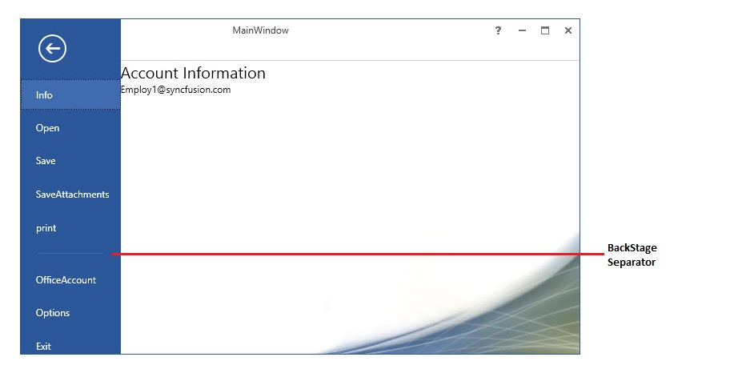
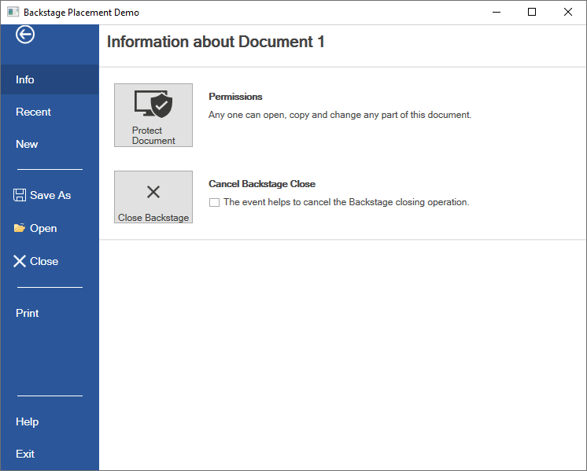
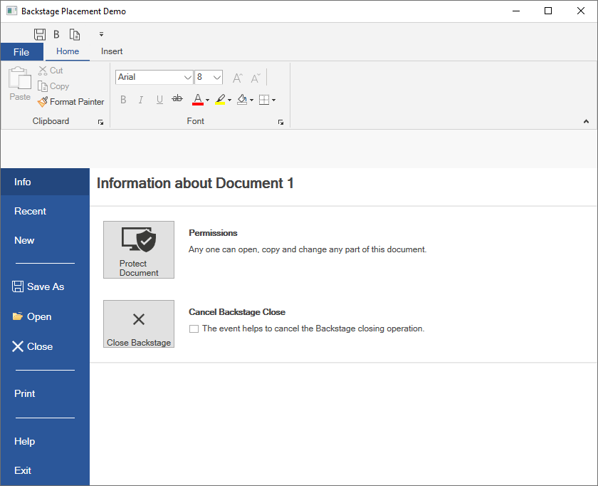
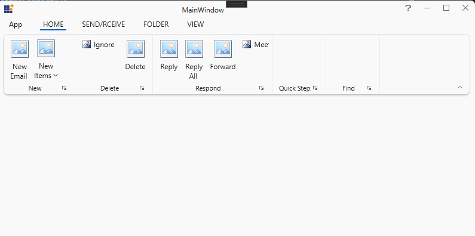
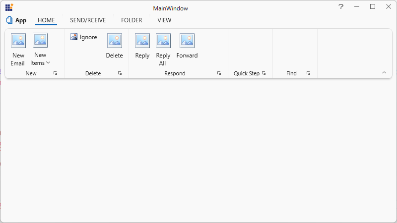
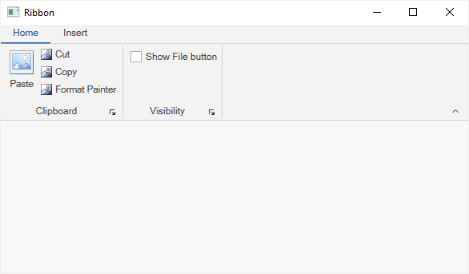

# BackStage in WPF Ribbon

Backstage is a separate view containing tabs and buttons that can show an application’s information and basic settings. The backstage items can also be arranged at either the top or bottom. It provides different types of animations such as fade, scale, and zoom as well as support to customize the animation duration.

N> The BackStage feature is not available when using the default Ribbon style. In the default style and in older themes, the Ribbon supports only the [`ApplicationMenu`](https://help.syncfusion.com/cr/wpf/Syncfusion.Windows.Tools.Controls.ApplicationMenu.html). The BackStage feature is supported only in the latest ThemeStudio themes. To use BackStage in your application, you must apply one of the latest ThemeStudio themes.

## BackStage settings in Ribbon

The BackStage can be added by using [BackStage](https://help.syncfusion.com/cr/wpf/Syncfusion.Windows.Tools.Controls.Ribbon.html#Syncfusion_Windows_Tools_Controls_Ribbon_BackStage) property of Ribbon. To show the BackStage by, click the `FILE` Menu in Ribbon like in Microsoft Outlook. 





<syncfusion:RibbonWindow
xmlns="http://schemas.microsoft.com/winfx/2006/xaml/presentation"
xmlns:x="http://schemas.microsoft.com/winfx/2006/xaml"
xmlns:syncfusion="http://schemas.syncfusion.com/wpf" x:Class="RibbonControl.MainWindow"
xmlns:syncfusionskin="clr-namespace:Syncfusion.SfSkinManager;assembly=Syncfusion.SfSkinManager.WPF"
syncfusionskin:SfSkinManager.VisualStyle="Office2013White" >
    <Grid>
        <syncfusion:Ribbon x:Name="_ribbon" VerticalAlignment="Top">
            <syncfusion:RibbonTab Caption="HOME"  IsChecked="True">
                <syncfusion:RibbonBar Name="New" Width="90"  Header="New">
                    <syncfusion:RibbonButton SizeForm="Large" Label="New Email"/>
                    <syncfusion:DropDownButton SizeForm="Large" Label="New Items">
                        <syncfusion:DropDownMenuItem Header="E-mail Message"/>
                        <syncfusion:DropDownMenuItem Header="Appointment"/>
                        <syncfusion:DropDownMenuItem Header="Meeting"/>
                        <syncfusion:DropDownMenuItem Header="Contact"/>
                        <syncfusion:DropDownMenuItem Header="Task"/>
                    </syncfusion:DropDownButton>
                </syncfusion:RibbonBar>
                <syncfusion:RibbonBar Name="Delete" Width="130"  Header="Delete">
                    <syncfusion:RibbonButton Label="Ignore"/>
                    <syncfusion:SplitButton Label="Clean Up">
                        <syncfusion:DropDownMenuItem Header="Clean Up Folder"/>
                        <syncfusion:DropDownMenuItem Header="Clean Up Conversation"/>
                        <syncfusion:DropDownMenuItem Header="Clean Up Folder/SubFolder"/>
                    </syncfusion:SplitButton>
                    <syncfusion:SplitButton Label="Junk" Margin="0,0,12,0" Width="76"/>
                    <syncfusion:RibbonButton Label="Delete" SizeForm="Large"/>
                </syncfusion:RibbonBar>
                <syncfusion:RibbonBar Name="Respond" Width="200" Header="Respond">
                    <syncfusion:RibbonButton Label="Reply" SizeForm="Large"/>
                    <syncfusion:RibbonButton Label="Reply All" SizeForm="Large"/>
                    <syncfusion:RibbonButton Label="Forward" SizeForm="Large"/>
                    <syncfusion:RibbonButton Label="Meeting"/>
                    <syncfusion:SplitButton Label="IM" Margin="-2,0,6,0" Width="68"/>
                    <syncfusion:SplitButton Label="More" Margin="-2,0,6,0" Width="68"/>
                </syncfusion:RibbonBar>
                <syncfusion:RibbonBar Width="170" Name="QuickSteps" Header="Quick Steps">
                    <syncfusion:RibbonGallery Width="160"    VisualMode="InRibbon" ItemHeight="20" ItemWidth="70">
                        <syncfusion:RibbonGalleryItem  Content="Move to?"/>
                        <syncfusion:RibbonGalleryItem  Content="Team Email"/>
                        <syncfusion:RibbonGalleryItem  Content="ReplyDelete"/>
                        <syncfusion:RibbonGalleryItem  Content="To Manager"/>
                        <syncfusion:RibbonGalleryItem  Content="Done"/>
                        <syncfusion:RibbonGalleryItem  Content="Create New"/>
                    </syncfusion:RibbonGallery>
                </syncfusion:RibbonBar>
                <syncfusion:RibbonBar Width="170" Header="Find" Name="Find"  >
                    <syncfusion:RibbonComboBox Label="Filter Email" Width="160">
                        <ComboBoxItem>Person1@mail.com</ComboBoxItem>
                        <ComboBoxItem>Person2@mail.com</ComboBoxItem>
                        <ComboBoxItem>Person3@mail.com</ComboBoxItem>
                    </syncfusion:RibbonComboBox>
                </syncfusion:RibbonBar>
            </syncfusion:RibbonTab>
            <syncfusion:RibbonTab Caption="SEND/RCEIVE"  IsChecked="False"/>
            <syncfusion:RibbonTab Caption="FOLDER"  IsChecked="False"/>
            <syncfusion:RibbonTab Caption="VIEW"  IsChecked="False"/>
            <syncfusion:Ribbon.QuickAccessToolBar>
                <syncfusion:QuickAccessToolBar>
                    <syncfusion:RibbonButton SizeForm="ExtraSmall"/>
                    <syncfusion:RibbonButton SizeForm="ExtraSmall" />          
                    <syncfusion:QuickAccessToolBar.QATMenuItems>
                        <syncfusion:RibbonButton Label="Send" />
                        <syncfusion:RibbonButton Label="Forward" />
                        <syncfusion:RibbonButton Label="ReplyAll" />
                        <syncfusion:RibbonButton Label="Delete" />
                        <syncfusion:RibbonButton Label="Print" />
                    </syncfusion:QuickAccessToolBar.QATMenuItems>
                </syncfusion:QuickAccessToolBar>
            </syncfusion:Ribbon.QuickAccessToolBar>
            <syncfusion:Ribbon.BackStage>
                <syncfusion:Backstage/>
            </syncfusion:Ribbon.BackStage>
        </syncfusion:Ribbon>
    </Grid>
</syncfusion:RibbonWindow>





### Customize the BackStage Visibility 

The [`IsBackStageVisible`](https://help.syncfusion.com/cr/wpf/Syncfusion.Windows.Tools.Controls.Ribbon.html#Syncfusion_Windows_Tools_Controls_Ribbon_IsBackStageVisible) property of Ribbon enables you to show/hide the BackStage. The following code example illustrates how to show or hide BackStage.

1. Through Property 






<syncfusion:Ribbon x:Name="_ribbon" VerticalAlignment="Top" IsBackStageVisible ="True"/>





_ribbon.IsBackStageVisible = true;





{{ codesnippet1 | OrderList_Indent_Level_1 }}

2. Through Methods






private void ShowBackstage_Click(object sender, RoutedEventArgs e)
{
    //to show back stage
    _ribbon.ShowBackStage();
}

private void HideBackstage_Click(object sender, RoutedEventArgs e)
{
    //to hide the back stage
    _ribbon.HideBackStage();
}





Private Sub ShowBackstage_Click(ByVal sender As Object, ByVal e As RoutedEventArgs)
	'to show back stage
	_ribbon.ShowBackStage()
End Sub

Private Sub HideBackstage_Click(ByVal sender As Object, ByVal e As RoutedEventArgs)
	'to hide the back stage
	_ribbon.HideBackStage()
End Sub





{{ codesnippet2 | OrderList_Indent_Level_1 }}

3. Through Commands

Ribbon control provides the static command [OpenBackStage](https://help.syncfusion.com/cr/wpf/Syncfusion.Windows.Tools.Controls.RibbonCommands.html#Syncfusion_Windows_Tools_Controls_RibbonCommands_OpenBackStage) to show/hide the BackStage based on the parameter passed to it.






<syncfusion:RibbonButton x:Name="ribbonButton" Label="Open Backstage" Command="{x:Static syncfusion:RibbonCommands.OpenBackStage}" CommandTarget="{Binding ElementName=ribbon}">
    <syncfusion:RibbonButton.CommandParameter>
        <!--If we passes false it will hide the backstage otherwise it will show the backstage-->
        <sys:Boolean>true</sys:Boolean>
    </syncfusion:RibbonButton.CommandParameter>
</syncfusion:RibbonButton>




{{ codesnippet3 | OrderList_Indent_Level_1 }}

N> In order to bind the [`OpenBackStage`](https://help.syncfusion.com/cr/wpf/Syncfusion.Windows.Tools.Controls.RibbonCommands.html#Syncfusion_Windows_Tools_Controls_RibbonCommands_OpenBackStage) command, CommandTarget and CommandParameter must be defined.

## Add BackStageCommandButton

The `BackStageCommandButton` can be added to BackStage as BackStage Element. Here four BackStageCommandButtons are added with `Header` property value as "Save", "SaveAttachments", "Options" and "Exit". 





<syncfusion:RibbonWindow
xmlns="http://schemas.microsoft.com/winfx/2006/xaml/presentation"
xmlns:x="http://schemas.microsoft.com/winfx/2006/xaml"
xmlns:syncfusion="http://schemas.syncfusion.com/wpf" x:Class="RibbonControl.MainWindow"
xmlns:syncfusionskin="clr-namespace:Syncfusion.SfSkinManager;assembly=Syncfusion.SfSkinManager.WPF"
syncfusionskin:SfSkinManager.VisualStyle="Office2013White" >
    <Grid>
        <syncfusion:Ribbon x:Name="_ribbon" VerticalAlignment="Top">
            <syncfusion:RibbonTab Caption="HOME"  IsChecked="True">
                <syncfusion:RibbonBar Name="New" Width="90"  Header="New">
                    <syncfusion:RibbonButton SizeForm="Large" Label="New Email"/>
                    <syncfusion:DropDownButton SizeForm="Large" Label="New Items">
                        <syncfusion:DropDownMenuItem Header="E-mail Message"/>
                        <syncfusion:DropDownMenuItem Header="Appointment"/>
                        <syncfusion:DropDownMenuItem Header="Meeting"/>
                        <syncfusion:DropDownMenuItem Header="Contact"/>
                        <syncfusion:DropDownMenuItem Header="Task"/>
                    </syncfusion:DropDownButton>
                </syncfusion:RibbonBar>
                <syncfusion:RibbonBar Name="Delete" Width="130"  Header="Delete">
                    <syncfusion:RibbonButton Label="Ignore"/>
                    <syncfusion:SplitButton Label="Clean Up">
                        <syncfusion:DropDownMenuItem Header="Clean Up Folder"/>
                        <syncfusion:DropDownMenuItem Header="Clean Up Conversation"/>
                        <syncfusion:DropDownMenuItem Header="Clean Up Folder/SubFolder"/>
                    </syncfusion:SplitButton>
                    <syncfusion:SplitButton Label="Junk" Margin="0,0,12,0" Width="76"/>
                    <syncfusion:RibbonButton Label="Delete" SizeForm="Large"/>
                </syncfusion:RibbonBar>
                <syncfusion:RibbonBar Name="Respond" Width="200" Header="Respond">
                    <syncfusion:RibbonButton Label="Reply" SizeForm="Large"/>
                    <syncfusion:RibbonButton Label="Reply All" SizeForm="Large"/>
                    <syncfusion:RibbonButton Label="Forward" SizeForm="Large"/>
                    <syncfusion:RibbonButton Label="Meeting"/>
                    <syncfusion:SplitButton Label="IM" Margin="-2,0,6,0" Width="68"/>
                    <syncfusion:SplitButton Label="More" Margin="-2,0,6,0" Width="68"/>
                </syncfusion:RibbonBar>
                <syncfusion:RibbonBar Width="170" Name="QuickSteps" Header="Quick Steps">
                    <syncfusion:RibbonGallery Width="160"    VisualMode="InRibbon" ItemHeight="20" ItemWidth="70">
                        <syncfusion:RibbonGalleryItem  Content="Move to?"/>
                        <syncfusion:RibbonGalleryItem  Content="Team Email"/>
                        <syncfusion:RibbonGalleryItem  Content="ReplyDelete"/>
                        <syncfusion:RibbonGalleryItem  Content="To Manager"/>
                        <syncfusion:RibbonGalleryItem  Content="Done"/>
                        <syncfusion:RibbonGalleryItem  Content="Create New"/>
                    </syncfusion:RibbonGallery>
                </syncfusion:RibbonBar>
                <syncfusion:RibbonBar Width="170" Header="Find" Name="Find"  >
                    <syncfusion:RibbonComboBox Label="Filter Email" Width="160">
                        <ComboBoxItem>Person1@mail.com</ComboBoxItem>
                        <ComboBoxItem>Person2@mail.com</ComboBoxItem>
                        <ComboBoxItem>Person3@mail.com</ComboBoxItem>
                    </syncfusion:RibbonComboBox>
                </syncfusion:RibbonBar>
            </syncfusion:RibbonTab>
            <syncfusion:RibbonTab Caption="SEND/RCEIVE"  IsChecked="False"/>
            <syncfusion:RibbonTab Caption="FOLDER"  IsChecked="False"/>
            <syncfusion:RibbonTab Caption="VIEW"  IsChecked="False"/>
            <syncfusion:Ribbon.QuickAccessToolBar>
                <syncfusion:QuickAccessToolBar>
                    <syncfusion:RibbonButton SizeForm="ExtraSmall"/>
                    <syncfusion:RibbonButton SizeForm="ExtraSmall" />
                    <syncfusion:QuickAccessToolBar.QATMenuItems>
                        <syncfusion:RibbonButton Label="Send" />
                        <syncfusion:RibbonButton Label="Forward" />
                        <syncfusion:RibbonButton Label="ReplyAll" />
                        <syncfusion:RibbonButton Label="Delete" />
                        <syncfusion:RibbonButton Label="Print" />
                    </syncfusion:QuickAccessToolBar.QATMenuItems>
                </syncfusion:QuickAccessToolBar>
            </syncfusion:Ribbon.QuickAccessToolBar>
            <syncfusion:Ribbon.BackStage>
                <syncfusion:Backstage>
                    <syncfusion:BackStageCommandButton Header="Save" />
                    <syncfusion:BackStageCommandButton Header="SaveAttachments" />
                    <syncfusion:BackStageCommandButton Header="Options" />
                    <syncfusion:BackStageCommandButton Header="Exit" />
                </syncfusion:Backstage>
            </syncfusion:Ribbon.BackStage>
        </syncfusion:Ribbon>
    </Grid>
</syncfusion:RibbonWindow>





## Setting image to BackStageCommandButton

 The [`BackStageCommandButton`](https://help.syncfusion.com/cr/wpf/Syncfusion.Windows.Tools.Controls.BackStageCommandButton.html) allows to display any type of image such as glyph, font or any custom content using the [`IconTemplate`](https://help.syncfusion.com/cr/wpf/Syncfusion.Windows.Tools.Controls.RibbonButton.html#Syncfusion_Windows_Tools_Controls_RibbonButton_IconTemplate) property, which is the preferred option. It also allows to display a normal image or vector image using the [`IconType`](https://help.syncfusion.com/cr/wpf/Syncfusion.Windows.Tools.Controls.RibbonButton.html#Syncfusion_Windows_Tools_Controls_RibbonButton_IconType) enumeration property. The default value of the [`IconType`](https://help.syncfusion.com/cr/wpf/Syncfusion.Windows.Tools.Controls.RibbonButton.html#Syncfusion_Windows_Tools_Controls_RibbonButton_IconType) property is **Icon**. The [`IconType`](https://help.syncfusion.com/cr/wpf/Syncfusion.Windows.Tools.IconType.html) enumeration has the following values:

 * **Icon** - Gets the details of the icon from the [`Icon`](https://help.syncfusion.com/cr/wpf/Syncfusion.Windows.Tools.Controls.BackStageCommandButton.html#Syncfusion_Windows_Tools_Controls_BackStageCommandButton_Icon) property and sets it to the [`BackStageCommandButton`](https://help.syncfusion.com/cr/wpf/Syncfusion.Windows.Tools.Controls.BackStageCommandButton.html).
 * **VectorImage** - Gets the details of the icon path from the [`VectorImage`](https://help.syncfusion.com/cr/wpf/Syncfusion.Windows.Tools.Controls.RibbonButton.html#Syncfusion_Windows_Tools_Controls_RibbonButton_VectorImage) property and sets it to the [`BackStageCommandButton`](https://help.syncfusion.com/cr/wpf/Syncfusion.Windows.Tools.Controls.BackStageCommandButton.html).

 N> The [`BackStageCommandButton`](https://help.syncfusion.com/cr/wpf/Syncfusion.Windows.Tools.Controls.BackStageCommandButton.html) loads icon in the following priority order,
 * [`IconTemplate`](https://help.syncfusion.com/cr/wpf/Syncfusion.Windows.Tools.Controls.RibbonButton.html#Syncfusion_Windows_Tools_Controls_RibbonButton_IconTemplate)
 * [`VectorImage`](https://help.syncfusion.com/cr/wpf/Syncfusion.Windows.Tools.Controls.RibbonButton.html#Syncfusion_Windows_Tools_Controls_RibbonButton_VectorImage)
 * [`Icon`](https://help.syncfusion.com/cr/wpf/Syncfusion.Windows.Tools.Controls.BackStageCommandButton.html#Syncfusion_Windows_Tools_Controls_BackStageCommandButton_Icon)

### Setting icon template

The [`IconTemplate`](https://help.syncfusion.com/cr/wpf/Syncfusion.Windows.Tools.Controls.RibbonButton.html#Syncfusion_Windows_Tools_Controls_RibbonButton_IconTemplate) property provides support to set any type of image such as glyph, font or any custom content to the [`BackStageCommandButton`](https://help.syncfusion.com/cr/wpf/Syncfusion.Windows.Tools.Controls.BackStageCommandButton.html). The [`BackStageCommandButton`](https://help.syncfusion.com/cr/wpf/Syncfusion.Windows.Tools.Controls.BackStageCommandButton.html) displays the [`IconTemplate`](https://help.syncfusion.com/cr/wpf/Syncfusion.Windows.Tools.Controls.RibbonButton.html#Syncfusion_Windows_Tools_Controls_RibbonButton_IconTemplate) in 16 * 16 size.





 <syncfusion:RibbonWindow x:Class="WpfApp1.MainWindow"
        xmlns="http://schemas.microsoft.com/winfx/2006/xaml/presentation"
        xmlns:x="http://schemas.microsoft.com/winfx/2006/xaml"
        xmlns:d="http://schemas.microsoft.com/expression/blend/2008"
        xmlns:mc="http://schemas.openxmlformats.org/markup-compatibility/2006"
        xmlns:local="clr-namespace:WpfApp1"
        mc:Ignorable="d" xmlns:syncfusion="http://schemas.syncfusion.com/wpf"
        xmlns:skin="clr-namespace:Syncfusion.SfSkinManager;assembly=Syncfusion.SfSkinManager.WPF"
        skin:SfSkinManager.VisualStyle="MaterialLight"
        Title="MainWindow" Height="450" Width="600">
    <Grid>
        <syncfusion:Ribbon VerticalAlignment="Top" EnableSimplifiedLayoutMode="True">
            <syncfusion:Ribbon.BackStage>
                <syncfusion:Backstage>
                    <syncfusion:BackStageCommandButton Header="Save" >
                        <syncfusion:BackStageCommandButton.IconTemplate>
                            <DataTemplate>
                                <Path Width="12" Height="12" HorizontalAlignment="Center" VerticalAlignment="Center"
                         Data="M5.0000019,11 L5.0000019,15 11.000002,15 11.000002,11 z M4.0000019,1 L4.0000019,6 12.000002,6 12.000002,1 z M1,1 L1,13.174 2.7160001,15 4.0000019,15 4.0000019,10 12.000002,10 12.000002,15 15,15 15,1 13.000002,1 13.000002,7 3.0000019,7 3.0000019,1 z M0,0 L3.0000019,0 13.000002,0 16,0 16,16 12.000002,16 4.0000019,16 2.2840004,16 0,13.57 z"
                         Fill="{Binding RelativeSource={RelativeSource Mode=Self}, Path=(TextBlock.Foreground)}" Stretch="Uniform" />
                            </DataTemplate>
                        </syncfusion:BackStageCommandButton.IconTemplate>
                    </syncfusion:BackStageCommandButton>
                    <syncfusion:BackStageCommandButton Header="Close" >
                        <syncfusion:BackStageCommandButton.IconTemplate>
                            <DataTemplate>
                                <Grid Width="12" Height="12" HorizontalAlignment="Center" VerticalAlignment="Center" SnapsToDevicePixels="true">
                                    <Path
                                        Width="12" Height="12" HorizontalAlignment="Center" VerticalAlignment="Center"
                                        Data="M1.4139423,0L7.0029922,5.5845888 12.592018,0 14.006015,1.4149939 8.4180527,6.9985202 14.006,12.582007 12.591996,13.997001 7.0030056,8.4124444 1.4140122,13.997001 1.5026823E-05,12.582007 5.5879484,6.9985092 0,1.4149939z "
                                        Fill="{Binding RelativeSource={RelativeSource Mode=Self}, Path=(TextBlock.Foreground)}" 
                                        SnapsToDevicePixels="True" Stretch="Fill" />
                                </Grid>
                            </DataTemplate>
                        </syncfusion:BackStageCommandButton.IconTemplate>
                    </syncfusion:BackStageCommandButton>
                </syncfusion:Backstage>
            </syncfusion:Ribbon.BackStage>
            <syncfusion:Ribbon.QuickAccessToolBar>
                <syncfusion:QuickAccessToolBar/>
            </syncfusion:Ribbon.QuickAccessToolBar>
            <syncfusion:RibbonTab Caption="Home">
                <syncfusion:RibbonBar Header="Clipboard">
                </syncfusion:RibbonBar>
            </syncfusion:RibbonTab>
        </syncfusion:Ribbon>
    </Grid>
</syncfusion:RibbonWindow>

 

 

 Ribbon ribbon = new Ribbon();
 ribbon.VerticalAlignment = VerticalAlignment.Top;
 // Creating new tabs
 RibbonTab homeTab = new RibbonTab();
 homeTab.Caption = "Home";
 homeTab.IsChecked = true;
 
 Backstage backstage = new Backstage();
 
 BackStageCommandButton backStageCommandButton = new BackStageCommandButton();
 backStageCommandButton.Header = "Save";
 
 DataTemplate iconDataTemplate = new DataTemplate();
 FrameworkElementFactory gridElement = new FrameworkElementFactory(typeof(Grid));
 FrameworkElementFactory pathElement1 = new FrameworkElementFactory(typeof(Path));
 
 pathElement1.SetValue(Path.DataProperty, Geometry.Parse("M5.0000019,11 L5.0000019,15 11.000002,15 11.000002,11 z M4.0000019,1 L4.0000019,6 12.000002,6 12.000002,1 z M1,1 L1,13.174 2.7160001,15 4.0000019,15 4.0000019,10 12.000002,10 12.000002,15 15,15 15,1 13.000002,1 13.000002,7 3.0000019,7 3.0000019,1 z M0,0 L3.0000019,0 13.000002,0 16,0 16,16 12.000002,16 4.0000019,16 2.2840004,16 0,13.57 z"));
 pathElement1.SetValue(Path.HeightProperty, (double)12);
 pathElement1.SetValue(Path.WidthProperty, (double)12);
 pathElement1.SetValue(Path.FillProperty, new SolidColorBrush(Colors.White));
 pathElement1.SetValue(Path.StretchProperty, Stretch.Fill);
 
 gridElement.AppendChild(pathElement1);
 
 iconDataTemplate.VisualTree = gridElement;
 backStageCommandButton.IconTemplate = iconDataTemplate;
 backstage.Items.Add(backStageCommandButton);
 
 BackStageCommandButton backStageCommandButton2 = new BackStageCommandButton();
 backStageCommandButton2.Header = "Close";
 
 DataTemplate iconDataTemplate2 = new DataTemplate();
 FrameworkElementFactory gridElement2 = new FrameworkElementFactory(typeof(Grid));
 FrameworkElementFactory pathElement2 = new FrameworkElementFactory(typeof(Path));
 
 gridElement2.SetValue(Grid.WidthProperty, (double)12);
 gridElement2.SetValue(Grid.HeightProperty, (double)12);
 pathElement2.SetValue(Path.DataProperty, Geometry.Parse("M1.4139423,0L7.0029922,5.5845888 12.592018,0 14.006015,1.4149939 8.4180527,6.9985202 14.006,12.582007 12.591996,13.997001 7.0030056,8.4124444 1.4140122,13.997001 1.5026823E-05,12.582007 5.5879484,6.9985092 0,1.4149939z"));
 pathElement2.SetValue(Path.HeightProperty, (double)12);
 pathElement2.SetValue(Path.WidthProperty, (double)12);
 pathElement2.SetValue(Path.FillProperty, new SolidColorBrush(Colors.White));
 pathElement2.SetValue(Path.StretchProperty, Stretch.Fill);
 
 gridElement2.AppendChild(pathElement2);
 
 iconDataTemplate2.VisualTree = gridElement2;
 backStageCommandButton2.IconTemplate = iconDataTemplate2;
 backstage.Items.Add(backStageCommandButton2);
 
 //Setting backstage to ribbon
 ribbon.BackStage = backstage;
 ribbon.Items.Add(homeTab);
 grid.Children.Add(ribbon);
 SfSkinManager.SetVisualStyle(this, VisualStyles.MaterialLight);

 

 

 

 N> [View sample in GitHub](https://github.com/SyncfusionExamples/syncfusion-wpf-ribbon-examples/tree/main/Samples/Setting-icons-using-IconTemplate)

### Setting image path

 The [`BackStageCommandButton`](https://help.syncfusion.com/cr/wpf/Syncfusion.Windows.Tools.Controls.BackStageCommandButton.html) allows to set the image using its [`Icon`](https://help.syncfusion.com/cr/wpf/Syncfusion.Windows.Tools.Controls.BackStageCommandButton.html#Syncfusion_Windows_Tools_Controls_BackStageCommandButton_Icon) property. The [`BackStageCommandButton`](https://help.syncfusion.com/cr/wpf/Syncfusion.Windows.Tools.Controls.BackStageCommandButton.html) displays the [`Icon`](https://help.syncfusion.com/cr/wpf/Syncfusion.Windows.Tools.Controls.BackStageCommandButton.html#Syncfusion_Windows_Tools_Controls_BackStageCommandButton_Icon) in 16 * 16 size.





 <syncfusion:RibbonWindow x:Class="WpfApp1.MainWindow"
        xmlns="http://schemas.microsoft.com/winfx/2006/xaml/presentation"
        xmlns:x="http://schemas.microsoft.com/winfx/2006/xaml"
        xmlns:d="http://schemas.microsoft.com/expression/blend/2008"
        xmlns:mc="http://schemas.openxmlformats.org/markup-compatibility/2006"
        xmlns:local="clr-namespace:WpfApp1"
        mc:Ignorable="d" xmlns:syncfusion="http://schemas.syncfusion.com/wpf"
        xmlns:skin="clr-namespace:Syncfusion.SfSkinManager;assembly=Syncfusion.SfSkinManager.WPF"
        skin:SfSkinManager.VisualStyle="MaterialLight"
        Title="MainWindow" Height="450" Width="600">
    <Grid x:Name="grid">
        <syncfusion:Ribbon VerticalAlignment="Top" EnableSimplifiedLayoutMode="True" >
            <syncfusion:Ribbon.BackStage>
                <syncfusion:Backstage>
                    <syncfusion:BackStageCommandButton Header="Save" Icon="Resources/Save.png" />
                    <syncfusion:BackStageCommandButton Header="Close" Icon="Resources/Close.png"/>
                </syncfusion:Backstage>
            </syncfusion:Ribbon.BackStage>
            <syncfusion:Ribbon.QuickAccessToolBar>
                <syncfusion:QuickAccessToolBar/>
            </syncfusion:Ribbon.QuickAccessToolBar>
            <syncfusion:RibbonTab Caption="Home">
                <syncfusion:RibbonBar Header="Clipboard">
                </syncfusion:RibbonBar>
            </syncfusion:RibbonTab>
        </syncfusion:Ribbon>
    </Grid>
 </syncfusion:RibbonWindow>





 Ribbon ribbon = new Ribbon();
 ribbon.VerticalAlignment = VerticalAlignment.Top;
 // Creating new tabs
 RibbonTab homeTab = new RibbonTab();
 homeTab.Caption = "Home";
 homeTab.IsChecked = true;
 
 Backstage backstage = new Backstage();
 BackStageCommandButton backStageCommandButton = new BackStageCommandButton();
 backStageCommandButton.Header = "Save";
 backStageCommandButton.Icon = new BitmapImage(new Uri(@"/Resources/Save.png", UriKind.RelativeOrAbsolute));
 backstage.Items.Add(backStageCommandButton);
 
 BackStageCommandButton backStageCommandButton2 = new BackStageCommandButton();
 backStageCommandButton2.Header = "Close";
 backStageCommandButton2.Icon = new BitmapImage(new Uri(@"/Resources/Close.png", UriKind.RelativeOrAbsolute));
 backstage.Items.Add(backStageCommandButton2);
 
 //Setting backstage to ribbon
 ribbon.BackStage = backstage;
 ribbon.Items.Add(homeTab);
 grid.Children.Add(ribbon);
 SfSkinManager.SetVisualStyle(this, VisualStyles.MaterialLight);

 

 

 

### Setting vector image 

 The [`VectorImage`](https://help.syncfusion.com/cr/wpf/Syncfusion.Windows.Tools.Controls.RibbonButton.html#Syncfusion_Windows_Tools_Controls_RibbonButton_VectorImage) property is of type `ObservableCollection<Path>` which allows the image to be set as path type. The [`BackStageCommandButton`](https://help.syncfusion.com/cr/wpf/Syncfusion.Windows.Tools.Controls.BackStageCommandButton.html) displays the [`VectorImage`](https://help.syncfusion.com/cr/wpf/Syncfusion.Windows.Tools.Controls.RibbonButton.html#Syncfusion_Windows_Tools_Controls_RibbonButton_VectorImage) in 16 * 16 size.

 N> The [`IconTemplate`](https://help.syncfusion.com/cr/wpf/Syncfusion.Windows.Tools.Controls.RibbonButton.html#Syncfusion_Windows_Tools_Controls_RibbonButton_IconTemplate) property is the preferred option to set any type of image such as glyph, font or any custom content when compared to the [`VectorImage`](https://help.syncfusion.com/cr/wpf/Syncfusion.Windows.Tools.Controls.RibbonButton.html#Syncfusion_Windows_Tools_Controls_RibbonButton_VectorImage) property.

 

 

 <syncfusion:RibbonWindow x:Class="WpfApp1.MainWindow"
        xmlns="http://schemas.microsoft.com/winfx/2006/xaml/presentation"
        xmlns:x="http://schemas.microsoft.com/winfx/2006/xaml"
        xmlns:d="http://schemas.microsoft.com/expression/blend/2008"
        xmlns:mc="http://schemas.openxmlformats.org/markup-compatibility/2006"
        xmlns:local="clr-namespace:WpfApp1"
        mc:Ignorable="d" xmlns:syncfusion="http://schemas.syncfusion.com/wpf"
        xmlns:skin="clr-namespace:Syncfusion.SfSkinManager;assembly=Syncfusion.SfSkinManager.WPF"
        skin:SfSkinManager.VisualStyle="MaterialLight"
        Title="MainWindow" Height="450" Width="600">
    <Grid x:Name="grid">
        <syncfusion:Ribbon VerticalAlignment="Top" EnableSimplifiedLayoutMode="True" >
            <syncfusion:Ribbon.BackStage>
                <syncfusion:Backstage>
                    <syncfusion:BackStageCommandButton Header="Save" IconType="VectorImage" >
                        <syncfusion:BackStageCommandButton.VectorImage>
                                <Path Width="12" Height="12" HorizontalAlignment="Center" VerticalAlignment="Center"
                         Data="M5.0000019,11 L5.0000019,15 11.000002,15 11.000002,11 z M4.0000019,1 L4.0000019,6 12.000002,6 12.000002,1 z M1,1 L1,13.174 2.7160001,15 4.0000019,15 4.0000019,10 12.000002,10 12.000002,15 15,15 15,1 13.000002,1 13.000002,7 3.0000019,7 3.0000019,1 z M0,0 L3.0000019,0 13.000002,0 16,0 16,16 12.000002,16 4.0000019,16 2.2840004,16 0,13.57 z"
                         Fill="{Binding RelativeSource={RelativeSource Mode=Self}, Path=(TextBlock.Foreground)}" Stretch="Uniform" />
                        </syncfusion:BackStageCommandButton.VectorImage>
                    </syncfusion:BackStageCommandButton>
                    <syncfusion:BackStageCommandButton Header="Close" IconType="VectorImage">
                        <syncfusion:BackStageCommandButton.VectorImage>
                             <Path
                                 Width="12" Height="12" HorizontalAlignment="Center" VerticalAlignment="Center"
                                 Data="M1.4139423,0L7.0029922,5.5845888 12.592018,0 14.006015,1.4149939 8.4180527,6.9985202 14.006,12.582007 12.591996,13.997001 7.0030056,8.4124444 1.4140122,13.997001 1.5026823E-05,12.582007 5.5879484,6.9985092 0,1.4149939z"
                                 Fill="{Binding RelativeSource={RelativeSource Mode=Self}, Path=(TextBlock.Foreground)}" 
                                 SnapsToDevicePixels="True" Stretch="Fill" />
                        </syncfusion:BackStageCommandButton.VectorImage>
                    </syncfusion:BackStageCommandButton>
                </syncfusion:Backstage>
            </syncfusion:Ribbon.BackStage>
            <syncfusion:Ribbon.QuickAccessToolBar>
                <syncfusion:QuickAccessToolBar/>
            </syncfusion:Ribbon.QuickAccessToolBar>
            <syncfusion:RibbonTab Caption="Home">
                <syncfusion:RibbonBar Header="Clipboard">
                </syncfusion:RibbonBar>
            </syncfusion:RibbonTab>
        </syncfusion:Ribbon>
    </Grid>
 </syncfusion:RibbonWindow>

 

 

 Ribbon ribbon = new Ribbon();
 ribbon.VerticalAlignment = VerticalAlignment.Top;
 // Creating new tabs
 RibbonTab homeTab = new RibbonTab();
 homeTab.Caption = "Home";
 homeTab.IsChecked = true;
 
 Backstage backstage = new Backstage();
 BackStageCommandButton backStageCommandButton = new BackStageCommandButton();
 backStageCommandButton.Header = "Save";
 
 Path savePath1 = new Path();
 savePath1.Data = Geometry.Parse("M5.0000019,11 L5.0000019,15 11.000002,15 11.000002,11 z M4.0000019,1 L4.0000019,6 12.000002,6 12.000002,1 z M1,1 L1,13.174 2.7160001,15 4.0000019,15 4.0000019,10 12.000002,10 12.000002,15 15,15 15,1 13.000002,1 13.000002,7 3.0000019,7 3.0000019,1 z M0,0 L3.0000019,0 13.000002,0 16,0 16,16 12.000002,16 4.0000019,16 2.2840004,16 0,13.57 z");
 savePath1.Height = 12;
 savePath1.Width = 12;
 savePath1.Fill = new SolidColorBrush(Colors.White);
 savePath1.Stretch = Stretch.Fill;
 
 backStageCommandButton.VectorImage.Add(savePath1);
 backstage.Items.Add(backStageCommandButton);
 
 BackStageCommandButton backStageCommandButton2 = new BackStageCommandButton();
 backStageCommandButton2.Header = "Close";
 
 Path closePath1 = new Path();
 closePath1.Data = Geometry.Parse("M1.4139423,0L7.0029922,5.5845888 12.592018,0 14.006015,1.4149939 8.4180527,6.9985202 14.006,12.582007 12.591996,13.997001 7.0030056,8.4124444 1.4140122,13.997001 1.5026823E-05,12.582007 5.5879484,6.9985092 0,1.4149939z");
 closePath1.Height = 12;
 closePath1.Width = 12;
 closePath1.Fill = new SolidColorBrush(Colors.White);
 closePath1.Stretch = Stretch.Fill;
 
 backStageCommandButton2.VectorImage.Add(closePath1);
 backstage.Items.Add(backStageCommandButton2);
 
 //Setting backstage to ribbon
 ribbon.BackStage = backstage;
 ribbon.Items.Add(homeTab);
 grid.Children.Add(ribbon);
 SfSkinManager.SetVisualStyle(this, VisualStyles.MaterialLight);

 

 

 

## Add BackStageTabItem

The `BackStageTabItem` can also be added inside the BackStage Element. Here four BackStageCommandButtons are added with `Header` property value as "Open", "Print" and "Office Account". 





<syncfusion:RibbonWindow
xmlns="http://schemas.microsoft.com/winfx/2006/xaml/presentation"
xmlns:x="http://schemas.microsoft.com/winfx/2006/xaml"
xmlns:syncfusion="http://schemas.syncfusion.com/wpf" x:Class="RibbonControl.MainWindow"
xmlns:syncfusionskin="clr-namespace:Syncfusion.SfSkinManager;assembly=Syncfusion.SfSkinManager.WPF"
syncfusionskin:SfSkinManager.VisualStyle="Office2013White" >
    <Grid>
        <syncfusion:Ribbon x:Name="_ribbon" VerticalAlignment="Top">
            <syncfusion:RibbonTab Caption="HOME"  IsChecked="True">
                <syncfusion:RibbonBar Name="New" Width="90"  Header="New">
                    <syncfusion:RibbonButton SizeForm="Large" Label="New Email"/>
                    <syncfusion:DropDownButton SizeForm="Large" Label="New Items">
                        <syncfusion:DropDownMenuItem Header="E-mail Message"/>
                        <syncfusion:DropDownMenuItem Header="Appointment"/>
                        <syncfusion:DropDownMenuItem Header="Meeting"/>
                        <syncfusion:DropDownMenuItem Header="Contact"/>
                        <syncfusion:DropDownMenuItem Header="Task"/>
                    </syncfusion:DropDownButton>
                </syncfusion:RibbonBar>
                <syncfusion:RibbonBar Name="Delete" Width="130"  Header="Delete">
                    <syncfusion:RibbonButton Label="Ignore"/>
                    <syncfusion:SplitButton Label="Clean Up">
                        <syncfusion:DropDownMenuItem Header="Clean Up Folder"/>
                        <syncfusion:DropDownMenuItem Header="Clean Up Conversation"/>
                        <syncfusion:DropDownMenuItem Header="Clean Up Folder/SubFolder"/>
                    </syncfusion:SplitButton>
                    <syncfusion:SplitButton Label="Junk" Margin="0,0,12,0" Width="76"/>
                    <syncfusion:RibbonButton Label="Delete" SizeForm="Large"/>
                </syncfusion:RibbonBar>
                <syncfusion:RibbonBar Name="Respond" Width="200" Header="Respond">
                    <syncfusion:RibbonButton Label="Reply" SizeForm="Large"/>
                    <syncfusion:RibbonButton Label="Reply All" SizeForm="Large"/>
                    <syncfusion:RibbonButton Label="Forward" SizeForm="Large"/>
                    <syncfusion:RibbonButton Label="Meeting"/>
                    <syncfusion:SplitButton Label="IM" Margin="-2,0,6,0" Width="68"/>
                    <syncfusion:SplitButton Label="More" Margin="-2,0,6,0" Width="68"/>
                </syncfusion:RibbonBar>
                <syncfusion:RibbonBar Width="170" Name="QuickSteps" Header="Quick Steps">
                    <syncfusion:RibbonGallery Width="160"    VisualMode="InRibbon" ItemHeight="20" ItemWidth="70">
                        <syncfusion:RibbonGalleryItem  Content="Move to?"/>
                        <syncfusion:RibbonGalleryItem  Content="Team Email"/>
                        <syncfusion:RibbonGalleryItem  Content="ReplyDelete"/>
                        <syncfusion:RibbonGalleryItem  Content="To Manager"/>
                        <syncfusion:RibbonGalleryItem  Content="Done"/>
                        <syncfusion:RibbonGalleryItem  Content="Create New"/>
                    </syncfusion:RibbonGallery>
                </syncfusion:RibbonBar>
                <syncfusion:RibbonBar Width="170" Header="Find" Name="Find"  >
                    <syncfusion:RibbonComboBox Label="Filter Email" Width="160">
                        <ComboBoxItem>Person1@mail.com</ComboBoxItem>
                        <ComboBoxItem>Person2@mail.com</ComboBoxItem>
                        <ComboBoxItem>Person3@mail.com</ComboBoxItem>
                    </syncfusion:RibbonComboBox>
                </syncfusion:RibbonBar>
            </syncfusion:RibbonTab>
            <syncfusion:RibbonTab Caption="SEND/RCEIVE"  IsChecked="False"/>
            <syncfusion:RibbonTab Caption="FOLDER"  IsChecked="False"/>
            <syncfusion:RibbonTab Caption="VIEW"  IsChecked="False"/>
            <syncfusion:Ribbon.QuickAccessToolBar>
                <syncfusion:QuickAccessToolBar>
                    <syncfusion:RibbonButton SizeForm="ExtraSmall"/>
                    <syncfusion:RibbonButton SizeForm="ExtraSmall" />
                    <syncfusion:QuickAccessToolBar.QATMenuItems>
                        <syncfusion:RibbonButton Label="Send" />
                        <syncfusion:RibbonButton Label="Forward" />
                        <syncfusion:RibbonButton Label="ReplyAll" />
                        <syncfusion:RibbonButton Label="Delete" />
                        <syncfusion:RibbonButton Label="Print" />
                    </syncfusion:QuickAccessToolBar.QATMenuItems>
                </syncfusion:QuickAccessToolBar>
            </syncfusion:Ribbon.QuickAccessToolBar>
            <syncfusion:Ribbon.BackStage>
                <syncfusion:Backstage>
                    <syncfusion:BackstageTabItem  Header="Info">
                        <StackPanel>
                            <TextBlock FontSize="20" Text="Account Information"/>
                            <TextBlock FontSize="12" Text="Employ1@syncfusion.com"/>
                        </StackPanel>
                    </syncfusion:BackstageTabItem>
                    <syncfusion:BackstageTabItem  Header="Open"/>
                    <syncfusion:BackStageCommandButton Header="Save" />
                    <syncfusion:BackStageCommandButton Header="SaveAttachments" />
                    <syncfusion:BackstageTabItem  Header="print"/>
                    <syncfusion:BackstageTabItem  Header="OfficeAccount"/>
                    <syncfusion:BackStageCommandButton Header="Options" />
                    <syncfusion:BackStageCommandButton Header="Exit" />
                </syncfusion:Backstage>
            </syncfusion:Ribbon.BackStage>
        </syncfusion:Ribbon>
    </Grid>
</syncfusion:RibbonWindow>





## Add BackStage separator			

The BackStageSeparator used to group out similar backstage elements in BackStage. Here BackStageCommandButtons, BackStageTabItems are separated by [BackStageSeparator](https://help.syncfusion.com/cr/wpf/Syncfusion.Windows.Tools.Controls.BackStageSeparator.html) according to their use.





<syncfusion:RibbonWindow
xmlns="http://schemas.microsoft.com/winfx/2006/xaml/presentation"
xmlns:x="http://schemas.microsoft.com/winfx/2006/xaml"
xmlns:syncfusion="http://schemas.syncfusion.com/wpf" x:Class="RibbonControl.MainWindow"
xmlns:syncfusionskin="clr-namespace:Syncfusion.SfSkinManager;assembly=Syncfusion.SfSkinManager.WPF"
syncfusionskin:SfSkinManager.VisualStyle="Office2013White" >
    <Grid>
        <syncfusion:Ribbon x:Name="_ribbon" VerticalAlignment="Top">
            <syncfusion:RibbonTab Caption="HOME"  IsChecked="True">
                <syncfusion:RibbonBar Name="New" Width="90"  Header="New">
                    <syncfusion:RibbonButton SizeForm="Large" Label="New Email"/>
                    <syncfusion:DropDownButton SizeForm="Large" Label="New Items">
                        <syncfusion:DropDownMenuItem Header="E-mail Message"/>
                        <syncfusion:DropDownMenuItem Header="Appointment"/>
                        <syncfusion:DropDownMenuItem Header="Meeting"/>
                        <syncfusion:DropDownMenuItem Header="Contact"/>
                        <syncfusion:DropDownMenuItem Header="Task"/>
                    </syncfusion:DropDownButton>
                </syncfusion:RibbonBar>
                <syncfusion:RibbonBar Name="Delete" Width="130"  Header="Delete">
                    <syncfusion:RibbonButton Label="Ignore"/>
                    <syncfusion:SplitButton Label="Clean Up">
                        <syncfusion:DropDownMenuItem Header="Clean Up Folder"/>
                        <syncfusion:DropDownMenuItem Header="Clean Up Conversation"/>
                        <syncfusion:DropDownMenuItem Header="Clean Up Folder/SubFolder"/>
                    </syncfusion:SplitButton>
                    <syncfusion:SplitButton Label="Junk" Margin="0,0,12,0" Width="76"/>
                    <syncfusion:RibbonButton Label="Delete" SizeForm="Large"/>
                </syncfusion:RibbonBar>
                <syncfusion:RibbonBar Name="Respond" Width="200" Header="Respond">
                    <syncfusion:RibbonButton Label="Reply" SizeForm="Large"/>
                    <syncfusion:RibbonButton Label="Reply All" SizeForm="Large"/>
                    <syncfusion:RibbonButton Label="Forward" SizeForm="Large"/>
                    <syncfusion:RibbonButton Label="Meeting"/>
                    <syncfusion:SplitButton Label="IM" Margin="-2,0,6,0" Width="68"/>
                    <syncfusion:SplitButton Label="More" Margin="-2,0,6,0" Width="68"/>
                </syncfusion:RibbonBar>
                <syncfusion:RibbonBar Width="170" Name="QuickSteps" Header="Quick Steps">
                    <syncfusion:RibbonGallery Width="160"    VisualMode="InRibbon" ItemHeight="20" ItemWidth="70">
                        <syncfusion:RibbonGalleryItem  Content="Move to?"/>
                        <syncfusion:RibbonGalleryItem  Content="Team Email"/>
                        <syncfusion:RibbonGalleryItem  Content="ReplyDelete"/>
                        <syncfusion:RibbonGalleryItem  Content="To Manager"/>
                        <syncfusion:RibbonGalleryItem  Content="Done"/>
                        <syncfusion:RibbonGalleryItem  Content="Create New"/>
                    </syncfusion:RibbonGallery>
                </syncfusion:RibbonBar>
                <syncfusion:RibbonBar Width="170" Header="Find" Name="Find"  >
                    <syncfusion:RibbonComboBox Label="Filter Email" Width="160">
                        <ComboBoxItem>Person1@mail.com</ComboBoxItem>
                        <ComboBoxItem>Person2@mail.com</ComboBoxItem>
                        <ComboBoxItem>Person3@mail.com</ComboBoxItem>
                    </syncfusion:RibbonComboBox>
                </syncfusion:RibbonBar>
            </syncfusion:RibbonTab>
            <syncfusion:RibbonTab Caption="SEND/RCEIVE"  IsChecked="False"/>
            <syncfusion:RibbonTab Caption="FOLDER"  IsChecked="False"/>
            <syncfusion:RibbonTab Caption="VIEW"  IsChecked="False"/>
            <syncfusion:Ribbon.QuickAccessToolBar>
                <syncfusion:QuickAccessToolBar>
                    <syncfusion:RibbonButton SizeForm="ExtraSmall"/>
                    <syncfusion:RibbonButton SizeForm="ExtraSmall" />
                    <syncfusion:QuickAccessToolBar.QATMenuItems>
                        <syncfusion:RibbonButton Label="Send" />
                        <syncfusion:RibbonButton Label="Forward" />
                        <syncfusion:RibbonButton Label="ReplyAll" />
                        <syncfusion:RibbonButton Label="Delete" />
                        <syncfusion:RibbonButton Label="Print" />
                    </syncfusion:QuickAccessToolBar.QATMenuItems>
                </syncfusion:QuickAccessToolBar>
            </syncfusion:Ribbon.QuickAccessToolBar>
            <syncfusion:Ribbon.BackStage>
                <syncfusion:Backstage>
                    <syncfusion:BackstageTabItem  Header="Info">
                        <StackPanel>
                            <TextBlock FontSize="20" Text="Account Information"/>
                            <TextBlock FontSize="12" Text="Employ1@syncfusion.com"/>
                        </StackPanel>
                    </syncfusion:BackstageTabItem>
                    <syncfusion:BackstageTabItem  Header="Open"/>
                    <syncfusion:BackStageCommandButton Header="Save" />
                    <syncfusion:BackStageCommandButton Header="SaveAttachments" />
                    <syncfusion:BackstageTabItem  Header="print"/>
                    <syncfusion:BackStageSeparator/>
                    <syncfusion:BackstageTabItem  Header="OfficeAccount"/>
                    <syncfusion:BackStageCommandButton Header="Options" />
                    <syncfusion:BackStageCommandButton Header="Exit" />
                </syncfusion:Backstage>
            </syncfusion:Ribbon.BackStage>
        </syncfusion:Ribbon>
    </Grid>
</syncfusion:RibbonWindow>





## BackStage items position

The `BackStage` items listed below can be positioned either at top or bottom by using the [`Position`](https://help.syncfusion.com/cr/wpf/Syncfusion.Windows.Tools.Controls.BackstageTabItem.html#Syncfusion_Windows_Tools_Controls_BackstageTabItem_Position) property.
	
* [BackStageCommandButton](https://help.syncfusion.com/cr/wpf/Syncfusion.Windows.Tools.Controls.BackStageCommandButton.html)
* [BackStageTabItem](https://help.syncfusion.com/cr/wpf/Syncfusion.Windows.Tools.Controls.BackstageTabItem.html)
* [BackStageSeparator](https://help.syncfusion.com/cr/wpf/Syncfusion.Windows.Tools.Controls.BackStageSeparator.html)
	
The following code example illustrates how to position the `BackStage` items either at top or bottom.





<syncfusion:RibbonWindow
xmlns="http://schemas.microsoft.com/winfx/2006/xaml/presentation"
xmlns:x="http://schemas.microsoft.com/winfx/2006/xaml"
xmlns:syncfusion="http://schemas.syncfusion.com/wpf" x:Class="BackStage.MainWindow"
xmlns:syncfusionskin="clr-namespace:Syncfusion.SfSkinManager;assembly=Syncfusion.SfSkinManager.WPF"
syncfusionskin:SfSkinManager.VisualStyle="Office2019Colorful" Width="820" Height="600" WindowStartupLocation="CenterScreen">
    <Grid>
        <syncfusion:Ribbon x:Name="_ribbon" VerticalAlignment="Top" IsBackStageVisible="True">
            <syncfusion:RibbonTab Caption="HOME"  IsChecked="True">
                <syncfusion:RibbonBar Name="New" Width="90"  Header="New">
                    <syncfusion:RibbonButton SizeForm="Large" Label="New Email"/>
                    <syncfusion:DropDownButton SizeForm="Large" Label="New Items">
                        <syncfusion:DropDownMenuItem Header="E-mail Message"/>
                        <syncfusion:DropDownMenuItem Header="Appointment"/>
                        <syncfusion:DropDownMenuItem Header="Meeting"/>
                        <syncfusion:DropDownMenuItem Header="Contact"/>
                        <syncfusion:DropDownMenuItem Header="Task"/>
                    </syncfusion:DropDownButton>
                </syncfusion:RibbonBar>
                <syncfusion:RibbonBar Name="Delete" Width="130"  Header="Delete">
                    <syncfusion:RibbonButton Label="Ignore"/>
                    <syncfusion:SplitButton Label="Clean Up">
                        <syncfusion:DropDownMenuItem Header="Clean Up Folder"/>
                        <syncfusion:DropDownMenuItem Header="Clean Up Conversation"/>
                        <syncfusion:DropDownMenuItem Header="Clean Up Folder/SubFolder"/>
                    </syncfusion:SplitButton>
                    <syncfusion:SplitButton Label="Junk" Margin="0,0,12,0" Width="76"/>
                    <syncfusion:RibbonButton Label="Delete" SizeForm="Large"/>
                </syncfusion:RibbonBar>
                <syncfusion:RibbonBar Name="Respond" Width="200" Header="Respond">
                    <syncfusion:RibbonButton Label="Reply" SizeForm="Large"/>
                    <syncfusion:RibbonButton Label="Reply All" SizeForm="Large"/>
                    <syncfusion:RibbonButton Label="Forward" SizeForm="Large"/>
                    <syncfusion:RibbonButton Label="Meeting"/>
                    <syncfusion:SplitButton Label="IM" Margin="-2,0,6,0" Width="68"/>
                    <syncfusion:SplitButton Label="More" Margin="-2,0,6,0" Width="68"/>
                </syncfusion:RibbonBar>
                <syncfusion:RibbonBar Width="170" Name="QuickSteps" Header="Quick Steps">
                    <syncfusion:RibbonGallery Width="160"    VisualMode="InRibbon" ItemHeight="20" ItemWidth="70">
                        <syncfusion:RibbonGalleryItem  Content="Move to?"/>
                        <syncfusion:RibbonGalleryItem  Content="Team Email"/>
                        <syncfusion:RibbonGalleryItem  Content="ReplyDelete"/>
                        <syncfusion:RibbonGalleryItem  Content="To Manager"/>
                        <syncfusion:RibbonGalleryItem  Content="Done"/>
                        <syncfusion:RibbonGalleryItem  Content="Create New"/>
                    </syncfusion:RibbonGallery>
                </syncfusion:RibbonBar>
                <syncfusion:RibbonBar Width="170" Header="Find" Name="Find"  >
                    <syncfusion:RibbonComboBox Label="Filter Email" Width="160">
                        <ComboBoxItem>Person1@mail.com</ComboBoxItem>
                        <ComboBoxItem>Person2@mail.com</ComboBoxItem>
                        <ComboBoxItem>Person3@mail.com</ComboBoxItem>
                    </syncfusion:RibbonComboBox>
                </syncfusion:RibbonBar>
            </syncfusion:RibbonTab>
            <syncfusion:RibbonTab Caption="SEND/RCEIVE"  IsChecked="False"/>
            <syncfusion:RibbonTab Caption="FOLDER"  IsChecked="False"/>
            <syncfusion:RibbonTab Caption="VIEW"  IsChecked="False"/>
            <syncfusion:Ribbon.QuickAccessToolBar>
                <syncfusion:QuickAccessToolBar>
                    <syncfusion:RibbonButton SizeForm="ExtraSmall"/>
                    <syncfusion:RibbonButton SizeForm="ExtraSmall" />
                    <syncfusion:QuickAccessToolBar.QATMenuItems>
                        <syncfusion:RibbonButton Label="Send" />
                        <syncfusion:RibbonButton Label="Forward" />
                        <syncfusion:RibbonButton Label="ReplyAll" />
                        <syncfusion:RibbonButton Label="Delete" />
                        <syncfusion:RibbonButton Label="Print" />
                    </syncfusion:QuickAccessToolBar.QATMenuItems>
                </syncfusion:QuickAccessToolBar>
            </syncfusion:Ribbon.QuickAccessToolBar>
            <syncfusion:Ribbon.BackStage>
                <syncfusion:Backstage>
                    <syncfusion:BackstageTabItem  Header="Info">
                        <StackPanel>
                            <TextBlock FontSize="20" Margin="10" Text="Account Information"/>
                            <TextBlock FontSize="12" Margin="10" Text="Employ1@syncfusion.com"/>
                        </StackPanel>
                    </syncfusion:BackstageTabItem>
                    <syncfusion:BackstageTabItem  Header="Open"/>
                    <syncfusion:BackStageCommandButton Header="Save" />
                    <syncfusion:BackStageCommandButton Header="SaveAs" />
                    <syncfusion:BackStageSeparator/>
                    <syncfusion:BackstageTabItem  Header="Print"/>
                    <syncfusion:BackstageTabItem  Header="Share"/>
                    <syncfusion:BackStageSeparator Position="Bottom"/>
                    <syncfusion:BackstageTabItem Position="Bottom" Header="Options"/>
                    <syncfusion:BackStageCommandButton Position="Bottom" Header="Feedback" />
                    <syncfusion:BackStageCommandButton Position="Bottom" Header="Exit" />
                </syncfusion:Backstage>
            </syncfusion:Ribbon.BackStage>
        </syncfusion:Ribbon>
    </Grid>
</syncfusion:RibbonWindow>





N> [View sample in GitHub](https://github.com/SyncfusionExamples/syncfusion-wpf-ribbon-examples/tree/main/Samples/Positioning-BackStageItems)

## Different types of Animation

Backstage provides different types of animations such as fade, scale, and zoom by using the [`AnimationType`](https://help.syncfusion.com/cr/wpf/Syncfusion.Windows.Tools.Controls.Backstage.html#Syncfusion_Windows_Tools_Controls_Backstage_AnimationType) enumeration property.

* None
* Slide
* Fade
* Zoom

## Animation duration

The [`AnimationDuration`](https://help.syncfusion.com/cr/wpf/Syncfusion.Windows.Tools.Controls.Backstage.html#Syncfusion_Windows_Tools_Controls_Backstage_AnimationDuration) property is used to set the duration for animation in milliseconds.

The following code example illustrates how to animate the BackStage using the [`AnimationType`](https://help.syncfusion.com/cr/wpf/Syncfusion.Windows.Tools.Controls.Backstage.html#Syncfusion_Windows_Tools_Controls_Backstage_AnimationType) property.



 

 <syncfusion:Ribbon.BackStage>
    <syncfusion:Backstage x:Name="ribbonBackStage" AnimationDuration="00:00:00.250"  syncfusion:Ribbon.KeyTip="B" AnimationType="{Binding ElementName=AnimationTypes,Path=SelectedItem,UpdateSourceTrigger=PropertyChanged}">
                        <syncfusion:BackstageTabItem syncfusion:Ribbon.KeyTip="I" Header="Info">
                            <Grid Background="{Binding ElementName=mainRibbon,Path=Background}">
                                <Grid.RowDefinitions>
                                    <RowDefinition Height="auto" />
                                    <RowDefinition Height="auto" />
                                </Grid.RowDefinitions>
                                <local:Information x:Name="informationView" />
                            </Grid>
                        </syncfusion:BackstageTabItem>
                        <syncfusion:BackstageTabItem syncfusion:Ribbon.KeyTip="R" Header="Recent">
                            <local:Recent x:Name="recentView" Background="{Binding ElementName=mainRibbon,Path=Background}"/>
                        </syncfusion:BackstageTabItem>
                        <syncfusion:BackstageTabItem syncfusion:Ribbon.KeyTip="N" Header="New">
                            <local:New x:Name="newView" Background="{Binding ElementName=mainRibbon,Path=Background}"/>
                        </syncfusion:BackstageTabItem>
                        <syncfusion:BackStageSeparator />
                        <syncfusion:BackStageCommandButton
                        syncfusion:Ribbon.KeyTip="A"
                        Command="{Binding SaveAsCommand}"
                        Header="Save As"
                        IconTemplate="{StaticResource Save}" />
                        <syncfusion:BackStageCommandButton
                        syncfusion:Ribbon.KeyTip="E"
                        Command="{Binding OpenCommand}"
                        Header="Open"
                        Icon="/BackStage;component/Assets/Ribbon/Open32.png" />
                        <syncfusion:BackStageCommandButton
                        syncfusion:Ribbon.KeyTip="C"
                        Command="{Binding CloseCommand}"
                        Header="Close"
                        IconTemplate="{StaticResource CloseTab}" />
                        <syncfusion:BackStageSeparator />
                        <syncfusion:BackstageTabItem syncfusion:Ribbon.KeyTip="P" Header="Print">
                            <local:Print x:Name="printView" Background="{Binding ElementName=mainRibbon,Path=Background}"/>
                        </syncfusion:BackstageTabItem>
                        <syncfusion:BackStageSeparator Position="Bottom"/>
                        <syncfusion:BackstageTabItem syncfusion:Ribbon.KeyTip="H" Position="Bottom" Header="Help">
                            <local:Help x:Name="helpView" Background="{Binding ElementName=mainRibbon,Path=Background}"/>
                        </syncfusion:BackstageTabItem>
                        <syncfusion:BackStageCommandButton
                        VerticalAlignment="Bottom" Position="Bottom"
                        syncfusion:Ribbon.KeyTip="X"
                        Command="{Binding ExitCommand}"
                        CommandParameter="{Binding ElementName=mainWindow}"
                        Header="Exit" />
    </syncfusion:Backstage>
</syncfusion:Ribbon.BackStage>

 



 ribbon.BackStage.AnimationDuration = TimeSpan.FromMilliseconds(250);

 

 

N> View [sample](https://github.com/SyncfusionExamples/How-to-set-different-types-of-animation-for-backstage-in-Ribbon) in GitHub.

## Placement Customization

The Backstage can be opened or closed within any window or placement target specified using the [`PlacementType`](https://help.syncfusion.com/cr/wpf/Syncfusion.Windows.Tools.Controls.Backstage.html#Syncfusion_Windows_Tools_Controls_Backstage_PlacementType) and [`PlacementTarget`](https://help.syncfusion.com/cr/wpf/Syncfusion.Windows.Tools.Controls.Backstage.html#Syncfusion_Windows_Tools_Controls_Backstage_PlacementTarget) properties in BackStage. It allows us to open the Backstage under the Ribbon tab or occupies the window or placement target's entire client area.

The [`PlacementTarget`](https://help.syncfusion.com/cr/wpf/Syncfusion.Windows.Tools.Controls.Backstage.html#Syncfusion_Windows_Tools_Controls_Backstage_PlacementTarget) property specifies the element relative to which the Backstage should be positioned while it is opened.

The [`PlacementType`](https://help.syncfusion.com/cr/wpf/Syncfusion.Windows.Tools.Controls.Backstage.html#Syncfusion_Windows_Tools_Controls_Backstage_PlacementType) property provides the following options which allows to place the backstage either in full screen or below the RibbonTab. 

* FullScreen
* BelowTab

### Place the backstage in FullScreen

#### Backstage placed in RibbonWindow

When the [`PlacementType`](https://help.syncfusion.com/cr/wpf/Syncfusion.Windows.Tools.Controls.Backstage.html#Syncfusion_Windows_Tools_Controls_Backstage_PlacementType) is set to [`FullScreen`](https://help.syncfusion.com/cr/wpf/Syncfusion.Windows.Tools.Controls.BackStagePlacementType.html) and the [`PlacementTarget`](https://help.syncfusion.com/cr/wpf/Syncfusion.Windows.Tools.Controls.Backstage.html#Syncfusion_Windows_Tools_Controls_Backstage_PlacementTarget) is not set, the Backstage will occupy the entire RibbonWindow while it is opened. 

 

 

 <syncfusion:RibbonWindow
    x:Class="BackStage.MainWindow"
    xmlns="http://schemas.microsoft.com/winfx/2006/xaml/presentation"
    xmlns:x="http://schemas.microsoft.com/winfx/2006/xaml"
    xmlns:interactivity="http://schemas.microsoft.com/xaml/behaviors"
    xmlns:syncfusion="http://schemas.syncfusion.com/wpf"
    xmlns:syncfusionskin="clr-namespace:Syncfusion.SfSkinManager;assembly=Syncfusion.SfSkinManager.WPF"
    xmlns:system="clr-namespace:System;assembly=mscorlib"
    xmlns:local="clr-namespace:BackStage"
    xmlns:tools="clr-namespace:Syncfusion.Windows.Tools;assembly=Syncfusion.Tools.Wpf"
    Width="1100"
    Height="700"
    Title="Backstage Placement Demo"
    syncfusionskin:SfSkinManager.Theme="{syncfusionskin:SkinManagerExtension ThemeName=Office2019Colorful}"
    WindowStartupLocation="CenterScreen">
    <syncfusion:RibbonWindow.Resources>
        <syncfusion:ColorToBrushConverter x:Key="ColorToBrushConverter" />
    </syncfusion:RibbonWindow.Resources>
    <syncfusion:RibbonWindow.DataContext>
        <local:ViewModel />
    </syncfusion:RibbonWindow.DataContext>
    <Grid>
        <Grid.Resources>
            <ResourceDictionary>
                <ResourceDictionary.MergedDictionaries>
                    <ResourceDictionary Source="/BackStage;component/Assets/Ribbon/PathIcon.xaml"/>
                </ResourceDictionary.MergedDictionaries>
            </ResourceDictionary>
        </Grid.Resources>
        <Grid.RowDefinitions>
            <RowDefinition Height="Auto" />
            <RowDefinition Height="*" />
        </Grid.RowDefinitions>
        <Grid>
            <syncfusion:Ribbon
            Name="mainRibbon" local:ViewModel.Ribbon="{Binding ElementName=mainRibbon}" IsBackStageVisible="True"
            BackStageColor="{Binding ElementName=backColor, Path=Color, Mode=OneWay, Converter={StaticResource ColorToBrushConverter}}"
            BackStageHeader="File">
                <syncfusion:Ribbon.QuickAccessToolBar>
                    <syncfusion:QuickAccessToolBar>
                        <syncfusion:RibbonButton SizeForm="ExtraSmall" IconTemplate="{StaticResource Save}"/>
                        <syncfusion:RibbonButton SizeForm="ExtraSmall" IconTemplate="{StaticResource Bold}"/>
                        <syncfusion:RibbonButton SizeForm="ExtraSmall" IconTemplate="{StaticResource Copy}"/>
                    </syncfusion:QuickAccessToolBar>
                </syncfusion:Ribbon.QuickAccessToolBar>
                <syncfusion:Ribbon.BackStage>
                    <syncfusion:Backstage x:Name="ribbonBackStage" PlacementType="FullScreen" syncfusion:Ribbon.KeyTip="B" >
                        <syncfusion:BackstageTabItem syncfusion:Ribbon.KeyTip="I" Header="Info">
                            <Grid Background="{Binding ElementName=mainRibbon,Path=Background}">
                                <Grid.RowDefinitions>
                                    <RowDefinition Height="auto" />
                                    <RowDefinition Height="auto" />
                                </Grid.RowDefinitions>
                                <local:Information x:Name="informationView" />
                            </Grid>
                        </syncfusion:BackstageTabItem>
                        <syncfusion:BackstageTabItem syncfusion:Ribbon.KeyTip="R" Header="Recent">
                            <local:Recent x:Name="recentView" Background="{Binding ElementName=mainRibbon,Path=Background}"/>
                        </syncfusion:BackstageTabItem>
                        <syncfusion:BackstageTabItem syncfusion:Ribbon.KeyTip="N" Header="New">
                            <local:New x:Name="newView" Background="{Binding ElementName=mainRibbon,Path=Background}"/>
                        </syncfusion:BackstageTabItem>
                        <syncfusion:BackStageSeparator />
                        <syncfusion:BackStageCommandButton
                        syncfusion:Ribbon.KeyTip="A" Command="{Binding SaveAsCommand}"
                        Header="Save As" IconTemplate="{StaticResource Save}" />
                        <syncfusion:BackStageCommandButton
                        syncfusion:Ribbon.KeyTip="E" Command="{Binding OpenCommand}"
                        Header="Open" Icon="/BackStage;component/Assets/Ribbon/Open32.png" />
                        <syncfusion:BackStageCommandButton
                        syncfusion:Ribbon.KeyTip="C" Command="{Binding CloseCommand}"
                        Header="Close" IconTemplate="{StaticResource CloseTab}" />
                        <syncfusion:BackStageSeparator />
                        <syncfusion:BackstageTabItem syncfusion:Ribbon.KeyTip="P" Header="Print">
                            <local:Print x:Name="printView" Background="{Binding ElementName=mainRibbon,Path=Background}"/>
                        </syncfusion:BackstageTabItem>
                        <syncfusion:BackStageSeparator Position="Bottom"/>
                        <syncfusion:BackstageTabItem syncfusion:Ribbon.KeyTip="H" Position="Bottom" Header="Help">
                            <local:Help x:Name="helpView" Background="{Binding ElementName=mainRibbon,Path=Background}"/>
                        </syncfusion:BackstageTabItem>
                        <syncfusion:BackStageCommandButton
                        VerticalAlignment="Bottom" Position="Bottom"
                        syncfusion:Ribbon.KeyTip="X"
                        Command="{Binding ExitCommand}"
                        CommandParameter="{Binding ElementName=mainWindow}"
                        Header="Exit" />
                    </syncfusion:Backstage>
                </syncfusion:Ribbon.BackStage>
                <syncfusion:RibbonTab Caption="Home">
                    <syncfusion:RibbonBar Name="ribbonFormatBar" syncfusion:Ribbon.KeyTip="FN" Header="Clipboard">
                        <syncfusion:RibbonButton
                        Margin="1" Command="ApplicationCommands.Paste" Label="Paste"
                        SizeForm="Large" IconTemplate="{StaticResource Paste}"/>
                        <syncfusion:RibbonButton
                        HorizontalAlignment="Left" Command="ApplicationCommands.Cut" Label="Cut"
                        SizeForm="Small" IconTemplate="{StaticResource Cut}"/>
                        <syncfusion:RibbonButton
                        HorizontalAlignment="Left" Command="ApplicationCommands.Copy" Label="Copy"
                        SizeForm="Small" IconTemplate="{StaticResource Copy}"/>
                        <syncfusion:RibbonButton
                        Command="local:RibbonCommand.ButtonCommand" Label="Format Painter"
                        SizeForm="Small" IconTemplate="{StaticResource FormatPainter}"/>
                    </syncfusion:RibbonBar>
                    <syncfusion:RibbonBar Name="barFont" Header="Font" IsLargeButtonPanel="False">
                        <syncfusion:ButtonPanel SeparatorVisibility="Collapsed">
                            <syncfusion:RibbonComboBox
                            Name="ribbonFontName" Width="110" syncfusion:Ribbon.KeyTip="FF" DisplayMemberPath="FontFamily" 
                            IsEditable="True" ItemsSource="{Binding FontFamilyList}" SelectedIndex="0">
                                <interactivity:Interaction.Triggers>
                                    <interactivity:EventTrigger EventName="SelectionChanged">
                                        <interactivity:InvokeCommandAction Command="local:RibbonCommand.RibbonComboBoxCommand" CommandParameter="{Binding ElementName=ribbonFontName, Path=SelectedIndex}" />
                                    </interactivity:EventTrigger>
                                </interactivity:Interaction.Triggers>
                            </syncfusion:RibbonComboBox>
                            <syncfusion:RibbonComboBox
                            Name="ribbonFontSize" Width="40" DisplayMemberPath="FontSize"
                            IsEditable="True" ItemsSource="{Binding FontSizeList}" SelectedIndex="0">
                                <interactivity:Interaction.Triggers>
                                    <interactivity:EventTrigger EventName="SelectionChanged">
                                        <interactivity:InvokeCommandAction Command="local:RibbonCommand.RibbonComboBoxCommand" CommandParameter="{Binding ElementName=ribbonFontSize, Path=SelectedIndex}" />
                                    </interactivity:EventTrigger>
                                </interactivity:Interaction.Triggers>
                            </syncfusion:RibbonComboBox>
                        </syncfusion:ButtonPanel>
                        <syncfusion:ButtonPanel Height="24">
                            <syncfusion:RibbonButton
                            Name="ribbonIndentButton" Command="EditingCommands.IncreaseFontSize"
                            SizeForm="ExtraSmall" IconTemplate="{StaticResource IncreaseFontSize}"/>
                            <syncfusion:RibbonButton
                            Command="EditingCommands.DecreaseFontSize" SizeForm="ExtraSmall"
                            IconTemplate="{StaticResource DecreaseFontSize}"/>
                        </syncfusion:ButtonPanel>
                        <syncfusion:ButtonPanel Height="24" SeparatorVisibility="Collapsed">
                            <syncfusion:RibbonButton
                            Name="ribbonBoldButton" Command="EditingCommands.ToggleBold" IsToggle="True"
                            SizeForm="ExtraSmall" IconTemplate="{StaticResource Bold}"/>
                            <syncfusion:RibbonButton
                            Name="ribbonItalicButton" Command="EditingCommands.ToggleItalic" IsToggle="True"
                            SizeForm="ExtraSmall" IconTemplate="{StaticResource Italics}"/>
                            <syncfusion:RibbonButton
                            Name="ribbonUnderlineButton" Command="EditingCommands.ToggleUnderline"
                            IsToggle="True" SizeForm="ExtraSmall" IconTemplate="{StaticResource Underline}"/>
                            <syncfusion:RibbonButton
                            Name="strikeButton" Command="local:RibbonCommand.ButtonCommand"
                            SizeForm="ExtraSmall" IconTemplate="{StaticResource ClearFormatting}"/>
                        </syncfusion:ButtonPanel>
                        <syncfusion:ButtonPanel Height="24" SeparatorVisibility="Collapsed">
                            <syncfusion:SplitButton SizeForm="ExtraSmall" IconTemplate="{StaticResource FontColor}">
                                <syncfusion:ColorPickerPalette x:Name="fontColorPicker" Color="Black" IsExpanded="True" />
                            </syncfusion:SplitButton>
                            <syncfusion:SplitButton SizeForm="ExtraSmall" IconTemplate="{StaticResource TextHighlight}">
                                <syncfusion:ColorPickerPalette x:Name="highlightColorPicker" IsExpanded="True" Color="White" />
                            </syncfusion:SplitButton>
                            <syncfusion:SplitButton
                                Name="formatShading" syncfusion:Ribbon.KeyTip="FS" SizeForm="ExtraSmall"
                                IconTemplate="{StaticResource Shading}">
                                <syncfusion:ColorPickerPalette x:Name="shadingColorPicker" Margin="3" IsExpanded="True" Color="White" />
                            </syncfusion:SplitButton>
                            <syncfusion:SplitButton
                                Name="formatBorder" syncfusion:Ribbon.KeyTip="BF" SizeForm="ExtraSmall"
                                IconTemplate="{StaticResource FormatBorder}">
                                <ListBox BorderThickness="0">
                                    <interactivity:Interaction.Triggers>
                                        <interactivity:EventTrigger EventName="SelectionChanged">
                                            <interactivity:InvokeCommandAction Command="local:RibbonCommand.DropDownCommand" />
                                        </interactivity:EventTrigger>
                                    </interactivity:Interaction.Triggers>
                                    <ListBoxItem Margin="5">Full Border</ListBoxItem>
                                    <ListBoxItem Margin="5">Half Border</ListBoxItem>
                                    <ListBoxItem Margin="5">Inside Border</ListBoxItem>
                                    <ListBoxItem Margin="5">Outside Border</ListBoxItem>
                                </ListBox>
                            </syncfusion:SplitButton>
                        </syncfusion:ButtonPanel>
                    </syncfusion:RibbonBar>
                </syncfusion:RibbonTab>
                <syncfusion:RibbonTab Caption="Insert">
                    <syncfusion:RibbonBar Header="Pages">
                        <syncfusion:RibbonButton
                        Command="local:RibbonCommand.ButtonCommand" Label="Cover Page"
                        LargeIcon="/BackStage;component/Assets/Ribbon/CoverPage32.png" SizeForm="Large" />
                        <syncfusion:RibbonButton
                        Command="local:RibbonCommand.ButtonCommand" Label="BlankPage" SizeForm="Large" 
                        IconTemplate="{StaticResource BlankPage}"/>
                        <syncfusion:RibbonButton
                        Command="local:RibbonCommand.ButtonCommand" Label="PageBreak"
                        IconTemplate="{StaticResource PageBreak}" SizeForm="Large" />
                    </syncfusion:RibbonBar>
                    <syncfusion:RibbonBar Header="Illustrations">
                        <syncfusion:RibbonButton
                        Command="local:RibbonCommand.ButtonCommand" Label="Picture"
                        SizeForm="Large" IconTemplate="{StaticResource Picture}"/>
                    </syncfusion:RibbonBar>
                </syncfusion:RibbonTab>
            </syncfusion:Ribbon>
        </Grid>
        <Grid x:Name="backstageGrid" Margin="10" Grid.Row="1"/>
    </Grid>
</syncfusion:RibbonWindow>

 

 

#### Backstage placed in MS Window

When the [`PlacementType`](https://help.syncfusion.com/cr/wpf/Syncfusion.Windows.Tools.Controls.Backstage.html#Syncfusion_Windows_Tools_Controls_Backstage_PlacementType) is set to [`FullScreen`](https://help.syncfusion.com/cr/wpf/Syncfusion.Windows.Tools.Controls.BackStagePlacementType.html) and the [`PlacementTarget`](https://help.syncfusion.com/cr/wpf/Syncfusion.Windows.Tools.Controls.Backstage.html#Syncfusion_Windows_Tools_Controls_Backstage_PlacementTarget) is not set, the Backstage will occupy the entire MS Window while it is opened. 

 

 

 <Window
    x:Class="BackStage.MainWindow"
    xmlns="http://schemas.microsoft.com/winfx/2006/xaml/presentation"
    xmlns:x="http://schemas.microsoft.com/winfx/2006/xaml"
    xmlns:interactivity="http://schemas.microsoft.com/xaml/behaviors"
    xmlns:syncfusion="http://schemas.syncfusion.com/wpf"
    xmlns:syncfusionskin="clr-namespace:Syncfusion.SfSkinManager;assembly=Syncfusion.SfSkinManager.WPF"
    xmlns:system="clr-namespace:System;assembly=mscorlib"
    xmlns:local="clr-namespace:BackStage"
    xmlns:tools="clr-namespace:Syncfusion.Windows.Tools;assembly=Syncfusion.Tools.Wpf"
    Width="1100"
    Height="700"
    Title="Backstage Placement Demo"
    syncfusionskin:SfSkinManager.Theme="{syncfusionskin:SkinManagerExtension ThemeName=Office2019Colorful}"
    WindowStartupLocation="CenterScreen">
    <Window.Resources>
        <syncfusion:ColorToBrushConverter x:Key="ColorToBrushConverter" />
    </Window.Resources>
    <Window.DataContext>
        <local:ViewModel />
    </Window.DataContext>
    <Grid>
        <Grid.Resources>
            <ResourceDictionary>
                <ResourceDictionary.MergedDictionaries>
                    <ResourceDictionary Source="/BackStage;component/Assets/Ribbon/PathIcon.xaml"/>
                </ResourceDictionary.MergedDictionaries>
            </ResourceDictionary>
        </Grid.Resources>
        <Grid.RowDefinitions>
            <RowDefinition Height="Auto" />
            <RowDefinition Height="*" />
        </Grid.RowDefinitions>
        <Grid>
            <syncfusion:Ribbon
            Name="mainRibbon" local:ViewModel.Ribbon="{Binding ElementName=mainRibbon}" IsBackStageVisible="True"
            BackStageColor="{Binding ElementName=backColor, Path=Color, Mode=OneWay, Converter={StaticResource ColorToBrushConverter}}"
            BackStageHeader="File">
                <syncfusion:Ribbon.QuickAccessToolBar>
                    <syncfusion:QuickAccessToolBar>
                        <syncfusion:RibbonButton SizeForm="ExtraSmall" IconTemplate="{StaticResource Save}"/>
                        <syncfusion:RibbonButton SizeForm="ExtraSmall" IconTemplate="{StaticResource Bold}"/>
                        <syncfusion:RibbonButton SizeForm="ExtraSmall" IconTemplate="{StaticResource Copy}"/>
                    </syncfusion:QuickAccessToolBar>
                </syncfusion:Ribbon.QuickAccessToolBar>
                <syncfusion:Ribbon.BackStage>
                    <syncfusion:Backstage x:Name="ribbonBackStage" PlacementType="FullScreen" syncfusion:Ribbon.KeyTip="B" >
                        <syncfusion:BackstageTabItem syncfusion:Ribbon.KeyTip="I" Header="Info">
                            <Grid Background="{Binding ElementName=mainRibbon,Path=Background}">
                                <Grid.RowDefinitions>
                                    <RowDefinition Height="auto" />
                                    <RowDefinition Height="auto" />
                                </Grid.RowDefinitions>
                                <local:Information x:Name="informationView" />
                            </Grid>
                        </syncfusion:BackstageTabItem>
                        <syncfusion:BackstageTabItem syncfusion:Ribbon.KeyTip="R" Header="Recent">
                            <local:Recent x:Name="recentView" Background="{Binding ElementName=mainRibbon,Path=Background}"/>
                        </syncfusion:BackstageTabItem>
                        <syncfusion:BackstageTabItem syncfusion:Ribbon.KeyTip="N" Header="New">
                            <local:New x:Name="newView" Background="{Binding ElementName=mainRibbon,Path=Background}"/>
                        </syncfusion:BackstageTabItem>
                        <syncfusion:BackStageSeparator />
                        <syncfusion:BackStageCommandButton
                        syncfusion:Ribbon.KeyTip="A" Command="{Binding SaveAsCommand}"
                        Header="Save As" IconTemplate="{StaticResource Save}" />
                        <syncfusion:BackStageCommandButton
                        syncfusion:Ribbon.KeyTip="E" Command="{Binding OpenCommand}"
                        Header="Open" Icon="/BackStage;component/Assets/Ribbon/Open32.png" />
                        <syncfusion:BackStageCommandButton
                        syncfusion:Ribbon.KeyTip="C" Command="{Binding CloseCommand}"
                        Header="Close" IconTemplate="{StaticResource CloseTab}" />
                        <syncfusion:BackStageSeparator />
                        <syncfusion:BackstageTabItem syncfusion:Ribbon.KeyTip="P" Header="Print">
                            <local:Print x:Name="printView" Background="{Binding ElementName=mainRibbon,Path=Background}"/>
                        </syncfusion:BackstageTabItem>
                        <syncfusion:BackStageSeparator Position="Bottom"/>
                        <syncfusion:BackstageTabItem syncfusion:Ribbon.KeyTip="H" Position="Bottom" Header="Help">
                            <local:Help x:Name="helpView" Background="{Binding ElementName=mainRibbon,Path=Background}"/>
                        </syncfusion:BackstageTabItem>
                        <syncfusion:BackStageCommandButton
                        VerticalAlignment="Bottom" Position="Bottom"
                        syncfusion:Ribbon.KeyTip="X"
                        Command="{Binding ExitCommand}"
                        CommandParameter="{Binding ElementName=mainWindow}"
                        Header="Exit" />
                    </syncfusion:Backstage>
                </syncfusion:Ribbon.BackStage>
                <syncfusion:RibbonTab Caption="Home">
                    <syncfusion:RibbonBar Name="ribbonFormatBar" syncfusion:Ribbon.KeyTip="FN" Header="Clipboard">
                        <syncfusion:RibbonButton
                        Margin="1" Command="ApplicationCommands.Paste" Label="Paste"
                        SizeForm="Large" IconTemplate="{StaticResource Paste}"/>
                        <syncfusion:RibbonButton
                        HorizontalAlignment="Left" Command="ApplicationCommands.Cut" Label="Cut"
                        SizeForm="Small" IconTemplate="{StaticResource Cut}"/>
                        <syncfusion:RibbonButton
                        HorizontalAlignment="Left" Command="ApplicationCommands.Copy" Label="Copy"
                        SizeForm="Small" IconTemplate="{StaticResource Copy}"/>
                        <syncfusion:RibbonButton
                        Command="local:RibbonCommand.ButtonCommand" Label="Format Painter"
                        SizeForm="Small" IconTemplate="{StaticResource FormatPainter}"/>
                    </syncfusion:RibbonBar>
                    <syncfusion:RibbonBar Name="barFont" Header="Font" IsLargeButtonPanel="False">
                        <syncfusion:ButtonPanel SeparatorVisibility="Collapsed">
                            <syncfusion:RibbonComboBox
                            Name="ribbonFontName" Width="110" syncfusion:Ribbon.KeyTip="FF" DisplayMemberPath="FontFamily" 
                            IsEditable="True" ItemsSource="{Binding FontFamilyList}" SelectedIndex="0">
                                <interactivity:Interaction.Triggers>
                                    <interactivity:EventTrigger EventName="SelectionChanged">
                                        <interactivity:InvokeCommandAction Command="local:RibbonCommand.RibbonComboBoxCommand" CommandParameter="{Binding ElementName=ribbonFontName, Path=SelectedIndex}" />
                                    </interactivity:EventTrigger>
                                </interactivity:Interaction.Triggers>
                            </syncfusion:RibbonComboBox>
                            <syncfusion:RibbonComboBox
                            Name="ribbonFontSize" Width="40" DisplayMemberPath="FontSize"
                            IsEditable="True" ItemsSource="{Binding FontSizeList}" SelectedIndex="0">
                                <interactivity:Interaction.Triggers>
                                    <interactivity:EventTrigger EventName="SelectionChanged">
                                        <interactivity:InvokeCommandAction Command="local:RibbonCommand.RibbonComboBoxCommand" CommandParameter="{Binding ElementName=ribbonFontSize, Path=SelectedIndex}" />
                                    </interactivity:EventTrigger>
                                </interactivity:Interaction.Triggers>
                            </syncfusion:RibbonComboBox>
                        </syncfusion:ButtonPanel>
                        <syncfusion:ButtonPanel Height="24">
                            <syncfusion:RibbonButton
                            Name="ribbonIndentButton" Command="EditingCommands.IncreaseFontSize"
                            SizeForm="ExtraSmall" IconTemplate="{StaticResource IncreaseFontSize}"/>
                            <syncfusion:RibbonButton
                            Command="EditingCommands.DecreaseFontSize" SizeForm="ExtraSmall"
                            IconTemplate="{StaticResource DecreaseFontSize}"/>
                        </syncfusion:ButtonPanel>
                        <syncfusion:ButtonPanel Height="24" SeparatorVisibility="Collapsed">
                            <syncfusion:RibbonButton
                            Name="ribbonBoldButton" Command="EditingCommands.ToggleBold" IsToggle="True"
                            SizeForm="ExtraSmall" IconTemplate="{StaticResource Bold}"/>
                            <syncfusion:RibbonButton
                            Name="ribbonItalicButton" Command="EditingCommands.ToggleItalic" IsToggle="True"
                            SizeForm="ExtraSmall" IconTemplate="{StaticResource Italics}"/>
                            <syncfusion:RibbonButton
                            Name="ribbonUnderlineButton" Command="EditingCommands.ToggleUnderline"
                            IsToggle="True" SizeForm="ExtraSmall" IconTemplate="{StaticResource Underline}"/>
                            <syncfusion:RibbonButton
                            Name="strikeButton" Command="local:RibbonCommand.ButtonCommand"
                            SizeForm="ExtraSmall" IconTemplate="{StaticResource ClearFormatting}"/>
                        </syncfusion:ButtonPanel>
                        <syncfusion:ButtonPanel Height="24" SeparatorVisibility="Collapsed">
                            <syncfusion:SplitButton SizeForm="ExtraSmall" IconTemplate="{StaticResource FontColor}">
                                <syncfusion:ColorPickerPalette x:Name="fontColorPicker" Color="Black" IsExpanded="True" />
                            </syncfusion:SplitButton>
                            <syncfusion:SplitButton SizeForm="ExtraSmall" IconTemplate="{StaticResource TextHighlight}">
                                <syncfusion:ColorPickerPalette x:Name="highlightColorPicker" IsExpanded="True" Color="White" />
                            </syncfusion:SplitButton>
                            <syncfusion:SplitButton
                                Name="formatShading" syncfusion:Ribbon.KeyTip="FS" SizeForm="ExtraSmall"
                                IconTemplate="{StaticResource Shading}">
                                <syncfusion:ColorPickerPalette x:Name="shadingColorPicker" Margin="3" IsExpanded="True" Color="White" />
                            </syncfusion:SplitButton>
                            <syncfusion:SplitButton
                                Name="formatBorder" syncfusion:Ribbon.KeyTip="BF" SizeForm="ExtraSmall"
                                IconTemplate="{StaticResource FormatBorder}">
                                <ListBox BorderThickness="0">
                                    <interactivity:Interaction.Triggers>
                                        <interactivity:EventTrigger EventName="SelectionChanged">
                                            <interactivity:InvokeCommandAction Command="local:RibbonCommand.DropDownCommand" />
                                        </interactivity:EventTrigger>
                                    </interactivity:Interaction.Triggers>
                                    <ListBoxItem Margin="5">Full Border</ListBoxItem>
                                    <ListBoxItem Margin="5">Half Border</ListBoxItem>
                                    <ListBoxItem Margin="5">Inside Border</ListBoxItem>
                                    <ListBoxItem Margin="5">Outside Border</ListBoxItem>
                                </ListBox>
                            </syncfusion:SplitButton>
                        </syncfusion:ButtonPanel>
                    </syncfusion:RibbonBar>
                </syncfusion:RibbonTab>
                <syncfusion:RibbonTab Caption="Insert">
                    <syncfusion:RibbonBar Header="Pages">
                        <syncfusion:RibbonButton
                        Command="local:RibbonCommand.ButtonCommand" Label="Cover Page"
                        LargeIcon="/BackStage;component/Assets/Ribbon/CoverPage32.png" SizeForm="Large" />
                        <syncfusion:RibbonButton
                        Command="local:RibbonCommand.ButtonCommand" Label="BlankPage" SizeForm="Large" 
                        IconTemplate="{StaticResource BlankPage}"/>
                        <syncfusion:RibbonButton
                        Command="local:RibbonCommand.ButtonCommand" Label="PageBreak"
                        IconTemplate="{StaticResource PageBreak}" SizeForm="Large" />
                    </syncfusion:RibbonBar>
                    <syncfusion:RibbonBar Header="Illustrations">
                        <syncfusion:RibbonButton
                        Command="local:RibbonCommand.ButtonCommand" Label="Picture"
                        SizeForm="Large" IconTemplate="{StaticResource Picture}"/>
                    </syncfusion:RibbonBar>
                </syncfusion:RibbonTab>
            </syncfusion:Ribbon>
        </Grid>
        <Grid x:Name="backstageGrid" Margin="10" Grid.Row="1"/>
    </Grid>
</Window>

 

 

#### Backstage placed in Placement target

When the [`PlacementType`](https://help.syncfusion.com/cr/wpf/Syncfusion.Windows.Tools.Controls.Backstage.html#Syncfusion_Windows_Tools_Controls_Backstage_PlacementType) is set to [`FullScreen`](https://help.syncfusion.com/cr/wpf/Syncfusion.Windows.Tools.Controls.BackStagePlacementType.html) and the [`PlacementTarget`](https://help.syncfusion.com/cr/wpf/Syncfusion.Windows.Tools.Controls.Backstage.html#Syncfusion_Windows_Tools_Controls_Backstage_PlacementTarget) is set to an element, the Backstage will occupy the entire client area of the target element while it is opened. 

 

 

 <syncfusion:RibbonWindow
    x:Class="BackStage.MainWindow"
    xmlns="http://schemas.microsoft.com/winfx/2006/xaml/presentation"
    xmlns:x="http://schemas.microsoft.com/winfx/2006/xaml"
    xmlns:interactivity="http://schemas.microsoft.com/xaml/behaviors"
    xmlns:syncfusion="http://schemas.syncfusion.com/wpf"
    xmlns:syncfusionskin="clr-namespace:Syncfusion.SfSkinManager;assembly=Syncfusion.SfSkinManager.WPF"
    xmlns:system="clr-namespace:System;assembly=mscorlib"
    xmlns:local="clr-namespace:BackStage"
    xmlns:tools="clr-namespace:Syncfusion.Windows.Tools;assembly=Syncfusion.Tools.Wpf"
    Width="1100"
    Height="700"
    Title="Backstage Placement Demo"
    syncfusionskin:SfSkinManager.Theme="{syncfusionskin:SkinManagerExtension ThemeName=Office2019Colorful}"
    WindowStartupLocation="CenterScreen">
    <syncfusion:RibbonWindow.Resources>
        <syncfusion:ColorToBrushConverter x:Key="ColorToBrushConverter" />
    </syncfusion:RibbonWindow.Resources>
    <syncfusion:RibbonWindow.DataContext>
        <local:ViewModel />
    </syncfusion:RibbonWindow.DataContext>
    <Grid>
        <Grid.Resources>
            <ResourceDictionary>
                <ResourceDictionary.MergedDictionaries>
                    <ResourceDictionary Source="/BackStage;component/Assets/Ribbon/PathIcon.xaml"/>
                </ResourceDictionary.MergedDictionaries>
            </ResourceDictionary>
        </Grid.Resources>
        <Grid.RowDefinitions>
            <RowDefinition Height="Auto" />
            <RowDefinition Height="*" />
        </Grid.RowDefinitions>
        <Grid>
            <syncfusion:Ribbon
            Name="mainRibbon" local:ViewModel.Ribbon="{Binding ElementName=mainRibbon}" IsBackStageVisible="True"
            BackStageColor="{Binding ElementName=backColor, Path=Color, Mode=OneWay, Converter={StaticResource ColorToBrushConverter}}"
            BackStageHeader="File">
                <syncfusion:Ribbon.QuickAccessToolBar>
                    <syncfusion:QuickAccessToolBar>
                        <syncfusion:RibbonButton SizeForm="ExtraSmall" IconTemplate="{StaticResource Save}"/>
                        <syncfusion:RibbonButton SizeForm="ExtraSmall" IconTemplate="{StaticResource Bold}"/>
                        <syncfusion:RibbonButton SizeForm="ExtraSmall" IconTemplate="{StaticResource Copy}"/>
                    </syncfusion:QuickAccessToolBar>
                </syncfusion:Ribbon.QuickAccessToolBar>
                <syncfusion:Ribbon.BackStage>
                    <syncfusion:Backstage x:Name="ribbonBackStage" PlacementType="FullScreen" syncfusion:Ribbon.KeyTip="B" >
                        <syncfusion:BackstageTabItem syncfusion:Ribbon.KeyTip="I" Header="Info">
                            <Grid Background="{Binding ElementName=mainRibbon,Path=Background}">
                                <Grid.RowDefinitions>
                                    <RowDefinition Height="auto" />
                                    <RowDefinition Height="auto" />
                                </Grid.RowDefinitions>
                                <local:Information x:Name="informationView" />
                            </Grid>
                        </syncfusion:BackstageTabItem>
                        <syncfusion:BackstageTabItem syncfusion:Ribbon.KeyTip="R" Header="Recent">
                            <local:Recent x:Name="recentView" Background="{Binding ElementName=mainRibbon,Path=Background}"/>
                        </syncfusion:BackstageTabItem>
                        <syncfusion:BackstageTabItem syncfusion:Ribbon.KeyTip="N" Header="New">
                            <local:New x:Name="newView" Background="{Binding ElementName=mainRibbon,Path=Background}"/>
                        </syncfusion:BackstageTabItem>
                        <syncfusion:BackStageSeparator />
                        <syncfusion:BackStageCommandButton
                        syncfusion:Ribbon.KeyTip="A" Command="{Binding SaveAsCommand}"
                        Header="Save As" IconTemplate="{StaticResource Save}" />
                        <syncfusion:BackStageCommandButton
                        syncfusion:Ribbon.KeyTip="E" Command="{Binding OpenCommand}"
                        Header="Open" Icon="/BackStage;component/Assets/Ribbon/Open32.png" />
                        <syncfusion:BackStageCommandButton
                        syncfusion:Ribbon.KeyTip="C" Command="{Binding CloseCommand}"
                        Header="Close" IconTemplate="{StaticResource CloseTab}" />
                        <syncfusion:BackStageSeparator />
                        <syncfusion:BackstageTabItem syncfusion:Ribbon.KeyTip="P" Header="Print">
                            <local:Print x:Name="printView" Background="{Binding ElementName=mainRibbon,Path=Background}"/>
                        </syncfusion:BackstageTabItem>
                        <syncfusion:BackStageSeparator Position="Bottom"/>
                        <syncfusion:BackstageTabItem syncfusion:Ribbon.KeyTip="H" Position="Bottom" Header="Help">
                            <local:Help x:Name="helpView" Background="{Binding ElementName=mainRibbon,Path=Background}"/>
                        </syncfusion:BackstageTabItem>
                        <syncfusion:BackStageCommandButton
                        VerticalAlignment="Bottom" Position="Bottom"
                        syncfusion:Ribbon.KeyTip="X"
                        Command="{Binding ExitCommand}"
                        CommandParameter="{Binding ElementName=mainWindow}"
                        Header="Exit" />
                    </syncfusion:Backstage>
                </syncfusion:Ribbon.BackStage>
                <syncfusion:RibbonTab Caption="Home">
                    <syncfusion:RibbonBar Name="ribbonFormatBar" syncfusion:Ribbon.KeyTip="FN" Header="Clipboard">
                        <syncfusion:RibbonButton
                        Margin="1" Command="ApplicationCommands.Paste" Label="Paste"
                        SizeForm="Large" IconTemplate="{StaticResource Paste}"/>
                        <syncfusion:RibbonButton
                        HorizontalAlignment="Left" Command="ApplicationCommands.Cut" Label="Cut"
                        SizeForm="Small" IconTemplate="{StaticResource Cut}"/>
                        <syncfusion:RibbonButton
                        HorizontalAlignment="Left" Command="ApplicationCommands.Copy" Label="Copy"
                        SizeForm="Small" IconTemplate="{StaticResource Copy}"/>
                        <syncfusion:RibbonButton
                        Command="local:RibbonCommand.ButtonCommand" Label="Format Painter"
                        SizeForm="Small" IconTemplate="{StaticResource FormatPainter}"/>
                    </syncfusion:RibbonBar>
                    <syncfusion:RibbonBar Name="barFont" Header="Font" IsLargeButtonPanel="False">
                        <syncfusion:ButtonPanel SeparatorVisibility="Collapsed">
                            <syncfusion:RibbonComboBox
                            Name="ribbonFontName" Width="110" syncfusion:Ribbon.KeyTip="FF" DisplayMemberPath="FontFamily" 
                            IsEditable="True" ItemsSource="{Binding FontFamilyList}" SelectedIndex="0">
                                <interactivity:Interaction.Triggers>
                                    <interactivity:EventTrigger EventName="SelectionChanged">
                                        <interactivity:InvokeCommandAction Command="local:RibbonCommand.RibbonComboBoxCommand" CommandParameter="{Binding ElementName=ribbonFontName, Path=SelectedIndex}" />
                                    </interactivity:EventTrigger>
                                </interactivity:Interaction.Triggers>
                            </syncfusion:RibbonComboBox>
                            <syncfusion:RibbonComboBox
                            Name="ribbonFontSize" Width="40" DisplayMemberPath="FontSize"
                            IsEditable="True" ItemsSource="{Binding FontSizeList}" SelectedIndex="0">
                                <interactivity:Interaction.Triggers>
                                    <interactivity:EventTrigger EventName="SelectionChanged">
                                        <interactivity:InvokeCommandAction Command="local:RibbonCommand.RibbonComboBoxCommand" CommandParameter="{Binding ElementName=ribbonFontSize, Path=SelectedIndex}" />
                                    </interactivity:EventTrigger>
                                </interactivity:Interaction.Triggers>
                            </syncfusion:RibbonComboBox>
                        </syncfusion:ButtonPanel>
                        <syncfusion:ButtonPanel Height="24">
                            <syncfusion:RibbonButton
                            Name="ribbonIndentButton" Command="EditingCommands.IncreaseFontSize"
                            SizeForm="ExtraSmall" IconTemplate="{StaticResource IncreaseFontSize}"/>
                            <syncfusion:RibbonButton
                            Command="EditingCommands.DecreaseFontSize" SizeForm="ExtraSmall"
                            IconTemplate="{StaticResource DecreaseFontSize}"/>
                        </syncfusion:ButtonPanel>
                        <syncfusion:ButtonPanel Height="24" SeparatorVisibility="Collapsed">
                            <syncfusion:RibbonButton
                            Name="ribbonBoldButton" Command="EditingCommands.ToggleBold" IsToggle="True"
                            SizeForm="ExtraSmall" IconTemplate="{StaticResource Bold}"/>
                            <syncfusion:RibbonButton
                            Name="ribbonItalicButton" Command="EditingCommands.ToggleItalic" IsToggle="True"
                            SizeForm="ExtraSmall" IconTemplate="{StaticResource Italics}"/>
                            <syncfusion:RibbonButton
                            Name="ribbonUnderlineButton" Command="EditingCommands.ToggleUnderline"
                            IsToggle="True" SizeForm="ExtraSmall" IconTemplate="{StaticResource Underline}"/>
                            <syncfusion:RibbonButton
                            Name="strikeButton" Command="local:RibbonCommand.ButtonCommand"
                            SizeForm="ExtraSmall" IconTemplate="{StaticResource ClearFormatting}"/>
                        </syncfusion:ButtonPanel>
                        <syncfusion:ButtonPanel Height="24" SeparatorVisibility="Collapsed">
                            <syncfusion:SplitButton SizeForm="ExtraSmall" IconTemplate="{StaticResource FontColor}">
                                <syncfusion:ColorPickerPalette x:Name="fontColorPicker" Color="Black" IsExpanded="True" />
                            </syncfusion:SplitButton>
                            <syncfusion:SplitButton SizeForm="ExtraSmall" IconTemplate="{StaticResource TextHighlight}">
                                <syncfusion:ColorPickerPalette x:Name="highlightColorPicker" IsExpanded="True" Color="White" />
                            </syncfusion:SplitButton>
                            <syncfusion:SplitButton
                                Name="formatShading" syncfusion:Ribbon.KeyTip="FS" SizeForm="ExtraSmall"
                                IconTemplate="{StaticResource Shading}">
                                <syncfusion:ColorPickerPalette x:Name="shadingColorPicker" Margin="3" IsExpanded="True" Color="White" />
                            </syncfusion:SplitButton>
                            <syncfusion:SplitButton
                                Name="formatBorder" syncfusion:Ribbon.KeyTip="BF" SizeForm="ExtraSmall"
                                IconTemplate="{StaticResource FormatBorder}">
                                <ListBox BorderThickness="0">
                                    <interactivity:Interaction.Triggers>
                                        <interactivity:EventTrigger EventName="SelectionChanged">
                                            <interactivity:InvokeCommandAction Command="local:RibbonCommand.DropDownCommand" />
                                        </interactivity:EventTrigger>
                                    </interactivity:Interaction.Triggers>
                                    <ListBoxItem Margin="5">Full Border</ListBoxItem>
                                    <ListBoxItem Margin="5">Half Border</ListBoxItem>
                                    <ListBoxItem Margin="5">Inside Border</ListBoxItem>
                                    <ListBoxItem Margin="5">Outside Border</ListBoxItem>
                                </ListBox>
                            </syncfusion:SplitButton>
                        </syncfusion:ButtonPanel>
                    </syncfusion:RibbonBar>
                </syncfusion:RibbonTab>
                <syncfusion:RibbonTab Caption="Insert">
                    <syncfusion:RibbonBar Header="Pages">
                        <syncfusion:RibbonButton
                        Command="local:RibbonCommand.ButtonCommand" Label="Cover Page"
                        LargeIcon="/BackStage;component/Assets/Ribbon/CoverPage32.png" SizeForm="Large" />
                        <syncfusion:RibbonButton
                        Command="local:RibbonCommand.ButtonCommand" Label="BlankPage" SizeForm="Large" 
                        IconTemplate="{StaticResource BlankPage}"/>
                        <syncfusion:RibbonButton
                        Command="local:RibbonCommand.ButtonCommand" Label="PageBreak"
                        IconTemplate="{StaticResource PageBreak}" SizeForm="Large" />
                    </syncfusion:RibbonBar>
                    <syncfusion:RibbonBar Header="Illustrations">
                        <syncfusion:RibbonButton
                        Command="local:RibbonCommand.ButtonCommand" Label="Picture"
                        SizeForm="Large" IconTemplate="{StaticResource Picture}"/>
                    </syncfusion:RibbonBar>
                </syncfusion:RibbonTab>
            </syncfusion:Ribbon>
        </Grid>
        <Grid x:Name="backstageGrid" Grid.Row="1"/>
    </Grid>
</syncfusion:RibbonWindow> 

 



 ribbonBackStage.PlacementTarget = backstageGrid;

 

 

### Place the backstage in BelowTab

#### Backstage placed in RibbonWindow

When the [`PlacementType`](https://help.syncfusion.com/cr/wpf/Syncfusion.Windows.Tools.Controls.Backstage.html#Syncfusion_Windows_Tools_Controls_Backstage_PlacementType) is set to [`BelowTab`](https://help.syncfusion.com/cr/wpf/Syncfusion.Windows.Tools.Controls.BackStagePlacementType.html) and the [`PlacementTarget`](https://help.syncfusion.com/cr/wpf/Syncfusion.Windows.Tools.Controls.Backstage.html#Syncfusion_Windows_Tools_Controls_Backstage_PlacementTarget) is not set, the Backstage will appear below the ribbon tabs instead of occupying the entire Ribbon Window while it is opened. 

 

 

 <syncfusion:RibbonWindow
    x:Class="BackStage.MainWindow"
    xmlns="http://schemas.microsoft.com/winfx/2006/xaml/presentation"
    xmlns:x="http://schemas.microsoft.com/winfx/2006/xaml"
    xmlns:interactivity="http://schemas.microsoft.com/xaml/behaviors"
    xmlns:syncfusion="http://schemas.syncfusion.com/wpf"
    xmlns:syncfusionskin="clr-namespace:Syncfusion.SfSkinManager;assembly=Syncfusion.SfSkinManager.WPF"
    xmlns:system="clr-namespace:System;assembly=mscorlib"
    xmlns:local="clr-namespace:BackStage"
    xmlns:tools="clr-namespace:Syncfusion.Windows.Tools;assembly=Syncfusion.Tools.Wpf"
    Width="744"
    Height="590"
    Title="Backstage Placement Demo"
    syncfusionskin:SfSkinManager.Theme="{syncfusionskin:SkinManagerExtension ThemeName=Office2019Colorful}"
    WindowStartupLocation="CenterScreen">
    <syncfusion:RibbonWindow.Resources>
        <syncfusion:ColorToBrushConverter x:Key="ColorToBrushConverter" />
    </syncfusion:RibbonWindow.Resources>
    <syncfusion:RibbonWindow.DataContext>
        <local:ViewModel />
    </syncfusion:RibbonWindow.DataContext>
    <Grid>
        <Grid.Resources>
            <ResourceDictionary>
                <ResourceDictionary.MergedDictionaries>
                    <ResourceDictionary Source="/BackStage;component/Assets/Ribbon/PathIcon.xaml"/>
                </ResourceDictionary.MergedDictionaries>
            </ResourceDictionary>
        </Grid.Resources>
        <Grid.RowDefinitions>
            <RowDefinition Height="Auto" />
            <RowDefinition Height="*" />
        </Grid.RowDefinitions>
        <Grid>
            <syncfusion:Ribbon
            Name="mainRibbon" local:ViewModel.Ribbon="{Binding ElementName=mainRibbon}" IsBackStageVisible="True"
            BackStageColor="{Binding ElementName=backColor, Path=Color, Mode=OneWay, Converter={StaticResource ColorToBrushConverter}}"
            BackStageHeader="File">
                <syncfusion:Ribbon.QuickAccessToolBar>
                    <syncfusion:QuickAccessToolBar>
                        <syncfusion:RibbonButton SizeForm="ExtraSmall" IconTemplate="{StaticResource Save}"/>
                        <syncfusion:RibbonButton SizeForm="ExtraSmall" IconTemplate="{StaticResource Bold}"/>
                        <syncfusion:RibbonButton SizeForm="ExtraSmall" IconTemplate="{StaticResource Copy}"/>
                    </syncfusion:QuickAccessToolBar>
                </syncfusion:Ribbon.QuickAccessToolBar>
                <syncfusion:Ribbon.BackStage>
                    <syncfusion:Backstage x:Name="ribbonBackStage" PlacementType="BelowTab" syncfusion:Ribbon.KeyTip="B" >
                        <syncfusion:BackstageTabItem syncfusion:Ribbon.KeyTip="I" Header="Info">
                            <Grid Background="{Binding ElementName=mainRibbon,Path=Background}">
                                <Grid.RowDefinitions>
                                    <RowDefinition Height="auto" />
                                    <RowDefinition Height="auto" />
                                </Grid.RowDefinitions>
                                <local:Information x:Name="informationView" />
                            </Grid>
                        </syncfusion:BackstageTabItem>
                        <syncfusion:BackstageTabItem syncfusion:Ribbon.KeyTip="R" Header="Recent">
                            <local:Recent x:Name="recentView" Background="{Binding ElementName=mainRibbon,Path=Background}"/>
                        </syncfusion:BackstageTabItem>
                        <syncfusion:BackstageTabItem syncfusion:Ribbon.KeyTip="N" Header="New">
                            <local:New x:Name="newView" Background="{Binding ElementName=mainRibbon,Path=Background}"/>
                        </syncfusion:BackstageTabItem>
                        <syncfusion:BackStageSeparator />
                        <syncfusion:BackStageCommandButton
                        syncfusion:Ribbon.KeyTip="A" Command="{Binding SaveAsCommand}"
                        Header="Save As" IconTemplate="{StaticResource Save}" />
                        <syncfusion:BackStageCommandButton
                        syncfusion:Ribbon.KeyTip="E" Command="{Binding OpenCommand}"
                        Header="Open" Icon="/BackStage;component/Assets/Ribbon/Open32.png" />
                        <syncfusion:BackStageCommandButton
                        syncfusion:Ribbon.KeyTip="C" Command="{Binding CloseCommand}"
                        Header="Close" IconTemplate="{StaticResource CloseTab}" />
                        <syncfusion:BackStageSeparator />
                        <syncfusion:BackstageTabItem syncfusion:Ribbon.KeyTip="P" Header="Print">
                            <local:Print x:Name="printView" Background="{Binding ElementName=mainRibbon,Path=Background}"/>
                        </syncfusion:BackstageTabItem>
                        <syncfusion:BackStageSeparator Position="Bottom"/>
                        <syncfusion:BackstageTabItem syncfusion:Ribbon.KeyTip="H" Position="Bottom" Header="Help">
                            <local:Help x:Name="helpView" Background="{Binding ElementName=mainRibbon,Path=Background}"/>
                        </syncfusion:BackstageTabItem>
                        <syncfusion:BackStageCommandButton
                        VerticalAlignment="Bottom" Position="Bottom"
                        syncfusion:Ribbon.KeyTip="X"
                        Command="{Binding ExitCommand}"
                        CommandParameter="{Binding ElementName=mainWindow}"
                        Header="Exit" />
                    </syncfusion:Backstage>
                </syncfusion:Ribbon.BackStage>
                <syncfusion:RibbonTab Caption="Home">
                    <syncfusion:RibbonBar Name="ribbonFormatBar" syncfusion:Ribbon.KeyTip="FN" Header="Clipboard">
                        <syncfusion:RibbonButton
                        Margin="1" Command="ApplicationCommands.Paste" Label="Paste"
                        SizeForm="Large" IconTemplate="{StaticResource Paste}"/>
                        <syncfusion:RibbonButton
                        HorizontalAlignment="Left" Command="ApplicationCommands.Cut" Label="Cut"
                        SizeForm="Small" IconTemplate="{StaticResource Cut}"/>
                        <syncfusion:RibbonButton
                        HorizontalAlignment="Left" Command="ApplicationCommands.Copy" Label="Copy"
                        SizeForm="Small" IconTemplate="{StaticResource Copy}"/>
                        <syncfusion:RibbonButton
                        Command="local:RibbonCommand.ButtonCommand" Label="Format Painter"
                        SizeForm="Small" IconTemplate="{StaticResource FormatPainter}"/>
                    </syncfusion:RibbonBar>
                    <syncfusion:RibbonBar Name="barFont" Header="Font" IsLargeButtonPanel="False">
                        <syncfusion:ButtonPanel SeparatorVisibility="Collapsed">
                            <syncfusion:RibbonComboBox
                            Name="ribbonFontName" Width="110" syncfusion:Ribbon.KeyTip="FF" DisplayMemberPath="FontFamily" 
                            IsEditable="True" ItemsSource="{Binding FontFamilyList}" SelectedIndex="0">
                                <interactivity:Interaction.Triggers>
                                    <interactivity:EventTrigger EventName="SelectionChanged">
                                        <interactivity:InvokeCommandAction Command="local:RibbonCommand.RibbonComboBoxCommand" CommandParameter="{Binding ElementName=ribbonFontName, Path=SelectedIndex}" />
                                    </interactivity:EventTrigger>
                                </interactivity:Interaction.Triggers>
                            </syncfusion:RibbonComboBox>
                            <syncfusion:RibbonComboBox
                            Name="ribbonFontSize" Width="40" DisplayMemberPath="FontSize"
                            IsEditable="True" ItemsSource="{Binding FontSizeList}" SelectedIndex="0">
                                <interactivity:Interaction.Triggers>
                                    <interactivity:EventTrigger EventName="SelectionChanged">
                                        <interactivity:InvokeCommandAction Command="local:RibbonCommand.RibbonComboBoxCommand" CommandParameter="{Binding ElementName=ribbonFontSize, Path=SelectedIndex}" />
                                    </interactivity:EventTrigger>
                                </interactivity:Interaction.Triggers>
                            </syncfusion:RibbonComboBox>
                        </syncfusion:ButtonPanel>
                        <syncfusion:ButtonPanel Height="24">
                            <syncfusion:RibbonButton
                            Name="ribbonIndentButton" Command="EditingCommands.IncreaseFontSize"
                            SizeForm="ExtraSmall" IconTemplate="{StaticResource IncreaseFontSize}"/>
                            <syncfusion:RibbonButton
                            Command="EditingCommands.DecreaseFontSize" SizeForm="ExtraSmall"
                            IconTemplate="{StaticResource DecreaseFontSize}"/>
                        </syncfusion:ButtonPanel>
                        <syncfusion:ButtonPanel Height="24" SeparatorVisibility="Collapsed">
                            <syncfusion:RibbonButton
                            Name="ribbonBoldButton" Command="EditingCommands.ToggleBold" IsToggle="True"
                            SizeForm="ExtraSmall" IconTemplate="{StaticResource Bold}"/>
                            <syncfusion:RibbonButton
                            Name="ribbonItalicButton" Command="EditingCommands.ToggleItalic" IsToggle="True"
                            SizeForm="ExtraSmall" IconTemplate="{StaticResource Italics}"/>
                            <syncfusion:RibbonButton
                            Name="ribbonUnderlineButton" Command="EditingCommands.ToggleUnderline"
                            IsToggle="True" SizeForm="ExtraSmall" IconTemplate="{StaticResource Underline}"/>
                            <syncfusion:RibbonButton
                            Name="strikeButton" Command="local:RibbonCommand.ButtonCommand"
                            SizeForm="ExtraSmall" IconTemplate="{StaticResource ClearFormatting}"/>
                        </syncfusion:ButtonPanel>
                        <syncfusion:ButtonPanel Height="24" SeparatorVisibility="Collapsed">
                            <syncfusion:SplitButton SizeForm="ExtraSmall" IconTemplate="{StaticResource FontColor}">
                                <syncfusion:ColorPickerPalette x:Name="fontColorPicker" Color="Black" IsExpanded="True" />
                            </syncfusion:SplitButton>
                            <syncfusion:SplitButton SizeForm="ExtraSmall" IconTemplate="{StaticResource TextHighlight}">
                                <syncfusion:ColorPickerPalette x:Name="highlightColorPicker" IsExpanded="True" Color="White" />
                            </syncfusion:SplitButton>
                            <syncfusion:SplitButton
                                Name="formatShading" syncfusion:Ribbon.KeyTip="FS" SizeForm="ExtraSmall"
                                IconTemplate="{StaticResource Shading}">
                                <syncfusion:ColorPickerPalette x:Name="shadingColorPicker" Margin="3" IsExpanded="True" Color="White" />
                            </syncfusion:SplitButton>
                            <syncfusion:SplitButton
                                Name="formatBorder" syncfusion:Ribbon.KeyTip="BF" SizeForm="ExtraSmall"
                                IconTemplate="{StaticResource FormatBorder}">
                                <ListBox BorderThickness="0">
                                    <interactivity:Interaction.Triggers>
                                        <interactivity:EventTrigger EventName="SelectionChanged">
                                            <interactivity:InvokeCommandAction Command="local:RibbonCommand.DropDownCommand" />
                                        </interactivity:EventTrigger>
                                    </interactivity:Interaction.Triggers>
                                    <ListBoxItem Margin="5">Full Border</ListBoxItem>
                                    <ListBoxItem Margin="5">Half Border</ListBoxItem>
                                    <ListBoxItem Margin="5">Inside Border</ListBoxItem>
                                    <ListBoxItem Margin="5">Outside Border</ListBoxItem>
                                </ListBox>
                            </syncfusion:SplitButton>
                        </syncfusion:ButtonPanel>
                    </syncfusion:RibbonBar>
                </syncfusion:RibbonTab>
                <syncfusion:RibbonTab Caption="Insert">
                    <syncfusion:RibbonBar Header="Pages">
                        <syncfusion:RibbonButton
                        Command="local:RibbonCommand.ButtonCommand" Label="Cover Page"
                        LargeIcon="/BackStage;component/Assets/Ribbon/CoverPage32.png" SizeForm="Large" />
                        <syncfusion:RibbonButton
                        Command="local:RibbonCommand.ButtonCommand" Label="BlankPage" SizeForm="Large" 
                        IconTemplate="{StaticResource BlankPage}"/>
                        <syncfusion:RibbonButton
                        Command="local:RibbonCommand.ButtonCommand" Label="PageBreak"
                        IconTemplate="{StaticResource PageBreak}" SizeForm="Large" />
                    </syncfusion:RibbonBar>
                    <syncfusion:RibbonBar Header="Illustrations">
                        <syncfusion:RibbonButton
                        Command="local:RibbonCommand.ButtonCommand" Label="Picture"
                        SizeForm="Large" IconTemplate="{StaticResource Picture}"/>
                    </syncfusion:RibbonBar>
                </syncfusion:RibbonTab>
            </syncfusion:Ribbon>
        </Grid>
        <Grid x:Name="backstageGrid" Grid.Row="1"/>
    </Grid>
</syncfusion:RibbonWindow>

 

 

#### Backstage placed in MS Window

When the [`PlacementType`](https://help.syncfusion.com/cr/wpf/Syncfusion.Windows.Tools.Controls.Backstage.html#Syncfusion_Windows_Tools_Controls_Backstage_PlacementType) is set to [`BelowTab`](https://help.syncfusion.com/cr/wpf/Syncfusion.Windows.Tools.Controls.BackStagePlacementType.html) and the [`PlacementTarget`](https://help.syncfusion.com/cr/wpf/Syncfusion.Windows.Tools.Controls.Backstage.html#Syncfusion_Windows_Tools_Controls_Backstage_PlacementTarget) is not set, the Backstage will appear below the ribbon tabs instead of occupying the entire MS Window while it is opened. 

 

 

 <Window
    x:Class="BackStage.MainWindow"
    xmlns="http://schemas.microsoft.com/winfx/2006/xaml/presentation"
    xmlns:x="http://schemas.microsoft.com/winfx/2006/xaml"
    xmlns:interactivity="http://schemas.microsoft.com/xaml/behaviors"
    xmlns:syncfusion="http://schemas.syncfusion.com/wpf"
    xmlns:syncfusionskin="clr-namespace:Syncfusion.SfSkinManager;assembly=Syncfusion.SfSkinManager.WPF"
    xmlns:system="clr-namespace:System;assembly=mscorlib"
    xmlns:local="clr-namespace:BackStage"
    xmlns:tools="clr-namespace:Syncfusion.Windows.Tools;assembly=Syncfusion.Tools.Wpf"
    Width="1100"
    Height="700"
    Title="Backstage Placement Demo"
    syncfusionskin:SfSkinManager.Theme="{syncfusionskin:SkinManagerExtension ThemeName=Office2019Colorful}"
    WindowStartupLocation="CenterScreen">
    <Window.Resources>
        <syncfusion:ColorToBrushConverter x:Key="ColorToBrushConverter" />
    </Window.Resources>
    <Window.DataContext>
        <local:ViewModel />
    </Window.DataContext>
    <Grid>
        <Grid.Resources>
            <ResourceDictionary>
                <ResourceDictionary.MergedDictionaries>
                    <ResourceDictionary Source="/BackStage;component/Assets/Ribbon/PathIcon.xaml"/>
                </ResourceDictionary.MergedDictionaries>
            </ResourceDictionary>
        </Grid.Resources>
        <Grid.RowDefinitions>
            <RowDefinition Height="Auto" />
            <RowDefinition Height="*" />
        </Grid.RowDefinitions>
        <Grid>
            <syncfusion:Ribbon
            Name="mainRibbon" local:ViewModel.Ribbon="{Binding ElementName=mainRibbon}"
            BackStageColor="{Binding ElementName=backColor, Path=Color, Mode=OneWay, Converter={StaticResource ColorToBrushConverter}}"
            BackStageHeader="File">
                <syncfusion:Ribbon.QuickAccessToolBar>
                    <syncfusion:QuickAccessToolBar>
                        <syncfusion:RibbonButton SizeForm="ExtraSmall" IconTemplate="{StaticResource Save}"/>
                        <syncfusion:RibbonButton SizeForm="ExtraSmall" IconTemplate="{StaticResource Bold}"/>
                        <syncfusion:RibbonButton SizeForm="ExtraSmall" IconTemplate="{StaticResource Copy}"/>
                    </syncfusion:QuickAccessToolBar>
                </syncfusion:Ribbon.QuickAccessToolBar>
                <syncfusion:Ribbon.BackStage>
                    <syncfusion:Backstage x:Name="ribbonBackStage" PlacementType="BelowTab" syncfusion:Ribbon.KeyTip="B" >
                        <syncfusion:BackstageTabItem syncfusion:Ribbon.KeyTip="I" Header="Info">
                            <Grid Background="{Binding ElementName=mainRibbon,Path=Background}">
                                <Grid.RowDefinitions>
                                    <RowDefinition Height="auto" />
                                    <RowDefinition Height="auto" />
                                </Grid.RowDefinitions>
                                <local:Information x:Name="informationView" />
                            </Grid>
                        </syncfusion:BackstageTabItem>
                        <syncfusion:BackstageTabItem syncfusion:Ribbon.KeyTip="R" Header="Recent">
                            <local:Recent x:Name="recentView" Background="{Binding ElementName=mainRibbon,Path=Background}"/>
                        </syncfusion:BackstageTabItem>
                        <syncfusion:BackstageTabItem syncfusion:Ribbon.KeyTip="N" Header="New">
                            <local:New x:Name="newView" Background="{Binding ElementName=mainRibbon,Path=Background}"/>
                        </syncfusion:BackstageTabItem>
                        <syncfusion:BackStageSeparator />
                        <syncfusion:BackStageCommandButton
                        syncfusion:Ribbon.KeyTip="A" Command="{Binding SaveAsCommand}"
                        Header="Save As" IconTemplate="{StaticResource Save}" />
                        <syncfusion:BackStageCommandButton
                        syncfusion:Ribbon.KeyTip="E" Command="{Binding OpenCommand}"
                        Header="Open" Icon="/BackStage;component/Assets/Ribbon/Open32.png" />
                        <syncfusion:BackStageCommandButton
                        syncfusion:Ribbon.KeyTip="C" Command="{Binding CloseCommand}"
                        Header="Close" IconTemplate="{StaticResource CloseTab}" />
                        <syncfusion:BackStageSeparator />
                        <syncfusion:BackstageTabItem syncfusion:Ribbon.KeyTip="P" Header="Print">
                            <local:Print x:Name="printView" Background="{Binding ElementName=mainRibbon,Path=Background}"/>
                        </syncfusion:BackstageTabItem>
                        <syncfusion:BackStageSeparator Position="Bottom"/>
                        <syncfusion:BackstageTabItem syncfusion:Ribbon.KeyTip="H" Position="Bottom" Header="Help">
                            <local:Help x:Name="helpView" Background="{Binding ElementName=mainRibbon,Path=Background}"/>
                        </syncfusion:BackstageTabItem>
                        <syncfusion:BackStageCommandButton
                        VerticalAlignment="Bottom" Position="Bottom"
                        syncfusion:Ribbon.KeyTip="X"
                        Command="{Binding ExitCommand}"
                        CommandParameter="{Binding ElementName=mainWindow}"
                        Header="Exit" />
                    </syncfusion:Backstage>
                </syncfusion:Ribbon.BackStage>
                <syncfusion:RibbonTab Caption="Home">
                    <syncfusion:RibbonBar Name="ribbonFormatBar" syncfusion:Ribbon.KeyTip="FN" Header="Clipboard">
                        <syncfusion:RibbonButton
                        Margin="1" Command="ApplicationCommands.Paste" Label="Paste"
                        SizeForm="Large" IconTemplate="{StaticResource Paste}"/>
                        <syncfusion:RibbonButton
                        HorizontalAlignment="Left" Command="ApplicationCommands.Cut" Label="Cut"
                        SizeForm="Small" IconTemplate="{StaticResource Cut}"/>
                        <syncfusion:RibbonButton
                        HorizontalAlignment="Left" Command="ApplicationCommands.Copy" Label="Copy"
                        SizeForm="Small" IconTemplate="{StaticResource Copy}"/>
                        <syncfusion:RibbonButton
                        Command="local:RibbonCommand.ButtonCommand" Label="Format Painter"
                        SizeForm="Small" IconTemplate="{StaticResource FormatPainter}"/>
                    </syncfusion:RibbonBar>
                    <syncfusion:RibbonBar Name="barFont" Header="Font" IsLargeButtonPanel="False">
                        <syncfusion:ButtonPanel SeparatorVisibility="Collapsed">
                            <syncfusion:RibbonComboBox
                            Name="ribbonFontName" Width="110" syncfusion:Ribbon.KeyTip="FF" DisplayMemberPath="FontFamily" 
                            IsEditable="True" ItemsSource="{Binding FontFamilyList}" SelectedIndex="0">
                                <interactivity:Interaction.Triggers>
                                    <interactivity:EventTrigger EventName="SelectionChanged">
                                        <interactivity:InvokeCommandAction Command="local:RibbonCommand.RibbonComboBoxCommand" CommandParameter="{Binding ElementName=ribbonFontName, Path=SelectedIndex}" />
                                    </interactivity:EventTrigger>
                                </interactivity:Interaction.Triggers>
                            </syncfusion:RibbonComboBox>
                            <syncfusion:RibbonComboBox
                            Name="ribbonFontSize" Width="40" DisplayMemberPath="FontSize"
                            IsEditable="True" ItemsSource="{Binding FontSizeList}" SelectedIndex="0">
                                <interactivity:Interaction.Triggers>
                                    <interactivity:EventTrigger EventName="SelectionChanged">
                                        <interactivity:InvokeCommandAction Command="local:RibbonCommand.RibbonComboBoxCommand" CommandParameter="{Binding ElementName=ribbonFontSize, Path=SelectedIndex}" />
                                    </interactivity:EventTrigger>
                                </interactivity:Interaction.Triggers>
                            </syncfusion:RibbonComboBox>
                        </syncfusion:ButtonPanel>
                        <syncfusion:ButtonPanel Height="24">
                            <syncfusion:RibbonButton
                            Name="ribbonIndentButton" Command="EditingCommands.IncreaseFontSize"
                            SizeForm="ExtraSmall" IconTemplate="{StaticResource IncreaseFontSize}"/>
                            <syncfusion:RibbonButton
                            Command="EditingCommands.DecreaseFontSize" SizeForm="ExtraSmall"
                            IconTemplate="{StaticResource DecreaseFontSize}"/>
                        </syncfusion:ButtonPanel>
                        <syncfusion:ButtonPanel Height="24" SeparatorVisibility="Collapsed">
                            <syncfusion:RibbonButton
                            Name="ribbonBoldButton" Command="EditingCommands.ToggleBold" IsToggle="True"
                            SizeForm="ExtraSmall" IconTemplate="{StaticResource Bold}"/>
                            <syncfusion:RibbonButton
                            Name="ribbonItalicButton" Command="EditingCommands.ToggleItalic" IsToggle="True"
                            SizeForm="ExtraSmall" IconTemplate="{StaticResource Italics}"/>
                            <syncfusion:RibbonButton
                            Name="ribbonUnderlineButton" Command="EditingCommands.ToggleUnderline"
                            IsToggle="True" SizeForm="ExtraSmall" IconTemplate="{StaticResource Underline}"/>
                            <syncfusion:RibbonButton
                            Name="strikeButton" Command="local:RibbonCommand.ButtonCommand"
                            SizeForm="ExtraSmall" IconTemplate="{StaticResource ClearFormatting}"/>
                        </syncfusion:ButtonPanel>
                        <syncfusion:ButtonPanel Height="24" SeparatorVisibility="Collapsed">
                            <syncfusion:SplitButton SizeForm="ExtraSmall" IconTemplate="{StaticResource FontColor}">
                                <syncfusion:ColorPickerPalette x:Name="fontColorPicker" Color="Black" IsExpanded="True" />
                            </syncfusion:SplitButton>
                            <syncfusion:SplitButton SizeForm="ExtraSmall" IconTemplate="{StaticResource TextHighlight}">
                                <syncfusion:ColorPickerPalette x:Name="highlightColorPicker" IsExpanded="True" Color="White" />
                            </syncfusion:SplitButton>
                            <syncfusion:SplitButton
                                Name="formatShading" syncfusion:Ribbon.KeyTip="FS" SizeForm="ExtraSmall"
                                IconTemplate="{StaticResource Shading}">
                                <syncfusion:ColorPickerPalette x:Name="shadingColorPicker" Margin="3" IsExpanded="True" Color="White" />
                            </syncfusion:SplitButton>
                            <syncfusion:SplitButton
                                Name="formatBorder" syncfusion:Ribbon.KeyTip="BF" SizeForm="ExtraSmall"
                                IconTemplate="{StaticResource FormatBorder}">
                                <ListBox BorderThickness="0">
                                    <interactivity:Interaction.Triggers>
                                        <interactivity:EventTrigger EventName="SelectionChanged">
                                            <interactivity:InvokeCommandAction Command="local:RibbonCommand.DropDownCommand" />
                                        </interactivity:EventTrigger>
                                    </interactivity:Interaction.Triggers>
                                    <ListBoxItem Margin="5">Full Border</ListBoxItem>
                                    <ListBoxItem Margin="5">Half Border</ListBoxItem>
                                    <ListBoxItem Margin="5">Inside Border</ListBoxItem>
                                    <ListBoxItem Margin="5">Outside Border</ListBoxItem>
                                </ListBox>
                            </syncfusion:SplitButton>
                        </syncfusion:ButtonPanel>
                    </syncfusion:RibbonBar>
                </syncfusion:RibbonTab>
                <syncfusion:RibbonTab Caption="Insert">
                    <syncfusion:RibbonBar Header="Pages">
                        <syncfusion:RibbonButton
                        Command="local:RibbonCommand.ButtonCommand" Label="Cover Page"
                        LargeIcon="/BackStage;component/Assets/Ribbon/CoverPage32.png" SizeForm="Large" />
                        <syncfusion:RibbonButton
                        Command="local:RibbonCommand.ButtonCommand" Label="BlankPage" SizeForm="Large" 
                        IconTemplate="{StaticResource BlankPage}"/>
                        <syncfusion:RibbonButton
                        Command="local:RibbonCommand.ButtonCommand" Label="PageBreak"
                        IconTemplate="{StaticResource PageBreak}" SizeForm="Large" />
                    </syncfusion:RibbonBar>
                    <syncfusion:RibbonBar Header="Illustrations">
                        <syncfusion:RibbonButton
                        Command="local:RibbonCommand.ButtonCommand" Label="Picture"
                        SizeForm="Large" IconTemplate="{StaticResource Picture}"/>
                    </syncfusion:RibbonBar>
                </syncfusion:RibbonTab>
            </syncfusion:Ribbon>
        </Grid>
        <Grid x:Name="backstageGrid" Grid.Row="1"/>
    </Grid>
</Window>

 

 

#### Backstage placed in Placement target

When the [`PlacementType`](https://help.syncfusion.com/cr/wpf/Syncfusion.Windows.Tools.Controls.Backstage.html#Syncfusion_Windows_Tools_Controls_Backstage_PlacementType) is set to [`BelowTab`](https://help.syncfusion.com/cr/wpf/Syncfusion.Windows.Tools.Controls.BackStagePlacementType.html) and the [`PlacementTarget`](https://help.syncfusion.com/cr/wpf/Syncfusion.Windows.Tools.Controls.Backstage.html#Syncfusion_Windows_Tools_Controls_Backstage_PlacementTarget) is set to an element, the Backstage will occupy the area of the target element minus the ribbon tab area while it is opened. 

 

 

 <Window
    x:Class="BackStage.MainWindow"
    xmlns="http://schemas.microsoft.com/winfx/2006/xaml/presentation"
    xmlns:x="http://schemas.microsoft.com/winfx/2006/xaml"
    xmlns:interactivity="http://schemas.microsoft.com/xaml/behaviors"
    xmlns:syncfusion="http://schemas.syncfusion.com/wpf"
    xmlns:syncfusionskin="clr-namespace:Syncfusion.SfSkinManager;assembly=Syncfusion.SfSkinManager.WPF"
    xmlns:system="clr-namespace:System;assembly=mscorlib"
    xmlns:local="clr-namespace:BackStage"
    xmlns:tools="clr-namespace:Syncfusion.Windows.Tools;assembly=Syncfusion.Tools.Wpf"
    Width="1100"
    Height="700"
    Title="Backstage Placement Demo"
    syncfusionskin:SfSkinManager.Theme="{syncfusionskin:SkinManagerExtension ThemeName=Office2019Colorful}"
    WindowStartupLocation="CenterScreen">
    <Window.Resources>
        <syncfusion:ColorToBrushConverter x:Key="ColorToBrushConverter" />
    </Window.Resources>
    <Window.DataContext>
        <local:ViewModel />
    </Window.DataContext>
    <Grid>
        <Grid.Resources>
            <ResourceDictionary>
                <ResourceDictionary.MergedDictionaries>
                    <ResourceDictionary Source="/BackStage;component/Assets/Ribbon/PathIcon.xaml"/>
                </ResourceDictionary.MergedDictionaries>
            </ResourceDictionary>
        </Grid.Resources>
        <Grid.RowDefinitions>
            <RowDefinition Height="Auto" />
            <RowDefinition Height="*" />
        </Grid.RowDefinitions>
        <Grid>
            <syncfusion:Ribbon
            Name="mainRibbon" local:ViewModel.Ribbon="{Binding ElementName=mainRibbon}"
            BackStageColor="{Binding ElementName=backColor, Path=Color, Mode=OneWay, Converter={StaticResource ColorToBrushConverter}}"
            BackStageHeader="File">
                <syncfusion:Ribbon.QuickAccessToolBar>
                    <syncfusion:QuickAccessToolBar>
                        <syncfusion:RibbonButton SizeForm="ExtraSmall" IconTemplate="{StaticResource Save}"/>
                        <syncfusion:RibbonButton SizeForm="ExtraSmall" IconTemplate="{StaticResource Bold}"/>
                        <syncfusion:RibbonButton SizeForm="ExtraSmall" IconTemplate="{StaticResource Copy}"/>
                    </syncfusion:QuickAccessToolBar>
                </syncfusion:Ribbon.QuickAccessToolBar>
                <syncfusion:Ribbon.BackStage>
                    <syncfusion:Backstage x:Name="ribbonBackStage" PlacementType="BelowTab" syncfusion:Ribbon.KeyTip="B" >
                        <syncfusion:BackstageTabItem syncfusion:Ribbon.KeyTip="I" Header="Info">
                            <Grid Background="{Binding ElementName=mainRibbon,Path=Background}">
                                <Grid.RowDefinitions>
                                    <RowDefinition Height="auto" />
                                    <RowDefinition Height="auto" />
                                </Grid.RowDefinitions>
                                <local:Information x:Name="informationView" />
                            </Grid>
                        </syncfusion:BackstageTabItem>
                        <syncfusion:BackstageTabItem syncfusion:Ribbon.KeyTip="R" Header="Recent">
                            <local:Recent x:Name="recentView" Background="{Binding ElementName=mainRibbon,Path=Background}"/>
                        </syncfusion:BackstageTabItem>
                        <syncfusion:BackstageTabItem syncfusion:Ribbon.KeyTip="N" Header="New">
                            <local:New x:Name="newView" Background="{Binding ElementName=mainRibbon,Path=Background}"/>
                        </syncfusion:BackstageTabItem>
                        <syncfusion:BackStageSeparator />
                        <syncfusion:BackStageCommandButton
                        syncfusion:Ribbon.KeyTip="A" Command="{Binding SaveAsCommand}"
                        Header="Save As" IconTemplate="{StaticResource Save}" />
                        <syncfusion:BackStageCommandButton
                        syncfusion:Ribbon.KeyTip="E" Command="{Binding OpenCommand}"
                        Header="Open" Icon="/BackStage;component/Assets/Ribbon/Open32.png" />
                        <syncfusion:BackStageCommandButton
                        syncfusion:Ribbon.KeyTip="C" Command="{Binding CloseCommand}"
                        Header="Close" IconTemplate="{StaticResource CloseTab}" />
                        <syncfusion:BackStageSeparator />
                        <syncfusion:BackstageTabItem syncfusion:Ribbon.KeyTip="P" Header="Print">
                            <local:Print x:Name="printView" Background="{Binding ElementName=mainRibbon,Path=Background}"/>
                        </syncfusion:BackstageTabItem>
                        <syncfusion:BackStageSeparator Position="Bottom"/>
                        <syncfusion:BackstageTabItem syncfusion:Ribbon.KeyTip="H" Position="Bottom" Header="Help">
                            <local:Help x:Name="helpView" Background="{Binding ElementName=mainRibbon,Path=Background}"/>
                        </syncfusion:BackstageTabItem>
                        <syncfusion:BackStageCommandButton
                        VerticalAlignment="Bottom" Position="Bottom"
                        syncfusion:Ribbon.KeyTip="X"
                        Command="{Binding ExitCommand}"
                        CommandParameter="{Binding ElementName=mainWindow}"
                        Header="Exit" />
                    </syncfusion:Backstage>
                </syncfusion:Ribbon.BackStage>
                <syncfusion:RibbonTab Caption="Home">
                    <syncfusion:RibbonBar Name="ribbonFormatBar" syncfusion:Ribbon.KeyTip="FN" Header="Clipboard">
                        <syncfusion:RibbonButton
                        Margin="1" Command="ApplicationCommands.Paste" Label="Paste"
                        SizeForm="Large" IconTemplate="{StaticResource Paste}"/>
                        <syncfusion:RibbonButton
                        HorizontalAlignment="Left" Command="ApplicationCommands.Cut" Label="Cut"
                        SizeForm="Small" IconTemplate="{StaticResource Cut}"/>
                        <syncfusion:RibbonButton
                        HorizontalAlignment="Left" Command="ApplicationCommands.Copy" Label="Copy"
                        SizeForm="Small" IconTemplate="{StaticResource Copy}"/>
                        <syncfusion:RibbonButton
                        Command="local:RibbonCommand.ButtonCommand" Label="Format Painter"
                        SizeForm="Small" IconTemplate="{StaticResource FormatPainter}"/>
                    </syncfusion:RibbonBar>
                    <syncfusion:RibbonBar Name="barFont" Header="Font" IsLargeButtonPanel="False">
                        <syncfusion:ButtonPanel SeparatorVisibility="Collapsed">
                            <syncfusion:RibbonComboBox
                            Name="ribbonFontName" Width="110" syncfusion:Ribbon.KeyTip="FF" DisplayMemberPath="FontFamily" 
                            IsEditable="True" ItemsSource="{Binding FontFamilyList}" SelectedIndex="0">
                                <interactivity:Interaction.Triggers>
                                    <interactivity:EventTrigger EventName="SelectionChanged">
                                        <interactivity:InvokeCommandAction Command="local:RibbonCommand.RibbonComboBoxCommand" CommandParameter="{Binding ElementName=ribbonFontName, Path=SelectedIndex}" />
                                    </interactivity:EventTrigger>
                                </interactivity:Interaction.Triggers>
                            </syncfusion:RibbonComboBox>
                            <syncfusion:RibbonComboBox
                            Name="ribbonFontSize" Width="40" DisplayMemberPath="FontSize"
                            IsEditable="True" ItemsSource="{Binding FontSizeList}" SelectedIndex="0">
                                <interactivity:Interaction.Triggers>
                                    <interactivity:EventTrigger EventName="SelectionChanged">
                                        <interactivity:InvokeCommandAction Command="local:RibbonCommand.RibbonComboBoxCommand" CommandParameter="{Binding ElementName=ribbonFontSize, Path=SelectedIndex}" />
                                    </interactivity:EventTrigger>
                                </interactivity:Interaction.Triggers>
                            </syncfusion:RibbonComboBox>
                        </syncfusion:ButtonPanel>
                        <syncfusion:ButtonPanel Height="24">
                            <syncfusion:RibbonButton
                            Name="ribbonIndentButton" Command="EditingCommands.IncreaseFontSize"
                            SizeForm="ExtraSmall" IconTemplate="{StaticResource IncreaseFontSize}"/>
                            <syncfusion:RibbonButton
                            Command="EditingCommands.DecreaseFontSize" SizeForm="ExtraSmall"
                            IconTemplate="{StaticResource DecreaseFontSize}"/>
                        </syncfusion:ButtonPanel>
                        <syncfusion:ButtonPanel Height="24" SeparatorVisibility="Collapsed">
                            <syncfusion:RibbonButton
                            Name="ribbonBoldButton" Command="EditingCommands.ToggleBold" IsToggle="True"
                            SizeForm="ExtraSmall" IconTemplate="{StaticResource Bold}"/>
                            <syncfusion:RibbonButton
                            Name="ribbonItalicButton" Command="EditingCommands.ToggleItalic" IsToggle="True"
                            SizeForm="ExtraSmall" IconTemplate="{StaticResource Italics}"/>
                            <syncfusion:RibbonButton
                            Name="ribbonUnderlineButton" Command="EditingCommands.ToggleUnderline"
                            IsToggle="True" SizeForm="ExtraSmall" IconTemplate="{StaticResource Underline}"/>
                            <syncfusion:RibbonButton
                            Name="strikeButton" Command="local:RibbonCommand.ButtonCommand"
                            SizeForm="ExtraSmall" IconTemplate="{StaticResource ClearFormatting}"/>
                        </syncfusion:ButtonPanel>
                        <syncfusion:ButtonPanel Height="24" SeparatorVisibility="Collapsed">
                            <syncfusion:SplitButton SizeForm="ExtraSmall" IconTemplate="{StaticResource FontColor}">
                                <syncfusion:ColorPickerPalette x:Name="fontColorPicker" Color="Black" IsExpanded="True" />
                            </syncfusion:SplitButton>
                            <syncfusion:SplitButton SizeForm="ExtraSmall" IconTemplate="{StaticResource TextHighlight}">
                                <syncfusion:ColorPickerPalette x:Name="highlightColorPicker" IsExpanded="True" Color="White" />
                            </syncfusion:SplitButton>
                            <syncfusion:SplitButton
                                Name="formatShading" syncfusion:Ribbon.KeyTip="FS" SizeForm="ExtraSmall"
                                IconTemplate="{StaticResource Shading}">
                                <syncfusion:ColorPickerPalette x:Name="shadingColorPicker" Margin="3" IsExpanded="True" Color="White" />
                            </syncfusion:SplitButton>
                            <syncfusion:SplitButton
                                Name="formatBorder" syncfusion:Ribbon.KeyTip="BF" SizeForm="ExtraSmall"
                                IconTemplate="{StaticResource FormatBorder}">
                                <ListBox BorderThickness="0">
                                    <interactivity:Interaction.Triggers>
                                        <interactivity:EventTrigger EventName="SelectionChanged">
                                            <interactivity:InvokeCommandAction Command="local:RibbonCommand.DropDownCommand" />
                                        </interactivity:EventTrigger>
                                    </interactivity:Interaction.Triggers>
                                    <ListBoxItem Margin="5">Full Border</ListBoxItem>
                                    <ListBoxItem Margin="5">Half Border</ListBoxItem>
                                    <ListBoxItem Margin="5">Inside Border</ListBoxItem>
                                    <ListBoxItem Margin="5">Outside Border</ListBoxItem>
                                </ListBox>
                            </syncfusion:SplitButton>
                        </syncfusion:ButtonPanel>
                    </syncfusion:RibbonBar>
                </syncfusion:RibbonTab>
                <syncfusion:RibbonTab Caption="Insert">
                    <syncfusion:RibbonBar Header="Pages">
                        <syncfusion:RibbonButton
                        Command="local:RibbonCommand.ButtonCommand" Label="Cover Page"
                        LargeIcon="/BackStage;component/Assets/Ribbon/CoverPage32.png" SizeForm="Large" />
                        <syncfusion:RibbonButton
                        Command="local:RibbonCommand.ButtonCommand" Label="BlankPage" SizeForm="Large" 
                        IconTemplate="{StaticResource BlankPage}"/>
                        <syncfusion:RibbonButton
                        Command="local:RibbonCommand.ButtonCommand" Label="PageBreak"
                        IconTemplate="{StaticResource PageBreak}" SizeForm="Large" />
                    </syncfusion:RibbonBar>
                    <syncfusion:RibbonBar Header="Illustrations">
                        <syncfusion:RibbonButton
                        Command="local:RibbonCommand.ButtonCommand" Label="Picture"
                        SizeForm="Large" IconTemplate="{StaticResource Picture}"/>
                    </syncfusion:RibbonBar>
                </syncfusion:RibbonTab>
            </syncfusion:Ribbon>
        </Grid>
        <Grid x:Name="backstageGrid" Grid.Row="1"/>
    </Grid>
 </Window>

 



 ribbonBackStage.PlacementTarget = backstageGrid;

 

 

N> View [sample](https://github.com/SyncfusionExamples/How-to-set-placement-type-and-placement-target-for-Backstage) in GitHub.

## Customization of BackStageButton

The BackStage button in Ribbon can be customized to change its header text, apply a custom header template, or control its visibility.

### BackStageHeader

The `BackStageHeader` property allows you to set the header text for the Backstage button in the Ribbon. By default, this header is displayed as File in plain text.





<syncfusion:RibbonWindow x:Class="IconSupport_BackStageButton.MainWindow"
        xmlns="http://schemas.microsoft.com/winfx/2006/xaml/presentation"
        xmlns:x="http://schemas.microsoft.com/winfx/2006/xaml"
        xmlns:d="http://schemas.microsoft.com/expression/blend/2008"
        xmlns:mc="http://schemas.openxmlformats.org/markup-compatibility/2006"
        xmlns:local="clr-namespace:IconSupport_BackStageButton"
        mc:Ignorable="d"
        xmlns:syncfusion="http://schemas.syncfusion.com/wpf"
        syncfusion:SfSkinManager.VisualStyle="Windows11Light"
        Title="MainWindow" Height="450" Width="800"
        WindowStartupLocation="CenterScreen">
    <Grid>
        <syncfusion:Ribbon x:Name="_ribbon" VerticalAlignment="Top" BackStageHeader="App">
            <syncfusion:RibbonTab Caption="HOME"  IsChecked="True">
                <syncfusion:RibbonBar Name="New" Width="120"  Header="New">
                    <syncfusion:RibbonButton SizeForm="Large" Label="New Email"/>
                    <syncfusion:DropDownButton SizeForm="Large" Label="New Items">
                        <syncfusion:DropDownMenuItem Header="E-mail Message"/>
                        <syncfusion:DropDownMenuItem Header="Appointment"/>
                        <syncfusion:DropDownMenuItem Header="Meeting"/>
                        <syncfusion:DropDownMenuItem Header="Contact"/>
                        <syncfusion:DropDownMenuItem Header="Task"/>
                    </syncfusion:DropDownButton>
                </syncfusion:RibbonBar>
                <syncfusion:RibbonBar Name="Delete" Width="130"  Header="Delete">
                    <syncfusion:RibbonButton Label="Ignore"/>
                    <syncfusion:RibbonButton Label="Delete" SizeForm="Large"/>
                </syncfusion:RibbonBar>
                <syncfusion:RibbonBar Name="Respond" Width="200" Header="Respond">
                    <syncfusion:RibbonButton Label="Reply" SizeForm="Large"/>
                    <syncfusion:RibbonButton Label="Reply All" SizeForm="Large"/>
                    <syncfusion:RibbonButton Label="Forward" SizeForm="Large"/>
                    <syncfusion:RibbonButton Label="Meeting"/>
                </syncfusion:RibbonBar>
                <syncfusion:RibbonBar Name="Quicksteps" Width="90" Header="Quick Steps"/>
                <syncfusion:RibbonBar Name="Find" Width="90" Header="Find"/>
            </syncfusion:RibbonTab>
            <syncfusion:RibbonTab Caption="SEND/RCEIVE"  IsChecked="False"/>
            <syncfusion:RibbonTab Caption="FOLDER"  IsChecked="False"/>
            <syncfusion:RibbonTab Caption="VIEW"  IsChecked="False"/>
        </syncfusion:Ribbon>
    </Grid>
</syncfusion:RibbonWindow>





### BackstageHeaderTemplate

The `BackStageHeaderTemplate` property allows you to customize the Backstage header by applying a DataTemplate. This enables you to define a custom layout, such as adding an icon and text.

The following code example illustrates how to customize the Backstage header.





<syncfusion:RibbonWindow x:Class="IconSupport_BackStageButton.MainWindow"
        xmlns="http://schemas.microsoft.com/winfx/2006/xaml/presentation"
        xmlns:x="http://schemas.microsoft.com/winfx/2006/xaml"
        xmlns:d="http://schemas.microsoft.com/expression/blend/2008"
        xmlns:mc="http://schemas.openxmlformats.org/markup-compatibility/2006"
        xmlns:local="clr-namespace:IconSupport_BackStageButton"
        mc:Ignorable="d"
        xmlns:syncfusion="http://schemas.syncfusion.com/wpf"
        syncfusion:SfSkinManager.VisualStyle="Windows11Light"
        Title="MainWindow" Height="450" Width="800"
        WindowStartupLocation="CenterScreen">
    <syncfusion:RibbonWindow.Resources>      
        <DataTemplate x:Key="FileHeaderTemplate">
            <StackPanel Orientation="Horizontal">
                <Path
                    Width="15"
                    Height="15"
                    Margin="0,0,0,0"
                    Data="M21,7.9999917L21,27.000005C21,28.103001,20.103027,29.000005,19,29.000005L8,29.000005 8,29.999991 22,29.999991 22,7.9999917z 
                    M18,5.0000043L18,24.000001C18,25.102999,17.103,26.000001,16,26.000001L5,26.000001 5,27.000005 6.0000002,27.000005 8,26.999991 
                    19,27.000005 19,7.9999917 19,5.9999917 19,5.0000043z 
                    M7,3.414L3.3819871,7.0320127 7,7.0320127z 
                    M9,1.9999999L9,9.0320108 2.0000004,9.0320108 2.0000004,24.000001 16,24.000001 16,5.0000043 16,3.0000044 16,1.9999999z 
                    M7.586,0L16,0C17.103,0,18,0.89700007,18,1.9999999L18,3.0000044 19,3.0000044C20.103027,3.0000045,21,3.8969772,21,5.0000043L21,5.9999917 
                    22,5.9999917C23.103001,5.9999917,24,6.8969915,24,7.9999917L24,29.999991C24,31.102992,23.103001,31.999991,22,31.999991L8,31.999991 
                    C6.8970001,31.999991,6,31.102992,6.0000002,29.999991L6.0000002,29.000005 5,29.000005C3.8969727,29.000005,3,28.103001,3.0000001,27.000005 
                    L3.0000001,26.000001 2.0000004,26.000001C0.89700007,26.000001,0,25.102999,0,24.000001L0,7.5860002z"
                    Fill="{sfskin:ThemeResource ThemeKey={sfskin:ThemeKey Key=PrimaryBackground}}"
                    RenderTransformOrigin="0.5,0.5"
                    Stretch="Uniform">
                    <Path.RenderTransform>
                        <TransformGroup>
                            <TransformGroup.Children>
                                <RotateTransform Angle="0" />
                                <ScaleTransform ScaleX="1" ScaleY="1" />
                            </TransformGroup.Children>
                        </TransformGroup>
                    </Path.RenderTransform>
                </Path>
                <TextBlock
                    Text="{Binding}"
                    FontWeight="Bold"
                    Margin="4,0,0,0"
                    HorizontalAlignment="Center"
                    VerticalAlignment="Center" />
            </StackPanel>
        </DataTemplate>
    </syncfusion:RibbonWindow.Resources>
    <Grid>
        <syncfusion:Ribbon x:Name="_ribbon" VerticalAlignment="Top" BackStageHeaderTemplate="{StaticResource FileHeaderTemplate}" BackStageHeader="App">
            <syncfusion:RibbonTab Caption="HOME"  IsChecked="True">
                <syncfusion:RibbonBar Name="New" Width="120"  Header="New">
                    <syncfusion:RibbonButton SizeForm="Large" Label="New Email"/>
                    <syncfusion:DropDownButton SizeForm="Large" Label="New Items">
                        <syncfusion:DropDownMenuItem Header="E-mail Message"/>
                        <syncfusion:DropDownMenuItem Header="Appointment"/>
                        <syncfusion:DropDownMenuItem Header="Meeting"/>
                        <syncfusion:DropDownMenuItem Header="Contact"/>
                        <syncfusion:DropDownMenuItem Header="Task"/>
                    </syncfusion:DropDownButton>
                </syncfusion:RibbonBar>
                <syncfusion:RibbonBar Name="Delete" Width="130"  Header="Delete">
                    <syncfusion:RibbonButton Label="Ignore"/>
                    <syncfusion:RibbonButton Label="Delete" SizeForm="Large"/>
                </syncfusion:RibbonBar>
                <syncfusion:RibbonBar Name="Respond" Width="200" Header="Respond">
                    <syncfusion:RibbonButton Label="Reply" SizeForm="Large"/>
                    <syncfusion:RibbonButton Label="Reply All" SizeForm="Large"/>
                    <syncfusion:RibbonButton Label="Forward" SizeForm="Large"/>
                    <syncfusion:RibbonButton Label="Meeting"/>
                </syncfusion:RibbonBar>
                <syncfusion:RibbonBar Name="Quicksteps" Width="90" Header="Quick Steps"/>
                <syncfusion:RibbonBar Name="Find" Width="90" Header="Find"/>
            </syncfusion:RibbonTab>
            <syncfusion:RibbonTab Caption="SEND/RCEIVE"  IsChecked="False"/>
            <syncfusion:RibbonTab Caption="FOLDER"  IsChecked="False"/>
            <syncfusion:RibbonTab Caption="VIEW"  IsChecked="False"/>
        </syncfusion:Ribbon>
    </Grid>
</syncfusion:RibbonWindow>





### BackStageButton visibility

Ribbon control allows to show or hide the `BackStageButton` by using its `Visibility` property.

The following code example illustrates how to show or hide  the `BackStageButton`.





<Window
    x:Class="BackStageButton.MainWindow"
    xmlns="http://schemas.microsoft.com/winfx/2006/xaml/presentation"
    xmlns:x="http://schemas.microsoft.com/winfx/2006/xaml"
    xmlns:local="clr-namespace:BackStageButton"
    xmlns:skinManager="clr-namespace:Syncfusion.SfSkinManager;assembly=Syncfusion.SfSkinManager.WPF"
    xmlns:syncfusion="http://schemas.syncfusion.com/wpf"
    Title="Ribbon"
    Width="800"
    Height="450"
    skinManager:SfSkinManager.Theme="{skinManager:SkinManagerExtension ThemeName=Office2019Colorful}">
    <Grid>
        <syncfusion:Ribbon Name="ribbon" BackStageHeader="File">
            <syncfusion:Ribbon.BackStage>
                <syncfusion:Backstage x:Name="ribbonBackStage">
                    <syncfusion:BackstageTabItem syncfusion:Ribbon.KeyTip="I" Header="Info" />
                    <syncfusion:BackstageTabItem syncfusion:Ribbon.KeyTip="R" Header="Recent" />
                    <syncfusion:BackstageTabItem syncfusion:Ribbon.KeyTip="N" Header="New" />
                </syncfusion:Backstage>
            </syncfusion:Ribbon.BackStage>
            <syncfusion:RibbonTab Caption="Home">
                <syncfusion:RibbonBar
                    Name="ribbonFormatBar"
                    syncfusion:Ribbon.KeyTip="FN"
                    Header="Clipboard">
                    <syncfusion:RibbonButton
                        Margin="1"
                        Label="Paste"
                        SizeForm="Large" />
                    <syncfusion:RibbonButton
                        HorizontalAlignment="Left"
                        Label="Cut"
                        SizeForm="Small" />
                    <syncfusion:RibbonButton
                        HorizontalAlignment="Left"
                        Label="Copy"
                        SizeForm="Small" />
                    <syncfusion:RibbonButton Label="Format Painter" SizeForm="Small" />
                </syncfusion:RibbonBar>
                <syncfusion:RibbonBar Header="Visibility">
                    <syncfusion:RibbonCheckBox
                        Margin="3"
                        Content="Show File button"
                        IsChecked="True" />
                </syncfusion:RibbonBar>
            </syncfusion:RibbonTab>
            <syncfusion:RibbonTab Caption="Insert" />
        </syncfusion:Ribbon>
    </Grid>
</Window>





public MainWindow()
{
    InitializeComponent();
    this.Loaded += MainWindow_Loaded;
}

private void MainWindow_Loaded(object sender, RoutedEventArgs e)
{
    ribbon.BackStageButton.Visibility = Visibility.Collapsed;
}





