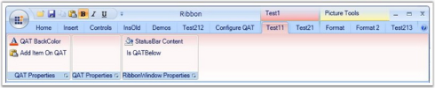

# Creating Ribbon ContexttabGroups

ContextTabGroups are used to group RibbonTabs in the application for easy navigation. Each ContextTabGroup can have a different background, label, and so on, to differentiate with other ContextTabGroups in the Ribbon window. The following code snippet is used to create a ContextTabGroup.



    [XAML]

<syncfusion:Ribbon x:Name="MyRibbon">

    <syncfusion:Ribbon.ContextTabGroups>

        <syncfusion:ContextTabGroup Name="ContextTabGroup1" IsGroupVisible="True" BackColor="Aqua" Label="Group 1">

        </syncfusion:ContextTabGroup>

        <syncfusion::Ribbon.ContextTabGroups>

</syncfusion:Ribbon>

 

