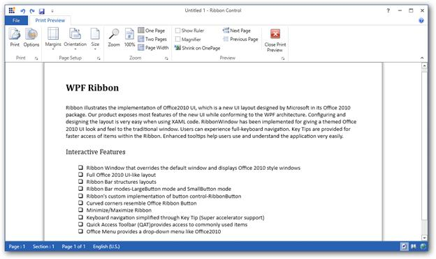

# Ribbon ModelTab in WPF Ribbon

Modal Tab in Ribbon Control are used to display a collection of commands other than the commands which are available in the core tabs. At this point, the core tab gets disabled.

## Use case scenarios

Print Preview is a Modal Tab which displays Print Preview related commands

## Adding modal tabs to an application

To add RibbonTabs as ModalTabs in an application, use `ModalTabCollection` property of the Ribbon. 





<syncfusion:Ribbon.ModalTabCollection  >
<syncfusion:ModalTabCollection >
<syncfusion:RibbonTab Caption="Print Preview" x:Name="_printPreviewTab">
<syncfusion:RibbonBar Header="Sample Bar">
<syncfusion:RibbonButton Label="Close Tab"/>
</syncfusion:RibbonBar>
</syncfusion:RibbonTab>
</syncfusion:ModalTabCollection>
</syncfusion:Ribbon.ModalTabCollection>





## Add Modal Tab to the simplified layout

When the simplified layout is enabled, the Model tab can be added, and its items will be displayed in a single line as shown below. To know more about the simplified layout, refer [here](https://help.syncfusion.com/wpf/ribbon/simplifiedlayout).





<syncfusion:RibbonWindow x:Class="RibbonButton_IconTemp.Window1"
        xmlns="http://schemas.microsoft.com/winfx/2006/xaml/presentation"
        xmlns:x="http://schemas.microsoft.com/winfx/2006/xaml"
        xmlns:d="http://schemas.microsoft.com/expression/blend/2008"
        xmlns:mc="http://schemas.openxmlformats.org/markup-compatibility/2006"
        xmlns:local="clr-namespace:RibbonButton_IconTemp" xmlns:skin="clr-namespace:Syncfusion.SfSkinManager;assembly=Syncfusion.SfSkinManager.WPF"
        mc:Ignorable="d" xmlns:syncfusion="http://schemas.syncfusion.com/wpf"
        skin:SfSkinManager.VisualStyle="MaterialLight"
        Title="Untitled 1 - Ribbon Control" Height="450" Width="800">
    <Grid x:Name="grid">
        <syncfusion:Ribbon VerticalAlignment="Top" EnableSimplifiedLayoutMode="True" LayoutMode="Simplified">
            <syncfusion:Ribbon.ModalTabCollection>
                <syncfusion:ModalTabCollection>
                    <syncfusion:RibbonTab x:Name="insertTab"
                            Caption="Insert"
                            IsChecked="True">
                        <syncfusion:RibbonBar
                                Header="Illustrations"
                                IsLauncherButtonVisible="True">
                            <syncfusion:RibbonButton
                                    Label="Picture"
                                    MediumIcon="Resources/Picture20.png"
                                    SizeForm="Large">
                            </syncfusion:RibbonButton>
                            <syncfusion:RibbonButton
                                    Label="Comment"
                                    MediumIcon="Resources/New Comment20.png"
                                    SizeForm="Large">
                            </syncfusion:RibbonButton>
                            <syncfusion:DropDownButton
                                    Label="Shapes"
                                    MediumIcon="Resources/Insert Shapes20.png"
                                    SizeForm="Small">
                            </syncfusion:DropDownButton>
                            <syncfusion:DropDownButton
                                    Label="Chart"
                                    MediumIcon="Resources/Base chart20.png"
                                    SizeForm="Small">
                            </syncfusion:DropDownButton>
                        </syncfusion:RibbonBar>
                    </syncfusion:RibbonTab>
                </syncfusion:ModalTabCollection>
            </syncfusion:Ribbon.ModalTabCollection>
        </syncfusion:Ribbon>
    </Grid>
</syncfusion:RibbonWindow>





Ribbon ribbon = new Ribbon();
ribbon.VerticalAlignment = VerticalAlignment.Top;
ribbon.EnableSimplifiedLayoutMode = true;
ribbon.LayoutMode = LayoutMode.Simplified;

// Creating new tabs
RibbonTab insertTab = new RibbonTab();
insertTab.Caption = "Insert";
insertTab.IsChecked = true;

// Creating new bar
RibbonBar illustrationsBar = new RibbonBar();
illustrationsBar.Header = "Illustrations";

// Creating items
// Creating items
RibbonButton pictureButton = new RibbonButton();
pictureButton.Label = "Picture";
pictureButton.SizeForm = SizeForm.Large;
pictureButton.MediumIcon = new BitmapImage(new Uri(@"/Resources/Picture20.png", UriKind.RelativeOrAbsolute));

RibbonButton commentButton = new RibbonButton();
commentButton.Label = "Comment";
commentButton.SizeForm = SizeForm.Large;
commentButton.MediumIcon = new BitmapImage(new Uri(@"/Resources/New Comment20.png", UriKind.RelativeOrAbsolute));

DropDownButton shapesButton = new DropDownButton();
shapesButton.Label = "Shapes";
shapesButton.SizeForm = SizeForm.Small;
shapesButton.MediumIcon = new BitmapImage(new Uri(@"/Resources/Insert Shapes20.png", UriKind.RelativeOrAbsolute));

DropDownButton chartButton = new DropDownButton();
chartButton.Label = "Chart";
chartButton.SizeForm = SizeForm.Small;
chartButton.MediumIcon = new BitmapImage(new Uri(@"/Resources/Base chart20.png", UriKind.RelativeOrAbsolute));

// Adding items to bar
illustrationsBar.Items.Add(pictureButton);
illustrationsBar.Items.Add(commentButton);
illustrationsBar.Items.Add(shapesButton);
illustrationsBar.Items.Add(chartButton);

// Adding bars to the tabs
insertTab.Items.Add(illustrationsBar);

// Adding modal tab
ribbon.ModalTabCollection.Add(insertTab);
insertTab.Name = "insertTab";

grid.Children.Add(ribbon);

//Displaying modal tab
ribbon.ShowModalTab("insertTab");
SfSkinManager.SetVisualStyle(this, VisualStyles.MaterialLight);





## How to handle modal tabs in ribbon

The `ShowModalTab` and `CloseModalTabs` method handle the visibility of the Modal Tabs in the Ribbon control. Any ModalTab from the ModalTabCollection can be displayed whenever required.

To show specific Modal Tab in ribbon, call ShowModalTab method. This can be done from any event of core Ribbon Tab control.





private void ShowModalTabBtn_Click(object sender, RoutedEventArgs e) 
{ 
    this._ribbon.ShowModalTab("_printPreviewTab"); 
}





Private Sub ShowModalTabBtn_Click(ByVal sender As Object, ByVal e As RoutedEventArgs)
Me._ribbon.ShowModalTab("_printPreviewTab")
End Sub





`CloseModalTabs` method is used to close the currently opened Modal Tab in Ribbon control. This method should be called in any event of currently displaying Modal Tab element.This is illustrated in the code given below.





private void CloseModalTabBtn_Click(object sender, RoutedEventArgs e) 
{ 
    this._ribbon.CloseModalTabs(); 
}





Private Sub CloseModalTabBtn_Click(ByVal sender As Object, ByVal e As RoutedEventArgs)
Me._ribbon.CloseModalTabs()
End Sub




