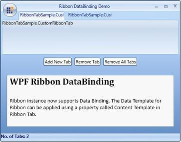
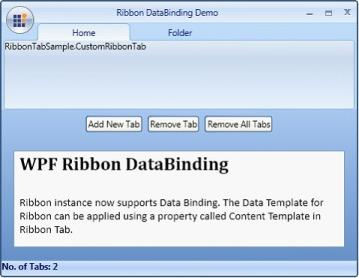

# Data Binding Support for WPF Ribbon

The ribbon control supports data binding. The data template for the ribbon can be applied by using a property called Content Template in the Ribbon tab.

Two new properties have been added to the Ribbon Tab control.

* ContentTemplate – Is used to retrieve or set a data template for Ribbon tab content. It is a dependency property.
* ContentTemplateSelector – Is used to retrieve or set a template selector, which allows custom templates to be applied according to logic. It is a dependency property.

The code below demonstrates a business object used for item-source binding.


 
     public class CustomRibbonTab

    {

        public string Header { get; set; }

        public string MenuItem1 { get; set; }

        public string MenuItem2 { get; set; }

        public string MenuItem3 { get; set; }

        public string MenuItem4 { get; set; }

        public string MenuItem5 { get; set; }

        public string MenuItem6 { get; set; }

        public string MenuHeader1 { get; set; }

        public string MenuHeader2 { get; set; }

        public ObservableCollection<RibbonButton> MenuList { get; set; }

        public string ToolTip { get; set; }

        public CustomRibbonTab()

        {

            MenuList = new ObservableCollection<RibbonButton>();

        }

    }

 

 

Adding items to an observable collection is demonstrated in the code below.


 
    private void Window1_Loaded(object sender, RoutedEventArgs e)

        {

            SampleList = new ObservableCollection<CustomRibbonTab>();

            CustomRibbonTab tab1 = new CustomRibbonTab()

            {

                Header = "Home",

                MenuHeader1 = "New",

                MenuItem1 = "New Email",

                MenuItem2 = "New Items",

                MenuHeader2 = "Delete",

                MenuItem3 = "Ignore",

                MenuItem4 = "Clean Up",

                MenuItem5 = "Junk",

                MenuItem6 = "Delete",

                ToolTip = "Create a New Item."

            };

            ObservableCollection<RibbonButton> list1 = new               ObservableCollection<RibbonButton>();

            list1.Add(new RibbonButton() { Label = "Email" });

            list1.Add(new RibbonButton() { Label = "Appointment" });

            list1.Add(new RibbonButton() { Label = "Meeting" });

            list1.Add(new RibbonButton() { Label = "Contact" });

            list1.Add(new RibbonButton() { Label = "Task" });

            tab1.MenuList = list1;

            CustomRibbonTab tab = new CustomRibbonTab()

            {

                Header = "Folder",

                MenuHeader1 = "New",

                MenuHeader2 = "Actions",

                MenuItem1 = "New Folder",

                MenuItem2 = "New Folder Search",

                MenuItem3 = "Rename Folder",

                MenuItem4 = "Copy Folder",

                MenuItem5 = "Clean Up Folder",

                MenuItem6 = "Delete Folder",

                ToolTip = "Create a New Folder in the Navigation pane."

            };

            ObservableCollection<RibbonButton> list = new ObservableCollection<RibbonButton>();

            list.Add(new RibbonButton() { Label = "Clean Up Folder" });

            list.Add(new RibbonButton() { Label = "Clean Up Sub Folders" });

            tab.MenuList = list;

            SampleList.Add(tab1);

            SampleList.Add(tab);

            ribbonWindow.DataContext = this;

        }

 

 

Binding the items source property is demonstrated in the code below.

<table>
<tr>

<sync:Ribbon ItemsSource="{Binding SampleList}" Name="ribbon">
</sync:Ribbon>
</tr>
<tr>

Binding binding = new Binding("SampleList");
binding.Source = this;
ribbon.SetBinding(Ribbon.ItemsSourceProperty, binding);

</tr>
</table>

## Using the Item Template

The item template can be applied to the ribbon as demonstrated in the following code. 



   <sync:Ribbon.ItemTemplate>

    <DataTemplate>

        <TextBlock Text="{Binding Header}" HorizontalAlignment="Center" VerticalAlignment="Center"/>

    </DataTemplate>

</sync:Ribbon.ItemTemplate>

 

## Using Item Container Style

The above image shows ribbon tabs that are bound with an observable collection. The content template for every ribbon tab can be applied as demonstrated in the following code.



    <sync:Ribbon.ItemContainerStyle>

     

</sync:Ribbon.ItemContainerStyle>

 

## Using Template Selector

Template Selector can be used so that templates can be applied according to logic set by the user. The following code demonstrates this.



   <sync:RibbonWindow.Resources>

        <sample:SampleSelector x:Key="Selector"/>

 

Data Template for Home ribbon tab,



    <DataTemplate x:Key="Home">

            <StackPanel Orientation="Horizontal">

                <sync:RibbonBar Header="{Binding MenuHeader1}">

                    <sync:RibbonButton SizeForm="Large" Label="{Binding MenuItem1}">

                        <sync:RibbonButton.ToolTip>

                            <sync:ScreenTip VerticalOffset="10" Description="{Binding MenuItem1}">

                                <TextBlock TextWrapping="Wrap" Text="{Binding ToolTip}"/>

                            </sync:ScreenTip>

                        </sync:RibbonButton.ToolTip>

                    </sync:RibbonButton>

                    <sync:SplitButton SizeForm="Large" Label="{Binding MenuItem2}" ItemsSource="{Binding MenuList}" Padding="3"/>

                </sync:RibbonBar>

                <sync:RibbonBar Header="{Binding MenuHeader2}">

                    <sync:RibbonButton SizeForm="Small" Label="{Binding MenuItem3}"/>

                    <sync:RibbonButton SizeForm="Small" Label="{Binding MenuItem4}"/>

                    <sync:RibbonButton SizeForm="Small" Label="{Binding MenuItem6}"/>

                </sync:RibbonBar>

            </StackPanel>

        </DataTemplate>

 

 

Data Template for Folder Ribbon Tab,



    <DataTemplate x:Key="Folder">

            <StackPanel Orientation="Horizontal">

                <sync:RibbonBar Header="{Binding MenuHeader1}">

                    <sync:RibbonButton SizeForm="Large" Label="{Binding MenuItem1}">

                        <sync:RibbonButton.ToolTip>

                            <sync:ScreenTip VerticalOffset="10" Description="{Binding MenuItem1}">

                                <TextBlock TextWrapping="Wrap" Text="{Binding ToolTip}"/>

                            </sync:ScreenTip>

                        </sync:RibbonButton.ToolTip>

                    </sync:RibbonButton>

                    <sync:RibbonButton SizeForm="Large" Label="{Binding MenuItem2}" Padding="3"/>

                </sync:RibbonBar>

                <sync:RibbonBar Header="{Binding MenuHeader2}">

                    <sync:ButtonPanel>

                        <sync:RibbonComboBox ItemsSource="{Binding MenuList}" Width="110"/>

                        <sync:RibbonButton SizeForm="ExtraSmall"/>

                    </sync:ButtonPanel>

                    <sync:RibbonButton SizeForm="Small" Label="{Binding MenuItem4}"/>

                    <sync:RibbonButton SizeForm="Small" Label="{Binding MenuItem6}"/>

                </sync:RibbonBar>

            </StackPanel>

        </DataTemplate>

    </sync:RibbonWindow.Resources>

 

The following code demonstrates the data template selector logic set by the user.



   public class SampleSelector : DataTemplateSelector

    {

        public override DataTemplate SelectTemplate(object item, DependencyObject container)

        {

            Window window = Application.Current.MainWindow;

            if (((CustomRibbonTab)item).Header == "Home")

            {

                return ((DataTemplate)window.Resources["Home"]);

            }

            else

            {

                return ((DataTemplate)window.Resources["Folder"]);

            }

        }

    }

           <sync:Ribbon.ItemContainerStyle>

                

            </sync:Ribbon.ItemContainerStyle>

 

## Adding or Removing Tabs

Users can add or remove items to the item-source-bounded Observable collection so that changes are reflected in ribbon tab items. The following code shows how tab items can be added or removed dynamically when Items Source is used.


 
    private void Add_Click(object sender, RoutedEventArgs e)

        {

            CustomRibbonTab newTab = new CustomRibbonTab()

            {

                Header = "New Tab Item",

                MenuHeader1 = "Send & Recieve",

                MenuItem1 = "Send All Folders",

                MenuItem2 = "Recieve All Folders",

                MenuHeader2 = "Download",

                MenuItem3 = "Show Progress",

                MenuItem4 = "Cancel All",

                MenuItem5 = "Download Headers",

                MenuItem6 = "Mark all",

                ToolTip = "Send Items such as Calendars, Email, appointments, task, etc."

            };

            ObservableCollection<RibbonButton> list1 = new ObservableCollection<RibbonButton>();

            list1.Add(new RibbonButton() { Label = "Email" });

            list1.Add(new RibbonButton() { Label = "Appointment" });

            list1.Add(new RibbonButton() { Label = "Meeting" });

            list1.Add(new RibbonButton() { Label = "Contact" });

            list1.Add(new RibbonButton() { Label = "Task" });

            newTab.MenuList = list1;

            SampleList.Add(newTab);

            Editor.AppendText("New Tab added to the Ribbon Control\n");

        }

 

## Removing a tab Item

 The following code demonstrates how to remove a tab item.


 
      private void Remove_Click_1(object sender, RoutedEventArgs e)

        {

            if (SampleList.Count != 0)

            {

                SampleList.RemoveAt(SampleList.Count - 1);

                Editor.AppendText("Tab Removed from the Ribbon Control\n");

            }

        }

 

## Removing all tabs

The following code demonstrates removing all tabs.


 
    private void RemoveAll_Click_2(object sender, RoutedEventArgs e)

        {

            if (SampleList.Count != 0)

            {

                SampleList.Clear();

                Editor.AppendText("All Tabs Removed from the Ribbon Control\n");

            }

        }

 

