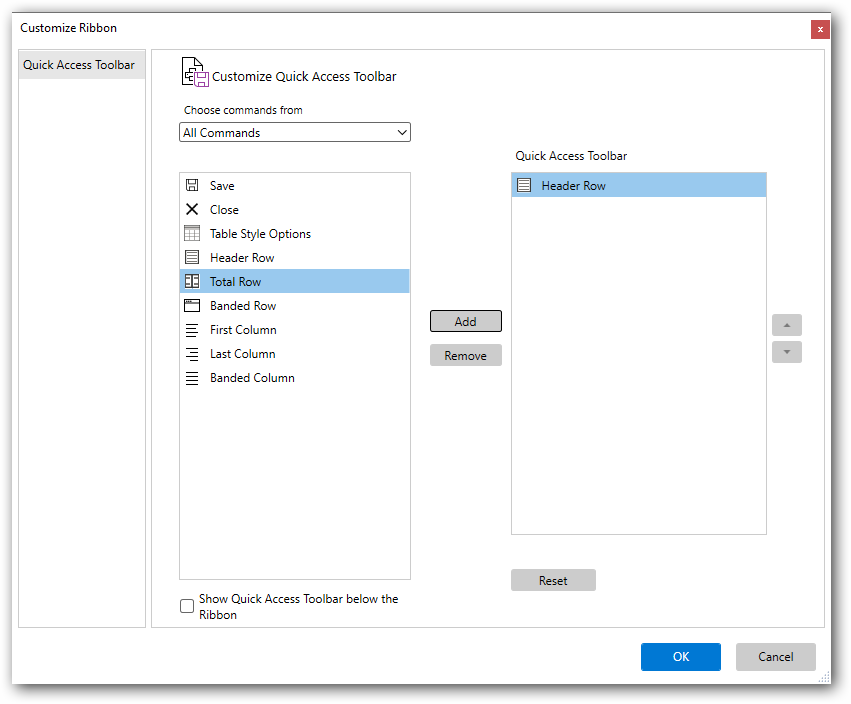

# Dealing with WPF Ribbon 

Ribbon can be changed into three different states such as `Normal`, `Hide` and `Adorner`

## Three types of RibbonState

**Normal** – Ribbon control displays the RibbonTab content and the window content is arranged below the Ribbon. This is the default state





<syncfusion:Ribbon  RibbonState="Normal" VerticalAlignment="Top" x:Name="_ribbon" >
<syncfusion:RibbonTab  Caption="Folder" IsChecked="False" >
<syncfusion:RibbonBar  Header="Acions">
<syncfusion:RibbonButton SizeForm="Small"  Label="Copy Folder"/>
<syncfusion:RibbonButton SizeForm="Small" Label="Move Folder"/>
<syncfusion:SplitButton  Label=" Split1 "   SizeForm="Large" >
<syncfusion:RibbonButton SizeForm="Small"  Label="Mark to Download"/>
<syncfusion:RibbonButton SizeForm="Small"  Label="UnMark to Download"/>
</syncfusion:SplitButton>
</syncfusion:RibbonBar>
<syncfusion:RibbonBar Header="Properties">
<syncfusion:RibbonButton SizeForm="Small" Label="Policy"/>
<syncfusion:RibbonButton SizeForm="Small" Label="Folder Properties"/>
<syncfusion:RibbonButton SizeForm="Small" Label="Folder Permissions"/>
</syncfusion:RibbonBar>
</syncfusion:RibbonTab>
</syncfusion:Ribbon>





**Hide** - RibbonTab content gets hidden in this state





<syncfusion:Ribbon  RibbonState="Hide" VerticalAlignment="Top" x:Name="_ribbon" >
<syncfusion:RibbonTab  Caption="Folder" IsChecked="False" >
<syncfusion:RibbonBar  Header="Acions">
<syncfusion:RibbonButton SizeForm="Small"  Label="Copy Folder"/>
<syncfusion:RibbonButton SizeForm="Small" Label="Move Folder"/>
<syncfusion:SplitButton  Label=" Split1 "   SizeForm="Large" >
<syncfusion:RibbonButton SizeForm="Small"  Label="Mark to Download"/>
<syncfusion:RibbonButton SizeForm="Small"  Label="UnMark to Download"/>
</syncfusion:SplitButton>
</syncfusion:RibbonBar>
<syncfusion:RibbonBar Header="Properties">
<syncfusion:RibbonButton SizeForm="Small" Label="Policy"/>
<syncfusion:RibbonButton SizeForm="Small" Label="Folder Properties"/>
<syncfusion:RibbonButton SizeForm="Small" Label="Folder Permissions"/>
</syncfusion:RibbonBar>
</syncfusion:RibbonTab>
</syncfusion:Ribbon>





**Adorner** – In this state, RibbonTab content adorned above the window content





<syncfusion:Ribbon  RibbonState="Adorner" VerticalAlignment="Top" x:Name="_ribbon" >
<syncfusion:RibbonTab  Caption="Folder" IsChecked="False" >
<syncfusion:RibbonBar  Header="Acions">
<syncfusion:RibbonButton SizeForm="Small"  Label="Copy Folder"/>
<syncfusion:RibbonButton SizeForm="Small" Label="Move Folder"/>
<syncfusion:SplitButton  Label=" Split1 "   SizeForm="Large" >
<syncfusion:RibbonButton SizeForm="Small"  Label="Mark to Download"/>
<syncfusion:RibbonButton SizeForm="Small"  Label="UnMark to Download"/>
</syncfusion:SplitButton>
</syncfusion:RibbonBar>
<syncfusion:RibbonBar Header="Properties">
<syncfusion:RibbonButton SizeForm="Small" Label="Policy"/>
<syncfusion:RibbonButton SizeForm="Small" Label="Folder Properties"/>
<syncfusion:RibbonButton SizeForm="Small" Label="Folder Permissions"/>
</syncfusion:RibbonBar>
</syncfusion:RibbonTab>
</syncfusion:Ribbon>





## How to change the RibbonState in run time

Ribbon State can also be changed at the Runtime.In the below code, Ribbon State has been changed dynamically in the button click event





_ribbon.RibbonState = Syncfusion.Windows.Tools.RibbonState.Normal;





_ribbon.RibbonState = Syncfusion.Windows.Tools.RibbonState.Normal









_ribbon.RibbonState = Syncfusion.Windows.Tools.RibbonState.Hide;





_ribbon.RibbonState = Syncfusion.Windows.Tools.RibbonState.Hide









_ribbon.RibbonState = Syncfusion.Windows.Tools.RibbonState.Adorner;





_ribbon.RibbonState = Syncfusion.Windows.Tools.RibbonState.Adorner





## Resize Ribbon Window
The ribbon control dynamically resizes as width of the window decreases, when the windows border touches the last placed Ribbon bar, the Ribbon will begin to resize its elements with the following priority.

1. **Compress Gallery** - If there is a [`RibbonGallery`](https://help.syncfusion.com/cr/wpf/Syncfusion.Windows.Tools.Controls.RibbonGallery.html) in a [`RibbonBar`](https://help.syncfusion.com/cr/wpf/Syncfusion.Windows.Tools.Controls.RibbonBar.html), it will be resized until it is converted to a dropdown button. Once it is converted into dropdown button, then the Ribbon will begin to resize the [`Large`](https://help.syncfusion.com/cr/wpf/Syncfusion.Windows.Tools.SizeForm.html) size form items.

2. **Compress Large items** - When there are three or more continuous [`Large`](https://help.syncfusion.com/cr/wpf/Syncfusion.Windows.Tools.SizeForm.html) items, then Ribbon will reduce each pair of three continuous [`Large`](https://help.syncfusion.com/cr/wpf/Syncfusion.Windows.Tools.SizeForm.html) size form items, starting from the right side, into [`Small`](https://help.syncfusion.com/cr/wpf/Syncfusion.Windows.Tools.SizeForm.html) size form items. Once each pair of three continuous [`Large`](https://help.syncfusion.com/cr/wpf/Syncfusion.Windows.Tools.SizeForm.html) size form items are converted into [`Small`](https://help.syncfusion.com/cr/wpf/Syncfusion.Windows.Tools.SizeForm.html) size form, then Ribbon will begin to resize the [`Small`](https://help.syncfusion.com/cr/wpf/Syncfusion.Windows.Tools.SizeForm.html) size form items.

3. **Compress Small items** - When there are three or more continuous [`Small`](https://help.syncfusion.com/cr/wpf/Syncfusion.Windows.Tools.SizeForm.html) items, then Ribbon will reduce each pair of three continuous [`Small`](https://help.syncfusion.com/cr/wpf/Syncfusion.Windows.Tools.SizeForm.html) size form items, starting from the right side, into [`ExtraSmall`](https://help.syncfusion.com/cr/wpf/Syncfusion.Windows.Tools.SizeForm.html) size form items. Once each pair of three continuous [`Small`](https://help.syncfusion.com/cr/wpf/Syncfusion.Windows.Tools.SizeForm.html) size form items are converted into [`ExtraSmall`](https://help.syncfusion.com/cr/wpf/Syncfusion.Windows.Tools.SizeForm.html) size form, then Ribbon will begin convert the [`RibbonBar`](https://help.syncfusion.com/cr/wpf/Syncfusion.Windows.Tools.Controls.RibbonBar.html) into dropdown button.

4. **Collapsing the RibbonBar** - When there are no three or more continuous [`Large`](https://help.syncfusion.com/cr/wpf/Syncfusion.Windows.Tools.SizeForm.html) or [`Small`](https://help.syncfusion.com/cr/wpf/Syncfusion.Windows.Tools.SizeForm.html) size form items and when there are other ribbon items such as CheckBox, RadioButton, ComboBox, TextBox, ListBox or any other custom items, then, starting with the last bar, each [`RibbonBar`](https://help.syncfusion.com/cr/wpf/Syncfusion.Windows.Tools.Controls.RibbonBar.html) will be converted into a dropdown button, with its items accessible by clicking on the dropdown arrow.

When the size of the window is increased, the [`RibbonBar`](https://help.syncfusion.com/cr/wpf/Syncfusion.Windows.Tools.Controls.RibbonBar.html) will become visible if the spacing between the window border and the [`RibbonBar`](https://help.syncfusion.com/cr/wpf/Syncfusion.Windows.Tools.Controls.RibbonBar.html) is large enough to accommodate its items. These items will then be expanded in the order, starting with the most recently collapsed item and ending with the initially collapsed item.

The [`IsAutoSizeFormEnabled`](https://help.syncfusion.com/cr/wpf/Syncfusion.Windows.Tools.Controls.Ribbon.html#Syncfusion_Windows_Tools_Controls_Ribbon_SetIsAutoSizeFormEnabled_System_Windows_DependencyObject_System_Boolean_) property must be set to True to get responsive ribbon window. The following snippet is used for resize the ribbon window.





<Grid>
 <syncfusion:Ribbon syncfusion:Ribbon.IsAutoSizeFormEnabled="True" x:Name="_ribbon" VerticalAlignment="Top">            
 </syncfusion:Ribbon>
 </Grid>





## Setting collapse image for RibbonBar

When the RibbonBar is converted into a dropdown button during resizing, the [`RibbonBar`](https://help.syncfusion.com/cr/wpf/Syncfusion.Windows.Tools.Controls.RibbonBar.html) allows us to display a image using its [`IconTemplate`](https://help.syncfusion.com/cr/wpf/Syncfusion.Windows.Tools.Controls.RibbonBar.html#Syncfusion_Windows_Tools_Controls_RibbonBar_IconTemplate) or [`CollapseImage`](https://help.syncfusion.com/cr/wpf/Syncfusion.Windows.Tools.Controls.RibbonBar.html#Syncfusion_Windows_Tools_Controls_RibbonBar_CollapseImage) property.

 N> The [`RibbonBar`](https://help.syncfusion.com/cr/wpf/Syncfusion.Windows.Tools.Controls.RibbonBar.html) loads icon in the following priority order,
 * [`IconTemplate`](https://help.syncfusion.com/cr/wpf/Syncfusion.Windows.Tools.Controls.RibbonBar.html#Syncfusion_Windows_Tools_Controls_RibbonBar_IconTemplate)
 * [`CollapseImage`](https://help.syncfusion.com/cr/wpf/Syncfusion.Windows.Tools.Controls.RibbonBar.html#Syncfusion_Windows_Tools_Controls_RibbonBar_CollapseImage)

### Setting icon template

The [`IconTemplate`](https://help.syncfusion.com/cr/wpf/Syncfusion.Windows.Tools.Controls.RibbonBar.html#Syncfusion_Windows_Tools_Controls_RibbonBar_IconTemplate) property provides support to set any type of image such as glyph, font or any custom content to the [`RibbonBar`](https://help.syncfusion.com/cr/wpf/Syncfusion.Windows.Tools.Controls.RibbonBar.html). The [`RibbonBar`](https://help.syncfusion.com/cr/wpf/Syncfusion.Windows.Tools.Controls.RibbonBar.html) displays the [`IconTemplate`](https://help.syncfusion.com/cr/wpf/Syncfusion.Windows.Tools.Controls.RibbonBar.html#Syncfusion_Windows_Tools_Controls_RibbonBar_IconTemplate) in 16 * 16 size.





 <syncfusion:RibbonWindow x:Class="WpfApp1.MainWindow"
        xmlns="http://schemas.microsoft.com/winfx/2006/xaml/presentation"
        xmlns:x="http://schemas.microsoft.com/winfx/2006/xaml"
        xmlns:d="http://schemas.microsoft.com/expression/blend/2008"
        xmlns:mc="http://schemas.openxmlformats.org/markup-compatibility/2006"
        xmlns:local="clr-namespace:WpfApp1"
        mc:Ignorable="d" xmlns:syncfusion="http://schemas.syncfusion.com/wpf"
        xmlns:skin="clr-namespace:Syncfusion.SfSkinManager;assembly=Syncfusion.SfSkinManager.WPF"
        skin:SfSkinManager.VisualStyle="MaterialLight"
        Title="MainWindow" Height="350" Width="600">
    <Grid>
        <syncfusion:Ribbon VerticalAlignment="Top">
            <syncfusion:RibbonTab Caption="Home">
                <syncfusion:RibbonBar Header="Clipboard" >
                    <syncfusion:RibbonBar.IconTemplate>
                        <DataTemplate>
                            <Grid Width="14" Height="16">
                                <Path Width="7" Margin="0,7,0,0" HorizontalAlignment="Right" Fill="#FF3A3A38" Stretch="Fill"
                                      Data="F1M122,367L127,367L127,360L122,360z M128,368L121,368L121,359L128,359z" />
                                <Path Margin="0,2,2,0" Fill="#FFDE6C00" Stretch="Fill"
                                      Data="M0,0 L12,0 12,4 11,4 11,0.99999994 1.0000002,0.99999994 1.0000002,13 6.0000001,13 6.0000001,14 0,14 z" />
                                <Path Margin="1,3,3,1" Fill="#FFF8DB8F" Stretch="Fill"
                                      Data="M0,0 L10,0 10,3 9.0000001,3 9.0000001,0.99999994 1.0000001,0.99999994 1.0000001,1.5829999 1.0000001,2.5 1.0000001,11 5.0000001,11 5.0000001,12 0,12 z" />
                                <Path Margin="2.011,0.5,0.983,0.983" Fill="#FFFAFAFA" Stretch="Fill"
                                      Data="M5.9873815,7.496151 L11.006,7.496151 11.006,14.516999 5.9873815,14.516999 z M0,5.4959998 L3.9880071,5.4964137 3.9880071,13.51695 0,13.51695 z M3.9889999,2.2337155E-15 C4.8170028,-4.4703477E-08 5.4889999,0.67098993 5.4889999,1.5 L5.4889999,2 7.4889999,2 7.4889999,5 0.4889999,5 0.4889999,2 2.4889999,2 2.4889999,1.5 C2.4889999,0.67098993 3.1609969,-4.4703477E-08 3.9889999,2.2337155E-15 z" />
                                <Path Height="6" Margin="2,0,4,0" VerticalAlignment="Top" Fill="#FF797774" Stretch="Fill"
                                      Data="M4,1 C3.447998,1 3,1.4490051 3,2 L3,3 1,3 1,5 7,5 7,3 5,3 5,2 C5,1.4490051 4.552002,1 4,1 z M4,0 C5.1029968,0 6,0.89700317 6,2 L8,2 8,6 0,6 0,2 2,2 C2,0.89700317 2.8970032,0 4,0 z" />
                            </Grid>
                        </DataTemplate>
                    </syncfusion:RibbonBar.IconTemplate>
                </syncfusion:RibbonBar>
                <syncfusion:RibbonBar Header="Font" >
                    <syncfusion:RibbonBar.IconTemplate>
                        <DataTemplate>
                            <Grid>
                                <Path
                                    Height="4" VerticalAlignment="Bottom" Data="M0,0 L16,0 16,4 0,4 z"
                                    Fill="#FFFE0000" Stretch="Fill" />
                                <Path
                                    Margin="3.344,0,3.352,5"
                                    Data="M4.6480023,0.95898432 C4.6079937,1.0870056 4.5689923,1.2149963 4.533012,1.34198 4.4980089,1.4909973 4.4510118,1.6419983 4.394005,1.7949829 L2.5330156,6.8809814 6.787006,6.8809814 4.9330055,1.7799988 C4.8510047,1.5699768 4.7659832,1.2969971 4.6790081,0.95898432 z M4.0779959,0 L5.209006,0 9.304,11 8.3170024,11 7.2039977,8.0019836 2.1150171,8.0029907 1.0100081,11 0,11 z"
                                    Fill="{Binding RelativeSource={RelativeSource Mode=Self}, Path=(TextBlock.Foreground)}" Stretch="Fill" />
                            </Grid>
                        </DataTemplate>
                    </syncfusion:RibbonBar.IconTemplate>
                </syncfusion:RibbonBar>
            </syncfusion:RibbonTab>
        </syncfusion:Ribbon>
    </Grid>
 </syncfusion:RibbonWindow>

 

 

 Ribbon ribbon = new Ribbon();
 ribbon.VerticalAlignment = VerticalAlignment.Top;
 // Creating new tabs
 RibbonTab homeTab = new RibbonTab();
 homeTab.Caption = "Home";
 homeTab.IsChecked = true;
 
 // Creating new bar
 RibbonBar clipboardBar = new RibbonBar();
 clipboardBar.Header = "Clipboard";
 
 DataTemplate iconDataTemplate = new DataTemplate();
 FrameworkElementFactory gridElement = new FrameworkElementFactory(typeof(Grid));
 FrameworkElementFactory pathElement1 = new FrameworkElementFactory(typeof(Path));
 FrameworkElementFactory pathElement2 = new FrameworkElementFactory(typeof(Path));
 FrameworkElementFactory pathElement3 = new FrameworkElementFactory(typeof(Path));
 FrameworkElementFactory pathElement4 = new FrameworkElementFactory(typeof(Path));
 FrameworkElementFactory pathElement5 = new FrameworkElementFactory(typeof(Path));
 
 gridElement.SetValue(Grid.WidthProperty, (double)14);
 gridElement.SetValue(Grid.HeightProperty, (double)16);
 pathElement1.SetValue(Path.DataProperty, Geometry.Parse("F1M122,367L127,367L127,360L122,360z M128,368L121,368L121,359L128,359z"));
 pathElement1.SetValue(Path.MarginProperty, new Thickness(0, 7, 0, 0));
 pathElement1.SetValue(Path.FillProperty, new SolidColorBrush(Color.FromRgb(58, 58, 56)));
 pathElement1.SetValue(Path.StretchProperty, Stretch.Fill);
 pathElement1.SetValue(Path.WidthProperty, (double)7);
 pathElement1.SetValue(Path.HorizontalAlignmentProperty, HorizontalAlignment.Right);
 
 pathElement2.SetValue(Path.DataProperty, Geometry.Parse("M0,0 L12,0 12,4 11,4 11,0.99999994 1.0000002,0.99999994 1.0000002,13 6.0000001,13 6.0000001,14 0,14 z"));
 pathElement2.SetValue(Path.MarginProperty, new Thickness(0, 2, 2, 0));
 pathElement2.SetValue(Path.FillProperty, new SolidColorBrush(Color.FromRgb(222, 108, 0)));
 pathElement2.SetValue(Path.StretchProperty, Stretch.Fill);
 
 pathElement3.SetValue(Path.DataProperty, Geometry.Parse("M0,0 L10,0 10,3 9.0000001,3 9.0000001,0.99999994 1.0000001,0.99999994 1.0000001,1.5829999 1.0000001,2.5 1.0000001,11 5.0000001,11 5.0000001,12 0,12 z"));
 pathElement3.SetValue(Path.MarginProperty, new Thickness(1, 3, 3, 1));
 pathElement3.SetValue(Path.FillProperty, new SolidColorBrush(Color.FromRgb(248, 219, 143)));
 pathElement3.SetValue(Path.StretchProperty, Stretch.Fill);
 
 pathElement4.SetValue(Path.DataProperty, Geometry.Parse("M5.9873815,7.496151 L11.006,7.496151 11.006,14.516999 5.9873815,14.516999 z M0,5.4959998 L3.9880071,5.4964137 3.9880071,13.51695 0,13.51695 z M3.9889999,2.2337155E-15 C4.8170028,-4.4703477E-08 5.4889999,0.67098993 5.4889999,1.5 L5.4889999,2 7.4889999,2 7.4889999,5 0.4889999,5 0.4889999,2 2.4889999,2 2.4889999,1.5 C2.4889999,0.67098993 3.1609969,-4.4703477E-08 3.9889999,2.23
 pathElement4.SetValue(Path.MarginProperty, new Thickness(2.011, 0.5, 0.983, 0.983));
 pathElement4.SetValue(Path.FillProperty, new SolidColorBrush(Color.FromRgb(250, 250, 250)));
 pathElement4.SetValue(Path.StretchProperty, Stretch.Fill);
 
 pathElement5.SetValue(Path.DataProperty, Geometry.Parse("M4,1 C3.447998,1 3,1.4490051 3,2 L3,3 1,3 1,5 7,5 7,3 5,3 5,2 C5,1.4490051 4.552002,1 4,1 z M4,0 C5.1029968,0 6,0.89700317 6,2 L8,2 8,6 0,6 0,2 2,2 C2,0.89700317 2.8970032,0 4,0 z"));
 pathElement5.SetValue(Path.MarginProperty, new Thickness(2, 0, 4, 0));
 pathElement5.SetValue(Path.FillProperty, new SolidColorBrush(Color.FromRgb(121, 119, 116)));
 pathElement5.SetValue(Path.StretchProperty, Stretch.Fill);
 pathElement5.SetValue(Path.HeightProperty, (double)6);
 pathElement5.SetValue(Path.VerticalAlignmentProperty, VerticalAlignment.Top);
 gridElement.AppendChild(pathElement1);
 gridElement.AppendChild(pathElement2);
 gridElement.AppendChild(pathElement3);
 gridElement.AppendChild(pathElement4);
 gridElement.AppendChild(pathElement5);
 iconDataTemplate.VisualTree = gridElement;
 clipboardBar.IconTemplate = iconDataTemplate;
 
 RibbonBar fontBar = new RibbonBar();
 fontBar.Header = "Font";
 
 DataTemplate iconDataTemplate2 = new DataTemplate();
 FrameworkElementFactory gridElement2 = new FrameworkElementFactory(typeof(Grid));
 FrameworkElementFactory fontElement1 = new FrameworkElementFactory(typeof(Path));
 FrameworkElementFactory fontElement2 = new FrameworkElementFactory(typeof(Path));
 
 fontElement1.SetValue(Path.DataProperty, Geometry.Parse("M0,0 L16,0 16,4 0,4 z"));
 fontElement1.SetValue(Path.FillProperty, new SolidColorBrush(Color.FromRgb(254, 0, 0)));
 fontElement1.SetValue(Path.StretchProperty, Stretch.Fill);
 fontElement1.SetValue(Path.HeightProperty, (double)4);
 fontElement1.SetValue(Path.VerticalAlignmentProperty, VerticalAlignment.Bottom);
 fontElement2.SetValue(Path.DataProperty, Geometry.Parse("M4.6480023,0.95898432 C4.6079937,1.0870056 4.5689923,1.2149963 4.533012,1.34198 4.4980089,1.4909973 4.4510118,1.6419983 4.394005,1.7949829 L2.5330156,6.8809814 6.787006,6.8809814 4.9330055,1.7799988 C4.8510047,1.5699768 4.7659832,1.2969971 4.6790081,0.95898432 z M4.0779959,0 L5.209006,0 9.304,11 8.3170024,11 7.2039977,8.0019836 2.1150171,8.0029907 1.0100081,11 0,11 z"));
 fontElement2.SetValue(Path.MarginProperty, new Thickness(3.344, 0, 3.352, 5));
 fontElement2.SetValue(Path.FillProperty, new SolidColorBrush(Colors.Black));
 fontElement2.SetValue(Path.StretchProperty, Stretch.Fill);
 
 gridElement2.AppendChild(fontElement1);
 gridElement2.AppendChild(fontElement2);
 
 iconDataTemplate2.VisualTree = gridElement2;
 clipboardBar.IconTemplate = iconDataTemplate2;
 
 // Adding bars to the tabs
 homeTab.Items.Add(clipboardBar);
 homeTab.Items.Add(fontBar);
 
 // Adding tabs to ribbon
 ribbon.Items.Add(homeTab);
 grid.Children.Add(ribbon);
 SfSkinManager.SetVisualStyle(this, VisualStyles.MaterialLight);

 

 

 

 N> [View sample in GitHub](https://github.com/SyncfusionExamples/syncfusion-wpf-ribbon-examples/tree/main/Samples/Setting-icons-using-IconTemplate)

### Setting image path

 The [`RibbonBar`](https://help.syncfusion.com/cr/wpf/Syncfusion.Windows.Tools.Controls.RibbonBar.html) allows to set the image for the dropdown button using its [`CollapseImage`](https://help.syncfusion.com/cr/wpf/Syncfusion.Windows.Tools.Controls.RibbonBar.html#Syncfusion_Windows_Tools_Controls_RibbonBar_CollapseImage) property. The [`RibbonBar`](https://help.syncfusion.com/cr/wpf/Syncfusion.Windows.Tools.Controls.RibbonBar.html) displays the image in 16 * 16 size.

 

 

 <syncfusion:RibbonWindow x:Class="WpfApp1.MainWindow"
        xmlns="http://schemas.microsoft.com/winfx/2006/xaml/presentation"
        xmlns:x="http://schemas.microsoft.com/winfx/2006/xaml"
        xmlns:d="http://schemas.microsoft.com/expression/blend/2008"
        xmlns:mc="http://schemas.openxmlformats.org/markup-compatibility/2006"
        xmlns:local="clr-namespace:WpfApp1"
        mc:Ignorable="d" xmlns:syncfusion="http://schemas.syncfusion.com/wpf"
        xmlns:skin="clr-namespace:Syncfusion.SfSkinManager;assembly=Syncfusion.SfSkinManager.WPF"
        skin:SfSkinManager.VisualStyle="MaterialLight"
        Title="MainWindow" Height="350" Width="600">
    <Grid>
        <syncfusion:Ribbon VerticalAlignment="Top">
            <syncfusion:RibbonTab Caption="Home">
                <syncfusion:RibbonBar Header="Clipboard" CollapseImage="Resources/Paste16.png"/>
                <syncfusion:RibbonBar Header="Font" CollapseImage="Resources/FontColor.png"/>
            </syncfusion:RibbonTab>
        </syncfusion:Ribbon>
    </Grid>
 </syncfusion:RibbonWindow>

 

 

 Ribbon ribbon = new Ribbon();
 ribbon.VerticalAlignment = VerticalAlignment.Top;
 // Creating new tabs
 RibbonTab homeTab = new RibbonTab();
 homeTab.Caption = "Home";
 homeTab.IsChecked = true;
 
 // Creating new bar
 RibbonBar clipboardBar = new RibbonBar();
 clipboardBar.Header = "Clipboard";
 clipboardBar.CollapseImage = new BitmapImage(new Uri(@"/Resources/Paste16.png", UriKind.RelativeOrAbsolute));
 
 RibbonBar fontBar = new RibbonBar();
 fontBar.Header = "Font";
 fontBar.CollapseImage = new BitmapImage(new Uri(@"/Resources/FontColor.png", UriKind.RelativeOrAbsolute));
 
 // Adding bars to the tabs
 homeTab.Items.Add(clipboardBar);
 homeTab.Items.Add(fontBar);
 
 // Adding tabs to ribbon
 ribbon.Items.Add(homeTab);
 grid.Children.Add(ribbon);
 SfSkinManager.SetVisualStyle(this, VisualStyles.MaterialLight);

 

 

 

## Adding custom items to the Ribbon

The RibbonItemHost control allows to add any kind of custom control, such as combo box, text box, radio button, check box, and more to be displayed on the [`RibbonBar`](https://help.syncfusion.com/cr/wpf/Syncfusion.Windows.Tools.Controls.RibbonBar.html) and [`QuickAccessToolBar`](https://help.syncfusion.com/cr/wpf/Syncfusion.Windows.Tools.Controls.QuickAccessToolBar.html). The RibbonItemHost contains a ContentTemplate property of DataTemplate type which enables us to define any custom control.

In the below example, MS CheckBox is set to the ContentTemplate property of the RibbonItemHost within the [`RibbonBar`](https://help.syncfusion.com/cr/wpf/Syncfusion.Windows.Tools.Controls.RibbonBar.html). 





<syncfusion:RibbonWindow x:Class="Ribbon.MainWindow"
        xmlns="http://schemas.microsoft.com/winfx/2006/xaml/presentation"
        xmlns:x="http://schemas.microsoft.com/winfx/2006/xaml"
        xmlns:d="http://schemas.microsoft.com/expression/blend/2008"
        xmlns:mc="http://schemas.openxmlformats.org/markup-compatibility/2006"
        xmlns:local="clr-namespace:Ribbon"
        mc:Ignorable="d"
        xmlns:syncfusion="http://schemas.syncfusion.com/wpf"
        xmlns:skin="clr-namespace:Syncfusion.SfSkinManager;assembly=Syncfusion.SfSkinManager.WPF"
        skin:SfSkinManager.Theme="{skin:SkinManagerExtension ThemeName=FluentLight}"
        WindowStartupLocation="CenterScreen" 
        Title="Custom items demo" Height="450" Width="650">
    <syncfusion:RibbonWindow.DataContext>
        <local:ViewModel />
    </syncfusion:RibbonWindow.DataContext>
    <Grid>
        <syncfusion:Ribbon x:Name="mainRibbon">
            <syncfusion:RibbonTab Caption="Design">
                <syncfusion:RibbonBar Header="Table Style Options">
                    <syncfusion:RibbonItemHost>
                        <syncfusion:RibbonItemHost.ContentTemplate>
                            <DataTemplate>
                                <CheckBox Content="Header Row" IsChecked="{Binding ElementName=mainRibbon, Path=DataContext.IsHeaderRowChecked , Mode=TwoWay, UpdateSourceTrigger=PropertyChanged}" Height="22"/>
                            </DataTemplate>
                        </syncfusion:RibbonItemHost.ContentTemplate>
                    </syncfusion:RibbonItemHost>
                    <syncfusion:RibbonItemHost>
                        <syncfusion:RibbonItemHost.ContentTemplate>
                            <DataTemplate>
                                <CheckBox Content="Total Row" IsChecked="{Binding ElementName=mainRibbon, Path=DataContext.IsTotalRowChecked, Mode=TwoWay, UpdateSourceTrigger=PropertyChanged}" Height="22"/>
                            </DataTemplate>
                        </syncfusion:RibbonItemHost.ContentTemplate>
                    </syncfusion:RibbonItemHost>
                    <syncfusion:RibbonItemHost>
                        <syncfusion:RibbonItemHost.ContentTemplate>
                            <DataTemplate>
                                <CheckBox Content="Banded Row" IsChecked="{Binding ElementName=mainRibbon, Path=DataContext.IsBandedRowChecked, Mode=TwoWay, UpdateSourceTrigger=PropertyChanged}" Height="22"/>
                            </DataTemplate>
                        </syncfusion:RibbonItemHost.ContentTemplate>
                    </syncfusion:RibbonItemHost>
                    <syncfusion:RibbonItemHost>
                        <syncfusion:RibbonItemHost.ContentTemplate>
                            <DataTemplate>
                                <RadioButton Margin="4,0,0,0" Content="First Column" IsChecked="{Binding ElementName=mainRibbon, Path=DataContext.IsFirstColumnChecked, Mode=TwoWay, UpdateSourceTrigger=PropertyChanged}" Height="22"/>
                            </DataTemplate>
                        </syncfusion:RibbonItemHost.ContentTemplate>
                    </syncfusion:RibbonItemHost>
                    <syncfusion:RibbonItemHost>
                        <syncfusion:RibbonItemHost.ContentTemplate>
                            <DataTemplate>
                                <RadioButton Margin="4,0,0,0" Content="Last Column" IsChecked="{Binding ElementName=mainRibbon, Path=DataContext.IsLastColumnChecked, Mode=TwoWay, UpdateSourceTrigger=PropertyChanged}" Height="22"/>
                            </DataTemplate>
                        </syncfusion:RibbonItemHost.ContentTemplate>
                    </syncfusion:RibbonItemHost>
                    <syncfusion:RibbonItemHost>
                        <syncfusion:RibbonItemHost.ContentTemplate>
                            <DataTemplate>
                                <RadioButton Margin="4,0,0,0" Content="Banded Column" IsChecked="{Binding ElementName=mainRibbon, Path=DataContext.IsBandedColumnChecked, Mode=TwoWay, UpdateSourceTrigger=PropertyChanged}" Height="22"/>
                            </DataTemplate>
                        </syncfusion:RibbonItemHost.ContentTemplate>
                    </syncfusion:RibbonItemHost>
                </syncfusion:RibbonBar>
            </syncfusion:RibbonTab>
            <syncfusion:Ribbon.QuickAccessToolBar>
                <syncfusion:QuickAccessToolBar/>
            </syncfusion:Ribbon.QuickAccessToolBar>
            <syncfusion:Ribbon.BackStage>
                <syncfusion:Backstage>
                    <syncfusion:BackStageCommandButton Header="Save" >
                        <syncfusion:BackStageCommandButton.IconTemplate>
                            <DataTemplate>
                                <Path Width="12" Height="12" HorizontalAlignment="Center" VerticalAlignment="Center"
                         Data="M5.0000019,11 L5.0000019,15 11.000002,15 11.000002,11 z M4.0000019,1 L4.0000019,6 12.000002,6 12.000002,1 z M1,1 L1,13.174 2.7160001,15 4.0000019,15 4.0000019,10 12.000002,10 12.000002,15 15,15 15,1 13.000002,1 13.000002,7 3.0000019,7 3.0000019,1 z M0,0 L3.0000019,0 13.000002,0 16,0 16,16 12.000002,16 4.0000019,16 2.2840004,16 0,13.57 z"
                         Fill="{Binding RelativeSource={RelativeSource Mode=Self}, Path=(TextBlock.Foreground)}" Stretch="Uniform" />
                            </DataTemplate>
                        </syncfusion:BackStageCommandButton.IconTemplate>
                    </syncfusion:BackStageCommandButton>
                    <syncfusion:BackStageCommandButton Header="Close" >
                        <syncfusion:BackStageCommandButton.IconTemplate>
                            <DataTemplate>
                                <Grid Width="12" Height="12" HorizontalAlignment="Center" VerticalAlignment="Center" SnapsToDevicePixels="true">
                                    <Path
                                        Width="12" Height="12" HorizontalAlignment="Center" VerticalAlignment="Center"
                                        Data="M1.4139423,0L7.0029922,5.5845888 12.592018,0 14.006015,1.4149939 8.4180527,6.9985202 14.006,12.582007 12.591996,13.997001 7.0030056,8.4124444 1.4140122,13.997001 1.5026823E-05,12.582007 5.5879484,6.9985092 0,1.4149939z "
                                        Fill="{Binding RelativeSource={RelativeSource Mode=Self}, Path=(TextBlock.Foreground)}" 
                                        SnapsToDevicePixels="True" Stretch="Fill" />
                                </Grid>
                            </DataTemplate>
                        </syncfusion:BackStageCommandButton.IconTemplate>
                    </syncfusion:BackStageCommandButton>
                </syncfusion:Backstage>
            </syncfusion:Ribbon.BackStage>
        </syncfusion:Ribbon>
    </Grid>
</syncfusion:RibbonWindow>





public class ViewModel : NotificationObject
{
    #region Fields
    /// 

    /// Maintains the Header Row selection.
    /// 

    private bool isHeaderRowChecked = true;

    /// 

    /// Maintains the Total Row selection.
    /// 

    private bool isTotalRowChecked = false;

    /// 

    /// Maintains the Banded Row selection.
    /// 

    private bool isBandedRowChecked = false;

    /// 

    /// Maintains the First Column selection.
    /// 

    private bool isFirstColumnChecked = true;

    /// 

    /// Maintains the Last Column selection.
    /// 

    private bool isLastColumnChecked = false;

    /// 

    /// Maintains the Banded Column selection.
    /// 

    private bool isBandedColumnChecked = false;
    #endregion

    #region Constructor

    public ViewModel()
    {

    }
    #endregion
    #region Properties

    /// 

    /// Gets or sets whether the Header Row is checked.
    /// 

    public bool IsHeaderRowChecked
    {
        get
        {
            return isHeaderRowChecked;
        }
        set
        {
            isHeaderRowChecked = value;
            RaisePropertyChanged("IsHeaderRowChecked");
        }
    }

    /// 

    /// Gets or sets whether the Total Row is checked.
    /// 

    public bool IsTotalRowChecked
    {
        get
        {
            return isTotalRowChecked;
        }
        set
        {
            isTotalRowChecked = value;
            RaisePropertyChanged("IsTotalRowChecked");
        }
    }

    /// 

    /// Gets or sets whether the Banded Row is checked.
    /// 

    public bool IsBandedRowChecked
    {
        get
        {
            return isBandedRowChecked;
        }
        set
        {
            isBandedRowChecked = value;
            RaisePropertyChanged("IsBandedRowChecked");
        }
    }
    /// 

    /// Gets or sets whether the First Column is checked.
    /// 

    public bool IsFirstColumnChecked
    {
        get
        {
            return isFirstColumnChecked;
        }
        set
        {
            isFirstColumnChecked = value;
            RaisePropertyChanged("IsFirstColumnChecked");
        }
    }
    /// 

    /// Gets or sets whether the Last Column is checked.
    /// 

    public bool IsLastColumnChecked
    {
        get
        {
            return isLastColumnChecked;
        }
        set
        {
            isLastColumnChecked = value;
            RaisePropertyChanged("IsLastColumnChecked");
        }
    }
    /// 

    /// Gets or sets whether the Banded Column is checked.
    /// 

    public bool IsBandedColumnChecked
    {
        get
        {
            return isBandedColumnChecked;
        }
        set
        {
            isBandedColumnChecked = value;
            RaisePropertyChanged("IsBandedColumnChecked");
        }
    }
    #endregion
}





### Adding the custom item to the QAT

The custom item present in the RibbonBar can be added to the [`QuickAccessToolBar`](https://help.syncfusion.com/cr/wpf/Syncfusion.Windows.Tools.Controls.QuickAccessToolBar.html) using ribbon context menu or through QAT customization dialog. In the QAT customization dialog, all the ribbon items are displayed using its Label and Icon properties. As like other ribbon items, the RibbonItemHost also allows us to set the label and icon using its Label and IconTemplate properties respectively.

* Label - Used to display the text of RibbonItemHost inside the QAT customization dialog.

* IconTemplate - Gets or sets the template that is used to display the icon of RibbonItemHost inside the QAT customization dialog.

In the below example, the Label and IconTemplate are set for the RibbonItemHost controls which will be used when the items are displayed in the QAT customization dialog. 





<syncfusion:RibbonWindow x:Class="Ribbon.MainWindow"
        xmlns="http://schemas.microsoft.com/winfx/2006/xaml/presentation"
        xmlns:x="http://schemas.microsoft.com/winfx/2006/xaml"
        xmlns:d="http://schemas.microsoft.com/expression/blend/2008"
        xmlns:mc="http://schemas.openxmlformats.org/markup-compatibility/2006"
        xmlns:local="clr-namespace:Ribbon"
        mc:Ignorable="d"
        xmlns:syncfusion="http://schemas.syncfusion.com/wpf"
        xmlns:skin="clr-namespace:Syncfusion.SfSkinManager;assembly=Syncfusion.SfSkinManager.WPF"
        skin:SfSkinManager.Theme="{skin:SkinManagerExtension ThemeName=FluentLight}"
        WindowStartupLocation="CenterScreen" 
        Title="Custom items demo" Height="450" Width="650">
    <syncfusion:RibbonWindow.DataContext>
        <local:ViewModel />
    </syncfusion:RibbonWindow.DataContext>
    <syncfusion:RibbonWindow.Resources>
        <DataTemplate x:Key="OnePage">
            <Grid>
                <Path
                        Width="13"
                        Height="16"
                        Margin="0.5"
                        Data="M0,0 L11,0 11,15 0,15 z"
                        Fill="White"
                        Stretch="Fill" />
                <Path
                         Margin="1"
                         Data="M1,1 L1,15 11,15 11,1 z M0,0 L12,0 12,4.158 12,5.0689998 12,16 0,16 z"
                         Fill="#FF3A3A38"
                         Stretch="Fill" />
                <Path
                         Margin="3"
                         Data="M0,8.9999991 L5.9999999,8.9999991 5.9999999,9.999999 0,9.999999 z M3.2782552E-06,5.9999998 L6.0000033,5.9999998 6.0000033,6.9999996 3.2782552E-06,6.9999996 z M3.2782552E-06,2.9999995 L6.0000033,2.9999995 6.0000033,3.9999995 3.2782552E-06,3.9999995 z M3.4272668E-06,0 L6.0000033,0 6.0000033,0.99999952 3.4272668E-06,0.99999952 z"
                         Fill="#FF797774"
                         Stretch="Fill" />
            </Grid>
        </DataTemplate>
        <DataTemplate x:Key="TwoPages">
            <Grid>
                <Path
                         Margin="0.5"
                         Data="M8.0000038,6.7055242E-07 L15.000004,6.7055242E-07 15.000004,9.0000009 8.0000038,9.0000009 z M0,0 L7,0 7,9 0,9 z"
                         Fill="White"
                         Stretch="Fill" />
                <Path
                         Margin="1"
                         Data="M9.0000038,1.0000005 L9.0000038,9.000001 15.000004,9.000001 15.000004,1.0000005 z M1,1 L1,9 7,9 7,1 z M8.0000038,7.1525591E-07 L16.000004,7.1525591E-07 16.000004,10.000001 8.0000038,10.000001 z M0,0 L8,0 8,10 0,10 z"
                         Fill="#FF3A3A38"
                         Stretch="Fill" />
                <Path
                         Margin="2,4"
                         Data="M0,3 L4,3 4,3.9999998 0,3.9999998 z M7.9999967,2.9999993 L11.999997,2.9999993 11.999997,3.9999992 7.9999967,3.9999992 z M8.0000001,0 L12,0 12,1 8.0000001,1 z M0,0 L4,0 4,0.99999976 0,0.99999976 z"
                         Fill="#FF797774"
                         Stretch="Fill" />
            </Grid>
        </DataTemplate>
        <DataTemplate x:Key="PageWidth">
            <Grid>
                <Path Data="M2,9.0000019L2,24 30,24 30,9.0000019z M13.498982,2.9999743C14.326982,2.9999743 14.998982,3.6719742 14.998982,4.4999743 14.998982,5.3279743 14.326982,5.9999743 13.498982,5.9999743 12.670982,5.9999743 11.998982,5.3279743 11.998982,4.4999743 11.998982,3.6719742 12.670982,2.9999743 13.498982,2.9999743z M9.4989824,2.9999743C10.326982,2.9999743 10.998982,3.6719742 10.998982,4.4999743 10.998982,5.3279743 10.326982,5.9999743 9.4989824,5.9999743 8.6709824,5.9999743 7.9989824,5.3279743 7.9989824,4.4999743 7.9989824,3.6719742 8.6709824,2.9999743 9.4989824,2.9999743z M5.4989824,2.9999743C6.3269825,2.9999743 6.9989824,3.6719742 6.9989824,4.4999743 6.9989824,5.3279743 6.3269825,5.9999743 5.4989824,5.9999743 4.6709824,5.9999743 3.9989824,5.3279743 3.9989824,4.4999743 3.9989824,3.6719742 4.6709824,2.9999743 5.4989824,2.9999743z M2,2L2,7.0000014 30,7.0000014 30,2z M0,0L32,0 32,26 0,26z"
                  Stretch="Uniform"
                  Fill="{Binding RelativeSource={RelativeSource Mode=Self}, Path=(TextBlock.Foreground)}"
                  Width="16" Height="16" Margin="0,0,0,0" RenderTransformOrigin="0.5,0.5">
                    <Path.RenderTransform>
                        <TransformGroup>
                            <TransformGroup.Children>
                                <RotateTransform Angle="0" />
                                <ScaleTransform ScaleX="1" ScaleY="1" />
                            </TransformGroup.Children>
                        </TransformGroup>
                    </Path.RenderTransform>
                </Path>
            </Grid>
        </DataTemplate>
        <DataTemplate x:Key="AlignLeft">
            <Path
                        x:Name="Align_Left1"
                        Width="14"
                        Height="13"
                        Margin="2,0"
                        HorizontalAlignment="Left"
                        VerticalAlignment="Bottom"
                        Data="M0,12 L10,12 10,13 0,13 z M0,8 L14,8 14,9 0,9 z M0,4 L10,4 10,5 0,5 z M0,0 L14,0 14,1 0,1 z"
                        Fill="{Binding RelativeSource={RelativeSource Mode=Self}, Path=(TextBlock.Foreground)}"
                        Stretch="Fill" />
        </DataTemplate>
        <DataTemplate x:Key="AlignRight">
            <Path
                        x:Name="Align_Right1"
                        Width="14"
                        Height="13"
                        Margin="2,0"
                        HorizontalAlignment="Left"
                        VerticalAlignment="Bottom"
                        Data="M4,12 L14,12 14,13 4,13 z M0,8 L14,8 14,9 0,9 z M4,4 L14,4 14,5 4,5 z M0,0 L14,0 14,1 0,1 z"
                        Fill="{Binding RelativeSource={RelativeSource Mode=Self}, Path=(TextBlock.Foreground)}"
                        Stretch="Fill" />
        </DataTemplate>
        <DataTemplate x:Key="AlignJustify">
            <Path
                        x:Name="Justify1"
                        Width="14"
                        Height="13"
                        Margin="2,0"
                        HorizontalAlignment="Left"
                        VerticalAlignment="Bottom"
                        Data="M0,12 L14,12 14,13 0,13 z M0,8 L14,8 14,9 0,9 z M0,4 L14,4 14,5 0,5 z M0,0 L14,0 14,1 0,1 z"
                        Fill="{Binding RelativeSource={RelativeSource Mode=Self}, Path=(TextBlock.Foreground)}"
                        Stretch="Fill" />
        </DataTemplate>
        <DataTemplate x:Key="Tables">
            <Grid MaxHeight="32" MaxWidth="32">
                <Path
                          Margin="0.5,4.5,0.5,0.5"
                          Data="M0,0 L27,0 27,23 0,23 z"
                          Fill="White"
                          Stretch="Fill" />
                <Path
                          Height="4"
                          Margin="0.5,0.5,0.5,0"
                          VerticalAlignment="Top"
                          Data="M0,0 L27,0 27,4 0,4 z"
                          Fill="#FFC8C6C4"
                          Stretch="Fill" />
                <Path
                          Margin="1,5,1,1"
                          Data="M9,8 L9,14 17,14 17,8 z M8,0 L9,0 9,7 17,7 17,0 18,0 18,7 26,7 26,8 18,8 18,14 26,14 26,15 18,15 18,22 17,22 17,15 9,15 9,22 8,22 8,15 0,15 0,14 8,14&#xa;8,8 0,8 0,7 8,7 z"
                          Fill="#FF797774"
                          Stretch="Fill" />
                <Path
                          Data="M0.99999994,5.0000001 L0.99999994,27 27,27 27,5.0000001 z M0.99999994,1 L0.99999994,4.0000002 27,4.0000002 27,1 z M0,0 L28,0 28,4.0000002 28,5.0000001 28,28 0,28 0,5.0000001 0,4.0000002 z"
                          Fill="#FF3A3A38"
                          Stretch="Fill" />
            </Grid>
        </DataTemplate>
    </syncfusion:RibbonWindow.Resources>
    <Grid>
        <syncfusion:Ribbon x:Name="mainRibbon">
            <syncfusion:RibbonTab Caption="Design">
                <syncfusion:RibbonBar Header="Table Style Options" IconTemplate="{StaticResource Tables}">
                    <syncfusion:RibbonItemHost Label="Header Row" IconTemplate="{StaticResource OnePage}">
                        <syncfusion:RibbonItemHost.ContentTemplate>
                            <DataTemplate>
                                <CheckBox Content="Header Row" IsChecked="{Binding ElementName=mainRibbon, Path=DataContext.IsHeaderRowChecked , Mode=TwoWay, UpdateSourceTrigger=PropertyChanged}" Height="22"/>
                            </DataTemplate>
                        </syncfusion:RibbonItemHost.ContentTemplate>
                    </syncfusion:RibbonItemHost>
                    <syncfusion:RibbonItemHost  Label="Total Row" IconTemplate="{StaticResource TwoPages}">
                        <syncfusion:RibbonItemHost.ContentTemplate>
                            <DataTemplate>
                                <CheckBox Content="Total Row" IsChecked="{Binding ElementName=mainRibbon, Path=DataContext.IsTotalRowChecked, Mode=TwoWay, UpdateSourceTrigger=PropertyChanged}" Height="22"/>
                            </DataTemplate>
                        </syncfusion:RibbonItemHost.ContentTemplate>
                    </syncfusion:RibbonItemHost>
                    <syncfusion:RibbonItemHost Label="Banded Row" IconTemplate="{StaticResource PageWidth}">
                        <syncfusion:RibbonItemHost.ContentTemplate>
                            <DataTemplate>
                                <CheckBox Content="Banded Row" IsChecked="{Binding ElementName=mainRibbon, Path=DataContext.IsBandedRowChecked, Mode=TwoWay, UpdateSourceTrigger=PropertyChanged}" Height="22"/>
                            </DataTemplate>
                        </syncfusion:RibbonItemHost.ContentTemplate>
                    </syncfusion:RibbonItemHost>
                    <syncfusion:RibbonItemHost Label="First Column" IconTemplate="{StaticResource AlignLeft}">
                        <syncfusion:RibbonItemHost.ContentTemplate>
                            <DataTemplate>
                                <RadioButton Margin="4,0,0,0" Content="First Column" IsChecked="{Binding ElementName=mainRibbon, Path=DataContext.IsFirstColumnChecked, Mode=TwoWay, UpdateSourceTrigger=PropertyChanged}" Height="22"/>
                            </DataTemplate>
                        </syncfusion:RibbonItemHost.ContentTemplate>
                    </syncfusion:RibbonItemHost>
                    <syncfusion:RibbonItemHost Label="Last Column" IconTemplate="{StaticResource AlignRight}">
                        <syncfusion:RibbonItemHost.ContentTemplate>
                            <DataTemplate>
                                <RadioButton Margin="4,0,0,0" Content="Last Column" IsChecked="{Binding ElementName=mainRibbon, Path=DataContext.IsLastColumnChecked, Mode=TwoWay, UpdateSourceTrigger=PropertyChanged}" Height="22"/>
                            </DataTemplate>
                        </syncfusion:RibbonItemHost.ContentTemplate>
                    </syncfusion:RibbonItemHost>
                    <syncfusion:RibbonItemHost Label="Banded Column" IconTemplate="{StaticResource AlignJustify}">
                        <syncfusion:RibbonItemHost.ContentTemplate>
                            <DataTemplate>
                                <RadioButton Margin="4,0,0,0" Content="Banded Column" IsChecked="{Binding ElementName=mainRibbon, Path=DataContext.IsBandedColumnChecked, Mode=TwoWay, UpdateSourceTrigger=PropertyChanged}" Height="22"/>
                            </DataTemplate>
                        </syncfusion:RibbonItemHost.ContentTemplate>
                    </syncfusion:RibbonItemHost>
                </syncfusion:RibbonBar>
            </syncfusion:RibbonTab>
            <syncfusion:Ribbon.QuickAccessToolBar>
                <syncfusion:QuickAccessToolBar/>
            </syncfusion:Ribbon.QuickAccessToolBar>
            <syncfusion:Ribbon.BackStage>
                <syncfusion:Backstage>
                    <syncfusion:BackStageCommandButton Header="Save" >
                        <syncfusion:BackStageCommandButton.IconTemplate>
                            <DataTemplate>
                                <Path Width="12" Height="12" HorizontalAlignment="Center" VerticalAlignment="Center"
                         Data="M5.0000019,11 L5.0000019,15 11.000002,15 11.000002,11 z M4.0000019,1 L4.0000019,6 12.000002,6 12.000002,1 z M1,1 L1,13.174 2.7160001,15 4.0000019,15 4.0000019,10 12.000002,10 12.000002,15 15,15 15,1 13.000002,1 13.000002,7 3.0000019,7 3.0000019,1 z M0,0 L3.0000019,0 13.000002,0 16,0 16,16 12.000002,16 4.0000019,16 2.2840004,16 0,13.57 z"
                         Fill="{Binding RelativeSource={RelativeSource Mode=Self}, Path=(TextBlock.Foreground)}" Stretch="Uniform" />
                            </DataTemplate>
                        </syncfusion:BackStageCommandButton.IconTemplate>
                    </syncfusion:BackStageCommandButton>
                    <syncfusion:BackStageCommandButton Header="Close" >
                        <syncfusion:BackStageCommandButton.IconTemplate>
                            <DataTemplate>
                                <Grid Width="12" Height="12" HorizontalAlignment="Center" VerticalAlignment="Center" SnapsToDevicePixels="true">
                                    <Path
                                        Width="12" Height="12" HorizontalAlignment="Center" VerticalAlignment="Center"
                                        Data="M1.4139423,0L7.0029922,5.5845888 12.592018,0 14.006015,1.4149939 8.4180527,6.9985202 14.006,12.582007 12.591996,13.997001 7.0030056,8.4124444 1.4140122,13.997001 1.5026823E-05,12.582007 5.5879484,6.9985092 0,1.4149939z "
                                        Fill="{Binding RelativeSource={RelativeSource Mode=Self}, Path=(TextBlock.Foreground)}" 
                                        SnapsToDevicePixels="True" Stretch="Fill" />
                                </Grid>
                            </DataTemplate>
                        </syncfusion:BackStageCommandButton.IconTemplate>
                    </syncfusion:BackStageCommandButton>
                </syncfusion:Backstage>
            </syncfusion:Ribbon.BackStage>
        </syncfusion:Ribbon>
    </Grid>
</syncfusion:RibbonWindow>





public class ViewModel : NotificationObject
{
    #region Fields
    /// 

    /// Maintains the Header Row selection.
    /// 

    private bool isHeaderRowChecked = true;

    /// 

    /// Maintains the Total Row selection.
    /// 

    private bool isTotalRowChecked = false;

    /// 

    /// Maintains the Banded Row selection.
    /// 

    private bool isBandedRowChecked = false;

    /// 

    /// Maintains the First Column selection.
    /// 

    private bool isFirstColumnChecked = true;

    /// 

    /// Maintains the Last Column selection.
    /// 

    private bool isLastColumnChecked = false;

    /// 

    /// Maintains the Banded Column selection.
    /// 

    private bool isBandedColumnChecked = false;
    #endregion

    #region Constructor

    public ViewModel()
    {

    }
    #endregion
    #region Properties

    /// 

    /// Gets or sets whether the Header Row is checked.
    /// 

    public bool IsHeaderRowChecked
    {
        get
        {
            return isHeaderRowChecked;
        }
        set
        {
            isHeaderRowChecked = value;
            RaisePropertyChanged("IsHeaderRowChecked");
        }
    }

    /// 

    /// Gets or sets whether the Total Row is checked.
    /// 

    public bool IsTotalRowChecked
    {
        get
        {
            return isTotalRowChecked;
        }
        set
        {
            isTotalRowChecked = value;
            RaisePropertyChanged("IsTotalRowChecked");
        }
    }

    /// 

    /// Gets or sets whether the Banded Row is checked.
    /// 

    public bool IsBandedRowChecked
    {
        get
        {
            return isBandedRowChecked;
        }
        set
        {
            isBandedRowChecked = value;
            RaisePropertyChanged("IsBandedRowChecked");
        }
    }
    /// 

    /// Gets or sets whether the First Column is checked.
    /// 

    public bool IsFirstColumnChecked
    {
        get
        {
            return isFirstColumnChecked;
        }
        set
        {
            isFirstColumnChecked = value;
            RaisePropertyChanged("IsFirstColumnChecked");
        }
    }
    /// 

    /// Gets or sets whether the Last Column is checked.
    /// 

    public bool IsLastColumnChecked
    {
        get
        {
            return isLastColumnChecked;
        }
        set
        {
            isLastColumnChecked = value;
            RaisePropertyChanged("IsLastColumnChecked");
        }
    }
    /// 

    /// Gets or sets whether the Banded Column is checked.
    /// 

    public bool IsBandedColumnChecked
    {
        get
        {
            return isBandedColumnChecked;
        }
        set
        {
            isBandedColumnChecked = value;
            RaisePropertyChanged("IsBandedColumnChecked");
        }
    }
    #endregion
}





 N> [View sample in GitHub](https://github.com/SyncfusionExamples/syncfusion-wpf-ribbon-examples/tree/main/Samples/Adding-custom-items-to-the-ribbon)

## Grouping RibbonTabs using ContextTabGroups

ContextualTabGroups are used to group the RibbonTabs for easy Navigation. This ContextTabGroups appear when a user enable their context. 

## Creating ContextTabGroup 

This ContextTabGroup can also be kept hidden and shown while required cases like in Word Document’s TABLETOOLS ContextTabGroups which gets displayed automatically, while selecting the table.  The following code snippet used to create a ContextTabGroup


 


<syncfusion:Ribbon.ContextTabGroups>
<syncfusion:ContextTabGroup Label="Table tools" IsGroupVisible="True" BackColor="Green">
<syncfusion:RibbonTab Caption="Tables" IsChecked="True" />
<syncfusion:RibbonTab Caption="Design" IsChecked="False" />
</syncfusion:ContextTabGroup>
</syncfusion:Ribbon.ContextTabGroups>





## Add ContextTabGroup to the simplified layout

When the simplified layout is enabled, the ContextTabGroup can be added and its items will be displayed in a single line as shown below. To know more about the simplified layout, refer [here](https://help.syncfusion.com/wpf/ribbon/simplifiedlayout).





<syncfusion:RibbonWindow x:Class="RibbonButton_IconTemp.Window1"
        xmlns="http://schemas.microsoft.com/winfx/2006/xaml/presentation"
        xmlns:x="http://schemas.microsoft.com/winfx/2006/xaml"
        xmlns:d="http://schemas.microsoft.com/expression/blend/2008"
        xmlns:mc="http://schemas.openxmlformats.org/markup-compatibility/2006"
        xmlns:local="clr-namespace:RibbonButton_IconTemp" xmlns:skin="clr-namespace:Syncfusion.SfSkinManager;assembly=Syncfusion.SfSkinManager.WPF"
        mc:Ignorable="d" xmlns:syncfusion="http://schemas.syncfusion.com/wpf"
        skin:SfSkinManager.VisualStyle="MaterialLight"
        Title="Untitled 1 - Ribbon Control" Height="450" Width="800">
    <Grid x:Name="grid">
        <syncfusion:Ribbon VerticalAlignment="Top" EnableSimplifiedLayoutMode="True" LayoutMode="Simplified">
            <syncfusion:Ribbon.ContextTabGroups>
                <syncfusion:ContextTabGroup
                        BackColor="Orange" IsGroupVisible="True" Label="Tools">
                    <syncfusion:RibbonTab
                            Caption="Insert"
                            IsChecked="True">
                        <syncfusion:RibbonBar
                                Header="Illustrations"
                                IsLauncherButtonVisible="True">
                            <syncfusion:RibbonButton
                                    Label="Picture"
                                    MediumIcon="Resources/Picture20.png"
                                    SizeForm="Large">
                            </syncfusion:RibbonButton>
                            <syncfusion:RibbonButton
                                    Label="Comment"
                                    MediumIcon="Resources/New Comment20.png"
                                    SizeForm="Large">
                            </syncfusion:RibbonButton>
                            <syncfusion:DropDownButton
                                    Label="Shapes"
                                    MediumIcon="Resources/Insert Shapes20.png"
                                    SizeForm="Small">
                            </syncfusion:DropDownButton>
                            <syncfusion:DropDownButton
                                    Label="Chart"
                                    MediumIcon="Resources/Base chart20.png"
                                    SizeForm="Small">
                            </syncfusion:DropDownButton>
                        </syncfusion:RibbonBar>
                    </syncfusion:RibbonTab>
                </syncfusion:ContextTabGroup>
            </syncfusion:Ribbon.ContextTabGroups>
        </syncfusion:Ribbon>
    </Grid>
</syncfusion:RibbonWindow>





Ribbon ribbon = new Ribbon();
ribbon.VerticalAlignment = VerticalAlignment.Top;
ribbon.EnableSimplifiedLayoutMode = true;
ribbon.LayoutMode = LayoutMode.Simplified;

//Creating context tab group
ContextTabGroup contextTab = new ContextTabGroup();
contextTab.Label = "Tools";
contextTab.BackColor = Colors.Orange;
contextTab.IsGroupVisible = true;

// Creating new tabs
RibbonTab insertTab = new RibbonTab();
insertTab.Caption = "Insert";
insertTab.IsChecked = true;

// Creating new bar
RibbonBar illustrationsBar = new RibbonBar();
illustrationsBar.Header = "Illustrations";

// Creating items
// Creating items
RibbonButton pictureButton = new RibbonButton();
pictureButton.Label = "Picture";
pictureButton.SizeForm = SizeForm.Large;
pictureButton.MediumIcon = new BitmapImage(new Uri(@"/Resources/Picture20.png", UriKind.RelativeOrAbsolute));

RibbonButton commentButton = new RibbonButton();
commentButton.Label = "Comment";
commentButton.SizeForm = SizeForm.Large;
commentButton.MediumIcon = new BitmapImage(new Uri(@"/Resources/New Comment20.png", UriKind.RelativeOrAbsolute));

DropDownButton shapesButton = new DropDownButton();
shapesButton.Label = "Shapes";
shapesButton.SizeForm = SizeForm.Small;
shapesButton.MediumIcon = new BitmapImage(new Uri(@"/Resources/Insert Shapes20.png", UriKind.RelativeOrAbsolute));

DropDownButton chartButton = new DropDownButton();
chartButton.Label = "Chart";
chartButton.SizeForm = SizeForm.Small;
chartButton.MediumIcon = new BitmapImage(new Uri(@"/Resources/Base chart20.png", UriKind.RelativeOrAbsolute));

// Adding items to bar
illustrationsBar.Items.Add(pictureButton);
illustrationsBar.Items.Add(commentButton);
illustrationsBar.Items.Add(shapesButton);
illustrationsBar.Items.Add(chartButton);

// Adding bars to the tabs
insertTab.Items.Add(illustrationsBar);
//Adding ribbon tab to the context tab
contextTab.RibbonTabs.Add(insertTab);

// Adding context tab
ribbon.ContextTabGroups.Add(contextTab);
grid.Children.Add(ribbon);

SfSkinManager.SetVisualStyle(this, VisualStyles.MaterialLight);





## Multiple ContextTabs

To differentiate one ContextTabGroup with one another, change its `BackColor` property of the ContextTabGroup , Since a ContextTabGroup Support to have multiple context Tab.
 




<syncfusion:Ribbon.ContextTabGroups>
<syncfusion:ContextTabGroup Label="Table Tools" BackColor="Green" IsGroupVisible="True">
<syncfusion:RibbonTab Caption="Tables" IsChecked="True" />
<syncfusion:RibbonTab Caption="Design" IsChecked="False" />
</syncfusion:ContextTabGroup>
<syncfusion:ContextTabGroup Label="Table Grid" BackColor="Red" IsGroupVisible="True">
<syncfusion:RibbonTab Caption="Tables" IsChecked="False" />
<syncfusion:RibbonTab Caption="Design" IsChecked="False" />
</syncfusion:ContextTabGroup>
</syncfusion:Ribbon.ContextTabGroups>





## ContextTabGroup heading

The `Label` property of the ContextTabGroup is used to define the Heading for the ContextTabGroup. 
 




<syncfusion:Ribbon.ContextTabGroups>
<syncfusion:ContextTabGroup Label="Table tools" BackColor="Green" IsGroupVisible="True">
<syncfusion:RibbonTab Caption="Tables" IsChecked="True" />
<syncfusion:RibbonTab Caption="Design" IsChecked="False" />
</syncfusion:ContextTabGroup>
</syncfusion:Ribbon.ContextTabGroups>


 


## Changing the visibility at run time

ContextTabGroup visibility can also be changed at the runtime. To change the visibility, enable `IsGroupVisible` property of the ContextTabGroup
 




<syncfusion:Ribbon  VerticalAlignment="Top" >
<syncfusion:Ribbon.ContextTabGroups>
<syncfusion:ContextTabGroup x:Name="_contextTabGroup" Label="Table tools" BackColor="Red"  >
<syncfusion:RibbonTab Caption="Tables" IsChecked="True" >
</syncfusion:RibbonTab>
<syncfusion:RibbonTab Caption="Design" IsChecked="False" >
</syncfusion:RibbonTab>
</syncfusion:ContextTabGroup>
</syncfusion:Ribbon.ContextTabGroups>
</syncfusion:Ribbon>


 

 




private void Button_Click(object sender, RoutedEventArgs e)
{
    _contextTabGroup.IsGroupVisible = true;
}




 
Private Sub Button_Click(ByVal sender As Object, ByVal e As RoutedEventArgs)
_contextTabGroup.IsGroupVisible = True
End Sub


 


After the Button is clicked, the ContextTabGroup visibility changes as follows

## Creating ContextTabGroup in MVVM

To create context tab group in Ribbon, use  `ContextGroupSource` and `ContextGroupContainerStyle` properties. Similarly we can populate ContextTabGroup to corresponding RibbonTab using `ItemsSource` and `ItemContainerStyle` properties of ContextTabGroup.

To create a ContextTabGroup in MVVM, follow below steps. 

1. Create a class for ContextTabGroup, RibbonBar and RibbonItems in Model CS file.





  public class CustomContextTab : INotifyPropertyChanged
    {
        private string tabheader;

        public string TabHeader
        {
            get { return tabheader; }
            set
            {
                tabheader = value;
                RaisePropertyChanged("TabHeader");
            }
        }

        private Color _backcolor;

        public Color BackColor
        {
            get { return _backcolor; }
            set
            {
                _backcolor = value;
                RaisePropertyChanged("BackColor");
            }
        }

        private bool _isgroupvisible;

        public bool IsGroupVisible
        {
            get { return _isgroupvisible; }
            set
            {
                _isgroupvisible = value;
                RaisePropertyChanged("IsGroupVisible");
            }
        }

        public ObservableCollection<CustomRibbonTab> CustomContextRibbonTabs { get; set; }

        public CustomContextTab()
        {
            CustomContextRibbonTabs = new ObservableCollection<CustomRibbonTab>();
        }

        public void RaisePropertyChanged(string name)
        {
            if (PropertyChanged != null)
            {
                PropertyChanged(this, new PropertyChangedEventArgs(name));
            }
        }
        public event PropertyChangedEventHandler PropertyChanged;
    }
    public class CustomRibbonBar
    {
        public string BarHeader { get; set; }

        public ObservableCollection<CustomRibbonItem> CustomRibbonItems { get; set; }

        public CustomRibbonBar()
        {
            CustomRibbonItems = new ObservableCollection<CustomRibbonItem>();
        }

    }

    public class CustomRibbonItem
    {
        public CustomRibbonItem()
        {
            IsSplitButton = false;
            IsBoolean = true;
        }
        public string ItemHeader
        {
            get;
            set;
        }
        public string Image { get; set; }
        public bool IsBoolean { get; set; }

        public bool IsLarge { get; set; }

        public bool IsSplitButton { get; set; }
    }



 
Public Class CustomContextTab
    Inherits INotifyPropertyChanged

    Private tabheader As String

    Public Property TabHeader As String
        Get
            Return tabheader
        End Get
        Set(ByVal value As String)
            tabheader = value
            RaisePropertyChanged("TabHeader")
        End Set
    End Property

    Private _backcolor As Color

    Public Property BackColor As Color
        Get
            Return _backcolor
        End Get
        Set(ByVal value As Color)
            _backcolor = value
            RaisePropertyChanged("BackColor")
        End Set
    End Property

    Private _isgroupvisible As Boolean

    Public Property IsGroupVisible As Boolean
        Get
            Return _isgroupvisible
        End Get
        Set(ByVal value As Boolean)
            _isgroupvisible = value
            RaisePropertyChanged("IsGroupVisible")
        End Set
    End Property

    Public Property CustomContextRibbonTabs As ObservableCollection(Of CustomRibbonTab)

    Public Sub New()
        CustomContextRibbonTabs = New ObservableCollection(Of CustomRibbonTab)()
    End Sub

    Public Sub RaisePropertyChanged(ByVal name As String)
        RaiseEvent PropertyChanged(Me, New PropertyChangedEventArgs(name))
    End Sub

    Public Event PropertyChanged As PropertyChangedEventHandler
End Class

Public Class CustomRibbonBar
    Public Property BarHeader As String
    Public Property CustomRibbonItems As ObservableCollection(Of CustomRibbonItem)

    Public Sub New()
        CustomRibbonItems = New ObservableCollection(Of CustomRibbonItem)()
    End Sub
End Class

Public Class CustomRibbonItem
    Public Sub New()
        IsSplitButton = False
        IsBoolean = True
    End Sub

    Public Property ItemHeader As String
    Public Property Image As String
    Public Property IsBoolean As Boolean
    Public Property IsLarge As Boolean
    Public Property IsSplitButton As Boolean
End Class





2. Create a View model class and then add ContextTabGroup , RibbonBars and RibbonItems with some properties.





  public class ViewModel
    {
        public ObservableCollection<CustomContextTab> CustomContextTabs { get; set; }

        public ViewModel()
        {
            CustomContextTabs = new ObservableCollection<CustomContextTab>();
            PopulateContextTabs();        
        }

        private void PopulateContextTabs()
        {
            CustomContextTab contexttab1 = new CustomContextTab() { TabHeader = "ContextTabGroup1",BackColor=Colors.Red,IsGroupVisible=true };
            CustomRibbonTab Tab1 = new CustomRibbonTab() { TabHeader = "TabGroup1" };
            PopulateRibbonHomeBars(Tab1);
            CustomRibbonTab Tab2 = new CustomRibbonTab() { TabHeader = "TabGroup2" };
            PopulateRibbonInsertBars(Tab2);

            contexttab1.CustomContextRibbonTabs.Add(Tab1);
            contexttab1.CustomContextRibbonTabs.Add(Tab2);

            CustomContextTabs.Add(contexttab1);

            CustomContextTab contexttab2 = new CustomContextTab() { TabHeader = "ContextTabGroup2",BackColor=Colors.Green,IsGroupVisible=true };
            CustomRibbonTab Tab11 = new CustomRibbonTab() { TabHeader = "TabGroup11" };
            PopulateRibbonHomeBars(Tab11);
            CustomRibbonTab Tab21 = new CustomRibbonTab() { TabHeader = "TabGroup21" };
            PopulateRibbonInsertBars(Tab21);

            contexttab2.CustomContextRibbonTabs.Add(Tab11);
            contexttab2.CustomContextRibbonTabs.Add(Tab21);

            CustomContextTabs.Add(contexttab2);
        }

        void PopulateRibbonHomeBars(CustomRibbonTab Tab)
        {
            CustomRibbonBar Bar1 = new CustomRibbonBar() { BarHeader = "Clipboard" };
            PopuplateRibbonNewItems(Bar1);
            CustomRibbonBar Bar2 = new CustomRibbonBar() { BarHeader = "Editing" };
            PopuplateRibbonEditingItems(Bar2);
            Tab.CustomRibbonBars.Add(Bar1);
            Tab.CustomRibbonBars.Add(Bar2);
        }

        void PopuplateRibbonNewItems(CustomRibbonBar Bar)
        {
            CustomRibbonItem Item1 = new CustomRibbonItem() { ItemHeader = "Paste", IsLarge = true, Image = "Paste32.png" };
            CustomRibbonItem Item2 = new CustomRibbonItem() { ItemHeader = "Cut", Image = "Cut16.png" };
            CustomRibbonItem Item3 = new CustomRibbonItem() { ItemHeader = "Copy", Image = "Copy16.png" };
            CustomRibbonItem Item4 = new CustomRibbonItem() { ItemHeader = "Format Painter", Image = "FormatPainter16.png" };
            Bar.CustomRibbonItems.Add(Item1);
            Bar.CustomRibbonItems.Add(Item2);
            Bar.CustomRibbonItems.Add(Item3);
            Bar.CustomRibbonItems.Add(Item4);
        }

        private void PopuplateRibbonEditingItems(CustomRibbonBar Bar)
        {
            CustomRibbonItem Item1 = new CustomRibbonItem() { ItemHeader = "Hyperlink", IsLarge = true, Image = "hyperlink32.png" };
            CustomRibbonItem Item2 = new CustomRibbonItem() { ItemHeader = "Replace", IsLarge = true, Image = "replace_32.png" };
            CustomRibbonItem Item3 = new CustomRibbonItem() { ItemHeader = "Zoom", IsLarge = true, Image = "Zoom_32x32.png" };
            Bar.CustomRibbonItems.Add(Item1);
            Bar.CustomRibbonItems.Add(Item2);
            Bar.CustomRibbonItems.Add(Item3);
        }

        private void PopulateRibbonInsertBars(CustomRibbonTab Tab)
        {
            CustomRibbonBar Bar2 = new CustomRibbonBar() { BarHeader = "Mail" };
            PopuplateRibbonMailItems(Bar2);
            CustomRibbonBar Bar1 = new CustomRibbonBar() { BarHeader = "Tables" };
            PopuplateRibbonTablesItems(Bar1);
            Tab.CustomRibbonBars.Add(Bar2);
            Tab.CustomRibbonBars.Add(Bar1);
        }

        private void PopuplateRibbonMailItems(CustomRibbonBar Bar)
        {
            CustomRibbonItem Item1 = new CustomRibbonItem() { ItemHeader = "Attach File", IsLarge = true, Image = "base_paperclip_32.png",IsSplitButton=true };
            CustomRibbonItem Item2 = new CustomRibbonItem() { ItemHeader = "Business card", IsLarge = true, Image = "base_business_contacts.png" };
            CustomRibbonItem Item3 = new CustomRibbonItem() { ItemHeader = "Audio", IsLarge = true, Image = "base_speaker_32.png" };
            Bar.CustomRibbonItems.Add(Item1);
            Bar.CustomRibbonItems.Add(Item2);
            Bar.CustomRibbonItems.Add(Item3);
        }

        private void PopuplateRibbonTablesItems(CustomRibbonBar Bar)
        {
            CustomRibbonItem Item1 = new CustomRibbonItem() { ItemHeader = "Tables", IsLarge = true, IsSplitButton = true, Image = "Table_32.png" };
            Bar.CustomRibbonItems.Add(Item1);
        }
    }





Public Class ViewModel
    Public Property CustomContextTabs As ObservableCollection(Of CustomContextTab)

    Public Sub New()
        CustomContextTabs = New ObservableCollection(Of CustomContextTab)()
        PopulateContextTabs()
    End Sub

    Private Sub PopulateContextTabs()
        Dim contexttab1 As CustomContextTab = New CustomContextTab() With {
            .TabHeader = "ContextTabGroup1",
            .BackColor = Colors.Red,
            .IsGroupVisible = True
        }
        Dim Tab1 As CustomRibbonTab = New CustomRibbonTab() With {
            .TabHeader = "TabGroup1"
        }
        PopulateRibbonHomeBars(Tab1)
        Dim Tab2 As CustomRibbonTab = New CustomRibbonTab() With {
            .TabHeader = "TabGroup2"
        }
        PopulateRibbonInsertBars(Tab2)
        contexttab1.CustomContextRibbonTabs.Add(Tab1)
        contexttab1.CustomContextRibbonTabs.Add(Tab2)
        CustomContextTabs.Add(contexttab1)
        Dim contexttab2 As CustomContextTab = New CustomContextTab() With {
            .TabHeader = "ContextTabGroup2",
            .BackColor = Colors.Green,
            .IsGroupVisible = True
        }
        Dim Tab11 As CustomRibbonTab = New CustomRibbonTab() With {
            .TabHeader = "TabGroup11"
        }
        PopulateRibbonHomeBars(Tab11)
        Dim Tab21 As CustomRibbonTab = New CustomRibbonTab() With {
            .TabHeader = "TabGroup21"
        }
        PopulateRibbonInsertBars(Tab21)
        contexttab2.CustomContextRibbonTabs.Add(Tab11)
        contexttab2.CustomContextRibbonTabs.Add(Tab21)
        CustomContextTabs.Add(contexttab2)
    End Sub

    Private Sub PopulateRibbonHomeBars(ByVal Tab As CustomRibbonTab)
        Dim Bar1 As CustomRibbonBar = New CustomRibbonBar() With {
            .BarHeader = "Clipboard"
        }
        PopuplateRibbonNewItems(Bar1)
        Dim Bar2 As CustomRibbonBar = New CustomRibbonBar() With {
            .BarHeader = "Editing"
        }
        PopuplateRibbonEditingItems(Bar2)
        Tab.CustomRibbonBars.Add(Bar1)
        Tab.CustomRibbonBars.Add(Bar2)
    End Sub

    Private Sub PopuplateRibbonNewItems(ByVal Bar As CustomRibbonBar)
        Dim Item1 As CustomRibbonItem = New CustomRibbonItem() With {
            .ItemHeader = "Paste",
            .IsLarge = True,
            .Image = "Paste32.png"
        }
        Dim Item2 As CustomRibbonItem = New CustomRibbonItem() With {
            .ItemHeader = "Cut",
            .Image = "Cut16.png"
        }
        Dim Item3 As CustomRibbonItem = New CustomRibbonItem() With {
            .ItemHeader = "Copy",
            .Image = "Copy16.png"
        }
        Dim Item4 As CustomRibbonItem = New CustomRibbonItem() With {
            .ItemHeader = "Format Painter",
            .Image = "FormatPainter16.png"
        }
        Bar.CustomRibbonItems.Add(Item1)
        Bar.CustomRibbonItems.Add(Item2)
        Bar.CustomRibbonItems.Add(Item3)
        Bar.CustomRibbonItems.Add(Item4)
    End Sub

    Private Sub PopuplateRibbonEditingItems(ByVal Bar As CustomRibbonBar)
        Dim Item1 As CustomRibbonItem = New CustomRibbonItem() With {
            .ItemHeader = "Hyperlink",
            .IsLarge = True,
            .Image = "hyperlink32.png"
        }
        Dim Item2 As CustomRibbonItem = New CustomRibbonItem() With {
            .ItemHeader = "Replace",
            .IsLarge = True,
            .Image = "replace_32.png"
        }
        Dim Item3 As CustomRibbonItem = New CustomRibbonItem() With {
            .ItemHeader = "Zoom",
            .IsLarge = True,
            .Image = "Zoom_32x32.png"
        }
        Bar.CustomRibbonItems.Add(Item1)
        Bar.CustomRibbonItems.Add(Item2)
        Bar.CustomRibbonItems.Add(Item3)
    End Sub

    Private Sub PopulateRibbonInsertBars(ByVal Tab As CustomRibbonTab)
        Dim Bar2 As CustomRibbonBar = New CustomRibbonBar() With {
            .BarHeader = "Mail"
        }
        PopuplateRibbonMailItems(Bar2)
        Dim Bar1 As CustomRibbonBar = New CustomRibbonBar() With {
            .BarHeader = "Tables"
        }
        PopuplateRibbonTablesItems(Bar1)
        Tab.CustomRibbonBars.Add(Bar2)
        Tab.CustomRibbonBars.Add(Bar1)
    End Sub

    Private Sub PopuplateRibbonMailItems(ByVal Bar As CustomRibbonBar)
        Dim Item1 As CustomRibbonItem = New CustomRibbonItem() With {
            .ItemHeader = "Attach File",
            .IsLarge = True,
            .Image = "base_paperclip_32.png",
            .IsSplitButton = True
        }
        Dim Item2 As CustomRibbonItem = New CustomRibbonItem() With {
            .ItemHeader = "Business card",
            .IsLarge = True,
            .Image = "base_business_contacts.png"
        }
        Dim Item3 As CustomRibbonItem = New CustomRibbonItem() With {
            .ItemHeader = "Audio",
            .IsLarge = True,
            .Image = "base_speaker_32.png"
        }
        Bar.CustomRibbonItems.Add(Item1)
        Bar.CustomRibbonItems.Add(Item2)
        Bar.CustomRibbonItems.Add(Item3)
    End Sub

    Private Sub PopuplateRibbonTablesItems(ByVal Bar As CustomRibbonBar)
        Dim Item1 As CustomRibbonItem = New CustomRibbonItem() With {
            .ItemHeader = "Tables",
            .IsLarge = True,
            .IsSplitButton = True,
            .Image = "Table_32.png"
        }
        Bar.CustomRibbonItems.Add(Item1)
    End Sub
End Class





3. Now bind the properties of View model in XAML.





  <DataTemplate x:Key="Ribbonbutton">
     <syncfusion:RibbonButton Label="{Binding ItemHeader}" SizeForm="{Binding IsLarge, Converter={StaticResource sizeform}}" Visibility="{Binding IsBoolean, Converter={StaticResource visibility}}" LargeIcon="{Binding Image,Converter={StaticResource image}}" SmallIcon="{Binding Image,Converter={StaticResource image}}"/>
  </DataTemplate>

  <DataTemplate x:Key="Splitbutton">
     <syncfusion:SplitButton Label="{Binding ItemHeader}" SizeForm="{Binding IsLarge, Converter={StaticResource sizeform}}" Visibility="{Binding IsBoolean, Converter={StaticResource visibility}}" LargeIcon="{Binding Image,Converter={StaticResource image}}" SmallIcon="{Binding Image,Converter={StaticResource image}}"/>
   </DataTemplate>
    <syncfusion:Ribbon VerticalAlignment="Top"
                   Name="Ribbon1"     RibbonBarCollapseImage="App.ico"
			       ItemsSource="{Binding CustomRibbonTabs}" ContextGroupSource="{Binding CustomContextTabs}" >
            
            <syncfusion:Ribbon.ItemContainerStyle>
                            
                                    </Setter.Value>
                                </Setter>
                            </Style>
            </syncfusion:Ribbon.ItemContainerStyle>

            <syncfusion:Ribbon.ContextGroupContainerStyle>
                
                                    </Setter.Value>
                                </Setter>
                            </Style>
                        </Setter.Value>
                    </Setter>

                </Style>
            </syncfusion:Ribbon.ContextGroupContainerStyle>
         
        </syncfusion:Ribbon>





4. Add a converter class for binding conversions





 public class BooltoSizeformConverter:IValueConverter
    {
        #region IValueConverter Members

        public object Convert(object value, Type targetType, object parameter, System.Globalization.CultureInfo culture)
        {
           
            if (value.Equals(true))
            {
                return "Large";
            }
            else
            {
                return "Small";
            }
        }

        public object ConvertBack(object value, Type targetType, object parameter, System.Globalization.CultureInfo culture)
        {
            throw new NotImplementedException();
        }

        #endregion
    }

    public class BooltoVisibilityConverter : IValueConverter
    {
        #region IValueConverter Members

        public object Convert(object value, Type targetType, object parameter, System.Globalization.CultureInfo culture)
        {
            
            if (value.Equals(true))
            {
                return Visibility.Visible;
            }
            else
            {
                return Visibility.Collapsed;
            }
        }

        public object ConvertBack(object value, Type targetType, object parameter, System.Globalization.CultureInfo culture)
        {
            throw new NotImplementedException();
        }

        #endregion
    }

    public class ItemDataTemplateSelector : DataTemplateSelector
    {
        public override DataTemplate SelectTemplate(object item, DependencyObject container)
        {
            FrameworkElement element = container as FrameworkElement;

            if (element != null && item != null )
            {
                if (item is CustomRibbonItem && (item as CustomRibbonItem).IsSplitButton)
                {
                    return
                        element.FindResource("Splitbutton") as DataTemplate;
                }
                else
                {
                    return element.FindResource("Ribbonbutton") as DataTemplate;
                }
                
            }

            return null;
        }
    }

    public class ImageConverter : IValueConverter
    {
        public object Convert(object value, Type targetType, object parameter, System.Globalization.CultureInfo culture)
        {
            if (value != null)
            {
                string str = value.ToString();

                return "../Images/" + str;
            }
            else
                return value;
        }

        public object ConvertBack(object value, Type targetType, object parameter, System.Globalization.CultureInfo culture)
        {
            throw new System.NotImplementedException();
        }
    }





Public Class BooltoSizeformConverter
    Inherits IValueConverter

    Public Function Convert(ByVal value As Object, ByVal targetType As Type, ByVal parameter As Object, ByVal culture As System.Globalization.CultureInfo) As Object
        If value.Equals(True) Then
            Return "Large"
        Else
            Return "Small"
        End If
    End Function

    Public Function ConvertBack(ByVal value As Object, ByVal targetType As Type, ByVal parameter As Object, ByVal culture As System.Globalization.CultureInfo) As Object
        Throw New NotImplementedException()
    End Function
End Class

Public Class BooltoVisibilityConverter
    Inherits IValueConverter

    Public Function Convert(ByVal value As Object, ByVal targetType As Type, ByVal parameter As Object, ByVal culture As System.Globalization.CultureInfo) As Object
        If value.Equals(True) Then
            Return Visibility.Visible
        Else
            Return Visibility.Collapsed
        End If
    End Function

    Public Function ConvertBack(ByVal value As Object, ByVal targetType As Type, ByVal parameter As Object, ByVal culture As System.Globalization.CultureInfo) As Object
        Throw New NotImplementedException()
    End Function
End Class

Public Class ItemDataTemplateSelector
    Inherits DataTemplateSelector

    Public Overrides Function SelectTemplate(ByVal item As Object, ByVal container As DependencyObject) As DataTemplate
        Dim element As FrameworkElement = TryCast(container, FrameworkElement)

        If element IsNot Nothing AndAlso item IsNot Nothing Then

            If TypeOf item Is CustomRibbonItem AndAlso (TryCast(item, CustomRibbonItem)).IsSplitButton Then
                Return TryCast(element.FindResource("Splitbutton"), DataTemplate)
            Else
                Return TryCast(element.FindResource("Ribbonbutton"), DataTemplate)
            End If
        End If

        Return Nothing
    End Function
End Class

Public Class ImageConverter
    Inherits IValueConverter

    Public Function Convert(ByVal value As Object, ByVal targetType As Type, ByVal parameter As Object, ByVal culture As System.Globalization.CultureInfo) As Object
        If value IsNot Nothing Then
            Dim str As String = value.ToString()
            Return "../Images/" & str
        Else
            Return value
        End If
    End Function

    Public Function ConvertBack(ByVal value As Object, ByVal targetType As Type, ByVal parameter As Object, ByVal culture As System.Globalization.CultureInfo) As Object
        Throw New System.NotImplementedException()
    End Function
End Class





## Detecting selection changes in RibbonTab

The [`SelectionChanging`](https://help.syncfusion.com/cr/wpf/Syncfusion.Windows.Tools.Controls.Ribbon.html) event notifies when the user attempts to switch tab in the Ribbon control. The [`SelectionChanging`](https://help.syncfusion.com/cr/wpf/Syncfusion.Windows.Tools.Controls.Ribbon.html) event  receives an argument of the type **CancelEventArgs** that allows us to cancel the switching operation. 





<syncfusion:Ribbon x:Name="ribbon" VerticalAlignment="Top" SelectionChanging="Ribbon_SelectionChanging">
    <syncfusion:RibbonTab Caption="HOME"  IsChecked="True"/>
    <syncfusion:RibbonTab Caption="SEND/RCEIVE"  IsChecked="False"/>
    <syncfusion:RibbonTab Caption="FOLDER"  IsChecked="False"/>
    <syncfusion:RibbonTab Caption="VIEW"  IsChecked="False"/>
</syncfusion:Ribbon>


 

 




private void Ribbon_SelectionChanging(object sender, System.ComponentModel.CancelEventArgs e)
{
    e.Cancel = true;
}




 
Private Sub Ribbon_SelectionChanging(ByVal sender As Object, ByVal e As System.ComponentModel.CancelEventArgs)
    e.Cancel = True
End Sub


 


