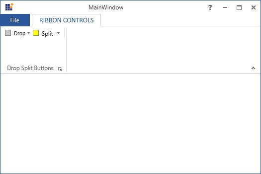
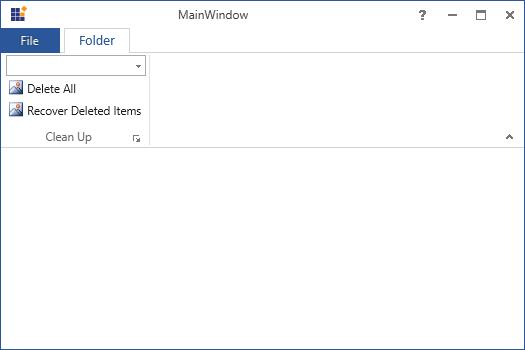

# Dealing with Ribbon Items in WPF Ribbon

Button Panel represents a panel control that can display horizontal row of Ribbon Items in a single border. It is used to manage the place for the controls.

## Adding items to ButtonPanel in XAML

Use the below code to create ButtonPanel in XAML





<syncfusion:Ribbon VerticalAlignment="Top" x:Name="_ribbon">  
<syncfusion:RibbonTab Caption="RIBBON CONTROLS" >
<syncfusion:RibbonBar Header="Drop Split Buttons">
<syncfusion:ButtonPanel>
<syncfusion:DropDownButton Label=" Drop "
SizeForm="Small"
SmallIcon="Images/Gray.png" />
<syncfusion:SplitButton Label=" Split "
SizeForm="Small"
SmallIcon="Images/Yellow.png" />
</syncfusion:ButtonPanel  >
<syncfusion:ButtonPanel SeparatorVisibility="Collapsed">
<syncfusion:RibbonButton Label="Simple"
SizeForm="ExtraSmall"
SmallIcon="Images/Gray.png" />
<syncfusion:RibbonButton IsToggle="True"
Label="Toggle"
SizeForm="ExtraSmall"
SmallIcon="Images/Red.png" />
<syncfusion:RibbonButton Label="Simple"
SizeForm="ExtraSmall"
SmallIcon="Images/Yellow.png" />
<syncfusion:RibbonButton IsToggle="True"
Label="Toggle"
SizeForm="ExtraSmall"
SmallIcon="Images/Blue.png" />
<syncfusion:RibbonButton IsToggle="True"
Label="Toggle"
SizeForm="ExtraSmall"
SmallIcon="Images/Orange.png" />
</syncfusion:ButtonPanel>
</syncfusion:RibbonBar>
</syncfusion:RibbonTab>
</syncfusion:Ribbon>





## Adding items to ButtonPanel in code behind

To create the ButtonPanel control in Code Behind, use the below code.





DropDownButton _dropDownButton = new DropDownButton() { Label = "Drop", SizeForm = Syncfusion.Windows.Tools.SizeForm.Small, SmallIcon = new BitmapImage(new Uri("/Resources/Gray.png", UriKind.Relative)) };
SplitButton _splitButton = new SplitButton() { Label = "Split", SizeForm = Syncfusion.Windows.Tools.SizeForm.Small, SmallIcon = new BitmapImage(new Uri("/Resources/Yellow.png", UriKind.Relative)) };
ButtonPanel _buttonPanel = new ButtonPanel();
_buttonPanel.Items.Add(_dropDownButton);
_buttonPanel.Items.Add(_splitButton);





Dim _dropDownButton As New DropDownButton() With {
	.Label = "Drop",
	.SizeForm = Syncfusion.Windows.Tools.SizeForm.Small,
	.SmallIcon = New BitmapImage(New Uri("/Resources/Gray.png", UriKind.Relative))
}

Dim _splitButton As New SplitButton() With {
	.Label = "Split",
	.SizeForm = Syncfusion.Windows.Tools.SizeForm.Small,
	.SmallIcon = New BitmapImage(New Uri("/Resources/Yellow.png", UriKind.Relative))
}

Dim _buttonPanel As New ButtonPanel()

_buttonPanel.Items.Add(_dropDownButton)

_buttonPanel.Items.Add(_splitButton)





## Changing size of ribbon items

`SizeForm` is used to set the size of the Ribbon items that are added inside the Ribbon control.

Possible values of `SizeForm` are Large, Small and ExtraSmall.

## List of controls which support SizeForm

* RibbonButton
* DropDownButton
* SplitButton

The code to set SizeForm for the above controls is illustrated below





<syncfusion:Ribbon  VerticalAlignment="Top" >
<syncfusion:RibbonTab  Caption="Home" IsChecked="True">
<syncfusion:RibbonBar Header="RibbonButton">
<syncfusion:RibbonButton   SizeForm="Large" Label="Reply"/>
<syncfusion:RibbonButton  SizeForm="Small" />
<syncfusion:ButtonPanel>
<syncfusion:RibbonButton  SizeForm="ExtraSmall" Label="ReplyAll"/>
</syncfusion:ButtonPanel>   
</syncfusion:RibbonBar>
<syncfusion:RibbonBar Header="SplitButton">
<syncfusion:SplitButton   SizeForm="Large" Label="NewItem"/>
<syncfusion:SplitButton   SizeForm="Small" Label="CleanUp"/>
<syncfusion:ButtonPanel>
<syncfusion:SplitButton  SizeForm="ExtraSmall" />   
</syncfusion:ButtonPanel>   
</syncfusion:RibbonBar>
<syncfusion:RibbonBar Header="DropDownButton">
<syncfusion:DropDownButton SizeForm="Large" Label="Delete"/>
<syncfusion:DropDownButton SizeForm="Small" Label="Junk"/>
<syncfusion:ButtonPanel>
<syncfusion:DropDownButton  SizeForm="ExtraSmall" />
</syncfusion:ButtonPanel>  
</syncfusion:RibbonBar>
</syncfusion:RibbonTab>
<syncfusion:RibbonTab Caption="Send/Receive" IsChecked="False"/>
</syncfusion:Ribbon>





## Add command to RibbonLauncherButton

Ribbon instance now provides command support for RibbonBar LauncherButton. It provides the following options.

* Setting LauncherButton Command
* Setting LauncherButton CommandTarget
* Setting LauncherButton CommandParameter

## Set RibbonBar LauncherButton Command

Command for RibbonBar LauncherButton can be set by using `LauncherCommand` attached property. The following code example illustrates this.





<syncfusion:Ribbon  VerticalAlignment="Top" >
<syncfusion:RibbonTab  Caption="Home" IsChecked="False">
<syncfusion:RibbonBar  Header="Acions"  IsLauncherButtonVisible="True" syncfusion:RibbonBar.LauncherCommand="EditingCommands.IncreaseFontSize" syncfusion:RibbonBar.LauncherCommandTarget="{Binding ElementName=Editor}">
<syncfusion:RibbonButton SizeForm="Small"  Label="Copy Folder"/>
<syncfusion:RibbonButton SizeForm="Small" Label="Move Folder"/>
<syncfusion:SplitButton  Label=" Split1 "   SizeForm="Large" >
<syncfusion:RibbonButton SizeForm="Small"  Label="Mark to Download"/>
<syncfusion:RibbonButton SizeForm="Small"  Label="UnMark to Download"/>
</syncfusion:SplitButton>
</syncfusion:RibbonBar>
</syncfusion:RibbonTab>
<syncfusion:RibbonTab  Caption="Insert" />
</syncfusion:Ribbon>





The font size for the selected text is increased when launcher button is clicked

## Show HelpButton in RibbonWindow

The HelpButton displays the information about the application.To enable this HelpButton in `Office2013` theme, set `ShowHelpButton` as `True` 





<syncfusion:RibbonWindow
xmlns="http://schemas.microsoft.com/winfx/2006/xaml/presentation"
xmlns:x="http://schemas.microsoft.com/winfx/2006/xaml"
xmlns:syncfusion="http://schemas.syncfusion.com/wpf" x:Class="RibbonButtonPanel.MainWindow"
Title="MainWindow" Height="350" Width="525" syncfusion:SkinStorage.VisualStyle="Office2013" ShowHelpButton="True" x:Name="_ribbonWindow"/>





To set the HelpButton at the right of the RibbonWindow for the themes except Office2013, use `TabPanelItem` property of the Ribbon

The TabPanelItem is located at the right corner below the main window close button in the following screen shot.

This following code snippet explains how to create and configure TabPanelItem.





<syncfusion:Ribbon.TabPanelItem>
<syncfusion:RibbonButton SizeForm="ExtraSmall" SmallIcon="help16.png" />
</syncfusion:Ribbon.TabPanelItem>




