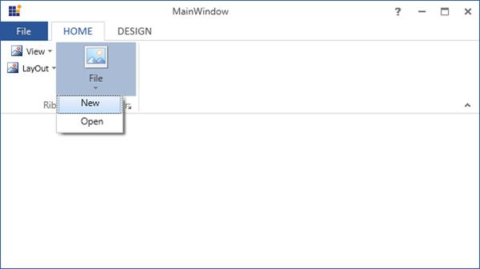
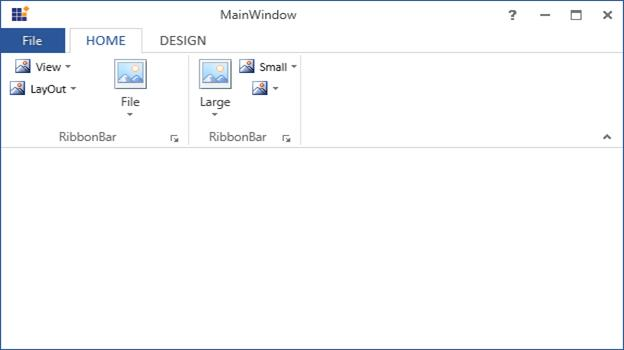

## DropDownButton

DropDownButton is a button control which contains a drop arrow, when clicked on it the menu related to the button is displayed

### Creating DropDownMenuItem

Using **DropDownMenuItem** we can add items to **SplitButton** and **DropDownButton**.

The following code example illustrates how to use DropDownMenuItems in Ribbon instance.



[XAML]

<syncfusion:Ribbon Name="_Ribbon1" HorizontalAlignment="Stretch" VerticalAlignment="Top">

<syncfusion:RibbonTab Caption="HOME" >

<syncfusion:RibbonBar Name="_RibbonBar2">

<syncfusion:DropDownButton Label="View"/>

<syncfusion:DropDownButton Label="LayOut"/>

<syncfusion:DropDownButton Name="_DropDownButton" SizeForm = "Large" Width="100" Label="File" >

<syncfusion:DropDownMenuItem Header="New"></syncfusion:DropDownMenuItem>

<syncfusion:DropDownMenuItem Header="Open"></syncfusion:DropDownMenuItem>

</syncfusion:DropDownButton>

</syncfusion:RibbonBar>

</syncfusion:RibbonTab>

</syncfusion:Ribbon>



Create instance of **DropDownMenuItems** and add it to **DropDownButton** Items.



[C#]

DropDownMenuItem _DropDownMenuItem = new DropDownMenuItem() {Header="New" };

DropDownMenuItem _DropDownMenuItem1 = new DropDownMenuItem() { Header = "Open" };

_DropDownButton.Items.Add(_DropDownMenuItem);

_DropDownButton.Items.Add(_DropDownMenuItem1);



### Adding DropDownMenuItem to DropDownMenuGroup

DropDownMenuItems can be grouped by using **DropDownMenuGroup**.

The following code example illustrates how to add Dropdown MenuItems to **DropDownMenuGroup** in **Ribbon** instance.



[XAML]

<syncfusion:Ribbon Name="_Ribbon1" HorizontalAlignment="Stretch" VerticalAlignment="Top">

<syncfusion:RibbonTab Caption="HOME" >

<syncfusion:RibbonBar Name="_RibbonBar2">

<syncfusion:DropDownButton Label="View"/>

<syncfusion:DropDownButton Label="LayOut"/>

<syncfusion:DropDownButton Name="_DropDownButton" SizeForm = "Large" Width="100" Label="File" >

<syncfusion:DropDownMenuGroup Name="_DropDownMenuGroup1" Header="Group1">

<syncfusion:DropDownMenuItem Header="New"/>

<syncfusion:DropDownMenuItem Header="Open"/>                            

</syncfusion:DropDownMenuGroup>

<syncfusion:DropDownMenuGroup Name="_DropDownMenuGroup2" Header="Group2">

<syncfusion:DropDownMenuItem Header="Cut"/>

<syncfusion:DropDownMenuItem Header="Copy"/>                      

</syncfusion:DropDownMenuGroup>

</syncfusion:DropDownButton>

</syncfusion:RibbonBar>

</syncfusion:RibbonTab>

<syncfusion:RibbonTab IsChecked="False" Caption="DESIGN"/>

</syncfusion:Ribbon>



Create instance of **DropDownMenuItem** and add it to **DropDownMenuGroup** Items.



[C#]

DropDownMenuItem _DropDownMenuItem = new DropDownMenuItem() {Header="New" };

DropDownMenuItem _DropDownMenuItem1 = new DropDownMenuItem() { Header = "Open" };

DropDownMenuItem _DropDownMenuItem2 = new DropDownMenuItem() { Header = "Cut" };

DropDownMenuItem _DropDownMenuItem3 = new DropDownMenuItem() { Header = "Copy" };

_DropDownMenuGroup1.Items.Add(_DropDownMenuItem);

_DropDownMenuGroup1.Items.Add(_DropDownMenuItem1);

_DropDownMenuGroup2.Items.Add(_DropDownMenuItem2);

_DropDownMenuGroup2.Items.Add(_DropDownMenuItem3);



### Control can be created in three types of sizes

**DropDownButton** have three types of size forms. You can set size forms using SizeForm Property.

The following code example illustrates different size forms of DropDownButton in Ribbon instance.



[XAML]

<syncfusion:RibbonBar Name="_RibbonBar2">

<syncfusion:DropDownButton SizeForm = "Large" Label="Large" />

<syncfusion:DropDownButton SizeForm = "Small" Label="Small" />

<syncfusion:DropDownButton SizeForm = "ExtraSmall" Label="ExtraSmall" />

</syncfusion:RibbonBar>





[C#]

DropDownButton _DropDownButton = new DropDownButton() { Label = "Large", SizeForm = SizeForm.Large };

DropDownButton _DropDownButton1 = new DropDownButton() { Label = "Small", SizeForm = SizeForm.Small };

DropDownButton _DropDownButton2 = new DropDownButton() { Label = "ExtraSmall", SizeForm = SizeForm.ExtraSmall };

_RibbonBar2.Items.Add(_DropDownButton);

_RibbonBar2.Items.Add(_DropDownButton1);

_RibbonBar2.Items.Add(_DropDownButton2);



