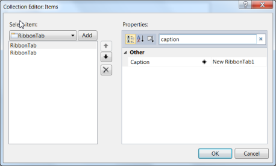
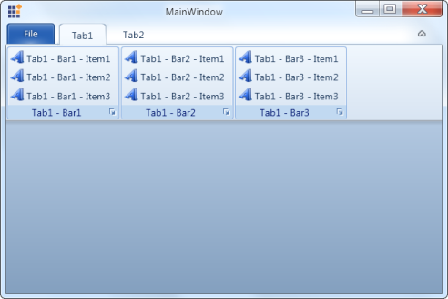
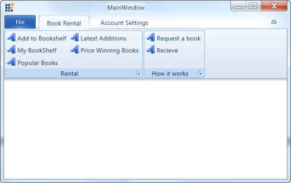
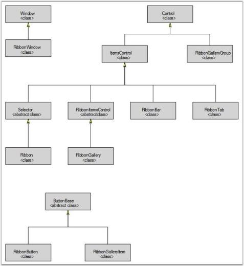

# Getting Started

Topics in this section guide you on getting started with the Ribbon control. It also elaborates on various features and supports provided by the control.

# Why to use our Ribbon control

Here are some highlights of our Ribbon control.

* Provides a ribbon window that overrides the default window and shows the window in Office 2007 style.
* Provides full layout like Office 2007 UI
* RibbonBar is available to structure the layouts
* There can be in two modes:
* LargeButton mode
* SmallButton mode
* Ribbon has a custom implementation of button control as Ribbon Button
* It has curved corners, which resembles the same as the Office ribbon button
* Minimize / Maximize the ribbon
* Keyboard navigation made easy through KeyTips (Super accelerator support)
* QuickAccessToolbar provides placing of items that are used very often.
* OfficeMenu – provides a menu drop-down like the Office2007 menu

# Control Structure

The different components of the control are described below:

1. Controls
1. BackStage Button – Used to Show/Hide the Backstage
2. QAT -   This area holds the frequently accessed items. The user can add/remove items dynamically.
2. Minimize Ribbon Button - Used to change the state (Minimize/Maximize) of Ribbon
3. Ribbon Status Bar – Displays the status bar items

Components of the BackStage view of the control are described below:

1. BackStage Items - The BackStage Items consist of the following:
1. BackStageCommandButton - This button is similar to a control and is used to perform certain task on click.
2. BackStageTabItem - This is a tab like control that comprises of Header and Content area. Header is displayed in the left bar and content occupies the remaining area in the RibbonWindow.

BackStage Corner Image - Image placed at the bottom-right corner of the BackStage area

# Creating the Control through Visual Studio

To create a control using Visual Studio:

Drag and drop the Ribbon control from toolbox to designer. It will generate the Ribbon as shown below:

Click on the SmartTag button in the Ribbon. The SmartTag opens as shown below:

The smart tag is used to add and configure items to the Ribbon. The Visual Studio’s (VS’s) property editor is used to configure ribbon properties. The Collection Editor shown in the following screenshot (can be opened by clicking the button in the Items property in the VS property grid) can be used to add items to the Ribbon:

# Creating the Control through Expression Blend

Ribbon control can also be created and configured by using Expression Blend. To create control through the Expression Blend:

1. Create a WPF project in the Expression Blend and add the reference to the following assemblies:
1. Syncfusion.Tools.Wpf
2. Syncfusion.Shared.Wpf
3. Syncfusion.Core

Search the Ribbon in the toolbox.

Drag and drop the Ribbon into the designer. It will create the Ribbon control as shown below:

Add the Ribbon Tabs as follows:

* Select the Ribbon and go to Properties area.
* Click Items (Collection) under Common Properties

The Collection Editor window opens:

1. Click Add Another Item. The Select Object window opens.
2. Select the RibbonTab ( type RibbonTab in the search box ) 
3. Click OK
4. Edit the RibbonTab properties in the Collection Editor window
5. Click OK
6. Choose the RibbonTab and add the required RibbonBars
7. Choose the RibbonBar and add the required controls 
8. The control will be created.
# Configuring Ribbon 

The following topics under this section explain the basic steps to create and configure the Ribbon and its elements. 

# Configuring QAT

This section explains how to create and configure the QAT (Quick Access Toolbar) in Ribbon.

## QAT Item

QAT Items can be added as follows: 

 

    [XAML]

<syncfusion:Ribbon.QuickAccessToolBar>

 <syncfusion:QuickAccessToolBar>

    <syncfusion:RibbonButton Label="Undo"/>

     <syncfusion:RibbonButton Label="Redo"/>

  </syncfusion:QuickAccessToolBar>

</syncfusion:Ribbon.QuickAccessToolBar>

 

## More Commands Options

QAT items can also be added through More Commands dialog box. 

All items added to the Ribbon will be included in More Commands dialog. This can be avoided by using the ShowInMoreCommands attached property available in the Ribbon as shown below:

 

   [XAML]

<syncfusion:RibbonBar Header="Clipboard" 					syncfusion:Ribbon.ShowInMoreCommands="False">

 

## QAT Menu Items

QAT Menu Items can be added as follows:

 

    [XAML]

<syncfusion:Ribbon.QuickAccessToolBar>

 <syncfusion:QuickAccessToolBar>

  <syncfusion:QuickAccessToolBar.QATMenuItems>

    <syncfusion:RibbonButton Label="Save"/>

    <syncfusion:RibbonButton Label="Print Preview"/>

  </syncfusion:QuickAccessToolBar.QATMenuItems>

 </syncfusion:QuickAccessToolBar>

</syncfusion:Ribbon.QuickAccessToolBar>

 

The QAT Menu Items will be displayed as below. After configuring the QAT, it appears as shown in the following image:

# Configuring Application Menu

The topics under this section explain how to create and configure Application Menu in Ribbon.

## Populating Left Pane Items

Application Menu’s left pane items can be populated as follows:

 

    [XAML]

<syncfusion:Ribbon.ApplicationMenu>

 <syncfusion:ApplicationMenu Width="38" Height="38" 			ApplicationButtonImage="/Resources/syncfusion.png" IsPopupOpen="False">         

  <syncfusion:SimpleMenuButton Label="Save" />

  <syncfusion:SplitMenuButton Label="Save As">

     <syncfusion:ApplicationMenuGroup Header="Save in another format" 			  IconBarEnabled="False">

        <syncfusion:SimpleMenuButton  Label="Save As" 

Description="Save a copy of the item to your computer in one of 			the several formates"  />

      </syncfusion:ApplicationMenuGroup>

  </syncfusion:SplitMenuButton>

 </syncfusion:ApplicationMenu>

</syncfusion:Ribbon.ApplicationMenu>

 

## Populating Bottom Pane Items

Footer items for the Application menu can be added as follows:

 

    [XAML]

<syncfusion:ApplicationMenu.ApplicationItems>

 <syncfusion:RibbonButton SizeForm = "Small" Label="Edit Options"/>

</syncfusion:ApplicationMenu.ApplicationItems>  

 

                                 

Items added to the ApplicationItems collection will be displayed in the footer of the Application Menu.

The Application Menu appears as shown in the following image:

# Configuring the BackStage 

The topics under this section explain how to create and configure the BackStage in Ribbon.

## BackStageCommandButton

The BackStageCommandButton can be added to BackStage as follows: 

 

    [XAML]

<syncfusion:Ribbon.BackStage>

 <syncfusion:Backstage Name="RibbonBackStage">

  <syncfusion:BackStageCommandButton Header="Save"  Command="Save"/>

  <syncfusion:BackStageCommandButton Header="Exit"/>

 </syncfusion:Backstage>

</syncfusion:Ribbon.BackStage>    

 

              

## BackStageTabItem 

The BackStageTabItem can be added to BackStage as follows.

 

    [XAML]

<syncfusion:Ribbon.BackStage>

 <syncfusion:Backstage Name="RibbonBackStage">

<!--BackStage Tab item helps to show some contents with header.-->

   <syncfusion:BackstageTabItem Header="Info" >

<!--Back Stage tab item content can be of any type.-->

                        <Grid>

                        </Grid>

   </syncfusion:BackstageTabItem>

  </syncfusion:Backstage>

</syncfusion:Ribbon.BackStage>    

 

              

# Data Binding 

The topics under this section explain data binding support of Ribbon with Object binding and XML binding.

# Object Binding

Ribbon control supports binding for business objects. 

The following sample illustrates this:

Create a class that acts as a model for RibbonTab. 


 
    [C#]

public class CustomRibbonTab

    {

        public string TabHeader { get; set; }

        public ObservableCollection<CustomRibbonBar> CustomRibbonBars { get; 				set; }

        public CustomRibbonTab()

        {

            CustomRibbonBars = new ObservableCollection<CustomRibbonBar>();

        }

    }

 

Create a class that acts as a model for RibbonBar. 


 
    [C#]

public class CustomRibbonBar

    {

        public string BarHeader { get; set; }

        public ObservableCollection<CustomRibbonItem> CustomRibbonItems { 				get; set; }

        public CustomRibbonBar()

        {

            CustomRibbonItems = new ObservableCollection<CustomRibbonItem>();

        }

    }

 

Create a Class that acts as a model for RibbonItem. 


 
    [C#]

public class CustomRibbonItem

    {

        public string ItemHeader

        {

            get; set;

        }

        public bool IsBoolean { get; set; }

        public bool IsLarge { get; set; }

    }

 

Iinitialize the Ribbon Items in the ViewModel class as follows:


 
    [C#]

public class ViewModel

    {

        public ObservableCollection<CustomRibbonTab> CustomRibbonTabs { get; 				set; }

        public ViewModel()

        {

            CustomRibbonTabs = new ObservableCollection<CustomRibbonTab>();

            PopulateRibbonTabs();

        }

        void PopulateRibbonTabs()

        {

            CustomRibbonTab cTab1 = new CustomRibbonTab() { TabHeader = 				"Tab1" };

            PopulateRibbonBars(cTab1);

            CustomRibbonTab cTab2 = new CustomRibbonTab() { TabHeader = 				"Tab2" };

            PopulateRibbonBars(cTab2);

            CustomRibbonTabs.Add(cTab1);

            CustomRibbonTabs.Add(cTab2);

        }

        void PopulateRibbonBars(CustomRibbonTab cTab)

        {

            CustomRibbonBar cBar1 = new CustomRibbonBar() { BarHeader = 				cTab.TabHeader + " - Bar1" };

            PopuplateRibbonItems(cBar1);

            CustomRibbonBar cBar2 = new CustomRibbonBar() { BarHeader = 				cTab.TabHeader + " - Bar2" };

            PopuplateRibbonItems(cBar2);

            CustomRibbonBar cBar3 = new CustomRibbonBar() { BarHeader = 				cTab.TabHeader + " - Bar3" };

            PopuplateRibbonItems(cBar3);

            cTab.CustomRibbonBars.Add(cBar1);

            cTab.CustomRibbonBars.Add(cBar2);

            cTab.CustomRibbonBars.Add(cBar3);

        }

        void PopuplateRibbonItems(CustomRibbonBar cBar)

        {

            CustomRibbonItem cItem1 = new CustomRibbonItem() { ItemHeader = 				cBar.BarHeader + " - Item1 " };

            CustomRibbonItem cItem2 = new CustomRibbonItem() { ItemHeader = 				cBar.BarHeader + " - Item2 " , IsBoolean= true};

            CustomRibbonItem cItem3 = new CustomRibbonItem() { ItemHeader = 				cBar.BarHeader + " - Item3 ", IsLarge= true};          

            cBar.CustomRibbonItems.Add(cItem1);

            cBar.CustomRibbonItems.Add(cItem2);

            cBar.CustomRibbonItems.Add(cItem3);

        }

    }

 

Create an instance of the ViewModel class and set it as DataContext for the RibbonWindow. 

Set the ItemsSource of the Ribbon , RibbonTab and RibbonBar to the corresponding collection as given in the following code snippet:



    [XAML]

<syncfusion:RibbonWindow x:Class="RibbonDataBindingDemo.MainWindow"

        xmlns="http://schemas.microsoft.com/winfx/2006/xaml/presentation"        

        xmlns:x="http://schemas.microsoft.com/winfx/2006/xaml" 

        xmlns:syncfusion="http://schemas.syncfusion.com/wpf"

        syncfusion:SkinStorage.VisualStyle="Office2010Blue"

        xmlns:local="clr-namespace: RibbonDataBindingDemo "

        Title="MainWindow" Height="350" Width="525" >

<syncfusion:RibbonWindow.DataContext>

   <local:ViewModel/>

</syncfusion:RibbonWindow.DataContext>    

 <syncfusion:Ribbon Grid.Row="0" 

                   Name="Ribbon1"                    

                   ItemsSource="{Binding CustomRibbonTabs}">

  <syncfusion:Ribbon.ItemContainerStyle>

   

      </Setter.Value>

     </Setter>

    </Style>

   </syncfusion:Ribbon.ItemContainerStyle>

  </syncfusion:Ribbon>

 </syncfusion:RibbonWindow>

 

The Ribbon is displayed as shown in the following screenshot:

# XML Binding

XML file can also be used as ItemsSource for the Ribbon. The following example illustrates this:

1. Create an xml file with the following details and name it as Data.xml.

   ~~~ xml

		[XML]

		<?xml version="1.0" encoding="utf-8" ?>

		<RibbonTabs>

		<TabCategory Name="Book Rental">

		<BarCategory Name="Rental">

		  <Command Name="Add to Bookshelf"/>

		  <Command Name="My BookShelf"/>

		  <Command Name="Popular Books"/>

		  <Command Name="Latest Additions"/>

		  <Command Name="Price Winning Books"/>

		</BarCategory>

		<BarCategory Name="How it works">

		  <Command Name="Request a book"/>

		  <Command Name="Receive"/>

		</BarCategory>

		</TabCategory>

		<TabCategory Name="Account Settings">

		<BarCategory Name="My Account">

		  <Command Name="Sign in"/>

		  <Command Name="Deactivate"/>

		</BarCategory>

		<BarCategory Name="Security">

		  <Command Name="Enable Secure surfing"/>

		  <Command Name="Change Password"/>

		</BarCategory>

		</TabCategory>  

		</RibbonTabs>
		
   ~~~
    {:.pretty-print }

2. Add the XmlDataProvider for the above XML document as given in the following code snippet:

   ~~~ xml

		[XAML]

		<XmlDataProvider Source="Data/Data.xml" x:Key="xmlSource" XPath="RibbonTabs"/> 
		
   ~~~
    {:.pretty-print }

3. Set the ItemsSource property for the Ribbon, RibbonTab and RibbonBar as shown in the below code snippet:

   ~~~ xml

		[XAML]

		<syncfusion:Ribbon 

			x:Name="ribbon" 

			ItemsSource="{Binding Source={StaticResource xmlSource}, 			            	XPath=TabCategory}">

		<syncfusion:Ribbon.ItemContainerStyle>

		

		</Setter.Value>

		</Setter>

		<Setter Property="Caption" Value="{Binding XPath=@Name}"/>

		</Style>

		</syncfusion:Ribbon.ItemContainerStyle>

		</syncfusion:Ribbon>
	
   ~~~
    {:.pretty-print }

A Ribbon is created as shown in the following screenshot:

# Customizing Data Templates

This section explains how to customize Ribbon and its elements using templates.

# Item Template 

It is possible to set the ItemTemplate for the RibborBar to control the display of the data that is bound to the RibbonBar. Since the RibbonBar can contain any UI Elements, the ItemTemplate is used to define the UI Elements to hold the data. 



    [XAML]

       

 

# Item Template Selector

This feature enables you to use different templates for items depending on specific constraints. The following example illustrates this: 

Create the template selector as shown in the following code snippet:


 
   [C#]

public class RibbonItemTemplateSelector : DataTemplateSelector

    {

        public override DataTemplate SelectTemplate(object item, 							DependencyObject container)

        {

            Window window = Application.Current.MainWindow;

            if (((CustomRibbonItem)item).IsBoolean)

            {

                return ((DataTemplate)window.Resources["BooleanTemplate"]);

            }

            else if(((CustomRibbonItem)item).IsLarge)

            {

      	     return 							((DataTemplate)window.Resources["LargeButtonTemplate"]);

            }

            else

                return 									((DataTemplate)window.Resources["SmallButtonTemplate"]);

        }

    }

 

Define Data templates in the Window’s resources as follows:



    [XAML]

<DataTemplate x:Key="SmallButtonTemplate">

 <syncfusion:RibbonButton SizeForm="Small" Label="{Binding ItemHeader}"/>

</DataTemplate>

<DataTemplate x:Key="LargeButtonTemplate">

  <syncfusion:RibbonButton SizeForm="Large" Label="{Binding ItemHeader}"/>

</DataTemplate>

<DataTemplate x:Key="BooleanTemplate">

  <syncfusion:RibbonCheckBox  Content="{Binding ItemHeader}"/>

</DataTemplate>

 

 Create the instance for the template selector in the Window’s resources as follows:


[XAML]

<local:RibbonItemTemplateSelector x:Key="ribbonItemTemplateSelector"/>

 

Use this template selector to choose template for the RibbonBar as follows:



    [XAML]

<syncfusion:Ribbon Name="Ribbon1"                                       		ItemsSource="{Binding CustomRibbonTabs}">

 <syncfusion:Ribbon.ItemContainerStyle>

  

      </Setter.Value>

    </Setter>

   </Style>

  </syncfusion:Ribbon.ItemContainerStyle>

</syncfusion:Ribbon>

 

A ribbon generates as shown in the following screenshot:

# Styling

The topics under this section explain how to customize the Ribbon using styles.

## Visual Style

Ribbon supports the following built-in Visual Styles:

* Office2007Blue
* Office2007Black
* Office2007Silver
* Office2010Blue
* Office2010Black
* Office2010Silver
* Blend
* VS2010
* Metro
* Transparent

Visual Styles can be applied via XAML as follows:



    [XAML]

syncfusion:SkinStorage.VisualStyle="Office2010Blue"

 

The VisualStyle attached property available in the SkinStorage class is used to set the Visual Styles for the controls. 

The following code snippet shows how to set the visual style in XAML:



    [XAML]

<syncfusion:RibbonWindow x:Class="BackStageSample.MainWindow"        syncfusion:SkinStorage.VisualStyle="Office2010Blue"        Title="BackStage Demo"  xmlns:syncfusion="http://schemas.syncfusion.com/wpf" />    

 

Now, the RibbonWindow and the controls inside the RibbonWindow get the Office2010Blue look.

Visual styles can be set using C# as follows:


 
    [C#]

SkinStorage.SetVisualStyle(ribbonWindowInstance, "Office2010Blue");

 

# Class Diagram

The class diagram for Ribbon controls are as follows.

