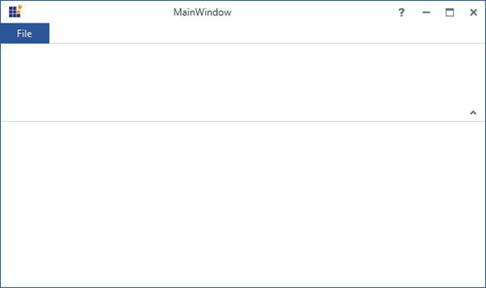
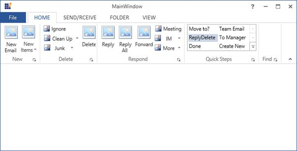
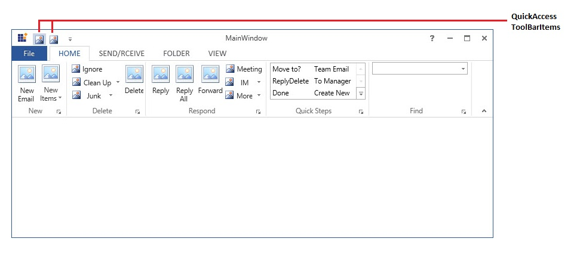
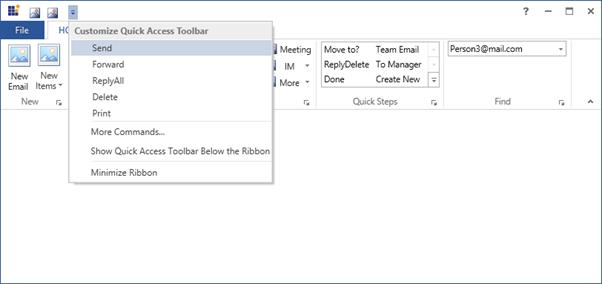
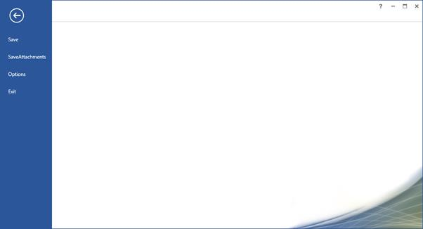

# Getting Started

This section explains how to implement a similar UI as Microsoft Outlook using `Ribbon`. 

## Adding Ribbon

There are several ways to add Syncfusion control in to Visual Studio WPF project, the following steps will helps to add a Ribbon control through XAML Code.

* Create a WPF project in Visual Studio and refer the following assemblies.

  1. Syncfusion.Tools.Wpf
  2. Syncfusion.Shared.Wpf
  
* Include an xml namespace for the above assemblies to the Main window.





<Window

xmlns="http://schemas.microsoft.com/winfx/2006/xaml/presentation"

xmlns:x="http://schemas.microsoft.com/winfx/2006/xaml"

xmlns:syncfusion="http://schemas.syncfusion.com/wpf" x:Class="RibbonControl.MainWindow">       

</Window>





* Change the Window as `RibbonWindow`.





<syncfusion:RibbonWindow

xmlns="http://schemas.microsoft.com/winfx/2006/xaml/presentation"

xmlns:x="http://schemas.microsoft.com/winfx/2006/xaml"

xmlns:syncfusion="http://schemas.syncfusion.com/wpf" x:Class="RibbonControl.MainWindow">

</syncfusion:RibbonWindow>





* Add following namespace and Inherit MainWindow from RibbonWindow in code behind.





using Syncfusion.Windows.Tools.Controls;

public partial class MainWindow : RibbonWindow





Imports Syncfusion.Windows.Tools.Controls

Public class As partial





* Now, Add the Ribbon control with a required optimal name, using the included namespace in XAML.





<syncfusion:RibbonWindow

xmlns="http://schemas.microsoft.com/winfx/2006/xaml/presentation"

xmlns:x="http://schemas.microsoft.com/winfx/2006/xaml"

xmlns:syncfusion="http://schemas.syncfusion.com/wpf"    x:Class="RibbonControl.MainWindow">

<Grid>

<syncfusion:Ribbon x:Name="_ribbon"/>

</Grid>

</syncfusion:RibbonWindow>





## Creating control in code behind

To create Ribbon control in code behind create instance of Ribbon control and add it to window.





Ribbon _ribbon = new Ribbon();

this.AddChild(_ribbon);





Dim _ribbon As New Ribbon()

Me.AddChild(_ribbon)





## Setting Visual Style of Ribbon

Essential Tools WPF support to set the `VisualStyle` for the Ribbon control to enhance the appearance of the control. This is achieved by using the VisualStyle property of the RibbonWindow.

Here Microsoft `Office2013` style applied to Ribbon Control.




<syncfusion:RibbonWindow

xmlns="http://schemas.microsoft.com/winfx/2006/xaml/presentation"

xmlns:x="http://schemas.microsoft.com/winfx/2006/xaml"

xmlns:syncfusion="http://schemas.syncfusion.com/wpf" x:Class="RibbonControl.MainWindow"

syncfusion:SkinStorage.VisualStyle="Office2013">

<Grid>

<syncfusion:Ribbon x:Name="_ribbon"/>

</Grid>

</syncfusion:RibbonWindow>





## Adding RibbonTab and RibbonBar

Ribbon control accept `RibbonTab` as children, Here four `RibbonTab` added and that further can customize with `RibbonBar` and `RibbonItems`.





<syncfusion:RibbonWindow

xmlns="http://schemas.microsoft.com/winfx/2006/xaml/presentation"

xmlns:x="http://schemas.microsoft.com/winfx/2006/xaml"

xmlns:syncfusion="http://schemas.syncfusion.com/wpf" x:Class="RibbonControl.MainWindow"       

syncfusion:SkinStorage.VisualStyle="Office2013">

<Grid>   

<syncfusion:Ribbon x:Name="_ribbon" VerticalAlignment="Top">

<syncfusion:RibbonTab Caption="HOME"  IsChecked="True"/>

<syncfusion:RibbonTab Caption="SEND/RCEIVE"  IsChecked="False"/>

<syncfusion:RibbonTab Caption="FOLDER"  IsChecked="False"/>

<syncfusion:RibbonTab Caption="VIEW"  IsChecked="False"/>

</syncfusion:Ribbon>

</Grid>

</syncfusion:RibbonWindow>





### Populating RibbonTab with RibbonBar

RibbonTab accepts RibbonBar as children, here five RibbonBar Controls are added inside HOME RibbonTab. You can set the header of RibbonBar using `Header` property of RibbonBar.




<syncfusion:RibbonWindow

xmlns="http://schemas.microsoft.com/winfx/2006/xaml/presentation"

xmlns:x="http://schemas.microsoft.com/winfx/2006/xaml"

xmlns:syncfusion="http://schemas.syncfusion.com/wpf" x:Class="RibbonControl.MainWindow"       

syncfusion:SkinStorage.VisualStyle="Office2013">

<Grid>   

<syncfusion:Ribbon x:Name="_ribbon" VerticalAlignment="Top">

<syncfusion:RibbonTab Caption="HOME"  IsChecked="True">

<syncfusion:RibbonBar Name="New" Width="90"  Header="New"/>

<syncfusion:RibbonBar Name="Delete" Width="150"  Header="Delete"/>

<syncfusion:RibbonBar Name="Respond" Width="90" Header="Respond"/>

<syncfusion:RibbonBar Name="Quicksteps" Width="90" Header="Quick Steps"/>

<syncfusion:RibbonBar Name="Find" Width="90" Header="Find"/>

</syncfusion:RibbonTab>

<syncfusion:RibbonTab Caption="SEND/RCEIVE"  IsChecked="False"/>

<syncfusion:RibbonTab Caption="FOLDER"  IsChecked="False"/>

<syncfusion:RibbonTab Caption="VIEW"  IsChecked="False"/>

</syncfusion:Ribbon>

</Grid>

</syncfusion:RibbonWindow>





## Adding different types of button in Ribbon

RibbonButton provides functionalities like normal Button, Here a RibbonButton control is added inside the `New` RibbonBar.




<syncfusion:RibbonBar Name="New" Width="90"  Header="New">                    

<syncfusion:RibbonButton SizeForm="Large" Label="New Email"/>

</syncfusion:RibbonBar>





Also you can add several other Ribbon Button as per the requirement  




<syncfusion:RibbonWindow

xmlns="http://schemas.microsoft.com/winfx/2006/xaml/presentation"

xmlns:x="http://schemas.microsoft.com/winfx/2006/xaml"

xmlns:syncfusion="http://schemas.syncfusion.com/wpf" x:Class="RibbonControl.MainWindow"       

syncfusion:SkinStorage.VisualStyle="Office2013">

<Grid>   

<syncfusion:Ribbon x:Name="_ribbon" VerticalAlignment="Top">

<syncfusion:RibbonTab Caption="HOME"  IsChecked="True">

<syncfusion:RibbonBar Name="New" Width="90"  Header="New">

<syncfusion:RibbonButton SizeForm="Large" Label="New Email"/>

</syncfusion:RibbonBar>

<syncfusion:RibbonBar Name="Delete" Width="130"  Header="Delete">

<syncfusion:RibbonButton Label="Ignore"/>

<syncfusion:RibbonButton Label="Delete" SizeForm="Large"/>

</syncfusion:RibbonBar>

<syncfusion:RibbonBar Name="Respond" Width="200" Header="Respond">

<syncfusion:RibbonButton Label="Reply" SizeForm="Large"/>

<syncfusion:RibbonButton Label="Reply All" SizeForm="Large"/>

<syncfusion:RibbonButton Label="Forward" SizeForm="Large"/>

<syncfusion:RibbonButton Label="Meeting"/>

</syncfusion:RibbonBar>

<syncfusion:RibbonBar Name="Quicksteps" Width="90" Header="Quick Steps"/>

<syncfusion:RibbonBar Name="Find" Width="90" Header="Find"/>

</syncfusion:RibbonTab>

<syncfusion:RibbonTab Caption="SEND/RCEIVE"  IsChecked="False"/>

<syncfusion:RibbonTab Caption="FOLDER"  IsChecked="False"/>

<syncfusion:RibbonTab Caption="VIEW"  IsChecked="False"/>

</syncfusion:Ribbon>

</Grid>

</syncfusion:RibbonWindow>





### Adding DropDownButton

DropDownButton in the Ribbon instance contains a drop arrow. When clicked on it, the menu related to the button is displayed.

DropDownButton accepts DropDownMenuItem as its children, Here DropDownButton control is added inside the “New“ RibbonBar.




<syncfusion:RibbonWindow

xmlns="http://schemas.microsoft.com/winfx/2006/xaml/presentation"

xmlns:x="http://schemas.microsoft.com/winfx/2006/xaml"

xmlns:syncfusion="http://schemas.syncfusion.com/wpf" x:Class="RibbonControl.MainWindow"       

syncfusion:SkinStorage.VisualStyle="Office2013">

<Grid>   

<syncfusion:Ribbon x:Name="_ribbon" VerticalAlignment="Top">

<syncfusion:RibbonTab Caption="HOME"  IsChecked="True">

<syncfusion:RibbonBar Name="New" Width="90"  Header="New">

<syncfusion:RibbonButton SizeForm="Large" Label="New Email"/>

<syncfusion:DropDownButton SizeForm="Large" Label="New Items">

<syncfusion:DropDownMenuItem Header="E-mail Message"/>

<syncfusion:DropDownMenuItem Header="Appointment"/>

<syncfusion:DropDownMenuItem Header="Meeting"/>

<syncfusion:DropDownMenuItem Header="Contact"/>

<syncfusion:DropDownMenuItem Header="Task"/>

</syncfusion:DropDownButton>

</syncfusion:RibbonBar>

<syncfusion:RibbonBar Name="Delete" Width="130"  Header="Delete">

<syncfusion:RibbonButton Label="Ignore"/>

<syncfusion:RibbonButton Label="Delete" SizeForm="Large"/>

</syncfusion:RibbonBar>

<syncfusion:RibbonBar Name="Respond" Width="200" Header="Respond">

<syncfusion:RibbonButton Label="Reply" SizeForm="Large"/>

<syncfusion:RibbonButton Label="Reply All" SizeForm="Large"/>

<syncfusion:RibbonButton Label="Forward" SizeForm="Large"/>

<syncfusion:RibbonButton Label="Meeting"/>

</syncfusion:RibbonBar>

<syncfusion:RibbonBar Name="Quicksteps" Width="90" Header="Quick Steps"/>

<syncfusion:RibbonBar Name="Find" Width="90" Header="Find"/>

</syncfusion:RibbonTab>

<syncfusion:RibbonTab Caption="SEND/RCEIVE"  IsChecked="False"/>

<syncfusion:RibbonTab Caption="FOLDER"  IsChecked="False"/>

<syncfusion:RibbonTab Caption="VIEW"  IsChecked="False"/>

</syncfusion:Ribbon>

</Grid>

</syncfusion:RibbonWindow>





### Adding SplitButton

SplitButton in the Ribbon instance contains a drop arrow. When clicked on it, the menu related to the button is displayed. Events are raised, when main Button is clicked as well as when the sub item in the SplitButton is clicked.

SplitButton accepts DropDownMenuItem as its children like DropDownButton, Here splitbuttons are added inside the “Delete” RibbonBar and “Respond” RibbonBar.





<syncfusion:RibbonWindow

xmlns="http://schemas.microsoft.com/winfx/2006/xaml/presentation"

xmlns:x="http://schemas.microsoft.com/winfx/2006/xaml"

xmlns:syncfusion="http://schemas.syncfusion.com/wpf" x:Class="RibbonControl.MainWindow"       

syncfusion:SkinStorage.VisualStyle="Office2013">

<Grid>

<syncfusion:Ribbon x:Name="_ribbon" VerticalAlignment="Top">

<syncfusion:RibbonTab Caption="HOME"  IsChecked="True">

<syncfusion:RibbonBar Name="New" Width="90"  Header="New">

<syncfusion:RibbonButton SizeForm="Large" Label="New Email"/>

<syncfusion:DropDownButton SizeForm="Large" Label="New Items">

<syncfusion:DropDownMenuItem Header="E-mail Message"/>

<syncfusion:DropDownMenuItem Header="Appointment"/>

<syncfusion:DropDownMenuItem Header="Meeting"/>

<syncfusion:DropDownMenuItem Header="Contact"/>

<syncfusion:DropDownMenuItem Header="Task"/>

</syncfusion:DropDownButton>

</syncfusion:RibbonBar>

<syncfusion:RibbonBar Name="Delete" Width="130"  Header="Delete">

<syncfusion:RibbonButton Label="Ignore"/>

<syncfusion:SplitButton Label="Clean Up">

<syncfusion:DropDownMenuItem Header="Clean Up Folder"/>

<syncfusion:DropDownMenuItem Header="Clean Up Conversation"/>

<syncfusion:DropDownMenuItem Header="Clean Up Folder/SubFolder"/>

</syncfusion:SplitButton>

<syncfusion:SplitButton Label="Junk" Margin="0,0,12,0" Width="76"/>

<syncfusion:RibbonButton Label="Delete" SizeForm="Large"/>

</syncfusion:RibbonBar>

<syncfusion:RibbonBar Name="Respond" Width="200" Header="Respond">

<syncfusion:RibbonButton Label="Reply" SizeForm="Large"/>

<syncfusion:RibbonButton Label="Reply All" SizeForm="Large"/>

<syncfusion:RibbonButton Label="Forward" SizeForm="Large"/>

<syncfusion:RibbonButton Label="Meeting"/>

<syncfusion:SplitButton Label="IM" Margin="-2,0,6,0" Width="68"/>

<syncfusion:SplitButton Label="More" Margin="-2,0,6,0" Width="68"/>

</syncfusion:RibbonBar>

<syncfusion:RibbonBar Name="Quicksteps" Width="90" Header="Quick Steps"/>

<syncfusion:RibbonBar Name="Find" Width="90" Header="Find"/>

</syncfusion:RibbonTab>

<syncfusion:RibbonTab Caption="SEND/RCEIVE"  IsChecked="False"/>

<syncfusion:RibbonTab Caption="FOLDER"  IsChecked="False"/>

<syncfusion:RibbonTab Caption="VIEW"  IsChecked="False"/>

</syncfusion:Ribbon>

</Grid>

</syncfusion:RibbonWindow>





## Adding dropdown control to Ribbon

RibbonComboBox and RibbonGallery are DropDown controls in Ribbon.

### RibbonGallery

Using the RibbonGallery control in Ribbon, items are displayed with good look and feel and it also enables the users to classify the items as groups for easy navigation.

Here RibbonGallery control added inside the “QuickSteps” RibbonBar. `ItemHeight`, `ItemWidth` properties are used to set height and width of RibbonGalleryItem.




<syncfusion:RibbonWindow

xmlns="http://schemas.microsoft.com/winfx/2006/xaml/presentation"

xmlns:x="http://schemas.microsoft.com/winfx/2006/xaml"

xmlns:syncfusion="http://schemas.syncfusion.com/wpf" x:Class="RibbonControl.MainWindow"       

syncfusion:SkinStorage.VisualStyle="Office2013">

<Grid>   

<syncfusion:Ribbon x:Name="_ribbon" VerticalAlignment="Top">

<syncfusion:RibbonTab Caption="HOME"  IsChecked="True">

<syncfusion:RibbonBar Name="New" Width="90"  Header="New">

<syncfusion:RibbonButton SizeForm="Large" Label="New Email"/>

<syncfusion:DropDownButton SizeForm="Large" Label="New Items">

<syncfusion:DropDownMenuItem Header="E-mail Message"/>

<syncfusion:DropDownMenuItem Header="Appointment"/>

<syncfusion:DropDownMenuItem Header="Meeting"/>

<syncfusion:DropDownMenuItem Header="Contact"/>

<syncfusion:DropDownMenuItem Header="Task"/>

</syncfusion:DropDownButton>

</syncfusion:RibbonBar>

<syncfusion:RibbonBar Name="Delete" Width="130"  Header="Delete">

<syncfusion:RibbonButton Label="Ignore"/>

<syncfusion:SplitButton Label="Clean Up">

<syncfusion:DropDownMenuItem Header="Clean Up Folder"/>

<syncfusion:DropDownMenuItem Header="Clean Up Conversation"/>

<syncfusion:DropDownMenuItem Header="Clean Up Folder/SubFolder"/>

</syncfusion:SplitButton>

<syncfusion:SplitButton Label="Junk" Margin="0,0,12,0" Width="76"/>

<syncfusion:RibbonButton Label="Delete" SizeForm="Large"/>

</syncfusion:RibbonBar>

<syncfusion:RibbonBar Name="Respond" Width="200" Header="Respond">

<syncfusion:RibbonButton Label="Reply" SizeForm="Large"/>

<syncfusion:RibbonButton Label="Reply All" SizeForm="Large"/>

<syncfusion:RibbonButton Label="Forward" SizeForm="Large"/>

<syncfusion:RibbonButton Label="Meeting"/>

<syncfusion:SplitButton Label="IM" Margin="-2,0,6,0" Width="68"/>

<syncfusion:SplitButton Label="More" Margin="-2,0,6,0" Width="68"/>

</syncfusion:RibbonBar>

<syncfusion:RibbonBar Width="170" Name="QuickSteps" Header="Quick Steps">

<syncfusion:RibbonGallery Width="160"    VisualMode="InRibbon" ItemHeight="20" ItemWidth="70">

<syncfusion:RibbonGalleryItem  Content="Move to?"/>

<syncfusion:RibbonGalleryItem  Content="Team Email"/>

<syncfusion:RibbonGalleryItem  Content="ReplyDelete"/>

<syncfusion:RibbonGalleryItem  Content="To Manager"/>

<syncfusion:RibbonGalleryItem  Content="Done"/>

<syncfusion:RibbonGalleryItem  Content="Create New"/>

</syncfusion:RibbonGallery>

</syncfusion:RibbonBar>

<syncfusion:RibbonBar Name="Find" Width="90" Header="Find"/>

</syncfusion:RibbonTab>

<syncfusion:RibbonTab Caption="SEND/RCEIVE"  IsChecked="False"/>

<syncfusion:RibbonTab Caption="FOLDER"  IsChecked="False"/>

<syncfusion:RibbonTab Caption="VIEW"  IsChecked="False"/>

</syncfusion:Ribbon>

</Grid>

</syncfusion:RibbonWindow>





### RibbonComboBox

RibbonComboBox control is used to display the list of items in Ribbon instance. You can add any number of items to the RibbonComboBox.

Add items to RibbonComboBox using ComboBoxItem. Here RibbonComboBox is added inside the “Find” RibbonBar.




<syncfusion:RibbonWindow

xmlns="http://schemas.microsoft.com/winfx/2006/xaml/presentation"

xmlns:x="http://schemas.microsoft.com/winfx/2006/xaml"

xmlns:syncfusion="http://schemas.syncfusion.com/wpf" x:Class="RibbonControl.MainWindow"       

syncfusion:SkinStorage.VisualStyle="Office2013">

<Grid>   

<syncfusion:Ribbon x:Name="_ribbon" VerticalAlignment="Top">

<syncfusion:RibbonTab Caption="HOME"  IsChecked="True">

<syncfusion:RibbonBar Name="New" Width="90"  Header="New">

<syncfusion:RibbonButton SizeForm="Large" Label="New Email"/>

<syncfusion:DropDownButton SizeForm="Large" Label="New Items">

<syncfusion:DropDownMenuItem Header="E-mail Message"/>

<syncfusion:DropDownMenuItem Header="Appointment"/>

<syncfusion:DropDownMenuItem Header="Meeting"/>

<syncfusion:DropDownMenuItem Header="Contact"/>

<syncfusion:DropDownMenuItem Header="Task"/>

</syncfusion:DropDownButton>

</syncfusion:RibbonBar>

<syncfusion:RibbonBar Name="Delete" Width="130"  Header="Delete">

<syncfusion:RibbonButton Label="Ignore"/>

<syncfusion:SplitButton Label="Clean Up">

<syncfusion:DropDownMenuItem Header="Clean Up Folder"/>

<syncfusion:DropDownMenuItem Header="Clean Up Conversation"/>

<syncfusion:DropDownMenuItem Header="Clean Up Folder/SubFolder"/>

</syncfusion:SplitButton>

<syncfusion:SplitButton Label="Junk" Margin="0,0,12,0" Width="76"/>

<syncfusion:RibbonButton Label="Delete" SizeForm="Large"/>

</syncfusion:RibbonBar>

<syncfusion:RibbonBar Name="Respond" Width="200" Header="Respond">

<syncfusion:RibbonButton Label="Reply" SizeForm="Large"/>

<syncfusion:RibbonButton Label="Reply All" SizeForm="Large"/>

<syncfusion:RibbonButton Label="Forward" SizeForm="Large"/>

<syncfusion:RibbonButton Label="Meeting"/>

<syncfusion:SplitButton Label="IM" Margin="-2,0,6,0" Width="68"/>

<syncfusion:SplitButton Label="More" Margin="-2,0,6,0" Width="68"/>

</syncfusion:RibbonBar>

<syncfusion:RibbonBar Width="170" Name="QuickSteps" Header="Quick Steps">

<syncfusion:RibbonGallery Width="160"    VisualMode="InRibbon" ItemHeight="20" ItemWidth="70">

<syncfusion:RibbonGalleryItem  Content="Move to?"/>

<syncfusion:RibbonGalleryItem  Content="Team Email"/>

<syncfusion:RibbonGalleryItem  Content="ReplyDelete"/>

<syncfusion:RibbonGalleryItem  Content="To Manager"/>

<syncfusion:RibbonGalleryItem  Content="Done"/>

<syncfusion:RibbonGalleryItem  Content="Create New"/>

</syncfusion:RibbonGallery>

</syncfusion:RibbonBar>

<syncfusion:RibbonBar Width="170" Header="Find" Name="Find"  >

<syncfusion:RibbonComboBox Label="Filter Email" Width="160">

<ComboBoxItem>Person1@mail.com</ComboBoxItem>

<ComboBoxItem>Person2@mail.com</ComboBoxItem>

<ComboBoxItem>Person3@mail.com</ComboBoxItem>

</syncfusion:RibbonComboBox>

</syncfusion:RibbonBar>

</syncfusion:RibbonTab>

<syncfusion:RibbonTab Caption="SEND/RCEIVE"  IsChecked="False"/>

<syncfusion:RibbonTab Caption="FOLDER"  IsChecked="False"/>

<syncfusion:RibbonTab Caption="VIEW"  IsChecked="False"/>

</syncfusion:Ribbon>

</Grid>

</syncfusion:RibbonWindow>





## Adding QAT

QuickAccessToolbar in the Ribbon instance is used to group the frequently used commands and access the commands easily without having to search for the command in the menu bar. `QAT` can be placed above or below the ribbon.

The following code example illustrates how to add QuickAccessToolBar in Ribbon instance.





<syncfusion:RibbonWindow

xmlns="http://schemas.microsoft.com/winfx/2006/xaml/presentation"

xmlns:x="http://schemas.microsoft.com/winfx/2006/xaml"

xmlns:syncfusion="http://schemas.syncfusion.com/wpf" x:Class="RibbonControl.MainWindow"       

syncfusion:SkinStorage.VisualStyle="Office2013">

<Grid>

<syncfusion:Ribbon x:Name="_ribbon" VerticalAlignment="Top">

<syncfusion:RibbonTab Caption="HOME"  IsChecked="True">

<syncfusion:RibbonBar Name="New" Width="90"  Header="New">

<syncfusion:RibbonButton SizeForm="Large" Label="New Email"/>

<syncfusion:DropDownButton SizeForm="Large" Label="New Items">

<syncfusion:DropDownMenuItem Header="E-mail Message"/>

<syncfusion:DropDownMenuItem Header="Appointment"/>

<syncfusion:DropDownMenuItem Header="Meeting"/>

<syncfusion:DropDownMenuItem Header="Contact"/>

<syncfusion:DropDownMenuItem Header="Task"/>

</syncfusion:DropDownButton>

</syncfusion:RibbonBar>

<syncfusion:RibbonBar Name="Delete" Width="130"  Header="Delete">

<syncfusion:RibbonButton Label="Ignore"/>

<syncfusion:SplitButton Label="Clean Up">

<syncfusion:DropDownMenuItem Header="Clean Up Folder"/>

<syncfusion:DropDownMenuItem Header="Clean Up Conversation"/>

<syncfusion:DropDownMenuItem Header="Clean Up Folder/SubFolder"/>

</syncfusion:SplitButton>

<syncfusion:SplitButton Label="Junk" Margin="0,0,12,0" Width="76"/>

<syncfusion:RibbonButton Label="Delete" SizeForm="Large"/>

</syncfusion:RibbonBar>

<syncfusion:RibbonBar Name="Respond" Width="200" Header="Respond">

<syncfusion:RibbonButton Label="Reply" SizeForm="Large"/>

<syncfusion:RibbonButton Label="Reply All" SizeForm="Large"/>

<syncfusion:RibbonButton Label="Forward" SizeForm="Large"/>

<syncfusion:RibbonButton Label="Meeting"/>

<syncfusion:SplitButton Label="IM" Margin="-2,0,6,0" Width="68"/>

<syncfusion:SplitButton Label="More" Margin="-2,0,6,0" Width="68"/>

</syncfusion:RibbonBar>

<syncfusion:RibbonBar Width="170" Name="QuickSteps" Header="Quick Steps">

<syncfusion:RibbonGallery Width="160"    VisualMode="InRibbon" ItemHeight="20" ItemWidth="70">

<syncfusion:RibbonGalleryItem  Content="Move to?"/>

<syncfusion:RibbonGalleryItem  Content="Team Email"/>

<syncfusion:RibbonGalleryItem  Content="ReplyDelete"/>

<syncfusion:RibbonGalleryItem  Content="To Manager"/>

<syncfusion:RibbonGalleryItem  Content="Done"/>

<syncfusion:RibbonGalleryItem  Content="Create New"/>

</syncfusion:RibbonGallery>

</syncfusion:RibbonBar>

<syncfusion:RibbonBar Width="170" Header="Find" Name="Find"  >

<syncfusion:RibbonComboBox Label="Filter Email" Width="160">

<ComboBoxItem>Person1@mail.com</ComboBoxItem>

<ComboBoxItem>Person2@mail.com</ComboBoxItem>

<ComboBoxItem>Person3@mail.com</ComboBoxItem>

</syncfusion:RibbonComboBox>

</syncfusion:RibbonBar>

</syncfusion:RibbonTab>

<syncfusion:RibbonTab Caption="SEND/RCEIVE"  IsChecked="False"/>

<syncfusion:RibbonTab Caption="FOLDER"  IsChecked="False"/>

<syncfusion:RibbonTab Caption="VIEW"  IsChecked="False"/>

<syncfusion:Ribbon.QuickAccessToolBar>

<syncfusion:QuickAccessToolBar/>

</syncfusion:Ribbon.QuickAccessToolBar>

</syncfusion:Ribbon>

</Grid>

</syncfusion:RibbonWindow>





### Adding items to Quick Access Toolbar	

QuickAccessToolBar property help to add item that required  to access quickly, here items added to QuickAccessToolBar by adding items inside the "<syncfusion:QuickAccessToolBar/>".




<syncfusion:RibbonWindow

xmlns="http://schemas.microsoft.com/winfx/2006/xaml/presentation"

xmlns:x="http://schemas.microsoft.com/winfx/2006/xaml"

xmlns:syncfusion="http://schemas.syncfusion.com/wpf" x:Class="RibbonControl.MainWindow"       

syncfusion:SkinStorage.VisualStyle="Office2013">

<Grid>

<syncfusion:Ribbon x:Name="_ribbon" VerticalAlignment="Top">

<syncfusion:RibbonTab Caption="HOME"  IsChecked="True">

<syncfusion:RibbonBar Name="New" Width="90"  Header="New">

<syncfusion:RibbonButton SizeForm="Large" Label="New Email"/>

<syncfusion:DropDownButton SizeForm="Large" Label="New Items">

<syncfusion:DropDownMenuItem Header="E-mail Message"/>

<syncfusion:DropDownMenuItem Header="Appointment"/>

<syncfusion:DropDownMenuItem Header="Meeting"/>

<syncfusion:DropDownMenuItem Header="Contact"/>

<syncfusion:DropDownMenuItem Header="Task"/>

</syncfusion:DropDownButton>

</syncfusion:RibbonBar>

<syncfusion:RibbonBar Name="Delete" Width="130"  Header="Delete">

<syncfusion:RibbonButton Label="Ignore"/>

<syncfusion:SplitButton Label="Clean Up">

<syncfusion:DropDownMenuItem Header="Clean Up Folder"/>

<syncfusion:DropDownMenuItem Header="Clean Up Conversation"/>

<syncfusion:DropDownMenuItem Header="Clean Up Folder/SubFolder"/>

</syncfusion:SplitButton>

<syncfusion:SplitButton Label="Junk" Margin="0,0,12,0" Width="76"/>

<syncfusion:RibbonButton Label="Delete" SizeForm="Large"/>

</syncfusion:RibbonBar>

<syncfusion:RibbonBar Name="Respond" Width="200" Header="Respond">

<syncfusion:RibbonButton Label="Reply" SizeForm="Large"/>

<syncfusion:RibbonButton Label="Reply All" SizeForm="Large"/>

<syncfusion:RibbonButton Label="Forward" SizeForm="Large"/>

<syncfusion:RibbonButton Label="Meeting"/>

<syncfusion:SplitButton Label="IM" Margin="-2,0,6,0" Width="68"/>

<syncfusion:SplitButton Label="More" Margin="-2,0,6,0" Width="68"/>

</syncfusion:RibbonBar>

<syncfusion:RibbonBar Width="170" Name="QuickSteps" Header="Quick Steps">

<syncfusion:RibbonGallery Width="160"    VisualMode="InRibbon" ItemHeight="20" ItemWidth="70">

<syncfusion:RibbonGalleryItem  Content="Move to?"/>

<syncfusion:RibbonGalleryItem  Content="Team Email"/>

<syncfusion:RibbonGalleryItem  Content="ReplyDelete"/>

<syncfusion:RibbonGalleryItem  Content="To Manager"/>

<syncfusion:RibbonGalleryItem  Content="Done"/>

<syncfusion:RibbonGalleryItem  Content="Create New"/>

</syncfusion:RibbonGallery>

</syncfusion:RibbonBar>

<syncfusion:RibbonBar Width="170" Header="Find" Name="Find"  >

<syncfusion:RibbonComboBox Label="Filter Email" Width="160">

<ComboBoxItem>Person1@mail.com</ComboBoxItem>

<ComboBoxItem>Person2@mail.com</ComboBoxItem>

<ComboBoxItem>Person3@mail.com</ComboBoxItem>

</syncfusion:RibbonComboBox>

</syncfusion:RibbonBar>

</syncfusion:RibbonTab>

<syncfusion:RibbonTab Caption="SEND/RCEIVE"  IsChecked="False"/>

<syncfusion:RibbonTab Caption="FOLDER"  IsChecked="False"/>

<syncfusion:RibbonTab Caption="VIEW"  IsChecked="False"/>

<syncfusion:Ribbon.QuickAccessToolBar>

<syncfusion:QuickAccessToolBar>

<syncfusion:RibbonButton SizeForm="ExtraSmall"/>

<syncfusion:RibbonButton SizeForm="ExtraSmall"/>

</syncfusion:QuickAccessToolBar>

</syncfusion:Ribbon.QuickAccessToolBar>

</syncfusion:Ribbon>

</Grid>

</syncfusion:RibbonWindow>





### Adding items to QAT Dropdown menu item	

QATMenuItems property of QuickAccessToolbar used to add items to Dropdown menu of QAT. 




<syncfusion:RibbonWindow

xmlns="http://schemas.microsoft.com/winfx/2006/xaml/presentation"

xmlns:x="http://schemas.microsoft.com/winfx/2006/xaml"

xmlns:syncfusion="http://schemas.syncfusion.com/wpf" x:Class="RibbonControl.MainWindow"       

syncfusion:SkinStorage.VisualStyle="Office2013">

<Grid>

<syncfusion:Ribbon x:Name="_ribbon" VerticalAlignment="Top">

<syncfusion:RibbonTab Caption="HOME"  IsChecked="True">

<syncfusion:RibbonBar Name="New" Width="90"  Header="New">

<syncfusion:RibbonButton SizeForm="Large" Label="New Email"/>

<syncfusion:DropDownButton SizeForm="Large" Label="New Items">

<syncfusion:DropDownMenuItem Header="E-mail Message"/>

<syncfusion:DropDownMenuItem Header="Appointment"/>

<syncfusion:DropDownMenuItem Header="Meeting"/>

<syncfusion:DropDownMenuItem Header="Contact"/>

<syncfusion:DropDownMenuItem Header="Task"/>

</syncfusion:DropDownButton>

</syncfusion:RibbonBar>

<syncfusion:RibbonBar Name="Delete" Width="130"  Header="Delete">

<syncfusion:RibbonButton Label="Ignore"/>

<syncfusion:SplitButton Label="Clean Up">

<syncfusion:DropDownMenuItem Header="Clean Up Folder"/>

<syncfusion:DropDownMenuItem Header="Clean Up Conversation"/>

<syncfusion:DropDownMenuItem Header="Clean Up Folder/SubFolder"/>

</syncfusion:SplitButton>

<syncfusion:SplitButton Label="Junk" Margin="0,0,12,0" Width="76"/>

<syncfusion:RibbonButton Label="Delete" SizeForm="Large"/>

</syncfusion:RibbonBar>

<syncfusion:RibbonBar Name="Respond" Width="200" Header="Respond">

<syncfusion:RibbonButton Label="Reply" SizeForm="Large"/>

<syncfusion:RibbonButton Label="Reply All" SizeForm="Large"/>

<syncfusion:RibbonButton Label="Forward" SizeForm="Large"/>

<syncfusion:RibbonButton Label="Meeting"/>

<syncfusion:SplitButton Label="IM" Margin="-2,0,6,0" Width="68"/>

<syncfusion:SplitButton Label="More" Margin="-2,0,6,0" Width="68"/>

</syncfusion:RibbonBar>

<syncfusion:RibbonBar Width="170" Name="QuickSteps" Header="Quick Steps">

<syncfusion:RibbonGallery Width="160"    VisualMode="InRibbon" ItemHeight="20" ItemWidth="70">

<syncfusion:RibbonGalleryItem  Content="Move to?"/>

<syncfusion:RibbonGalleryItem  Content="Team Email"/>

<syncfusion:RibbonGalleryItem  Content="ReplyDelete"/>

<syncfusion:RibbonGalleryItem  Content="To Manager"/>

<syncfusion:RibbonGalleryItem  Content="Done"/>

<syncfusion:RibbonGalleryItem  Content="Create New"/>

</syncfusion:RibbonGallery>

</syncfusion:RibbonBar>

<syncfusion:RibbonBar Width="170" Header="Find" Name="Find"  >

<syncfusion:RibbonComboBox Label="Filter Email" Width="160">

<ComboBoxItem>Person1@mail.com</ComboBoxItem>

<ComboBoxItem>Person2@mail.com</ComboBoxItem>

<ComboBoxItem>Person3@mail.com</ComboBoxItem>

</syncfusion:RibbonComboBox>

</syncfusion:RibbonBar>

</syncfusion:RibbonTab>

<syncfusion:RibbonTab Caption="SEND/RCEIVE"  IsChecked="False"/>

<syncfusion:RibbonTab Caption="FOLDER"  IsChecked="False"/>

<syncfusion:RibbonTab Caption="VIEW"  IsChecked="False"/>

<syncfusion:Ribbon.QuickAccessToolBar>

<syncfusion:QuickAccessToolBar>

<syncfusion:RibbonButton SizeForm="ExtraSmall"/>

<syncfusion:RibbonButton SizeForm="ExtraSmall"/>

<syncfusion:QuickAccessToolBar.QATMenuItems>

<syncfusion:RibbonButton Label="Send" />

<syncfusion:RibbonButton Label="Forward" />

<syncfusion:RibbonButton Label="ReplyAll" />

<syncfusion:RibbonButton Label="Delete" />

<syncfusion:RibbonButton Label="Print" />

</syncfusion:QuickAccessToolBar.QATMenuItems>

</syncfusion:QuickAccessToolBar>

</syncfusion:Ribbon.QuickAccessToolBar>

</syncfusion:Ribbon>

</Grid>

</syncfusion:RibbonWindow>





## Adding BackStage

BackStage of Ribbon control can be added by using BackStage property of Ribbon. You can access backstage view by clicking `FILE` Menu in Ribbon instance like in Microsoft Outlook. 




<syncfusion:RibbonWindow

xmlns="http://schemas.microsoft.com/winfx/2006/xaml/presentation"

xmlns:x="http://schemas.microsoft.com/winfx/2006/xaml"

xmlns:syncfusion="http://schemas.syncfusion.com/wpf" x:Class="RibbonControl.MainWindow"       

syncfusion:SkinStorage.VisualStyle="Office2013">

<Grid>

<syncfusion:Ribbon x:Name="_ribbon" VerticalAlignment="Top">

<syncfusion:RibbonTab Caption="HOME"  IsChecked="True">

<syncfusion:RibbonBar Name="New" Width="90"  Header="New">

<syncfusion:RibbonButton SizeForm="Large" Label="New Email"/>

<syncfusion:DropDownButton SizeForm="Large" Label="New Items">

<syncfusion:DropDownMenuItem Header="E-mail Message"/>

<syncfusion:DropDownMenuItem Header="Appointment"/>

<syncfusion:DropDownMenuItem Header="Meeting"/>

<syncfusion:DropDownMenuItem Header="Contact"/>

<syncfusion:DropDownMenuItem Header="Task"/>

</syncfusion:DropDownButton>

</syncfusion:RibbonBar>

<syncfusion:RibbonBar Name="Delete" Width="130"  Header="Delete">

<syncfusion:RibbonButton Label="Ignore"/>

<syncfusion:SplitButton Label="Clean Up">

<syncfusion:DropDownMenuItem Header="Clean Up Folder"/>

<syncfusion:DropDownMenuItem Header="Clean Up Conversation"/>

<syncfusion:DropDownMenuItem Header="Clean Up Folder/SubFolder"/>

</syncfusion:SplitButton>

<syncfusion:SplitButton Label="Junk" Margin="0,0,12,0" Width="76"/>

<syncfusion:RibbonButton Label="Delete" SizeForm="Large"/>

</syncfusion:RibbonBar>

<syncfusion:RibbonBar Name="Respond" Width="200" Header="Respond">

<syncfusion:RibbonButton Label="Reply" SizeForm="Large"/>

<syncfusion:RibbonButton Label="Reply All" SizeForm="Large"/>

<syncfusion:RibbonButton Label="Forward" SizeForm="Large"/>

<syncfusion:RibbonButton Label="Meeting"/>

<syncfusion:SplitButton Label="IM" Margin="-2,0,6,0" Width="68"/>

<syncfusion:SplitButton Label="More" Margin="-2,0,6,0" Width="68"/>

</syncfusion:RibbonBar>

<syncfusion:RibbonBar Width="170" Name="QuickSteps" Header="Quick Steps">

<syncfusion:RibbonGallery Width="160"    VisualMode="InRibbon" ItemHeight="20" ItemWidth="70">

<syncfusion:RibbonGalleryItem  Content="Move to?"/>

<syncfusion:RibbonGalleryItem  Content="Team Email"/>

<syncfusion:RibbonGalleryItem  Content="ReplyDelete"/>

<syncfusion:RibbonGalleryItem  Content="To Manager"/>

<syncfusion:RibbonGalleryItem  Content="Done"/>

<syncfusion:RibbonGalleryItem  Content="Create New"/>

</syncfusion:RibbonGallery>

</syncfusion:RibbonBar>

<syncfusion:RibbonBar Width="170" Header="Find" Name="Find"  >

<syncfusion:RibbonComboBox Label="Filter Email" Width="160">

<ComboBoxItem>Person1@mail.com</ComboBoxItem>

<ComboBoxItem>Person2@mail.com</ComboBoxItem>

<ComboBoxItem>Person3@mail.com</ComboBoxItem>

</syncfusion:RibbonComboBox>

</syncfusion:RibbonBar>

</syncfusion:RibbonTab>

<syncfusion:RibbonTab Caption="SEND/RCEIVE"  IsChecked="False"/>

<syncfusion:RibbonTab Caption="FOLDER"  IsChecked="False"/>

<syncfusion:RibbonTab Caption="VIEW"  IsChecked="False"/>

<syncfusion:Ribbon.QuickAccessToolBar>

<syncfusion:QuickAccessToolBar>

<syncfusion:RibbonButton SizeForm="ExtraSmall"/>

<syncfusion:RibbonButton SizeForm="ExtraSmall" />          

<syncfusion:QuickAccessToolBar.QATMenuItems>

<syncfusion:RibbonButton Label="Send" />

<syncfusion:RibbonButton Label="Forward" />

<syncfusion:RibbonButton Label="ReplyAll" />

<syncfusion:RibbonButton Label="Delete" />

<syncfusion:RibbonButton Label="Print" />

</syncfusion:QuickAccessToolBar.QATMenuItems>

</syncfusion:QuickAccessToolBar>

</syncfusion:Ribbon.QuickAccessToolBar>

<syncfusion:Ribbon.BackStage>

<syncfusion:Backstage/>

</syncfusion:Ribbon.BackStage>

</syncfusion:Ribbon>

</Grid>

</syncfusion:RibbonWindow>





### Adding BackStageCommandButton

BackStageCommandButton added to backstage of Ribbon control by adding it inside the BackStage Element.




<syncfusion:RibbonWindow

xmlns="http://schemas.microsoft.com/winfx/2006/xaml/presentation"

xmlns:x="http://schemas.microsoft.com/winfx/2006/xaml"

xmlns:syncfusion="http://schemas.syncfusion.com/wpf" x:Class="RibbonControl.MainWindow"       

syncfusion:SkinStorage.VisualStyle="Office2013">

<Grid>

<syncfusion:Ribbon x:Name="_ribbon" VerticalAlignment="Top">

<syncfusion:RibbonTab Caption="HOME"  IsChecked="True">

<syncfusion:RibbonBar Name="New" Width="90"  Header="New">

<syncfusion:RibbonButton SizeForm="Large" Label="New Email"/>

<syncfusion:DropDownButton SizeForm="Large" Label="New Items">

<syncfusion:DropDownMenuItem Header="E-mail Message"/>

<syncfusion:DropDownMenuItem Header="Appointment"/>

<syncfusion:DropDownMenuItem Header="Meeting"/>

<syncfusion:DropDownMenuItem Header="Contact"/>

<syncfusion:DropDownMenuItem Header="Task"/>

</syncfusion:DropDownButton>

</syncfusion:RibbonBar>

<syncfusion:RibbonBar Name="Delete" Width="130"  Header="Delete">

<syncfusion:RibbonButton Label="Ignore"/>

<syncfusion:SplitButton Label="Clean Up">

<syncfusion:DropDownMenuItem Header="Clean Up Folder"/>

<syncfusion:DropDownMenuItem Header="Clean Up Conversation"/>

<syncfusion:DropDownMenuItem Header="Clean Up Folder/SubFolder"/>

</syncfusion:SplitButton>

<syncfusion:SplitButton Label="Junk" Margin="0,0,12,0" Width="76"/>

<syncfusion:RibbonButton Label="Delete" SizeForm="Large"/>

</syncfusion:RibbonBar>

<syncfusion:RibbonBar Name="Respond" Width="200" Header="Respond">

<syncfusion:RibbonButton Label="Reply" SizeForm="Large"/>

<syncfusion:RibbonButton Label="Reply All" SizeForm="Large"/>

<syncfusion:RibbonButton Label="Forward" SizeForm="Large"/>

<syncfusion:RibbonButton Label="Meeting"/>

<syncfusion:SplitButton Label="IM" Margin="-2,0,6,0" Width="68"/>

<syncfusion:SplitButton Label="More" Margin="-2,0,6,0" Width="68"/>

</syncfusion:RibbonBar>

<syncfusion:RibbonBar Width="170" Name="QuickSteps" Header="Quick Steps">

<syncfusion:RibbonGallery Width="160"    VisualMode="InRibbon" ItemHeight="20" ItemWidth="70">

<syncfusion:RibbonGalleryItem  Content="Move to?"/>

<syncfusion:RibbonGalleryItem  Content="Team Email"/>

<syncfusion:RibbonGalleryItem  Content="ReplyDelete"/>

<syncfusion:RibbonGalleryItem  Content="To Manager"/>

<syncfusion:RibbonGalleryItem  Content="Done"/>

<syncfusion:RibbonGalleryItem  Content="Create New"/>

</syncfusion:RibbonGallery>

</syncfusion:RibbonBar>

<syncfusion:RibbonBar Width="170" Header="Find" Name="Find"  >

<syncfusion:RibbonComboBox Label="Filter Email" Width="160">

<ComboBoxItem>Person1@mail.com</ComboBoxItem>

<ComboBoxItem>Person2@mail.com</ComboBoxItem>

<ComboBoxItem>Person3@mail.com</ComboBoxItem>

</syncfusion:RibbonComboBox>

</syncfusion:RibbonBar>

</syncfusion:RibbonTab>

<syncfusion:RibbonTab Caption="SEND/RCEIVE"  IsChecked="False"/>

<syncfusion:RibbonTab Caption="FOLDER"  IsChecked="False"/>

<syncfusion:RibbonTab Caption="VIEW"  IsChecked="False"/>

<syncfusion:Ribbon.QuickAccessToolBar>

<syncfusion:QuickAccessToolBar>

<syncfusion:RibbonButton SizeForm="ExtraSmall"/>

<syncfusion:RibbonButton SizeForm="ExtraSmall" />

<syncfusion:QuickAccessToolBar.QATMenuItems>

<syncfusion:RibbonButton Label="Send" />

<syncfusion:RibbonButton Label="Forward" />

<syncfusion:RibbonButton Label="ReplyAll" />

<syncfusion:RibbonButton Label="Delete" />

<syncfusion:RibbonButton Label="Print" />

</syncfusion:QuickAccessToolBar.QATMenuItems>

</syncfusion:QuickAccessToolBar>

</syncfusion:Ribbon.QuickAccessToolBar>

<syncfusion:Ribbon.BackStage>

<syncfusion:Backstage>

<syncfusion:BackStageCommandButton Header="Save" />

<syncfusion:BackStageCommandButton Header="SaveAttachments" />

<syncfusion:BackStageCommandButton Header="Options" />

<syncfusion:BackStageCommandButton Header="Exit" />

</syncfusion:Backstage>

</syncfusion:Ribbon.BackStage>

</syncfusion:Ribbon>

</Grid>

</syncfusion:RibbonWindow>





### Adding BackStageTabItem

`BackStageTabItem` can also be added inside the BackStage Element.




<syncfusion:RibbonWindow

xmlns="http://schemas.microsoft.com/winfx/2006/xaml/presentation"

xmlns:x="http://schemas.microsoft.com/winfx/2006/xaml"

xmlns:syncfusion="http://schemas.syncfusion.com/wpf" x:Class="RibbonControl.MainWindow"       

syncfusion:SkinStorage.VisualStyle="Office2013">

<Grid>

<syncfusion:Ribbon x:Name="_ribbon" VerticalAlignment="Top">

<syncfusion:RibbonTab Caption="HOME"  IsChecked="True">

<syncfusion:RibbonBar Name="New" Width="90"  Header="New">

<syncfusion:RibbonButton SizeForm="Large" Label="New Email"/>

<syncfusion:DropDownButton SizeForm="Large" Label="New Items">

<syncfusion:DropDownMenuItem Header="E-mail Message"/>

<syncfusion:DropDownMenuItem Header="Appointment"/>

<syncfusion:DropDownMenuItem Header="Meeting"/>

<syncfusion:DropDownMenuItem Header="Contact"/>

<syncfusion:DropDownMenuItem Header="Task"/>

</syncfusion:DropDownButton>

</syncfusion:RibbonBar>

<syncfusion:RibbonBar Name="Delete" Width="130"  Header="Delete">

<syncfusion:RibbonButton Label="Ignore"/>

<syncfusion:SplitButton Label="Clean Up">

<syncfusion:DropDownMenuItem Header="Clean Up Folder"/>

<syncfusion:DropDownMenuItem Header="Clean Up Conversation"/>

<syncfusion:DropDownMenuItem Header="Clean Up Folder/SubFolder"/>

</syncfusion:SplitButton>

<syncfusion:SplitButton Label="Junk" Margin="0,0,12,0" Width="76"/>

<syncfusion:RibbonButton Label="Delete" SizeForm="Large"/>

</syncfusion:RibbonBar>

<syncfusion:RibbonBar Name="Respond" Width="200" Header="Respond">

<syncfusion:RibbonButton Label="Reply" SizeForm="Large"/>

<syncfusion:RibbonButton Label="Reply All" SizeForm="Large"/>

<syncfusion:RibbonButton Label="Forward" SizeForm="Large"/>

<syncfusion:RibbonButton Label="Meeting"/>

<syncfusion:SplitButton Label="IM" Margin="-2,0,6,0" Width="68"/>

<syncfusion:SplitButton Label="More" Margin="-2,0,6,0" Width="68"/>

</syncfusion:RibbonBar>

<syncfusion:RibbonBar Width="170" Name="QuickSteps" Header="Quick Steps">

<syncfusion:RibbonGallery Width="160"    VisualMode="InRibbon" ItemHeight="20" ItemWidth="70">

<syncfusion:RibbonGalleryItem  Content="Move to?"/>

<syncfusion:RibbonGalleryItem  Content="Team Email"/>

<syncfusion:RibbonGalleryItem  Content="ReplyDelete"/>

<syncfusion:RibbonGalleryItem  Content="To Manager"/>

<syncfusion:RibbonGalleryItem  Content="Done"/>

<syncfusion:RibbonGalleryItem  Content="Create New"/>

</syncfusion:RibbonGallery>

</syncfusion:RibbonBar>

<syncfusion:RibbonBar Width="170" Header="Find" Name="Find"  >

<syncfusion:RibbonComboBox Label="Filter Email" Width="160">

<ComboBoxItem>Person1@mail.com</ComboBoxItem>

<ComboBoxItem>Person2@mail.com</ComboBoxItem>

<ComboBoxItem>Person3@mail.com</ComboBoxItem>

</syncfusion:RibbonComboBox>

</syncfusion:RibbonBar>

</syncfusion:RibbonTab>

<syncfusion:RibbonTab Caption="SEND/RCEIVE"  IsChecked="False"/>

<syncfusion:RibbonTab Caption="FOLDER"  IsChecked="False"/>

<syncfusion:RibbonTab Caption="VIEW"  IsChecked="False"/>

<syncfusion:Ribbon.QuickAccessToolBar>

<syncfusion:QuickAccessToolBar>

<syncfusion:RibbonButton SizeForm="ExtraSmall"/>

<syncfusion:RibbonButton SizeForm="ExtraSmall" />

<syncfusion:QuickAccessToolBar.QATMenuItems>

<syncfusion:RibbonButton Label="Send" />

<syncfusion:RibbonButton Label="Forward" />

<syncfusion:RibbonButton Label="ReplyAll" />

<syncfusion:RibbonButton Label="Delete" />

<syncfusion:RibbonButton Label="Print" />

</syncfusion:QuickAccessToolBar.QATMenuItems>

</syncfusion:QuickAccessToolBar>

</syncfusion:Ribbon.QuickAccessToolBar>

<syncfusion:Ribbon.BackStage>

<syncfusion:Backstage>

<syncfusion:BackstageTabItem  Header="Info">

<StackPanel>

<TextBlock FontSize="20" Text="Account Information"/>

<TextBlock FontSize="12" Text="Employ1@syncfusion.com"/>

</StackPanel>

</syncfusion:BackstageTabItem>

<syncfusion:BackstageTabItem  Header="Open"/>

<syncfusion:BackStageCommandButton Header="Save" />

<syncfusion:BackStageCommandButton Header="SaveAttachments" />

<syncfusion:BackstageTabItem  Header="print"/>

<syncfusion:BackstageTabItem  Header="OfficeAccount"/>

<syncfusion:BackStageCommandButton Header="Options" />

<syncfusion:BackStageCommandButton Header="Exit" />

</syncfusion:Backstage>

</syncfusion:Ribbon.BackStage>

</syncfusion:Ribbon>

</Grid>

</syncfusion:RibbonWindow>





### Adding BackStage separator			

BackStageSeperator used to group out similar backstage elements in BackStage of Ribbon instance. 

Here BackStageCommandButtons, BackStageTabItems are separated by `BackStageSeparator` according to their use.




<syncfusion:RibbonWindow

xmlns="http://schemas.microsoft.com/winfx/2006/xaml/presentation"

xmlns:x="http://schemas.microsoft.com/winfx/2006/xaml"

xmlns:syncfusion="http://schemas.syncfusion.com/wpf" x:Class="RibbonControl.MainWindow"       

syncfusion:SkinStorage.VisualStyle="Office2013">

<Grid>

<syncfusion:Ribbon x:Name="_ribbon" VerticalAlignment="Top">

<syncfusion:RibbonTab Caption="HOME"  IsChecked="True">

<syncfusion:RibbonBar Name="New" Width="90"  Header="New">

<syncfusion:RibbonButton SizeForm="Large" Label="New Email"/>

<syncfusion:DropDownButton SizeForm="Large" Label="New Items">

<syncfusion:DropDownMenuItem Header="E-mail Message"/>

<syncfusion:DropDownMenuItem Header="Appointment"/>

<syncfusion:DropDownMenuItem Header="Meeting"/>

<syncfusion:DropDownMenuItem Header="Contact"/>

<syncfusion:DropDownMenuItem Header="Task"/>

</syncfusion:DropDownButton>

</syncfusion:RibbonBar>

<syncfusion:RibbonBar Name="Delete" Width="130"  Header="Delete">

<syncfusion:RibbonButton Label="Ignore"/>

<syncfusion:SplitButton Label="Clean Up">

<syncfusion:DropDownMenuItem Header="Clean Up Folder"/>

<syncfusion:DropDownMenuItem Header="Clean Up Conversation"/>

<syncfusion:DropDownMenuItem Header="Clean Up Folder/SubFolder"/>

</syncfusion:SplitButton>

<syncfusion:SplitButton Label="Junk" Margin="0,0,12,0" Width="76"/>

<syncfusion:RibbonButton Label="Delete" SizeForm="Large"/>

</syncfusion:RibbonBar>

<syncfusion:RibbonBar Name="Respond" Width="200" Header="Respond">

<syncfusion:RibbonButton Label="Reply" SizeForm="Large"/>

<syncfusion:RibbonButton Label="Reply All" SizeForm="Large"/>

<syncfusion:RibbonButton Label="Forward" SizeForm="Large"/>

<syncfusion:RibbonButton Label="Meeting"/>

<syncfusion:SplitButton Label="IM" Margin="-2,0,6,0" Width="68"/>

<syncfusion:SplitButton Label="More" Margin="-2,0,6,0" Width="68"/>

</syncfusion:RibbonBar>

<syncfusion:RibbonBar Width="170" Name="QuickSteps" Header="Quick Steps">

<syncfusion:RibbonGallery Width="160"    VisualMode="InRibbon" ItemHeight="20" ItemWidth="70">

<syncfusion:RibbonGalleryItem  Content="Move to?"/>

<syncfusion:RibbonGalleryItem  Content="Team Email"/>

<syncfusion:RibbonGalleryItem  Content="ReplyDelete"/>

<syncfusion:RibbonGalleryItem  Content="To Manager"/>

<syncfusion:RibbonGalleryItem  Content="Done"/>

<syncfusion:RibbonGalleryItem  Content="Create New"/>

</syncfusion:RibbonGallery>

</syncfusion:RibbonBar>

<syncfusion:RibbonBar Width="170" Header="Find" Name="Find"  >

<syncfusion:RibbonComboBox Label="Filter Email" Width="160">

<ComboBoxItem>Person1@mail.com</ComboBoxItem>

<ComboBoxItem>Person2@mail.com</ComboBoxItem>

<ComboBoxItem>Person3@mail.com</ComboBoxItem>

</syncfusion:RibbonComboBox>

</syncfusion:RibbonBar>

</syncfusion:RibbonTab>

<syncfusion:RibbonTab Caption="SEND/RCEIVE"  IsChecked="False"/>

<syncfusion:RibbonTab Caption="FOLDER"  IsChecked="False"/>

<syncfusion:RibbonTab Caption="VIEW"  IsChecked="False"/>

<syncfusion:Ribbon.QuickAccessToolBar>

<syncfusion:QuickAccessToolBar>

<syncfusion:RibbonButton SizeForm="ExtraSmall"/>

<syncfusion:RibbonButton SizeForm="ExtraSmall" />

<syncfusion:QuickAccessToolBar.QATMenuItems>

<syncfusion:RibbonButton Label="Send" />

<syncfusion:RibbonButton Label="Forward" />

<syncfusion:RibbonButton Label="ReplyAll" />

<syncfusion:RibbonButton Label="Delete" />

<syncfusion:RibbonButton Label="Print" />

</syncfusion:QuickAccessToolBar.QATMenuItems>

</syncfusion:QuickAccessToolBar>

</syncfusion:Ribbon.QuickAccessToolBar>

<syncfusion:Ribbon.BackStage>

<syncfusion:Backstage>

<syncfusion:BackstageTabItem  Header="Info">

<StackPanel>

<TextBlock FontSize="20" Text="Account Information"/>

<TextBlock FontSize="12" Text="Employ1@syncfusion.com"/>

</StackPanel>

</syncfusion:BackstageTabItem>

<syncfusion:BackstageTabItem  Header="Open"/>

<syncfusion:BackStageCommandButton Header="Save" />

<syncfusion:BackStageCommandButton Header="SaveAttachments" />

<syncfusion:BackstageTabItem  Header="print"/>

<syncfusion:BackStageSeparator/>

<syncfusion:BackstageTabItem  Header="OfficeAccount"/>

<syncfusion:BackStageCommandButton Header="Options" />

<syncfusion:BackStageCommandButton Header="Exit" />

</syncfusion:Backstage>

</syncfusion:Ribbon.BackStage>

</syncfusion:Ribbon>

</Grid>

</syncfusion:RibbonWindow>





## Application Menu

An Application Menu contains standard commands that are performed like in Microsoft Outlook 2003 UI. This Menu is viewed by clicking the button at the top-left corner of the window. 

You can also customize the image in the Application menu button. An Application menu is added to a ribbon window by using the `ApplicationMenu` property of the Ribbon class.

BackStage is not applicable when `ApplicationMenu` is used in Ribbon.

Here visual style is set to `Default` for RibbonWindow.




<syncfusion:RibbonWindow

xmlns="http://schemas.microsoft.com/winfx/2006/xaml/presentation"

xmlns:x="http://schemas.microsoft.com/winfx/2006/xaml"

xmlns:syncfusion="http://schemas.syncfusion.com/wpf" x:Class="RibbonControl.MainWindow"       

syncfusion:SkinStorage.VisualStyle="Default"

>

<Grid>

<syncfusion:Ribbon x:Name="_ribbon" VerticalAlignment="Top">

<syncfusion:RibbonTab Caption="HOME"  IsChecked="True">

<syncfusion:RibbonBar Name="New" Width="90"  Header="New">

<syncfusion:RibbonButton SizeForm="Large" Label="New Email"/>

<syncfusion:DropDownButton SizeForm="Large" Label="New Items">

<syncfusion:DropDownMenuItem Header="E-mail Message"/>

<syncfusion:DropDownMenuItem Header="Appointment"/>

<syncfusion:DropDownMenuItem Header="Meeting"/>

<syncfusion:DropDownMenuItem Header="Contact"/>

<syncfusion:DropDownMenuItem Header="Task"/>

</syncfusion:DropDownButton>

</syncfusion:RibbonBar>

<syncfusion:RibbonBar Name="Delete" Width="130"  Header="Delete">

<syncfusion:RibbonButton Label="Ignore"/>

<syncfusion:SplitButton Label="Clean Up">

<syncfusion:DropDownMenuItem Header="Clean Up Folder"/>

<syncfusion:DropDownMenuItem Header="Clean Up Conversation"/>

<syncfusion:DropDownMenuItem Header="Clean Up Folder/SubFolder"/>

</syncfusion:SplitButton>

<syncfusion:SplitButton Label="Junk" Margin="0,0,12,0" Width="76"/>

<syncfusion:RibbonButton Label="Delete" SizeForm="Large"/>

</syncfusion:RibbonBar>

<syncfusion:RibbonBar Name="Respond" Width="200" Header="Respond">

<syncfusion:RibbonButton Label="Reply" SizeForm="Large"/>

<syncfusion:RibbonButton Label="Reply All" SizeForm="Large"/>

<syncfusion:RibbonButton Label="Forward" SizeForm="Large"/>

<syncfusion:RibbonButton Label="Meeting"/>

<syncfusion:SplitButton Label="IM" Margin="-2,0,6,0" Width="68"/>

<syncfusion:SplitButton Label="More" Margin="-2,0,6,0" Width="68"/>

</syncfusion:RibbonBar>

<syncfusion:RibbonBar Width="170" Name="QuickSteps" Header="Quick Steps">

<syncfusion:RibbonGallery Width="160"    VisualMode="InRibbon" ItemHeight="30" ItemWidth="70">

<syncfusion:RibbonGalleryItem  Content="Move to?"/>

<syncfusion:RibbonGalleryItem  Content="Team Email"/>

<syncfusion:RibbonGalleryItem  Content="ReplyDelete"/>

<syncfusion:RibbonGalleryItem  Content="To Manager"/>

<syncfusion:RibbonGalleryItem  Content="Done"/>

<syncfusion:RibbonGalleryItem  Content="Create New"/>

</syncfusion:RibbonGallery>

</syncfusion:RibbonBar>

<syncfusion:RibbonBar Width="170" Header="Find" Name="Find"  >

<syncfusion:RibbonComboBox Label="Filter Email" Width="160">

<ComboBoxItem>Person1@mail.com</ComboBoxItem>

<ComboBoxItem>Person2@mail.com</ComboBoxItem>

<ComboBoxItem>Person3@mail.com</ComboBoxItem>

</syncfusion:RibbonComboBox>

</syncfusion:RibbonBar>

</syncfusion:RibbonTab>

<syncfusion:RibbonTab Caption="SEND/RCEIVE"  IsChecked="False"/>

<syncfusion:RibbonTab Caption="FOLDER"  IsChecked="False"/>

<syncfusion:RibbonTab Caption="VIEW"  IsChecked="False"/>

<syncfusion:Ribbon.QuickAccessToolBar>

<syncfusion:QuickAccessToolBar>

<syncfusion:RibbonButton SizeForm="ExtraSmall"/>

<syncfusion:RibbonButton SizeForm="ExtraSmall" />

<syncfusion:QuickAccessToolBar.QATMenuItems>

<syncfusion:RibbonButton Label="Send" />

<syncfusion:RibbonButton Label="Forward" />

<syncfusion:RibbonButton Label="ReplyAll" />

<syncfusion:RibbonButton Label="Delete" />

<syncfusion:RibbonButton Label="Print" />

</syncfusion:QuickAccessToolBar.QATMenuItems>

</syncfusion:QuickAccessToolBar>

</syncfusion:Ribbon.QuickAccessToolBar>

<syncfusion:Ribbon.ApplicationMenu>

<syncfusion:ApplicationMenu Name="_applicationMenu" Width="38" Height="38" syncfusion:Ribbon.KeyTip="F" IsPopupOpen="False" ApplicationButtonImage="syncfusion.png">

</syncfusion:ApplicationMenu>

</syncfusion:Ribbon.ApplicationMenu>

</syncfusion:Ribbon>

</Grid>

</syncfusion:RibbonWindow>





### Adding Items to the Application Menu

Different Menu items are added to an Application Menu using the MenuItems property of the ApplicationMenu.




<syncfusion:RibbonWindow

xmlns="http://schemas.microsoft.com/winfx/2006/xaml/presentation"

xmlns:x="http://schemas.microsoft.com/winfx/2006/xaml"

xmlns:syncfusion="http://schemas.syncfusion.com/wpf" x:Class="RibbonControl.MainWindow"       

>

<Grid>

<syncfusion:Ribbon x:Name="_ribbon" VerticalAlignment="Top">

<syncfusion:RibbonTab Caption="HOME"  IsChecked="False">

<syncfusion:RibbonBar Name="New" Width="90"  Header="New">

<syncfusion:RibbonButton SizeForm="Large" Label="New Email"/>

<syncfusion:DropDownButton SizeForm="Large" Label="New Items">

<syncfusion:DropDownMenuItem Header="E-mail Message"/>

<syncfusion:DropDownMenuItem Header="Appointment"/>

<syncfusion:DropDownMenuItem Header="Meeting"/>

<syncfusion:DropDownMenuItem Header="Contact"/>

<syncfusion:DropDownMenuItem Header="Task"/>

</syncfusion:DropDownButton>

</syncfusion:RibbonBar>

<syncfusion:RibbonBar Name="Delete" Width="130"  Header="Delete">

<syncfusion:RibbonButton Label="Ignore"/>

<syncfusion:SplitButton Label="Clean Up">

<syncfusion:DropDownMenuItem Header="Clean Up Folder"/>

<syncfusion:DropDownMenuItem Header="Clean Up Conversation"/>

<syncfusion:DropDownMenuItem Header="Clean Up Folder/SubFolder"/>

</syncfusion:SplitButton>

<syncfusion:SplitButton Label="Junk" Margin="0,0,12,0" Width="76"/>

<syncfusion:RibbonButton Label="Delete" SizeForm="Large"/>

</syncfusion:RibbonBar>

<syncfusion:RibbonBar Name="Respond" Width="200" Header="Respond">

<syncfusion:RibbonButton Label="Reply" SizeForm="Large"/>

<syncfusion:RibbonButton Label="Reply All" SizeForm="Large"/>

<syncfusion:RibbonButton Label="Forward" SizeForm="Large"/>

<syncfusion:RibbonButton Label="Meeting"/>

<syncfusion:SplitButton Label="IM" Margin="-2,0,6,0" Width="68"/>

<syncfusion:SplitButton Label="More" Margin="-2,0,6,0" Width="68"/>

</syncfusion:RibbonBar>

<syncfusion:RibbonBar Width="170" Name="QuickSteps" Header="Quick Steps">

<syncfusion:RibbonGallery Width="160"    VisualMode="InRibbon" ItemHeight="30" ItemWidth="70">

<syncfusion:RibbonGalleryItem  Content="Move to?"/>

<syncfusion:RibbonGalleryItem  Content="Team Email"/>

<syncfusion:RibbonGalleryItem  Content="ReplyDelete"/>

<syncfusion:RibbonGalleryItem  Content="To Manager"/>

<syncfusion:RibbonGalleryItem  Content="Done"/>

<syncfusion:RibbonGalleryItem  Content="Create New"/>

</syncfusion:RibbonGallery>

</syncfusion:RibbonBar>

<syncfusion:RibbonBar Width="170" Header="Find" Name="Find"  >

<syncfusion:RibbonComboBox Label="Filter Email" Width="160">

<ComboBoxItem>Person1@mail.com</ComboBoxItem>

<ComboBoxItem>Person2@mail.com</ComboBoxItem>

<ComboBoxItem>Person3@mail.com</ComboBoxItem>

</syncfusion:RibbonComboBox>

</syncfusion:RibbonBar>

</syncfusion:RibbonTab>

<syncfusion:RibbonTab Caption="SEND/RCEIVE"  IsChecked="False"/>

<syncfusion:RibbonTab Caption="FOLDER"  IsChecked="False"/>

<syncfusion:RibbonTab Caption="VIEW"  IsChecked="False"/>

<syncfusion:Ribbon.QuickAccessToolBar>

<syncfusion:QuickAccessToolBar>

<syncfusion:RibbonButton SizeForm="ExtraSmall"/>

<syncfusion:RibbonButton SizeForm="ExtraSmall" />

<syncfusion:QuickAccessToolBar.QATMenuItems>

<syncfusion:RibbonButton Label="Send" />

<syncfusion:RibbonButton Label="Forward" />

<syncfusion:RibbonButton Label="ReplyAll" />

<syncfusion:RibbonButton Label="Delete" />

<syncfusion:RibbonButton Label="Print" />

</syncfusion:QuickAccessToolBar.QATMenuItems>

</syncfusion:QuickAccessToolBar>

</syncfusion:Ribbon.QuickAccessToolBar>

<syncfusion:Ribbon.ApplicationMenu>

<syncfusion:ApplicationMenu Name="_applicationMenu" Width="38" Height="38" syncfusion:Ribbon.KeyTip="F" IsPopupOpen="False" ApplicationButtonImage="syncfusion.png">

<syncfusion:SimpleMenuButton Label="File" Icon="Document32.png"/>

<syncfusion:ApplicationMenu.MenuItems>

<syncfusion:SimpleMenuButton Label="New" Icon="Document32.png"/>

<syncfusion:SimpleMenuButton Label="Open" Icon="Open32.png" />

</syncfusion:ApplicationMenu.MenuItems>

</syncfusion:ApplicationMenu>

</syncfusion:Ribbon.ApplicationMenu>

</syncfusion:Ribbon>

</Grid>

</syncfusion:RibbonWindow>





### Adding Application Items to the Application Menu

ApplicationItems are displayed in bottom of the Application menu. Different ApplicationItems are added to an application menu using the ApplicationItems property of the ApplicationMenu class.

The following code example illustrates how to add ApplicationItems to Application menu in Ribbon instance.




<syncfusion:RibbonWindow

xmlns="http://schemas.microsoft.com/winfx/2006/xaml/presentation"

xmlns:x="http://schemas.microsoft.com/winfx/2006/xaml"

xmlns:syncfusion="http://schemas.syncfusion.com/wpf" x:Class="RibbonControl.MainWindow"       

syncfusion:SkinStorage.VisualStyle="Default"

>

<Grid>

<syncfusion:Ribbon x:Name="_ribbon" VerticalAlignment="Top">

<syncfusion:RibbonTab Caption="HOME"  IsChecked="True">

<syncfusion:RibbonBar Name="New" Width="90"  Header="New">

<syncfusion:RibbonButton SizeForm="Large" Label="New Email"/>

<syncfusion:DropDownButton SizeForm="Large" Label="New Items">

<syncfusion:DropDownMenuItem Header="E-mail Message"/>

<syncfusion:DropDownMenuItem Header="Appointment"/>

<syncfusion:DropDownMenuItem Header="Meeting"/>

<syncfusion:DropDownMenuItem Header="Contact"/>

<syncfusion:DropDownMenuItem Header="Task"/>

</syncfusion:DropDownButton>

</syncfusion:RibbonBar>

<syncfusion:RibbonBar Name="Delete" Width="130"  Header="Delete">

<syncfusion:RibbonButton Label="Ignore"/>

<syncfusion:SplitButton Label="Clean Up">

<syncfusion:DropDownMenuItem Header="Clean Up Folder"/>

<syncfusion:DropDownMenuItem Header="Clean Up Conversation"/>

<syncfusion:DropDownMenuItem Header="Clean Up Folder/SubFolder"/>

</syncfusion:SplitButton>

<syncfusion:SplitButton Label="Junk" Margin="0,0,12,0" Width="76"/>

<syncfusion:RibbonButton Label="Delete" SizeForm="Large"/>

</syncfusion:RibbonBar>

<syncfusion:RibbonBar Name="Respond" Width="200" Header="Respond">

<syncfusion:RibbonButton Label="Reply" SizeForm="Large"/>

<syncfusion:RibbonButton Label="Reply All" SizeForm="Large"/>

<syncfusion:RibbonButton Label="Forward" SizeForm="Large"/>

<syncfusion:RibbonButton Label="Meeting"/>

<syncfusion:SplitButton Label="IM" Margin="-2,0,6,0" Width="68"/>

<syncfusion:SplitButton Label="More" Margin="-2,0,6,0" Width="68"/>

</syncfusion:RibbonBar>

<syncfusion:RibbonBar Width="170" Name="QuickSteps" Header="Quick Steps">

<syncfusion:RibbonGallery Width="160"    VisualMode="InRibbon" ItemHeight="30" ItemWidth="70">

<syncfusion:RibbonGalleryItem  Content="Move to?"/>

<syncfusion:RibbonGalleryItem  Content="Team Email"/>

<syncfusion:RibbonGalleryItem  Content="ReplyDelete"/>

<syncfusion:RibbonGalleryItem  Content="To Manager"/>

<syncfusion:RibbonGalleryItem  Content="Done"/>

<syncfusion:RibbonGalleryItem  Content="Create New"/>

</syncfusion:RibbonGallery>

</syncfusion:RibbonBar>

<syncfusion:RibbonBar Width="170" Header="Find" Name="Find"  >

<syncfusion:RibbonComboBox Label="Filter Email" Width="160">

<ComboBoxItem>Person1@mail.com</ComboBoxItem>

<ComboBoxItem>Person2@mail.com</ComboBoxItem>

<ComboBoxItem>Person3@mail.com</ComboBoxItem>

</syncfusion:RibbonComboBox>

</syncfusion:RibbonBar>

</syncfusion:RibbonTab>

<syncfusion:RibbonTab Caption="SEND/RCEIVE"  IsChecked="False"/>

<syncfusion:RibbonTab Caption="FOLDER"  IsChecked="False"/>

<syncfusion:RibbonTab Caption="VIEW"  IsChecked="False"/>

<syncfusion:Ribbon.QuickAccessToolBar>

<syncfusion:QuickAccessToolBar>

<syncfusion:RibbonButton SizeForm="ExtraSmall"/>

<syncfusion:RibbonButton SizeForm="ExtraSmall" />

<syncfusion:QuickAccessToolBar.QATMenuItems>

<syncfusion:RibbonButton Label="Send" />

<syncfusion:RibbonButton Label="Forward" />

<syncfusion:RibbonButton Label="ReplyAll" />

<syncfusion:RibbonButton Label="Delete" />

<syncfusion:RibbonButton Label="Print" />

</syncfusion:QuickAccessToolBar.QATMenuItems>

</syncfusion:QuickAccessToolBar>

</syncfusion:Ribbon.QuickAccessToolBar>

<syncfusion:Ribbon.ApplicationMenu>

<syncfusion:ApplicationMenu Name="_applicationMenu" Width="38" Height="38" syncfusion:Ribbon.KeyTip="F" IsPopupOpen="False" ApplicationButtonImage="syncfusion.png">

<syncfusion:SimpleMenuButton Label="File" Icon="Document32.png"/>

<syncfusion:ApplicationMenu.MenuItems>

<syncfusion:SimpleMenuButton Label="New" Icon="Document32.png"/>

<syncfusion:SimpleMenuButton Label="Open" Icon="Open32.png" />

</syncfusion:ApplicationMenu.MenuItems>

<syncfusion:ApplicationMenu.ApplicationItems>

<syncfusion:RibbonButton SizeForm = "Small" Label="Options" SmallIcon="Options.png"/>

<syncfusion:RibbonButton SizeForm = "Small" Label="Exit"  SmallIcon="Exit.png"/>

</syncfusion:ApplicationMenu.ApplicationItems>

</syncfusion:ApplicationMenu>

</syncfusion:Ribbon.ApplicationMenu>

</syncfusion:Ribbon>

</Grid>

</syncfusion:RibbonWindow>





