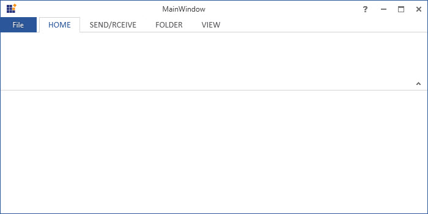
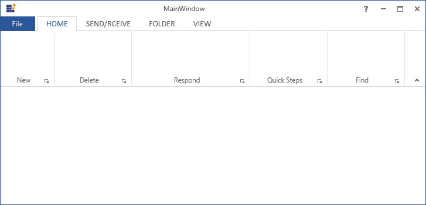
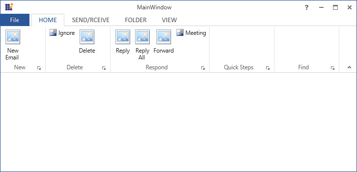
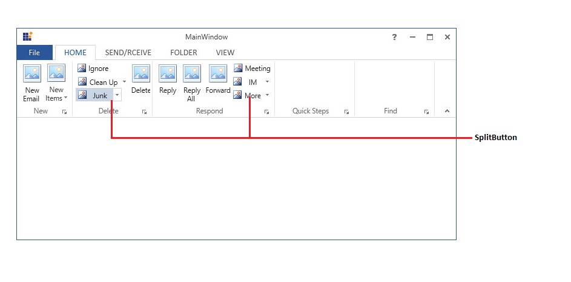
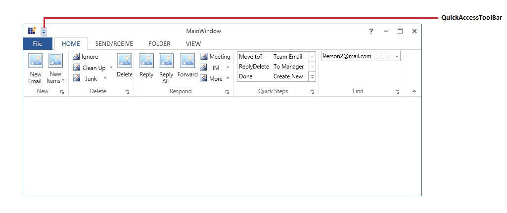

# Getting Started with WPF Ribbon

This section explains how to implement a similar UI as Microsoft Outlook using Ribbon. 

## Set simplified layout

The simplified layout is designed to display the most commonly used Ribbon commands in a single line interface, allowing more screen space for compact content viewing, while other commands are placed inside the overflow menu. To know more about the simplified layout, refer [here](https://help.syncfusion.com/wpf/ribbon/simplifiedlayout).

## Add ribbon

There are several ways to add Syncfusion control in to Visual Studio WPF project, the following steps will helps to add a Ribbon control through XAML Code.

* Create a WPF project in Visual Studio and refer the following assemblies.

  1. Syncfusion.Tools.Wpf
  2. Syncfusion.Shared.Wpf
  
* Include an XML namespace for the above assemblies to the Main window.





<Window
xmlns="http://schemas.microsoft.com/winfx/2006/xaml/presentation"
xmlns:x="http://schemas.microsoft.com/winfx/2006/xaml"
xmlns:syncfusion="http://schemas.syncfusion.com/wpf" x:Class="RibbonControl.MainWindow">       
</Window>





* Change the Window as `RibbonWindow`.





<syncfusion:RibbonWindow
xmlns="http://schemas.microsoft.com/winfx/2006/xaml/presentation"
xmlns:x="http://schemas.microsoft.com/winfx/2006/xaml"
xmlns:syncfusion="http://schemas.syncfusion.com/wpf" x:Class="RibbonControl.MainWindow">
</syncfusion:RibbonWindow>





* Add following namespace and inherit MainWindow from `RibbonWindow` in code behind.





using Syncfusion.Windows.Tools.Controls;
public partial class MainWindow : RibbonWindow





Imports Syncfusion.Windows.Tools.Controls
Public class As partial





* Now, Add the Ribbon control with a required optimal name, using the included namespace in XAML.





<syncfusion:RibbonWindow
xmlns="http://schemas.microsoft.com/winfx/2006/xaml/presentation"
xmlns:x="http://schemas.microsoft.com/winfx/2006/xaml"
xmlns:syncfusion="http://schemas.syncfusion.com/wpf"    x:Class="RibbonControl.MainWindow">
<Grid>
<syncfusion:Ribbon x:Name="_ribbon"/>
</Grid>
</syncfusion:RibbonWindow>





## Set icon for RibbonWindow

* Icon of the RibbonWindow can be set using the property named `Office2010Icon`. Please refer to the below code.





<syncfusion:RibbonWindow
    x:Class="WPFRibbon.MainWindow"
    xmlns="http://schemas.microsoft.com/winfx/2006/xaml/presentation"
    xmlns:x="http://schemas.microsoft.com/winfx/2006/xaml"
    xmlns:d="http://schemas.microsoft.com/expression/blend/2008"
    xmlns:local="clr-namespace:WPFRibbon"
    xmlns:mc="http://schemas.openxmlformats.org/markup-compatibility/2006"
    xmlns:sfSkinManager="clr-namespace:Syncfusion.SfSkinManager;assembly=Syncfusion.SfSkinManager.WPF"
    xmlns:syncfusion="http://schemas.syncfusion.com/wpf"
    Title="MainWindow"
    Office2010Icon="Assets/New Microsoft.png"
    sfSkinManager:SfSkinManager.VisualStyle="Office2016White"
    mc:Ignorable="d">
<Grid>
<syncfusion:Ribbon x:Name="_ribbon"/>
</Grid>
</syncfusion:RibbonWindow>





## Set visual styles

Ribbon supports various visual styles by using the `SfSkinManager`. To apply Visual Studio style on the current layout, refer to the following steps.

* Refer the following assemblies with the project

1. Syncfusion.SfSkinManager.Wpf
2. Syncfusion.Themes.Office2013White.Wpf

* Include an XML namespace for the SfSkinManager assembly to the MainWindow.





<syncfusion:RibbonWindow
xmlns="http://schemas.microsoft.com/winfx/2006/xaml/presentation"
xmlns:x="http://schemas.microsoft.com/winfx/2006/xaml"
xmlns:syncfusion="http://schemas.syncfusion.com/wpf" x:Class="RibbonControl.MainWindow"
xmlns:syncfusionskin="clr-namespace:Syncfusion.SfSkinManager;assembly=Syncfusion.SfSkinManager.WPF" >
<Grid>
<syncfusion:Ribbon x:Name="_ribbon"/>
</Grid>
</syncfusion:RibbonWindow>





* Now apply the value as `Office2013White` to the `VisualStyle` property of the SfSkinManager for the RibbonWindow.





<syncfusion:RibbonWindow
xmlns="http://schemas.microsoft.com/winfx/2006/xaml/presentation"
xmlns:x="http://schemas.microsoft.com/winfx/2006/xaml"
xmlns:syncfusion="http://schemas.syncfusion.com/wpf" x:Class="RibbonControl.MainWindow"
xmlns:syncfusionskin="clr-namespace:Syncfusion.SfSkinManager;assembly=Syncfusion.SfSkinManager.WPF"
syncfusionskin:SfSkinManager.VisualStyle="Office2013White" >
<Grid>
<syncfusion:Ribbon x:Name="_ribbon"/>
</Grid>
</syncfusion:RibbonWindow>





## Add RibbonTab

Ribbon control accept `RibbonTab` as children, Here four `RibbonTab` are added and that can hold `RibbonItems` with `RibbonBar`.





<syncfusion:RibbonWindow
xmlns="http://schemas.microsoft.com/winfx/2006/xaml/presentation"
xmlns:x="http://schemas.microsoft.com/winfx/2006/xaml"
xmlns:syncfusion="http://schemas.syncfusion.com/wpf" x:Class="RibbonControl.MainWindow"
xmlns:syncfusionskin="clr-namespace:Syncfusion.SfSkinManager;assembly=Syncfusion.SfSkinManager.WPF"
syncfusionskin:SfSkinManager.VisualStyle="Office2013White" >
<Grid>   
<syncfusion:Ribbon x:Name="_ribbon" VerticalAlignment="Top">
<syncfusion:RibbonTab Caption="HOME"  IsChecked="True"/>
<syncfusion:RibbonTab Caption="SEND/RCEIVE"  IsChecked="False"/>
<syncfusion:RibbonTab Caption="FOLDER"  IsChecked="False"/>
<syncfusion:RibbonTab Caption="VIEW"  IsChecked="False"/>
</syncfusion:Ribbon>
</Grid>
</syncfusion:RibbonWindow>





## Add RibbonBar

RibbonTab accepts `RibbonBar` as children, here five `RibbonBar` Controls are added inside "HOME" RibbonTab. To set header for RibbonBar, use its `Header` property.





<syncfusion:RibbonWindow
xmlns="http://schemas.microsoft.com/winfx/2006/xaml/presentation"
xmlns:x="http://schemas.microsoft.com/winfx/2006/xaml"
xmlns:syncfusion="http://schemas.syncfusion.com/wpf" x:Class="RibbonControl.MainWindow"
xmlns:syncfusionskin="clr-namespace:Syncfusion.SfSkinManager;assembly=Syncfusion.SfSkinManager.WPF"
syncfusionskin:SfSkinManager.VisualStyle="Office2013White" >
<Grid>   
<syncfusion:Ribbon x:Name="_ribbon" VerticalAlignment="Top">
<syncfusion:RibbonTab Caption="HOME"  IsChecked="True">
<syncfusion:RibbonBar Name="New" Width="90"  Header="New"/>
<syncfusion:RibbonBar Name="Delete" Width="150"  Header="Delete"/>
<syncfusion:RibbonBar Name="Respond" Width="90" Header="Respond"/>
<syncfusion:RibbonBar Name="Quicksteps" Width="90" Header="Quick Steps"/>
<syncfusion:RibbonBar Name="Find" Width="90" Header="Find"/>
</syncfusion:RibbonTab>
<syncfusion:RibbonTab Caption="SEND/RCEIVE"  IsChecked="False"/>
<syncfusion:RibbonTab Caption="FOLDER"  IsChecked="False"/>
<syncfusion:RibbonTab Caption="VIEW"  IsChecked="False"/>
</syncfusion:Ribbon>
</Grid>
</syncfusion:RibbonWindow>





## Add RibbonButton

`RibbonButton` provides functionalities like normal Button. It can place inside the RibbonBar. Here, "New" RibbonBar holds a `RibbonButton` with a caption as "New Email" using its `Label` property.It also provides `SizeForm` property for different sizes. 

If the value of `SizeForm` is large,then image of 16 * 16 size has been expanded to 32 * 32 automatically. Similarly,image of 32 * 32 has been compressed to     16 * 16 if `SizeForm` is ExtraSmall.    





<syncfusion:RibbonBar Name="New" Width="90"  Header="New">                    
<syncfusion:RibbonButton SizeForm="Large" Label="New Email"/>
</syncfusion:RibbonBar>





Also add several other Ribbon Button as per the requirement  





<syncfusion:RibbonWindow
xmlns="http://schemas.microsoft.com/winfx/2006/xaml/presentation"
xmlns:x="http://schemas.microsoft.com/winfx/2006/xaml"
xmlns:syncfusion="http://schemas.syncfusion.com/wpf" x:Class="RibbonControl.MainWindow"
xmlns:syncfusionskin="clr-namespace:Syncfusion.SfSkinManager;assembly=Syncfusion.SfSkinManager.WPF"
syncfusionskin:SfSkinManager.VisualStyle="Office2013White" >
<Grid>   
<syncfusion:Ribbon x:Name="_ribbon" VerticalAlignment="Top">
<syncfusion:RibbonTab Caption="HOME"  IsChecked="True">
<syncfusion:RibbonBar Name="New" Width="90"  Header="New">
<syncfusion:RibbonButton SizeForm="Large" Label="New Email"/>
</syncfusion:RibbonBar>
<syncfusion:RibbonBar Name="Delete" Width="130"  Header="Delete">
<syncfusion:RibbonButton Label="Ignore"/>
<syncfusion:RibbonButton Label="Delete" SizeForm="Large"/>
</syncfusion:RibbonBar>
<syncfusion:RibbonBar Name="Respond" Width="200" Header="Respond">
<syncfusion:RibbonButton Label="Reply" SizeForm="Large"/>
<syncfusion:RibbonButton Label="Reply All" SizeForm="Large"/>
<syncfusion:RibbonButton Label="Forward" SizeForm="Large"/>
<syncfusion:RibbonButton Label="Meeting"/>
</syncfusion:RibbonBar>
<syncfusion:RibbonBar Name="Quicksteps" Width="90" Header="Quick Steps"/>
<syncfusion:RibbonBar Name="Find" Width="90" Header="Find"/>
</syncfusion:RibbonTab>
<syncfusion:RibbonTab Caption="SEND/RCEIVE"  IsChecked="False"/>
<syncfusion:RibbonTab Caption="FOLDER"  IsChecked="False"/>
<syncfusion:RibbonTab Caption="VIEW"  IsChecked="False"/>
</syncfusion:Ribbon>
</Grid>
</syncfusion:RibbonWindow>





N> Image of any size has been used for `RibbonButton` and also it supports image of all formats.

## Add DropDownButton

`DropDownButton` appears like normal button that contains a drop arrow. It displays some items, while click on it. It accepts `DropDownMenuItem` as its children.  Here, "New" RibbonBar holds a `DropDownButton` with a caption as "New Items" using its `Label` property also holding items like "E-mail Message", "Appointment", "Meeting", "Contact" and "Task". It also provides `SizeForm` property for different sizes.





<syncfusion:RibbonWindow
xmlns="http://schemas.microsoft.com/winfx/2006/xaml/presentation"
xmlns:x="http://schemas.microsoft.com/winfx/2006/xaml"
xmlns:syncfusion="http://schemas.syncfusion.com/wpf" x:Class="RibbonControl.MainWindow"
xmlns:syncfusionskin="clr-namespace:Syncfusion.SfSkinManager;assembly=Syncfusion.SfSkinManager.WPF"
syncfusionskin:SfSkinManager.VisualStyle="Office2013White" >
<Grid>   
<syncfusion:Ribbon x:Name="_ribbon" VerticalAlignment="Top">
<syncfusion:RibbonTab Caption="HOME"  IsChecked="True">
<syncfusion:RibbonBar Name="New" Width="90"  Header="New">
<syncfusion:RibbonButton SizeForm="Large" Label="New Email"/>
<syncfusion:DropDownButton SizeForm="Large" Label="New Items">
<syncfusion:DropDownMenuItem Header="E-mail Message"/>
<syncfusion:DropDownMenuItem Header="Appointment"/>
<syncfusion:DropDownMenuItem Header="Meeting"/>
<syncfusion:DropDownMenuItem Header="Contact"/>
<syncfusion:DropDownMenuItem Header="Task"/>
</syncfusion:DropDownButton>
</syncfusion:RibbonBar>
<syncfusion:RibbonBar Name="Delete" Width="130"  Header="Delete">
<syncfusion:RibbonButton Label="Ignore"/>
<syncfusion:RibbonButton Label="Delete" SizeForm="Large"/>
</syncfusion:RibbonBar>
<syncfusion:RibbonBar Name="Respond" Width="200" Header="Respond">
<syncfusion:RibbonButton Label="Reply" SizeForm="Large"/>
<syncfusion:RibbonButton Label="Reply All" SizeForm="Large"/>
<syncfusion:RibbonButton Label="Forward" SizeForm="Large"/>
<syncfusion:RibbonButton Label="Meeting"/>
</syncfusion:RibbonBar>
<syncfusion:RibbonBar Name="Quicksteps" Width="90" Header="Quick Steps"/>
<syncfusion:RibbonBar Name="Find" Width="90" Header="Find"/>
</syncfusion:RibbonTab>
<syncfusion:RibbonTab Caption="SEND/RCEIVE"  IsChecked="False"/>
<syncfusion:RibbonTab Caption="FOLDER"  IsChecked="False"/>
<syncfusion:RibbonTab Caption="VIEW"  IsChecked="False"/>
</syncfusion:Ribbon>
</Grid>
</syncfusion:RibbonWindow>





## Add SplitButton

SplitButton also appears with a drop arrow. It displays some items while click on it. It accepts `DropDownMenuItem` as its children.  Here, "Delete" RibbonBar holds a `SplitButton` with a caption as "Clean Up" using its `Label` property also holding items like "Clean Up Folder", "Clean Up Conversation" and "Clean Up Folder/SubFolder". It also provides `SizeForm` property for different sizes.





<syncfusion:RibbonWindow
xmlns="http://schemas.microsoft.com/winfx/2006/xaml/presentation"
xmlns:x="http://schemas.microsoft.com/winfx/2006/xaml"
xmlns:syncfusion="http://schemas.syncfusion.com/wpf" x:Class="RibbonControl.MainWindow"
xmlns:syncfusionskin="clr-namespace:Syncfusion.SfSkinManager;assembly=Syncfusion.SfSkinManager.WPF"
syncfusionskin:SfSkinManager.VisualStyle="Office2013White" >
<Grid>
<syncfusion:Ribbon x:Name="_ribbon" VerticalAlignment="Top">
<syncfusion:RibbonTab Caption="HOME"  IsChecked="True">
<syncfusion:RibbonBar Name="New" Width="90"  Header="New">
<syncfusion:RibbonButton SizeForm="Large" Label="New Email"/>
<syncfusion:DropDownButton SizeForm="Large" Label="New Items">
<syncfusion:DropDownMenuItem Header="E-mail Message"/>
<syncfusion:DropDownMenuItem Header="Appointment"/>
<syncfusion:DropDownMenuItem Header="Meeting"/>
<syncfusion:DropDownMenuItem Header="Contact"/>
<syncfusion:DropDownMenuItem Header="Task"/>
</syncfusion:DropDownButton>
</syncfusion:RibbonBar>
<syncfusion:RibbonBar Name="Delete" Width="130"  Header="Delete">
<syncfusion:RibbonButton Label="Ignore"/>
<syncfusion:SplitButton Label="Clean Up">
<syncfusion:DropDownMenuItem Header="Clean Up Folder"/>
<syncfusion:DropDownMenuItem Header="Clean Up Conversation"/>
<syncfusion:DropDownMenuItem Header="Clean Up Folder/SubFolder"/>
</syncfusion:SplitButton>
<syncfusion:SplitButton Label="Junk" Margin="0,0,12,0" Width="76"/>
<syncfusion:RibbonButton Label="Delete" SizeForm="Large"/>
</syncfusion:RibbonBar>
<syncfusion:RibbonBar Name="Respond" Width="200" Header="Respond">
<syncfusion:RibbonButton Label="Reply" SizeForm="Large"/>
<syncfusion:RibbonButton Label="Reply All" SizeForm="Large"/>
<syncfusion:RibbonButton Label="Forward" SizeForm="Large"/>
<syncfusion:RibbonButton Label="Meeting"/>
<syncfusion:SplitButton Label="IM" Margin="-2,0,6,0" Width="68"/>
<syncfusion:SplitButton Label="More" Margin="-2,0,6,0" Width="68"/>
</syncfusion:RibbonBar>
<syncfusion:RibbonBar Name="Quicksteps" Width="90" Header="Quick Steps"/>
<syncfusion:RibbonBar Name="Find" Width="90" Header="Find"/>
</syncfusion:RibbonTab>
<syncfusion:RibbonTab Caption="SEND/RCEIVE"  IsChecked="False"/>
<syncfusion:RibbonTab Caption="FOLDER"  IsChecked="False"/>
<syncfusion:RibbonTab Caption="VIEW"  IsChecked="False"/>
</syncfusion:Ribbon>
</Grid>
</syncfusion:RibbonWindow>





## Add RibbonGallery

`RibbonGallery` displays items with good look and feel and it also used to classify the items as groups for easy navigation. Here, "QuickSteps" RibbonBar holds a `RibbonGallery` with `InRibbon` visual mode to place gallery items with in Ribbon. Also `ItemHeight`, `ItemWidth` properties are used to set height and width respectively.





<syncfusion:RibbonWindow
xmlns="http://schemas.microsoft.com/winfx/2006/xaml/presentation"
xmlns:x="http://schemas.microsoft.com/winfx/2006/xaml"
xmlns:syncfusion="http://schemas.syncfusion.com/wpf" x:Class="RibbonControl.MainWindow"
xmlns:syncfusionskin="clr-namespace:Syncfusion.SfSkinManager;assembly=Syncfusion.SfSkinManager.WPF"
syncfusionskin:SfSkinManager.VisualStyle="Office2013White" >
<Grid>   
<syncfusion:Ribbon x:Name="_ribbon" VerticalAlignment="Top">
<syncfusion:RibbonTab Caption="HOME"  IsChecked="True">
<syncfusion:RibbonBar Name="New" Width="90"  Header="New">
<syncfusion:RibbonButton SizeForm="Large" Label="New Email"/>
<syncfusion:DropDownButton SizeForm="Large" Label="New Items">
<syncfusion:DropDownMenuItem Header="E-mail Message"/>
<syncfusion:DropDownMenuItem Header="Appointment"/>
<syncfusion:DropDownMenuItem Header="Meeting"/>
<syncfusion:DropDownMenuItem Header="Contact"/>
<syncfusion:DropDownMenuItem Header="Task"/>
</syncfusion:DropDownButton>
</syncfusion:RibbonBar>
<syncfusion:RibbonBar Name="Delete" Width="130"  Header="Delete">
<syncfusion:RibbonButton Label="Ignore"/>
<syncfusion:SplitButton Label="Clean Up">
<syncfusion:DropDownMenuItem Header="Clean Up Folder"/>
<syncfusion:DropDownMenuItem Header="Clean Up Conversation"/>
<syncfusion:DropDownMenuItem Header="Clean Up Folder/SubFolder"/>
</syncfusion:SplitButton>
<syncfusion:SplitButton Label="Junk" Margin="0,0,12,0" Width="76"/>
<syncfusion:RibbonButton Label="Delete" SizeForm="Large"/>
</syncfusion:RibbonBar>
<syncfusion:RibbonBar Name="Respond" Width="200" Header="Respond">
<syncfusion:RibbonButton Label="Reply" SizeForm="Large"/>
<syncfusion:RibbonButton Label="Reply All" SizeForm="Large"/>
<syncfusion:RibbonButton Label="Forward" SizeForm="Large"/>
<syncfusion:RibbonButton Label="Meeting"/>
<syncfusion:SplitButton Label="IM" Margin="-2,0,6,0" Width="68"/>
<syncfusion:SplitButton Label="More" Margin="-2,0,6,0" Width="68"/>
</syncfusion:RibbonBar>
<syncfusion:RibbonBar Width="170" Name="QuickSteps" Header="Quick Steps">
<syncfusion:RibbonGallery Width="160"    VisualMode="InRibbon" ItemHeight="20" ItemWidth="70">
<syncfusion:RibbonGalleryItem  Content="Move to?"/>
<syncfusion:RibbonGalleryItem  Content="Team Email"/>
<syncfusion:RibbonGalleryItem  Content="ReplyDelete"/>
<syncfusion:RibbonGalleryItem  Content="To Manager"/>
<syncfusion:RibbonGalleryItem  Content="Done"/>
<syncfusion:RibbonGalleryItem  Content="Create New"/>
</syncfusion:RibbonGallery>
</syncfusion:RibbonBar>
<syncfusion:RibbonBar Name="Find" Width="90" Header="Find"/>
</syncfusion:RibbonTab>
<syncfusion:RibbonTab Caption="SEND/RCEIVE"  IsChecked="False"/>
<syncfusion:RibbonTab Caption="FOLDER"  IsChecked="False"/>
<syncfusion:RibbonTab Caption="VIEW"  IsChecked="False"/>
</syncfusion:Ribbon>
</Grid>
</syncfusion:RibbonWindow>





## Add RibbonComboBox

`RibbonComboBox` is used to display the list of items.It accepts `ComboBoxItems` as its children.  Here, "Find" RibbonBar holds a `RibbonComboBox` with a caption as "Filter Email" using its `Label` property also holding items like "Person1@mail.com", "Person1@mail.com" and "Person1@mail.com".





<syncfusion:RibbonWindow
xmlns="http://schemas.microsoft.com/winfx/2006/xaml/presentation"
xmlns:x="http://schemas.microsoft.com/winfx/2006/xaml"
xmlns:syncfusion="http://schemas.syncfusion.com/wpf" x:Class="RibbonControl.MainWindow"
xmlns:syncfusionskin="clr-namespace:Syncfusion.SfSkinManager;assembly=Syncfusion.SfSkinManager.WPF"
syncfusionskin:SfSkinManager.VisualStyle="Office2013White" >
<Grid>   
<syncfusion:Ribbon x:Name="_ribbon" VerticalAlignment="Top">
<syncfusion:RibbonTab Caption="HOME"  IsChecked="True">
<syncfusion:RibbonBar Name="New" Width="90"  Header="New">
<syncfusion:RibbonButton SizeForm="Large" Label="New Email"/>
<syncfusion:DropDownButton SizeForm="Large" Label="New Items">
<syncfusion:DropDownMenuItem Header="E-mail Message"/>
<syncfusion:DropDownMenuItem Header="Appointment"/>
<syncfusion:DropDownMenuItem Header="Meeting"/>
<syncfusion:DropDownMenuItem Header="Contact"/>
<syncfusion:DropDownMenuItem Header="Task"/>
</syncfusion:DropDownButton>
</syncfusion:RibbonBar>
<syncfusion:RibbonBar Name="Delete" Width="130"  Header="Delete">
<syncfusion:RibbonButton Label="Ignore"/>
<syncfusion:SplitButton Label="Clean Up">
<syncfusion:DropDownMenuItem Header="Clean Up Folder"/>
<syncfusion:DropDownMenuItem Header="Clean Up Conversation"/>
<syncfusion:DropDownMenuItem Header="Clean Up Folder/SubFolder"/>
</syncfusion:SplitButton>
<syncfusion:SplitButton Label="Junk" Margin="0,0,12,0" Width="76"/>
<syncfusion:RibbonButton Label="Delete" SizeForm="Large"/>
</syncfusion:RibbonBar>
<syncfusion:RibbonBar Name="Respond" Width="200" Header="Respond">
<syncfusion:RibbonButton Label="Reply" SizeForm="Large"/>
<syncfusion:RibbonButton Label="Reply All" SizeForm="Large"/>
<syncfusion:RibbonButton Label="Forward" SizeForm="Large"/>
<syncfusion:RibbonButton Label="Meeting"/>
<syncfusion:SplitButton Label="IM" Margin="-2,0,6,0" Width="68"/>
<syncfusion:SplitButton Label="More" Margin="-2,0,6,0" Width="68"/>
</syncfusion:RibbonBar>
<syncfusion:RibbonBar Width="170" Name="QuickSteps" Header="Quick Steps">
<syncfusion:RibbonGallery Width="160"    VisualMode="InRibbon" ItemHeight="20" ItemWidth="70">
<syncfusion:RibbonGalleryItem  Content="Move to?"/>
<syncfusion:RibbonGalleryItem  Content="Team Email"/>
<syncfusion:RibbonGalleryItem  Content="ReplyDelete"/>
<syncfusion:RibbonGalleryItem  Content="To Manager"/>
<syncfusion:RibbonGalleryItem  Content="Done"/>
<syncfusion:RibbonGalleryItem  Content="Create New"/>
</syncfusion:RibbonGallery>
</syncfusion:RibbonBar>
<syncfusion:RibbonBar Width="170" Header="Find" Name="Find"  >
<syncfusion:RibbonComboBox Label="Filter Email" Width="160">
<ComboBoxItem>Person1@mail.com</ComboBoxItem>
<ComboBoxItem>Person2@mail.com</ComboBoxItem>
<ComboBoxItem>Person3@mail.com</ComboBoxItem>
</syncfusion:RibbonComboBox>
</syncfusion:RibbonBar>
</syncfusion:RibbonTab>
<syncfusion:RibbonTab Caption="SEND/RCEIVE"  IsChecked="False"/>
<syncfusion:RibbonTab Caption="FOLDER"  IsChecked="False"/>
<syncfusion:RibbonTab Caption="VIEW"  IsChecked="False"/>
</syncfusion:Ribbon>
</Grid>
</syncfusion:RibbonWindow>





## Add QAT

QuickAccessToolbar (QAT) is used to group the frequently used commands and access the commands easily without having to search for the command in the menu bar. Also it can be placed above or below the ribbon.





<syncfusion:RibbonWindow
xmlns="http://schemas.microsoft.com/winfx/2006/xaml/presentation"
xmlns:x="http://schemas.microsoft.com/winfx/2006/xaml"
xmlns:syncfusion="http://schemas.syncfusion.com/wpf" x:Class="RibbonControl.MainWindow"
xmlns:syncfusionskin="clr-namespace:Syncfusion.SfSkinManager;assembly=Syncfusion.SfSkinManager.WPF"
syncfusionskin:SfSkinManager.VisualStyle="Office2013White" >
<Grid>
<syncfusion:Ribbon x:Name="_ribbon" VerticalAlignment="Top">
<syncfusion:RibbonTab Caption="HOME"  IsChecked="True">
<syncfusion:RibbonBar Name="New" Width="90"  Header="New">
<syncfusion:RibbonButton SizeForm="Large" Label="New Email"/>
<syncfusion:DropDownButton SizeForm="Large" Label="New Items">
<syncfusion:DropDownMenuItem Header="E-mail Message"/>
<syncfusion:DropDownMenuItem Header="Appointment"/>
<syncfusion:DropDownMenuItem Header="Meeting"/>
<syncfusion:DropDownMenuItem Header="Contact"/>
<syncfusion:DropDownMenuItem Header="Task"/>
</syncfusion:DropDownButton>
</syncfusion:RibbonBar>
<syncfusion:RibbonBar Name="Delete" Width="130"  Header="Delete">
<syncfusion:RibbonButton Label="Ignore"/>
<syncfusion:SplitButton Label="Clean Up">
<syncfusion:DropDownMenuItem Header="Clean Up Folder"/>
<syncfusion:DropDownMenuItem Header="Clean Up Conversation"/>
<syncfusion:DropDownMenuItem Header="Clean Up Folder/SubFolder"/>
</syncfusion:SplitButton>
<syncfusion:SplitButton Label="Junk" Margin="0,0,12,0" Width="76"/>
<syncfusion:RibbonButton Label="Delete" SizeForm="Large"/>
</syncfusion:RibbonBar>
<syncfusion:RibbonBar Name="Respond" Width="200" Header="Respond">
<syncfusion:RibbonButton Label="Reply" SizeForm="Large"/>
<syncfusion:RibbonButton Label="Reply All" SizeForm="Large"/>
<syncfusion:RibbonButton Label="Forward" SizeForm="Large"/>
<syncfusion:RibbonButton Label="Meeting"/>
<syncfusion:SplitButton Label="IM" Margin="-2,0,6,0" Width="68"/>
<syncfusion:SplitButton Label="More" Margin="-2,0,6,0" Width="68"/>
</syncfusion:RibbonBar>
<syncfusion:RibbonBar Width="170" Name="QuickSteps" Header="Quick Steps">
<syncfusion:RibbonGallery Width="160"    VisualMode="InRibbon" ItemHeight="20" ItemWidth="70">
<syncfusion:RibbonGalleryItem  Content="Move to?"/>
<syncfusion:RibbonGalleryItem  Content="Team Email"/>
<syncfusion:RibbonGalleryItem  Content="ReplyDelete"/>
<syncfusion:RibbonGalleryItem  Content="To Manager"/>
<syncfusion:RibbonGalleryItem  Content="Done"/>
<syncfusion:RibbonGalleryItem  Content="Create New"/>
</syncfusion:RibbonGallery>
</syncfusion:RibbonBar>
<syncfusion:RibbonBar Width="170" Header="Find" Name="Find"  >
<syncfusion:RibbonComboBox Label="Filter Email" Width="160">
<ComboBoxItem>Person1@mail.com</ComboBoxItem>
<ComboBoxItem>Person2@mail.com</ComboBoxItem>
<ComboBoxItem>Person3@mail.com</ComboBoxItem>
</syncfusion:RibbonComboBox>
</syncfusion:RibbonBar>
</syncfusion:RibbonTab>
<syncfusion:RibbonTab Caption="SEND/RCEIVE"  IsChecked="False"/>
<syncfusion:RibbonTab Caption="FOLDER"  IsChecked="False"/>
<syncfusion:RibbonTab Caption="VIEW"  IsChecked="False"/>
<syncfusion:Ribbon.QuickAccessToolBar>
<syncfusion:QuickAccessToolBar/>
</syncfusion:Ribbon.QuickAccessToolBar>
</syncfusion:Ribbon>
</Grid>
</syncfusion:RibbonWindow>





### Add items to Quick Access toolbar	

`QATMenuItems` property of QuickAccessToolbar used to add items to Dropdown menu of QAT. 





<syncfusion:RibbonWindow
xmlns="http://schemas.microsoft.com/winfx/2006/xaml/presentation"
xmlns:x="http://schemas.microsoft.com/winfx/2006/xaml"
xmlns:syncfusion="http://schemas.syncfusion.com/wpf" x:Class="RibbonControl.MainWindow"
xmlns:syncfusionskin="clr-namespace:Syncfusion.SfSkinManager;assembly=Syncfusion.SfSkinManager.WPF"
syncfusionskin:SfSkinManager.VisualStyle="Office2013White" >
<Grid>
<syncfusion:Ribbon x:Name="_ribbon" VerticalAlignment="Top">
<syncfusion:RibbonTab Caption="HOME"  IsChecked="True">
<syncfusion:RibbonBar Name="New" Width="90"  Header="New">
<syncfusion:RibbonButton SizeForm="Large" Label="New Email"/>
<syncfusion:DropDownButton SizeForm="Large" Label="New Items">
<syncfusion:DropDownMenuItem Header="E-mail Message"/>
<syncfusion:DropDownMenuItem Header="Appointment"/>
<syncfusion:DropDownMenuItem Header="Meeting"/>
<syncfusion:DropDownMenuItem Header="Contact"/>
<syncfusion:DropDownMenuItem Header="Task"/>
</syncfusion:DropDownButton>
</syncfusion:RibbonBar>
<syncfusion:RibbonBar Name="Delete" Width="130"  Header="Delete">
<syncfusion:RibbonButton Label="Ignore"/>
<syncfusion:SplitButton Label="Clean Up">
<syncfusion:DropDownMenuItem Header="Clean Up Folder"/>
<syncfusion:DropDownMenuItem Header="Clean Up Conversation"/>
<syncfusion:DropDownMenuItem Header="Clean Up Folder/SubFolder"/>
</syncfusion:SplitButton>
<syncfusion:SplitButton Label="Junk" Margin="0,0,12,0" Width="76"/>
<syncfusion:RibbonButton Label="Delete" SizeForm="Large"/>
</syncfusion:RibbonBar>
<syncfusion:RibbonBar Name="Respond" Width="200" Header="Respond">
<syncfusion:RibbonButton Label="Reply" SizeForm="Large"/>
<syncfusion:RibbonButton Label="Reply All" SizeForm="Large"/>
<syncfusion:RibbonButton Label="Forward" SizeForm="Large"/>
<syncfusion:RibbonButton Label="Meeting"/>
<syncfusion:SplitButton Label="IM" Margin="-2,0,6,0" Width="68"/>
<syncfusion:SplitButton Label="More" Margin="-2,0,6,0" Width="68"/>
</syncfusion:RibbonBar>
<syncfusion:RibbonBar Width="170" Name="QuickSteps" Header="Quick Steps">
<syncfusion:RibbonGallery Width="160"    VisualMode="InRibbon" ItemHeight="20" ItemWidth="70">
<syncfusion:RibbonGalleryItem  Content="Move to?"/>
<syncfusion:RibbonGalleryItem  Content="Team Email"/>
<syncfusion:RibbonGalleryItem  Content="ReplyDelete"/>
<syncfusion:RibbonGalleryItem  Content="To Manager"/>
<syncfusion:RibbonGalleryItem  Content="Done"/>
<syncfusion:RibbonGalleryItem  Content="Create New"/>
</syncfusion:RibbonGallery>
</syncfusion:RibbonBar>
<syncfusion:RibbonBar Width="170" Header="Find" Name="Find"  >
<syncfusion:RibbonComboBox Label="Filter Email" Width="160">
<ComboBoxItem>Person1@mail.com</ComboBoxItem>
<ComboBoxItem>Person2@mail.com</ComboBoxItem>
<ComboBoxItem>Person3@mail.com</ComboBoxItem>
</syncfusion:RibbonComboBox>
</syncfusion:RibbonBar>
</syncfusion:RibbonTab>
<syncfusion:RibbonTab Caption="SEND/RCEIVE"  IsChecked="False"/>
<syncfusion:RibbonTab Caption="FOLDER"  IsChecked="False"/>
<syncfusion:RibbonTab Caption="VIEW"  IsChecked="False"/>
<syncfusion:Ribbon.QuickAccessToolBar>
<syncfusion:QuickAccessToolBar>
<syncfusion:RibbonButton SizeForm="ExtraSmall"/>
<syncfusion:RibbonButton SizeForm="ExtraSmall"/>
<syncfusion:QuickAccessToolBar.QATMenuItems>
<syncfusion:RibbonButton Label="Send" />
<syncfusion:RibbonButton Label="Forward" />
<syncfusion:RibbonButton Label="ReplyAll" />
<syncfusion:RibbonButton Label="Delete" />
<syncfusion:RibbonButton Label="Print" />
</syncfusion:QuickAccessToolBar.QATMenuItems>
</syncfusion:QuickAccessToolBar>
</syncfusion:Ribbon.QuickAccessToolBar>
</syncfusion:Ribbon>
</Grid>
</syncfusion:RibbonWindow>





## Add BackStage

BackStage can be added by using `BackStage` property of Ribbon. To show the BackStage by, click the `FILE` Menu in Ribbon like in Microsoft Outlook. 





<syncfusion:RibbonWindow
xmlns="http://schemas.microsoft.com/winfx/2006/xaml/presentation"
xmlns:x="http://schemas.microsoft.com/winfx/2006/xaml"
xmlns:syncfusion="http://schemas.syncfusion.com/wpf" x:Class="RibbonControl.MainWindow"
xmlns:syncfusionskin="clr-namespace:Syncfusion.SfSkinManager;assembly=Syncfusion.SfSkinManager.WPF"
syncfusionskin:SfSkinManager.VisualStyle="Office2013White" >
<Grid>
<syncfusion:Ribbon x:Name="_ribbon" VerticalAlignment="Top">
<syncfusion:RibbonTab Caption="HOME"  IsChecked="True">
<syncfusion:RibbonBar Name="New" Width="90"  Header="New">
<syncfusion:RibbonButton SizeForm="Large" Label="New Email"/>
<syncfusion:DropDownButton SizeForm="Large" Label="New Items">
<syncfusion:DropDownMenuItem Header="E-mail Message"/>
<syncfusion:DropDownMenuItem Header="Appointment"/>
<syncfusion:DropDownMenuItem Header="Meeting"/>
<syncfusion:DropDownMenuItem Header="Contact"/>
<syncfusion:DropDownMenuItem Header="Task"/>
</syncfusion:DropDownButton>
</syncfusion:RibbonBar>
<syncfusion:RibbonBar Name="Delete" Width="130"  Header="Delete">
<syncfusion:RibbonButton Label="Ignore"/>
<syncfusion:SplitButton Label="Clean Up">
<syncfusion:DropDownMenuItem Header="Clean Up Folder"/>
<syncfusion:DropDownMenuItem Header="Clean Up Conversation"/>
<syncfusion:DropDownMenuItem Header="Clean Up Folder/SubFolder"/>
</syncfusion:SplitButton>
<syncfusion:SplitButton Label="Junk" Margin="0,0,12,0" Width="76"/>
<syncfusion:RibbonButton Label="Delete" SizeForm="Large"/>
</syncfusion:RibbonBar>
<syncfusion:RibbonBar Name="Respond" Width="200" Header="Respond">
<syncfusion:RibbonButton Label="Reply" SizeForm="Large"/>
<syncfusion:RibbonButton Label="Reply All" SizeForm="Large"/>
<syncfusion:RibbonButton Label="Forward" SizeForm="Large"/>
<syncfusion:RibbonButton Label="Meeting"/>
<syncfusion:SplitButton Label="IM" Margin="-2,0,6,0" Width="68"/>
<syncfusion:SplitButton Label="More" Margin="-2,0,6,0" Width="68"/>
</syncfusion:RibbonBar>
<syncfusion:RibbonBar Width="170" Name="QuickSteps" Header="Quick Steps">
<syncfusion:RibbonGallery Width="160"    VisualMode="InRibbon" ItemHeight="20" ItemWidth="70">
<syncfusion:RibbonGalleryItem  Content="Move to?"/>
<syncfusion:RibbonGalleryItem  Content="Team Email"/>
<syncfusion:RibbonGalleryItem  Content="ReplyDelete"/>
<syncfusion:RibbonGalleryItem  Content="To Manager"/>
<syncfusion:RibbonGalleryItem  Content="Done"/>
<syncfusion:RibbonGalleryItem  Content="Create New"/>
</syncfusion:RibbonGallery>
</syncfusion:RibbonBar>
<syncfusion:RibbonBar Width="170" Header="Find" Name="Find"  >
<syncfusion:RibbonComboBox Label="Filter Email" Width="160">
<ComboBoxItem>Person1@mail.com</ComboBoxItem>
<ComboBoxItem>Person2@mail.com</ComboBoxItem>
<ComboBoxItem>Person3@mail.com</ComboBoxItem>
</syncfusion:RibbonComboBox>
</syncfusion:RibbonBar>
</syncfusion:RibbonTab>
<syncfusion:RibbonTab Caption="SEND/RCEIVE"  IsChecked="False"/>
<syncfusion:RibbonTab Caption="FOLDER"  IsChecked="False"/>
<syncfusion:RibbonTab Caption="VIEW"  IsChecked="False"/>
<syncfusion:Ribbon.QuickAccessToolBar>
<syncfusion:QuickAccessToolBar>
<syncfusion:RibbonButton SizeForm="ExtraSmall"/>
<syncfusion:RibbonButton SizeForm="ExtraSmall" />          
<syncfusion:QuickAccessToolBar.QATMenuItems>
<syncfusion:RibbonButton Label="Send" />
<syncfusion:RibbonButton Label="Forward" />
<syncfusion:RibbonButton Label="ReplyAll" />
<syncfusion:RibbonButton Label="Delete" />
<syncfusion:RibbonButton Label="Print" />
</syncfusion:QuickAccessToolBar.QATMenuItems>
</syncfusion:QuickAccessToolBar>
</syncfusion:Ribbon.QuickAccessToolBar>
<syncfusion:Ribbon.BackStage>
<syncfusion:Backstage/>
</syncfusion:Ribbon.BackStage>
</syncfusion:Ribbon>
</Grid>
</syncfusion:RibbonWindow>





### Customize the BackStage Visibility 

The [`IsBackStageVisible`](https://help.syncfusion.com/cr/wpf/Syncfusion.Tools.Wpf~Syncfusion.Windows.Tools.Controls.Ribbon~IsBackStageVisible.html) property of Ribbon enables you to show/hide the BackStage. The following code example illustrates how to show or hide BackStage.

1. Through Property 





<syncfusion:Ribbon x:Name="_ribbon" VerticalAlignment="Top" IsBackStageVisible ="True"/>





_ribbon.IsBackStageVisible = true;





2. Through Methods





private void ShowBackstage_Click(object sender, RoutedEventArgs e)
{
    //to show back stage

    _ribbon.ShowBackStage();
}

private void HideBackstage_Click(object sender, RoutedEventArgs e)
{
    //to hide the back stage

    _ribbon.HideBackStage();
}





Private Sub ShowBackstage_Click(ByVal sender As Object, ByVal e As RoutedEventArgs)
	'to show back stage

	_ribbon.ShowBackStage()
End Sub

Private Sub HideBackstage_Click(ByVal sender As Object, ByVal e As RoutedEventArgs)
	'to hide the back stage

	_ribbon.HideBackStage()
End Sub





3. Through Commands

Ribbon control provides the static command [`OpenBackStage`](https://help.syncfusion.com/cr/wpf/Syncfusion.Tools.Wpf~Syncfusion.Windows.Tools.Controls.RibbonCommands~OpenBackStage.html) to show/hide the BackStage based on the parameter passed to it.




<syncfusion:RibbonButton x:Name="ribbonButton" Label="Open Backstage" Command="{x:Static syncfusion:RibbonCommands.OpenBackStage}" CommandTarget="{Binding ElementName=ribbon}">
                        <syncfusion:RibbonButton.CommandParameter>
                            <!--If we passes false it will hide the backstage otherwise it will show the backstage-->
                            <sys:Boolean>true</sys:Boolean>
                        </syncfusion:RibbonButton.CommandParameter>
                    </syncfusion:RibbonButton>




N> In order to bind the [`OpenBackStage`](https://help.syncfusion.com/cr/wpf/Syncfusion.Tools.Wpf~Syncfusion.Windows.Tools.Controls.RibbonCommands~OpenBackStage.html) command, CommandTarget and CommandParameter must be defined.

## Add BackStageCommandButton

`BackStageCommandButton` added to BackStage as BackStage Element. Here four BackStageCommandButtons are added with `Header` property value as "Save", "SaveAttachments", "Options" and "Exit". 





<syncfusion:RibbonWindow
xmlns="http://schemas.microsoft.com/winfx/2006/xaml/presentation"
xmlns:x="http://schemas.microsoft.com/winfx/2006/xaml"
xmlns:syncfusion="http://schemas.syncfusion.com/wpf" x:Class="RibbonControl.MainWindow"
xmlns:syncfusionskin="clr-namespace:Syncfusion.SfSkinManager;assembly=Syncfusion.SfSkinManager.WPF"
syncfusionskin:SfSkinManager.VisualStyle="Office2013White" >
<Grid>
<syncfusion:Ribbon x:Name="_ribbon" VerticalAlignment="Top">
<syncfusion:RibbonTab Caption="HOME"  IsChecked="True">
<syncfusion:RibbonBar Name="New" Width="90"  Header="New">
<syncfusion:RibbonButton SizeForm="Large" Label="New Email"/>
<syncfusion:DropDownButton SizeForm="Large" Label="New Items">
<syncfusion:DropDownMenuItem Header="E-mail Message"/>
<syncfusion:DropDownMenuItem Header="Appointment"/>
<syncfusion:DropDownMenuItem Header="Meeting"/>
<syncfusion:DropDownMenuItem Header="Contact"/>
<syncfusion:DropDownMenuItem Header="Task"/>
</syncfusion:DropDownButton>
</syncfusion:RibbonBar>
<syncfusion:RibbonBar Name="Delete" Width="130"  Header="Delete">
<syncfusion:RibbonButton Label="Ignore"/>
<syncfusion:SplitButton Label="Clean Up">
<syncfusion:DropDownMenuItem Header="Clean Up Folder"/>
<syncfusion:DropDownMenuItem Header="Clean Up Conversation"/>
<syncfusion:DropDownMenuItem Header="Clean Up Folder/SubFolder"/>
</syncfusion:SplitButton>
<syncfusion:SplitButton Label="Junk" Margin="0,0,12,0" Width="76"/>
<syncfusion:RibbonButton Label="Delete" SizeForm="Large"/>
</syncfusion:RibbonBar>
<syncfusion:RibbonBar Name="Respond" Width="200" Header="Respond">
<syncfusion:RibbonButton Label="Reply" SizeForm="Large"/>
<syncfusion:RibbonButton Label="Reply All" SizeForm="Large"/>
<syncfusion:RibbonButton Label="Forward" SizeForm="Large"/>
<syncfusion:RibbonButton Label="Meeting"/>
<syncfusion:SplitButton Label="IM" Margin="-2,0,6,0" Width="68"/>
<syncfusion:SplitButton Label="More" Margin="-2,0,6,0" Width="68"/>
</syncfusion:RibbonBar>
<syncfusion:RibbonBar Width="170" Name="QuickSteps" Header="Quick Steps">
<syncfusion:RibbonGallery Width="160"    VisualMode="InRibbon" ItemHeight="20" ItemWidth="70">
<syncfusion:RibbonGalleryItem  Content="Move to?"/>
<syncfusion:RibbonGalleryItem  Content="Team Email"/>
<syncfusion:RibbonGalleryItem  Content="ReplyDelete"/>
<syncfusion:RibbonGalleryItem  Content="To Manager"/>
<syncfusion:RibbonGalleryItem  Content="Done"/>
<syncfusion:RibbonGalleryItem  Content="Create New"/>
</syncfusion:RibbonGallery>
</syncfusion:RibbonBar>
<syncfusion:RibbonBar Width="170" Header="Find" Name="Find"  >
<syncfusion:RibbonComboBox Label="Filter Email" Width="160">
<ComboBoxItem>Person1@mail.com</ComboBoxItem>
<ComboBoxItem>Person2@mail.com</ComboBoxItem>
<ComboBoxItem>Person3@mail.com</ComboBoxItem>
</syncfusion:RibbonComboBox>
</syncfusion:RibbonBar>
</syncfusion:RibbonTab>
<syncfusion:RibbonTab Caption="SEND/RCEIVE"  IsChecked="False"/>
<syncfusion:RibbonTab Caption="FOLDER"  IsChecked="False"/>
<syncfusion:RibbonTab Caption="VIEW"  IsChecked="False"/>
<syncfusion:Ribbon.QuickAccessToolBar>
<syncfusion:QuickAccessToolBar>
<syncfusion:RibbonButton SizeForm="ExtraSmall"/>
<syncfusion:RibbonButton SizeForm="ExtraSmall" />
<syncfusion:QuickAccessToolBar.QATMenuItems>
<syncfusion:RibbonButton Label="Send" />
<syncfusion:RibbonButton Label="Forward" />
<syncfusion:RibbonButton Label="ReplyAll" />
<syncfusion:RibbonButton Label="Delete" />
<syncfusion:RibbonButton Label="Print" />
</syncfusion:QuickAccessToolBar.QATMenuItems>
</syncfusion:QuickAccessToolBar>
</syncfusion:Ribbon.QuickAccessToolBar>
<syncfusion:Ribbon.BackStage>
<syncfusion:Backstage>
<syncfusion:BackStageCommandButton Header="Save" />
<syncfusion:BackStageCommandButton Header="SaveAttachments" />
<syncfusion:BackStageCommandButton Header="Options" />
<syncfusion:BackStageCommandButton Header="Exit" />
</syncfusion:Backstage>
</syncfusion:Ribbon.BackStage>
</syncfusion:Ribbon>
</Grid>
</syncfusion:RibbonWindow>





## Add BackStageTabItem

`BackStageTabItem` can also be added inside the BackStage Element.Here four BackStageCommandButtons are added with `Header` property value as "Open", "Print" and "Office Account". 





<syncfusion:RibbonWindow
xmlns="http://schemas.microsoft.com/winfx/2006/xaml/presentation"
xmlns:x="http://schemas.microsoft.com/winfx/2006/xaml"
xmlns:syncfusion="http://schemas.syncfusion.com/wpf" x:Class="RibbonControl.MainWindow"
xmlns:syncfusionskin="clr-namespace:Syncfusion.SfSkinManager;assembly=Syncfusion.SfSkinManager.WPF"
syncfusionskin:SfSkinManager.VisualStyle="Office2013White" >
<Grid>
<syncfusion:Ribbon x:Name="_ribbon" VerticalAlignment="Top">
<syncfusion:RibbonTab Caption="HOME"  IsChecked="True">
<syncfusion:RibbonBar Name="New" Width="90"  Header="New">
<syncfusion:RibbonButton SizeForm="Large" Label="New Email"/>
<syncfusion:DropDownButton SizeForm="Large" Label="New Items">
<syncfusion:DropDownMenuItem Header="E-mail Message"/>
<syncfusion:DropDownMenuItem Header="Appointment"/>
<syncfusion:DropDownMenuItem Header="Meeting"/>
<syncfusion:DropDownMenuItem Header="Contact"/>
<syncfusion:DropDownMenuItem Header="Task"/>
</syncfusion:DropDownButton>
</syncfusion:RibbonBar>
<syncfusion:RibbonBar Name="Delete" Width="130"  Header="Delete">
<syncfusion:RibbonButton Label="Ignore"/>
<syncfusion:SplitButton Label="Clean Up">
<syncfusion:DropDownMenuItem Header="Clean Up Folder"/>
<syncfusion:DropDownMenuItem Header="Clean Up Conversation"/>
<syncfusion:DropDownMenuItem Header="Clean Up Folder/SubFolder"/>
</syncfusion:SplitButton>
<syncfusion:SplitButton Label="Junk" Margin="0,0,12,0" Width="76"/>
<syncfusion:RibbonButton Label="Delete" SizeForm="Large"/>
</syncfusion:RibbonBar>
<syncfusion:RibbonBar Name="Respond" Width="200" Header="Respond">
<syncfusion:RibbonButton Label="Reply" SizeForm="Large"/>
<syncfusion:RibbonButton Label="Reply All" SizeForm="Large"/>
<syncfusion:RibbonButton Label="Forward" SizeForm="Large"/>
<syncfusion:RibbonButton Label="Meeting"/>
<syncfusion:SplitButton Label="IM" Margin="-2,0,6,0" Width="68"/>
<syncfusion:SplitButton Label="More" Margin="-2,0,6,0" Width="68"/>
</syncfusion:RibbonBar>
<syncfusion:RibbonBar Width="170" Name="QuickSteps" Header="Quick Steps">
<syncfusion:RibbonGallery Width="160"    VisualMode="InRibbon" ItemHeight="20" ItemWidth="70">
<syncfusion:RibbonGalleryItem  Content="Move to?"/>
<syncfusion:RibbonGalleryItem  Content="Team Email"/>
<syncfusion:RibbonGalleryItem  Content="ReplyDelete"/>
<syncfusion:RibbonGalleryItem  Content="To Manager"/>
<syncfusion:RibbonGalleryItem  Content="Done"/>
<syncfusion:RibbonGalleryItem  Content="Create New"/>
</syncfusion:RibbonGallery>
</syncfusion:RibbonBar>
<syncfusion:RibbonBar Width="170" Header="Find" Name="Find"  >
<syncfusion:RibbonComboBox Label="Filter Email" Width="160">
<ComboBoxItem>Person1@mail.com</ComboBoxItem>
<ComboBoxItem>Person2@mail.com</ComboBoxItem>
<ComboBoxItem>Person3@mail.com</ComboBoxItem>
</syncfusion:RibbonComboBox>
</syncfusion:RibbonBar>
</syncfusion:RibbonTab>
<syncfusion:RibbonTab Caption="SEND/RCEIVE"  IsChecked="False"/>
<syncfusion:RibbonTab Caption="FOLDER"  IsChecked="False"/>
<syncfusion:RibbonTab Caption="VIEW"  IsChecked="False"/>
<syncfusion:Ribbon.QuickAccessToolBar>
<syncfusion:QuickAccessToolBar>
<syncfusion:RibbonButton SizeForm="ExtraSmall"/>
<syncfusion:RibbonButton SizeForm="ExtraSmall" />
<syncfusion:QuickAccessToolBar.QATMenuItems>
<syncfusion:RibbonButton Label="Send" />
<syncfusion:RibbonButton Label="Forward" />
<syncfusion:RibbonButton Label="ReplyAll" />
<syncfusion:RibbonButton Label="Delete" />
<syncfusion:RibbonButton Label="Print" />
</syncfusion:QuickAccessToolBar.QATMenuItems>
</syncfusion:QuickAccessToolBar>
</syncfusion:Ribbon.QuickAccessToolBar>
<syncfusion:Ribbon.BackStage>
<syncfusion:Backstage>
<syncfusion:BackstageTabItem  Header="Info">
<StackPanel>
<TextBlock FontSize="20" Text="Account Information"/>
<TextBlock FontSize="12" Text="Employ1@syncfusion.com"/>
</StackPanel>
</syncfusion:BackstageTabItem>
<syncfusion:BackstageTabItem  Header="Open"/>
<syncfusion:BackStageCommandButton Header="Save" />
<syncfusion:BackStageCommandButton Header="SaveAttachments" />
<syncfusion:BackstageTabItem  Header="print"/>
<syncfusion:BackstageTabItem  Header="OfficeAccount"/>
<syncfusion:BackStageCommandButton Header="Options" />
<syncfusion:BackStageCommandButton Header="Exit" />
</syncfusion:Backstage>
</syncfusion:Ribbon.BackStage>
</syncfusion:Ribbon>
</Grid>
</syncfusion:RibbonWindow>





## Add BackStage separator			

BackStageSeparator used to group out similar backstage elements in BackStage. Here BackStageCommandButtons, BackStageTabItems are separated by `BackStageSeparator` according to their use.





<syncfusion:RibbonWindow
xmlns="http://schemas.microsoft.com/winfx/2006/xaml/presentation"
xmlns:x="http://schemas.microsoft.com/winfx/2006/xaml"
xmlns:syncfusion="http://schemas.syncfusion.com/wpf" x:Class="RibbonControl.MainWindow"
xmlns:syncfusionskin="clr-namespace:Syncfusion.SfSkinManager;assembly=Syncfusion.SfSkinManager.WPF"
syncfusionskin:SfSkinManager.VisualStyle="Office2013White" >
<Grid>
<syncfusion:Ribbon x:Name="_ribbon" VerticalAlignment="Top">
<syncfusion:RibbonTab Caption="HOME"  IsChecked="True">
<syncfusion:RibbonBar Name="New" Width="90"  Header="New">
<syncfusion:RibbonButton SizeForm="Large" Label="New Email"/>
<syncfusion:DropDownButton SizeForm="Large" Label="New Items">
<syncfusion:DropDownMenuItem Header="E-mail Message"/>
<syncfusion:DropDownMenuItem Header="Appointment"/>
<syncfusion:DropDownMenuItem Header="Meeting"/>
<syncfusion:DropDownMenuItem Header="Contact"/>
<syncfusion:DropDownMenuItem Header="Task"/>
</syncfusion:DropDownButton>
</syncfusion:RibbonBar>
<syncfusion:RibbonBar Name="Delete" Width="130"  Header="Delete">
<syncfusion:RibbonButton Label="Ignore"/>
<syncfusion:SplitButton Label="Clean Up">
<syncfusion:DropDownMenuItem Header="Clean Up Folder"/>
<syncfusion:DropDownMenuItem Header="Clean Up Conversation"/>
<syncfusion:DropDownMenuItem Header="Clean Up Folder/SubFolder"/>
</syncfusion:SplitButton>
<syncfusion:SplitButton Label="Junk" Margin="0,0,12,0" Width="76"/>
<syncfusion:RibbonButton Label="Delete" SizeForm="Large"/>
</syncfusion:RibbonBar>
<syncfusion:RibbonBar Name="Respond" Width="200" Header="Respond">
<syncfusion:RibbonButton Label="Reply" SizeForm="Large"/>
<syncfusion:RibbonButton Label="Reply All" SizeForm="Large"/>
<syncfusion:RibbonButton Label="Forward" SizeForm="Large"/>
<syncfusion:RibbonButton Label="Meeting"/>
<syncfusion:SplitButton Label="IM" Margin="-2,0,6,0" Width="68"/>
<syncfusion:SplitButton Label="More" Margin="-2,0,6,0" Width="68"/>
</syncfusion:RibbonBar>
<syncfusion:RibbonBar Width="170" Name="QuickSteps" Header="Quick Steps">
<syncfusion:RibbonGallery Width="160"    VisualMode="InRibbon" ItemHeight="20" ItemWidth="70">
<syncfusion:RibbonGalleryItem  Content="Move to?"/>
<syncfusion:RibbonGalleryItem  Content="Team Email"/>
<syncfusion:RibbonGalleryItem  Content="ReplyDelete"/>
<syncfusion:RibbonGalleryItem  Content="To Manager"/>
<syncfusion:RibbonGalleryItem  Content="Done"/>
<syncfusion:RibbonGalleryItem  Content="Create New"/>
</syncfusion:RibbonGallery>
</syncfusion:RibbonBar>
<syncfusion:RibbonBar Width="170" Header="Find" Name="Find"  >
<syncfusion:RibbonComboBox Label="Filter Email" Width="160">
<ComboBoxItem>Person1@mail.com</ComboBoxItem>
<ComboBoxItem>Person2@mail.com</ComboBoxItem>
<ComboBoxItem>Person3@mail.com</ComboBoxItem>
</syncfusion:RibbonComboBox>
</syncfusion:RibbonBar>
</syncfusion:RibbonTab>
<syncfusion:RibbonTab Caption="SEND/RCEIVE"  IsChecked="False"/>
<syncfusion:RibbonTab Caption="FOLDER"  IsChecked="False"/>
<syncfusion:RibbonTab Caption="VIEW"  IsChecked="False"/>
<syncfusion:Ribbon.QuickAccessToolBar>
<syncfusion:QuickAccessToolBar>
<syncfusion:RibbonButton SizeForm="ExtraSmall"/>
<syncfusion:RibbonButton SizeForm="ExtraSmall" />
<syncfusion:QuickAccessToolBar.QATMenuItems>
<syncfusion:RibbonButton Label="Send" />
<syncfusion:RibbonButton Label="Forward" />
<syncfusion:RibbonButton Label="ReplyAll" />
<syncfusion:RibbonButton Label="Delete" />
<syncfusion:RibbonButton Label="Print" />
</syncfusion:QuickAccessToolBar.QATMenuItems>
</syncfusion:QuickAccessToolBar>
</syncfusion:Ribbon.QuickAccessToolBar>
<syncfusion:Ribbon.BackStage>
<syncfusion:Backstage>
<syncfusion:BackstageTabItem  Header="Info">
<StackPanel>
<TextBlock FontSize="20" Text="Account Information"/>
<TextBlock FontSize="12" Text="Employ1@syncfusion.com"/>
</StackPanel>
</syncfusion:BackstageTabItem>
<syncfusion:BackstageTabItem  Header="Open"/>
<syncfusion:BackStageCommandButton Header="Save" />
<syncfusion:BackStageCommandButton Header="SaveAttachments" />
<syncfusion:BackstageTabItem  Header="print"/>
<syncfusion:BackStageSeparator/>
<syncfusion:BackstageTabItem  Header="OfficeAccount"/>
<syncfusion:BackStageCommandButton Header="Options" />
<syncfusion:BackStageCommandButton Header="Exit" />
</syncfusion:Backstage>
</syncfusion:Ribbon.BackStage>
</syncfusion:Ribbon>
</Grid>
</syncfusion:RibbonWindow>





## Add application menu

An Application Menu contains standard commands that are performed like in Microsoft Outlook 2003 UI. Using the `ApplicationMenu` property of the Ribbon, this Menu is viewed by added at the top-left corner of the window.

N>  Visual style is set to `Default` for RibbonWindow in SkinStorage. and BackStage is not applicable when `ApplicationMenu` is used in Ribbon.





<syncfusion:RibbonWindow
xmlns="http://schemas.microsoft.com/winfx/2006/xaml/presentation"
xmlns:x="http://schemas.microsoft.com/winfx/2006/xaml"
xmlns:syncfusion="http://schemas.syncfusion.com/wpf" x:Class="RibbonControl.MainWindow"       
syncfusion:SkinStorage.VisualStyle="Default" >
<Grid>
<syncfusion:Ribbon x:Name="_ribbon" VerticalAlignment="Top">
<syncfusion:RibbonTab Caption="HOME"  IsChecked="True">
<syncfusion:RibbonBar Name="New" Width="90"  Header="New">
<syncfusion:RibbonButton SizeForm="Large" Label="New Email"/>
<syncfusion:DropDownButton SizeForm="Large" Label="New Items">
<syncfusion:DropDownMenuItem Header="E-mail Message"/>
<syncfusion:DropDownMenuItem Header="Appointment"/>
<syncfusion:DropDownMenuItem Header="Meeting"/>
<syncfusion:DropDownMenuItem Header="Contact"/>
<syncfusion:DropDownMenuItem Header="Task"/>
</syncfusion:DropDownButton>
</syncfusion:RibbonBar>
<syncfusion:RibbonBar Name="Delete" Width="130"  Header="Delete">
<syncfusion:RibbonButton Label="Ignore"/>
<syncfusion:SplitButton Label="Clean Up">
<syncfusion:DropDownMenuItem Header="Clean Up Folder"/>
<syncfusion:DropDownMenuItem Header="Clean Up Conversation"/>
<syncfusion:DropDownMenuItem Header="Clean Up Folder/SubFolder"/>
</syncfusion:SplitButton>
<syncfusion:SplitButton Label="Junk" Margin="0,0,12,0" Width="76"/>
<syncfusion:RibbonButton Label="Delete" SizeForm="Large"/>
</syncfusion:RibbonBar>
<syncfusion:RibbonBar Name="Respond" Width="200" Header="Respond">
<syncfusion:RibbonButton Label="Reply" SizeForm="Large"/>
<syncfusion:RibbonButton Label="Reply All" SizeForm="Large"/>
<syncfusion:RibbonButton Label="Forward" SizeForm="Large"/>
<syncfusion:RibbonButton Label="Meeting"/>
<syncfusion:SplitButton Label="IM" Margin="-2,0,6,0" Width="68"/>
<syncfusion:SplitButton Label="More" Margin="-2,0,6,0" Width="68"/>
</syncfusion:RibbonBar>
<syncfusion:RibbonBar Width="170" Name="QuickSteps" Header="Quick Steps">
<syncfusion:RibbonGallery Width="160"    VisualMode="InRibbon" ItemHeight="30" ItemWidth="70">
<syncfusion:RibbonGalleryItem  Content="Move to?"/>
<syncfusion:RibbonGalleryItem  Content="Team Email"/>
<syncfusion:RibbonGalleryItem  Content="ReplyDelete"/>
<syncfusion:RibbonGalleryItem  Content="To Manager"/>
<syncfusion:RibbonGalleryItem  Content="Done"/>
<syncfusion:RibbonGalleryItem  Content="Create New"/>
</syncfusion:RibbonGallery>
</syncfusion:RibbonBar>
<syncfusion:RibbonBar Width="170" Header="Find" Name="Find"  >
<syncfusion:RibbonComboBox Label="Filter Email" Width="160">
<ComboBoxItem>Person1@mail.com</ComboBoxItem>
<ComboBoxItem>Person2@mail.com</ComboBoxItem>
<ComboBoxItem>Person3@mail.com</ComboBoxItem>
</syncfusion:RibbonComboBox>
</syncfusion:RibbonBar>
</syncfusion:RibbonTab>
<syncfusion:RibbonTab Caption="SEND/RCEIVE"  IsChecked="False"/>
<syncfusion:RibbonTab Caption="FOLDER"  IsChecked="False"/>
<syncfusion:RibbonTab Caption="VIEW"  IsChecked="False"/>
<syncfusion:Ribbon.QuickAccessToolBar>
<syncfusion:QuickAccessToolBar>
<syncfusion:RibbonButton SizeForm="ExtraSmall"/>
<syncfusion:RibbonButton SizeForm="ExtraSmall" />
<syncfusion:QuickAccessToolBar.QATMenuItems>
<syncfusion:RibbonButton Label="Send" />
<syncfusion:RibbonButton Label="Forward" />
<syncfusion:RibbonButton Label="ReplyAll" />
<syncfusion:RibbonButton Label="Delete" />
<syncfusion:RibbonButton Label="Print" />
</syncfusion:QuickAccessToolBar.QATMenuItems>
</syncfusion:QuickAccessToolBar>
</syncfusion:Ribbon.QuickAccessToolBar>
<syncfusion:Ribbon.ApplicationMenu>
<syncfusion:ApplicationMenu Name="_applicationMenu" Width="38" Height="38" syncfusion:Ribbon.KeyTip="F" IsPopupOpen="False" ApplicationButtonImage="syncfusion.png">
</syncfusion:ApplicationMenu>
</syncfusion:Ribbon.ApplicationMenu>
</syncfusion:Ribbon>
</Grid>
</syncfusion:RibbonWindow>





### Add application items to the application menu

ApplicationItems are displayed in bottom of the Application menu. Different `ApplicationItems` are added to an application menu using its `ApplicationItems` property. Here two RibbonButton with its `Label` property as "Options" and "Exits" are added as ApplicationMenuItems.





<syncfusion:RibbonWindow
xmlns="http://schemas.microsoft.com/winfx/2006/xaml/presentation"
xmlns:x="http://schemas.microsoft.com/winfx/2006/xaml"
xmlns:syncfusion="http://schemas.syncfusion.com/wpf" x:Class="RibbonControl.MainWindow"       
syncfusion:SkinStorage.VisualStyle="Default"
>
<Grid>
<syncfusion:Ribbon x:Name="_ribbon" VerticalAlignment="Top">
<syncfusion:RibbonTab Caption="HOME"  IsChecked="True">
<syncfusion:RibbonBar Name="New" Width="90"  Header="New">
<syncfusion:RibbonButton SizeForm="Large" Label="New Email"/>
<syncfusion:DropDownButton SizeForm="Large" Label="New Items">
<syncfusion:DropDownMenuItem Header="E-mail Message"/>
<syncfusion:DropDownMenuItem Header="Appointment"/>
<syncfusion:DropDownMenuItem Header="Meeting"/>
<syncfusion:DropDownMenuItem Header="Contact"/>
<syncfusion:DropDownMenuItem Header="Task"/>
</syncfusion:DropDownButton>
</syncfusion:RibbonBar>
<syncfusion:RibbonBar Name="Delete" Width="130"  Header="Delete">
<syncfusion:RibbonButton Label="Ignore"/>
<syncfusion:SplitButton Label="Clean Up">
<syncfusion:DropDownMenuItem Header="Clean Up Folder"/>
<syncfusion:DropDownMenuItem Header="Clean Up Conversation"/>
<syncfusion:DropDownMenuItem Header="Clean Up Folder/SubFolder"/>
</syncfusion:SplitButton>
<syncfusion:SplitButton Label="Junk" Margin="0,0,12,0" Width="76"/>
<syncfusion:RibbonButton Label="Delete" SizeForm="Large"/>
</syncfusion:RibbonBar>
<syncfusion:RibbonBar Name="Respond" Width="200" Header="Respond">
<syncfusion:RibbonButton Label="Reply" SizeForm="Large"/>
<syncfusion:RibbonButton Label="Reply All" SizeForm="Large"/>
<syncfusion:RibbonButton Label="Forward" SizeForm="Large"/>
<syncfusion:RibbonButton Label="Meeting"/>
<syncfusion:SplitButton Label="IM" Margin="-2,0,6,0" Width="68"/>
<syncfusion:SplitButton Label="More" Margin="-2,0,6,0" Width="68"/>
</syncfusion:RibbonBar>
<syncfusion:RibbonBar Width="170" Name="QuickSteps" Header="Quick Steps">
<syncfusion:RibbonGallery Width="160"    VisualMode="InRibbon" ItemHeight="30" ItemWidth="70">
<syncfusion:RibbonGalleryItem  Content="Move to?"/>
<syncfusion:RibbonGalleryItem  Content="Team Email"/>
<syncfusion:RibbonGalleryItem  Content="ReplyDelete"/>
<syncfusion:RibbonGalleryItem  Content="To Manager"/>
<syncfusion:RibbonGalleryItem  Content="Done"/>
<syncfusion:RibbonGalleryItem  Content="Create New"/>
</syncfusion:RibbonGallery>
</syncfusion:RibbonBar>
<syncfusion:RibbonBar Width="170" Header="Find" Name="Find"  >
<syncfusion:RibbonComboBox Label="Filter Email" Width="160">
<ComboBoxItem>Person1@mail.com</ComboBoxItem>
<ComboBoxItem>Person2@mail.com</ComboBoxItem>
<ComboBoxItem>Person3@mail.com</ComboBoxItem>
</syncfusion:RibbonComboBox>
</syncfusion:RibbonBar>
</syncfusion:RibbonTab>
<syncfusion:RibbonTab Caption="SEND/RCEIVE"  IsChecked="False"/>
<syncfusion:RibbonTab Caption="FOLDER"  IsChecked="False"/>
<syncfusion:RibbonTab Caption="VIEW"  IsChecked="False"/>
<syncfusion:Ribbon.QuickAccessToolBar>
<syncfusion:QuickAccessToolBar>
<syncfusion:RibbonButton SizeForm="ExtraSmall"/>
<syncfusion:RibbonButton SizeForm="ExtraSmall" />
<syncfusion:QuickAccessToolBar.QATMenuItems>
<syncfusion:RibbonButton Label="Send" />
<syncfusion:RibbonButton Label="Forward" />
<syncfusion:RibbonButton Label="ReplyAll" />
<syncfusion:RibbonButton Label="Delete" />
<syncfusion:RibbonButton Label="Print" />
</syncfusion:QuickAccessToolBar.QATMenuItems>
</syncfusion:QuickAccessToolBar>
</syncfusion:Ribbon.QuickAccessToolBar>
<syncfusion:Ribbon.ApplicationMenu>
<syncfusion:ApplicationMenu Name="_applicationMenu" Width="38" Height="38" syncfusion:Ribbon.KeyTip="F" IsPopupOpen="False" ApplicationButtonImage="syncfusion.png">
<syncfusion:SimpleMenuButton Label="File" Icon="Document32.png"/>
<syncfusion:ApplicationMenu.MenuItems>
<syncfusion:SimpleMenuButton Label="New" Icon="Document32.png"/>
<syncfusion:SimpleMenuButton Label="Open" Icon="Open32.png" />
</syncfusion:ApplicationMenu.MenuItems>
<syncfusion:ApplicationMenu.ApplicationItems>
<syncfusion:RibbonButton SizeForm = "Small" Label="Options" SmallIcon="Options.png"/>
<syncfusion:RibbonButton SizeForm = "Small" Label="Exit"  SmallIcon="Exit.png"/>
</syncfusion:ApplicationMenu.ApplicationItems>
</syncfusion:ApplicationMenu>
</syncfusion:Ribbon.ApplicationMenu>
</syncfusion:Ribbon>
</Grid>
</syncfusion:RibbonWindow>





