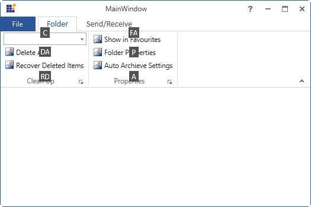

# KeyBoard Support in WPF Ribbon

To invoke any command using KeyBoard, Ribbon control provides KeyTip support to access the RibbonItem. On pressing Alt key, KeyTips for the corresponding RibbonItem gets displayed. 

## Adding KeyTip to the ribbon items

RibbonControl provides with an attached property called `KeyTip` that helps to set the Key tip for the RibbonItem. It also let to set the Key tip for the RibbonTab,Launcher Button,and for the controls that are needed to add in the Ribbon like RibbonButton,SplitButton…etc





<syncfusion:Ribbon Name="_ribbon" VerticalAlignment="Top">
<syncfusion:RibbonTab Caption="Home"  syncfusion:Ribbon.KeyTip="H" >
<syncfusion:RibbonBar Header="Clipboard" syncfusion:Ribbon.KeyTip="FN" >
<syncfusion:RibbonButton Label="Paste" SizeForm="Large"
LargeIcon="/Resources/Paste32.png"   
syncfusion:Ribbon.KeyTip="CP"/>  
<syncfusion:RibbonButton  Label="Cut" SizeForm="Small"  
SmallIcon="/Resources/Cut16.png"  syncfusion:Ribbon.KeyTip="CT"/>
<syncfusion:RibbonButton  Label="Copy" SizeForm="Small"  SmallIcon="/Resources/Copy16.png"  
syncfusion:Ribbon.KeyTip="CY" />    
<syncfusion:RibbonButton  Label="Format Painter" SizeForm="Small"  
SmallIcon="/Resources/FormatPainter16.png"  
syncfusion:Ribbon.KeyTip="CR" />
</syncfusion:RibbonBar>
</syncfusion:RibbonTab>
<syncfusion:RibbonTab Caption="Insert" syncfusion:Ribbon.KeyTip="I" IsChecked="True" />
</syncfusion:Ribbon>





## KeyTip for QAT items

KeyTip for the QAT items gets displayed by default by pressing Alt Key. The `KeyTips` are arranged in the order like…1,2,3,4,5,6,7,8,9,09,08,07…….01,0A,0B…… etc.





<syncfusion:Ribbon.QuickAccessToolBar>
<syncfusion:QuickAccessToolBar>
<syncfusion:QuickAccessToolBar.QATMenuItems>
<syncfusion:RibbonButton Label="Save" syncfusion:RibbonCommandManager.SynchronizedItem="Save" />
<syncfusion:RibbonButton Label="Quick Print" syncfusion:RibbonCommandManager.SynchronizedItem="Quick Print"/>
<syncfusion:RibbonButton Label="Print Preview" syncfusion:RibbonCommandManager.SynchronizedItem="Print Preview"/>
<syncfusion:RibbonButton Label="Undo" syncfusion:RibbonCommandManager.SynchronizedItem="Undo"  />
<syncfusion:RibbonButton Label="Redo" syncfusion:RibbonCommandManager.SynchronizedItem="Redo" />
<syncfusion:RibbonButton Label="Paste" syncfusion:RibbonCommandManager.SynchronizedItem="Paste"/>
</syncfusion:QuickAccessToolBar.QATMenuItems>
<syncfusion:RibbonButton Label="Undo" SmallIcon="/Resources/Undo16.png" SizeForm="ExtraSmall"   
ToolTip="Undo" syncfusion:RibbonCommandManager.SynchronizedItem="Undo" />
<syncfusion:RibbonButton Label="Redo" SmallIcon="/Resources/Redo16.png" SizeForm="ExtraSmall"
ToolTip="Redo" syncfusion:RibbonCommandManager.SynchronizedItem="Redo"/>
<syncfusion:RibbonButton Command="ApplicationCommands.Save" SizeForm="ExtraSmall"
syncfusion:RibbonCommandManager.SynchronizedItem="Save" SmallIcon="/Resources/Save16.png"/>
</syncfusion:QuickAccessToolBar>
</syncfusion:Ribbon.QuickAccessToolBar>





## How to access particular item in ribbon using KeyTip

The below example illustrates how to access particular Ribbon item using KeyTip





<syncfusion:Ribbon  VerticalAlignment="Top" >
<syncfusion:RibbonTab syncfusion:Ribbon.KeyTip="F"  Caption="Folder" IsChecked="True" >
<syncfusion:RibbonBar  Header="Clean Up"  >
<syncfusion:RibbonComboBox  syncfusion:Ribbon.KeyTip="C" Label="CleanUp">
<syncfusion:RibbonComboBoxItem  Content="Cleanup Folder"/>
<syncfusion:RibbonComboBoxItem Content="Cleanup Folder and Sub Folders"/>
</syncfusion:RibbonComboBox>
<syncfusion:RibbonButton syncfusion:Ribbon.KeyTip="DA"  SizeForm="Small"  Label="Delete All"/>
<syncfusion:RibbonButton syncfusion:Ribbon.KeyTip="RD"  SizeForm="Small"   Label="Recover Deleted Items"/>
</syncfusion:RibbonBar >
<syncfusion:RibbonBar  Name="_ribbonBar"   Header="Properties"  >
<syncfusion:RibbonButton syncfusion:Ribbon.KeyTip="FA"  SizeForm="Small"  Label="Show in Favourites"/>
<syncfusion:RibbonButton syncfusion:Ribbon.KeyTip="P"  SizeForm="Small"  Label="Folder Properties"/>
<syncfusion:RibbonButton syncfusion:Ribbon.KeyTip="A"  SizeForm="Small"  Label="Auto Archieve Settings"/>
</syncfusion:RibbonBar>
</syncfusion:RibbonTab>
<syncfusion:RibbonTab syncfusion:Ribbon.KeyTip="S"   Caption="Send/Receive" IsChecked="False" />
</syncfusion:Ribbon>





The below screenshot displays the steps involved to access RibbonComboBox. When Alt key is pressed, KeyTip for the RibbonTab gets displayed. Then choose the desired RibbonTab with the KeyTip

In the Next Step, all the KeyTips under RibbonTab gets displayed 

Finally, Press the RibbonComboBox KeyTip to access it

## How does BackStage can be accessed using KeyTip

The backstage feature of the Ribbon control provides KeyTip support to display KeyTips on pressing the Alt key. It is also possible to set KeyTip for the BackStage elements which includes BackStageCommandButton, BackStageTabItem





<syncfusion:Ribbon.BackStage>
<syncfusion:Backstage x:Name="_ribbonBackStage" syncfusion:Ribbon.KeyTip="B">
<syncfusion:BackStageCommandButton Header="Save" syncfusion:Ribbon.KeyTip="S"   Command="Save" Icon="/Resources/Save16.png"/>
<syncfusion:BackStageCommandButton Header="Save As" syncfusion:Ribbon.KeyTip="A"  Command="SaveAs"  Icon="/Resources/Save16.png"/>
<syncfusion:BackstageTabItem syncfusion:Ribbon.KeyTip="I" Header="Info"/>
<syncfusion:BackstageTabItem syncfusion:Ribbon.KeyTip="R" Header="Recent"/>
</syncfusion:Backstage>
</syncfusion:Ribbon.BackStage>





In the below screenshot, “B” is set as KeyTip for the Backstage. So when the user press “B”, it automatically open the BackStage

The following screenshot display the KeyTip for the BackStageCommand and BackStageTabItem

