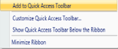
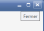
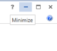
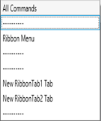
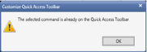
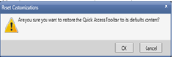

# Localization

Localization is the process of making the application multi-lingual by formatting content according to cultures. This involves configuring the application for a specific language. Culture is the combination of language and location. For example, En-US is the culture for English spoken in the United States. En-GB is the culture for English spoken in Great Britain. Syncfusion Tools allow you to set custom resource through the Resx file. You can simply provide the string values in the resource file for a specific culture and set the culture in the application. The given string values are set to the Tools control without modifying the code examples.

## Properties

The Essential Tools WPF controls can be localized according to the native language. It helps you to use the Tools controls more effectively.

N> For all the properties, ‘Type’ is ‘static’ and ‘Data Type’ is ‘string’.

<table>
<tr>
<th>
{{ '**Property**' | markdownify }}</th><th>
{{ '**Description**' | markdownify }}</th></tr>
<tr>
<td>
AddItemRemoveItem </td><td>
Sets the string to add and remove button content in the Ribbon QAT customization dialog window.</td></tr>
<tr>
<td colspan = "2">
{{''| markdownify }}
{{''| markdownify }}
{{ '_Add and Remove in QAT(en-US                                                   Add and Remove in QAT(fr-FR)_' | markdownify }}</td></tr>
<tr>
<td>
AddToQATCustomizeQATContextMenuQATShowBelowMinimizeRibbon</td><td>
Sets the string to add to QAT context menu item in the Ribbon.</td></tr>
<tr>
<td>
</td><td>
</td></tr>
<tr>
<td colspan = "2">
{{''| markdownify }}
{{''| markdownify }}
{{ '_QAT Context Menu(en-US)                                                     QAT Context Menu(fr-FR)_' | markdownify }}</td></tr>
<tr>
<td>
Choose</td><td>
Sets the string to choose commands in the Ribbon QATcustomization dialog window.</td></tr>
<tr>
<td colspan = "2">
{{''| markdownify }}
{{''| markdownify }}
</td></tr>
<tr>
<td>
CloseTooltip</td><td>
Sets the string for the ToolTip of Close button in the Ribbon Window.</td></tr>
<tr>
<td colspan = "2">
{{''| markdownify }}
{{''| markdownify }}
</td></tr>
<tr>
<td>
CustomizeQAT</td><td>
Sets the string to customize the Quick Access Toolbar Text in the Ribbon.</td></tr>
<tr>
<td colspan = "2">
{{''| markdownify }}
{{''| markdownify }}
</td></tr>
<tr>
<td>
MaximizeRibbon</td><td>
Sets the string to Maximize the Ribbon caption.</td></tr>
<tr>
<td colspan = "2">
MaximizeRibbon(en-US)                                                   Maximiser ruban(fr-FR)</td></tr>
<tr>
<td>
MaximizeTooltip</td><td>
Sets the string for the ToolTip of Maximize button in the Ribbon Window.</td></tr>
<tr>
<td colspan = "2">
{{''| markdownify }}
{{''| markdownify }}
</td></tr>
<tr>
<td>
MinimizeTooltip</td><td>
Sets the string for the ToolTip of Minimize button in the Ribbon Window.</td></tr>
<tr>
<td colspan = "2">
{{''| markdownify }}
{{''| markdownify }}
</td></tr>
<tr>
<td>
OkCancel</td><td>
Sets the string for the OKand Cancel buttons content in QAT customization dialog window in the Ribbon.</td></tr>
<tr>
<td colspan = "2">
{{''| markdownify }}
{{''| markdownify }}
{{ '_OK and Cancel in QAT(en-US)                                              OK and Cancel in QAT(fr-FR)_' | markdownify }}</td></tr>
<tr>
<td>
QAT</td><td>
Sets the string for Quick Access Toolbar Text in QAT customization dialog window in the Ribbon.</td></tr>
<tr>
<td colspan = "2">
{{''| markdownify }}
{{''| markdownify }}
</td></tr>
<tr>
<td>
QATAllCommandsCaptionQATRibbonMenuCaptionQATTabCaption</td><td>
Sets the string content for the Combo box of QAT customization dialog window in the Ribbon.</td></tr>
<tr>
<td colspan = "2">
{{''| markdownify }}
{{''| markdownify }}
{{ ' '_QAT customization(en-US)                                                                     QAT customization(fr-FR)_' | markdownify }}</td></tr>
<tr>
<td>
QATDuplicateAlert</td><td>
Sets the string for the Duplicate QAT item Alert message in QAT customization dialog window in Ribbon</td></tr>
<tr>
<td colspan = "2">
The selected command is already                                La commande sélectionnée est déjà sur la  on the Quick Access Toolbar                                       barre d'outils Accès rapide{{''| markdownify }}
{{''| markdownify }}
{{ '_QATDuplicateAlert(en-US)                                                          QATDuplicateAlert(fr-FR)_' | markdownify }}</td></tr>
<tr>
<td>
QATResetContent</td><td>
Sets the string for the Reset QAT message in QAT customization dialog window in Ribbon</td></tr>
<tr>
<td colspan = "2">
Are you sure you want to restore the                   Etes-vous sûr que vous voulez restaurer la barre Quick Access Toolbar to its defaults content?                d'outils Accès rapide à son contenu par défaut?{{''| markdownify }}
{{''| markdownify }}
{{ '_QATResetContent(en-US)                                           QATResetContent(fr-FR)_' | markdownify }}</td></tr>
<tr>
<td>
QATResetTitle</td><td>
Sets the string for the Reset QAT window Title in QAT customization dialog window in Ribbon.</td></tr>
<tr>
<td colspan = "2">
Reset Customizations                                                           Enlever les personnalisations{{''| markdownify }}
{{''| markdownify }}
{{ '_QATResetTitle(en-US)                                                              QATResetTitle(fr-FR)_' | markdownify }}</td></tr>
<tr>
<td>
QATMoreCommandsQATShowAbove</td><td>
Sets the string for the context menu item in QAT dropdown in the Ribbon.</td></tr>
<tr>
<td colspan = "2">
{{''| markdownify }}
{{''| markdownify }}
{{ '_QAT Context Menu(en-US)                                                   QAT Context Menu(fr-FR)_' | markdownify }}</td></tr>
<tr>
<td>
RemoveFromQAT</td><td>
Sets the string to Remove from Quick Access Toolbar context menu item in the Ribbon.</td></tr>
<tr>
<td colspan = "2">
Remove from Quick Access Toolbar                           Supprimer de la barre d'outils Accès rapide{{''| markdownify }}
{{''| markdownify }}
{{ '_RemoveFromQAT(en-US)                                              RemoveFromQAT(fr-FR)_' | markdownify }}</td></tr>
<tr>
<td>
Reset Modify</td><td>
Sets the string to Reset and Modify button content in the Ribbon QAT customization dialog window.</td></tr>
<tr>
<td colspan = "2">
{{''| markdownify }}
{{''| markdownify }}
</td></tr>
<tr>
<td>
RestoreTooltip</td><td>
Sets the string for the ToolTip of Restore button in the Ribbon Window.</td></tr>
<tr>
<td colspan = "2">
Restore Down                                                              Restaurer en bas{{''| markdownify }}
{{''| markdownify }}
</td></tr>
<tr>
<td>
ShowQATBelow</td><td>
Sets the string to Show QAT Below Check box of QAT customization dialog window in the Ribbon.</td></tr>
<tr>
<td colspan = "2">
Show Quick Access Toolbar beneath the Ribbon         Voir d'outils Accès rapide sous le ruban{{''| markdownify }}
{{''| markdownify }}
</td></tr>
</table>

