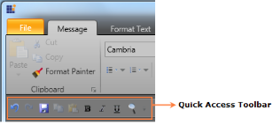

# Office 2010 User Interface (UI)

The Syncfusion Ribbon control supports the Office 2010 UI, which looks and functions like the Microsoft Office 2010 UI. 

Use Case Scenarios

The Syncfusion Ribbon control with the Office 2010 UI helps users to create WPF applications, which look and function like the Microsoft Office 2010 UI.

{{ '' | markdownify }}
{:.image }

Sample Link

To access a sample:

Navigate to Start -> All Programs -> Syncfusion -> Essential Studio -> Dashboard.

Click the WPF drop-down list, and then select Run Locally Installed Samples.

In the sample browser, expand the Ribbon treeview item, and then select Ribbon Sample.

## Creating an Application with Office 2010 UI Appearance

Users can create the appearance of the Office 2010 UI in WPF applications by applying Office 2010 UI themes to the Ribbon control. The Office 2010 UI in the Ribbon control supports the following themes:

* Office2010Black
* Office2010Blue
* Office2010Silver

The Office 2010 UI themes can be applied to the Ribbon control, as shown in the following code snippets.

<table>
<tr>
<td>
[XAML]       <syncfusion:Ribbon shared:SkinManager.VisualStyle="Office2010Black"                                                       Name="MyRibbon">                       <syncfusion:RibbonTab Caption="Tab1">                <syncfusion:RibbonBar Header="Ribbon Bar1"/>                <syncfusion:RibbonBar Header="Ribbon Bar1"/>                <syncfusion:RibbonBar Header="Ribbon Bar1"/>            </syncfusion:RibbonTab>     </syncfusion:Ribbon></td></tr>
<tr>
<td>
[C#]   public void RibbonWindow_Loaded(object sender, EventArgs e)   {    SkinManager.SetVisualStyle(this.MyRibbon, VisualStyle.Office2010Black);   }</td></tr>
</table>
## Appearance

The Office 2010 UI in the Ribbon control looks like the Microsoft Office 2010 UI. The Office 2010 UI in the Ribbon control has many changes when compared to the Office 2007 UI. The Ribbon control has many new elements added to it and the visual styles for all the elements have been changed to achieve the Office 2010 UI. The following are the main elements of the Office 2010 UI:

* Ribbon window
* Application icon 
* Toggle button
* Back Stage button
* Back Stage
* Quick Access Toolbar (QAT) 
* Button panel
* Office 2010 UI themes

Ribbon Window

The Ribbon window supports the display of content just like Microsoft Office 2010 UI. In the Office 2010 UI, the width of the title bar on the Ribbon window is extended. Also, the Ribbon window can be dragged by clicking anywhere on the title bar.

Application Icon

The Application icon is built-in the Ribbon control and is located in the upper-left corner of the control. Users can customize the Application icon by using the Icon property of the Ribbon, as shown in the following code snippet. 

[C#]   

    <syncfusion:Ribbon shared:SkinManager.VisualStyle="Office2010Black" 

         Title="Syncfusion Office2010 UI"  Name="MyRibbon"

                                          Icon="/Resources/logo.png" >           

            <syncfusion:RibbonTab Caption="Tab1">

                <syncfusion:RibbonBar Header="Ribbon Bar1"/>

                <syncfusion:RibbonBar Header="Ribbon Bar1"/>

                <syncfusion:RibbonBar Header="Ribbon Bar1"/>

            </syncfusion:RibbonTab>

     </syncfusion:Ribbon>

{{ '' | markdownify }}
{:.image }

Toggle Button

The Toggle button is a new element in the Ribbon control with the Office 2010 UI, which is located in the upper-right corner of the control near the Tab Panel item. The Toggle button is used to change the Ribbon state just like the Microsoft Office 2010 UI. The Toggle button has two states, namely Normal and Hide. The Toggle button will be added to the Ribbon control when the Office 2010 UI themes are applied.

{{ '' | markdownify }}
{:.image }

Back Stage Button

The Back Stage button is a new element in the Ribbon control with the Office 2010 UI. It is just like the Application Menu in the Office 2007 UI. The Back Stage button will be added to the Ribbon control when the Office 2010 UI themes are applied and it can be clicked to open the Back Stage UI.

{{ '' | markdownify }}
{:.image }

Back Stage

The Back Stage is a new UI in the Office 2010 UI, which displays application commands, such as Save, Save As, Open, and Exit. The Back Stage UI can be opened by clicking the Back Stage button.

When the Back Stage UI is open, it will fill the entire Ribbon window content and none of the tabs will be selected in the Ribbon control. Also, the QAT and the Ribbon Toggle button will be disabled when the Back Stage UI is open. The Back Stage UI contains the following two elements:

* Back Stage Command button
* Back Stage Tab item

The Back Stage Command button is used to perform simple actions in WPF applications by using the application commands.

The Back Stage Tab item is used to display the content of the tab item just like the Tab control. The content of the Back Stage Tab item will be displayed in the right pane of the Back Stage UI, as shown in the screen shot displayed below. The content of the tab item can also be customized.

{{ '' | markdownify }}
{:.image }

QAT

The appearance of the QAT in the Office 2010 UI is different when compared to the Office 2007 UI. In the Office 2010 UI, two separators are added to the QAT when it is displayed above the Ribbon and they will be disabled when the QAT is displayed below the Ribbon. 

{{ '' | markdownify }}
{:.image }

{{ '' | markdownify }}
{:.image }

Button Panel

The Button panel in the Office 2010 UI has the SeparatorVisibility property to control the visibility of the separators. You can customize the Button panel by changing the value of the SeparatorVisibility property. By default, the value of the SeparatorVisibility property is “Visible”. The code for the default Button panel is shown in the following code snippet.

[C#]   

<syncfusion:ButtonPanel Margin="0" >

<syncfusion:RibbonButton SizeMode="Small" SmallIcon="ClearFormatting16.png"/>

</syncfusion:ButtonPanel>

{{ '' | markdownify }}
{:.image }

The separators in the Button panel can be collapsed, as shown in the following code snippet.

[C#]   

<syncfusion:ButtonPanel Margin="0"  SeparatorVisibility="Collapsed">

<syncfusion:RibbonButton SizeMode="Small" SmallIcon="ClearFormatting16.png"/>

</syncfusion:ButtonPanel>

{{ '' | markdownify }}
{:.image }

Office 2010 UI Themes

You can customize the Office 2010 UI in the Ribbon control in a WPF application by using the following themes:

* Office 2010Black
* Office 2010Blue
* Office2010Silver

{{ '' | markdownify }}
{:.image }

{{ '' | markdownify }}
{:.image }

{{ '' | markdownify }}
{:.image }

