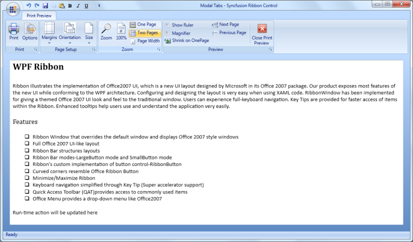

# Ribbon Modal Tabs

Modal Tab in Ribbon Control displays a collection of commands that will be used only in a temporary mode. At this point, the core tabs will be disabled.

## Use Case Scenarios

Print Preview is a Modal Tab which displays Print Preview related commands until you close the Modal Tab.

## Adding Modal Tabs to an Application 

You can add the Modal Tab in an application by adding Ribbon Tabs in ModalTabCollection property in Ribbon. You can also add all Ribbon Tabs that you want to use as Modal Tab into ModalTabCollection property. 

This is illustrated in the code given below.



    

            <syncfusion:Ribbon.ModalTabCollection >

                <syncfusion:ModalTabCollection >

                    <syncfusion:RibbonTab Caption="Print Preview" 

                                                 Name="printpreviewtab">

                        <syncfusion:RibbonBar Header="Sample Bar">

                            <syncfusion:RibbonButton Label="Close Tab"                                                  

                                         Click="CloseModalTab_Click"/>

                        </syncfusion:RibbonBar>

                    </syncfusion:RibbonTab>

                </syncfusion:ModalTabCollection>

            </syncfusion:Ribbon.ModalTabCollection>

 

After adding this collection in Ribbon, you can then handle the Modal Tab visibility by using the following methods at any time.

## Tables for properties, methods

### Properties

ModalTabCollection Table

<table>
<tr>
<th>
{{ '**Property**' | markdownify }}</th><th>
{{ '**Description**' | markdownify }}</th><th>
{{ '**Type**' | markdownify }}</th><th>
{{ '**Data Type**' | markdownify }}</th><th>
{{ '**Default Value**' | markdownify }}</th></tr>
<tr>
<td>
ModalTabCollection</td><td>
Used to store the collection of Ribbon Tabs as Modal Tabs Collection.</td><td>
 Dependency Property</td><td>
ModalTabsCollection </td><td>
Null Collection</td></tr>
</table>

### Methods

ShowModalTab Table

<table>
<tr>
<th>
{{ '**Method**' | markdownify }}</th><th>
{{ '**Description**' | markdownify }}</th><th>
{{ '**Parameters**' | markdownify }}</th><th>
{{ '**Return Type**' | markdownify }}</th><th>
{{ '**Reference links**' | markdownify }}</th></tr>
<tr>
<td>
ShowModalTab</td><td>
This method will show the specific Modal Tab in the Ribbon from ModalTabCollection. </td><td>
(string arg1) arg1- Name of the Ribbon Tab to be displayed as Modal Tab from ModalTabCollection.</td><td>
bool </td><td>
How to Show a ModalTab?</td></tr>
</table>

CloseModalTabs Table

<table>
<tr>
<th>
{{ '**Method**' | markdownify }}</th><th>
{{ '**Description**' | markdownify }}</th><th>
{{ '**Parameters**' | markdownify }}</th><th>
{{ '**Return Type**' | markdownify }}</th><th>
{{ '**Reference links**' | markdownify }}</th></tr>
<tr>
<td>
CloseModalTabs</td><td>
CloseModalTabs method will close the opened Modal Tabs in Ribbon control.</td><td>
 No Params</td><td>
bool </td><td>
How to close ModalTabs?</td></tr>
</table>

#How to handle Modal Tabs in Ribbon?

You can add Ribbon Tabs that you want to display as Modal Tabs to ModalTabCollection property in the Ribbon Control. The ShowModalTab and CloseModalTabs methods handle Modal Tabs in the Ribbon control. You can display any Modal Tab from the ModalTabCollection property whenever required. 

You can call ShowModalTab method to show the specific Modal Tab in Ribbon. This can be done from any event of core Ribbon Tab element.

This is illustrated in the code given below.


 
   

private void ShowModalTabBtn_Click(object sender, RoutedEventArgs e)

        {

            this.MyRibbon.ShowModalTab("printpreviewtab");

        }

 

CloseModalTabs method will close the currently opened Modal Tab in Ribbon control. This method should be called in any event of currently displaying Modal Tab element.

This is illustrated in the code given below.


 
 
    private void CloseModalTabBtn_Click(object sender, RoutedEventArgs e)

        {

            this.MyRibbon.CloseModalTabs();

        }

 

## Sample Link

Tools  Ribbon   Modal Tabs

