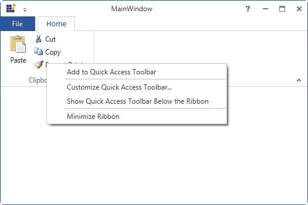

## Customize Ribbon through RibbonContextMenu

### Functions available in Ribbon ContextMenu

RibbonContextMenu allows to customize the Ribbon with the Right Click and it displays different functions for Ribbon and RibbonItems.



[XAML]

<syncfusion:Ribbon x:Name="Ribbon"  VerticalAlignment="Top">

<syncfusion:Ribbon.QuickAccessToolBar>

<syncfusion:QuickAccessToolBar syncfusion:WindowChrome.IsHitTestVisibleInChrome="True"/>

</syncfusion:Ribbon.QuickAccessToolBar>

<syncfusion:RibbonTab Caption="Home" >

<syncfusion:RibbonBar   Header="Clipboard"  >

<syncfusion:RibbonButton  Label="Paste" SizeForm="Large" LargeIcon="/Resources/Paste32.png"  />

<syncfusion:RibbonButton  Label="Cut" SizeForm="Small" SmallIcon="/Resources/Cut16.png" />

<syncfusion:RibbonButton  Label="Copy" SizeForm="Small"  SmallIcon="/Resources/Copy16.png"  />

<syncfusion:RibbonButton  Label="Format Painter" SizeForm="Small"  

SmallIcon="/Resources/FormatPainter16.png"  />

</syncfusion:RibbonBar>

</syncfusion:RibbonTab>

</syncfusion:Ribbon>



The below RibbonContextMenu will be generated when the user right click on the ribbon

It displays along with "Add to Quick Access ToolBar" function while clicking at the RibbonItem as like in the below screenshot

### Adding custom item to the ContextMenu

Ribbon Context Menu supports display of custom items. To add the custom item, set an attached property called **CustomContextMenuItems** of the RibbonContextMenu



[XAML]

<syncfusion:Ribbon x:Name="Ribbon"  VerticalAlignment="Top" syncfusion:RibbonContextMenu.IsCustomContextMenuItemsOnTop="True" >

<syncfusion:RibbonContextMenu.CustomContextMenuItems >

<syncfusion:RibbonMenuItem Header="Edit" IsCheckable="True" />

<syncfusion:RibbonMenuItem Header="Delete" IsCheckable="True"  />

<syncfusion:RibbonMenuItem Header="Rename" IsCheckable="True"  />

</syncfusion:RibbonContextMenu.CustomContextMenuItems>

</syncfusion:Ribbon>



### How to disable the RibbonContextMenu?

In order to disable the ContextMenu handle the “**RibbonContextMenuOpening**” event



[XAML]

<syncfusion:Ribbon x:Name="Ribbon"  VerticalAlignment="Top"  RibbonContextMenuOpening="Ribbon_ContextMenuOpening">

<syncfusion:Ribbon.QuickAccessToolBar>

<syncfusion:QuickAccessToolBar syncfusion:WindowChrome.IsHitTestVisibleInChrome="True"/>

</syncfusion:Ribbon.QuickAccessToolBar>

<syncfusion:RibbonTab Caption="Home"  >

<syncfusion:RibbonBar Header="Clipboard" >

<syncfusion:RibbonButton Label="Paste" SizeForm="Large"

LargeIcon="/Resources/Paste32.png" />                    

<syncfusion:RibbonButton  Label="Cut" SizeForm="Small"   SmallIcon="/Resources/Cut16.png" />

<syncfusion:RibbonButton  Label="Copy" SizeForm="Small"  SmallIcon="/Resources/Copy16.png"  />

<syncfusion:RibbonButton  Label="Format Painter" SizeForm="Small"  

SmallIcon="/Resources/FormatPainter16.png"  />

</syncfusion:RibbonBar>      

</syncfusion:RibbonTab>

</syncfusion:Ribbon>





[C#]

private void Ribbon_ContextMenuOpening(object sender, ContextMenuEventArgs e)

{

e.Handled = true;

}



The following snapshot will be generated before handling the RibbonContextMenu event

After the event is handled, the output will display as follows

