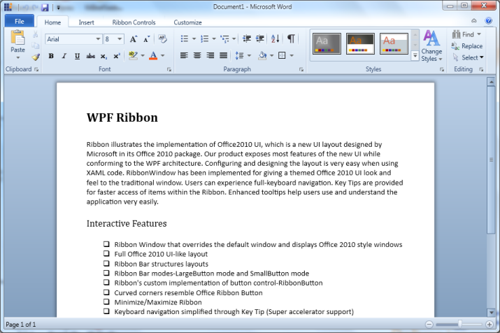

# KeyTip for Collapsed Ribbon bars

Ribbon control provides KeyTip support that will help to display key tips when you press the Alt key. However, the key tips will not be displayed when the ribbon bars are in a collapsed state. Only one keytip will be displayed for each ribbon bar and the expansion of which will display the entire set of keytip for that particular ribbon bar.

To display KeyTip for Collapsed Ribbon Bars

The KeyTips are displayed for the Collapsed RibbonBar.



    

   <syncfusion:RibbonBar KeyTipOnCollapsed="FS" Header="Font">
<syncfusion:RibbonButton  />

</syncfusion:RibbonBar>

 

## Samples Link

To view samples:

* Click Start-->All Programs-->Syncfusion-->Essential Studio <version number> -->Dashboard. (Refer section 2.2)
* In the Dashboard window, click Run Locally Installed Samples for WPF under User Interface Edition panel. 

The WPF Sample Browser window is displayed.

## Properties, Methods and Events tables

### Properties

Property table

<table>
<tr>
<th>
{{ '**Property**' | markdownify }}</th><th>
{{ '**Description**' | markdownify }}</th><th>
{{ '**Type**' | markdownify }}</th><th>
{{ '**Data Type**' | markdownify }}</th><th>
{{ '**Reference links**' | markdownify }}</th></tr>
<tr>
<td>
KeyTipOnCollapsed</td><td>
It will display the customized string in the collapsed RibbonBars.</td><td>
Dependency </td><td>
String</td><td>
NA</td></tr>
</table>

