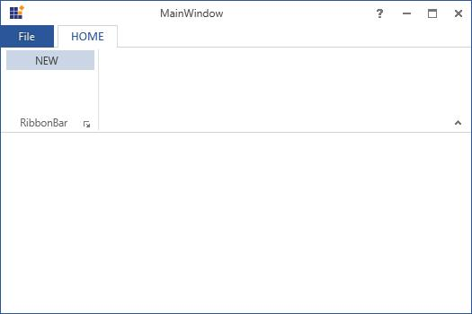

## RibbonMenuItem

RibbonMenuItems are used as entities in menus like **ApplicationMenu**, Split Button Menu, context menu, and so on.

The following code example illustrates How to use **RibbonMenuItem** control in **Ribbon** instance.



[XAML]

<syncfusion:Ribbon Name="_Ribbon1" HorizontalAlignment="Stretch" VerticalAlignment="Top">

<syncfusion:RibbonTab Name="_RibbonTab1" Caption="HOME"  >

<syncfusion:RibbonBar Name="_RibbonBar1">

<syncfusion:RibbonMenuItem  Header="NEW" Width="100"></syncfusion:RibbonMenuItem>

</syncfusion:RibbonBar>

</syncfusion:RibbonTab>            

</syncfusion:Ribbon>



Create instance of RibbonMenuItem and add it to RibbonBar Items.



[C#]

RibbonMenuItem _RibbonMenuItem = new RibbonMenuItem(){Header = "NEW", Width = 100};

_RibbonBar1.Items.Add(_RibbonMenuItem);



