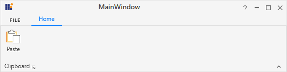
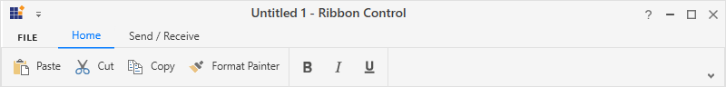
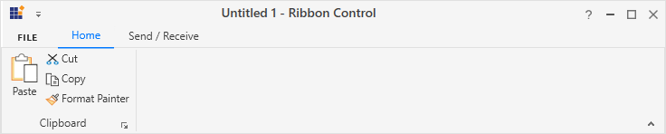
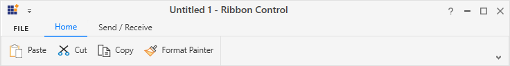

# RibbonButton in WPF Ribbon

 **RibbonButton** provides functionality similar to a normal button. Additionally, it comes in different sizes and can be easily placed inside the **RibbonBar** in the Ribbon control.  

## Setting various size modes

[`RibbonButton`](https://help.syncfusion.com/cr/wpf/Syncfusion.Windows.Tools.Controls.RibbonButton.html) supports three types of size modes and it can be set using the [`SizeForm`](https://help.syncfusion.com/cr/wpf/Syncfusion.Windows.Tools.Controls.RibbonButton.html#Syncfusion_Windows_Tools_Controls_RibbonButton_SizeForm) property. The different [`SizeForm`](https://help.syncfusion.com/cr/wpf/Syncfusion.Windows.Tools.SizeForm.html) available are as follows:

 * **ExtraSmall** - Displays only the image in 16 * 16 size.
 * **Small** - Displays the label and the image in 16 * 16 size.
 * **Large** - Displays the label and the image in 32 * 32 size.

 

 

 <syncfusion:RibbonWindow x:Class="RibbonButton_IconTemp.MainWindow"
        xmlns="http://schemas.microsoft.com/winfx/2006/xaml/presentation"
        xmlns:x="http://schemas.microsoft.com/winfx/2006/xaml"
        xmlns:d="http://schemas.microsoft.com/expression/blend/2008"
        xmlns:mc="http://schemas.openxmlformats.org/markup-compatibility/2006"
        xmlns:local="clr-namespace:RibbonButton_IconTemp"
        xmlns:syncfusion="http://schemas.syncfusion.com/wpf"
        xmlns:skin="clr-namespace:Syncfusion.SfSkinManager;assembly=Syncfusion.SfSkinManager.WPF"
        mc:Ignorable="d" skin:SfSkinManager.VisualStyle="MaterialLight"
        Title="Untitled 1 - Ribbon Control" Height="450" Width="800">
    <Grid>
        <syncfusion:Ribbon VerticalAlignment="Top" x:Name="ribbon" ShowCustomizeRibbon="True">
            <syncfusion:RibbonTab Caption="Home" IsChecked="True">
                <syncfusion:RibbonBar Header="Clipboard">
                    <syncfusion:RibbonButton Label="Paste" SizeForm="Large" LargeIcon="/Resources/Paste32.png" />
                    <syncfusion:RibbonButton Label="Cut" SizeForm="Small" SmallIcon="/Resources/Cut16.png" />
                    <syncfusion:RibbonButton Label="Copy" SizeForm="Small" SmallIcon="/Resources/Copy16.png" />
                    <syncfusion:RibbonButton Label="Format Painter" SizeForm="Small" SmallIcon="/Resources/FormatPainter16.png" />
                </syncfusion:RibbonBar>
                <syncfusion:RibbonBar Header="Font" >
                    <syncfusion:RibbonButton Label="Bold" SmallIcon="/Resources/Bold16.png" SizeForm="ExtraSmall"/>
                    <syncfusion:RibbonButton Label="Italic" SmallIcon="/Resources/Italic16.png" SizeForm="ExtraSmall"/>
                    <syncfusion:RibbonButton Label="Underline" SmallIcon="/Resources/Underline16.png" SizeForm="ExtraSmall"/>
                </syncfusion:RibbonBar>
            </syncfusion:RibbonTab>
            <syncfusion:RibbonTab Caption="Send / Receive"/>
            <syncfusion:Ribbon.QuickAccessToolBar>
                <syncfusion:QuickAccessToolBar/>
            </syncfusion:Ribbon.QuickAccessToolBar>
        </syncfusion:Ribbon>
    </Grid>
 </syncfusion:RibbonWindow>

 

 

 Ribbon ribbon = new Ribbon();
 ribbon.VerticalAlignment = VerticalAlignment.Top;
 // Creating new tabs
 RibbonTab homeTab = new RibbonTab();
 homeTab.Caption = "Home";
 homeTab.IsChecked = true;

 RibbonTab sendTab = new RibbonTab();
 sendTab.Caption = "Send / Receive";
 // Creating new bar
 RibbonBar clipboardBar = new RibbonBar();
 clipboardBar.Header = "Clipboard";
 // Creating items
 RibbonButton pasteButton = new RibbonButton();
 pasteButton.Label = "Paste";
 pasteButton.SizeForm = SizeForm.Large;
 pasteButton.LargeIcon = new BitmapImage(new Uri(@"/Resources/Paste32.png", UriKind.RelativeOrAbsolute));

 RibbonButton cutButton = new RibbonButton();
 cutButton.Label = "Cut";
 cutButton.SizeForm = SizeForm.Small;
 cutButton.SmallIcon = new BitmapImage(new Uri(@"/Resources/Cut16.png", UriKind.RelativeOrAbsolute));

 RibbonButton copyButton = new RibbonButton();
 copyButton.Label = "Copy";
 cutButton.SizeForm = SizeForm.Small;
 copyButton.SmallIcon = new BitmapImage(new Uri(@"/Resources/Copy16.png", UriKind.RelativeOrAbsolute));

 RibbonButton formatButton = new RibbonButton();
 formatButton.Label = "Format Painter";
 cutButton.SizeForm = SizeForm.Small;
 formatButton.SmallIcon = new BitmapImage(new Uri(@"/Resources/FormatPainter16.png", UriKind.RelativeOrAbsolute))
 // Adding items to bar
 clipboardBar.Items.Add(pasteButton);
 clipboardBar.Items.Add(cutButton);
 clipboardBar.Items.Add(copyButton);
 clipboardBar.Items.Add(formatButton);

 // Creating new bar
 RibbonBar fontBar = new RibbonBar();
 fontBar.Header = "Font";
 // Creating items
 RibbonButton boldButton = new RibbonButton();
 boldButton.Label = "Bold";
 boldButton.SizeForm = SizeForm.ExtraSmall;
 boldButton.SmallIcon = new BitmapImage(new Uri(@"/Resources/Bold16.png", UriKind.RelativeOrAbsolute));

 RibbonButton italicButton = new RibbonButton();
 italicButton.Label = "Italic";
 italicButton.SizeForm = SizeForm.ExtraSmall;
 italicButton.SmallIcon = new BitmapImage(new Uri(@"/Resources/Italic16.png", UriKind.RelativeOrAbsolute));

 RibbonButton underlineButton = new RibbonButton();
 underlineButton.Label = "Underline";
 underlineButton.SizeForm = SizeForm.ExtraSmall;
 underlineButton.SmallIcon = new BitmapImage(new Uri(@"/Resources/Underline16.png", UriKind.RelativeOrAbsolute));

 fontBar.Items.Add(boldButton);
 fontBar.Items.Add(italicButton);
 fontBar.Items.Add(underlineButton);

 // Adding bars to the tabs
 homeTab.Items.Add(clipboardBar);
 homeTab.Items.Add(fontBar);

 // Adding tabs to ribbon
 ribbon.Items.Add(homeTab);
 ribbon.Items.Add(sendTab);
 grid.Children.Add(ribbon);
 SfSkinManager.SetVisualStyle(this, VisualStyles.MaterialLight);

 

 

 

N> When **simplified** layout is set, [`RibbonButton`](https://help.syncfusion.com/cr/wpf/Syncfusion.Windows.Tools.Controls.RibbonButton.html) displays the image in 20 * 20 size irrespective of the size form. Also, the text in the **Large** size form will appear to the right of the image.

## Setting image to RibbonButton

 The [`RibbonButton`](https://help.syncfusion.com/cr/wpf/Syncfusion.Windows.Tools.Controls.RibbonButton.html) allows to display any type of image such as glyph, font or any custom content using the [`IconTemplateSelector`](https://help.syncfusion.com/cr/wpf/Syncfusion.Windows.Tools.Controls.RibbonButton.html#Syncfusion_Windows_Tools_Controls_RibbonButton_IconTemplateSelector) and [`IconTemplate`](https://help.syncfusion.com/cr/wpf/Syncfusion.Windows.Tools.Controls.RibbonButton.html#Syncfusion_Windows_Tools_Controls_RibbonButton_IconTemplate) property, which are the preferred options. It also allows to display a normal image or vector image using the [`IconType`](https://help.syncfusion.com/cr/wpf/Syncfusion.Windows.Tools.Controls.RibbonButton.html#Syncfusion_Windows_Tools_Controls_RibbonButton_IconType) enumeration property. The default value of the [`IconType`](https://help.syncfusion.com/cr/wpf/Syncfusion.Windows.Tools.Controls.RibbonButton.html#Syncfusion_Windows_Tools_Controls_RibbonButton_IconType) property is **Icon**. The [`IconType`](https://help.syncfusion.com/cr/wpf/Syncfusion.Windows.Tools.IconType.html) enumeration has the following values:

 * **Icon** - Gets the details of the icon from the [`SmallIcon`](https://help.syncfusion.com/cr/wpf/Syncfusion.Windows.Tools.Controls.RibbonButton.html#Syncfusion_Windows_Tools_Controls_RibbonButton_SmallIcon), [`MediumIcon`](https://help.syncfusion.com/cr/wpf/Syncfusion.Windows.Tools.Controls.RibbonButton.html#Syncfusion_Windows_Tools_Controls_RibbonButton_MediumIcon) or [`LargeIcon`](https://help.syncfusion.com/cr/wpf/Syncfusion.Windows.Tools.Controls.RibbonButton.html#Syncfusion_Windows_Tools_Controls_RibbonButton_LargeIcon) properties and sets it to the [`RibbonButton`](https://help.syncfusion.com/cr/wpf/Syncfusion.Windows.Tools.Controls.RibbonButton.html).
 * **VectorImage** - Gets the details of the icon path from the [`VectorImage`](https://help.syncfusion.com/cr/wpf/Syncfusion.Windows.Tools.Controls.RibbonButton.html#Syncfusion_Windows_Tools_Controls_RibbonButton_VectorImage) property and sets it to the [`RibbonButton`](https://help.syncfusion.com/cr/wpf/Syncfusion.Windows.Tools.Controls.RibbonButton.html).

 N> The [`RibbonButton`](https://help.syncfusion.com/cr/wpf/Syncfusion.Windows.Tools.Controls.RibbonButton.html) loads icon in the following priority order,
 * [`IconTemplateSelector`](https://help.syncfusion.com/cr/wpf/Syncfusion.Windows.Tools.Controls.RibbonButton.html#Syncfusion_Windows_Tools_Controls_RibbonButton_IconTemplateSelector)
 * [`IconTemplate`](https://help.syncfusion.com/cr/wpf/Syncfusion.Windows.Tools.Controls.RibbonButton.html#Syncfusion_Windows_Tools_Controls_RibbonButton_IconTemplate)
 * [`VectorImage`](https://help.syncfusion.com/cr/wpf/Syncfusion.Windows.Tools.Controls.RibbonButton.html#Syncfusion_Windows_Tools_Controls_RibbonButton_VectorImage)
 * [`LargeIcon`](https://help.syncfusion.com/cr/wpf/Syncfusion.Windows.Tools.Controls.RibbonButton.html#Syncfusion_Windows_Tools_Controls_RibbonButton_LargeIcon)
 * [`MediumIcon`](https://help.syncfusion.com/cr/wpf/Syncfusion.Windows.Tools.Controls.RibbonButton.html#Syncfusion_Windows_Tools_Controls_RibbonButton_MediumIcon)
 * [`SmallIcon`](https://help.syncfusion.com/cr/wpf/Syncfusion.Windows.Tools.Controls.RibbonButton.html#Syncfusion_Windows_Tools_Controls_RibbonButton_SmallIcon)

### Setting icon template selector

The [`IconTemplateSelector`](https://help.syncfusion.com/cr/wpf/Syncfusion.Windows.Tools.Controls.RibbonButton.html#Syncfusion_Windows_Tools_Controls_RibbonButton_IconTemplateSelector) property provides support to specify a different data template based on the value of the [`SizeForm`](https://help.syncfusion.com/cr/wpf/Syncfusion.Windows.Tools.Controls.RibbonButton.html#Syncfusion_Windows_Tools_Controls_RibbonButton_SizeForm) or [`LayoutMode`](https://help.syncfusion.com/cr/wpf/Syncfusion.Windows.Tools.Controls.Ribbon.html#Syncfusion_Windows_Tools_Controls_Ribbon_LayoutMode) properties. For simplified layout, the template content will be resized to 20 * 20 size which is the standard. 

 

 

 <syncfusion:RibbonWindow x:Class="WpfApp1.MainWindow"
        xmlns="http://schemas.microsoft.com/winfx/2006/xaml/presentation"
        xmlns:x="http://schemas.microsoft.com/winfx/2006/xaml"
        xmlns:d="http://schemas.microsoft.com/expression/blend/2008"
        xmlns:mc="http://schemas.openxmlformats.org/markup-compatibility/2006"
        xmlns:local="clr-namespace:WpfApp1"
        mc:Ignorable="d" xmlns:syncfusion="http://schemas.syncfusion.com/wpf"
        xmlns:skin="clr-namespace:Syncfusion.SfSkinManager;assembly=Syncfusion.SfSkinManager.WPF"
        skin:SfSkinManager.VisualStyle="MaterialLight"
        Title="MainWindow" Height="450" Width="600">
    <syncfusion:RibbonWindow.Resources>
        <DataTemplate x:Key="ribbonButtonSmallIconTemplate">
            <Grid Width="14" Height="16">
                <Path Width="7" Margin="0,7,0,0" HorizontalAlignment="Right" Fill="#FF3A3A38" Stretch="Fill"
                      Data="F1M122,367L127,367L127,360L122,360z M128,368L121,368L121,359L128,359z" />
                <Path Margin="0,2,2,0" Fill="#FFDE6C00" Stretch="Fill"
                      Data="M0,0 L12,0 12,4 11,4 11,0.99999994 1.0000002,0.99999994 1.0000002,13 6.0000001,13 6.0000001,14 0,14 z" />
                <Path Margin="1,3,3,1" Fill="#FFF8DB8F" Stretch="Fill"
                Data="M0,0 L10,0 10,3 9.0000001,3 9.0000001,0.99999994 1.0000001,0.99999994 1.0000001,1.5829999 1.0000001,2.5 1.0000001,11 5.0000001,11 5.0000001,12 0,12 z" />
                <Path Margin="2.011,0.5,0.983,0.983" Fill="#FFFAFAFA" Stretch="Fill"
                      Data="M5.9873815,7.496151 L11.006,7.496151 11.006,14.516999 5.9873815,14.516999 z M0,5.4959998 L3.9880071,5.4964137 3.9880071,13.51695 0,13.51695 z M3.9889999,2.2337155E-15 C4.8170028,-4.4703477E-08 5.4889999,0.67098993 5.4889999,1.5 L5.4889999,2 7.4889999,2 7.4889999,5 0.4889999,5 0.4889999,2 2.4889999,2 2.4889999,1.5 C2.4889999,0.67098993 3.1609969,-4.4703477E-08 3.9889999,2.2337155E-15 z" />
                <Path Height="6" Margin="2,0,4,0" VerticalAlignment="Top" Fill="#FF797774" Stretch="Fill"
                      Data="M4,1 C3.447998,1 3,1.4490051 3,2 L3,3 1,3 1,5 7,5 7,3 5,3 5,2 C5,1.4490051 4.552002,1 4,1 z M4,0 C5.1029968,0 6,0.89700317 6,2 L8,2 8,6 0,6 0,2 2,2 C2,0.89700317 2.8970032,0 4,0 z" />
            </Grid>
        </DataTemplate>
        <DataTemplate x:Key="ribbonButtonLargeIconTemplate">
                <Grid Margin="2">
                    <Path Data="M17,0 L21,0 21,7 20,7 20,1.0000001 17,1.0000001 z M0,0 L4,0 4,1.0000001 1.0000001,1.0000001 1.0000001,23 12,23 12,24 0,24 z"
                          Margin="0,4,6,2" Fill="#FFED8733" Stretch="Fill" />
                    <Path Data="M1.0000002,0.99999994 L1.0000002,17 13,17 13,0.99999994 z M0,0 L14,0 14,18 0,18 z"
                          Margin="13,11,0,0" Fill="#FF3C3B39" Stretch="Fill" />
                    <Path Data="M16,0 L17,0 19,0 19,6 17,6 17,2 16,2 z M0,0 L2,0 3,0 3,2 2,2 2,20 11,20 11,22 0,22 z"
                          Margin="1,5,7,3" Fill="#FFF8DB8F" Stretch="Fill"/>
                    <Path Data="M10.999956,12.5 L22.999956,12.5 22.999956,28.5 10.999956,28.5 z M7.4999558,0 C9.1569382,0 10.499956,1.3439941 10.499956,3 L13.499956,3 13.499956,6.5 15,6.5 15,10.5 9.0000001,10.5 9.0000001,24.5 0,24.5 0,6.5 1.4999557,6.5 1.4999557,3 4.4999558,3 C4.4999558,1.3439941 5.8439499,0 7.4999558,0 z"
                          Margin="3,0.5,1,1" Fill="White" Stretch="Fill"/>
                    <Path Data="M6.5,0.99999996 C5.1209717,0.99999996 4,2.1209716 4,3.5 L4,4 0.99999994,4 0.99999994,7 12,7 12,4 9,4 9,3.5 C9,2.1209716 7.8790283,0.99999996 6.5,0.99999996 z M6.5,0 C8.2600098,-4.4703484E-08 9.7209473,1.3060302 9.9649658,3 L13,3 13,8 0,8 0,3 3.0350342,3 C3.2790527,1.3060302 4.7399902,-4.4703484E-08 6.5,0 z"
                          Height="8" Margin="4,0,10,0" VerticalAlignment="Top" Fill="#FF797774" Stretch="Fill"/>
                </Grid>
        </DataTemplate>
        <local:RibbonButtonIconTemplateSelector x:Key="ribbonButtonIconTemplateSelector"
                                    SmallTemplate="{StaticResource ribbonButtonSmallIconTemplate}"
                                    LargeTemplate="{StaticResource ribbonButtonLargeIconTemplate}"/>
    </syncfusion:RibbonWindow.Resources>
    <Grid>
        <syncfusion:Ribbon VerticalAlignment="Top">
            <syncfusion:Ribbon.QuickAccessToolBar>
                <syncfusion:QuickAccessToolBar/>
            </syncfusion:Ribbon.QuickAccessToolBar>
            <syncfusion:RibbonTab Caption="Home">
                <syncfusion:RibbonBar Header="Clipboard">
                    <syncfusion:RibbonButton Label="Paste" SizeForm="Large" IconTemplateSelector="{StaticResource ribbonButtonIconTemplateSelector}"/>
                </syncfusion:RibbonBar>
            </syncfusion:RibbonTab>
        </syncfusion:Ribbon>
    </Grid>
 </syncfusion:RibbonWindow>

 

 

 public class RibbonButtonIconTemplateSelector : DataTemplateSelector
 {
    public DataTemplate SmallTemplate { get; set; }
    public DataTemplate LargeTemplate { get; set; }
    public override DataTemplate SelectTemplate(object item, DependencyObject container)
    {
        var item1 = (container as ContentPresenter);
        RibbonButton ribbonButton = (item1.TemplatedParent as RibbonButton);
        if (ribbonButton != null)
        {
            if (ribbonButton.SizeForm == SizeForm.Small || ribbonButton.SizeForm == SizeForm.ExtraSmall)
            {
                return SmallTemplate;
            }
            else if (ribbonButton.SizeForm == SizeForm.Large)
            {
                return LargeTemplate;
            }
        }
        return LargeTemplate;
    }
 }
 

 

 

 N> [View sample in GitHub](https://github.com/SyncfusionExamples/syncfusion-wpf-ribbon-examples/tree/main/Samples/Setting-icons-using-IconTemplate)

### Setting icon template

The [`IconTemplate`](https://help.syncfusion.com/cr/wpf/Syncfusion.Windows.Tools.Controls.RibbonButton.html#Syncfusion_Windows_Tools_Controls_RibbonButton_IconTemplate) property provides support to set any type of image such as glyph, font or any custom content to the [`RibbonButton`](https://help.syncfusion.com/cr/wpf/Syncfusion.Windows.Tools.Controls.RibbonButton.html). The [`RibbonButton`](https://help.syncfusion.com/cr/wpf/Syncfusion.Windows.Tools.Controls.RibbonButton.html) will automatically resize the template content according to its [`SizeForm`](https://help.syncfusion.com/cr/wpf/Syncfusion.Windows.Tools.Controls.RibbonButton.html#Syncfusion_Windows_Tools_Controls_RibbonButton_SizeForm). For simplified layout, the template content will be resized to 20 * 20 size which is the standard. 





<syncfusion:RibbonWindow x:Class="RibbonButton_IconTemp.MainWindow"
        xmlns="http://schemas.microsoft.com/winfx/2006/xaml/presentation"
        xmlns:x="http://schemas.microsoft.com/winfx/2006/xaml"
        xmlns:d="http://schemas.microsoft.com/expression/blend/2008"
        xmlns:mc="http://schemas.openxmlformats.org/markup-compatibility/2006"
        xmlns:local="clr-namespace:RibbonButton_IconTemp"
        xmlns:syncfusion="http://schemas.syncfusion.com/wpf"
        xmlns:skin="clr-namespace:Syncfusion.SfSkinManager;assembly=Syncfusion.SfSkinManager.WPF"
        mc:Ignorable="d" skin:SfSkinManager.VisualStyle="MaterialLight"
        Title="MainWindow" Height="450" Width="800">
    <Grid>
        <syncfusion:Ribbon VerticalAlignment="Top">
            <syncfusion:RibbonTab Caption="Home">
                <syncfusion:RibbonBar Header="Clipboard">
                    <syncfusion:RibbonButton Label="Paste" SizeForm="Large">
                        <syncfusion:RibbonButton.IconTemplate>
                            <DataTemplate>
                                <Grid Margin="2">
                                <Path
                                    Data="M17,0 L21,0 21,7 20,7 20,1.0000001 17,1.0000001 z M0,0 L4,0 4,1.0000001 1.0000001,1.0000001 1.0000001,23 12,23 12,24 0,24 z"
                                    Margin="0,4,6,2" Fill="#FFED8733" Stretch="Fill" />
                                <Path
                                    Data="M1.0000002,0.99999994 L1.0000002,17 13,17 13,0.99999994 z M0,0 L14,0 14,18 0,18 z"
                                    Margin="13,11,0,0" Fill="#FF3C3B39" Stretch="Fill" />
                                <Path
                                    Data="M16,0 L17,0 19,0 19,6 17,6 17,2 16,2 z M0,0 L2,0 3,0 3,2 2,2 2,20 11,20 11,22 0,22 z"
                                    Margin="1,5,7,3" Fill="#FFF8DB8F" Stretch="Fill"/>
                                <Path
                                    Data="M10.999956,12.5 L22.999956,12.5 22.999956,28.5 10.999956,28.5 z M7.4999558,0 C9.1569382,0 10.499956,1.3439941 10.499956,3 L13.499956,3 13.499956,6.5 15,6.5 15,10.5 9.0000001,10.5 9.0000001,24.5 0,24.5 0,6.5 1.4999557,6.5 1.4999557,3 4.4999558,3 C4.4999558,1.3439941 5.8439499,0 7.4999558,0 z"
                                    Margin="3,0.5,1,1" Fill="White" Stretch="Fill"/>
                                <Path
                                    Data="M6.5,0.99999996 C5.1209717,0.99999996 4,2.1209716 4,3.5 L4,4 0.99999994,4 0.99999994,7 12,7 12,4 9,4 9,3.5 C9,2.1209716 7.8790283,0.99999996 6.5,0.99999996 z M6.5,0 C8.2600098,-4.4703484E-08 9.7209473,1.3060302 9.9649658,3 L13,3 13,8 0,8 0,3 3.0350342,3 C3.2790527,1.3060302 4.7399902,-4.4703484E-08 6.5,0 z"
                                    Height="8" Margin="4,0,10,0" VerticalAlignment="Top" Fill="#FF797774" Stretch="Fill"/>
                                </Grid>
                            </DataTemplate>
                        </syncfusion:RibbonButton.IconTemplate>
                    </syncfusion:RibbonButton>
                </syncfusion:RibbonBar>
            </syncfusion:RibbonTab>
        </syncfusion:Ribbon>
    </Grid>
</syncfusion:RibbonWindow>

 

 

 Ribbon ribbon = new Ribbon();
 ribbon.VerticalAlignment = VerticalAlignment.Top;
 // Creating new tabs
 RibbonTab homeTab = new RibbonTab();
 homeTab.Caption = "Home";
 homeTab.IsChecked = true;

 RibbonTab sendTab = new RibbonTab();
 sendTab.Caption = "Send / Receive";
 // Creating new bar
 RibbonBar clipboardBar = new RibbonBar();
 clipboardBar.Header = "Clipboard";
 // Creating items
 RibbonButton pasteButton = new RibbonButton();
 pasteButton.Label = "Paste";
 pasteButton.SizeForm = SizeForm.Large;

 DataTemplate iconDataTemplate = new DataTemplate();
 FrameworkElementFactory gridElement = new FrameworkElementFactory(typeof(Grid));
 FrameworkElementFactory pathElement1 = new FrameworkElementFactory(typeof(Path));
 FrameworkElementFactory pathElement2 = new FrameworkElementFactory(typeof(Path));
 FrameworkElementFactory pathElement3 = new FrameworkElementFactory(typeof(Path));
 FrameworkElementFactory pathElement4 = new FrameworkElementFactory(typeof(Path));
 FrameworkElementFactory pathElement5 = new FrameworkElementFactory(typeof(Path));

 gridElement.SetValue(Grid.MarginProperty, new Thickness(2));
 pathElement1.SetValue(Path.DataProperty, Geometry.Parse("M17,0 L21,0 21,7 20,7 20,1.0000001 17,1.0000001 z M0,0 L4,0 4,1.0000001 1.0000001,1.0000001 1.0000001,23 12,23 12,24 0,24 z"));
 pathElement1.SetValue(Path.MarginProperty, new Thickness(0, 4, 6, 2));
 pathElement1.SetValue(Path.FillProperty, new SolidColorBrush(Color.FromRgb(237, 135, 51)));
 pathElement1.SetValue(Path.StretchProperty, Stretch.Fill);

 pathElement2.SetValue(Path.DataProperty, Geometry.Parse("M1.0000002,0.99999994 L1.0000002,17 13,17 13,0.99999994 z M0,0 L14,0 14,18 0,18 z"));
 pathElement2.SetValue(Path.MarginProperty, new Thickness(13, 11, 0, 0));
 pathElement2.SetValue(Path.FillProperty, new SolidColorBrush(Color.FromRgb(60, 59, 57)));
 pathElement2.SetValue(Path.StretchProperty, Stretch.Fill);

 pathElement3.SetValue(Path.DataProperty, Geometry.Parse("M16,0 L17,0 19,0 19,6 17,6 17,2 16,2 z M0,0 L2,0 3,0 3,2 2,2 2,20 11,20 11,22 0,22 z"));
 pathElement3.SetValue(Path.MarginProperty, new Thickness(1, 5, 7, 3));
 pathElement3.SetValue(Path.FillProperty, new SolidColorBrush(Color.FromRgb(248, 219, 143)));
 pathElement3.SetValue(Path.StretchProperty, Stretch.Fill);

 pathElement4.SetValue(Path.DataProperty, Geometry.Parse("M10.999956,12.5 L22.999956,12.5 22.999956,28.5 10.999956,28.5 z M7.4999558,0 C9.1569382,0 10.499956,1.3439941 10.499956,3 L13.499956,3 13.499956,6.5 15,6.5 15,10.5 9.0000001,10.5 9.0000001,24.5 0,24.5 0,6.5 1.4999557,6.5 1.4999557,3 4.4999558,3 C4.4999558,1.3439941 5.8439499,0 7.4999558,0 z"));
 pathElement4.SetValue(Path.MarginProperty, new Thickness(3, 0.5, 1, 1));
 pathElement4.SetValue(Path.FillProperty, new SolidColorBrush(Colors.White));
 pathElement4.SetValue(Path.StretchProperty, Stretch.Fill);

 pathElement5.SetValue(Path.DataProperty, Geometry.Parse("M6.5,0.99999996 C5.1209717,0.99999996 4,2.1209716 4,3.5 L4,4 0.99999994,4 0.99999994,7 12,7 12,4 9,4 9,3.5 C9,2.1209716 7.8790283,0.99999996 6.5,0.99999996 z M6.5,0 C8.2600098,-4.4703484E-08 9.7209473,1.3060302 9.9649658,3 L13,3 13,8 0,8 0,3 3.0350342,3 C3.2790527,1.3060302 4.7399902,-4.4703484E-08 6.5,0 z"));
 pathElement5.SetValue(Path.MarginProperty, new Thickness(4, 0, 10, 0));
 pathElement5.SetValue(Path.FillProperty, new SolidColorBrush(Color.FromRgb(121, 119, 116)));
 pathElement5.SetValue(Path.StretchProperty, Stretch.Fill);
 pathElement5.SetValue(Path.HeightProperty, (double)8);
 pathElement5.SetValue(Path.VerticalAlignmentProperty, VerticalAlignment.Top);
 gridElement.AppendChild(pathElement1);
 gridElement.AppendChild(pathElement2);
 gridElement.AppendChild(pathElement3);
 gridElement.AppendChild(pathElement4);
 gridElement.AppendChild(pathElement5);
 iconDataTemplate.VisualTree = gridElement;
 pasteButton.IconTemplate = iconDataTemplate;
 clipboardBar.Items.Add(pasteButton);

 // Adding bars to the tabs
 homeTab.Items.Add(clipboardBar);

 // Adding tabs to ribbon
 ribbon.Items.Add(homeTab);
 ribbon.Items.Add(sendTab);
 grid.Children.Add(ribbon);
 SfSkinManager.SetVisualStyle(this, VisualStyles.MaterialLight);

 

 

 

 N> [View sample in GitHub](https://github.com/SyncfusionExamples/syncfusion-wpf-ribbon-examples/tree/main/Samples/Setting-icons-using-IconTemplate)

### Setting image path

 The [`RibbonButton`](https://help.syncfusion.com/cr/wpf/Syncfusion.Windows.Tools.Controls.RibbonButton.html) allows to set the image according to the different [`SizeForm`](https://help.syncfusion.com/cr/wpf/Syncfusion.Windows.Tools.SizeForm.html) values. To set the image to [`RibbonButton`](https://help.syncfusion.com/cr/wpf/Syncfusion.Windows.Tools.Controls.RibbonButton.html), the following properties are used:

* [`SmallIcon`](https://help.syncfusion.com/cr/wpf/Syncfusion.Windows.Tools.Controls.RibbonButton.html#Syncfusion_Windows_Tools_Controls_RibbonButton_SmallIcon) - 16 * 16 size image to be displayed in normal layout for **"ExtraSmall"** and **"Small"** size form.
* [`MediumIcon`](https://help.syncfusion.com/cr/wpf/Syncfusion.Windows.Tools.Controls.RibbonButton.html#Syncfusion_Windows_Tools_Controls_RibbonButton_MediumIcon) - 20 * 20 size image to be displayed in simplified layout.
* [`LargeIcon`](https://help.syncfusion.com/cr/wpf/Syncfusion.Windows.Tools.Controls.RibbonButton.html#Syncfusion_Windows_Tools_Controls_RibbonButton_LargeIcon) - 32 * 32 size image to be displayed in normal layout for **"Large"** size form.





<syncfusion:RibbonWindow x:Class="RibbonButton_IconTemp.MainWindow"
        xmlns="http://schemas.microsoft.com/winfx/2006/xaml/presentation"
        xmlns:x="http://schemas.microsoft.com/winfx/2006/xaml"
        xmlns:d="http://schemas.microsoft.com/expression/blend/2008"
        xmlns:mc="http://schemas.openxmlformats.org/markup-compatibility/2006"
        xmlns:local="clr-namespace:RibbonButton_IconTemp"
        xmlns:syncfusion="http://schemas.syncfusion.com/wpf"
        xmlns:skin="clr-namespace:Syncfusion.SfSkinManager;assembly=Syncfusion.SfSkinManager.WPF"
        mc:Ignorable="d" skin:SfSkinManager.VisualStyle="MaterialLight"
        Title="Untitled 1 - Ribbon Control" Height="450" Width="800">
    <Grid>
        <syncfusion:Ribbon VerticalAlignment="Top" x:Name="ribbon" EnableSimplifiedLayoutMode="True" LayoutMode="Simplified" ShowCustomizeRibbon="True">
            <syncfusion:RibbonTab Caption="Home" IsChecked="True">
                <syncfusion:RibbonBar Header="Clipboard">
                    <syncfusion:RibbonButton Label="Paste" syncfusion:SimplifiedLayoutSettings.DisplayMode="Simplified" SizeForm="Large" MediumIcon="/Resources/Paste20.png" LargeIcon="/Resources/Paste32.png" />
                    <syncfusion:RibbonButton Label="Cut" SizeForm="Small" MediumIcon="/Resources/Cut_20.png" SmallIcon="/Resources/Cut16.png" />
                    <syncfusion:RibbonButton Label="Copy" SizeForm="Small" MediumIcon="/Resources/Copy_20.png" SmallIcon="/Resources/Copy16.png" />
                    <syncfusion:RibbonButton Label="Format Painter" SizeForm="Small" MediumIcon="/Resources/FormatPainter20.png" SmallIcon="/Resources/FormatPainter16.png" />
                </syncfusion:RibbonBar>
                <syncfusion:RibbonBar Header="Font" >
                    <syncfusion:RibbonButton Label="Bold" SmallIcon="/Resources/Bold16.png" MediumIcon="/Resources/Bold_20.png" SizeForm="ExtraSmall"/>
                    <syncfusion:RibbonButton Label="Italic" SmallIcon="/Resources/Italic16.png" MediumIcon="/Resources/Italic_20.png"  SizeForm="ExtraSmall"/>
                    <syncfusion:RibbonButton Label="Underline" SmallIcon="/Resources/Underline16.png" MediumIcon="/Resources/Underline_20.png"  SizeForm="ExtraSmall"/>
                </syncfusion:RibbonBar>
            </syncfusion:RibbonTab>
            <syncfusion:RibbonTab Caption="Send / Receive"/>
            <syncfusion:Ribbon.QuickAccessToolBar>
                <syncfusion:QuickAccessToolBar/>
            </syncfusion:Ribbon.QuickAccessToolBar>
        </syncfusion:Ribbon>
    </Grid>
 </syncfusion:RibbonWindow>





 Ribbon ribbon = new Ribbon();
 ribbon.VerticalAlignment = VerticalAlignment.Top;
 ribbon.EnableSimplifiedLayoutMode = true;
 ribbon.LayoutMode = LayoutMode.Simplified;
 // Creating new tabs
 RibbonTab homeTab = new RibbonTab();
 homeTab.Caption = "Home";
 homeTab.IsChecked = true;

 RibbonTab sendTab = new RibbonTab();
 sendTab.Caption = "Send / Receive";
 // Creating new bar
 RibbonBar clipboardBar = new RibbonBar();
 clipboardBar.Header = "Clipboard";
 // Creating items
 RibbonButton pasteButton = new RibbonButton();
 pasteButton.Label = "Paste";
 pasteButton.SizeForm = SizeForm.Large;
 pasteButton.MediumIcon = new BitmapImage(new Uri(@"/Resources/Paste20.png", UriKind.RelativeOrAbsolute));
 pasteButton.LargeIcon = new BitmapImage(new Uri(@"/Resources/Paste32.png", UriKind.RelativeOrAbsolute));

 RibbonButton cutButton = new RibbonButton();
 cutButton.Label = "Cut";
 cutButton.SizeForm = SizeForm.Small;
 cutButton.MediumIcon = new BitmapImage(new Uri(@"/Resources/Cut_20.png", UriKind.RelativeOrAbsolute));
 cutButton.SmallIcon = new BitmapImage(new Uri(@"/Resources/Cut16.png", UriKind.RelativeOrAbsolute));

 RibbonButton copyButton = new RibbonButton();
 copyButton.Label = "Copy";
 cutButton.SizeForm = SizeForm.Small;
 copyButton.MediumIcon = new BitmapImage(new Uri(@"/Resources/Copy_20.png", UriKind.RelativeOrAbsolute));
 copyButton.SmallIcon = new BitmapImage(new Uri(@"/Resources/Copy16.png", UriKind.RelativeOrAbsolute));

 RibbonButton formatButton = new RibbonButton();
 formatButton.Label = "Format Painter";
 cutButton.SizeForm = SizeForm.Small;
 formatButton.MediumIcon = new BitmapImage(new Uri(@"/Resources/FormatPainter20.png", UriKind.RelativeOrAbsolute));
 formatButton.SmallIcon = new BitmapImage(new Uri(@"/Resources/FormatPainter16.png", UriKind.RelativeOrAbsolute));
 // Adding items to bar
 clipboardBar.Items.Add(pasteButton);
 clipboardBar.Items.Add(cutButton);
 clipboardBar.Items.Add(copyButton);
 clipboardBar.Items.Add(formatButton);

 // Creating new bar
 RibbonBar fontBar = new RibbonBar();
 fontBar.Header = "Font";
 // Creating items
 RibbonButton boldButton = new RibbonButton();
 boldButton.Label = "Bold";
 boldButton.SizeForm = SizeForm.ExtraSmall;
 boldButton.SmallIcon = new BitmapImage(new Uri(@"/Resources/Bold16.png", UriKind.RelativeOrAbsolute));
 boldButton.MediumIcon = new BitmapImage(new Uri(@"/Resources/Bold_20.png", UriKind.RelativeOrAbsolute));

 RibbonButton italicButton = new RibbonButton();
 italicButton.Label = "Italic";
 italicButton.SizeForm = SizeForm.ExtraSmall;
 italicButton.SmallIcon = new BitmapImage(new Uri(@"/Resources/Italic16.png", UriKind.RelativeOrAbsolute));
 italicButton.MediumIcon = new BitmapImage(new Uri(@"/Resources/Italic_20.png", UriKind.RelativeOrAbsolute));

 RibbonButton underlineButton = new RibbonButton();
 underlineButton.Label = "Underline";
 underlineButton.SizeForm = SizeForm.ExtraSmall;
 underlineButton.SmallIcon = new BitmapImage(new Uri(@"/Resources/Underline16.png", UriKind.RelativeOrAbsolute));
 underlineButton.MediumIcon = new BitmapImage(new Uri(@"/Resources/Underline_20.png", UriKind.RelativeOrAbsolute));

 fontBar.Items.Add(boldButton);
 fontBar.Items.Add(italicButton);
 fontBar.Items.Add(underlineButton);

 // Adding bars to the tabs
 homeTab.Items.Add(clipboardBar);
 homeTab.Items.Add(fontBar);

 // Adding tabs to ribbon
 ribbon.Items.Add(homeTab);
 ribbon.Items.Add(sendTab);
 grid.Children.Add(ribbon);
 SfSkinManager.SetVisualStyle(this, VisualStyles.MaterialLight);

 

 

 
 *Normal layout*

 
 *Simplified layout*

### Setting vector image 

 The [`VectorImage`](https://help.syncfusion.com/cr/wpf/Syncfusion.Windows.Tools.Controls.RibbonButton.html#Syncfusion_Windows_Tools_Controls_RibbonButton_VectorImage) property is of type `ObservableCollection<Path>` which allows the image to be set as path type. The [`RibbonButton`](https://help.syncfusion.com/cr/wpf/Syncfusion.Windows.Tools.Controls.RibbonButton.html) will automatically resize the image according to its [`SizeForm`](https://help.syncfusion.com/cr/wpf/Syncfusion.Windows.Tools.Controls.RibbonButton.html#Syncfusion_Windows_Tools_Controls_RibbonButton_SizeForm). For simplified layout, the image will be resized to 20 * 20 size which is the standard.

 N> The [`IconTemplateSelector`](https://help.syncfusion.com/cr/wpf/Syncfusion.Windows.Tools.Controls.RibbonButton.html#Syncfusion_Windows_Tools_Controls_RibbonButton_IconTemplateSelector) and [`IconTemplate`](https://help.syncfusion.com/cr/wpf/Syncfusion.Windows.Tools.Controls.RibbonButton.html#Syncfusion_Windows_Tools_Controls_RibbonButton_IconTemplate) properties are the preferred options to set any type of image such as glyph, font or any custom content when compared to the [`VectorImage`](https://help.syncfusion.com/cr/wpf/Syncfusion.Windows.Tools.Controls.RibbonButton.html#Syncfusion_Windows_Tools_Controls_RibbonButton_VectorImage) property.





<syncfusion:RibbonWindow x:Class="RibbonButton_IconTemp.MainWindow"
        xmlns="http://schemas.microsoft.com/winfx/2006/xaml/presentation"
        xmlns:x="http://schemas.microsoft.com/winfx/2006/xaml"
        xmlns:d="http://schemas.microsoft.com/expression/blend/2008"
        xmlns:mc="http://schemas.openxmlformats.org/markup-compatibility/2006"
        xmlns:local="clr-namespace:RibbonButton_IconTemp"
        xmlns:syncfusion="http://schemas.syncfusion.com/wpf"
        xmlns:skin="clr-namespace:Syncfusion.SfSkinManager;assembly=Syncfusion.SfSkinManager.WPF"
        mc:Ignorable="d" skin:SfSkinManager.VisualStyle="MaterialLight"
        Title="Untitled 1 - Ribbon Control" Height="450" Width="800">
    <Grid>
        <syncfusion:Ribbon VerticalAlignment="Top" x:Name="ribbon" EnableSimplifiedLayoutMode="True" LayoutMode="Simplified" ShowCustomizeRibbon="True">
            <syncfusion:RibbonTab Caption="Home" IsChecked="True">
                <syncfusion:RibbonBar Header="Clipboard">
                    <syncfusion:RibbonButton Label="Paste" SizeForm="Large" IconType="VectorImage">
                        <syncfusion:RibbonButton.VectorImage>
                            <Path Data="M17,0 L21,0 21,7 20,7 20,1.0000001 17,1.0000001 z M0,0 L4,0 4,1.0000001 1.0000001,1.0000001 1.0000001,23 12,23 12,24 0,24 z"
                                  Margin="0,4,6,2" Fill="#FFED8733" Stretch="Fill" />
                            <Path Data="M1.0000002,0.99999994 L1.0000002,17 13,17 13,0.99999994 z M0,0 L14,0 14,18 0,18 z"
                                  Margin="13,11,0,0" Fill="#FF3C3B39" Stretch="Fill" />
                            <Path Data="M16,0 L17,0 19,0 19,6 17,6 17,2 16,2 z M0,0 L2,0 3,0 3,2 2,2 2,20 11,20 11,22 0,22 z"
                                  Margin="1,5,7,3" Fill="#FFF8DB8F" Stretch="Fill"/>
                            <Path Data="M10.999956,12.5 L22.999956,12.5 22.999956,28.5 10.999956,28.5 z M7.4999558,0 C9.1569382,0 10.499956,1.3439941 10.499956,3 L13.499956,3 13.499956,6.5 15,6.5 15,10.5 9.0000001,10.5 9.0000001,24.5 0,24.5 0,6.5 1.4999557,6.5 1.4999557,3 4.4999558,3 C4.4999558,1.3439941 5.8439499,0 7.4999558,0 z"
                                  Margin="3,0.5,1,1" Fill="White" Stretch="Fill"/>
                            <Path Data="M6.5,0.99999996 C5.1209717,0.99999996 4,2.1209716 4,3.5 L4,4 0.99999994,4 0.99999994,7 12,7 12,4 9,4 9,3.5 C9,2.1209716 7.8790283,0.99999996 6.5,0.99999996 z M6.5,0 C8.2600098,-4.4703484E-08 9.7209473,1.3060302 9.9649658,3 L13,3 13,8 0,8 0,3 3.0350342,3 C3.2790527,1.3060302 4.7399902,-4.4703484E-08 6.5,0 z"
                                  Height="8" Margin="4,0,10,0" VerticalAlignment="Top" Fill="#FF797774" Stretch="Fill"/>
                        </syncfusion:RibbonButton.VectorImage>
                    </syncfusion:RibbonButton>
                    <syncfusion:RibbonButton Label="Cut" SizeForm="Small" IconType="VectorImage" >
                        <syncfusion:RibbonButton.VectorImage>
                            <Path Width="10" Height="8" Margin="3.747,0,1.805,4.614" Stretch="Fill"
                                  Data="M0.4800034,0 L3.2370005,5.6329948 5.9950049,0 6.4480002,1.3919982 3.8000043,6.7859942 6.4040015,12.108999 5.4240053,12.385 3.2370005,7.9400011 1.0859987,12.314001 0,12.249991 2.675004,6.7859942 0.027000348,1.3919982 z"
                                  Fill="{Binding RelativeSource={RelativeSource Mode=Self}, Path=(TextBlock.Foreground)}"/>
                            <Path Width="13" Height="4" Margin="2,0,0,1" VerticalAlignment="Bottom"
                                  Data="M2.0000019,1.0000033 C1.4480005,1.0000033 1.0000028,1.4489932 1.0000028,2.0000033 1.0000028,2.5509982 1.4480005,3.0000033 2.0000019,3.0000033 2.5519957,3.0000033 3.0000009,2.5509982 3.0000009,2.0000033 3.0000009,1.4489932 2.5519957,1.0000033 2.0000019,1.0000033 z M7.9999966,0.99999999 C7.4479966,0.99999993 6.9999966,1.449 6.9999966,2 6.9999966,2.5509999 7.4479966,3 7.9999966,3 8.5519962,3 8.9999962,2.5509999 8.9999962,2 8.9999962,1.449 8.5519962,0.99999993 7.9999966,0.99999999 z M2.0000019,3.2782542E-06 C3.1029978,3.3312692E-06 4,0.89700651 4,2.0000033 4,3.1030002 3.1029978,4.0000033 2.0000019,4.0000033 0.8969985,4.0000033 0,3.1030002 0,2.0000033 0,0.89700651 0.8969985,3.3312692E-06 2.0000019,3.2782542E-06 z M7.9999966,0 C9.1029968,-3.7871359E-08 9.9999962,0.89699995 9.9999962,2 9.9999962,3.1029999 9.1029968,4 7.9999966,4 6.8969965,4 5.9999966,3.1029999 5.9999966,2 5.9999966,0.89699995 6.8969965,-3.7871359E-08 7.9999966,0 z"
                                  Fill="#FF1D8BCC" Stretch="Fill" />
                        </syncfusion:RibbonButton.VectorImage>
                    </syncfusion:RibbonButton>
                    <syncfusion:RibbonButton Label="Copy" SizeForm="Small" IconType="VectorImage" >
                        <syncfusion:RibbonButton.VectorImage>
                            <Path Margin="3,1,0.5,0.5" Fill="White" Stretch="Fill" 
                                  Data="M5.5000009,2.500005 L10.500001,2.500005 14.500001,6.500005 14.500001,14.500005 5.5000009,14.500005 z M0,0 L4.0000037,0 4.0000037,12 0,12 z"/>
                            <Path Margin="2,0,0,0" Fill="#FF3A3939" Stretch="Fill"
                                  Data="M9.0000026,11.999999 L13.000003,11.999999 13.000003,12.999999 9.0000026,12.999999 z M9.0000026,9.9999986 L13.000003,9.9999986 13.000003,10.999999 9.0000026,10.999999 z M12,4.7070035 L12,7.0000033 14.293,7.0000033 z M6.9999967,4.0000001 L6.9999967,15 14.999997,15 14.999997,8.0000033 11,8.0000033 11,4.0000001 z M5.9999967,2.9999999 L11.706997,2.9999999 15.999997,7.293 15.999997,16 5.9999967,16 z M0,0 L6.9999967,0 6.9999967,2 5.9999971,2 5.9999971,1 1,1 1,13 4.9999976,13 4.9999976,14 0,14 z" />
                        </syncfusion:RibbonButton.VectorImage>
                    </syncfusion:RibbonButton>
                    <syncfusion:RibbonButton Label="Format Painter" SizeForm="Small" IconType="VectorImage">
                        <syncfusion:RibbonButton.VectorImage>
                            <Path Data="M13.434632,4.827646E-05 C13.680801,0.0024180976 13.926775,0.092046673 14.121765,0.27108389 14.544701,0.66010981 14.565695,1.3190858 14.167659,1.7340507 L11.531004,4.480899 13.369993,6.3119885 11.726018,7.9489524 6.8310282,12.794981 0,5.9919826 3.8440161,5.3719827 6.5970273,2.8419837 11.564087,7.7877166 6.5979662,2.8409979 8.2409729,1.2050026 10.105034,3.0610356 12.670845,0.32509833 C12.8764,0.10675568 13.155641,-0.0026375318 13.434632,4.827646E-05 z"
                                  Margin="2.048,0.498,0.501,0.705" Fill="White" Stretch="Fill" />
                            <Path  Data="M2.3529817,2.4090486 L1.417989,3.3400479 5.8379548,7.7410448 6.7719474,6.8110455 z M7.5172076,0.99873667 C7.3818266,1.0037418 7.2480633,1.0597443 7.1480229,1.165737 L4.9139335,3.5478707 5.6360054,4.2659228 7.9211223,1.8858034 C8.0180495,1.782771 8.0700533,1.6487924 8.0661471,1.5067568 8.0611417,1.3647821 8.0010812,1.2347711 7.8960969,1.1377204 7.7895868,1.0397238 7.6525886,0.99373155 7.5172076,0.99873667 z M7.5527165,7.1653047E-05 C7.9184291,0.0035863224 8.2838595,0.13640766 8.5721467,0.40172305 8.8770893,0.68072825 9.0521443,1.0617281 9.0650842,1.4747729 9.0791228,1.8877565 8.9290931,2.2788277 8.6430719,2.5777922 L6.3439374,4.9723075 8.1899364,6.8110455 5.8379548,9.153044 0,3.3400479 2.3529817,0.99704962 4.205102,2.8418849 6.4200914,0.48174404 C6.7234051,0.15819254 7.1382422,-0.0039115331 7.5527165,7.1653047E-05 z"
                                   Fill="#FF484644" Margin="7.936,0,0,4.845" Stretch="Fill" />
                            <Path Data="M0.77698034,0 L10.585,3.2109802 6.8309581,6.9279997 0,0.12499928 z"
                                  Fill="#FFF8DB8F" Margin="2.049,6.365,4.368,0.705" Stretch="Fill" />
                            <Path Data="M2.3239305,4.4059882 L7.8809197,9.9390366 10.69988,7.1480067 z M7.630995,1.3829954 L5.1189968,3.6919881 3.9397421,3.8823536 11.49895,6.3573499 12.063992,5.7979813 z M7.657995,0 L13.483991,5.7999814 7.9662354,11.262604 7.8789665,11.349017 7.8779948,11.349963 0,3.5039886 4.6639969,2.7519911 z"
                                  Fill="#FFEE9243" Margin="1,2.648,2.518,0" Stretch="Fill" />
                        </syncfusion:RibbonButton.VectorImage>
                    </syncfusion:RibbonButton>
                </syncfusion:RibbonBar>
            </syncfusion:RibbonTab>
            <syncfusion:RibbonTab Caption="Send / Receive"/>
            <syncfusion:Ribbon.QuickAccessToolBar>
                <syncfusion:QuickAccessToolBar/>
            </syncfusion:Ribbon.QuickAccessToolBar>
        </syncfusion:Ribbon>
    </Grid>
 </syncfusion:RibbonWindow>

 

 

 Ribbon ribbon = new Ribbon();
 ribbon.VerticalAlignment = VerticalAlignment.Top;
 ribbon.EnableSimplifiedLayoutMode = true;
 ribbon.LayoutMode = LayoutMode.Simplified;
 // Creating new tabs
 RibbonTab homeTab = new RibbonTab();
 homeTab.Caption = "Home";
 homeTab.IsChecked = true;

 RibbonTab sendTab = new RibbonTab();
 sendTab.Caption = "Send / Receive";
 // Creating new bar
 RibbonBar clipboardBar = new RibbonBar();
 clipboardBar.Header = "Clipboard";
 // Creating items
 RibbonButton pasteButton = new RibbonButton();
 pasteButton.Label = "Paste";
 pasteButton.SizeForm = SizeForm.Large;
 pasteButton.IconType = IconType.VectorImage;

 Path pastePath1 = new Path();
 pastePath1.Data = Geometry.Parse("M17,0 L21,0 21,7 20,7 20,1.0000001 17,1.0000001 z M0,0 L4,0 4,1.0000001 1.0000001,1.0000001 1.0000001,23 12,23 12,24 0,24 z");
 pastePath1.Fill = new SolidColorBrush(Color.FromRgb(237, 135, 51));
 pastePath1.Margin = new Thickness(0, 4, 6, 2);
 pastePath1.Stretch = Stretch.Fill;
 Path pastePath2 = new Path();
 pastePath2.Data = Geometry.Parse("M1.0000002,0.99999994 L1.0000002,17 13,17 13,0.99999994 z M0,0 L14,0 14,18 0,18 z");
 pastePath2.Fill = new SolidColorBrush(Color.FromRgb(60, 59, 57));
 pastePath2.Margin = new Thickness(13, 11, 0, 0);
 pastePath2.Stretch = Stretch.Fill;
 Path pastePath3 = new Path();
 pastePath3.Data = Geometry.Parse("M16,0 L17,0 19,0 19,6 17,6 17,2 16,2 z M0,0 L2,0 3,0 3,2 2,2 2,20 11,20 11,22 0,22 z");
 pastePath3.Fill = new SolidColorBrush(Color.FromRgb(248, 219, 143));
 pastePath3.Margin = new Thickness(1, 5, 7, 3);
 pastePath3.Stretch = Stretch.Fill;
 Path pastePath4 = new Path();
 pastePath4.Data = Geometry.Parse("M10.999956,12.5 L22.999956,12.5 22.999956,28.5 10.999956,28.5 z M7.4999558,0 C9.1569382,0 10.499956,1.3439941 10.499956,3 L13.499956,3 13.499956,6.5 15,6.5 15,10.5 9.0000001,10.5 9.0000001,24.5 0,24.5 0,6.5 1.4999557,6.5 1.4999557,3 4.4999558,3 C4.4999558,1.3439941 5.8439499,0 7.4999558,0 z");
 pastePath4.Fill = new SolidColorBrush(Colors.White);
 pastePath4.Margin = new Thickness(3, 0.5, 1, 1);
 pastePath4.Stretch = Stretch.Fill;
 Path pastePath5 = new Path();
 pastePath5.Data = Geometry.Parse("M6.5,0.99999996 C5.1209717,0.99999996 4,2.1209716 4,3.5 L4,4 0.99999994,4 0.99999994,7 12,7 12,4 9,4 9,3.5 C9,2.1209716 7.8790283,0.99999996 6.5,0.99999996 z M6.5,0 C8.2600098,-4.4703484E-08 9.7209473,1.3060302 9.9649658,3 L13,3 13,8 0,8 0,3 3.0350342,3 C3.2790527,1.3060302 4.7399902,-4.4703484E-08 6.5,0 z");
 pastePath5.Fill = new SolidColorBrush(Color.FromRgb(121, 119, 116));
 pastePath5.Margin = new Thickness(4, 0, 10, 0);
 pastePath5.Stretch = Stretch.Fill;
 pastePath5.Height = 8;
 pastePath5.VerticalAlignment = VerticalAlignment.Top;

 pasteButton.VectorImage.Add(pastePath1);
 pasteButton.VectorImage.Add(pastePath2);
 pasteButton.VectorImage.Add(pastePath3);
 pasteButton.VectorImage.Add(pastePath4);
 pasteButton.VectorImage.Add(pastePath5);

 RibbonButton cutButton = new RibbonButton();
 cutButton.Label = "Cut";
 cutButton.SizeForm = SizeForm.Small;
 cutButton.IconType = IconType.VectorImage;

 Path cutPath1 = new Path();
 cutPath1.Data = Geometry.Parse("M0.4800034,0 L3.2370005,5.6329948 5.9950049,0 6.4480002,1.3919982 3.8000043,6.7859942 6.4040015,12.108999 5.4240053,12.385 3.2370005,7.9400011 1.0859987,12.314001 0,12.249991 2.675004,6.7859942 0.027000348,1.3919982 z");
 cutPath1.Fill = new SolidColorBrush(Colors.Black);
 cutPath1.Margin = new Thickness(3.747, 0, 1.805, 4.614);
 cutPath1.Stretch = Stretch.Fill;
 cutPath1.Height = 8;
 cutPath1.Width = 10;
 Path cutPath2 = new Path();
 cutPath2.Data = Geometry.Parse("M2.0000019,1.0000033 C1.4480005,1.0000033 1.0000028,1.4489932 1.0000028,2.0000033 1.0000028,2.5509982 1.4480005,3.0000033 2.0000019,3.0000033 2.5519957,3.0000033 3.0000009,2.5509982 3.0000009,2.0000033 3.0000009,1.4489932 2.5519957,1.0000033 2.0000019,1.0000033 z M7.9999966,0.99999999 C7.4479966,0.99999993 6.9999966,1.449 6.9999966,2 6.9999966,2.5509999 7.4479966,3 7.9999966,3 8.5519962,3 8.9999962,2.5509999 8.9999962,2 8.9999962,1.449 8.5519962,0.99999993 7.9999966,0.99999999 z M2.0000019,3.2782542E-06 C3.1029978,3.3312692E-06 4,0.89700651 4,2.0000033 4,3.1030002 3.1029978,4.0000033 2.0000019,4.0000033 0.8969985,4.0000033 0,3.1030002 0,2.0000033 0,0.89700651 0.8969985,3.3312692E-06 2.0000019,3.2782542E-06 z M7.9999966,0 C9.1029968,-3.7871359E-08 9.9999962,0.89699995 9.9999962,2 9.9999962,3.1029999 9.1029968,4 7.9999966,4 6.8969965,4 5.9999966,3.1029999 5.9999966,2 5.9999966,0.89699995 6.8969965,-3.7871359E-08 7.9999966,0 z");
 cutPath2.Fill = new SolidColorBrush(Color.FromRgb(29, 139, 204));
 cutPath2.Margin = new Thickness(2, 0, 0, 1);
 cutPath2.Stretch = Stretch.Fill;
 cutPath2.VerticalAlignment = VerticalAlignment.Bottom;
 cutPath2.Height = 4;
 cutPath2.Width = 13;
 cutButton.VectorImage.Add(cutPath1);
 cutButton.VectorImage.Add(cutPath2);
 
 RibbonButton copyButton = new RibbonButton();
 copyButton.Label = "Copy";
 copyButton.SizeForm = SizeForm.Small;
 copyButton.IconType = IconType.VectorImage;
 Path copyPath1 = new Path();
 copyPath1.Data = Geometry.Parse("M5.5000009,2.500005 L10.500001,2.500005 14.500001,6.500005 14.500001,14.500005 5.5000009,14.500005 z M0,0 L4.0000037,0 4.0000037,12 0,12 z");
 copyPath1.Fill = new SolidColorBrush(Colors.White);
 copyPath1.Margin = new Thickness(3, 1, 0.5, 0.5);
 copyPath1.Stretch = Stretch.Fill;
 Path copyPath2 = new Path();
 copyPath2.Data = Geometry.Parse("M9.0000026,11.999999 L13.000003,11.999999 13.000003,12.999999 9.0000026,12.999999 z M9.0000026,9.9999986 L13.000003,9.9999986 13.000003,10.999999 9.0000026,10.999999 z M12,4.7070035 L12,7.0000033 14.293,7.0000033 z M6.9999967,4.0000001 L6.9999967,15 14.999997,15 14.999997,8.0000033 11,8.0000033 11,4.0000001 z M5.9999967,2.9999999 L11.706997,2.9999999 15.999997,7.293 15.999997,16 5.9999967,16 z M0,0 L6.9999967,0 6.9999967,2 5.9999971,2 5.9999971,1 1,1 1,13 4.9999976,13 4.9999976,14 0,14 z");
 copyPath2.Fill = new SolidColorBrush(Color.FromRgb(58, 57, 57));
 copyPath2.Margin = new Thickness(2, 0, 0, 0);
 copyPath2.Stretch = Stretch.Fill;
 copyButton.VectorImage.Add(copyPath1);
 copyButton.VectorImage.Add(copyPath2);

 RibbonButton formatButton = new RibbonButton();
 formatButton.Label = "Format Painter";
 formatButton.SizeForm = SizeForm.Small;
 formatButton.MediumIcon = new BitmapImage(new Uri(@"/Resources/FormatPainter20.png", UriKind.RelativeOrAbsolute));
 formatButton.SmallIcon = new BitmapImage(new Uri(@"/Resources/FormatPainter16.png", UriKind.RelativeOrAbsolute));

 Path formatPath1 = new Path();
 formatPath1.Data = Geometry.Parse("M13.434632,4.827646E-05 C13.680801,0.0024180976 13.926775,0.092046673 14.121765,0.27108389 14.544701,0.66010981 14.565695,1.3190858 14.167659,1.7340507 L11.531004,4.480899 13.369993,6.3119885 11.726018,7.9489524 6.8310282,12.794981 0,5.9919826 3.8440161,5.3719827 6.5970273,2.8419837 11.564087,7.7877166 6.5979662,2.8409979 8.2409729,1.2050026 10.105034,3.0610356 12.670845,0.32509833 C12.8764,0.10675568 13.155641,-0.0026375318 13.434632,4.827646E-05 z");
 formatPath1.Fill = new SolidColorBrush(Colors.White);
 formatPath1.Margin = new Thickness(2.048, 0.498, 0.501, 0.705);
 formatPath1.Stretch = Stretch.Fill;
 Path formatPath2 = new Path();
 formatPath2.Data = Geometry.Parse("M2.3529817,2.4090486 L1.417989,3.3400479 5.8379548,7.7410448 6.7719474,6.8110455 z M7.5172076,0.99873667 C7.3818266,1.0037418 7.2480633,1.0597443 7.1480229,1.165737 L4.9139335,3.5478707 5.6360054,4.2659228 7.9211223,1.8858034 C8.0180495,1.782771 8.0700533,1.6487924 8.0661471,1.5067568 8.0611417,1.3647821 8.0010812,1.2347711 7.8960969,1.1377204 7.7895868,1.0397238 7.6525886,0.99373155 7.5172076,0.99873667 z M7.5527165,7.1653047E-05 C7.9184291,0.0035863224 8.2838595,0.13640766 8.5721467,0.40172305 8.8770893,0.68072825 9.0521443,1.0617281 9.0650842,1.4747729 9.0791228,1.8877565 8.9290931,2.2788277 8.6430719,2.5777922 L6.3439374,4.9723075 8.1899364,6.8110455 5.8379548,9.153044 0,3.3400479 2.3529817,0.99704962 4.205102,2.8418849 6.4200914,0.48174404 C6.7234051,0.15819254 7.1382422,-0.0039115331 7.5527165,7.1653047E-05 z");
 formatPath2.Fill = new SolidColorBrush(Color.FromRgb(72, 70, 68));
 formatPath2.Margin = new Thickness(7.936, 0, 0, 4.845);
 formatPath2.Stretch = Stretch.Fill;
 Path formatPath3 = new Path();
 formatPath3.Data = Geometry.Parse("M0.77698034,0 L10.585,3.2109802 6.8309581,6.9279997 0,0.12499928 z");
 formatPath3.Fill = new SolidColorBrush(Color.FromRgb(248, 219, 143));
 formatPath3.Margin = new Thickness(2.049, 6.365, 4.368, 0.705);
 formatPath3.Stretch = Stretch.Fill;
 Path formatPath4 = new Path();
 formatPath4.Data = Geometry.Parse("M2.3239305,4.4059882 L7.8809197,9.9390366 10.69988,7.1480067 z M7.630995,1.3829954 L5.1189968,3.6919881 3.9397421,3.8823536 11.49895,6.3573499 12.063992,5.7979813 z M7.657995,0 L13.483991,5.7999814 7.9662354,11.262604 7.8789665,11.349017 7.8779948,11.349963 0,3.5039886 4.6639969,2.7519911 z");
 formatPath4.Fill = new SolidColorBrush(Color.FromRgb(238, 146, 67));
 formatPath4.Margin = new Thickness(1, 2.648, 2.518, 0);
 formatPath4.Stretch = Stretch.Fill;
 formatButton.VectorImage.Add(formatPath1);
 formatButton.VectorImage.Add(formatPath2);
 formatButton.VectorImage.Add(formatPath3);
 formatButton.VectorImage.Add(formatPath4);

 // Adding items to bar
 clipboardBar.Items.Add(pasteButton);
 clipboardBar.Items.Add(cutButton);
 clipboardBar.Items.Add(copyButton);
 clipboardBar.Items.Add(formatButton);
 
 // Creating new bar
 RibbonBar fontBar = new RibbonBar();
 fontBar.Header = "Font";
 // Creating items
 RibbonButton boldButton = new RibbonButton();
 boldButton.Label = "Bold";
 boldButton.SizeForm = SizeForm.ExtraSmall;
 boldButton.SmallIcon = new BitmapImage(new Uri(@"/Resources/Bold16.png", UriKind.RelativeOrAbsolute));
 boldButton.MediumIcon = new BitmapImage(new Uri(@"/Resources/Bold_20.png", UriKind.RelativeOrAbsolute));

 RibbonButton italicButton = new RibbonButton();
 italicButton.Label = "Italic";
 italicButton.SizeForm = SizeForm.ExtraSmall;
 italicButton.SmallIcon = new BitmapImage(new Uri(@"/Resources/Italic16.png",  UriKind.RelativeOrAbsolute));
 italicButton.MediumIcon = new BitmapImage(new Uri(@"/Resources/Italic_20.png", UriKind.RelativeOrAbsolute));

 RibbonButton underlineButton = new RibbonButton();
 underlineButton.Label = "Underline";
 underlineButton.SizeForm = SizeForm.ExtraSmall;
 underlineButton.SmallIcon = new BitmapImage(new Uri(@"/Resources/Underline16.png", UriKind.RelativeOrAbsolute));
 underlineButton.MediumIcon = new BitmapImage(new Uri(@"/Resources/Underline_20.png", UriKind.RelativeOrAbsolute));

 fontBar.Items.Add(boldButton);
 fontBar.Items.Add(italicButton);
 fontBar.Items.Add(underlineButton);

 // Adding bars to the tabs
 homeTab.Items.Add(clipboardBar);
 homeTab.Items.Add(fontBar);

 // Adding tabs to ribbon
 ribbon.Items.Add(homeTab);
 ribbon.Items.Add(sendTab);
 grid.Children.Add(ribbon);
 SfSkinManager.SetVisualStyle(this, VisualStyles.MaterialLight);

 

 

 
 *Normal layout* 

 
 *Simplified layout*

## Add RibbonButton to the simplified layout

 When the simplified layout is enabled, the [`RibbonButton`](https://help.syncfusion.com/cr/wpf/Syncfusion.Windows.Tools.Controls.RibbonButton.html) can be added and displayed in a single line as shown below. To know more about the simplified layout, refer [here](https://help.syncfusion.com/wpf/ribbon/simplifiedlayout).

 

 

 <syncfusion:RibbonWindow x:Class="RibbonButton_IconTemp.MainWindow"
        xmlns="http://schemas.microsoft.com/winfx/2006/xaml/presentation"
        xmlns:x="http://schemas.microsoft.com/winfx/2006/xaml"
        xmlns:d="http://schemas.microsoft.com/expression/blend/2008"
        xmlns:mc="http://schemas.openxmlformats.org/markup-compatibility/2006"
        xmlns:local="clr-namespace:RibbonButton_IconTemp"
        xmlns:syncfusion="http://schemas.syncfusion.com/wpf"
        xmlns:skin="clr-namespace:Syncfusion.SfSkinManager;assembly=Syncfusion.SfSkinManager.WPF"
        mc:Ignorable="d" skin:SfSkinManager.VisualStyle="MaterialLight"
        Title="Untitled 1 - Ribbon Control" Height="450" Width="800">
    <Grid>
        <syncfusion:Ribbon VerticalAlignment="Top" x:Name="ribbon" EnableSimplifiedLayoutMode="True" LayoutMode="Simplified" ShowCustomizeRibbon="True">
            <syncfusion:RibbonTab Caption="Home" IsChecked="True">
                <syncfusion:RibbonBar Header="Clipboard">
                    <syncfusion:RibbonButton Label="Paste"  SizeForm="Large" MediumIcon="/Resources/Paste20.png" LargeIcon="/Resources/Paste32.png" />
                    <syncfusion:RibbonButton Label="Cut" SizeForm="Small" MediumIcon="/Resources/Cut_20.png" SmallIcon="/Resources/Cut16.png" />
                    <syncfusion:RibbonButton Label="Copy" SizeForm="Small" MediumIcon="/Resources/Copy_20.png" SmallIcon="/Resources/Copy16.png" />
                    <syncfusion:RibbonButton Label="Format Painter" SizeForm="Small" MediumIcon="/Resources/FormatPainter20.png" SmallIcon="/Resources/FormatPainter16.png" />
                </syncfusion:RibbonBar>
                <syncfusion:RibbonBar Header="Font" >
                    <syncfusion:RibbonButton Label="Bold" SmallIcon="/Resources/Bold16.png" MediumIcon="/Resources/Bold_20.png" SizeForm="ExtraSmall"/>
                    <syncfusion:RibbonButton Label="Italic" SmallIcon="/Resources/Italic16.png" MediumIcon="/Resources/Italic_20.png"  SizeForm="ExtraSmall"/>
                    <syncfusion:RibbonButton Label="Underline" SmallIcon="/Resources/Underline16.png" MediumIcon="/Resources/Underline_20.png"  SizeForm="ExtraSmall"/>
                </syncfusion:RibbonBar>
            </syncfusion:RibbonTab>
            <syncfusion:RibbonTab Caption="Send / Receive"/>
            <syncfusion:Ribbon.QuickAccessToolBar>
                <syncfusion:QuickAccessToolBar/>
            </syncfusion:Ribbon.QuickAccessToolBar>
        </syncfusion:Ribbon>
    </Grid>
 </syncfusion:RibbonWindow>

 

 

 Ribbon ribbon = new Ribbon();
 ribbon.VerticalAlignment = VerticalAlignment.Top;
 ribbon.EnableSimplifiedLayoutMode = true;
 ribbon.LayoutMode = LayoutMode.Simplified;
 // Creating new tabs
 RibbonTab homeTab = new RibbonTab();
 homeTab.Caption = "Home";
 homeTab.IsChecked = true;
 
 RibbonTab sendTab = new RibbonTab();
 sendTab.Caption = "Send / Receive";
 // Creating new bar
 RibbonBar clipboardBar = new RibbonBar();
 clipboardBar.Header = "Clipboard";
 // Creating items
 RibbonButton pasteButton = new RibbonButton();
 pasteButton.Label = "Paste";
 pasteButton.SizeForm = SizeForm.Large;
 pasteButton.MediumIcon = new BitmapImage(new Uri(@"/Resources/Paste20.png", UriKind.RelativeOrAbsolute));
 pasteButton.LargeIcon = new BitmapImage(new Uri(@"/Resources/Paste32.png", UriKind.RelativeOrAbsolute));

 RibbonButton cutButton = new RibbonButton();
 cutButton.Label = "Cut";
 cutButton.SizeForm = SizeForm.Small;
 cutButton.MediumIcon = new BitmapImage(new Uri(@"/Resources/Cut_20.png", UriKind.RelativeOrAbsolute));
 cutButton.SmallIcon = new BitmapImage(new Uri(@"/Resources/Cut16.png", UriKind.RelativeOrAbsolute));

 RibbonButton copyButton = new RibbonButton();
 copyButton.Label = "Copy";
 cutButton.SizeForm = SizeForm.Small;
 copyButton.MediumIcon = new BitmapImage(new Uri(@"/Resources/Copy_20.png", UriKind.RelativeOrAbsolute));
 copyButton.SmallIcon = new BitmapImage(new Uri(@"/Resources/Copy16.png", UriKind.RelativeOrAbsolute));

 RibbonButton formatButton = new RibbonButton();
 formatButton.Label = "Format Painter";
 cutButton.SizeForm = SizeForm.Small;
 formatButton.MediumIcon = new BitmapImage(new Uri(@"/Resources/FormatPainter20.png", UriKind.RelativeOrAbsolute));
 ormatButton.SmallIcon = new BitmapImage(new Uri(@"/Resources/FormatPainter16.png", UriKind.RelativeOrAbsolute));
 // Adding items to bar
 clipboardBar.Items.Add(pasteButton);
 clipboardBar.Items.Add(cutButton);
 clipboardBar.Items.Add(copyButton);
 clipboardBar.Items.Add(formatButton);

 // Creating new bar
 RibbonBar fontBar = new RibbonBar();
 fontBar.Header = "Font";
 // Creating items
 RibbonButton boldButton = new RibbonButton();
 boldButton.Label = "Bold";
 boldButton.SizeForm = SizeForm.ExtraSmall;
 boldButton.SmallIcon = new BitmapImage(new Uri(@"/Resources/Bold16.png", UriKind.RelativeOrAbsolute));
 boldButton.MediumIcon = new BitmapImage(new Uri(@"/Resources/Bold_20.png", UriKind.RelativeOrAbsolute));

 RibbonButton italicButton = new RibbonButton();
 italicButton.Label = "Italic";
 italicButton.SizeForm = SizeForm.ExtraSmall;
 italicButton.SmallIcon = new BitmapImage(new Uri(@"/Resources/Italic16.png", UriKind.RelativeOrAbsolute));
 italicButton.MediumIcon = new BitmapImage(new Uri(@"/Resources/Italic_20.png", UriKind.RelativeOrAbsolute));

 RibbonButton underlineButton = new RibbonButton();
 underlineButton.Label = "Underline";
 underlineButton.SizeForm = SizeForm.ExtraSmall;
 underlineButton.SmallIcon = new BitmapImage(new Uri(@"/Resources/Underline16.png", UriKind.RelativeOrAbsolute));
 underlineButton.MediumIcon = new BitmapImage(new Uri(@"/Resources/Underline_20.png", UriKind.RelativeOrAbsolute));

 fontBar.Items.Add(boldButton);
 fontBar.Items.Add(italicButton);
 fontBar.Items.Add(underlineButton);

 // Adding bars to the tabs
 homeTab.Items.Add(clipboardBar);
 homeTab.Items.Add(fontBar);

 // Adding tabs to ribbon
 ribbon.Items.Add(homeTab);
 ribbon.Items.Add(sendTab);
 grid.Children.Add(ribbon);
 SfSkinManager.SetVisualStyle(this, VisualStyles.MaterialLight);

 

 

 

 When arranging in simplified layout alone, the **Margin**, **Width** and **Height** values of the RibbonButton can be ignored as it will be resized automatically to the standard width and height. If the RibbonButton is to be shown in both normal and simplified layout, the **Margin**, **Width** and **Height** properties can be set for normal layout alone using triggers.

 

 

 <syncfusion:RibbonButton Label="Copy" syncfusion:SimplifiedLayoutSettings.DisplayMode="Normal,Simplified"   SizeForm="Small" MediumIcon="/Resources/Copy_20.png" SmallIcon="/Resources/Copy16.png" >
    <syncfusion:RibbonButton.Style >
        
    </syncfusion:RibbonButton.Style>
 </syncfusion:RibbonButton>

 

 

