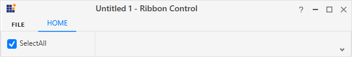

# RibbonCheckBox in WPF Ribbon

[RibbonCheckBox](https://help.syncfusion.com/cr/wpf/Syncfusion.Windows.Tools.Controls.RibbonCheckBox.html) is used to select or unselect options. It provides similar set of functionalities like normal CheckBox control in [Ribbon](https://help.syncfusion.com/cr/wpf/Syncfusion.Windows.Tools.Controls.Ribbon.html).

The following code example illustrates how to use [RibbonCheckBox](https://help.syncfusion.com/cr/wpf/Syncfusion.Windows.Tools.Controls.RibbonCheckBox.html) control in [Ribbon](https://help.syncfusion.com/cr/wpf/Syncfusion.Windows.Tools.Controls.Ribbon.html) instance.





<syncfusion:Ribbon Name="ribbon" HorizontalAlignment="Stretch" VerticalAlignment="Top">
    <syncfusion:RibbonTab Name="ribbonTab1" Caption="HOME"  >
        <syncfusion:RibbonBar Name="ribbonBar1" Header="RibbonBar1">
            <syncfusion:RibbonButton Label="Cut"/>
            <syncfusion:RibbonButton Label="Copy"/>
        </syncfusion:RibbonBar>
        <syncfusion:RibbonBar Name="ribbonBar2" Width="150" Header="RibbonBar2">
            <syncfusion:RibbonCheckBox  Width="140" Content="SelectAll" IsChecked="True"/>
        </syncfusion:RibbonBar>
    </syncfusion:RibbonTab>
    <syncfusion:RibbonTab Caption="EDIT"  IsChecked="False"/>
</syncfusion:Ribbon>





Create instance of [RibbonCheckBox](https://help.syncfusion.com/cr/wpf/Syncfusion.Windows.Tools.Controls.RibbonCheckBox.html) and add it to [RibbonBar](https://help.syncfusion.com/cr/wpf/Syncfusion.Windows.Tools.Controls.RibbonBar.html) through code behind.





RibbonCheckBox ribbonCheckBox = new RibbonCheckBox(){ Content = "SelectAll", IsChecked=true };
ribbonBar2.Items.Add(ribbonCheckBox);





Dim ribbonCheckBox As New RibbonCheckBox() With {
	.Content = "SelectAll",
	.IsChecked=True
}

ribbonBar2.Items.Add(ribbonCheckBox)





## Add CheckBox to the simplified layout

When the simplified layout is enabled, the RibbonCheckBox can be added and displayed in a single line as shown below. To know more about the simplified layout, refer [here](https://help.syncfusion.com/wpf/ribbon/simplifiedlayout).





<syncfusion:RibbonWindow x:Class="RibbonButton_IconTemp.Window1"
        xmlns="http://schemas.microsoft.com/winfx/2006/xaml/presentation"
        xmlns:x="http://schemas.microsoft.com/winfx/2006/xaml"
        xmlns:d="http://schemas.microsoft.com/expression/blend/2008"
        xmlns:mc="http://schemas.openxmlformats.org/markup-compatibility/2006"
        xmlns:local="clr-namespace:RibbonButton_IconTemp" xmlns:skin="clr-namespace:Syncfusion.SfSkinManager;assembly=Syncfusion.SfSkinManager.WPF"
        mc:Ignorable="d" xmlns:syncfusion="http://schemas.syncfusion.com/wpf"
        skin:SfSkinManager.VisualStyle="MaterialLight"
        Title="Untitled 1 - Ribbon Control" Height="450" Width="800">
    <Grid x:Name="grid">
        <syncfusion:Ribbon VerticalAlignment="Top" EnableSimplifiedLayoutMode="True" LayoutMode="Simplified">
            <syncfusion:RibbonTab Caption="HOME"  IsChecked="True">
                <syncfusion:RibbonBar Header="Options">
                    <syncfusion:RibbonCheckBox  Width="140" Content="SelectAll" IsChecked="True"/>
                </syncfusion:RibbonBar>
            </syncfusion:RibbonTab>
        </syncfusion:Ribbon>
    </Grid>
</syncfusion:RibbonWindow>





Ribbon ribbon = new Ribbon();
ribbon.VerticalAlignment = VerticalAlignment.Top;
ribbon.EnableSimplifiedLayoutMode = true;
ribbon.LayoutMode = LayoutMode.Simplified;
// Creating new tabs
RibbonTab homeTab = new RibbonTab();
homeTab.Caption = "Home";
homeTab.IsChecked = true;

// Creating new bar
RibbonBar optionsBar = new RibbonBar();
optionsBar.Header = "Options";

// Creating items
RibbonCheckBox ribbonCheckBox = new RibbonCheckBox() { Content = "SelectAll", IsChecked = true };

// Adding items to bar
optionsBar.Items.Add(ribbonCheckBox);

// Adding bars to the tabs
homeTab.Items.Add(optionsBar);

// Adding tabs to ribbon
ribbon.Items.Add(homeTab);
grid.Children.Add(ribbon);
SfSkinManager.SetVisualStyle(this, VisualStyles.MaterialLight);





When arranging in simplified layout alone, the **Margin**, **Width** and **Height** values of the RibbonCheckBox can be ignored as it will be resized automatically to the standard width and height. If the RibbonCheckBox is to be shown in both normal and simplified layout, the **Margin**, **Width** and **Height** properties can be set for normal layout alone using triggers.





<syncfusion:RibbonCheckBox Content="SelectAll" syncfusion:SimplifiedLayoutSettings.DisplayMode="Normal,Simplified" >
    <syncfusion:RibbonCheckBox.Style>
        
    </syncfusion:RibbonCheckBox.Style>
</syncfusion:RibbonCheckBox > 





## See Also

[How to bind the RibbonCheckBox in WPF Ribbon control with MVVM pattern?](https://github.com/SyncfusionExamples/How-to-bind-the-ribboncheckbox-in-wpf-ribbon-control-with-mvvm-pattern).
