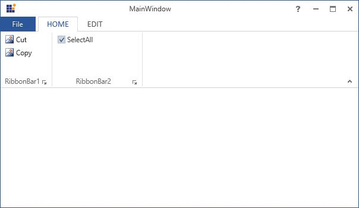

## RibbonCheckBox

RibbonCheckBox is used to select or unselect options from the users in Ribbon instance. RibbonCheckBox control provide similar set of functionalities like normal CheckBox control in Ribbon instance.

The following code example illustrates How to use RibbonCheckBox control in Ribbon instance.



[XAML]

<syncfusion:Ribbon Name="_Ribbon1" HorizontalAlignment="Stretch" VerticalAlignment="Top">

<syncfusion:RibbonTab Name="_RibbonTab1" Caption="HOME"  >

<syncfusion:RibbonBar Name="_RibbonBar1" Header="RibbonBar1">

<syncfusion:RibbonButton   Label="Cut"/>

<syncfusion:RibbonButton   Label="Copy"/>

</syncfusion:RibbonBar>

<syncfusion:RibbonBar  Name="_RibbonBar2" Width="150" Header="RibbonBar2">

<syncfusion:RibbonCheckBox  Width="140" Content="SelectAll" IsChecked="True"></syncfusion:RibbonCheckBox>

</syncfusion:RibbonBar>

</syncfusion:RibbonTab>

<syncfusion:RibbonTab Caption="EDIT"  IsChecked="False"/>

</syncfusion:Ribbon>



Create instance of RibbonCheckBox and add it to RibbonBar Items.



[C#]

RibbonCheckBox _RibbonCheckBox = new RibbonCheckBox(){Content = "SelectAll", IsChecked=true };

_RibbonBar2.Items.Add(_RibbonCheckBox);



