# Quick Access ToolBar in WPF Ribbon

RibbonContextMenu allows to customize the Ribbon with the Right Click and it displays different functions for Ribbon and RibbonItems.





<syncfusion:Ribbon x:Name="Ribbon"  VerticalAlignment="Top">
<syncfusion:Ribbon.QuickAccessToolBar>
<syncfusion:QuickAccessToolBar syncfusion:WindowChrome.IsHitTestVisibleInChrome="True"/>
</syncfusion:Ribbon.QuickAccessToolBar>
<syncfusion:RibbonTab Caption="Home" >
<syncfusion:RibbonBar   Header="Clipboard"  >
<syncfusion:RibbonButton  Label="Paste" SizeForm="Large" LargeIcon="/Resources/Paste32.png"  />
<syncfusion:RibbonButton  Label="Cut" SizeForm="Small" SmallIcon="/Resources/Cut16.png" />
<syncfusion:RibbonButton  Label="Copy" SizeForm="Small"  SmallIcon="/Resources/Copy16.png"  />
<syncfusion:RibbonButton  Label="Format Painter" SizeForm="Small"  
SmallIcon="/Resources/FormatPainter16.png"  />
</syncfusion:RibbonBar>
</syncfusion:RibbonTab>
</syncfusion:Ribbon>





The below RibbonContextMenu gets generated when the user right click on the ribbon

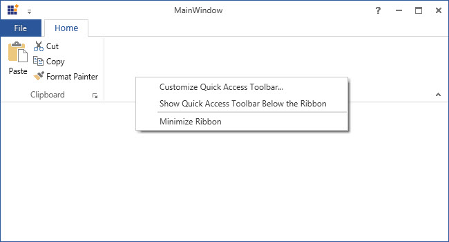

It displays along with "Add to Quick Access ToolBar" function while clicking at the RibbonItem as like in the below screenshot

## Adding custom item to the ContextMenu

Ribbon Context Menu supports display of custom items. To add the custom item, set an attached property called `CustomContextMenuItems` of the RibbonContextMenu





<syncfusion:Ribbon x:Name="Ribbon"  VerticalAlignment="Top" syncfusion:RibbonContextMenu.IsCustomContextMenuItemsOnTop="True" >
<syncfusion:RibbonContextMenu.CustomContextMenuItems >
<syncfusion:RibbonMenuItem Header="Edit" IsCheckable="True" />
<syncfusion:RibbonMenuItem Header="Delete" IsCheckable="True"  />
<syncfusion:RibbonMenuItem Header="Rename" IsCheckable="True"  />
</syncfusion:RibbonContextMenu.CustomContextMenuItems>
</syncfusion:Ribbon>





## How to disable the RibbonContextMenu

In order to disable the ContextMenu handle the `RibbonContextMenuOpening` event





<syncfusion:Ribbon x:Name="Ribbon"  VerticalAlignment="Top"  RibbonContextMenuOpening="Ribbon_ContextMenuOpening">
<syncfusion:Ribbon.QuickAccessToolBar>
<syncfusion:QuickAccessToolBar syncfusion:WindowChrome.IsHitTestVisibleInChrome="True"/>
</syncfusion:Ribbon.QuickAccessToolBar>
<syncfusion:RibbonTab Caption="Home"  >
<syncfusion:RibbonBar Header="Clipboard" >
<syncfusion:RibbonButton Label="Paste" SizeForm="Large"
LargeIcon="/Resources/Paste32.png" />                    
<syncfusion:RibbonButton  Label="Cut" SizeForm="Small"   SmallIcon="/Resources/Cut16.png" />
<syncfusion:RibbonButton  Label="Copy" SizeForm="Small"  SmallIcon="/Resources/Copy16.png"  />
<syncfusion:RibbonButton  Label="Format Painter" SizeForm="Small"  
SmallIcon="/Resources/FormatPainter16.png"  />
</syncfusion:RibbonBar>      
</syncfusion:RibbonTab>
</syncfusion:Ribbon>





private void Ribbon_ContextMenuOpening(object sender, ContextMenuEventArgs e)
{
    e.Handled = true;
}





Private Sub Ribbon_ContextMenuOpening(ByVal sender As Object, ByVal e As ContextMenuEventArgs)
e.Handled = True
End Sub





The following snapshot gets generated before handling the RibbonContextMenu event

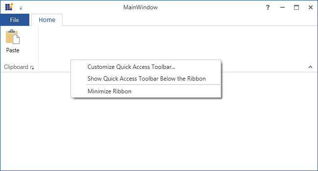

After the event is handled, the output gets display as follows

## Add items to QuickAccessToolBar (QAT)

Quick Access Toolbar is used to group the frequently used commands above or under the Ribbon, and it allows to add or remove commands to it. It is placed next to the ApplicationMenu to provide end users with the easy accessibility.

## Add default QAT items

Use the following code to add items to the QuickAccessToolbar





<syncfusion:Ribbon.QuickAccessToolBar>
<syncfusion:QuickAccessToolBar>
<syncfusion:RibbonButton Label="Undo" SmallIcon="/Resources/Undo16.png" SizeForm="ExtraSmall"   
ToolTip="Undo" syncfusion:RibbonCommandManager.SynchronizedItem="Undo" />
<syncfusion:RibbonButton Label="Redo" SmallIcon="/Resources/Redo16.png" SizeForm="ExtraSmall"
ToolTip="Redo" syncfusion:RibbonCommandManager.SynchronizedItem="Redo"/>
</syncfusion:QuickAccessToolBar>
</syncfusion:Ribbon.QuickAccessToolBar>





RibbonButton RibbonButton = new RibbonButton();
RibbonButton.SmallIcon = new BitmapImage(new Uri("/Resources/Redo16.png", UriKind.Relative));
RibbonButton.SizeForm = SizeForm.ExtraSmall;
QuickAccessToolBar QAT=new QuickAccessToolBar();
QAT.Items.Add(RibbonButton);
Ribbon.QuickAccessToolBar = QAT;





Dim RibbonButton As New RibbonButton()
RibbonButton.SmallIcon = New BitmapImage(New Uri("/Resources/Redo16.png", UriKind.Relative))
RibbonButton.SizeForm = SizeForm.ExtraSmall
Dim QAT As New QuickAccessToolBar()
QAT.Items.Add(RibbonButton)
Ribbon.QuickAccessToolBar = QAT





## Add items to QAT Menu items

Ribbon also supports to add the items to QAT Menu items. To add the items to the Drop Down Menu of the QuickAccessToolBar, use the attached property, `QATMenuItems` of the Quick Access ToolBar .  QATMenuItems can be added to the QAT by making the Selection.





<syncfusion:Ribbon.QuickAccessToolBar>
<syncfusion:QuickAccessToolBar>
<syncfusion:QuickAccessToolBar.QATMenuItems>
<syncfusion:RibbonButton Label="Save" syncfusion:RibbonCommandManager.SynchronizedItem="Save" />
<syncfusion:RibbonButton Label="Quick Print" syncfusion:RibbonCommandManager.SynchronizedItem="Quick Print"/>
<syncfusion:RibbonButton Label="Print Preview" syncfusion:RibbonCommandManager.SynchronizedItem="Print Preview"/>
<syncfusion:RibbonButton Label="Undo" syncfusion:RibbonCommandManager.SynchronizedItem="Undo"  />
<syncfusion:RibbonButton Label="Redo" syncfusion:RibbonCommandManager.SynchronizedItem="Redo" />
<syncfusion:RibbonButton Label="Paste" syncfusion:RibbonCommandManager.SynchronizedItem="Paste"/>
</syncfusion:QuickAccessToolBar.QATMenuItems>
<syncfusion:RibbonButton Label="Undo" SmallIcon="/Resources/Undo16.png" SizeForm="ExtraSmall"   
ToolTip="Undo" syncfusion:RibbonCommandManager.SynchronizedItem="Undo" />
<syncfusion:RibbonButton Label="Redo" SmallIcon="/Resources/Redo16.png" SizeForm="ExtraSmall"
ToolTip="Redo" syncfusion:RibbonCommandManager.SynchronizedItem="Redo"/>
</syncfusion:QuickAccessToolBar>
</syncfusion:Ribbon.QuickAccessToolBar>





RibbonButton pasteRibbonButton = new RibbonButton() { Label = "Paste", SmallIcon = new BitmapImage(new Uri("/Resources/Paste32.png", UriKind.Relative))};
this.Ribbon.QuickAccessToolBar.QATMenuItems.Add(pasteRibbonButton);





Dim pasteRibbonButton As New RibbonButton() With {
	.Label = "Paste",
	.SmallIcon = New BitmapImage(New Uri("/Resources/Paste32.png", UriKind.Relative))
}
Me.Ribbon.QuickAccessToolBar.QATMenuItems.Add(pasteRibbonButton)





The “Paste” QATMenuItem has been selected and it is displayed as one of the items in the QAT. 

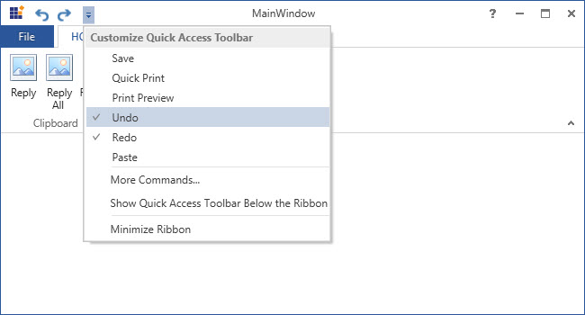

## Add items to QAT customize window

To open QAT Customize Window, select `MoreCommands` option from the ContextMenu of the QAT. In the QAT Customized Window, the list of Commands is available. The Commands can be filtered only from the Particular tab by using `Choose commands from` option. Then, select the Command to add to the QuickAccessToolBar and add commands to the right Pane of the Quick Access ToolBar Dialog by clicking Add Button. Finally click OK.

Finally, the Items gets displayed in the QAT

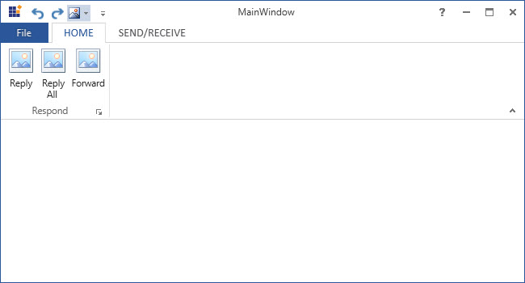

## Add custom QAT items

Ribbon control provides an option to add items to the QAT that will not be present in the Ribbon. These items can be defined in the [`CustomQATItems`](https://help.syncfusion.com/cr/wpf/Syncfusion.Windows.Tools.Controls.QuickAccessToolBar.html#Syncfusion_Windows_Tools_Controls_QuickAccessToolBar_CustomQATItems) collection of the **QuickAccessToolbar** and can be accessed from the QAT Window in the **"Commands Not in the Ribbon"** and **"All Commands"** section. 





<syncfusion:Ribbon.QuickAccessToolBar>
    <syncfusion:QuickAccessToolBar QATDropDownVisiblity="Visible">
        <syncfusion:QuickAccessToolBar.CustomQATItems>
            <syncfusion:RibbonButton Label="Undo" SmallIcon="/Resources/Undo_01.png" />
            <syncfusion:RibbonButton Label="Redo" SmallIcon="/Resources/Redo_01.png" />
            <syncfusion:RibbonButton Label="New" Command="ApplicationCommands.Open" SmallIcon="/Resources/Document-01.png"/>
        </syncfusion:QuickAccessToolBar.CustomQATItems>
    </syncfusion:QuickAccessToolBar>
</syncfusion:Ribbon.QuickAccessToolBar>





RibbonButton undoRibbonButton = new RibbonButton() { Label = "Undo", SmallIcon = new BitmapImage(new Uri("/Resources/Undo_01.png", UriKind.Relative))};
RibbonButton redoRibbonButton = new RibbonButton() { Label = "Redo", SmallIcon = new BitmapImage(new Uri("/Resources/Redo_01.png", UriKind.Relative))};
RibbonButton newRibbonButton = new RibbonButton() { Label = "New", SmallIcon = new BitmapImage(new Uri("/Resources/Document-01.png", UriKind.Relative))};
this.Ribbon.QuickAccessToolBar.CustomQATItems.Add(undoRibbonButton);
this.Ribbon.QuickAccessToolBar.CustomQATItems.Add(redoRibbonButton);
this.Ribbon.QuickAccessToolBar.CustomQATItems.Add(newRibbonButton);





Dim undoRibbonButton As New RibbonButton() With {
	.Label = "Undo",
	.SmallIcon = New BitmapImage(New Uri("/Resources/Undo_01.png", UriKind.Relative))
}
Dim redoRibbonButton As New RibbonButton() With {
	.Label = "Redo",
	.SmallIcon = New BitmapImage(New Uri("/Resources/Redo_01.png", UriKind.Relative))
}
Dim newRibbonButton As New RibbonButton() With {
	.Label = "New",
	.SmallIcon = New BitmapImage(New Uri("/Resources/Document-01.png", UriKind.Relative))
}
Me.Ribbon.QuickAccessToolBar.CustomQATItems.Add(undoRibbonButton)
Me.Ribbon.QuickAccessToolBar.CustomQATItems.Add(redoRibbonButton)
Me.Ribbon.QuickAccessToolBar.CustomQATItems.Add(newRibbonButton)





Once the [`CustomQATItems`](https://help.syncfusion.com/cr/wpf/Syncfusion.Windows.Tools.Controls.QuickAccessToolBar.html#Syncfusion_Windows_Tools_Controls_QuickAccessToolBar_CustomQATItems) are added to the Quick Access Toolbar using the **Add** button, it will be visible in the Ribbon QAT and in the QAT Dropdown menu. The visibility of this item in the Ribbon QAT can be toggled by checking/unchecking from the QAT Dropdown menu. 

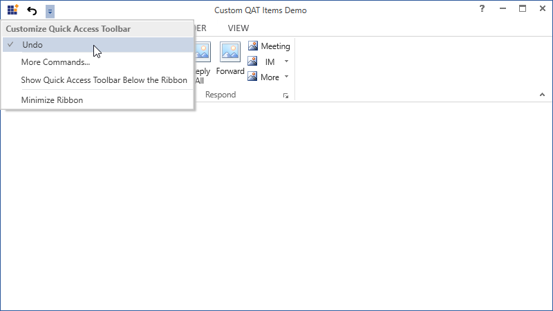

The added [`CustomQATItems`](https://help.syncfusion.com/cr/wpf/Syncfusion.Windows.Tools.Controls.QuickAccessToolBar.html#Syncfusion_Windows_Tools_Controls_QuickAccessToolBar_CustomQATItems) in the QAT Dropdown menu can be removed through the QAT Window using the **Remove** button. 

## Add items from Ribbon context menu		
QAT can also customized by adding the items from the Ribbon ContextMenu. Select Add to Quick Access Toolbar by right clicking the Ribbon item required to add to the QAT. Then, the respective item gets added as one of the items in the QAT.

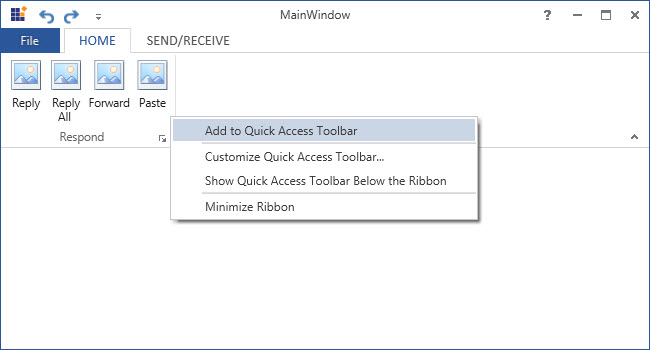

## Add custom items using RibbonItemHost

The control hosted in [`RibbonItemHost`](https://help.syncfusion.com/cr/wpf/Syncfusion.Windows.Tools.Controls.RibbonItemHost.html) can be added to the [`QuickAccessToolBar`](https://help.syncfusion.com/cr/wpf/Syncfusion.Windows.Tools.Controls.QuickAccessToolBar.html) using ribbon context menu or through QAT customization dialog. In the QAT customization dialog, all the ribbon items are displayed using its [`Label`](https://help.syncfusion.com/cr/wpf/Syncfusion.Windows.Tools.Controls.RibbonItemsControl.html#Syncfusion_Windows_Tools_Controls_RibbonItemsControl_Label) and [`IconTemplate`](https://help.syncfusion.com/cr/wpf/Syncfusion.Windows.Tools.Controls.RibbonItemsControl.html#Syncfusion_Windows_Tools_Controls_RibbonItemsControl_IconTemplate) properties. Similarly, the [`RibbonItemHost`](https://help.syncfusion.com/cr/wpf/Syncfusion.Windows.Tools.Controls.RibbonItemHost.html) also allows us to set the label and icon using its [`Label`](https://help.syncfusion.com/cr/wpf/Syncfusion.Windows.Tools.Controls.RibbonItemHost.html#Syncfusion_Windows_Tools_Controls_RibbonItemHost_Label) and [`IconTemplate`](https://help.syncfusion.com/cr/wpf/Syncfusion.Windows.Tools.Controls.RibbonItemHost.html#Syncfusion_Windows_Tools_Controls_RibbonItemHost_IconTemplate) properties respectively.

* [`Label`](https://help.syncfusion.com/cr/wpf/Syncfusion.Windows.Tools.Controls.RibbonItemHost.html#Syncfusion_Windows_Tools_Controls_RibbonItemHost_Label) - Used to display the text of [`RibbonItemHost`](https://help.syncfusion.com/cr/wpf/Syncfusion.Windows.Tools.Controls.RibbonItemHost.html) inside the QAT customization dialog.

* [`IconTemplate`](https://help.syncfusion.com/cr/wpf/Syncfusion.Windows.Tools.Controls.RibbonItemHost.html#Syncfusion_Windows_Tools_Controls_RibbonItemHost_IconTemplate) - Gets or sets the template that is used to display the icon of [`RibbonItemHost`](https://help.syncfusion.com/cr/wpf/Syncfusion.Windows.Tools.Controls.RibbonItemHost.html) inside the QAT customization dialog.

In the below example, the [`Label`](https://help.syncfusion.com/cr/wpf/Syncfusion.Windows.Tools.Controls.RibbonItemHost.html#Syncfusion_Windows_Tools_Controls_RibbonItemHost_Label) and [`IconTemplate`](https://help.syncfusion.com/cr/wpf/Syncfusion.Windows.Tools.Controls.RibbonItemHost.html#Syncfusion_Windows_Tools_Controls_RibbonItemHost_IconTemplate) are set for the [`RibbonItemHost`](https://help.syncfusion.com/cr/wpf/Syncfusion.Windows.Tools.Controls.RibbonItemHost.html) controls which will be used when the items are displayed in the QAT customization dialog. 





<syncfusion:RibbonWindow x:Class="Ribbon.MainWindow"
        xmlns="http://schemas.microsoft.com/winfx/2006/xaml/presentation"
        xmlns:x="http://schemas.microsoft.com/winfx/2006/xaml"
        xmlns:d="http://schemas.microsoft.com/expression/blend/2008"
        xmlns:mc="http://schemas.openxmlformats.org/markup-compatibility/2006"
        xmlns:local="clr-namespace:Ribbon"
        mc:Ignorable="d"
        xmlns:syncfusion="http://schemas.syncfusion.com/wpf"
        xmlns:skin="clr-namespace:Syncfusion.SfSkinManager;assembly=Syncfusion.SfSkinManager.WPF"
        skin:SfSkinManager.Theme="{skin:SkinManagerExtension ThemeName=FluentLight}"
        WindowStartupLocation="CenterScreen" 
        Title="Custom items demo" Height="450" Width="650">
    <syncfusion:RibbonWindow.DataContext>
        <local:ViewModel />
    </syncfusion:RibbonWindow.DataContext>
    <syncfusion:RibbonWindow.Resources>
        <DataTemplate x:Key="OnePage">
            <Grid>
                <Path
                        Width="13"
                        Height="16"
                        Margin="0.5"
                        Data="M0,0 L11,0 11,15 0,15 z"
                        Fill="White"
                        Stretch="Fill" />
                <Path
                         Margin="1"
                         Data="M1,1 L1,15 11,15 11,1 z M0,0 L12,0 12,4.158 12,5.0689998 12,16 0,16 z"
                         Fill="#FF3A3A38"
                         Stretch="Fill" />
                <Path
                         Margin="3"
                         Data="M0,8.9999991 L5.9999999,8.9999991 5.9999999,9.999999 0,9.999999 z M3.2782552E-06,5.9999998 L6.0000033,5.9999998 6.0000033,6.9999996 3.2782552E-06,6.9999996 z M3.2782552E-06,2.9999995 L6.0000033,2.9999995 6.0000033,3.9999995 3.2782552E-06,3.9999995 z M3.4272668E-06,0 L6.0000033,0 6.0000033,0.99999952 3.4272668E-06,0.99999952 z"
                         Fill="#FF797774"
                         Stretch="Fill" />
            </Grid>
        </DataTemplate>
        <DataTemplate x:Key="AlignLeft">
            <Path
                        x:Name="Align_Left1"
                        Width="14"
                        Height="13"
                        Margin="2,0"
                        HorizontalAlignment="Left"
                        VerticalAlignment="Bottom"
                        Data="M0,12 L10,12 10,13 0,13 z M0,8 L14,8 14,9 0,9 z M0,4 L10,4 10,5 0,5 z M0,0 L14,0 14,1 0,1 z"
                        Fill="{Binding RelativeSource={RelativeSource Mode=Self}, Path=(TextBlock.Foreground)}"
                        Stretch="Fill" />
        </DataTemplate>
        <DataTemplate x:Key="Tables">
            <Grid MaxHeight="32" MaxWidth="32">
                <Path
                          Margin="0.5,4.5,0.5,0.5"
                          Data="M0,0 L27,0 27,23 0,23 z"
                          Fill="White"
                          Stretch="Fill" />
                <Path
                          Height="4"
                          Margin="0.5,0.5,0.5,0"
                          VerticalAlignment="Top"
                          Data="M0,0 L27,0 27,4 0,4 z"
                          Fill="#FFC8C6C4"
                          Stretch="Fill" />
                <Path
                          Margin="1,5,1,1"
                          Data="M9,8 L9,14 17,14 17,8 z M8,0 L9,0 9,7 17,7 17,0 18,0 18,7 26,7 26,8 18,8 18,14 26,14 26,15 18,15 18,22 17,22 17,15 9,15 9,22 8,22 8,15 0,15 0,14 8,14&#xa;8,8 0,8 0,7 8,7 z"
                          Fill="#FF797774"
                          Stretch="Fill" />
                <Path
                          Data="M0.99999994,5.0000001 L0.99999994,27 27,27 27,5.0000001 z M0.99999994,1 L0.99999994,4.0000002 27,4.0000002 27,1 z M0,0 L28,0 28,4.0000002 28,5.0000001 28,28 0,28 0,5.0000001 0,4.0000002 z"
                          Fill="#FF3A3A38"
                          Stretch="Fill" />
            </Grid>
        </DataTemplate>
    </syncfusion:RibbonWindow.Resources>
    <Grid>
        <syncfusion:Ribbon x:Name="mainRibbon">
            <syncfusion:RibbonTab Caption="Design">
                <syncfusion:RibbonBar Header="Table Style Options" IconTemplate="{StaticResource Tables}">
                    <syncfusion:RibbonItemHost Label="Header Row" IconTemplate="{StaticResource OnePage}">
                        <syncfusion:RibbonItemHost.ContentTemplate>
                            <DataTemplate>
                                <CheckBox Content="Header Row" Height="22"/>
                            </DataTemplate>
                        </syncfusion:RibbonItemHost.ContentTemplate>
                    </syncfusion:RibbonItemHost>
                    <syncfusion:RibbonItemHost Label="First Column" IconTemplate="{StaticResource AlignLeft}">
                        <syncfusion:RibbonItemHost.ContentTemplate>
                            <DataTemplate>
                                <RadioButton Margin="4,0,0,0" Content="First Column" Height="22"/>
                            </DataTemplate>
                        </syncfusion:RibbonItemHost.ContentTemplate>
                    </syncfusion:RibbonItemHost>
                </syncfusion:RibbonBar>
            </syncfusion:RibbonTab>
            <syncfusion:Ribbon.QuickAccessToolBar>
                <syncfusion:QuickAccessToolBar/>
            </syncfusion:Ribbon.QuickAccessToolBar>
            <syncfusion:Ribbon.BackStage>
                <syncfusion:Backstage>
                    <syncfusion:BackStageCommandButton Header="Save" >
                        <syncfusion:BackStageCommandButton.IconTemplate>
                            <DataTemplate>
                                <Path Width="12" Height="12" HorizontalAlignment="Center" VerticalAlignment="Center"
                         Data="M5.0000019,11 L5.0000019,15 11.000002,15 11.000002,11 z M4.0000019,1 L4.0000019,6 12.000002,6 12.000002,1 z M1,1 L1,13.174 2.7160001,15 4.0000019,15 4.0000019,10 12.000002,10 12.000002,15 15,15 15,1 13.000002,1 13.000002,7 3.0000019,7 3.0000019,1 z M0,0 L3.0000019,0 13.000002,0 16,0 16,16 12.000002,16 4.0000019,16 2.2840004,16 0,13.57 z"
                         Fill="{Binding RelativeSource={RelativeSource Mode=Self}, Path=(TextBlock.Foreground)}" Stretch="Uniform" />
                            </DataTemplate>
                        </syncfusion:BackStageCommandButton.IconTemplate>
                    </syncfusion:BackStageCommandButton>
                    <syncfusion:BackStageCommandButton Header="Close" >
                        <syncfusion:BackStageCommandButton.IconTemplate>
                            <DataTemplate>
                                <Grid Width="12" Height="12" HorizontalAlignment="Center" VerticalAlignment="Center" SnapsToDevicePixels="true">
                                    <Path
                                        Width="12" Height="12" HorizontalAlignment="Center" VerticalAlignment="Center"
                                        Data="M1.4139423,0L7.0029922,5.5845888 12.592018,0 14.006015,1.4149939 8.4180527,6.9985202 14.006,12.582007 12.591996,13.997001 7.0030056,8.4124444 1.4140122,13.997001 1.5026823E-05,12.582007 5.5879484,6.9985092 0,1.4149939z "
                                        Fill="{Binding RelativeSource={RelativeSource Mode=Self}, Path=(TextBlock.Foreground)}" 
                                        SnapsToDevicePixels="True" Stretch="Fill" />
                                </Grid>
                            </DataTemplate>
                        </syncfusion:BackStageCommandButton.IconTemplate>
                    </syncfusion:BackStageCommandButton>
                </syncfusion:Backstage>
            </syncfusion:Ribbon.BackStage>
        </syncfusion:Ribbon>
    </Grid>
</syncfusion:RibbonWindow>





To know more about the [`RibbonItemHost`](https://help.syncfusion.com/cr/wpf/Syncfusion.Windows.Tools.Controls.RibbonItemHost.html), refer [here](https://help.syncfusion.com/wpf/ribbon/ribbonitemhost).

## Add custom RibbonTab and RibbonBar

The following section illustrates how to customize Ribbon at the run time

### QAT customized window

This topic illustrates in detail about the QAT topic.

First, select MoreCommands option from the QAT to open the QAT Customized Window.

QAT can be Customized further by using the following options

1. Add

	In the QAT Customized window, the list of Commands is available. The Commands can be filtered only from the Particular tab by using `Choose commands from` option. Then, select the commands to be added to the QAT and add the command to Right Pane of the QAT Dialog by clicking `Add` Button. Finally, Click OK. Now, the selected command gets added in the QAT.

	

	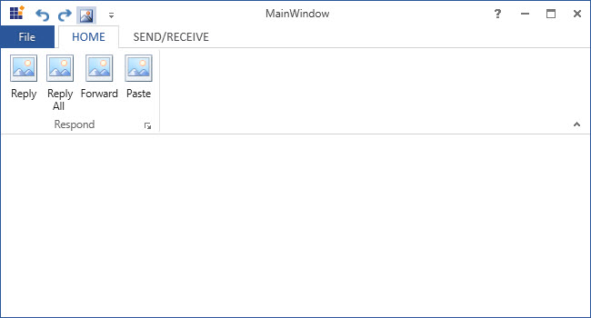

2. Remove

	QAT items can be removed at the Run time. In the QAT Customize window, select the Command to be deleted from the QAT Dialog,and then click Remove Button. In the following screenshot, Redo command gets deleted and the output is changed according to it.

	

	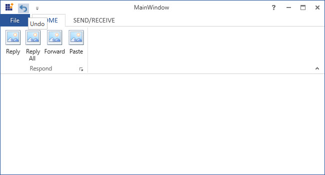

3. Reset

	To restore the QAT to its default content, use this `Reset` option.

	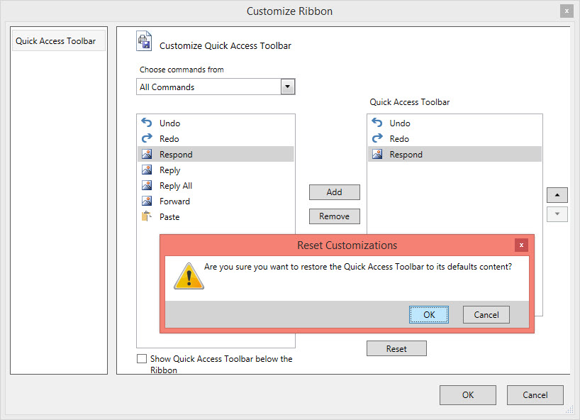

4. Reorder

	QAT also supports to reorder the items by clicking the Up and down arrow at the left of the QAT Dialog. 

	

	

### Customize Ribbon with RibbonTab and RibbonBar

QAT can also support to customize Ribbon Tab and RibbonBar while running. To customize the Ribbon, enable the `ShowCustomizeRibbon` property of the Ribbon to `true` and follow the steps. 

1. Click the Quick Access Toolbar drop-down button and click the `MoreCommands` menu.

2. Then, select the `Customize Ribbon` options from the left-side column.

3. You can add `RibbonTab` and `RibbonBar` by selecting New Tab and New Group Options Respectively.

	

4. To move the tab up and down, select the tab to be moved and click the button at the right-side corner accordingly. Similarly, the group can be moved within the tab.

5. By using the `Rename` option, rename any particular Tab/Group present in the Ribbon by selecting it.

	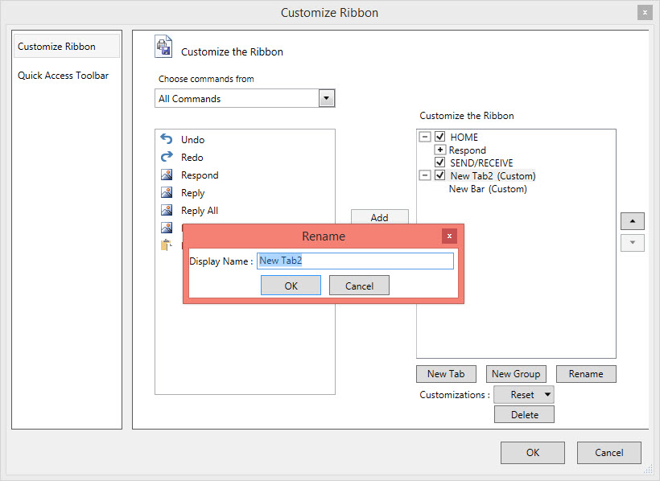

6. The visibility of any particular Tab can be changed by enabling the checkbox of the corresponding selection.

	

7. By using `Delete` option, the Custom RibbonBar and RibbonTab can be deleted. But, this option does not work in the case of original content.

	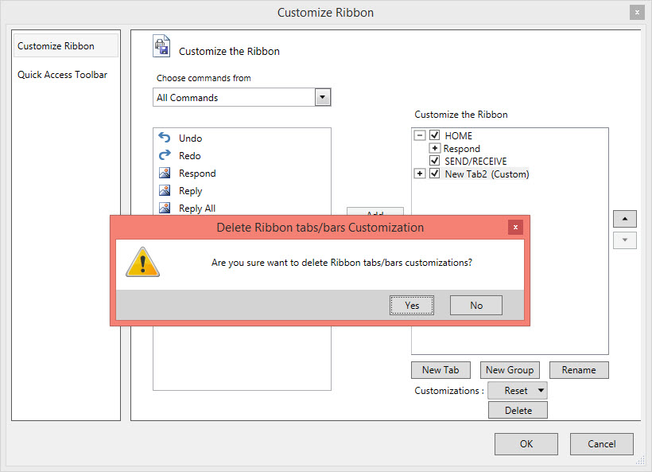

8. To delete all the Ribbon Customization, use `Reset All Customization` from the Reset Drop Down Menu.

	

After customizing the RibbonTab and RibbonBar, RibbonItems can be customized. Customizing Ribbon Item concepts are explained as follows.

## Add items to the customized RibbonTab

The steps to customize the Ribbon Item are as follows

1. The `Choose commands from` drop-down list is used to filter the commands only from the Particular Tab.

2.  To add the item under the right-side column of a newly added `RibbonBar` and `RibbonTab`, select the item from left-side column and click the `Add` button.

	

3. Also, the Ribbon Item from the RibbonBar can be removed that is added recently by using `Remove` option

	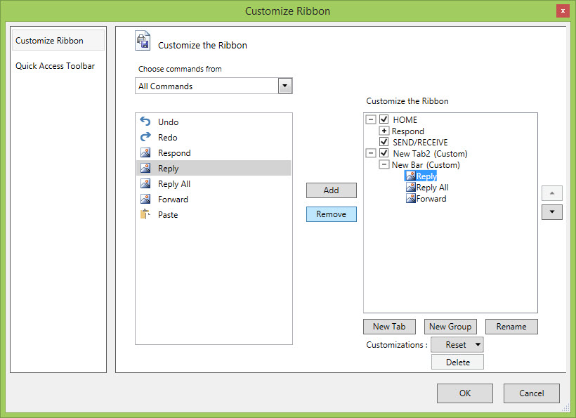

4. The order of the RibbonItem within the RibbonBar can be changed by using `Up` and `Down` arrow

5. By using the Rename option,the RibbonItem can be renamed

	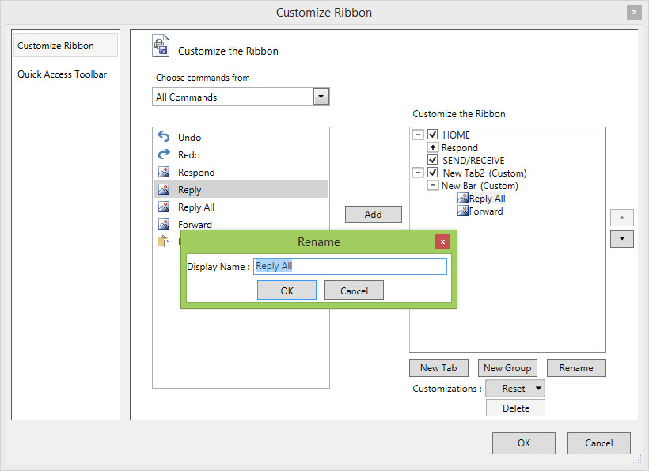

6. Click `OK` button. The Changes are reflected in the output window.

	

## How to disable the customization in Ribbon

To disable the customization in the Ribbon, set `ShowCustomizeRibbon` property of the Ribbon as `False` 





<syncfusion:Ribbon  VerticalAlignment="Top" x:Name="Ribbon" ShowCustomizeRibbon="False">
<syncfusion:Ribbon.QuickAccessToolBar>
<syncfusion:QuickAccessToolBar >
<syncfusion:RibbonButton Label="Undo" SmallIcon="/Resources/Undo16.png" SizeForm="ExtraSmall"   
ToolTip="Undo" syncfusion:RibbonCommandManager.SynchronizedItem="Undo" />
<syncfusion:RibbonButton Label="Redo" SmallIcon="/Resources/Redo16.png" SizeForm="ExtraSmall"
ToolTip="Redo" syncfusion:RibbonCommandManager.SynchronizedItem="Redo"/>
</syncfusion:QuickAccessToolBar>
</syncfusion:Ribbon.QuickAccessToolBar>
<syncfusion:RibbonTab  Caption="HOME" >
<syncfusion:RibbonBar  Header="Respond">
<syncfusion:RibbonButton Label="Reply" SizeForm="Large"/>
<syncfusion:RibbonButton Label="Reply All" SizeForm="Large"/>
<syncfusion:RibbonButton Label="Forward" SizeForm="Large"/>
<syncfusion:RibbonButton   Label="Paste" SizeForm="Large" SmallIcon="/Resources/Paste32.png" syncfusion:RibbonCommandManager.SynchronizedItem="Paste" />
</syncfusion:RibbonBar>
</syncfusion:RibbonTab>
<syncfusion:RibbonTab Caption="SEND/RECIEVE"/>
</syncfusion:Ribbon>





In the following screenshot, customizing Ribbon is disabled and it shows only the QAT Customize window

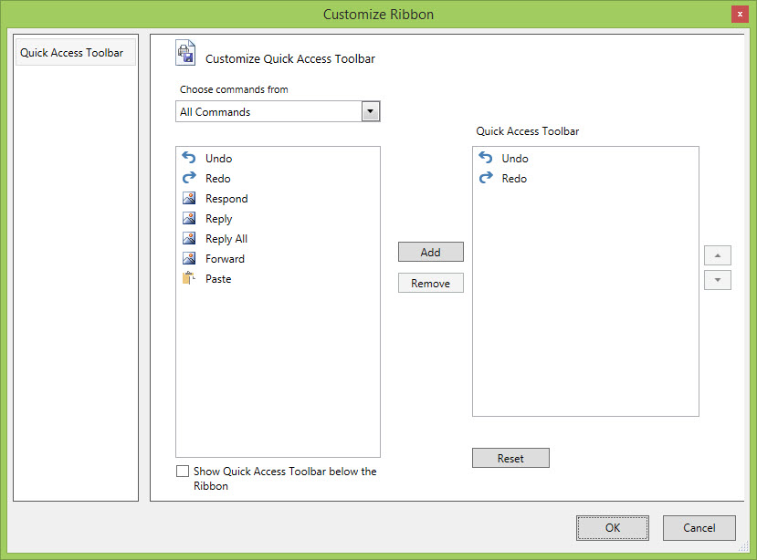

