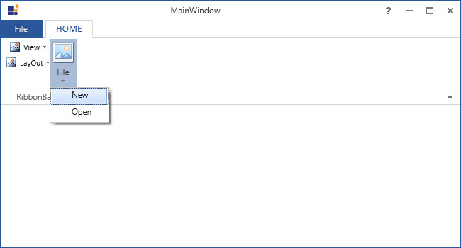
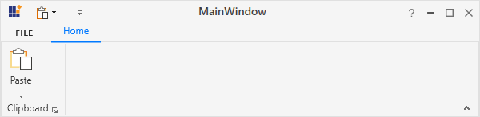
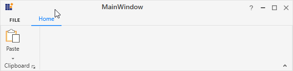

# RibbonDropDownButton

DropDownButton appears like normal button that contains a drop arrow. It displays some items, while click on it. It accepts `DropDownMenuItem` as its children.

## Add DropDownMenuItem

DropDownMenuItem are the items with `Header` property that is used to set header.





<syncfusion:Ribbon Name="_ribbon" HorizontalAlignment="Stretch" VerticalAlignment="Top">
<syncfusion:RibbonTab Caption="HOME" >
<syncfusion:RibbonBar Name="_ribbonBar1">
<syncfusion:DropDownButton Label="View"/>
<syncfusion:DropDownButton Label="LayOut"/>
<syncfusion:DropDownButton Name="_dropDownButton" SizeForm = "Large" Width="100" Label="File" >
<syncfusion:DropDownMenuItem Header="New"></syncfusion:DropDownMenuItem>
<syncfusion:DropDownMenuItem Header="Open"></syncfusion:DropDownMenuItem>
</syncfusion:DropDownButton>
</syncfusion:RibbonBar>
</syncfusion:RibbonTab>
</syncfusion:Ribbon>





Create instance of `DropDownMenuItems` and add it to DropDownButton Items in code behind.





DropDownMenuItem _dropDownMenuItem1 = new DropDownMenuItem() {Header="New" };
DropDownMenuItem _dropDownMenuItem2 = new DropDownMenuItem() { Header = "Open" };
_dropDownButton.Items.Add(_dropDownMenuItem1);
_dropDownButton.Items.Add(_dropDownMenuItem2);





Dim _dropDownMenuItem1 As New DropDownMenuItem() With {.Header="New"}
Dim _dropDownMenuItem2 As New DropDownMenuItem() With {.Header = "Open"}
_dropDownButton.Items.Add(_dropDownMenuItem1)
_dropDownButton.Items.Add(_dropDownMenuItem2)





## Add DropDownMenuItem to DropDownMenuGroup

In DropDownButton, similar items can be grouped together and separated from other menu items using `DropDownMenuGroup`.





<syncfusion:Ribbon Name="_ribbon" HorizontalAlignment="Stretch" VerticalAlignment="Top">
<syncfusion:RibbonTab Caption="HOME" IsChecked="True">
<syncfusion:RibbonBar Name="_ribbonBar">
<syncfusion:DropDownButton Label="View"/>
<syncfusion:DropDownButton Label="LayOut"/>
<syncfusion:DropDownButton Name="_dropDownButton" SizeForm = "Large" Width="100" Label="File" >
<syncfusion:DropDownMenuGroup Name="_dropDownMenuGroup1" Header="Group1">
<syncfusion:DropDownMenuItem Header="New"/>
<syncfusion:DropDownMenuItem Header="Open"/>                            
</syncfusion:DropDownMenuGroup>
<syncfusion:DropDownMenuGroup Name="_dropDownMenuGroup2" Header="Group2">
<syncfusion:DropDownMenuItem Header="Cut"/>
<syncfusion:DropDownMenuItem Header="Copy"/>                      
</syncfusion:DropDownMenuGroup>
</syncfusion:DropDownButton>
</syncfusion:RibbonBar>
</syncfusion:RibbonTab>
<syncfusion:RibbonTab IsChecked="False" Caption="DESIGN"/>
</syncfusion:Ribbon>





Create instance of `DropDownMenuItem` and add it to `DropDownMenuGroup` Items.





DropDownMenuItem _dropDownMenuItem1 = new DropDownMenuItem() { Header = "New" };
DropDownMenuItem _dropDownMenuItem2 = new DropDownMenuItem() { Header = "Open" };
DropDownMenuItem _DropDownMenuItem3 = new DropDownMenuItem() { Header = "Cut" };
DropDownMenuItem _DropDownMenuItem4 = new DropDownMenuItem() { Header = "Copy" };
_dropDownMenuGroup1.Items.Add(_dropDownMenuItem1);
_dropDownMenuGroup1.Items.Add(_dropDownMenuItem2);
_dropDownMenuGroup2.Items.Add(_dropDownMenuItem3);
_dropDownMenuGroup2.Items.Add(_dropDownMenuItem4);





Dim _dropDownMenuItem1 As New DropDownMenuItem() With {.Header = "New"}
Dim _dropDownMenuItem2 As New DropDownMenuItem() With {.Header = "Open"}
Dim _DropDownMenuItem3 As New DropDownMenuItem() With {.Header = "Cut"}
Dim _DropDownMenuItem4 As New DropDownMenuItem() With {.Header = "Copy"}
_dropDownMenuGroup1.Items.Add(_dropDownMenuItem1)
_dropDownMenuGroup1.Items.Add(_dropDownMenuItem2)
_dropDownMenuGroup2.Items.Add(_dropDownMenuItem3)
_dropDownMenuGroup2.Items.Add(_dropDownMenuItem4)





## Set various sizes for DropDownButton

[`DropDownButton`](https://help.syncfusion.com/cr/wpf/Syncfusion.Windows.Tools.Controls.DropDownButton.html) supports three types of size modes and it can be set using the [`SizeForm`](https://help.syncfusion.com/cr/wpf/Syncfusion.Windows.Tools.Controls.RibbonButton.html#Syncfusion_Windows_Tools_Controls_RibbonButton_SizeForm) property. The different [`SizeForm`](https://help.syncfusion.com/cr/wpf/Syncfusion.Windows.Tools.SizeForm.html) available are as follows:

 * **ExtraSmall** - Displays only the image in 16 * 16 size.
 * **Small** - Displays the label and the image in 16 * 16 size.
 * **Large** - Displays the label and the image in 32 * 32 size.





<syncfusion:RibbonBar Name="_ribbonBar2">
<syncfusion:DropDownButton SizeForm = "Large" Label="Large" />
<syncfusion:DropDownButton SizeForm = "Small" Label="Small" />
<syncfusion:DropDownButton SizeForm = "ExtraSmall" Label="ExtraSmall" />
</syncfusion:RibbonBar>





DropDownButton _dropDownButton1 = new DropDownButton() { Label = "Large", SizeForm = SizeForm.Large };
DropDownButton _dropDownButton2 = new DropDownButton() { Label = "Small", SizeForm = SizeForm.Small };
DropDownButton _dropDownButton3 = new DropDownButton() { Label = "ExtraSmall", SizeForm = SizeForm.ExtraSmall };
_ribbonBar2.Items.Add(_dropDownButton1);
_ribbonBar2.Items.Add(_dropDownButton2);
_ribbonBar2.Items.Add(_dropDownButton3);





Dim _dropDownButton1 As New DropDownButton() With {
	.Label = "Large",
	.SizeForm = SizeForm.Large
}

Dim _dropDownButton2 As New DropDownButton() With {
	.Label = "Small",
	.SizeForm = SizeForm.Small
}

Dim _dropDownButton3 As New DropDownButton() With {
	.Label = "ExtraSmall",
	.SizeForm = SizeForm.ExtraSmall
}
_ribbonBar2.Items.Add(_dropDownButton1)
_ribbonBar2.Items.Add(_dropDownButton2)
_ribbonBar2.Items.Add(_dropDownButton3)





N>When **simplified** layout is set, [`DropDownButton`](https://help.syncfusion.com/cr/wpf/Syncfusion.Windows.Tools.Controls.DropDownButton.html) displays the image in 20 * 20 size irrespective of the size form. Also, the text in the **Large** size form will appear to the right of the image.

## Setting image to DropDownButton

 The [`DropDownButton`](https://help.syncfusion.com/cr/wpf/Syncfusion.Windows.Tools.Controls.DropDownButton.html) allows to display any type of image such as glyph, font or any custom content using the [`IconTemplateSelector`](https://help.syncfusion.com/cr/wpf/Syncfusion.Windows.Tools.Controls.RibbonItemsControl.html#Syncfusion_Windows_Tools_Controls_RibbonItemsControl_IconTemplateSelector) and [`IconTemplate`](https://help.syncfusion.com/cr/wpf/Syncfusion.Windows.Tools.Controls.RibbonItemsControl.html#Syncfusion_Windows_Tools_Controls_RibbonItemsControl_IconTemplate) property, which are the preferred options. It allows to display a normal image or vector image using the [`IconType`](https://help.syncfusion.com/cr/wpf/Syncfusion.Windows.Tools.Controls.RibbonItemsControl.html#Syncfusion_Windows_Tools_Controls_RibbonItemsControl_IconType) enumeration property. The default value of the [`IconType`](https://help.syncfusion.com/cr/wpf/Syncfusion.Windows.Tools.Controls.RibbonItemsControl.html#Syncfusion_Windows_Tools_Controls_RibbonItemsControl_IconType) property is **"Icon"**. The [`IconType`](https://help.syncfusion.com/cr/wpf/Syncfusion.Windows.Tools.IconType.html) enumeration has the following values:

* **Icon** - Gets the detail of the icon path from the [`SmallIcon`](https://help.syncfusion.com/cr/wpf/Syncfusion.Windows.Tools.Controls.RibbonItemsControl.html#Syncfusion_Windows_Tools_Controls_RibbonItemsControl_SmallIcon), [`MediumIcon`](https://help.syncfusion.com/cr/wpf/Syncfusion.Windows.Tools.Controls.RibbonItemsControl.html#Syncfusion_Windows_Tools_Controls_RibbonItemsControl_MediumIcon) or [`LargeIcon`](https://help.syncfusion.com/cr/wpf/Syncfusion.Windows.Tools.Controls.RibbonItemsControl.html#Syncfusion_Windows_Tools_Controls_RibbonItemsControl_LargeIcon) properties and sets it to the DropDownButton.
* **VectorImage** - Gets the details of the icon’s path data from the [`VectorImage`](https://help.syncfusion.com/cr/wpf/Syncfusion.Windows.Tools.Controls.RibbonItemsControl.html#Syncfusion_Windows_Tools_Controls_RibbonItemsControl_VectorImage) property and sets it to the DropDownButton.

 N> The [`DropDownButton`](https://help.syncfusion.com/cr/wpf/Syncfusion.Windows.Tools.Controls.DropDownButton.html) loads icon in the following priority order,
 * [`IconTemplateSelector`](https://help.syncfusion.com/cr/wpf/Syncfusion.Windows.Tools.Controls.RibbonItemsControl.html#Syncfusion_Windows_Tools_Controls_RibbonItemsControl_IconTemplateSelector) 
 * [`IconTemplate`](https://help.syncfusion.com/cr/wpf/Syncfusion.Windows.Tools.Controls.RibbonItemsControl.html#Syncfusion_Windows_Tools_Controls_RibbonItemsControl_IconTemplate)
 * [`VectorImage`](https://help.syncfusion.com/cr/wpf/Syncfusion.Windows.Tools.Controls.RibbonItemsControl.html#Syncfusion_Windows_Tools_Controls_RibbonItemsControl_VectorImage)
 * [`LargeIcon`](https://help.syncfusion.com/cr/wpf/Syncfusion.Windows.Tools.Controls.RibbonItemsControl.html#Syncfusion_Windows_Tools_Controls_RibbonItemsControl_LargeIcon)
 * [`MediumIcon`](https://help.syncfusion.com/cr/wpf/Syncfusion.Windows.Tools.Controls.RibbonItemsControl.html#Syncfusion_Windows_Tools_Controls_RibbonItemsControl_MediumIcon) 
 * [`SmallIcon`](https://help.syncfusion.com/cr/wpf/Syncfusion.Windows.Tools.Controls.RibbonItemsControl.html#Syncfusion_Windows_Tools_Controls_RibbonItemsControl_SmallIcon)

### Setting icon template selector

The [`IconTemplateSelector`](https://help.syncfusion.com/cr/wpf/Syncfusion.Windows.Tools.Controls.RibbonItemsControl.html#Syncfusion_Windows_Tools_Controls_RibbonItemsControl_IconTemplateSelector) property provides support to specify a different data template based on the value of the [`SizeForm`](https://help.syncfusion.com/cr/wpf/Syncfusion.Windows.Tools.Controls.RibbonItemsControl.html#Syncfusion_Windows_Tools_Controls_RibbonItemsControl_SizeForm) or [`LayoutMode`](https://help.syncfusion.com/cr/wpf/Syncfusion.Windows.Tools.Controls.Ribbon.html#Syncfusion_Windows_Tools_Controls_Ribbon_LayoutMode) properties. For simplified layout, the template content will be resized to 20 * 20 size which is the standard. 

 

 

 <syncfusion:RibbonWindow x:Class="WpfApp1.MainWindow"
        xmlns="http://schemas.microsoft.com/winfx/2006/xaml/presentation"
        xmlns:x="http://schemas.microsoft.com/winfx/2006/xaml"
        xmlns:d="http://schemas.microsoft.com/expression/blend/2008"
        xmlns:mc="http://schemas.openxmlformats.org/markup-compatibility/2006"
        xmlns:local="clr-namespace:WpfApp1"
        mc:Ignorable="d" xmlns:syncfusion="http://schemas.syncfusion.com/wpf"
        xmlns:skin="clr-namespace:Syncfusion.SfSkinManager;assembly=Syncfusion.SfSkinManager.WPF"
        skin:SfSkinManager.VisualStyle="MaterialLight"
        Title="MainWindow" Height="450" Width="600">
    <syncfusion:RibbonWindow.Resources>
        <DataTemplate x:Key="dropDownButtonSmallIconTemplate">
            <Grid Width="16" Height="16">
                <Path Margin="0.5,4.5,0.5,0.5" Data="M0,0 L27,0 27,23 0,23 z" Fill="White" Stretch="Fill" />
                <Path Height="4" Margin="0.5,0.5,0.5,0" VerticalAlignment="Top" Data="M0,0 L27,0 27,4 0,4 z" Fill="#FFC8C6C4" Stretch="Fill" />
                <Path Data="M9,8 L9,14 17,14 17,8 z M8,0 L9,0 9,7 17,7 17,0 18,0 18,7 26,7 26,8 18,8 18,14 26,14 26,15 18,15 18,22 17,22 17,15 9,15 9,22 8,22 8,15 0,15 0,14 8,14&#xa;8,8 0,8 0,7 8,7 z"
                      Margin="1,5,1,1" Fill="#FF797774" Stretch="Fill" />
                <Path Data="M0.99999994,5.0000001 L0.99999994,27 27,27 27,5.0000001 z M0.99999994,1 L0.99999994,4.0000002 27,4.0000002 27,1 z M0,0 L28,0 28,4.0000002 28,5.0000001 28,28 0,28 0,5.0000001 0,4.0000002 z"
                      Fill="#FF3A3A38" Stretch="Fill" />
            </Grid>
        </DataTemplate>
        <DataTemplate x:Key="dropDownButtonLargeIconTemplate">
            <Grid Margin="2">
                <Path Margin="0.5,4.5,0.5,0.5" Data="M0,0 L27,0 27,23 0,23 z" Fill="White" Stretch="Fill" />
                <Path Height="4" Margin="0.5,0.5,0.5,0" VerticalAlignment="Top" Data="M0,0 L27,0 27,4 0,4 z" Fill="#FFC8C6C4" Stretch="Fill" />
                <Path Data="M9,8 L9,14 17,14 17,8 z M8,0 L9,0 9,7 17,7 17,0 18,0 18,7 26,7 26,8 18,8 18,14 26,14 26,15 18,15 18,22 17,22 17,15 9,15 9,22 8,22 8,15 0,15 0,14 8,14&#xa;8,8 0,8 0,7 8,7 z"
                      Margin="1,5,1,1" Fill="#FF797774" Stretch="Fill" />
                <Path Data="M0.99999994,5.0000001 L0.99999994,27 27,27 27,5.0000001 z M0.99999994,1 L0.99999994,4.0000002 27,4.0000002 27,1 z M0,0 L28,0 28,4.0000002 28,5.0000001 28,28 0,28 0,5.0000001 0,4.0000002 z"
                      Fill="#FF3A3A38" Stretch="Fill" />
            </Grid>
        </DataTemplate>
        <local:DropDownButtonIconTemplateSelector x:Key="dropDownButtonIconTemplateSelector"
                                    SmallTemplate="{StaticResource dropDownButtonSmallIconTemplate}"
                                    LargeTemplate="{StaticResource dropDownButtonLargeIconTemplate}"/>
    </syncfusion:RibbonWindow.Resources>
    <Grid>
        <syncfusion:Ribbon VerticalAlignment="Top">
            <syncfusion:Ribbon.QuickAccessToolBar>
                <syncfusion:QuickAccessToolBar/>
            </syncfusion:Ribbon.QuickAccessToolBar>
            <syncfusion:RibbonTab Caption="Home">
                <syncfusion:RibbonBar Header="Tables">
                    <syncfusion:DropDownButton Label="Tables" SizeForm="Large" IconTemplateSelector="{StaticResource dropDownButtonIconTemplateSelector}"/>
                </syncfusion:RibbonBar>
            </syncfusion:RibbonTab>
        </syncfusion:Ribbon>
    </Grid>
 </syncfusion:RibbonWindow>

 

 

 public class DropDownButtonIconTemplateSelector : DataTemplateSelector
 {
    public DataTemplate SmallTemplate { get; set; }
    public DataTemplate LargeTemplate { get; set; }
    public override DataTemplate SelectTemplate(object item, DependencyObject container)
    {
        var item1 = (container as ContentPresenter);
        DropDownButton dropDownButton = (item1.TemplatedParent as DropDownButton);
        if (dropDownButton != null)
        {
            if (dropDownButton.SizeForm == SizeForm.Small || dropDownButton.SizeForm == SizeForm.ExtraSmall)
            {
                return SmallTemplate;
            }
            else if (dropDownButton.SizeForm == SizeForm.Large)
            {
                return LargeTemplate;
            }
        }
        return LargeTemplate;
    }
 }

 

 

 

 N> [View sample in GitHub](https://github.com/SyncfusionExamples/syncfusion-wpf-ribbon-examples/tree/main/Samples/Setting-icons-using-IconTemplate)

### Setting icon template

The [`IconTemplate`](https://help.syncfusion.com/cr/wpf/Syncfusion.Windows.Tools.Controls.RibbonItemsControl.html#Syncfusion_Windows_Tools_Controls_RibbonItemsControl_IconTemplate) property provides support to set any type of image such as glyph, font or any custom content to the [`DropDownButton`](https://help.syncfusion.com/cr/wpf/Syncfusion.Windows.Tools.Controls.DropDownButton.html). The [`DropDownButton`](https://help.syncfusion.com/cr/wpf/Syncfusion.Windows.Tools.Controls.DropDownButton.html) will automatically resize the template content according to its [`SizeForm`](https://help.syncfusion.com/cr/wpf/Syncfusion.Windows.Tools.Controls.RibbonItemsControl.html#Syncfusion_Windows_Tools_Controls_RibbonItemsControl_SizeForm). For simplified layout, the template content will be resized to 20 * 20 size which is the standard. 





 <syncfusion:RibbonWindow x:Class="WpfApp1.MainWindow"
        xmlns="http://schemas.microsoft.com/winfx/2006/xaml/presentation"
        xmlns:x="http://schemas.microsoft.com/winfx/2006/xaml"
        xmlns:d="http://schemas.microsoft.com/expression/blend/2008"
        xmlns:mc="http://schemas.openxmlformats.org/markup-compatibility/2006"
        xmlns:local="clr-namespace:WpfApp1"
        mc:Ignorable="d" xmlns:syncfusion="http://schemas.syncfusion.com/wpf"
        xmlns:skin="clr-namespace:Syncfusion.SfSkinManager;assembly=Syncfusion.SfSkinManager.WPF"
        skin:SfSkinManager.VisualStyle="MaterialLight"
        Title="MainWindow" Height="450" Width="600">
    <Grid>
        <syncfusion:Ribbon VerticalAlignment="Top">
            <syncfusion:RibbonTab Caption="Home">
                <syncfusion:RibbonBar Header="Tables">
                    <syncfusion:DropDownButton Label="Tables" SizeForm="Large">
                        <syncfusion:DropDownButton.IconTemplate>
                            <DataTemplate>
                                <Grid MaxHeight="32" MaxWidth="32">
                                    <Path
                                         Margin="0.5,4.5,0.5,0.5" Data="M0,0 L27,0 27,23 0,23 z" Fill="White" Stretch="Fill" />
                                    <Path
                                        Height="4" Margin="0.5,0.5,0.5,0" VerticalAlignment="Top" Data="M0,0 L27,0 27,4 0,4 z" Fill="#FFC8C6C4" Stretch="Fill" />
                                    <Path
                                        Data="M9,8 L9,14 17,14 17,8 z M8,0 L9,0 9,7 17,7 17,0 18,0 18,7 26,7 26,8 18,8 18,14 26,14 26,15 18,15 18,22 17,22 17,15 9,15 9,22 8,22 8,15 0,15 0,14 8,14&#xa;8,8 0,8 0,7 8,7 z"
                                        Margin="1,5,1,1" Fill="#FF797774" Stretch="Fill" />
                                    <Path
                                        Data="M0.99999994,5.0000001 L0.99999994,27 27,27 27,5.0000001 z M0.99999994,1 L0.99999994,4.0000002 27,4.0000002 27,1 z M0,0 L28,0 28,4.0000002 28,5.0000001 28,28 0,28 0,5.0000001 0,4.0000002 z"
                                        Fill="#FF3A3A38" Stretch="Fill" />
                                </Grid>
                            </DataTemplate>
                        </syncfusion:DropDownButton.IconTemplate>
                    </syncfusion:DropDownButton>
                </syncfusion:RibbonBar>
            </syncfusion:RibbonTab>
        </syncfusion:Ribbon>
    </Grid>
 </syncfusion:RibbonWindow>

 

 

 Ribbon ribbon = new Ribbon();
 ribbon.VerticalAlignment = VerticalAlignment.Top;
 // Creating new tabs
 RibbonTab homeTab = new RibbonTab();
 homeTab.Caption = "Home";
 homeTab.IsChecked = true;
 
 // Creating new bar
 RibbonBar tablesBar = new RibbonBar();
 tablesBar.Header = "Tables";
 // Creating items
 DropDownButton tablesButton = new DropDownButton();
 tablesButton.Label = "Tables";
 tablesButton.SizeForm = SizeForm.Large;
 
 DataTemplate iconDataTemplate = new DataTemplate();
 FrameworkElementFactory gridElement = new FrameworkElementFactory(typeof(Grid));
 FrameworkElementFactory pathElement1 = new FrameworkElementFactory(typeof(Path));
 FrameworkElementFactory pathElement2 = new FrameworkElementFactory(typeof(Path));
 FrameworkElementFactory pathElement3 = new FrameworkElementFactory(typeof(Path));
 
 gridElement.SetValue(Grid.MarginProperty, new Thickness(2));
 pathElement1.SetValue(Path.DataProperty, Geometry.Parse("M0,0 L27,0 27,23 0,23 z"));
 pathElement1.SetValue(Path.MarginProperty, new Thickness(0.5, 4.5, 0.5, 0.5));
 pathElement1.SetValue(Path.FillProperty, new SolidColorBrush(Colors.White));
 pathElement1.SetValue(Path.StretchProperty, Stretch.Fill);
 
 pathElement2.SetValue(Path.DataProperty, Geometry.Parse("M0,0 L27,0 27,4 0,4 z"));
 pathElement2.SetValue(Path.MarginProperty, new Thickness(0.5, 0.5, 0.5, 0));
 pathElement2.SetValue(Path.HeightProperty, (double)4);
 pathElement2.SetValue(Path.FillProperty, new SolidColorBrush(Color.FromRgb(200, 198, 196)));
 pathElement2.SetValue(Path.StretchProperty, Stretch.Fill);
 
 pathElement3.SetValue(Path.DataProperty, Geometry.Parse("M0.99999994,5.0000001 L0.99999994,27 27,27 27,5.0000001 z M0.99999994,1 L0.99999994,4.0000002 27,4.0000002 27,1 z M0,0 L28,0 28,4.0000002 28,5.0000001 28,28 0,28 0,5.0000001 0,4.0000002 z"));
 pathElement3.SetValue(Path.FillProperty, new SolidColorBrush(Color.FromRgb(58, 58, 56)));
 pathElement3.SetValue(Path.StretchProperty, Stretch.Fill);
 
 gridElement.AppendChild(pathElement1);
 gridElement.AppendChild(pathElement2);
 gridElement.AppendChild(pathElement3);
 iconDataTemplate.VisualTree = gridElement;
 tablesButton.IconTemplate = iconDataTemplate;
 tablesBar.Items.Add(tablesButton);
 
 // Adding bars to the tabs
 homeTab.Items.Add(tablesBar);
 
 // Adding tabs to ribbon
 ribbon.Items.Add(homeTab);
 grid.Children.Add(ribbon);
 SfSkinManager.SetVisualStyle(this, VisualStyles.MaterialLight);

 

 

 

 N> [View sample in GitHub](https://github.com/SyncfusionExamples/syncfusion-wpf-ribbon-examples/tree/main/Samples/Setting-icons-using-IconTemplate)

### Setting image path

 The [`DropDownButton`](https://help.syncfusion.com/cr/wpf/Syncfusion.Windows.Tools.Controls.DropDownButton.html) allows to set the image according to the different [`SizeForm`](https://help.syncfusion.com/cr/wpf/Syncfusion.Windows.Tools.Controls.RibbonItemsControl.html#Syncfusion_Windows_Tools_Controls_RibbonItemsControl_SizeForm) values. To set the image to DropDownButton, the following properties are used:

* [`SmallIcon`](https://help.syncfusion.com/cr/wpf/Syncfusion.Windows.Tools.Controls.RibbonItemsControl.html#Syncfusion_Windows_Tools_Controls_RibbonItemsControl_SmallIcon) - 16 * 16 size image to be displayed in normal layout for **"ExtraSmall"** and **"Small"** size form.
* [`MediumIcon`](https://help.syncfusion.com/cr/wpf/Syncfusion.Windows.Tools.Controls.RibbonItemsControl.html#Syncfusion_Windows_Tools_Controls_RibbonItemsControl_MediumIcon) - 20 * 20 size image to be displayed in simplified layout.
* [`LargeIcon`](https://help.syncfusion.com/cr/wpf/Syncfusion.Windows.Tools.Controls.RibbonItemsControl.html#Syncfusion_Windows_Tools_Controls_RibbonItemsControl_LargeIcon) - 32 * 32 size image to be displayed in normal layout for **"Large"** size form.





<syncfusion:RibbonWindow x:Class="RibbonButton_IconTemp.Window1"
        xmlns="http://schemas.microsoft.com/winfx/2006/xaml/presentation"
        xmlns:x="http://schemas.microsoft.com/winfx/2006/xaml"
        xmlns:d="http://schemas.microsoft.com/expression/blend/2008"
        xmlns:mc="http://schemas.openxmlformats.org/markup-compatibility/2006"
        xmlns:local="clr-namespace:RibbonButton_IconTemp" 
        xmlns:skin="clr-namespace:Syncfusion.SfSkinManager;assembly=Syncfusion.SfSkinManager.WPF"
        mc:Ignorable="d" xmlns:syncfusion="http://schemas.syncfusion.com/wpf"
        skin:SfSkinManager.VisualStyle="MaterialLight"
        Title="Untitled 1 - Ribbon Control" Height="450" Width="800">
    <Grid x:Name="grid">
        <syncfusion:Ribbon x:Name="_ribbon" VerticalAlignment="Top" EnableSimplifiedLayoutMode="True">
            <syncfusion:RibbonTab Caption="HOME"  IsChecked="True">
                <syncfusion:RibbonBar Header="Tables">
                    <syncfusion:DropDownButton
                                    Label="Table"
                                    LargeIcon="Resources/Table_32.png"
                                    MediumIcon="Resources/Table20.png"
                                    SizeForm="Large">
                    </syncfusion:DropDownButton>
                    <syncfusion:DropDownButton
                                    Label="Shapes"
                                    SmallIcon="Resources/Insert Shapes16.png"
                                    MediumIcon="Resources/Insert Shapes20.png"
                                    SizeForm="Small">
                    </syncfusion:DropDownButton>
                    <syncfusion:DropDownButton
                                    Label="Chart"
                                    SmallIcon="Resources/Base chart16.png"
                                    MediumIcon="Resources/Base chart20.png"
                                    SizeForm="Small">
                    </syncfusion:DropDownButton>
                </syncfusion:RibbonBar>
            </syncfusion:RibbonTab>
        </syncfusion:Ribbon>
    </Grid>
</syncfusion:RibbonWindow>





Ribbon ribbon = new Ribbon();
ribbon.VerticalAlignment = VerticalAlignment.Top;
ribbon.EnableSimplifiedLayoutMode = true;
// Creating new tabs
RibbonTab homeTab = new RibbonTab();
homeTab.Caption = "Home";
homeTab.IsChecked = true;

// Creating new bar
RibbonBar tablesBar = new RibbonBar();
tablesBar.Header = "Tables";
// Creating items
DropDownButton tableButton = new DropDownButton();
tableButton.Label = "Table";
tableButton.SizeForm = SizeForm.Large;
tableButton.MediumIcon = new BitmapImage(new Uri(@"/Resources/Table20.png", UriKind.RelativeOrAbsolute));
tableButton.LargeIcon = new BitmapImage(new Uri(@"/Resources/Table_32.png", UriKind.RelativeOrAbsolute));

DropDownButton shapesButton = new DropDownButton();
shapesButton.Label = "Shapes";
shapesButton.SizeForm = SizeForm.Small;
shapesButton.MediumIcon = new BitmapImage(new Uri(@"/Resources/Insert Shapes20.png", UriKind.RelativeOrAbsolute));
shapesButton.SmallIcon = new BitmapImage(new Uri(@"/Resources/Insert Shapes16.png", UriKind.RelativeOrAbsolute));

DropDownButton chartButton = new DropDownButton();
chartButton.Label = "Chart";
chartButton.SizeForm = SizeForm.Small;
chartButton.MediumIcon = new BitmapImage(new Uri(@"/Resources/Base chart20.png", UriKind.RelativeOrAbsolute));
chartButton.SmallIcon = new BitmapImage(new Uri(@"/Resources/Base chart16.png", UriKind.RelativeOrAbsolute));

// Adding items to bar
tablesBar.Items.Add(tableButton);
tablesBar.Items.Add(shapesButton);
tablesBar.Items.Add(chartButton);

// Adding bars to the tabs
homeTab.Items.Add(tablesBar);

// Adding tabs to ribbon
ribbon.Items.Add(homeTab);
grid.Children.Add(ribbon);
SfSkinManager.SetVisualStyle(this, VisualStyles.MaterialLight);





*Normal layout*

*Simplified layout*

### Setting vector image 

The [`VectorImage`](https://help.syncfusion.com/cr/wpf/Syncfusion.Windows.Tools.Controls.RibbonItemsControl.html#Syncfusion_Windows_Tools_Controls_RibbonItemsControl_VectorImage) property is of type `ObservableCollection<Path>` which allows the image to be set as path type. The DropDownButton will automatically resize the image according to its [`SizeForm`](https://help.syncfusion.com/cr/wpf/Syncfusion.Windows.Tools.Controls.RibbonItemsControl.html#Syncfusion_Windows_Tools_Controls_RibbonItemsControl_SizeForm). For simplified layout, the image will be resized to 20 * 20 size which is the standard.

N> The [`IconTemplateSelector`](https://help.syncfusion.com/cr/wpf/Syncfusion.Windows.Tools.Controls.RibbonItemsControl.html#Syncfusion_Windows_Tools_Controls_RibbonItemsControl_IconTemplateSelector) and [`IconTemplate`](https://help.syncfusion.com/cr/wpf/Syncfusion.Windows.Tools.Controls.RibbonItemsControl.html#Syncfusion_Windows_Tools_Controls_RibbonItemsControl_IconTemplate) properties are the preferred options to set any type of image such as glyph, font or any custom content when compared to the [`VectorImage`](https://help.syncfusion.com/cr/wpf/Syncfusion.Windows.Tools.Controls.RibbonItemsControl.html#Syncfusion_Windows_Tools_Controls_RibbonItemsControl_VectorImage) property.





<syncfusion:RibbonWindow x:Class="RibbonButton_IconTemp.Window1"
        xmlns="http://schemas.microsoft.com/winfx/2006/xaml/presentation"
        xmlns:x="http://schemas.microsoft.com/winfx/2006/xaml"
        xmlns:d="http://schemas.microsoft.com/expression/blend/2008"
        xmlns:mc="http://schemas.openxmlformats.org/markup-compatibility/2006"
        xmlns:local="clr-namespace:RibbonButton_IconTemp" xmlns:skin="clr-namespace:Syncfusion.SfSkinManager;assembly=Syncfusion.SfSkinManager.WPF"
        mc:Ignorable="d" xmlns:syncfusion="http://schemas.syncfusion.com/wpf"
        skin:SfSkinManager.VisualStyle="MaterialLight"
        Title="Untitled 1 - Ribbon Control" Height="450" Width="800">
    <Grid x:Name="grid">
        <syncfusion:Ribbon x:Name="_ribbon" VerticalAlignment="Top" EnableSimplifiedLayoutMode="True">
            <syncfusion:RibbonTab Caption="HOME"  IsChecked="True">
                <syncfusion:RibbonBar Header="Tables">
                    <syncfusion:DropDownButton
                                    IconType="VectorImage"
                                    Label="Table"
                                    SizeForm="Large">
                        <syncfusion:DropDownButton.VectorImage>
                            <Path
                                 Margin="0.5,4.5,0.5,0.5" Data="M0,0 L27,0 27,23 0,23 z"
                                 Fill="White" Stretch="Fill" />
                            <Path
                                 Height="4" Margin="0.5,0.5,0.5,0"
                                 VerticalAlignment="Top" Data="M0,0 L27,0 27,4 0,4 z"
                                 Fill="#FFC8C6C4"  Stretch="Fill" />
                            <Path
                                 Margin="1,5,1,1"
                                 Data="M9,8 L9,14 17,14 17,8 z M8,0 L9,0 9,7 17,7 17,0 18,0 18,7 26,7 26,8 18,8 18,14 26,14 26,15 18,15 18,22 17,22 17,15 9,15 9,22 8,22 8,15 0,15 0,14 8,14&#xa;8,8 0,8 0,7 8,7 z"
                                 Fill="#FF797774" Stretch="Fill" />
                            <Path
                                 Data="M0.99999994,5.0000001 L0.99999994,27 27,27 27,5.0000001 z M0.99999994,1 L0.99999994,4.0000002 27,4.0000002 27,1 z M0,0 L28,0 28,4.0000002 28,5.0000001 28,28 0,28 0,5.0000001 0,4.0000002 z"
                                 Fill="#FF3A3A38"  Stretch="Fill" />
                        </syncfusion:DropDownButton.VectorImage>
                    </syncfusion:DropDownButton>
                    <syncfusion:DropDownButton
                                    IconType="VectorImage"
                                    Label="Shapes"
                                    SizeForm="Small">
                        <syncfusion:DropDownButton.VectorImage>
                            <Path
                                Margin="0.5,0.5,9.5,9.5"
                                Data="M0,0 L18,0 18,6.5250005 C17.833,6.5180005 17.668999,6.5000008 17.5,6.5000008 11.434998,6.5000008 6.5,11.435001 6.5,17.5 6.5,17.669002 6.5179977,17.833 6.5249977,18 L0,18 z"
                                Fill="#FF83BEEC"  Stretch="Fill" />
                            <Path
                                Margin="8.5,8.5,0.5,0.5"
                                Data="M9.5000001,0 C14.746998,0 19,4.253001 19,9.4999988 19,14.747001 14.746998,19.000001 9.5000001,19.000001 4.2539979,19.000001 8.1026528E-08,14.747001 0,9.4999988 8.1026528E-08,4.253001 4.2539979,0 9.5000001,0 z"
                                Fill="White"  Stretch="Fill" />
                            <Path
                                Margin="8,8,0,0"
                                Data="M10,0.99999995 C5.0369988,1.0000001 1.0000001,5.0370014 0.99999998,9.9999989 1.0000001,14.963001 5.0369988,19.000001 10,19.000001 14.962998,19.000001 19,14.963001 19,9.9999989 19,5.0370014 14.962998,1.0000001 10,0.99999995 z M10,0 C15.514,0 20,4.4860004 20,9.9999989 20,15.514 15.514,20.000001 10,20.000001 4.4860002,20.000001 9.5927689E-08,15.514 0,9.9999989 9.5927689E-08,4.4860004 4.4860002,0 10,0 z"
                                Fill="#FF3A3A38"  Stretch="Fill" />
                            <Path
                                Margin="0,0,9,9"
                                Data="M0,0 L19,0 19,7.0510015 C18.669998,7.0210008 18.337997,7.0000009 18,7.0000009 L18,1.0000002 0.99999988,1.0000002 0.99999988,18 7,18 C7,18.338001 7.0209999,18.670002 7.0509987,19 L0,19 z"
                                Fill="#FF0063B1"  Stretch="Fill" />
                        </syncfusion:DropDownButton.VectorImage>
                    </syncfusion:DropDownButton>
                    <syncfusion:DropDownButton
                                    IconType="VectorImage"
                                    Label="Chart"
                                    SizeForm="Small">
                        <syncfusion:DropDownButton.VectorImage>
                            <Path
                                Width="8" Margin="0.5,11.5,0,0.5" HorizontalAlignment="Left"
                                Data="M0,0 L7.9999996,0 7.9999996,16 0,16 z"
                                Fill="#FFC8C6C4" Stretch="Fill" />
                            <Path
                                Width="9" Margin="0,11,0,0" HorizontalAlignment="Left"
                                Data="M0.99999667,0.99999994 L0.99999667,16 8.0000032,16 8.0000032,0.99999994 z M0,0 L9.0000004,0 9.0000004,17 3.2610174,17 2.5740174,17 0,17 z"
                                Fill="#FF797774" Stretch="Fill" />
                            <Path
                                Width="8" Margin="0,5.5,0.5,0.5" HorizontalAlignment="Right"
                                Data="M0,0 L8.0000001,0 8.0000001,22 0,22 z"
                                Fill="#FF83BEEC" Stretch="Fill" />
                            <Path
                                Width="9" Margin="0,5,0,0" HorizontalAlignment="Right"
                                Data="M1.0000001,1.0000001 L1.0000001,22 8,22 8,1.0000001 z M0,0 L9,0 9,23 0,23 z"
                                Fill="#FF0063B1" Stretch="Fill" />
                            <Path
                                Margin="8.5,0.5" Data="M0,0 L8,0 8,27 0,27 z"
                                Fill="White" Stretch="Fill" />
                            <Path
                                Margin="8,0"
                                Data="M0.99999994,0.99999994 L0.99999994,27 7.9999999,27 7.9999999,0.99999994 z M0,0 L8.9999999,0 8.9999999,28 2.355,28 1.7929999,28 0,28 z"
                                Fill="#FF3A3A38" Stretch="Fill" />
                        </syncfusion:DropDownButton.VectorImage>
                    </syncfusion:DropDownButton>
                </syncfusion:RibbonBar>
            </syncfusion:RibbonTab>
        </syncfusion:Ribbon>
    </Grid>
</syncfusion:RibbonWindow>





Ribbon ribbon = new Ribbon();
ribbon.VerticalAlignment = VerticalAlignment.Top;
ribbon.EnableSimplifiedLayoutMode = true;
// Creating new tabs
RibbonTab homeTab = new RibbonTab();
homeTab.Caption = "Home";
homeTab.IsChecked = true;

// Creating new bar
RibbonBar tablesBar = new RibbonBar();
tablesBar.Header = "Tables";
// Creating items
DropDownButton tableButton = new DropDownButton();
tableButton.Label = "Table";
tableButton.SizeForm = SizeForm.Large;
tableButton.IconType = IconType.VectorImage;

Path tablePath1 = new Path();
tablePath1.Data = Geometry.Parse("M0,0 L27,0 27,23 0,23 z");
tablePath1.Margin = new Thickness(0.5, 4.5, 0.5, 0.5);
tablePath1.Fill = new SolidColorBrush(Colors.White);

Path tablePath2 = new Path();
tablePath2.Data = Geometry.Parse("M0,0 L27,0 27,4 0,4 z");
tablePath2.Margin = new Thickness(0.5, 0.5, 0.5, 0);
tablePath2.Fill = new SolidColorBrush(Color.FromRgb(200, 198, 196));
tablePath2.Height = 4;
tablePath2.VerticalAlignment = VerticalAlignment.Top;

Path tablePath3 = new Path();
tablePath3.Data = Geometry.Parse("M9,8 L9,14 17,14 17,8 z M8,0 L9,0 9,7 17,7 17,0 18,0 18,7 26,7 26,8 18,8 18,14 26,14 26,15 18,15 18,22 17,22 17,15 9,15 9,22 8,22 8,15 0,15 0,14 8,14&#xa;8,8 0,8 0,7 8,7 z");
tablePath3.Margin = new Thickness(1, 5, 1, 1);
tablePath3.Fill = new SolidColorBrush(Color.FromRgb(121, 119, 116));

Path tablePath4 = new Path();
tablePath4.Data = Geometry.Parse("M0.99999994,5.0000001 L0.99999994,27 27,27 27,5.0000001 z M0.99999994,1 L0.99999994,4.0000002 27,4.0000002 27,1 z M0,0 L28,0 28,4.0000002 28,5.0000001 28,28 0,28 0,5.0000001 0,4.0000002 z");
tablePath4.Fill = new SolidColorBrush(Color.FromRgb(58, 58, 56));

tableButton.VectorImage.Add(tablePath1);
tableButton.VectorImage.Add(tablePath2);
tableButton.VectorImage.Add(tablePath3);
tableButton.VectorImage.Add(tablePath4);

DropDownButton shapesButton = new DropDownButton();
shapesButton.Label = "Shapes";
shapesButton.SizeForm = SizeForm.Small;
shapesButton.IconType = IconType.VectorImage;

Path shapePath1 = new Path();
shapePath1.Data = Geometry.Parse("M0,0 L18,0 18,6.5250005 C17.833,6.5180005 17.668999,6.5000008 17.5,6.5000008 11.434998,6.5000008 6.5,11.435001 6.5,17.5 6.5,17.669002 6.5179977,17.833 6.5249977,18 L0,18 z");
shapePath1.Margin = new Thickness(0.5, 0.5, 9.5, 9.5);
shapePath1.Fill = new SolidColorBrush(Color.FromRgb(131, 190, 236));

Path shapePath2 = new Path();
shapePath2.Data = Geometry.Parse("M9.5000001,0 C14.746998,0 19,4.253001 19,9.4999988 19,14.747001 14.746998,19.000001 9.5000001,19.000001 4.2539979,19.000001 8.1026528E-08,14.747001 0,9.4999988 8.1026528E-08,4.253001 4.2539979,0 9.5000001,0 z");
shapePath2.Margin = new Thickness(8.5, 8.5, 0.5, 0.5);
shapePath2.Fill = new SolidColorBrush(Colors.White);

Path shapePath3 = new Path();
shapePath3.Data = Geometry.Parse("M10,0.99999995 C5.0369988,1.0000001 1.0000001,5.0370014 0.99999998,9.9999989 1.0000001,14.963001 5.0369988,19.000001 10,19.000001 14.962998,19.000001 19,14.963001 19,9.9999989 19,5.0370014 14.962998,1.0000001 10,0.99999995 z M10,0 C15.514,0 20,4.4860004 20,9.9999989 20,15.514 15.514,20.000001 10,20.000001 4.4860002,20.000001 9.5927689E-08,15.514 0,9.9999989 9.5927689E-08,4.4860004 4.4860002,0 10,0 z");
shapePath3.Margin = new Thickness(8, 8, 0, 0);
shapePath3.Fill = new SolidColorBrush(Color.FromRgb(58, 58, 56));

Path shapePath4 = new Path();
shapePath4.Data = Geometry.Parse("M0,0 L19,0 19,7.0510015 C18.669998,7.0210008 18.337997,7.0000009 18,7.0000009 L18,1.0000002 0.99999988,1.0000002 0.99999988,18 7,18 C7,18.338001 7.0209999,18.670002 7.0509987,19 L0,19 z");
shapePath4.Margin = new Thickness(0, 0, 9, 9);
shapePath4.Fill = new SolidColorBrush(Color.FromRgb(0, 99, 177));

shapesButton.VectorImage.Add(shapePath1);
shapesButton.VectorImage.Add(shapePath2);
shapesButton.VectorImage.Add(shapePath3);
shapesButton.VectorImage.Add(shapePath4);

DropDownButton chartButton = new DropDownButton();
chartButton.Label = "Chart";
chartButton.SizeForm = SizeForm.Small;
chartButton.IconType = IconType.VectorImage;

Path chartPath1 = new Path();
chartPath1.Data = Geometry.Parse("M0,0 L7.9999996,0 7.9999996,16 0,16 z");
chartPath1.Margin = new Thickness(0.5, 11.5, 0, 0.5);
chartPath1.Fill = new SolidColorBrush(Color.FromRgb(200, 198, 196));
chartPath1.HorizontalAlignment = HorizontalAlignment.Left;
chartPath1.Width = 8;

Path chartPath2 = new Path();
chartPath2.Data = Geometry.Parse("M0.99999667,0.99999994 L0.99999667,16 8.0000032,16 8.0000032,0.99999994 z M0,0 L9.0000004,0 9.0000004,17 3.2610174,17 2.5740174,17 0,17 z");
chartPath2.Margin = new Thickness(0, 11, 0, 0);
chartPath2.Fill = new SolidColorBrush(Color.FromRgb(121, 119, 116));
chartPath2.HorizontalAlignment = HorizontalAlignment.Left;
chartPath2.Width = 9;

Path chartPath3 = new Path();
chartPath3.Data = Geometry.Parse("M0,0 L8.0000001,0 8.0000001,22 0,22 z");
chartPath3.Margin = new Thickness(0, 5.5, 0.5, 0.5);
chartPath3.Fill = new SolidColorBrush(Color.FromRgb(131, 190, 236));
chartPath3.HorizontalAlignment = HorizontalAlignment.Right;
chartPath3.Width = 8;

Path chartPath4 = new Path();
chartPath4.Data = Geometry.Parse("M1.0000001,1.0000001 L1.0000001,22 8,22 8,1.0000001 z M0,0 L9,0 9,23 0,23 z");
chartPath4.Margin = new Thickness(0, 5, 0, 0);
chartPath4.Fill = new SolidColorBrush(Color.FromRgb(0, 99, 177));
chartPath4.HorizontalAlignment = HorizontalAlignment.Right;
chartPath4.Width = 9;

Path chartPath5 = new Path();
chartPath5.Data = Geometry.Parse("M0,0 L8,0 8,27 0,27 z");
chartPath5.Margin = new Thickness(8.5, 0.5, 8.5, 0.5);
chartPath5.Fill = new SolidColorBrush(Colors.White);

Path chartPath6 = new Path();
chartPath6.Data = Geometry.Parse("M0.99999994,0.99999994 L0.99999994,27 7.9999999,27 7.9999999,0.99999994 z M0,0 L8.9999999,0 8.9999999,28 2.355,28 1.7929999,28 0,28 z");
chartPath6.Margin = new Thickness(8, 0, 8, 0);
chartPath6.Fill = new SolidColorBrush(Color.FromRgb(58, 58, 56));

chartButton.VectorImage.Add(chartPath1);
chartButton.VectorImage.Add(chartPath2);
chartButton.VectorImage.Add(chartPath3);
chartButton.VectorImage.Add(chartPath4);
chartButton.VectorImage.Add(chartPath5);
chartButton.VectorImage.Add(chartPath6);

// Adding items to bar
tablesBar.Items.Add(tableButton);
tablesBar.Items.Add(shapesButton);
tablesBar.Items.Add(chartButton);

// Adding bars to the tabs
homeTab.Items.Add(tablesBar);

// Adding tabs to ribbon
ribbon.Items.Add(homeTab);
grid.Children.Add(ribbon);
SfSkinManager.SetVisualStyle(this, VisualStyles.MaterialLight);





*Normal layout*

*Simplified layout*

## Add DropDownButton to the simplified layout

When the simplified layout is enabled, the [`DropDownButton`](https://help.syncfusion.com/cr/wpf/Syncfusion.Windows.Tools.Controls.DropDownButton.html) can be added and displayed in a single line as shown below. To know more about the simplified layout, refer [here](https://help.syncfusion.com/wpf/ribbon/simplifiedlayout).





<syncfusion:RibbonWindow x:Class="RibbonButton_IconTemp.Window1"
        xmlns="http://schemas.microsoft.com/winfx/2006/xaml/presentation"
        xmlns:x="http://schemas.microsoft.com/winfx/2006/xaml"
        xmlns:d="http://schemas.microsoft.com/expression/blend/2008"
        xmlns:mc="http://schemas.openxmlformats.org/markup-compatibility/2006"
        xmlns:local="clr-namespace:RibbonButton_IconTemp" 
        xmlns:skin="clr-namespace:Syncfusion.SfSkinManager;assembly=Syncfusion.SfSkinManager.WPF"
        mc:Ignorable="d" xmlns:syncfusion="http://schemas.syncfusion.com/wpf"
        skin:SfSkinManager.VisualStyle="MaterialLight"
        Title="Untitled 1 - Ribbon Control" Height="450" Width="800">
    <Grid x:Name="grid">
        <syncfusion:Ribbon x:Name="_ribbon" VerticalAlignment="Top" EnableSimplifiedLayoutMode="True">
            <syncfusion:RibbonTab Caption="HOME"  IsChecked="True">
                <syncfusion:RibbonBar Header="Tables">
                    <syncfusion:DropDownButton
                                    Label="Table"
                                    LargeIcon="Resources/Table_32.png"
                                    MediumIcon="Resources/Table20.png"
                                    SizeForm="Large">
                    </syncfusion:DropDownButton>
                    <syncfusion:DropDownButton
                                    Label="Shapes"
                                    SmallIcon="Resources/Insert Shapes16.png"
                                    MediumIcon="Resources/Insert Shapes20.png"
                                    SizeForm="Small">
                    </syncfusion:DropDownButton>
                    <syncfusion:DropDownButton
                                    Label="Chart"
                                    SmallIcon="Resources/Base chart16.png"
                                    MediumIcon="Resources/Base chart20.png"
                                    SizeForm="Small">
                    </syncfusion:DropDownButton>
                </syncfusion:RibbonBar>
            </syncfusion:RibbonTab>
        </syncfusion:Ribbon>
    </Grid>
</syncfusion:RibbonWindow>





Ribbon ribbon = new Ribbon();
ribbon.VerticalAlignment = VerticalAlignment.Top;
ribbon.EnableSimplifiedLayoutMode = true;
// Creating new tabs
RibbonTab homeTab = new RibbonTab();
homeTab.Caption = "Home";
homeTab.IsChecked = true;

// Creating new bar
RibbonBar tablesBar = new RibbonBar();
tablesBar.Header = "Tables";
// Creating items
DropDownButton tableButton = new DropDownButton();
tableButton.Label = "Table";
tableButton.SizeForm = SizeForm.Large;
tableButton.MediumIcon = new BitmapImage(new Uri(@"/Resources/Table20.png", UriKind.RelativeOrAbsolute));
tableButton.LargeIcon = new BitmapImage(new Uri(@"/Resources/Table_32.png", UriKind.RelativeOrAbsolute));

DropDownButton shapesButton = new DropDownButton();
shapesButton.Label = "Shapes";
shapesButton.SizeForm = SizeForm.Small;
shapesButton.MediumIcon = new BitmapImage(new Uri(@"/Resources/Insert Shapes20.png", UriKind.RelativeOrAbsolute));
shapesButton.SmallIcon = new BitmapImage(new Uri(@"/Resources/Insert Shapes16.png", UriKind.RelativeOrAbsolute));

DropDownButton chartButton = new DropDownButton();
chartButton.Label = "Chart";
chartButton.SizeForm = SizeForm.Small;
chartButton.MediumIcon = new BitmapImage(new Uri(@"/Resources/Base chart20.png", UriKind.RelativeOrAbsolute));
chartButton.SmallIcon = new BitmapImage(new Uri(@"/Resources/Base chart16.png", UriKind.RelativeOrAbsolute));

// Adding items to bar
tablesBar.Items.Add(tableButton);
tablesBar.Items.Add(shapesButton);
tablesBar.Items.Add(chartButton);

// Adding bars to the tabs
homeTab.Items.Add(tablesBar);

// Adding tabs to ribbon
ribbon.Items.Add(homeTab);
grid.Children.Add(ribbon);
SfSkinManager.SetVisualStyle(this, VisualStyles.MaterialLight);





When arranging in simplified layout alone, the **Margin**, **Width** and **Height** values of the DropDownButton can be ignored as it will be resized automatically to the standard width and height. If the DropDownButton is to be shown in both normal and simplified layout, the **Margin**, **Width** and **Height** properties can be set for normal layout alone using triggers.





<syncfusion:DropDownButton Label="Copy" syncfusion:SimplifiedLayoutSettings.DisplayMode="Normal,Simplified"   SizeForm="Small" MediumIcon="/Resources/Copy_20.png" SmallIcon="/Resources/Copy16.png" >
    <syncfusion:DropDownButton.Style>
        
    </syncfusion:DropDownButton.Style>
</syncfusion:DropDownButton >



