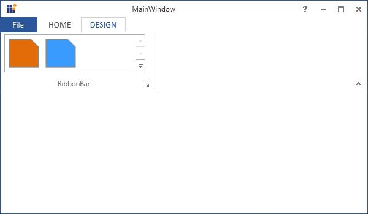
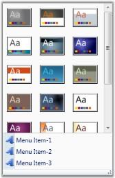

# RibbonGallery

Ribbon instance now allows the users to add a Gallery control in both Ribbon, as well as in Ribbon window. Using the Gallery control in Ribbon, items are displayed with good look and feel and it also enables the users to classify the items as groups for easy navigation.

## See Also

RibbonGalleryGroup, GalleryFilter

# Visual Modes

RibbonGallery has two visual modes namely Drop-Down and In Ribbon. 

* In the DropDown mode, the RibbonGallery control is displayed like a DropDown control 
* In the InRibbon mode, it is displayed as a normal gallery control in the ribbon. 

Use the following code snippet to add an InRibbon RibbonGallery control to a Ribbon. 



    [XAML]

<ribbon:RibbonGallery VisualMode="InRibbon" LargeIcon="SampleImages/WordArt32.png" Label="Gallery" SizeForm="Large" ItemWidth="70" MenuIconBarEnabled="True" ResizeDirection="HorizontalAndVertical"/>

 

The following code snippet is used to add a DropDown RibbonGallery control to a Ribbon.



    [XAML]

<ribbon:RibbonGallery VisualMode="Dropdown" LargeIcon="SampleImages/WordArt32.png" Label="Gallery" SizeForm="Large" ItemWidth="70" MenuIconBarEnabled="True" ResizeDirection="HorizontalAndVertical"/>

 

# Ribbon Gallery Items

Ribbon Gallery Items are the contents of the Ribbon Gallery Group. Ribbon Gallery Items does not restrict the users with the type of content to be added to it. You can add a Ribbon Gallery Item to a Text Box, Combo Box, Image, Button, Chart controls, and so on. 

Use the following code snippet to add a Ribbon Gallery Items.


[XAML]

<ribbon:RibbonGalleryItem>

<Image Source="SampleImages/Apex.png"/>

</ribbon:RibbonGalleryItem>

 

# Ribbon Gallery Groups

Ribbon Gallery Group is a collection of Ribbon Gallery Items. Ribbon Gallery Groups are used to group the items in the Ribbon Gallery control based on some classifications. 

Use the following code to add a Ribbon Gallery Group to the Ribbon Gallery control.



    [XAML]

<ribbon:RibbonGallery.GalleryGroups>

              <ribbon:RibbonGalleryGroup Label="First group">

                ....

              </ribbon:RibbonGalleryGroup>

</ribbon:RibbonGallery.GalleryGroups>

 

## See Also

RibbonGallery, GalleryFilter

# GalleryFilter

GalleryGroupFilters is added to the RibbonGallery control, so that only a particular RibbonGalleryGroup is displayed. FilterIndexes property is used to specify the indexes of the filters when selected and the RibbonGalleryGroup should be displayed. 

To specify the GalleryFilters of the RibbonGallery, use the below code



    [XAML]

<ribbon:RibbonGallery VisualMode="Dropdown" LargeIcon="SampleImages/WordArt32.png" Label="Gallery"   SizeForm="Large" ItemWidth="70" MenuIconBarEnabled="True" ResizeDirection="HorizontalAndVertical">

            <ribbon:RibbonGallery.GalleryFilters>

              <ribbon:RibbonGalleryFilter Label="All"/>

              <ribbon:RibbonGalleryFilter Label="First Group"/>

              <ribbon:RibbonGalleryFilter Label="Second Group"/>

              <ribbon:RibbonGalleryFilter Label="Third Group"/>

            </ribbon:RibbonGallery.GalleryFilters>

<ribbon:RibbonGallery.GalleryGroups>

              <ribbon:RibbonGalleryGroup Label="First group" ribbon:RibbonGallery.FilterIndexes="0,1">

                <ribbon:RibbonGalleryItem>

                  <Image Source="SampleImages/Apex.png"/>

                </ribbon:RibbonGalleryItem>

                <ribbon:RibbonGalleryItem>

                  <Image Source="SampleImages/Aspect.png"/>

                </ribbon:RibbonGalleryItem>

              <ribbon:RibbonGalleryGroup Label="Second group" ribbon:RibbonGallery.FilterIndexes="0,2">

                <ribbon:RibbonGalleryItem Content="Item" ToolTip="Set the specified style" />

                <ribbon:RibbonGalleryItem>

                  Text1

                </ribbon:RibbonGalleryItem>

                <ribbon:RibbonGalleryItem>

                  Text2

                </ribbon:RibbonGalleryItem>

              </ribbon:RibbonGalleryGroup>

             </ribbon:RibbonGallery.GalleryGroups>

</ribbon:RibbonGallery>

 

In the above code snippet, FilterIndexes property is set to "0,1". This denotes that the RibbonGalleryGroup should be displayed only when the GalleryFilter's index is 0 or 1.

## See Also

RibbonGallery, RibbonGalleryGroup

# Adding Custom Menu Items

In the expanded Gallery items (in both the Visual Mode), it is possible to add custom menu items to the bottom of the Ribbon Gallery control, using the MenuItem attached logic. The following code snippet will explain in detail.



    [XAML]

<!--Creating Ribbon Gallery-->

<syncfusion:RibbonGallery  VisualMode="InRibbon">

…..

<!--Add some Gallery Items here-->

……

<!--Adding custom Menu items-->

<syncfusion:RibbonGallery.MenuItems>

  <syncfusion:RibbonButton SizeForm = "Small" Label="Menu Item-1" />

  <syncfusion:RibbonButton SizeForm = "Small" Label="Menu Item-2" />

  <syncfusion:RibbonButton SizeForm = "Small" Label="Menu Item-3" />

</syncfusion:RibbonGallery.MenuItems>

</syncfusion:RibbonGallery>

 

This displays the gallery item with three custom Menu items at the bottom of the Gallery control. 

