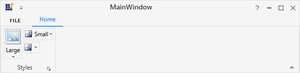
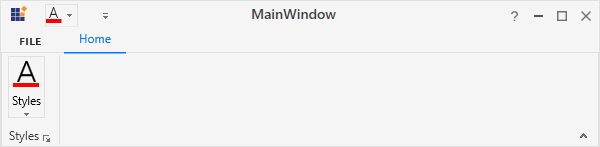
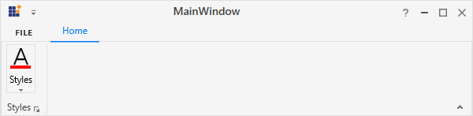
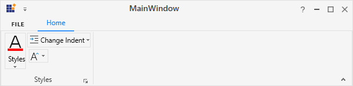
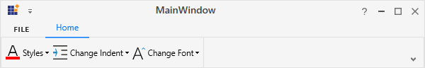

# RibbonGallery in WPF Ribbon

RibbonGallery provides `VisualMode` property, that helps to display items in two different ways.

## Ribbon mode

To display items as a normal gallery control in the ribbon, set `VisualMode` property as `InRibbon mode`





<syncfusion:RibbonGallery Width="230" VisualMode="InRibbon" Label="RibbonGallery" LargeIcon="Word.png"/>





## DropDown mode

To display items as DropDown in the ribbon, set `VisualMode` property as `DropDown mode`





<syncfusion:RibbonGallery VisualMode="DropDown" Label="RibbonGallery" LargeIcon="Word.png" >





## Ribbon gallery item

Ribbon control provides `RibbonGalleryItem` that add as items in RibbonGallery.





<syncfusion:Ribbon Name="_ribbon" HorizontalAlignment="Stretch" VerticalAlignment="Top">          
<syncfusion:RibbonTab Caption="HOME" IsChecked="False"/>                
<syncfusion:RibbonTab IsChecked="True" Caption="DESIGN">
<syncfusion:RibbonBar Header="RibbonBar">
<syncfusion:RibbonGallery Name="_ribbonGallery" Width="230" VisualMode="InRibbon" Label="RibbonGallery" LargeIcon="Word.png" >
<syncfusion:RibbonGalleryItem>
<Image Source="OrangeLarge.png"/>
</syncfusion:RibbonGalleryItem>
<syncfusion:RibbonGalleryItem  >
<Image Source="BlueLarge.png"/>
</syncfusion:RibbonGalleryItem>
</syncfusion:RibbonGallery>
</syncfusion:RibbonBar>
</syncfusion:RibbonTab>
/syncfusion:Ribbon>





Add RibbonGalleryItem in code behind.





Image _image1 = new Image() { Source =new BitmapImage(new Uri(@"OrangeLarge.png", UriKind.RelativeOrAbsolute)) };
Image _image2 = new Image() { Source = new BitmapImage(new Uri(@"BlueLarge.png", UriKind.RelativeOrAbsolute)) };
RibbonGalleryItem _ribbonGalleryItem1 = new RibbonGalleryItem() {Content=_image1};
RibbonGalleryItem _ribbonGalleryItem2 = new RibbonGalleryItem() { Content = _image2 };
_ribbonGallery.Items.Add(_ribbonGalleryItem1);
_ribbonGallery.Items.Add(_ribbonGalleryItem2);




Dim _image1 As New Image() With {.Source = New BitmapImage(New Uri("OrangeLarge.png", UriKind.RelativeOrAbsolute))}
Dim _image2 As New Image() With {.Source = New BitmapImage(New Uri("BlueLarge.png", UriKind.RelativeOrAbsolute))}
Dim _ribbonGalleryItem1 As New RibbonGalleryItem() With {.Content=_image1}
Dim _ribbonGalleryItem2 As New RibbonGalleryItem() With {.Content = _image2}
_ribbonGallery.Items.Add(_ribbonGalleryItem1)
_ribbonGallery.Items.Add(_ribbonGalleryItem2)





## Ribbon gallery group

Ribbon Gallery Group is a collection of Ribbon Gallery Items. The items are grouped in the Ribbon Gallery control based on some classifications.

### Gallery filter

`GalleryGroupFilters` are used to view particular group. The `FilterIndexes` property is used to specify the indexes of the filters.





<syncfusion:Ribbon Name="_ribbon" HorizontalAlignment="Stretch" VerticalAlignment="Top">
<syncfusion:RibbonTab Caption="HOME" IsChecked="False"/>
<syncfusion:RibbonTab Caption="DESIGN" IsChecked="True">
<syncfusion:RibbonBar Width="250" Header="RibbonBar">
<syncfusion:RibbonGallery Name="_ribbonGallery" Width="230" VisualMode="DropDown" Label="RibbonGallery">
<syncfusion:RibbonGallery.GalleryFilters>
<syncfusion:RibbonGalleryFilter Label="All"/>
<syncfusion:RibbonGalleryFilter Label="Group 1"/>
<syncfusion:RibbonGalleryFilter Label="Group 2"/>
</syncfusion:RibbonGallery.GalleryFilters>
<syncfusion:RibbonGallery.GalleryGroups>
<syncfusion:RibbonGalleryGroup Name="_ribbonGalleryGroup1" Label="Group 1" syncfusion:RibbonGallery.FilterIndexes="0, 1">
<syncfusion:RibbonGalleryItem Name="_ribbonGalleryItem1" Margin="5">
<Image Source="OrangeLarge.png" Stretch="None" />
</syncfusion:RibbonGalleryItem>
<syncfusion:RibbonGalleryItem Name="_ribbonGalleryItem2" Margin="5" >
<Image Source="BlueLarge.png" Stretch="None"/>
</syncfusion:RibbonGalleryItem>
</syncfusion:RibbonGalleryGroup>
<syncfusion:RibbonGalleryGroup  Name="_ribbonGalleryGroup2"  Label="Group 2" syncfusion:RibbonGallery.FilterIndexes="0, 2">
<syncfusion:RibbonGalleryItem Name="_RibbonGalleryItem3"  Margin="5">
<Image Source="GreenLarge.png" Stretch="None"/>
</syncfusion:RibbonGalleryItem>
<syncfusion:RibbonGalleryItem Name="_RibbonGalleryItem4" Margin="5" >
<Image Source="PinkLarge.png" Stretch="None" />
</syncfusion:RibbonGalleryItem>
</syncfusion:RibbonGalleryGroup>
</syncfusion:RibbonGallery.GalleryGroups>
</syncfusion:RibbonGallery>
</syncfusion:RibbonBar>
</syncfusion:RibbonTab>
</syncfusion:Ribbon>





## Add custom menu items

In the expanded Gallery items (in both the Visual Mode), can add custom menu items to the bottom of the Ribbon Gallery control, using the `MenuItem` property of RibbonGallery.





<syncfusion:Ribbon Name="_ribbon" HorizontalAlignment="Stretch" VerticalAlignment="Top">           
<syncfusion:RibbonTab Caption="HOME" IsChecked="True"/>
<syncfusion:RibbonTab IsChecked="False" Caption="DESIGN">
<syncfusion:RibbonBar Width="250" Header="RibbonBar">
<syncfusion:RibbonGallery Name="_ribbonGallery" Width="230" VisualMode="InRibbon" Label="RibbonGallery" LargeIcon="Word.png" >
<syncfusion:RibbonGalleryItem  Margin="5">
<Image Source="OrangeLarge.png"/>
</syncfusion:RibbonGalleryItem>
<syncfusion:RibbonGalleryItem  Margin="5">
<Image Source="PinkLarge.png"/>
</syncfusion:RibbonGalleryItem>
<syncfusion:RibbonGallery.MenuItems>
<syncfusion:RibbonButton SizeForm = "Small" Label="Menu Item-1"/>
<syncfusion:RibbonButton SizeForm = "Small" Label="Menu Item-2"/>
<syncfusion:RibbonButton SizeForm = "Small" Label="Menu Item-3"/>
</syncfusion:RibbonGallery.MenuItems>              
</syncfusion:RibbonGallery>
</syncfusion:RibbonBar>
</syncfusion:RibbonTab>
</syncfusion:Ribbon>





Custom Menu items of RibbonGallery added by creating instance of RibbonButton and add it to MenuItems property of RibbonGallery in code behind. SplitButton or MenuButton can also added instead of RibbonButton.





RibbonButton _ribbonButton1 = new RibbonButton() { SizeForm = SizeForm.Small, Label = "Menu Item-1" };
RibbonButton _ribbonButton2 = new RibbonButton() { SizeForm = SizeForm.Small, Label = "Menu Item-2" };
RibbonButton _ribbonButton3 = new RibbonButton() { SizeForm = SizeForm.Small, Label = "Menu Item-3" };
_ribbonGallery.MenuItems.Add(_ribbonButton1);
_ribbonGallery.MenuItems.Add(_ribbonButton2);
_ribbonGallery.MenuItems.Add(_ribbonButton3);





Dim _ribbonButton1 As New RibbonButton() With {
	.SizeForm = SizeForm.Small,
	.Label = "Menu Item-1"
}
Dim _ribbonButton2 As New RibbonButton() With {
	.SizeForm = SizeForm.Small,
	.Label = "Menu Item-2"
}
Dim _ribbonButton3 As New RibbonButton() With {
	.SizeForm = SizeForm.Small,
	.Label = "Menu Item-3"
}
_ribbonGallery.MenuItems.Add(_ribbonButton1)
_ribbonGallery.MenuItems.Add(_ribbonButton2)
_ribbonGallery.MenuItems.Add(_ribbonButton3)





## Add custom context menu

The context menu is a type of menu that appears when a right-click operation is performed on the target. The ribbon gallery and its items allow to add a custom context menu with user-defined menu items set to the [`ContextMenu`](https://help.syncfusion.com/cr/wpf/Syncfusion.Windows.Tools.Controls.RibbonGallery.html) property. This will override the built-in context menu of the ribbon gallery and its items.



<!-- A custom context menu with user-defined menu items -->
<syncfusion:RibbonWindow.Resources>
    <syncfusion:RibbonContextMenu x:Key="galleryContextMenu" ItemsSource="{Binding}">
        <syncfusion:RibbonMenuItem Header="Apply Style" Command="{Binding DataContext.ApplyStyleCommand}" IconBarEnabled="True"/>
        <syncfusion:RibbonMenuItem Header="Remove from Style Gallery" Command="{Binding DataContext.RemoveItemCommand}" IconBarEnabled="True"/>
        <Separator />
        <syncfusion:RibbonMenuItem Header="Minimize Ribbon" Command="{Binding DataContext.MinimizeRibbonCommand}" IconBarEnabled="True" />
    </syncfusion:RibbonContextMenu>
</syncfusion:RibbonWindow.Resources>

<!-- Replace the custom context menu with the built-in context menu of the ribbon gallery -->
<syncfusion:Ribbon Name="_ribbon" HorizontalAlignment="Stretch" VerticalAlignment="Top">
    <syncfusion:RibbonTab Caption="HOME" IsChecked="False"/>
    <syncfusion:RibbonTab IsChecked="True" Caption="DESIGN">
        <syncfusion:RibbonBar Header="RibbonBar">
            <syncfusion:RibbonGallery x:Name="gallery" ContextMenu="{DynamicResource galleryContextMenu}"
                                      Width="380" SizeForm="Large" Height="67"  ItemHeight="60"  ItemWidth="60" MenuIconBarEnabled="True">
                <syncfusion:RibbonGalleryItem Margin="2" CheckOnClick="False">
                    <StackPanel>
                        <TextBlock TextAlignment="Center" Margin="0,9,0,0" Text="AaBbCc"/>
                        <TextBlock TextAlignment="Center" Margin="0,11,0,0" Text="Normal"/>
                    </StackPanel>
                </syncfusion:RibbonGalleryItem>
                <syncfusion:RibbonGalleryItem Margin="2" CheckOnClick="False">
                    <StackPanel>
                        <TextBlock TextAlignment="Center" Margin="0,9,0,0" Text="AaBbCc"/>
                        <TextBlock TextAlignment="Center" Margin="0,11,0,0" Text="No Spa.."/>
                    </StackPanel>
                </syncfusion:RibbonGalleryItem>
                <syncfusion:RibbonGalleryItem Margin="2" CheckOnClick="False">
                    <StackPanel>
                        <TextBlock FontSize="18" Foreground="DarkBlue" TextAlignment="Center" Margin="0,5,0,0" Text="AaBbCc"/>
                        <TextBlock TextAlignment="Center" Margin="0,6,0,0" Text="Heading 1"/>
                    </StackPanel>
                </syncfusion:RibbonGalleryItem>
                <syncfusion:RibbonGalleryItem Margin="2" CheckOnClick="False">
                    <StackPanel>
                        <TextBlock FontSize="16" Foreground="DarkBlue" TextAlignment="Center" Margin="0,6,0,0" Text="AaBbCc"/>
                        <TextBlock TextAlignment="Center" Margin="0,8,0,0" Text="Heading 2"/>
                    </StackPanel>
                </syncfusion:RibbonGalleryItem>
                <syncfusion:RibbonGalleryItem Margin="2" CheckOnClick="False">
                    <StackPanel>
                        <TextBlock FontSize="14" Foreground="DarkBlue" TextAlignment="Center" Margin="0,7,0,0" Text="AaBbCc"/>
                        <TextBlock TextAlignment="Center" Margin="0,9,0,0" Text="Heading 3"/>
                    </StackPanel>
                </syncfusion:RibbonGalleryItem>
                <syncfusion:RibbonGalleryItem Margin="2" CheckOnClick="False">
                    <StackPanel>
                        <TextBlock FontSize="15" Foreground="DarkBlue" TextAlignment="Center" Margin="0,7,0,0" Text="AaBbCc"/>
                        <TextBlock TextAlignment="Center" Margin="0,9,0,0" Text="Heading 4"/>
                    </StackPanel>
                </syncfusion:RibbonGalleryItem>
            </syncfusion:RibbonGallery>
        </syncfusion:RibbonBar>
    </syncfusion:RibbonTab>
</syncfusion:Ribbon>




/// 

/// Command for "ApplyStyle" option in the context menu.
/// 

public DelegateCommand ApplyStyleCommand
{
    get
    {
        return new DelegateCommand(ApplyStyleCommandAction);
    }
}

/// 

/// Action that occurs when "ApplyStyle" menu item is selected from the context menu.
/// 

private void ApplyStyleCommandAction(object param)
{
    SelectionForeground = new SolidColorBrush(Color.FromRgb(0, 0, 0));
    SelectionFontSize = 14;
    foreach (Paragraph paragraph in paragraphs)
    {
        paragraph.LineHeight = 20;
        paragraph.Foreground = new SolidColorBrush(Color.FromRgb(0, 0, 0));
        paragraph.FontSize = 14;
    }
}

/// 

/// Command for "RemoveItem" option in the context menu.
/// 

public DelegateCommand RemoveItemCommand
{
    get
    {
        return new DelegateCommand(RemoveItemCommandAction);
    }
}

/// 

/// Action that occurs when "RemoveItem" is selected from the context menu.
/// 

private void RemoveItemCommandAction(object param)
{
    if (gallery.Items.Count > 0)
        gallery.Items.RemoveAt(0);
}

/// 

/// Command for "MinimizeRibbon" option in the context menu.
/// 

public DelegateCommand MinimizeRibbonCommand
{
    get
    {
        return new DelegateCommand(MinimizeRibbonCommandAction);
    }
}

/// 

/// Action that occurs when "MinimizeRibbon" item is selected from the context menu.
/// 

private void MinimizeRibbonCommandAction(object param)
{
    this.Ribbon.RibbonState = RibbonState.Hide;
}

/// 

/// A class that defines the interface for the command.
/// 

public class DelegateCommand : ICommand
{
    private readonly Action<object> _execute;
    /// 

    /// Raises when changes occur and specifies whether or not the command should be executed.
    /// 

    public event EventHandler CanExecuteChanged;

    /// 

    /// Constructor of the Delegate command
    /// 

    /// <param name="execute"></param>
    public DelegateCommand(Action<object> execute)
    {
        _execute = execute;
    }

    /// 

    ///  Defines the method that determines whether the command can execute in its current state.
    /// 

    public bool CanExecute(object parameter)
    {
        return true;
    }

    /// 

    ///  Defines the method to be called when the command is invoked.
    /// 

    public void Execute(object parameter)
    {
        _execute(parameter);
    }

    /// 

    /// Defines the method to be called when changes occur that affect the command.
    /// 

    public void RaiseCanExecuteChanged()
    {
        if (CanExecuteChanged != null)
        {
            CanExecuteChanged(this, EventArgs.Empty);
        }
    }
}




## Set various sizes for RibbonGallery

 The [`RibbonGallery`](https://help.syncfusion.com/cr/wpf/Syncfusion.Windows.Tools.Controls.RibbonGallery.html) supports three types of size modes in its DropDown [`VisualMode`](https://help.syncfusion.com/cr/wpf/Syncfusion.Windows.Tools.Controls.RibbonGallery.html#Syncfusion_Windows_Tools_Controls_RibbonGallery_VisualMode) and it can be set using the [`SizeForm`](https://help.syncfusion.com/cr/wpf/Syncfusion.Windows.Tools.Controls.RibbonItemsControl.html#Syncfusion_Windows_Tools_Controls_RibbonItemsControl_SizeForm) property. The different [`SizeForm`](https://help.syncfusion.com/cr/wpf/Syncfusion.Windows.Tools.SizeForm.html) available are as follows:

 * **ExtraSmall** - Displays only the image in 16 * 16 size.
 * **Small** - Displays the label and the image in 16 * 16 size.
 * **Large** - Displays the label and the image in 32 * 32 size.





 <syncfusion:RibbonWindow x:Class="WpfApp1.MainWindow"
        xmlns="http://schemas.microsoft.com/winfx/2006/xaml/presentation"
        xmlns:x="http://schemas.microsoft.com/winfx/2006/xaml"
        xmlns:d="http://schemas.microsoft.com/expression/blend/2008"
        xmlns:mc="http://schemas.openxmlformats.org/markup-compatibility/2006"
        xmlns:local="clr-namespace:WpfApp1"
        mc:Ignorable="d" xmlns:syncfusion="http://schemas.syncfusion.com/wpf"
        xmlns:skin="clr-namespace:Syncfusion.SfSkinManager;assembly=Syncfusion.SfSkinManager.WPF"
        skin:SfSkinManager.VisualStyle="MaterialLight"
        Title="MainWindow" Height="450" Width="600">
    <Grid>
        <syncfusion:Ribbon VerticalAlignment="Top" EnableSimplifiedLayoutMode="True" >
            <syncfusion:Ribbon.QuickAccessToolBar>
                <syncfusion:QuickAccessToolBar/>
            </syncfusion:Ribbon.QuickAccessToolBar>
            <syncfusion:RibbonTab Caption="Home">
                <syncfusion:RibbonBar Header="Styles">
                    <syncfusion:RibbonGallery VisualMode="DropDown" Label="Styles" SizeForm="Large"/>
                    <syncfusion:RibbonGallery VisualMode="DropDown" Label="Change Indent" SizeForm="Small" Height="25"/>
                    <syncfusion:RibbonGallery VisualMode="DropDown" Label="Change Font" SizeForm="ExtraSmall" Height="25" Width="35" HorizontalAlignment="Left"/>
                </syncfusion:RibbonBar>
            </syncfusion:RibbonTab>
        </syncfusion:Ribbon>
    </Grid>
 </syncfusion:RibbonWindow>

 

 

 Ribbon ribbon = new Ribbon();
 ribbon.VerticalAlignment = VerticalAlignment.Top;
 ribbon.EnableSimplifiedLayoutMode = true;
 // Creating new tabs
 RibbonTab homeTab = new RibbonTab();
 homeTab.Caption = "Home";
 homeTab.IsChecked = true;
 
 // Creating new bar
 RibbonBar stylesBar = new RibbonBar();
 stylesBar.Header = "Styles";
 // Creating items
 RibbonGallery stylesGallery = new RibbonGallery();
 stylesGallery.Label = "Styles";
 stylesGallery.SizeForm = SizeForm.Large;
 stylesGallery.VisualMode = RibbonGalleryVisualMode.DropDown;
 
 RibbonGallery indentGallery = new RibbonGallery();
 indentGallery.Label = "Change Indent";
 indentGallery.SizeForm = SizeForm.Small;
 indentGallery.VisualMode = RibbonGalleryVisualMode.DropDown;
 indentGallery.Height = 25;
 
 RibbonGallery fontGallery = new RibbonGallery();
 fontGallery.Label = "Change Font";
 fontGallery.SizeForm = SizeForm.ExtraSmall;
 fontGallery.VisualMode = RibbonGalleryVisualMode.DropDown;
 indentGallery.Height = 25;
 indentGallery.Width = 35;
 indentGallery.HorizontalAlignment = HorizontalAlignment.Left;
 
 // Adding items to bar
 stylesBar.Items.Add(stylesGallery);
 stylesBar.Items.Add(indentGallery);
 stylesBar.Items.Add(fontGallery);
 
 // Adding bars to the tabs
 homeTab.Items.Add(stylesBar);
 
 // Adding tabs to ribbon
 ribbon.Items.Add(homeTab);
 grid.Children.Add(ribbon);
 SfSkinManager.SetVisualStyle(this, VisualStyles.MaterialLight);

 

 

 N> When **simplified** layout is set, [`RibbonGallery`](https://help.syncfusion.com/cr/wpf/Syncfusion.Windows.Tools.Controls.RibbonGallery.html) displays the image in 20 * 20 size irrespective of the size form. Also, the text in the **Large** size form will appear to the right of the image.

## Setting image to RibbonGallery

 The [`RibbonGallery`](https://help.syncfusion.com/cr/wpf/Syncfusion.Windows.Tools.Controls.RibbonGallery.html) allows to display any type of image such as glyph, font or any custom content using the [`IconTemplateSelector`](https://help.syncfusion.com/cr/wpf/Syncfusion.Windows.Tools.Controls.RibbonItemsControl.html#Syncfusion_Windows_Tools_Controls_RibbonItemsControl_IconTemplateSelector) and [`IconTemplate`](https://help.syncfusion.com/cr/wpf/Syncfusion.Windows.Tools.Controls.RibbonItemsControl.html#Syncfusion_Windows_Tools_Controls_RibbonItemsControl_IconTemplate) property, which are the preferred options. It allows to display a normal image or vector image using the [`IconType`](https://help.syncfusion.com/cr/wpf/Syncfusion.Windows.Tools.Controls.RibbonItemsControl.html#Syncfusion_Windows_Tools_Controls_RibbonItemsControl_IconType) enumeration property. The default value of the [`IconType`](https://help.syncfusion.com/cr/wpf/Syncfusion.Windows.Tools.Controls.RibbonItemsControl.html#Syncfusion_Windows_Tools_Controls_RibbonItemsControl_IconType) property is **"Icon"**. The [`IconType`](https://help.syncfusion.com/cr/wpf/Syncfusion.Windows.Tools.IconType.html) enumeration has the following values:

* **Icon** - Gets the detail of the icon path from the [`SmallIcon`](https://help.syncfusion.com/cr/wpf/Syncfusion.Windows.Tools.Controls.RibbonItemsControl.html#Syncfusion_Windows_Tools_Controls_RibbonItemsControl_SmallIcon), [`MediumIcon`](https://help.syncfusion.com/cr/wpf/Syncfusion.Windows.Tools.Controls.RibbonItemsControl.html#Syncfusion_Windows_Tools_Controls_RibbonItemsControl_MediumIcon) or [`LargeIcon`](https://help.syncfusion.com/cr/wpf/Syncfusion.Windows.Tools.Controls.RibbonItemsControl.html#Syncfusion_Windows_Tools_Controls_RibbonItemsControl_LargeIcon) properties and sets it to the DropDownButton.
* **VectorImage** - Gets the details of the icon’s path data from the [`VectorImage`](https://help.syncfusion.com/cr/wpf/Syncfusion.Windows.Tools.Controls.RibbonItemsControl.html#Syncfusion_Windows_Tools_Controls_RibbonItemsControl_VectorImage) property and sets it to the DropDownButton.

 N> The [`RibbonGallery`](https://help.syncfusion.com/cr/wpf/Syncfusion.Windows.Tools.Controls.RibbonGallery.html) loads icon in the following priority order,
 * [`IconTemplateSelector`](https://help.syncfusion.com/cr/wpf/Syncfusion.Windows.Tools.Controls.RibbonItemsControl.html#Syncfusion_Windows_Tools_Controls_RibbonItemsControl_IconTemplateSelector) 
 * [`IconTemplate`](https://help.syncfusion.com/cr/wpf/Syncfusion.Windows.Tools.Controls.RibbonItemsControl.html#Syncfusion_Windows_Tools_Controls_RibbonItemsControl_IconTemplate)
 * [`VectorImage`](https://help.syncfusion.com/cr/wpf/Syncfusion.Windows.Tools.Controls.RibbonItemsControl.html#Syncfusion_Windows_Tools_Controls_RibbonItemsControl_VectorImage)
 * [`LargeIcon`](https://help.syncfusion.com/cr/wpf/Syncfusion.Windows.Tools.Controls.RibbonItemsControl.html#Syncfusion_Windows_Tools_Controls_RibbonItemsControl_LargeIcon)
 * [`MediumIcon`](https://help.syncfusion.com/cr/wpf/Syncfusion.Windows.Tools.Controls.RibbonItemsControl.html#Syncfusion_Windows_Tools_Controls_RibbonItemsControl_MediumIcon) 
 * [`SmallIcon`](https://help.syncfusion.com/cr/wpf/Syncfusion.Windows.Tools.Controls.RibbonItemsControl.html#Syncfusion_Windows_Tools_Controls_RibbonItemsControl_SmallIcon)

### Setting icon template selector

The [`IconTemplateSelector`](https://help.syncfusion.com/cr/wpf/Syncfusion.Windows.Tools.Controls.RibbonItemsControl.html#Syncfusion_Windows_Tools_Controls_RibbonItemsControl_IconTemplateSelector) property provides support to specify a different data template based on the value of the [`SizeForm`](https://help.syncfusion.com/cr/wpf/Syncfusion.Windows.Tools.Controls.RibbonItemsControl.html#Syncfusion_Windows_Tools_Controls_RibbonItemsControl_SizeForm) or [`LayoutMode`](https://help.syncfusion.com/cr/wpf/Syncfusion.Windows.Tools.Controls.Ribbon.html#Syncfusion_Windows_Tools_Controls_Ribbon_LayoutMode) properties. For simplified layout, the template content will be resized to 20 * 20 size which is the standard. 

 

 

 <syncfusion:RibbonWindow x:Class="WpfApp1.MainWindow"
        xmlns="http://schemas.microsoft.com/winfx/2006/xaml/presentation"
        xmlns:x="http://schemas.microsoft.com/winfx/2006/xaml"
        xmlns:d="http://schemas.microsoft.com/expression/blend/2008"
        xmlns:mc="http://schemas.openxmlformats.org/markup-compatibility/2006"
        xmlns:local="clr-namespace:WpfApp1"
        mc:Ignorable="d" xmlns:syncfusion="http://schemas.syncfusion.com/wpf"
        xmlns:skin="clr-namespace:Syncfusion.SfSkinManager;assembly=Syncfusion.SfSkinManager.WPF"
        skin:SfSkinManager.VisualStyle="MaterialLight"
        Title="MainWindow" Height="450" Width="600">
    <syncfusion:RibbonWindow.Resources>
        <DataTemplate x:Key="ribbonGallerySmallIconTemplate">
            <Grid Width="14" Height="16">
                <Path
                         Height="4"
                         VerticalAlignment="Bottom"
                         Data="M0,0 L16,0 16,4 0,4 z"
                         Fill="#FFFE0000"
                         Stretch="Fill" />
                <Path
                         Margin="3.344,0,3.352,5"
                         Data="M4.6480023,0.95898432 C4.6079937,1.0870056 4.5689923,1.2149963 4.533012,1.34198 4.4980089,1.4909973 4.4510118,1.6419983 4.394005,1.7949829 L2.5330156,6.8809814 6.787006,6.8809814 4.9330055,1.7799988 C4.8510047,1.5699768 4.7659832,1.2969971 4.6790081,0.95898432 z M4.0779959,0 L5.209006,0 9.304,11 8.3170024,11 7.2039977,8.0019836 2.1150171,8.0029907 1.0100081,11 0,11 z"
                         Fill="{Binding RelativeSource={RelativeSource Mode=Self}, Path=(TextBlock.Foreground)}"
                         Stretch="Fill" />
            </Grid>
        </DataTemplate>
        <DataTemplate x:Key="ribbonGalleryLargeIconTemplate">
            <Grid Height="26" Width="26" >
                <Path
                         Height="4"
                         VerticalAlignment="Bottom"
                         Data="M0,0 L16,0 16,4 0,4 z"
                         Fill="#FFFE0000"
                         Stretch="Fill" />
                <Path
                         Margin="3.344,0,3.352,5"
                         Data="M4.6480023,0.95898432 C4.6079937,1.0870056 4.5689923,1.2149963 4.533012,1.34198 4.4980089,1.4909973 4.4510118,1.6419983 4.394005,1.7949829 L2.5330156,6.8809814 6.787006,6.8809814 4.9330055,1.7799988 C4.8510047,1.5699768 4.7659832,1.2969971 4.6790081,0.95898432 z M4.0779959,0 L5.209006,0 9.304,11 8.3170024,11 7.2039977,8.0019836 2.1150171,8.0029907 1.0100081,11 0,11 z"
                         Fill="{Binding RelativeSource={RelativeSource Mode=Self}, Path=(TextBlock.Foreground)}"
                         Stretch="Fill" />
            </Grid>
        </DataTemplate>
        <local:RibbonGalleryIconTemplateSelector x:Key="ribbonGalleryIconTemplateSelector"
                                    SmallTemplate="{StaticResource ribbonGallerySmallIconTemplate}"
                                    LargeTemplate="{StaticResource ribbonGalleryLargeIconTemplate}"/>
    </syncfusion:RibbonWindow.Resources>
    <Grid>
        <syncfusion:Ribbon VerticalAlignment="Top">
            <syncfusion:Ribbon.QuickAccessToolBar>
                <syncfusion:QuickAccessToolBar>
                    <syncfusion:RibbonGallery VisualMode="DropDown" Label="Font Color" SizeForm="ExtraSmall" IconTemplateSelector="{StaticResource ribbonGalleryIconTemplateSelector}"/>
                </syncfusion:QuickAccessToolBar>
            </syncfusion:Ribbon.QuickAccessToolBar>
            <syncfusion:RibbonTab Caption="Home">
                <syncfusion:RibbonBar Header="Styles">
                    <syncfusion:RibbonGallery VisualMode="DropDown" Label="Font Color" SizeForm="Large" IconTemplateSelector="{StaticResource ribbonGalleryIconTemplateSelector}"/>
                </syncfusion:RibbonBar>
            </syncfusion:RibbonTab>
        </syncfusion:Ribbon>
    </Grid>
 </syncfusion:RibbonWindow>

 

 

 public class RibbonGalleryIconTemplateSelector : DataTemplateSelector
 {
    public DataTemplate SmallTemplate { get; set; }
    public DataTemplate LargeTemplate { get; set; }
    public override DataTemplate SelectTemplate(object item, DependencyObject container)
    {
        var item1 = (container as ContentPresenter);
        RibbonGallery ribbonGallery = (item1.TemplatedParent as RibbonGallery);
        if (ribbonGallery != null)
        {
            if (ribbonGallery.SizeForm == SizeForm.Small || ribbonGallery.SizeForm == SizeForm.ExtraSmall)
            {
                return SmallTemplate;
            }
            else if (ribbonGallery.SizeForm == SizeForm.Large)
            {
                return LargeTemplate;
            }
        }
        return LargeTemplate;
    }
 }

 

 

 

 N> [View sample in GitHub](https://github.com/SyncfusionExamples/syncfusion-wpf-ribbon-examples/tree/main/Samples/Setting-icons-using-IconTemplate)

### Setting icon template

The [`IconTemplate`](https://help.syncfusion.com/cr/wpf/Syncfusion.Windows.Tools.Controls.RibbonItemsControl.html#Syncfusion_Windows_Tools_Controls_RibbonItemsControl_IconTemplate) property provides support to set any type of image such as glyph, font or any custom content to the [`RibbonGallery`](https://help.syncfusion.com/cr/wpf/Syncfusion.Windows.Tools.Controls.RibbonGallery.html). The [`RibbonGallery`](https://help.syncfusion.com/cr/wpf/Syncfusion.Windows.Tools.Controls.RibbonGallery.html) will automatically resize the template content according to its [`SizeForm`](https://help.syncfusion.com/cr/wpf/Syncfusion.Windows.Tools.Controls.RibbonItemsControl.html#Syncfusion_Windows_Tools_Controls_RibbonItemsControl_SizeForm). For simplified layout, the template content will be resized to 20 * 20 size which is the standard. 

 

 

 <syncfusion:RibbonWindow x:Class="WpfApp1.MainWindow"
        xmlns="http://schemas.microsoft.com/winfx/2006/xaml/presentation"
        xmlns:x="http://schemas.microsoft.com/winfx/2006/xaml"
        xmlns:d="http://schemas.microsoft.com/expression/blend/2008"
        xmlns:mc="http://schemas.openxmlformats.org/markup-compatibility/2006"
        xmlns:local="clr-namespace:WpfApp1"
        mc:Ignorable="d" xmlns:syncfusion="http://schemas.syncfusion.com/wpf"
        xmlns:skin="clr-namespace:Syncfusion.SfSkinManager;assembly=Syncfusion.SfSkinManager.WPF"
        skin:SfSkinManager.VisualStyle="MaterialLight"
        Title="MainWindow" Height="450" Width="600">
    <Grid>
        <syncfusion:Ribbon VerticalAlignment="Top">
            <syncfusion:Ribbon.QuickAccessToolBar>
                <syncfusion:QuickAccessToolBar/>
            </syncfusion:Ribbon.QuickAccessToolBar>
            <syncfusion:RibbonTab Caption="Home">
                <syncfusion:RibbonBar Header="Styles">
                    <syncfusion:RibbonGallery VisualMode="DropDown" Label="Font Color" SizeForm="Large">
                        <syncfusion:RibbonGallery.IconTemplate>
                            <DataTemplate>
                                <Grid Height="26" Width="26" >
                                    <Path
                                        Height="4" VerticalAlignment="Bottom" Data="M0,0 L16,0 16,4 0,4 z"
                                        Fill="#FFFE0000" Stretch="Fill" />
                                    <Path
                                        Margin="3.344,0,3.352,5"
                                        Data="M4.6480023,0.95898432 C4.6079937,1.0870056 4.5689923,1.2149963 4.533012,1.34198 4.4980089,1.4909973 4.4510118,1.6419983 4.394005,1.7949829 L2.5330156,6.8809814 6.787006,6.8809814 4.9330055,1.7799988 C4.8510047,1.5699768 4.7659832,1.2969971 4.6790081,0.95898432 z M4.0779959,0 L5.209006,0 9.304,11 8.3170024,11 7.2039977,8.0019836 2.1150171,8.0029907 1.0100081,11 0,11 z"
                                        Fill="{Binding RelativeSource={RelativeSource Mode=Self}, Path=(TextBlock.Foreground)}" Stretch="Fill" />
                                </Grid>
                            </DataTemplate>
                        </syncfusion:RibbonGallery.IconTemplate>
                    </syncfusion:RibbonGallery>
                </syncfusion:RibbonBar>
            </syncfusion:RibbonTab>
        </syncfusion:Ribbon>
    </Grid>
 </syncfusion:RibbonWindow>

 

 

 Ribbon ribbon = new Ribbon();
 ribbon.VerticalAlignment = VerticalAlignment.Top;
 // Creating new tabs
 RibbonTab homeTab = new RibbonTab();
 homeTab.Caption = "Home";
 homeTab.IsChecked = true;

 // Creating new bar
 RibbonBar clipboardBar = new RibbonBar();
 clipboardBar.Header = "Styles";
 // Creating items
 RibbonGallery ribbonGallery = new RibbonGallery();
 ribbonGallery.Label = "Font Color";
 ribbonGallery.SizeForm = SizeForm.Large;
 ribbonGallery.VisualMode = RibbonGalleryVisualMode.DropDown;
 
 DataTemplate iconDataTemplate = new DataTemplate();
 FrameworkElementFactory gridElement = new FrameworkElementFactory(typeof(Grid));
 FrameworkElementFactory pathElement1 = new FrameworkElementFactory(typeof(Path));
 FrameworkElementFactory pathElement2 = new FrameworkElementFactory(typeof(Path));

 gridElement.SetValue(Grid.HeightProperty, (double)26);
 gridElement.SetValue(Grid.WidthProperty, (double)26);
 pathElement1.SetValue(Path.DataProperty, Geometry.Parse("M0,0 L16,0 16,4 0,4 z"));
 pathElement1.SetValue(Path.HeightProperty, (double)4);
 pathElement1.SetValue(Path.FillProperty, new SolidColorBrush(Colors.Red));
 pathElement1.SetValue(Path.VerticalAlignmentProperty, VerticalAlignment.Bottom );
 pathElement1.SetValue(Path.StretchProperty, Stretch.Fill);
 
 pathElement2.SetValue(Path.DataProperty, Geometry.Parse("M4.6480023,0.95898432 C4.6079937,1.0870056 4.5689923,1.2149963 4.533012,1.34198 4.4980089,1.4909973 4.4510118,1.6419983 4.394005,1.7949829 L2.5330156,6.8809814 6.787006,6.8809814 4.9330055,1.7799988 C4.8510047,1.5699768 4.7659832,1.2969971 4.6790081,0.95898432 z M4.0779959,0 L5.209006,0 9.304,11 8.3170024,11 7.2039977,8.0019836 2.1150171,8.0029907 1.0100081,11 0,11 z"));
 pathElement2.SetValue(Path.MarginProperty, new Thickness(3.344, 0, 3.352, 5));
 pathElement2.SetValue(Path.FillProperty, new SolidColorBrush(Colors.Black));
 pathElement2.SetValue(Path.StretchProperty, Stretch.Fill);
 
 gridElement.AppendChild(pathElement1);
 gridElement.AppendChild(pathElement2);
 iconDataTemplate.VisualTree = gridElement;
 ribbonGallery.IconTemplate = iconDataTemplate;
 clipboardBar.Items.Add(ribbonGallery);
 
 // Adding bars to the tabs
 homeTab.Items.Add(clipboardBar);
 
 // Adding tabs to ribbon
 ribbon.Items.Add(homeTab);
 grid.Children.Add(ribbon);
 SfSkinManager.SetVisualStyle(this, VisualStyles.MaterialLight);

 

 

 

 N> [View sample in GitHub](https://github.com/SyncfusionExamples/syncfusion-wpf-ribbon-examples/tree/main/Samples/Setting-icons-using-IconTemplate)

### Setting image path

 The [`RibbonGallery`](https://help.syncfusion.com/cr/wpf/Syncfusion.Windows.Tools.Controls.RibbonGallery.html) allows to set the image according to the different [`SizeForm`](https://help.syncfusion.com/cr/wpf/Syncfusion.Windows.Tools.Controls.RibbonItemsControl.html#Syncfusion_Windows_Tools_Controls_RibbonItemsControl_SizeForm) values. To set the image to [`RibbonGallery`](https://help.syncfusion.com/cr/wpf/Syncfusion.Windows.Tools.Controls.RibbonGallery.html), the following properties are used:

* [`SmallIcon`](https://help.syncfusion.com/cr/wpf/Syncfusion.Windows.Tools.Controls.RibbonItemsControl.html#Syncfusion_Windows_Tools_Controls_RibbonItemsControl_SmallIcon) - 16 * 16 size image to be displayed in normal layout for **"ExtraSmall"** and **"Small"** size form.
* [`MediumIcon`](https://help.syncfusion.com/cr/wpf/Syncfusion.Windows.Tools.Controls.RibbonItemsControl.html#Syncfusion_Windows_Tools_Controls_RibbonItemsControl_MediumIcon) - 20 * 20 size image to be displayed in simplified layout.
* [`LargeIcon`](https://help.syncfusion.com/cr/wpf/Syncfusion.Windows.Tools.Controls.RibbonItemsControl.html#Syncfusion_Windows_Tools_Controls_RibbonItemsControl_LargeIcon) - 32 * 32 size image to be displayed in normal layout for **"Large"** size form.





 <syncfusion:RibbonWindow x:Class="WpfApp1.MainWindow"
        xmlns="http://schemas.microsoft.com/winfx/2006/xaml/presentation"
        xmlns:x="http://schemas.microsoft.com/winfx/2006/xaml"
        xmlns:d="http://schemas.microsoft.com/expression/blend/2008"
        xmlns:mc="http://schemas.openxmlformats.org/markup-compatibility/2006"
        xmlns:local="clr-namespace:WpfApp1"
        mc:Ignorable="d" xmlns:syncfusion="http://schemas.syncfusion.com/wpf"
        xmlns:skin="clr-namespace:Syncfusion.SfSkinManager;assembly=Syncfusion.SfSkinManager.WPF"
        skin:SfSkinManager.VisualStyle="MaterialLight"
        Title="MainWindow" Height="450" Width="600">
    <Grid>
        <syncfusion:Ribbon VerticalAlignment="Top" EnableSimplifiedLayoutMode="True" >
            <syncfusion:Ribbon.QuickAccessToolBar>
                <syncfusion:QuickAccessToolBar/>
            </syncfusion:Ribbon.QuickAccessToolBar>
            <syncfusion:RibbonTab Caption="Home">
                <syncfusion:RibbonBar Header="Styles">
                    <syncfusion:RibbonGallery MediumIcon="/Resources/Styles20.png" LargeIcon="/Resources/Styles32.png"
                        VisualMode="DropDown" Label="Styles" SizeForm="Large"/>
                    <syncfusion:RibbonGallery MediumIcon="/Resources/Indent20.png" SmallIcon="/Resources/Indent16.png"
                        VisualMode="DropDown" Label="Change Indent" SizeForm="Small" Height="25"/>
                    <syncfusion:RibbonGallery MediumIcon="/Resources/Font20.png" SmallIcon="/Resources/Font16.png"
                        VisualMode="DropDown" Label="Change Font" SizeForm="ExtraSmall" Height="25" Width="35" HorizontalAlignment="Left"/>
                </syncfusion:RibbonBar>
            </syncfusion:RibbonTab>
        </syncfusion:Ribbon>
    </Grid>
 </syncfusion:RibbonWindow>

 

 

 Ribbon ribbon = new Ribbon();
 ribbon.VerticalAlignment = VerticalAlignment.Top;
 ribbon.EnableSimplifiedLayoutMode = true;
 // Creating new tabs
 RibbonTab homeTab = new RibbonTab();
 homeTab.Caption = "Home";
 homeTab.IsChecked = true;
 
 // Creating new bar
 RibbonBar stylesBar = new RibbonBar();
 stylesBar.Header = "Styles";
 // Creating items
 RibbonGallery stylesGallery = new RibbonGallery();
 stylesGallery.Label = "Styles";
 stylesGallery.SizeForm = SizeForm.Large;
 stylesGallery.VisualMode = RibbonGalleryVisualMode.DropDown;
 stylesGallery.MediumIcon = new BitmapImage(new Uri(@"/Resources/Styles20.png", UriKind.RelativeOrAbsolute));
 stylesGallery.LargeIcon = new BitmapImage(new Uri(@"/Resources/Styles32.png", UriKind.RelativeOrAbsolute));
 
 RibbonGallery indentGallery = new RibbonGallery();
 indentGallery.Label = "Change Indent";
 indentGallery.SizeForm = SizeForm.Small;
 indentGallery.VisualMode = RibbonGalleryVisualMode.DropDown;
 indentGallery.Height = 25;
 indentGallery.MediumIcon = new BitmapImage(new Uri(@"/Resources/Indent20.png", UriKind.RelativeOrAbsolute));
 indentGallery.SmallIcon = new BitmapImage(new Uri(@"/Resources/Indent16.png", UriKind.RelativeOrAbsolute));
 
 RibbonGallery fontGallery = new RibbonGallery();
 fontGallery.Label = "Change Font";
 fontGallery.SizeForm = SizeForm.ExtraSmall;
 fontGallery.VisualMode = RibbonGalleryVisualMode.DropDown;
 indentGallery.Height = 25;
 indentGallery.Width = 35;
 indentGallery.HorizontalAlignment = HorizontalAlignment.Left;
 fontGallery.MediumIcon = new BitmapImage(new Uri(@"/Resources/Font20.png", UriKind.RelativeOrAbsolute));
 fontGallery.SmallIcon = new BitmapImage(new Uri(@"/Resources/Font16.png", UriKind.RelativeOrAbsolute));
 
 // Adding items to bar
 stylesBar.Items.Add(stylesGallery);
 stylesBar.Items.Add(indentGallery);
 stylesBar.Items.Add(fontGallery);
 
 // Adding bars to the tabs
 homeTab.Items.Add(stylesBar);
 
 // Adding tabs to ribbon
 ribbon.Items.Add(homeTab);
 grid.Children.Add(ribbon);
 SfSkinManager.SetVisualStyle(this, VisualStyles.MaterialLight);

 

 

 
 *Normal layout*

 
 *Simplified layout*

### Setting vector image 

The [`VectorImage`](https://help.syncfusion.com/cr/wpf/Syncfusion.Windows.Tools.Controls.RibbonItemsControl.html#Syncfusion_Windows_Tools_Controls_RibbonItemsControl_VectorImage) property is of the type `ObservableCollection<Path>` which allows the image to be set as path type. The [`RibbonGallery`](https://help.syncfusion.com/cr/wpf/Syncfusion.Windows.Tools.Controls.RibbonGallery.html) will automatically resize the image according to its [`SizeForm`](https://help.syncfusion.com/cr/wpf/Syncfusion.Windows.Tools.Controls.RibbonItemsControl.html#Syncfusion_Windows_Tools_Controls_RibbonItemsControl_SizeForm). For simplified layout, the image will be resized to 20 * 20 size which is the standard.

N> The [`IconTemplateSelector`](https://help.syncfusion.com/cr/wpf/Syncfusion.Windows.Tools.Controls.RibbonItemsControl.html#Syncfusion_Windows_Tools_Controls_RibbonItemsControl_IconTemplateSelector) and [`IconTemplate`](https://help.syncfusion.com/cr/wpf/Syncfusion.Windows.Tools.Controls.RibbonItemsControl.html#Syncfusion_Windows_Tools_Controls_RibbonItemsControl_IconTemplate) properties are the preferred options to set any type of image such as glyph, font or any custom content when compared to the [`VectorImage`](https://help.syncfusion.com/cr/wpf/Syncfusion.Windows.Tools.Controls.RibbonItemsControl.html#Syncfusion_Windows_Tools_Controls_RibbonItemsControl_VectorImage) property.





 <syncfusion:RibbonWindow x:Class="WpfApp1.MainWindow"
        xmlns="http://schemas.microsoft.com/winfx/2006/xaml/presentation"
        xmlns:x="http://schemas.microsoft.com/winfx/2006/xaml"
        xmlns:d="http://schemas.microsoft.com/expression/blend/2008"
        xmlns:mc="http://schemas.openxmlformats.org/markup-compatibility/2006"
        xmlns:local="clr-namespace:WpfApp1"
        mc:Ignorable="d" xmlns:syncfusion="http://schemas.syncfusion.com/wpf"
        xmlns:skin="clr-namespace:Syncfusion.SfSkinManager;assembly=Syncfusion.SfSkinManager.WPF"
        skin:SfSkinManager.VisualStyle="MaterialLight"
        Title="MainWindow" Height="450" Width="600">
    <Grid>
        <syncfusion:Ribbon VerticalAlignment="Top" EnableSimplifiedLayoutMode="True" >
            <syncfusion:Ribbon.QuickAccessToolBar>
                <syncfusion:QuickAccessToolBar/>
            </syncfusion:Ribbon.QuickAccessToolBar>
            <syncfusion:RibbonTab Caption="Home">
                <syncfusion:RibbonBar Header="Styles">
                    <syncfusion:RibbonGallery VisualMode="DropDown" IconType="VectorImage" Label="Styles" SizeForm="Large">
                        <syncfusion:RibbonGallery.VectorImage>
                                    <Path
                                        Height="4" VerticalAlignment="Bottom" Data="M0,0 L16,0 16,4 0,4 z"
                                        Fill="#FFFE0000" Stretch="Fill" />
                                    <Path
                                        Margin="3.344,0,3.352,5"
                                        Data="M4.6480023,0.95898432 C4.6079937,1.0870056 4.5689923,1.2149963 4.533012,1.34198 4.4980089,1.4909973 4.4510118,1.6419983 4.394005,1.7949829 L2.5330156,6.8809814 6.787006,6.8809814 4.9330055,1.7799988 C4.8510047,1.5699768 4.7659832,1.2969971 4.6790081,0.95898432 z M4.0779959,0 L5.209006,0 9.304,11 8.3170024,11 7.2039977,8.0019836 2.1150171,8.0029907 1.0100081,11 0,11 z"
                                        Fill="{Binding RelativeSource={RelativeSource Mode=Self}, Path=(TextBlock.Foreground)}" Stretch="Fill" />
                        </syncfusion:RibbonGallery.VectorImage>
                    </syncfusion:RibbonGallery>
                    <syncfusion:RibbonGallery VisualMode="DropDown" IconType="VectorImage" Label="Change Indent" SizeForm="Small" Height="25">
                        <syncfusion:RibbonGallery.VectorImage>
                                    <Path Data="M0,12 L14,12 14,13 0,13 z M8,8 L14,8 14,9 8,9 z M8,4 L14,4 14,5 8,5 z M0,0 L14,0 14,1 0,1 z" Fill="#FF3A3A38" Stretch="Fill" />
                                    <Path Data="M3.7870274,0 L6.1870296,2.5269938 3.7140274,4.9499879 3.0150268,4.2359896 4.2667925,3.008994 0,3.008994 0,2.0089941 4.3160441,2.0089941 3.0630267,0.68899834 z"
                                          Fill="#FF1E8BCD" HorizontalAlignment="Left" Margin="0,3.991,0,4.059" Stretch="Fill" Width="6.187"/>
                        </syncfusion:RibbonGallery.VectorImage>
                    </syncfusion:RibbonGallery>
                    <syncfusion:RibbonGallery VisualMode="DropDown" IconType="VectorImage" Label="Change Font" SizeForm="ExtraSmall" Height="25" Width="35" HorizontalAlignment="Left">
                        <syncfusion:RibbonGallery.VectorImage>
                                    <Path
                                        Width="5.005" Height="3.002" Margin="0,3,0,0" HorizontalAlignment="Right" VerticalAlignment="Top"
                                        Data="M2.5189795,0 L5.0050001,2.2590036 4.3330035,3.0000011 2.5149817,1.3470006 0.66799865,3.002 0,2.2570047 z"
                                        Fill="#FF3094D0" Stretch="Fill" />
                                    <Path
                                        Data="M4.4360077,0.8710022 C4.3949921,0.98799133 4.3580048,1.1040039 4.321994,1.2200012 4.2859833,1.3549957 4.2420075,1.4919891 4.1850006,1.6309967 L2.3469865,6.2549896 6.5470016,6.2549896 4.7169835,1.6179962 C4.6359894,1.427002 4.5530121,1.1779938 4.4660065,0.8710022 z M4.0639984,0 L4.7779882,0 8.8869998,10 8.0589959,10 6.8140003,6.8899994 2.0889907,6.8899994 0.84298758,10 0,10 z"
                                        Margin="2,3,3,0" Fill="{Binding RelativeSource={RelativeSource Mode=Self}, Path=(TextBlock.Foreground)}"
                                        Stretch="Fill" />
                        </syncfusion:RibbonGallery.VectorImage>
                    </syncfusion:RibbonGallery>
                </syncfusion:RibbonBar>
            </syncfusion:RibbonTab>
        </syncfusion:Ribbon>
    </Grid>
 </syncfusion:RibbonWindow>

 

 

 Ribbon ribbon = new Ribbon();
 ribbon.VerticalAlignment = VerticalAlignment.Top;
 ribbon.EnableSimplifiedLayoutMode = true;
 // Creating new tabs
 RibbonTab homeTab = new RibbonTab();
 homeTab.Caption = "Home";
 homeTab.IsChecked = true;
 
 // Creating new bar
 RibbonBar stylesBar = new RibbonBar();
 stylesBar.Header = "Styles";
 // Creating items
 RibbonGallery styleGallery = new RibbonGallery();
 styleGallery.Label = "Styles";
 styleGallery.SizeForm = SizeForm.Large;
 styleGallery.IconType = IconType.VectorImage;
 styleGallery.VisualMode = RibbonGalleryVisualMode.DropDown;
 
 Path styleath1 = new Path();
 styleath1.Data = Geometry.Parse("M0,0 L16,0 16,4 0,4 z");
 styleath1.Height = 4;
 styleath1.VerticalAlignment = VerticalAlignment.Bottom;
 styleath1.Fill = new SolidColorBrush(Color.FromRgb(254, 0, 0));
 
 Path stylePath2 = new Path();
 stylePath2.Data = Geometry.Parse("M4.6480023,0.95898432 C4.6079937,1.0870056 4.5689923,1.2149963 4.533012,1.34198 4.4980089,1.4909973 4.4510118,1.6419983 4.394005,1.7949829 L2.5330156,6.8809814 6.787006,6.8809814 4.9330055,1.7799988 C4.8510047,1.5699768 4.7659832,1.2969971 4.6790081,0.95898432 z M4.0779959,0 L5.209006,0 9.304,11 8.3170024,11 7.2039977,8.0019836 2.1150171,8.0029907 1.0100081,11 0,11 z");
 stylePath2.Margin = new Thickness(3.344, 0, 3.352, 5);
 stylePath2.Fill = new SolidColorBrush(Colors.Black);
 
 styleGallery.VectorImage.Add(styleath1);
 styleGallery.VectorImage.Add(stylePath2);
 
 RibbonGallery indentGallery = new RibbonGallery();
 indentGallery.Label = "Change Indent";
 indentGallery.SizeForm = SizeForm.Small;
 indentGallery.IconType = IconType.VectorImage;
 indentGallery.VisualMode = RibbonGalleryVisualMode.DropDown;
 indentGallery.Height = 25;
 
 Path indentPath1 = new Path();
 indentPath1.Data = Geometry.Parse("M0,12 L14,12 14,13 0,13 z M8,8 L14,8 14,9 8,9 z M8,4 L14,4 14,5 8,5 z M0,0 L14,0 14,1 0,1 z");
 indentPath1.Fill = new SolidColorBrush(Color.FromRgb(58, 58, 56));
 
 Path indentPath2 = new Path();
 indentPath2.Data = Geometry.Parse("M3.7870274,0 L6.1870296,2.5269938 3.7140274,4.9499879 3.0150268,4.2359896 4.2667925,3.008994 0,3.008994 0,2.0089941 4.3160441,2.0089941 3.0630267,0.68899834 z");
 indentPath2.Margin = new Thickness(0, 3.991, 0, 4.059);
 indentPath2.Fill = new SolidColorBrush(Color.FromRgb(30, 139, 205));
 indentPath2.Width = 6.187;
 indentPath2.HorizontalAlignment = HorizontalAlignment.Left;
 
 indentGallery.VectorImage.Add(indentPath1);
 indentGallery.VectorImage.Add(indentPath2);
 
 RibbonGallery fontGallery = new RibbonGallery();
 fontGallery.Label = "Change Font";
 fontGallery.SizeForm = SizeForm.ExtraSmall;
 fontGallery.IconType = IconType.VectorImage;
 fontGallery.VisualMode = RibbonGalleryVisualMode.DropDown;
 fontGallery.HorizontalAlignment = HorizontalAlignment.Left;
 fontGallery.Height = 25;
 fontGallery.Width = 35;
 
 Path fontPath1 = new Path();
 fontPath1.Data = Geometry.Parse("M2.5189795,0 L5.0050001,2.2590036 4.3330035,3.0000011 2.5149817,1.3470006 0.66799865,3.002 0,2.2570047 z");
 fontPath1.Margin = new Thickness(0, 3, 0, 0);
 fontPath1.Fill = new SolidColorBrush(Color.FromRgb(48, 148, 208));
 fontPath1.HorizontalAlignment = HorizontalAlignment.Right;
 fontPath1.VerticalAlignment = VerticalAlignment.Top;
 fontPath1.Width = 5;
 fontPath1.Height = 3;
 
 Path fontPath2 = new Path();
 fontPath2.Data = Geometry.Parse("M4.4360077,0.8710022 C4.3949921,0.98799133 4.3580048,1.1040039 4.321994,1.2200012 4.2859833,1.3549957 4.2420075,1.4919891 4.1850006,1.6309967 L2.3469865,6.2549896 6.5470016,6.2549896 4.7169835,1.6179962 C4.6359894,1.427002 4.5530121,1.1779938 4.4660065,0.8710022 z M4.0639984,0 L4.7779882,0 8.8869998,10 8.0589959,10 6.8140003,6.8899994 2.0889907,6.8899994 0.84298758,10 0,10 z");
 fontPath2.Margin = new Thickness(2, 3, 3, 0);
 fontPath2.Fill = new SolidColorBrush(Colors.Black);
 
 fontGallery.VectorImage.Add(fontPath1);
 fontGallery.VectorImage.Add(fontPath2);
 
 // Adding items to bar
 stylesBar.Items.Add(styleGallery);
 stylesBar.Items.Add(indentGallery);
 stylesBar.Items.Add(fontGallery);
 
 // Adding bars to the tabs
 homeTab.Items.Add(stylesBar);
 
 // Adding tabs to ribbon
 ribbon.Items.Add(homeTab);
 grid.Children.Add(ribbon);
 SfSkinManager.SetVisualStyle(this, VisualStyles.MaterialLight);





*Normal layout*

*Simplified layout*

## Add Gallery to the simplified layout

### Add Gallery in InRibbon visual mode

When the simplified layout is enabled, the RibbonGallery can be added and displayed in a single line in [`InRibbon`](https://help.syncfusion.com/cr/wpf/Syncfusion.Windows.Tools.RibbonGalleryVisualMode.html) VisualMode as shown below. To know more about the simplified layout, refer [here](https://help.syncfusion.com/wpf/ribbon/simplifiedlayout).





<syncfusion:RibbonWindow x:Class="RibbonButton_IconTemp.Window1"
        xmlns="http://schemas.microsoft.com/winfx/2006/xaml/presentation"
        xmlns:x="http://schemas.microsoft.com/winfx/2006/xaml"
        xmlns:d="http://schemas.microsoft.com/expression/blend/2008"
        xmlns:mc="http://schemas.openxmlformats.org/markup-compatibility/2006"
        xmlns:local="clr-namespace:RibbonButton_IconTemp" xmlns:skin="clr-namespace:Syncfusion.SfSkinManager;assembly=Syncfusion.SfSkinManager.WPF"
        mc:Ignorable="d" xmlns:syncfusion="http://schemas.syncfusion.com/wpf"
        skin:SfSkinManager.VisualStyle="MaterialLight"
        Title="Untitled 1 - Ribbon Control" Height="450" Width="800">
    <Grid x:Name="grid">
        <syncfusion:Ribbon VerticalAlignment="Top" EnableSimplifiedLayoutMode="True" LayoutMode="Simplified">
            <syncfusion:RibbonTab Caption="HOME"  IsChecked="True">
                <syncfusion:RibbonBar Header="Options">
                    <syncfusion:RibbonGallery  VisualMode="InRibbon" Label="Styles" MediumIcon="/Resources/Finalmark20.png" >
                        <syncfusion:RibbonGalleryItem CheckOnClick="True">
                            <StackPanel>
                                <TextBlock
                                        Margin="0,9,0,0"
                                        Text="AaBbCc"
                                        TextAlignment="Center" />
                                <TextBlock
                                        Margin="0,11,0,0"
                                        Text="Normal"
                                        TextAlignment="Center" />
                            </StackPanel>
                        </syncfusion:RibbonGalleryItem>
                        <syncfusion:RibbonGalleryItem CheckOnClick="True">
                            <StackPanel>
                                <TextBlock
                                        Margin="0,9,0,0"
                                        Text="AaBbCc"
                                        TextAlignment="Center" />
                                <TextBlock
                                        Margin="0,11,0,0"
                                        Text="No Spa.."
                                        TextAlignment="Center" />
                            </StackPanel>
                        </syncfusion:RibbonGalleryItem>
                        <syncfusion:RibbonGalleryItem CheckOnClick="True">
                            <StackPanel>
                                <TextBlock
                                        Margin="0,5,0,0"
                                        FontSize="18"
                                        Foreground="DarkBlue"
                                        Text="AaBbCc"
                                        TextAlignment="Center" />
                                <TextBlock
                                        Margin="0,6,0,0"
                                        Text="Heading 1"
                                        TextAlignment="Center" />
                            </StackPanel>
                        </syncfusion:RibbonGalleryItem>
                    </syncfusion:RibbonGallery>
                </syncfusion:RibbonBar>
            </syncfusion:RibbonTab>
        </syncfusion:Ribbon>
    </Grid>
</syncfusion:RibbonWindow>





### Add Gallery in DropDown visual mode

When the simplified layout is enabled, the RibbonGallery can be added and displayed in a single line in [`DropDown`](https://help.syncfusion.com/cr/wpf/Syncfusion.Windows.Tools.RibbonGalleryVisualMode.html) VisualMode as shown below. To know more about the simplified layout, refer [here](https://help.syncfusion.com/wpf/ribbon/simplifiedlayout).





<syncfusion:RibbonWindow x:Class="RibbonButton_IconTemp.Window1"
        xmlns="http://schemas.microsoft.com/winfx/2006/xaml/presentation"
        xmlns:x="http://schemas.microsoft.com/winfx/2006/xaml"
        xmlns:d="http://schemas.microsoft.com/expression/blend/2008"
        xmlns:mc="http://schemas.openxmlformats.org/markup-compatibility/2006"
        xmlns:local="clr-namespace:RibbonButton_IconTemp" xmlns:skin="clr-namespace:Syncfusion.SfSkinManager;assembly=Syncfusion.SfSkinManager.WPF"
        mc:Ignorable="d" xmlns:syncfusion="http://schemas.syncfusion.com/wpf"
        skin:SfSkinManager.VisualStyle="MaterialLight"
        Title="Untitled 1 - Ribbon Control" Height="450" Width="800">
    <Grid x:Name="grid">
        <syncfusion:Ribbon VerticalAlignment="Top" EnableSimplifiedLayoutMode="True" LayoutMode="Simplified">
            <syncfusion:RibbonTab Caption="HOME"  IsChecked="True">
                <syncfusion:RibbonBar Header="Options">
                    <syncfusion:RibbonGallery  VisualMode="DropDown" Label="Styles" MediumIcon="/Resources/Finalmark20.png" Width="85">
                        <syncfusion:RibbonGalleryItem CheckOnClick="True">
                            <StackPanel>
                                <TextBlock
                                        Margin="0,9,0,0"
                                        Text="AaBbCc"
                                        TextAlignment="Center" />
                                <TextBlock
                                        Margin="0,11,0,0"
                                        Text="Normal"
                                        TextAlignment="Center" />
                            </StackPanel>
                        </syncfusion:RibbonGalleryItem>
                        <syncfusion:RibbonGalleryItem CheckOnClick="True">
                            <StackPanel>
                                <TextBlock
                                        Margin="0,9,0,0"
                                        Text="AaBbCc"
                                        TextAlignment="Center" />
                                <TextBlock
                                        Margin="0,11,0,0"
                                        Text="No Spa.."
                                        TextAlignment="Center" />
                            </StackPanel>
                        </syncfusion:RibbonGalleryItem>
                        <syncfusion:RibbonGalleryItem CheckOnClick="True">
                            <StackPanel>
                                <TextBlock
                                        Margin="0,5,0,0"
                                        FontSize="18"
                                        Foreground="DarkBlue"
                                        Text="AaBbCc"
                                        TextAlignment="Center" />
                                <TextBlock
                                        Margin="0,6,0,0"
                                        Text="Heading 1"
                                        TextAlignment="Center" />
                            </StackPanel>
                        </syncfusion:RibbonGalleryItem>
                    </syncfusion:RibbonGallery>
                </syncfusion:RibbonBar>
            </syncfusion:RibbonTab>
        </syncfusion:Ribbon>
    </Grid>
</syncfusion:RibbonWindow>





### Arranging between layouts

When arranging in simplified layout alone, the **Margin**, **Width** and **Height** values of the RibbonGallery can be ignored as it will be resized automatically to the standard width and height. If the RibbonGallery is to be shown in both normal and simplified layout, the **Margin**, **Width** and **Height** properties can be set for normal layout alone using triggers.





<syncfusion:RibbonGallery syncfusion:SimplifiedLayoutSettings.DisplayMode="Normal,Simplified" >
    <syncfusion:RibbonGalleryItem Content="Item 1"/>
    <syncfusion:RibbonGalleryItem Content="Item 2"/>
    <syncfusion:RibbonGallery.Style>
        
    </syncfusion:RibbonGallery.Style>
</syncfusion:RibbonGallery >  





