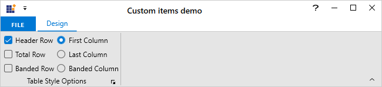
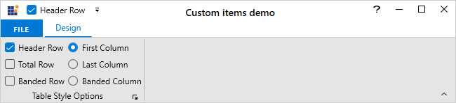

# RibbonItemHost in WPF Ribbon

WPF Ribbon allows adding any control within the RibbonBar but it does not provide support to add that control in QAT or customize using QAT customization dialog. However, the [`RibbonItemHost`](https://help.syncfusion.com/cr/wpf/Syncfusion.Windows.Tools.Controls.RibbonItemHost.html) allows hosting any control, such as Combobox, Textbox, Radio button, Checkbox, and more to be displayed on the [`RibbonBar`](https://help.syncfusion.com/cr/wpf/Syncfusion.Windows.Tools.Controls.RibbonBar.html) and also allows to add in [`QuickAccessToolBar`](https://help.syncfusion.com/cr/wpf/Syncfusion.Windows.Tools.Controls.QuickAccessToolBar.html) or customize using QAT customization dialog.

## Adding custom items to the Ribbon

The [`RibbonItemHost`](https://help.syncfusion.com/cr/wpf/Syncfusion.Windows.Tools.Controls.RibbonItemHost.html) [`ContentTemplate`](https://help.syncfusion.com/cr/wpf/Syncfusion.Windows.Tools.Controls.RibbonItemHost.html#Syncfusion_Windows_Tools_Controls_RibbonItemHost_ContentTemplate) property can be used to host any control.

In the below example, MS CheckBox is set to the [`ContentTemplate`](https://help.syncfusion.com/cr/wpf/Syncfusion.Windows.Tools.Controls.RibbonItemHost.html#Syncfusion_Windows_Tools_Controls_RibbonItemHost_ContentTemplate) property of the [`RibbonItemHost`](https://help.syncfusion.com/cr/wpf/Syncfusion.Windows.Tools.Controls.RibbonItemHost.html) within the [`RibbonBar`](https://help.syncfusion.com/cr/wpf/Syncfusion.Windows.Tools.Controls.RibbonBar.html). 





<syncfusion:RibbonWindow x:Class="Ribbon.MainWindow"
        xmlns="http://schemas.microsoft.com/winfx/2006/xaml/presentation"
        xmlns:x="http://schemas.microsoft.com/winfx/2006/xaml"
        xmlns:d="http://schemas.microsoft.com/expression/blend/2008"
        xmlns:mc="http://schemas.openxmlformats.org/markup-compatibility/2006"
        xmlns:local="clr-namespace:Ribbon"
        mc:Ignorable="d"
        xmlns:syncfusion="http://schemas.syncfusion.com/wpf"
        xmlns:skin="clr-namespace:Syncfusion.SfSkinManager;assembly=Syncfusion.SfSkinManager.WPF"
        skin:SfSkinManager.Theme="{skin:SkinManagerExtension ThemeName=FluentLight}"
        WindowStartupLocation="CenterScreen" 
        Title="Custom items demo" Height="450" Width="650">
    <syncfusion:RibbonWindow.DataContext>
        <local:ViewModel />
    </syncfusion:RibbonWindow.DataContext>
    <Grid>
        <syncfusion:Ribbon x:Name="mainRibbon">
            <syncfusion:RibbonTab Caption="Design">
                <syncfusion:RibbonBar Header="Table Style Options">
                    <syncfusion:RibbonItemHost>
                        <syncfusion:RibbonItemHost.ContentTemplate>
                            <DataTemplate>
                                <CheckBox Content="Header Row" Height="22"/>
                            </DataTemplate>
                        </syncfusion:RibbonItemHost.ContentTemplate>
                    </syncfusion:RibbonItemHost>
                    <syncfusion:RibbonItemHost>
                        <syncfusion:RibbonItemHost.ContentTemplate>
                            <DataTemplate>
                                <CheckBox Content="Total Row" Height="22"/>
                            </DataTemplate>
                        </syncfusion:RibbonItemHost.ContentTemplate>
                    </syncfusion:RibbonItemHost>
                    <syncfusion:RibbonItemHost>
                        <syncfusion:RibbonItemHost.ContentTemplate>
                            <DataTemplate>
                                <CheckBox Content="Banded Row" Height="22"/>
                            </DataTemplate>
                        </syncfusion:RibbonItemHost.ContentTemplate>
                    </syncfusion:RibbonItemHost>
                    <syncfusion:RibbonItemHost>
                        <syncfusion:RibbonItemHost.ContentTemplate>
                            <DataTemplate>
                                <RadioButton Margin="4,0,0,0" Content="First Column" Height="22"/>
                            </DataTemplate>
                        </syncfusion:RibbonItemHost.ContentTemplate>
                    </syncfusion:RibbonItemHost>
                    <syncfusion:RibbonItemHost>
                        <syncfusion:RibbonItemHost.ContentTemplate>
                            <DataTemplate>
                                <RadioButton Margin="4,0,0,0" Content="Last Column" Height="22"/>
                            </DataTemplate>
                        </syncfusion:RibbonItemHost.ContentTemplate>
                    </syncfusion:RibbonItemHost>
                    <syncfusion:RibbonItemHost>
                        <syncfusion:RibbonItemHost.ContentTemplate>
                            <DataTemplate>
                                <RadioButton Margin="4,0,0,0" Content="Banded Column" Height="22"/>
                            </DataTemplate>
                        </syncfusion:RibbonItemHost.ContentTemplate>
                    </syncfusion:RibbonItemHost>
                </syncfusion:RibbonBar>
            </syncfusion:RibbonTab>
            <syncfusion:Ribbon.QuickAccessToolBar>
                <syncfusion:QuickAccessToolBar/>
            </syncfusion:Ribbon.QuickAccessToolBar>
            <syncfusion:Ribbon.BackStage>
                <syncfusion:Backstage>
                    <syncfusion:BackStageCommandButton Header="Save" >
                        <syncfusion:BackStageCommandButton.IconTemplate>
                            <DataTemplate>
                                <Path Width="12" Height="12" HorizontalAlignment="Center" VerticalAlignment="Center"
                         Data="M5.0000019,11 L5.0000019,15 11.000002,15 11.000002,11 z M4.0000019,1 L4.0000019,6 12.000002,6 12.000002,1 z M1,1 L1,13.174 2.7160001,15 4.0000019,15 4.0000019,10 12.000002,10 12.000002,15 15,15 15,1 13.000002,1 13.000002,7 3.0000019,7 3.0000019,1 z M0,0 L3.0000019,0 13.000002,0 16,0 16,16 12.000002,16 4.0000019,16 2.2840004,16 0,13.57 z"
                         Fill="{Binding RelativeSource={RelativeSource Mode=Self}, Path=(TextBlock.Foreground)}" Stretch="Uniform" />
                            </DataTemplate>
                        </syncfusion:BackStageCommandButton.IconTemplate>
                    </syncfusion:BackStageCommandButton>
                    <syncfusion:BackStageCommandButton Header="Close" >
                        <syncfusion:BackStageCommandButton.IconTemplate>
                            <DataTemplate>
                                <Grid Width="12" Height="12" HorizontalAlignment="Center" VerticalAlignment="Center" SnapsToDevicePixels="true">
                                    <Path
                                        Width="12" Height="12" HorizontalAlignment="Center" VerticalAlignment="Center"
                                        Data="M1.4139423,0L7.0029922,5.5845888 12.592018,0 14.006015,1.4149939 8.4180527,6.9985202 14.006,12.582007 12.591996,13.997001 7.0030056,8.4124444 1.4140122,13.997001 1.5026823E-05,12.582007 5.5879484,6.9985092 0,1.4149939z "
                                        Fill="{Binding RelativeSource={RelativeSource Mode=Self}, Path=(TextBlock.Foreground)}" 
                                        SnapsToDevicePixels="True" Stretch="Fill" />
                                </Grid>
                            </DataTemplate>
                        </syncfusion:BackStageCommandButton.IconTemplate>
                    </syncfusion:BackStageCommandButton>
                </syncfusion:Backstage>
            </syncfusion:Ribbon.BackStage>
        </syncfusion:Ribbon>
    </Grid>
</syncfusion:RibbonWindow>





## Adding the custom item to the QAT

The control hosted in [`RibbonItemHost`](https://help.syncfusion.com/cr/wpf/Syncfusion.Windows.Tools.Controls.RibbonItemHost.html) can be added to the [`QuickAccessToolBar`](https://help.syncfusion.com/cr/wpf/Syncfusion.Windows.Tools.Controls.QuickAccessToolBar.html) using ribbon context menu or through QAT customization dialog. In the QAT customization dialog, all the ribbon items are displayed using its [`Label`](https://help.syncfusion.com/cr/wpf/Syncfusion.Windows.Tools.Controls.RibbonItemsControl.html#Syncfusion_Windows_Tools_Controls_RibbonItemsControl_Label) and [`IconTemplate`](https://help.syncfusion.com/cr/wpf/Syncfusion.Windows.Tools.Controls.RibbonItemsControl.html#Syncfusion_Windows_Tools_Controls_RibbonItemsControl_IconTemplate) properties. Similarly, the [`RibbonItemHost`](https://help.syncfusion.com/cr/wpf/Syncfusion.Windows.Tools.Controls.RibbonItemHost.html) also allows us to set the label and icon using its [`Label`](https://help.syncfusion.com/cr/wpf/Syncfusion.Windows.Tools.Controls.RibbonItemHost.html#Syncfusion_Windows_Tools_Controls_RibbonItemHost_Label) and [`IconTemplate`](https://help.syncfusion.com/cr/wpf/Syncfusion.Windows.Tools.Controls.RibbonItemHost.html#Syncfusion_Windows_Tools_Controls_RibbonItemHost_IconTemplate) properties respectively.

* [`Label`](https://help.syncfusion.com/cr/wpf/Syncfusion.Windows.Tools.Controls.RibbonItemHost.html#Syncfusion_Windows_Tools_Controls_RibbonItemHost_Label) - Used to display the text of [`RibbonItemHost`](https://help.syncfusion.com/cr/wpf/Syncfusion.Windows.Tools.Controls.RibbonItemHost.html) inside the QAT customization dialog.

* [`IconTemplate`](https://help.syncfusion.com/cr/wpf/Syncfusion.Windows.Tools.Controls.RibbonItemHost.html#Syncfusion_Windows_Tools_Controls_RibbonItemHost_IconTemplate) - Gets or sets the template that is used to display the icon of [`RibbonItemHost`](https://help.syncfusion.com/cr/wpf/Syncfusion.Windows.Tools.Controls.RibbonItemHost.html) inside the QAT customization dialog.

In the below example, the [`Label`](https://help.syncfusion.com/cr/wpf/Syncfusion.Windows.Tools.Controls.RibbonItemHost.html#Syncfusion_Windows_Tools_Controls_RibbonItemHost_Label) and [`IconTemplate`](https://help.syncfusion.com/cr/wpf/Syncfusion.Windows.Tools.Controls.RibbonItemHost.html#Syncfusion_Windows_Tools_Controls_RibbonItemHost_IconTemplate) are set for the [`RibbonItemHost`](https://help.syncfusion.com/cr/wpf/Syncfusion.Windows.Tools.Controls.RibbonItemHost.html) controls which will be used when the items are displayed in the QAT customization dialog. 





<syncfusion:RibbonWindow x:Class="Ribbon.MainWindow"
        xmlns="http://schemas.microsoft.com/winfx/2006/xaml/presentation"
        xmlns:x="http://schemas.microsoft.com/winfx/2006/xaml"
        xmlns:d="http://schemas.microsoft.com/expression/blend/2008"
        xmlns:mc="http://schemas.openxmlformats.org/markup-compatibility/2006"
        xmlns:local="clr-namespace:Ribbon"
        mc:Ignorable="d"
        xmlns:syncfusion="http://schemas.syncfusion.com/wpf"
        xmlns:skin="clr-namespace:Syncfusion.SfSkinManager;assembly=Syncfusion.SfSkinManager.WPF"
        skin:SfSkinManager.Theme="{skin:SkinManagerExtension ThemeName=FluentLight}"
        WindowStartupLocation="CenterScreen" 
        Title="Custom items demo" Height="450" Width="650">
    <syncfusion:RibbonWindow.DataContext>
        <local:ViewModel />
    </syncfusion:RibbonWindow.DataContext>
    <syncfusion:RibbonWindow.Resources>
        <DataTemplate x:Key="OnePage">
            <Grid>
                <Path
                        Width="13"
                        Height="16"
                        Margin="0.5"
                        Data="M0,0 L11,0 11,15 0,15 z"
                        Fill="White"
                        Stretch="Fill" />
                <Path
                         Margin="1"
                         Data="M1,1 L1,15 11,15 11,1 z M0,0 L12,0 12,4.158 12,5.0689998 12,16 0,16 z"
                         Fill="#FF3A3A38"
                         Stretch="Fill" />
                <Path
                         Margin="3"
                         Data="M0,8.9999991 L5.9999999,8.9999991 5.9999999,9.999999 0,9.999999 z M3.2782552E-06,5.9999998 L6.0000033,5.9999998 6.0000033,6.9999996 3.2782552E-06,6.9999996 z M3.2782552E-06,2.9999995 L6.0000033,2.9999995 6.0000033,3.9999995 3.2782552E-06,3.9999995 z M3.4272668E-06,0 L6.0000033,0 6.0000033,0.99999952 3.4272668E-06,0.99999952 z"
                         Fill="#FF797774"
                         Stretch="Fill" />
            </Grid>
        </DataTemplate>
        <DataTemplate x:Key="AlignLeft">
            <Path
                        x:Name="Align_Left1"
                        Width="14"
                        Height="13"
                        Margin="2,0"
                        HorizontalAlignment="Left"
                        VerticalAlignment="Bottom"
                        Data="M0,12 L10,12 10,13 0,13 z M0,8 L14,8 14,9 0,9 z M0,4 L10,4 10,5 0,5 z M0,0 L14,0 14,1 0,1 z"
                        Fill="{Binding RelativeSource={RelativeSource Mode=Self}, Path=(TextBlock.Foreground)}"
                        Stretch="Fill" />
        </DataTemplate>
        <DataTemplate x:Key="Tables">
            <Grid MaxHeight="32" MaxWidth="32">
                <Path
                          Margin="0.5,4.5,0.5,0.5"
                          Data="M0,0 L27,0 27,23 0,23 z"
                          Fill="White"
                          Stretch="Fill" />
                <Path
                          Height="4"
                          Margin="0.5,0.5,0.5,0"
                          VerticalAlignment="Top"
                          Data="M0,0 L27,0 27,4 0,4 z"
                          Fill="#FFC8C6C4"
                          Stretch="Fill" />
                <Path
                          Margin="1,5,1,1"
                          Data="M9,8 L9,14 17,14 17,8 z M8,0 L9,0 9,7 17,7 17,0 18,0 18,7 26,7 26,8 18,8 18,14 26,14 26,15 18,15 18,22 17,22 17,15 9,15 9,22 8,22 8,15 0,15 0,14 8,14&#xa;8,8 0,8 0,7 8,7 z"
                          Fill="#FF797774"
                          Stretch="Fill" />
                <Path
                          Data="M0.99999994,5.0000001 L0.99999994,27 27,27 27,5.0000001 z M0.99999994,1 L0.99999994,4.0000002 27,4.0000002 27,1 z M0,0 L28,0 28,4.0000002 28,5.0000001 28,28 0,28 0,5.0000001 0,4.0000002 z"
                          Fill="#FF3A3A38"
                          Stretch="Fill" />
            </Grid>
        </DataTemplate>
    </syncfusion:RibbonWindow.Resources>
    <Grid>
        <syncfusion:Ribbon x:Name="mainRibbon">
            <syncfusion:RibbonTab Caption="Design">
                <syncfusion:RibbonBar Header="Table Style Options" IconTemplate="{StaticResource Tables}">
                    <syncfusion:RibbonItemHost Label="Header Row" IconTemplate="{StaticResource OnePage}">
                        <syncfusion:RibbonItemHost.ContentTemplate>
                            <DataTemplate>
                                <CheckBox Content="Header Row" Height="22"/>
                            </DataTemplate>
                        </syncfusion:RibbonItemHost.ContentTemplate>
                    </syncfusion:RibbonItemHost>
                    <syncfusion:RibbonItemHost Label="First Column" IconTemplate="{StaticResource AlignLeft}">
                        <syncfusion:RibbonItemHost.ContentTemplate>
                            <DataTemplate>
                                <RadioButton Margin="4,0,0,0" Content="First Column" Height="22"/>
                            </DataTemplate>
                        </syncfusion:RibbonItemHost.ContentTemplate>
                    </syncfusion:RibbonItemHost>
                </syncfusion:RibbonBar>
            </syncfusion:RibbonTab>
            <syncfusion:Ribbon.QuickAccessToolBar>
                <syncfusion:QuickAccessToolBar/>
            </syncfusion:Ribbon.QuickAccessToolBar>
            <syncfusion:Ribbon.BackStage>
                <syncfusion:Backstage>
                    <syncfusion:BackStageCommandButton Header="Save" >
                        <syncfusion:BackStageCommandButton.IconTemplate>
                            <DataTemplate>
                                <Path Width="12" Height="12" HorizontalAlignment="Center" VerticalAlignment="Center"
                         Data="M5.0000019,11 L5.0000019,15 11.000002,15 11.000002,11 z M4.0000019,1 L4.0000019,6 12.000002,6 12.000002,1 z M1,1 L1,13.174 2.7160001,15 4.0000019,15 4.0000019,10 12.000002,10 12.000002,15 15,15 15,1 13.000002,1 13.000002,7 3.0000019,7 3.0000019,1 z M0,0 L3.0000019,0 13.000002,0 16,0 16,16 12.000002,16 4.0000019,16 2.2840004,16 0,13.57 z"
                         Fill="{Binding RelativeSource={RelativeSource Mode=Self}, Path=(TextBlock.Foreground)}" Stretch="Uniform" />
                            </DataTemplate>
                        </syncfusion:BackStageCommandButton.IconTemplate>
                    </syncfusion:BackStageCommandButton>
                    <syncfusion:BackStageCommandButton Header="Close" >
                        <syncfusion:BackStageCommandButton.IconTemplate>
                            <DataTemplate>
                                <Grid Width="12" Height="12" HorizontalAlignment="Center" VerticalAlignment="Center" SnapsToDevicePixels="true">
                                    <Path
                                        Width="12" Height="12" HorizontalAlignment="Center" VerticalAlignment="Center"
                                        Data="M1.4139423,0L7.0029922,5.5845888 12.592018,0 14.006015,1.4149939 8.4180527,6.9985202 14.006,12.582007 12.591996,13.997001 7.0030056,8.4124444 1.4140122,13.997001 1.5026823E-05,12.582007 5.5879484,6.9985092 0,1.4149939z "
                                        Fill="{Binding RelativeSource={RelativeSource Mode=Self}, Path=(TextBlock.Foreground)}" 
                                        SnapsToDevicePixels="True" Stretch="Fill" />
                                </Grid>
                            </DataTemplate>
                        </syncfusion:BackStageCommandButton.IconTemplate>
                    </syncfusion:BackStageCommandButton>
                </syncfusion:Backstage>
            </syncfusion:Ribbon.BackStage>
        </syncfusion:Ribbon>
    </Grid>
</syncfusion:RibbonWindow>





 N> [View sample in GitHub](https://github.com/SyncfusionExamples/syncfusion-wpf-ribbon-examples/tree/main/Samples/Adding-custom-items-to-the-ribbon)
