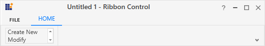

# RibbonListBox

`RibbonListBox` control is used to display a list of items in a Ribbon. It accepts any type of content as RibbonListBox items but `ListBoxItem` by default.





<syncfusion:Ribbon Name="_ribbon" HorizontalAlignment="Stretch" VerticalAlignment="Top">
<syncfusion:RibbonTab Name="_ribbonTab1" Caption="HOME"  IsChecked="True">
<syncfusion:RibbonBar Name="_ribbonBar1" Header="RibbonBar1">
<syncfusion:RibbonButton   Label="Cut"/>
<syncfusion:RibbonButton   Label="Copy"/>
</syncfusion:RibbonBar>
<syncfusion:RibbonBar  Name="_ribbonBar2" Width="150" Header="RibbonBar2">
<syncfusion:RibbonListBox  Width="140" >
<ListBoxItem Content="Office2003Theme"/>
<ListBoxItem Content="Office2007Theme"/>
<ListBoxItem Content="Office2010Theme"/>
</syncfusion:RibbonListBox>                
</syncfusion:RibbonBar>
</syncfusion:RibbonTab>
<syncfusion:RibbonTab Caption="EDIT"  IsChecked="False"/>
</syncfusion:Ribbon>





Create instance of RibbonListBox and add it to RibbonBar through code behind.





RibbonListBox _ribbonListBox = new RibbonListBox();
ListBoxItem item1 = new ListBoxItem(){Content = "Office2003Theme"};
ListBoxItem item2 = new ListBoxItem(){Content = "Office2007Theme"};
ListBoxItem item3= new ListBoxItem(){Content = "Office2010Theme"};
_ribbonListBox.Items.Add(item1);
_ribbonListBox.Items.Add(item2);
_ribbonListBox.Items.Add(item3);
_ribbonBar2.Items.Add(_ribbonListBox);





Dim _ribbonListBox As New RibbonListBox()
Dim item1 As New ListBoxItem() With {.Content = "Office2003Theme"}
Dim item2 As New ListBoxItem() With {.Content = "Office2007Theme"}
Dim item3 As New ListBoxItem() With {.Content = "Office2010Theme"}
_ribbonListBox.Items.Add(item1)
_ribbonListBox.Items.Add(item2)
_ribbonListBox.Items.Add(item3)
_ribbonBar2.Items.Add(_ribbonListBox)





## Add ListBox to the Simplified layout

When the simplified layout is enabled, the RibbonListBox can be added and displayed in a single line as shown below. To know more about the simplified layout, refer [here](https://help.syncfusion.com/wpf/ribbon/simplifiedlayout).





<syncfusion:RibbonWindow x:Class="RibbonButton_IconTemp.Window1"
        xmlns="http://schemas.microsoft.com/winfx/2006/xaml/presentation"
        xmlns:x="http://schemas.microsoft.com/winfx/2006/xaml"
        xmlns:d="http://schemas.microsoft.com/expression/blend/2008"
        xmlns:mc="http://schemas.openxmlformats.org/markup-compatibility/2006"
        xmlns:local="clr-namespace:RibbonButton_IconTemp" xmlns:skin="clr-namespace:Syncfusion.SfSkinManager;assembly=Syncfusion.SfSkinManager.WPF"
        mc:Ignorable="d" xmlns:syncfusion="http://schemas.syncfusion.com/wpf"
        skin:SfSkinManager.VisualStyle="MaterialLight"
        Title="Untitled 1 - Ribbon Control" Height="450" Width="800">
    <Grid x:Name="grid">
        <syncfusion:Ribbon VerticalAlignment="Top" EnableSimplifiedLayoutMode="True" LayoutMode="Simplified">
            <syncfusion:RibbonTab Caption="HOME"  IsChecked="True">
                <syncfusion:RibbonBar Header="Options">
                    <syncfusion:RibbonListBox  Width="100" >
                        <ListBoxItem Content="Create New"/>
                        <ListBoxItem Content="Modify"/>
                        <ListBoxItem Content="Delete"/>
                    </syncfusion:RibbonListBox>
                </syncfusion:RibbonBar>
            </syncfusion:RibbonTab>
        </syncfusion:Ribbon>
    </Grid>
</syncfusion:RibbonWindow>





Ribbon ribbon = new Ribbon();
ribbon.VerticalAlignment = VerticalAlignment.Top;
ribbon.EnableSimplifiedLayoutMode = true;
ribbon.LayoutMode = LayoutMode.Simplified;
// Creating new tabs
RibbonTab homeTab = new RibbonTab();
homeTab.Caption = "Home";
homeTab.IsChecked = true;

// Creating new bar
RibbonBar optionsBar = new RibbonBar();
optionsBar.Header = "Options";

// Creating items
RibbonListBox ribbonListBox = new RibbonListBox();
ListBoxItem item1 = new ListBoxItem() { Content = "Create New" };
ListBoxItem item2 = new ListBoxItem() { Content = "Modify" };
ListBoxItem item3 = new ListBoxItem() { Content = "Delete" };
ribbonListBox.Items.Add(item1);
ribbonListBox.Items.Add(item2);
ribbonListBox.Items.Add(item3);

// Adding items to bar
optionsBar.Items.Add(ribbonListBox);

// Adding bars to the tabs
homeTab.Items.Add(optionsBar);

// Adding tabs to ribbon
ribbon.Items.Add(homeTab);
grid.Children.Add(ribbon);
SfSkinManager.SetVisualStyle(this, VisualStyles.MaterialLight);





When arranging in simplified layout alone, the **Margin**, **Width** and **Height** values of the RibbonListBox can be ignored as it will be resized automatically to the standard width and height. If the RibbonListBox is to be shown in both normal and simplified layout, the **Margin**, **Width** and **Height** properties can be set for normal layout alone using triggers.





<syncfusion:RibbonListBox syncfusion:SimplifiedLayoutSettings.DisplayMode="Normal,Simplified" >
    <ListBoxItem Content="Item 1"/>
    <ListBoxItem Content="Item 2"/>
    <syncfusion:RibbonListBox.Style >
        
    </syncfusion:RibbonListBox.Style>
</syncfusion:RibbonListBox > 





