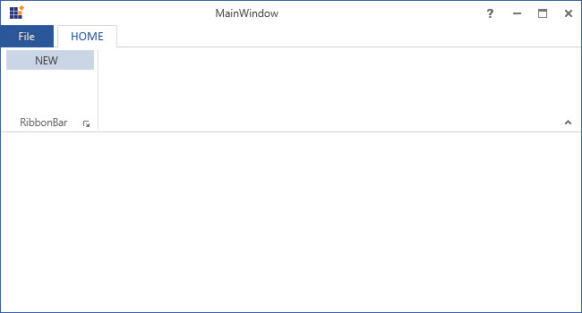
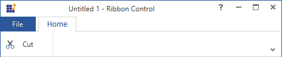

# RibbonMenuItem in WPF Ribbon

`RibbonMenuItem` used as entity in menus like ApplicationMenu, DropDownButton, SplitButton, context menu, and so on.

## RibbonMenuItem header

The header property used to set the name of the MenuItem. The same has been explained below:





<syncfusion:Ribbon Name="_ribbon" HorizontalAlignment="Stretch" VerticalAlignment="Top">
<syncfusion:RibbonTab Name="_ribbonTab1" Caption="HOME"  >
<syncfusion:RibbonBar Name="_ribbonBar1">
<syncfusion:RibbonMenuItem  Header="NEW" Width="100"></syncfusion:RibbonMenuItem>
</syncfusion:RibbonBar>
</syncfusion:RibbonTab>
</syncfusion:Ribbon>





Create instance of RibbonMenuItem and add it to RibbonBar through code behind.





RibbonMenuItem _ribbonMenuItem = new RibbonMenuItem(){Header = "NEW", Width = 100};
_ribbonBar1.Items.Add(_ribbonMenuItem);





Dim _ribbonMenuItem As New RibbonMenuItem() With {
	.Header = "NEW",
	.Width = 100
}

_ribbonBar1.Items.Add(_ribbonMenuItem)





## RibbonMenuItem icon

The Icon property used to set the Icon for that RibbonMenuItem. The same has been explained in the below code example:





<syncfusion:Ribbon Name="_ribbon" HorizontalAlignment="Stretch" VerticalAlignment="Top">
<syncfusion:RibbonTab Name="_ribbonTab1" Caption="HOME"  >
<syncfusion:RibbonBar Name="_ribbonBar1">
<syncfusion:RibbonMenuItem Header="NEW">
<syncfusion:RibbonMenuItem.Icon>
<Image Source="SampleImages\options.png"/>
</syncfusion:RibbonMenuItem.Icon>
</syncfusion:RibbonMenuItem>
</syncfusion:RibbonBar>
</syncfusion:RibbonTab>
<syncfusion:RibbonTab Name="_ribbonTab2" Caption="View">
<syncfusion:RibbonBar Name="_ribbonBar2">
<syncfusion:RibbonMenuItem Header="View"  IconBarEnabled="True">
<syncfusion:RibbonMenuItem.Icon>
<Image Source="SampleImages\sharing.png"/>
</syncfusion:RibbonMenuItem.Icon>
</syncfusion:RibbonMenuItem>
</syncfusion:RibbonBar>
</syncfusion:RibbonTab>
</syncfusion:Ribbon>







Create instance of RibbonMenuItem and add the icon for RibbonBar through code behind.



RibbonMenuItem _ribbonMenuItem = new RibbonMenuItem() { Header = "NEW1", Width = 100, Icon = new Image { Source = new BitmapImage(new Uri(@"SampleImages\sharing.png", UriKind.RelativeOrAbsolute)) } };





RibbonMenuItem _ribbonMenuItem = new RibbonMenuItem() { Header = "NEW1", Width = 100, Icon = new Image { Source = new BitmapImage(new Uri(@"SampleImages\sharing.png", UriKind.RelativeOrAbsolute)) } };





## Add MenuItem to the simplified layout

When the simplified layout is enabled, the RibbonMenuItem can be added and displayed in a single line as shown below. To know more about the simplified layout, refer [here](https://help.syncfusion.com/wpf/ribbon/simplifiedlayout).





<syncfusion:RibbonWindow x:Class="RibbonButton_IconTemp.MainWindow"
        xmlns="http://schemas.microsoft.com/winfx/2006/xaml/presentation"
        xmlns:x="http://schemas.microsoft.com/winfx/2006/xaml"
        xmlns:d="http://schemas.microsoft.com/expression/blend/2008"
        xmlns:mc="http://schemas.openxmlformats.org/markup-compatibility/2006"
        xmlns:local="clr-namespace:RibbonButton_IconTemp"
        xmlns:syncfusion="http://schemas.syncfusion.com/wpf"
        mc:Ignorable="d"
        syncfusion:SkinStorage.VisualStyle="Office2013"
        Title="Untitled 1 - Ribbon Control" Height="450" Width="800">
    <Grid x:Name="grid">
        <syncfusion:Ribbon VerticalAlignment="Top" EnableSimplifiedLayoutMode="True" LayoutMode="Simplified">
            <syncfusion:RibbonTab Caption="Home" IsChecked="True">
                <syncfusion:RibbonBar Header="Clipboard">
                    <syncfusion:RibbonMenuItem Header="Cut" IconBarEnabled="True">
                        <syncfusion:RibbonMenuItem.Icon>
                            <Image Source="/Resources/Cut16.png"/>
                        </syncfusion:RibbonMenuItem.Icon>
                    </syncfusion:RibbonMenuItem>
                </syncfusion:RibbonBar>
            </syncfusion:RibbonTab> 
        </syncfusion:Ribbon>
    </Grid>
</syncfusion:RibbonWindow>





Ribbon ribbon = new Ribbon();
ribbon.VerticalAlignment = VerticalAlignment.Top;
ribbon.EnableSimplifiedLayoutMode = true;
ribbon.LayoutMode = LayoutMode.Simplified;
// Creating new tabs
RibbonTab homeTab = new RibbonTab();
homeTab.Caption = "Home";
homeTab.IsChecked = true;

// Creating new bar
RibbonBar clipboardBar = new RibbonBar();
clipboardBar.Header = "Clipboard";

// Creating items
RibbonMenuItem ribbonMenuItem = new RibbonMenuItem();
ribbonMenuItem.Header = "Cut";
ribbonMenuItem.IconBarEnabled = true;
ribbonMenuItem.Icon = new Image { Source = new BitmapImage(new Uri(@"Resources\Cut16.png", UriKind.RelativeOrAbsolute)) };
// Adding items to the bar
clipboardBar.Items.Add(ribbonMenuItem);
homeTab.Items.Add(clipboardBar);
ribbon.Items.Add(homeTab);
grid.Children.Add(ribbon);

SkinStorage.SetVisualStyle(this, "Office2013");





When arranging in simplified layout alone, the **Margin**, **Width** and **Height** values of the RibbonMenuItem can be ignored as it will be resized automatically to the standard width and height. If the RibbonMenuItem is to be shown in both normal and simplified layout, the **Margin**, **Width** and **Height** properties can be set for normal layout alone using triggers.





<syncfusion:RibbonMenuItem Header="Menu item" syncfusion:SimplifiedLayoutSettings.DisplayMode="Normal,Simplified" >
    <syncfusion:RibbonMenuItem.Style>
        
    </syncfusion:RibbonMenuItem.Style>
</syncfusion:RibbonMenuItem >





## IconSizeChanged event

The event occurs when the IconSize property of the RibbonMenuItem get changed.





<syncfusion:RibbonMenuItem Header="View"  IconBarEnabled="True" IconSizeChanged="RibbonMenuItem_IconSizeChanged"/>





RibbonMenuItem menuItem = new RibbonMenuItem();
menuItem.IconSizeChanged += RibbonMenuItem_IconSizeChanged;





Private menuItem As RibbonMenuItem = New RibbonMenuItem()
menuItem.IconSizeChanged += RibbonMenuItem_IconSizeChanged 





To handle the IconSizeChanged event, refer the following code:





private void RibbonMenuItem_IconSizeChanged(DependencyObject d, DependencyPropertyChangedEventArgs e)
{
// Insert code to do some operations when the IconSize property is changed 
}





Private Sub RibbonMenuItem_IconSizeChanged(ByVal d As DependencyObject, ByVal e As DependencyPropertyChangedEventArgs)

'Insert code to do some operations when the IconSize property is changed
End Sub





## FlowDirectionChanged event

The event occurs when the FlowDirection property of the RibbonMenuItem get changed.





<syncfusion:RibbonMenuItem Header="View" FlowDirectionChanged="RibbonMenuItem_FlowDirectionChanged"/>





RibbonMenuItem menuItem = new RibbonMenuItem();
menuItem.FlowDirectionChanged += RibbonMenuItem_FlowDirectionChanged;            





Private menuItem As RibbonMenuItem = New RibbonMenuItem()
menuItem.FlowDirectionChanged += RibbonMenuItem_FlowDirectionChanged





To handle the FlowDirectionChanged event, refer the following code:





private void RibbonMenuItem_FlowDirectionChanged(DependencyObject d, DependencyPropertyChangedEventArgs e)
{
// Insert code to do some operations when the FlowDirection property is changed 
} 





Private Sub RibbonMenuItem_IconSizeChanged(ByVal d As DependencyObject, ByVal e As DependencyPropertyChangedEventArgs)
'Insert code to do some operations when the IconSize property is changed
End Sub




