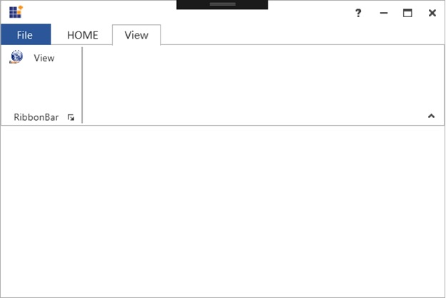

# RibbonMenuItem

`RibbonMenuItem` used as entity in menus like ApplicationMenu, DropDownButton, SplitButton, context menu, and so on.

## RibbonMenuItem Header

The header property used to set the name of the MenuItem. The same has been explained below:





<syncfusion:Ribbon Name="_ribbon" HorizontalAlignment="Stretch" VerticalAlignment="Top">

<syncfusion:RibbonTab Name="_ribbonTab1" Caption="HOME"  >

<syncfusion:RibbonBar Name="_ribbonBar1">

<syncfusion:RibbonMenuItem  Header="NEW" Width="100"></syncfusion:RibbonMenuItem>

</syncfusion:RibbonBar>

</syncfusion:RibbonTab>

</syncfusion:Ribbon>





Create instance of RibbonMenuItem and add it to RibbonBar through code behind.





RibbonMenuItem _ribbonMenuItem = new RibbonMenuItem(){Header = "NEW", Width = 100};

_ribbonBar1.Items.Add(_ribbonMenuItem);





Dim _ribbonMenuItem As New RibbonMenuItem() With {
	.Header = "NEW",
	.Width = 100
}

_ribbonBar1.Items.Add(_ribbonMenuItem)





## RibbonMenuItem Icon

The Icon property used to set the Icon for that RibbonMenuItem. The same has been explained in the below code example:





<syncfusion:Ribbon Name="_ribbon" HorizontalAlignment="Stretch" VerticalAlignment="Top">
            <syncfusion:RibbonTab Name="_ribbonTab1" Caption="HOME"  >
                <syncfusion:RibbonBar Name="_ribbonBar1">
                    <syncfusion:RibbonMenuItem Header="NEW">
                        <syncfusion:RibbonMenuItem.Icon>
                            <Image Source="SampleImages\options.png"/>
                        </syncfusion:RibbonMenuItem.Icon>
                    </syncfusion:RibbonMenuItem>
                </syncfusion:RibbonBar>
            </syncfusion:RibbonTab>
            <syncfusion:RibbonTab Name="_ribbonTab2" Caption="View">
                <syncfusion:RibbonBar Name="_ribbonBar2">
                    <syncfusion:RibbonMenuItem Header="View"  IconBarEnabled="True">
                        <syncfusion:RibbonMenuItem.Icon>
                            <Image Source="SampleImages\sharing.png"/>
                        </syncfusion:RibbonMenuItem.Icon>
                    </syncfusion:RibbonMenuItem>
                </syncfusion:RibbonBar>
            </syncfusion:RibbonTab>
</syncfusion:Ribbon>







Create instance of RibbonMenuItem and add the icon for RibbonBar through code behind.



RibbonMenuItem _ribbonMenuItem = new RibbonMenuItem() { Header = "NEW1", Width = 100, Icon = new Image { Source = new BitmapImage(new Uri(@"SampleImages\sharing.png", UriKind.RelativeOrAbsolute)) } };





RibbonMenuItem _ribbonMenuItem = new RibbonMenuItem() { Header = "NEW1", Width = 100, Icon = new Image { Source = new BitmapImage(new Uri(@"SampleImages\sharing.png", UriKind.RelativeOrAbsolute)) } };





## IconSizeChanged event

The event occurs when the IconSize property of the RibbonMenuItem get changed.





<syncfusion:RibbonMenuItem Header="View"  IconBarEnabled="True" IconSizeChanged="RibbonMenuItem_IconSizeChanged"/>









RibbonMenuItem menuitem = new RibbonMenuItem();
menuitem.IconSizeChanged += RibbonMenuItem_IconSizeChanged;





Private menuitem As RibbonMenuItem = New RibbonMenuItem()
menuitem.IconSizeChanged += RibbonMenuItem_IconSizeChanged 





To handle the IconSizeChanged event, refer the following code:





private void RibbonMenuItem_IconSizeChanged(DependencyObject d, DependencyPropertyChangedEventArgs e)
{

 // Insert code to do some operations when the IconSize property is changed 
 }





Private Sub RibbonMenuItem_IconSizeChanged(ByVal d As DependencyObject, ByVal e As DependencyPropertyChangedEventArgs)

‘Insert code to do some operations when the IconSize property is changed

End Sub





## FlowDirectionChanged event

The event occurs when the FlowDirection property of the RibbonMenuItem get changed.





<syncfusion:RibbonMenuItem Header="View" FlowDirectionChanged="RibbonMenuItem_FlowDirectionChanged"/>









RibbonMenuItem menuitem = new RibbonMenuItem();
menuitem.FlowDirectionChanged += RibbonMenuitem_FlowDirectionChanged;            





Private menuitem As RibbonMenuItem = New RibbonMenuItem()
menuitem.FlowDirectionChanged += RibbonMenuitem_FlowDirectionChanged





To handle the FlowDirectionChanged event, refer the following code:





private void RibbonMenuItem_FlowDirectionChanged(DependencyObject d, DependencyPropertyChangedEventArgs e)
        
{

            // Insert code to do some operations when the FlowDirection property is changed 
  } 





Private Sub RibbonMenuItem_IconSizeChanged(ByVal d As DependencyObject, ByVal e As DependencyPropertyChangedEventArgs)

‘Insert code to do some operations when the IconSize property is changed

End Sub



