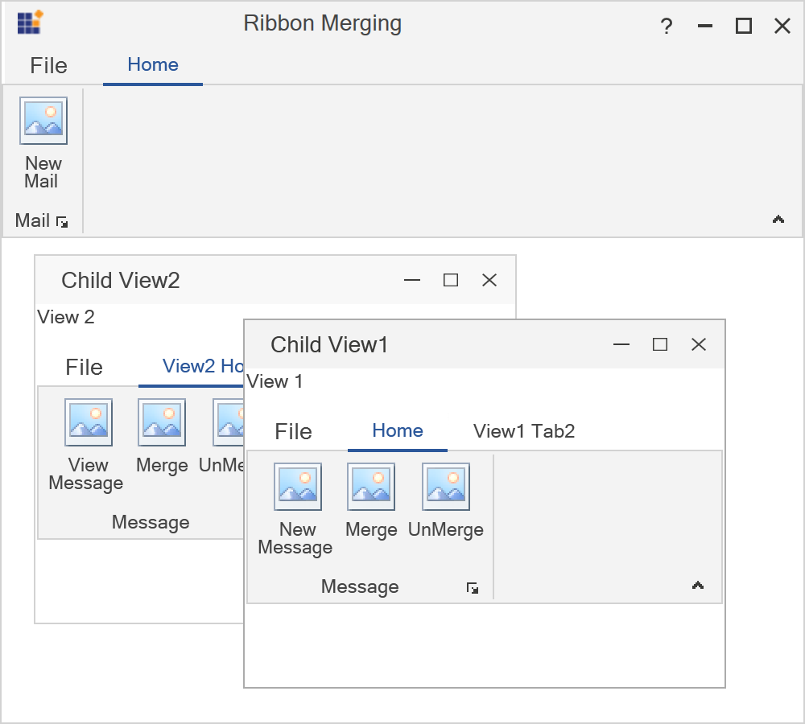
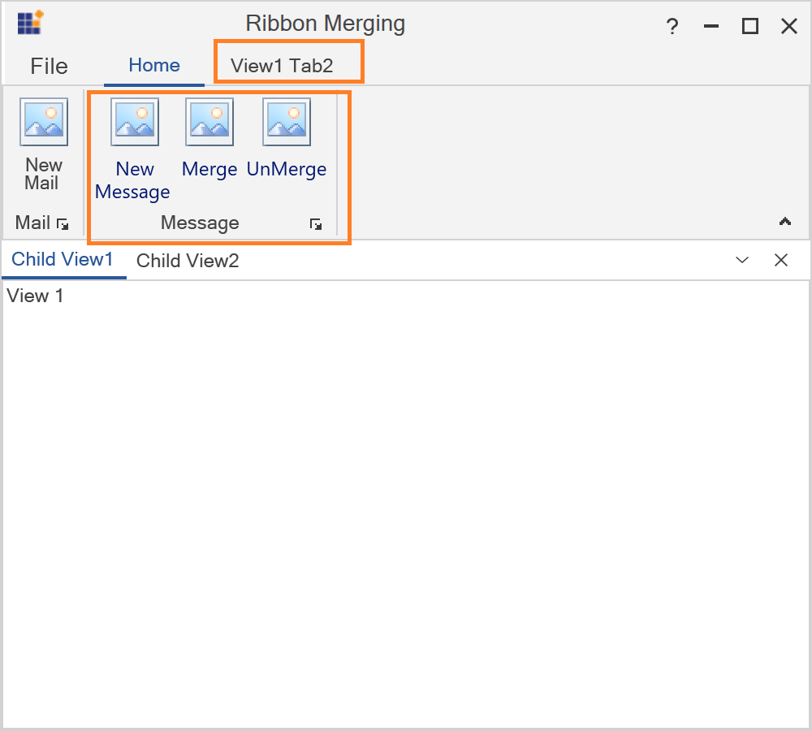
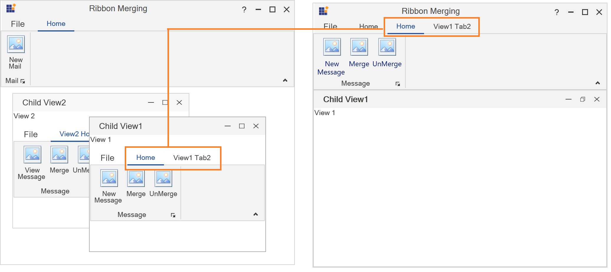
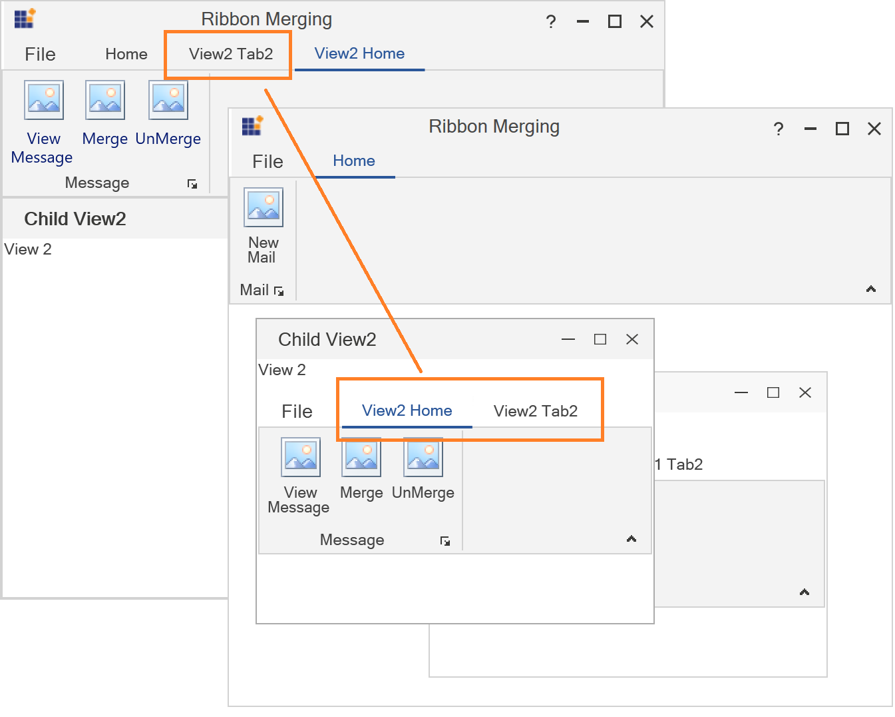

# Ribbon Merge in WPF Ribbon

WPF [Ribbon](https://help.syncfusion.com/wpf/ribbon/gettingstarted) allows merging of [RibbonTab](https://help.syncfusion.com/cr/wpf/Syncfusion.Windows.Tools.Controls.RibbonTab.html) and [RibbonBar](https://help.syncfusion.com/cr/wpf/Syncfusion.Windows.Tools.Controls.RibbonBar.html) of two different Ribbon controls in MDI applications. [DocumentContainer.MDIParentRibbon](https://help.syncfusion.com/cr/wpf/Syncfusion.Tools.Wpf~Syncfusion.Windows.Tools.Controls.DocumentContainer~MDIParentRibbon.html), [RibbonTab.MergeType](https://help.syncfusion.com/cr/wpf/Syncfusion.Tools.Wpf~Syncfusion.Windows.Tools.Controls.RibbonTab~MergeType.html) and [RibbonTab.MergeOrder](https://help.syncfusion.com/cr/wpf/Syncfusion.Tools.Wpf~Syncfusion.Windows.Tools.Controls.RibbonTab~MergeOrder.html) properties helps to perform menu merging.

In WPF, you can create MDI application using [DocumentContainer](https://help.syncfusion.com/wpf/tabbed-mdi-form/getting-started) control. Also, [Ribbon](https://help.syncfusion.com/wpf/ribbon/gettingstarted) controls allows to merge [RibbonTab](https://help.syncfusion.com/wpf/ribbon/gettingstarted#add-ribbontab) and [RibbonBar](https://help.syncfusion.com/wpf/ribbon/gettingstarted#add-ribbonbar) of active child window to the [Ribbon](https://help.syncfusion.com/wpf/ribbon/gettingstarted) in parent window. 

## Creating MDI window and enabling menu merging

[DocumentContainer](https://help.syncfusion.com/wpf/tabbed-mdi-form/getting-started) helps to create MDI window in WPF Application. The [DocumentContainer](https://help.syncfusion.com/wpf/tabbed-mdi-form/getting-started) allows you to create MDI window and Tabbed MDI window layouts.

Follow the below steps to create simple sample to understand ribbon menu merging,

 1. Creating main [RibbonWindow](https://help.syncfusion.com/cr/wpf/Syncfusion.Tools.Wpf~Syncfusion.Windows.Tools.Controls.RibbonWindow.html) with [Ribbon](https://help.syncfusion.com/wpf/ribbon/gettingstarted) and [DocumentContainer](https://help.syncfusion.com/wpf/tabbed-mdi-form/getting-started)





<syncfusion:RibbonWindow xmlns:syncfusion="http://schemas.syncfusion.com/wpf"  x:Class="Ribbon.MainWindow"
        xmlns="http://schemas.microsoft.com/winfx/2006/xaml/presentation"
        xmlns:x="http://schemas.microsoft.com/winfx/2006/xaml"
        xmlns:d="http://schemas.microsoft.com/expression/blend/2008"
        xmlns:mc="http://schemas.openxmlformats.org/markup-compatibility/2006"
        xmlns:local="clr-namespace:Ribbon"
        mc:Ignorable="d" 
        WindowStartupLocation="CenterScreen"
        xmlns:skin="clr-namespace:Syncfusion.SfSkinManager;assembly=Syncfusion.SfSkinManager.WPF"
        skin:SfSkinManager.VisualStyle="Office2019Colorful" 
        Title="Ribbon Merging" Height="450" Width="700">
    <Grid>
        <Grid.RowDefinitions>
            <RowDefinition Height="Auto"/>
            <RowDefinition Height="*"/>
        </Grid.RowDefinitions>
        <syncfusion:Ribbon x:Name="parentRibbon" >
            <syncfusion:RibbonTab Caption="Home">
                <syncfusion:RibbonBar Header="Mail">
                    <syncfusion:RibbonButton Label="New Mail" SizeForm="Large" Click="RibbonButton_Click"/>
                </syncfusion:RibbonBar>
            </syncfusion:RibbonTab>
        </syncfusion:Ribbon>
        <syncfusion:DocumentContainer x:Name="doc" Grid.Row="1" >
        </syncfusion:DocumentContainer>
    </Grid>
</syncfusion:RibbonWindow>





 2. Next, lets create two `UserControl` views with Ribbon which acts as child MDI windows.

Child View 1




<UserControl x:Class="Ribbon.ChildView1"
             xmlns="http://schemas.microsoft.com/winfx/2006/xaml/presentation"
             xmlns:x="http://schemas.microsoft.com/winfx/2006/xaml"
             xmlns:mc="http://schemas.openxmlformats.org/markup-compatibility/2006" 
             xmlns:d="http://schemas.microsoft.com/expression/blend/2008" 
             xmlns:local="clr-namespace:Ribbon"
             mc:Ignorable="d" xmlns:syncfusion="http://schemas.syncfusion.com/wpf"
             d:DesignHeight="450" d:DesignWidth="800">
    <Grid>
        <ContentPresenter>
            <ContentPresenter.Content>
                <Grid>
                    <syncfusion:Ribbon x:Name="childRibbon" >
                        <syncfusion:RibbonTab Caption="Home" MergeType="MergeItems">
                            <syncfusion:RibbonBar Header="Message">
                                <syncfusion:RibbonButton Label="New Message" SizeForm="Large"/>
                                <syncfusion:RibbonButton x:Name="MergeButton" Label="Merge"  SizeForm="Large" />
                                <syncfusion:RibbonButton x:Name="UnMergeButton" Label="UnMerge"   SizeForm="Large"/>
                            </syncfusion:RibbonBar>
                        </syncfusion:RibbonTab>
                        <syncfusion:RibbonTab Caption="View1 Tab2" >
                            <syncfusion:RibbonBar Header="Folders">
                                <syncfusion:RibbonButton Label="New Folder" SizeForm="Large"/>
                            </syncfusion:RibbonBar>
                        </syncfusion:RibbonTab>
                    </syncfusion:Ribbon>

                    <TextBlock Text="View 1"/>
                </Grid>
            </ContentPresenter.Content>
        </ContentPresenter>
    </Grid>
</UserControl>




Child View 2




<UserControl x:Class="Ribbon.ChildView2"
             xmlns="http://schemas.microsoft.com/winfx/2006/xaml/presentation"
             xmlns:x="http://schemas.microsoft.com/winfx/2006/xaml"
             xmlns:mc="http://schemas.openxmlformats.org/markup-compatibility/2006" 
             xmlns:d="http://schemas.microsoft.com/expression/blend/2008" 
             xmlns:local="clr-namespace:Ribbon"
             mc:Ignorable="d" xmlns:syncfusion="http://schemas.syncfusion.com/wpf"
             d:DesignHeight="450" d:DesignWidth="800">
    <Grid>
        <ContentPresenter>
            <ContentPresenter.Content>
                <Grid>
                    <syncfusion:Ribbon x:Name="childRibbon" >
                        <syncfusion:RibbonTab Caption="View2 Home" MergeType="AddItems">
                            <syncfusion:RibbonBar Header="Message">
                                <syncfusion:RibbonButton Label="View Message" SizeForm="Large"/>
                                <syncfusion:RibbonButton x:Name="MergeButton" Label="Merge"  SizeForm="Large" />
                                <syncfusion:RibbonButton x:Name="UnMergeButton" Label="UnMerge"   SizeForm="Large"/>
                            </syncfusion:RibbonBar>
                        </syncfusion:RibbonTab>
                        <syncfusion:RibbonTab Caption="View2 Tab2" MergeOrder="1">
                            <syncfusion:RibbonBar Header="Folders">
                                <syncfusion:RibbonButton Label="New Folder" SizeForm="Large"/>
                            </syncfusion:RibbonBar>
                        </syncfusion:RibbonTab>
                    </syncfusion:Ribbon>
                    <TextBlock Text="View 2"/>
                </Grid>
            </ContentPresenter.Content>
        </ContentPresenter>
    </Grid>
</UserControl>
   




 3. Now, add the both child view's into the [DocumentContainer](https://help.syncfusion.com/cr/wpf/Syncfusion.Tools.Wpf~Syncfusion.Windows.Tools.Controls.DocumentContainer.html) and set the the [DocumentContainer.MDIParentRibbon](https://help.syncfusion.com/cr/wpf/Syncfusion.Tools.Wpf~Syncfusion.Windows.Tools.Controls.DocumentContainer~MDIParentRibbon.html) property of [DocumentContainer](https://help.syncfusion.com/cr/wpf/Syncfusion.Tools.Wpf~Syncfusion.Windows.Tools.Controls.DocumentContainer.html).





<syncfusion:RibbonWindow xmlns:syncfusion="http://schemas.syncfusion.com/wpf"  x:Class="Ribbon.MainWindow"
        xmlns="http://schemas.microsoft.com/winfx/2006/xaml/presentation"
        xmlns:x="http://schemas.microsoft.com/winfx/2006/xaml"
        xmlns:d="http://schemas.microsoft.com/expression/blend/2008"
        xmlns:mc="http://schemas.openxmlformats.org/markup-compatibility/2006"
        xmlns:local="clr-namespace:Ribbon"
        mc:Ignorable="d" 
        WindowStartupLocation="CenterScreen"
        xmlns:skin="clr-namespace:Syncfusion.SfSkinManager;assembly=Syncfusion.SfSkinManager.WPF"
        skin:SfSkinManager.VisualStyle="Office2019Colorful" 
        Title="Ribbon Merging" Height="450" Width="700">
    <Grid>
        <Grid.RowDefinitions>
            <RowDefinition Height="Auto"/>
            <RowDefinition Height="*"/>
        </Grid.RowDefinitions>
        <syncfusion:Ribbon x:Name="parentRibbon" >
            <syncfusion:RibbonTab Caption="Home">
                <syncfusion:RibbonBar Header="Mail">
                    <syncfusion:RibbonButton Label="New Mail" SizeForm="Large" Click="RibbonButton_Click"/>
                </syncfusion:RibbonBar>
            </syncfusion:RibbonTab>
        </syncfusion:Ribbon>
        <syncfusion:DocumentContainer x:Name="doc" Grid.Row="1"  MDIParentRibbon="{Binding ElementName=parentRibbon}">
            <local:ChildView1 x:Name="ChildView1" syncfusion:DocumentContainer.Header="Child View1" syncfusion:DocumentContainer.MDIBounds="150,50,300,230"/>
            <local:ChildView2 x:Name="ChildView2" syncfusion:DocumentContainer.Header="Child View2" syncfusion:DocumentContainer.MDIBounds="20,10,300,230"/>
        </syncfusion:DocumentContainer>
    </Grid>
</syncfusion:RibbonWindow>
   




Now run the application and you can see an output like this.

 4. Now the child view's has been added inside the [DocumentContainer](https://help.syncfusion.com/cr/wpf/Syncfusion.Tools.Wpf~Syncfusion.Windows.Tools.Controls.DocumentContainer.html), and now lets see how to merge the child Ribbon into the parent Ribbon.

    The merging operation performed based on [DocumentContainer.Mode](https://help.syncfusion.com/cr/wpf/Syncfusion.Tools.Wpf~Syncfusion.Windows.Tools.Controls.DocumentContainer~Mode.html) (`MDI` and `TDI`) property. 

* [MDI](https://help.syncfusion.com/cr/wpf/Syncfusion.Tools.Wpf~Syncfusion.Windows.Tools.Controls.DocumentContainerMode.html) - The default value of [DocumentContainer.Mode](https://help.syncfusion.com/cr/wpf/Syncfusion.Tools.Wpf~Syncfusion.Windows.Tools.Controls.DocumentContainer~Mode.html). In the above image child view's are in MDI mode where each view loaded inside a child window. You can merge the [Ribbon](https://help.syncfusion.com/wpf/ribbon/gettingstarted) in child view's into the MDI parent Ribbon by maximizing the MDI child window.

* [TDI](https://help.syncfusion.com/cr/wpf/Syncfusion.Tools.Wpf~Syncfusion.Windows.Tools.Controls.DocumentContainerMode.html) - The child view's will be loaded in tabs. In this mode, the child view's ribbon of the active tab will be merged to the MDI parent Ribbon.

In the below example the [DocumentContainer.Mode](https://help.syncfusion.com/cr/wpf/Syncfusion.Tools.Wpf~Syncfusion.Windows.Tools.Controls.DocumentContainer~Mode.html) property for [DocumentContainer](https://help.syncfusion.com/cr/wpf/Syncfusion.Tools.Wpf~Syncfusion.Windows.Tools.Controls.DocumentContainer.html) is set to [TDI](https://help.syncfusion.com/cr/wpf/Syncfusion.Tools.Wpf~Syncfusion.Windows.Tools.Controls.DocumentContainerMode.html).





<syncfusion:RibbonWindow xmlns:syncfusion="http://schemas.syncfusion.com/wpf"  x:Class="Ribbon.MainWindow"
        xmlns="http://schemas.microsoft.com/winfx/2006/xaml/presentation"
        xmlns:x="http://schemas.microsoft.com/winfx/2006/xaml"
        xmlns:d="http://schemas.microsoft.com/expression/blend/2008"
        xmlns:mc="http://schemas.openxmlformats.org/markup-compatibility/2006"
        xmlns:local="clr-namespace:Ribbon"
        mc:Ignorable="d" 
        WindowStartupLocation="CenterScreen"
        xmlns:skin="clr-namespace:Syncfusion.SfSkinManager;assembly=Syncfusion.SfSkinManager.WPF"
        skin:SfSkinManager.VisualStyle="Office2019Colorful" 
        Title="Ribbon Merging" Height="450" Width="450">
    <Grid>
        <Grid.RowDefinitions>
            <RowDefinition Height="Auto"/>
            <RowDefinition Height="*"/>
        </Grid.RowDefinitions>
        <syncfusion:Ribbon x:Name="parentRibbon" >
            <syncfusion:RibbonTab Caption="Home">
                <syncfusion:RibbonBar Header="Mail">
                    <syncfusion:RibbonButton Label="New Mail" SizeForm="Large" Click="RibbonButton_Click"/>
                </syncfusion:RibbonBar>
            </syncfusion:RibbonTab>
        </syncfusion:Ribbon>
        <syncfusion:DocumentContainer x:Name="doc" Grid.Row="1"  MDIParentRibbon="{Binding ElementName=parentRibbon}" Mode="TDI">
            <local:ChildView1 x:Name="ChildView1" syncfusion:DocumentContainer.Header="Child View1" syncfusion:DocumentContainer.MDIBounds="150,50,300,230"/>
            <local:ChildView2 x:Name="ChildView2" syncfusion:DocumentContainer.Header="Child View2" syncfusion:DocumentContainer.MDIBounds="20,10,300,230"/>
        </syncfusion:DocumentContainer>
    </Grid>
</syncfusion:RibbonWindow>
   




In the image notice that `Child View1` tab is selected and elements of selected child view's ribbon are merged into the MDI parent Ribbon. 

N> [View sample in GitHub](https://github.com/SyncfusionExamples/wpf-ribbon-MDI-and-TDI-merging)

## Merge Type

[RibbonTab.MergeType](https://help.syncfusion.com/cr/wpf/Syncfusion.Tools.Wpf~Syncfusion.Windows.Tools.Controls.RibbonTab~MergeType.html) property indicates how the items in child view's ribbon are merged with MDI parent ribbon. [MergeType](https://help.syncfusion.com/cr/wpf/Syncfusion.Tools.Wpf~Syncfusion.Windows.Tools.Controls.RibbonTab~MergeType.html) has following options,

* [Add](https://help.syncfusion.com/cr/wpf/Syncfusion.Tools.Wpf~Syncfusion.Windows.Tools.Controls.MergeType.html) - Adds the child view's [RibbonTab](https://help.syncfusion.com/cr/wpf/Syncfusion.Windows.Tools.Controls.RibbonTab.html) to the MDI parent ribbon based on [RibbonTab.MergeOrder](https://help.syncfusion.com/cr/wpf/Syncfusion.Tools.Wpf~Syncfusion.Windows.Tools.Controls.RibbonTab~MergeOrder.html), even if MDI parent has [RibbonTab](https://help.syncfusion.com/cr/wpf/Syncfusion.Windows.Tools.Controls.RibbonTab.html) with same [Caption](https://help.syncfusion.com/cr/wpf/Syncfusion.Windows.Tools.Controls.RibbonTab.html#Syncfusion_Windows_Tools_Controls_RibbonTab_Caption). 

* [Merge](https://help.syncfusion.com/cr/wpf/Syncfusion.Tools.Wpf~Syncfusion.Windows.Tools.Controls.MergeType.html) - The default value of [RibbonTab.MergeType](https://help.syncfusion.com/cr/wpf/Syncfusion.Tools.Wpf~Syncfusion.Windows.Tools.Controls.RibbonTab~MergeType.html). If [RibbonTab.Caption](https://help.syncfusion.com/cr/wpf/Syncfusion.Windows.Tools.Controls.RibbonTab.html#Syncfusion_Windows_Tools_Controls_RibbonTab_Caption) of MDI parent ribbon and [RibbonTab.Caption](https://help.syncfusion.com/cr/wpf/Syncfusion.Windows.Tools.Controls.RibbonTab.html#Syncfusion_Windows_Tools_Controls_RibbonTab_Caption) of child view's ribbon has same name and child view's [RibbonTab.MergeType](https://help.syncfusion.com/cr/wpf/Syncfusion.Tools.Wpf~Syncfusion.Windows.Tools.Controls.RibbonTab~MergeType.html) is [Merge](https://help.syncfusion.com/cr/wpf/Syncfusion.Tools.Wpf~Syncfusion.Windows.Tools.Controls.MergeType.html), then child view's [RibbonBar](https://help.syncfusion.com/cr/wpf/Syncfusion.Windows.Tools.Controls.RibbonBar.html)'s are merged with MDI parent's tab. If MDI parent ribbon doesn't have tab with same caption, then child view's ribbon tab added to MDI parent ribbon based on [RibbonTab.MergeOrder](https://help.syncfusion.com/cr/wpf/Syncfusion.Tools.Wpf~Syncfusion.Windows.Tools.Controls.RibbonTab~MergeOrder.html). 

Let's look at the example,

In the example both the MDI parent ribbon and child view1's ribbon has ribbon tab with same caption and the default value of [MergeType](https://help.syncfusion.com/cr/wpf/Syncfusion.Tools.Wpf~Syncfusion.Windows.Tools.Controls.RibbonTab~MergeType.html) is [Merge](https://help.syncfusion.com/cr/wpf/Syncfusion.Tools.Wpf~Syncfusion.Windows.Tools.Controls.MergeType.html). So, when child view1 maximized, bar's in child view's Home tab get are merged to MDI parent ribbon's Home tab.

If you change the [MergeType](https://help.syncfusion.com/cr/wpf/Syncfusion.Tools.Wpf~Syncfusion.Windows.Tools.Controls.RibbonTab~MergeType.html) of ribbon tab in child view1 as `Add`, then `Home` tab will be added as new tab like `View1 Tab2` 

N> [View sample in GitHub](https://github.com/SyncfusionExamples/wpf-ribbon-MDI-and-TDI-merging)

## Merge Order

MDI parent ribbon positions the child view's ribbon tabs followed by the tabs of MDI parent ribbon. You can change the position of child view's ribbon using [RibbonTab.MergeOrder](https://help.syncfusion.com/cr/wpf/Syncfusion.Tools.Wpf~Syncfusion.Windows.Tools.Controls.RibbonTab~MergeOrder.html) property.

In the below code, the [RibbonTab.MergeOrder](https://help.syncfusion.com/cr/wpf/Syncfusion.Tools.Wpf~Syncfusion.Windows.Tools.Controls.RibbonTab~MergeOrder.html) for `View2 Tab2` is set as 1. So, the ribbon tab is positioned at 1st index while merging to MDI parent.





<UserControl x:Class="Ribbon.ChildView2"
             xmlns="http://schemas.microsoft.com/winfx/2006/xaml/presentation"
             xmlns:x="http://schemas.microsoft.com/winfx/2006/xaml"
             xmlns:mc="http://schemas.openxmlformats.org/markup-compatibility/2006" 
             xmlns:d="http://schemas.microsoft.com/expression/blend/2008" 
             xmlns:local="clr-namespace:Ribbon"
             mc:Ignorable="d" xmlns:syncfusion="http://schemas.syncfusion.com/wpf"
             d:DesignHeight="450" d:DesignWidth="800">
    <Grid>
        <ContentPresenter>
            <ContentPresenter.Content>
                <Grid>
                    <syncfusion:Ribbon x:Name="childRibbon" >
                        <syncfusion:RibbonTab Caption="View2 Home" MergeType="AddItems">
                            <syncfusion:RibbonBar Header="Message">
                                <syncfusion:RibbonButton Label="View Message" SizeForm="Large"/>
                                <syncfusion:RibbonButton x:Name="MergeButton" Label="Merge"  SizeForm="Large" />
                                <syncfusion:RibbonButton x:Name="UnMergeButton" Label="UnMerge"   SizeForm="Large"/>
                            </syncfusion:RibbonBar>
                        </syncfusion:RibbonTab>
                        <syncfusion:RibbonTab Caption="View2 Tab2" MergeOrder="1">
                            <syncfusion:RibbonBar Header="Folders">
                                <syncfusion:RibbonButton Label="New Folder" SizeForm="Large"/>
                            </syncfusion:RibbonBar>
                        </syncfusion:RibbonTab>
                    </syncfusion:Ribbon>
                    <TextBlock Text="View 2"/>
                </Grid>
            </ContentPresenter.Content>
        </ContentPresenter>
    </Grid>
</UserControl>
  




N> [View sample in GitHub](https://github.com/SyncfusionExamples/wpf-ribbon-MDI-and-TDI-merging)

## Merging and Unmerging in code

Ribbon merging can be performed in code by using [Ribbon.Merge](https://help.syncfusion.com/cr/wpf/Syncfusion.Tools.Wpf~Syncfusion.Windows.Tools.Controls.Ribbon~Merge.html) method of MDI parent ribbon. Child view's ribbon should be passed as parameter to perform merge operation.

Similarly, the child ribbon can be unmerged from MDI parent ribbon using [Ribbon.UnMerge](https://help.syncfusion.com/cr/wpf/Syncfusion.Tools.Wpf~Syncfusion.Windows.Tools.Controls.Ribbon~UnMerge.html) method of MDI parent ribbon.





        public MainWindow()
        {
            InitializeComponent();
            this.Child1.MergeButton.Click += MergeButton_Click;
            this.Child1.UnMergeButton.Click += UnMergeButton_Click;
        }

        private void UnMergeButton_Click(object sender, RoutedEventArgs e)
        {
            this.parentRibbon.UnMerge(this.Child1.childRibbon);
        }

        private void MergeButton_Click(object sender, RoutedEventArgs e)
        {
            this.parentRibbon.Merge(this.Child1.childRibbon);
        }





    Public Sub New()
        InitializeComponent()
        Me.Child1.MergeButton.Click += AddressOf MergeButton_Click
        Me.Child1.UnMergeButton.Click += AddressOf UnMergeButton_Click
    End Sub

    Private Sub UnMergeButton_Click(ByVal sender As Object, ByVal e As RoutedEventArgs)
        Me.parentRibbon.UnMerge(Me.Child1.childRibbon)
    End Sub

    Private Sub MergeButton_Click(ByVal sender As Object, ByVal e As RoutedEventArgs)
        Me.parentRibbon.Merge(Me.Child1.childRibbon)
    End Sub





