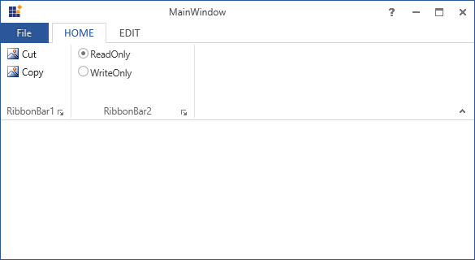
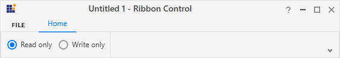

# RibbonRadioButton

RibbonRadioButton control is used to select a option like normal RadioButton . 





<syncfusion:Ribbon Name="_ribbon" HorizontalAlignment="Stretch" VerticalAlignment="Top">
<syncfusion:RibbonTab Name="_ribbonTab1" Caption="HOME"  IsChecked="True">
<syncfusion:RibbonBar Name="_ribbonBar1" Header="RibbonBar1">
<syncfusion:RibbonButton   Label="Cut"/>
<syncfusion:RibbonButton   Label="Copy"/>
</syncfusion:RibbonBar>
<syncfusion:RibbonBar  Name="_ribbonBar2" Width="150" Header="RibbonBar2">
<syncfusion:RibbonRadioButton GroupName="Group1"  Width="140" Content="ReadOnly" IsChecked="True"></syncfusion:RibbonRadioButton>
<syncfusion:RibbonRadioButton GroupName="Group1"  Width="140" Content="WriteOnly" ></syncfusion:RibbonRadioButton>
</syncfusion:RibbonBar>
</syncfusion:RibbonTab>
<syncfusion:RibbonTab Caption="EDIT"  IsChecked="False"/>
</syncfusion:Ribbon>





Create instance of RibbonRadioButton and add it to RibbonBar through code behind.





RibbonRadioButton _ribbonRadioButton1 = new RibbonRadioButton(){Content = "ReadOnly", IsChecked = true , GroupName = "Group1"};      
RibbonRadioButton _ribbonRadioButton2 = new RibbonRadioButton(){Content = "WriteOnly", GroupName = "Group1"};
_ribbonBar2.Items.Add(_ribbonRadioButton1);
_ribbonBar2.Items.Add(_ribbonRadioButton2);





Dim _ribbonRadioButton1 As New RibbonRadioButton() With {
	.Content = "ReadOnly",
	.IsChecked = True,
	.GroupName = "Group1"
}
Dim _ribbonRadioButton2 As New RibbonRadioButton() With {
	.Content = "WriteOnly",
	.GroupName = "Group1"
}
_ribbonBar2.Items.Add(_ribbonRadioButton1)
_ribbonBar2.Items.Add(_ribbonRadioButton2)





## Add RadioButton to the Simplified layout

When the simplified layout is enabled, the RibbonRadioButton can be added and displayed in a single line as shown below. To know more about the simplified layout, refer [here](https://help.syncfusion.com/wpf/ribbon/simplifiedlayout).





<syncfusion:RibbonWindow x:Class="RibbonButton_IconTemp.Window1"
        xmlns="http://schemas.microsoft.com/winfx/2006/xaml/presentation"
        xmlns:x="http://schemas.microsoft.com/winfx/2006/xaml"
        xmlns:d="http://schemas.microsoft.com/expression/blend/2008"
        xmlns:mc="http://schemas.openxmlformats.org/markup-compatibility/2006"
        xmlns:local="clr-namespace:RibbonButton_IconTemp" xmlns:skin="clr-namespace:Syncfusion.SfSkinManager;assembly=Syncfusion.SfSkinManager.WPF"
        mc:Ignorable="d" xmlns:syncfusion="http://schemas.syncfusion.com/wpf"
        skin:SfSkinManager.VisualStyle="MaterialLight"
        Title="Untitled 1 - Ribbon Control" Height="450" Width="800">
    <Grid x:Name="grid">
        <syncfusion:Ribbon VerticalAlignment="Top" EnableSimplifiedLayoutMode="True" LayoutMode="Simplified">
            <syncfusion:RibbonTab Caption="HOME"  IsChecked="True">
                <syncfusion:RibbonBar Header="Options">
                    <syncfusion:RibbonRadioButton GroupName="Mode" Content="Read only" IsChecked="True"></syncfusion:RibbonRadioButton>
                    <syncfusion:RibbonRadioButton GroupName="Mode" Content="Write only" ></syncfusion:RibbonRadioButton>
                </syncfusion:RibbonBar>
            </syncfusion:RibbonTab>
        </syncfusion:Ribbon>
    </Grid>
</syncfusion:RibbonWindow>





Ribbon ribbon = new Ribbon();
ribbon.VerticalAlignment = VerticalAlignment.Top;
ribbon.EnableSimplifiedLayoutMode = true;
ribbon.LayoutMode = LayoutMode.Simplified;
// Creating new tabs
RibbonTab homeTab = new RibbonTab();
homeTab.Caption = "Home";
homeTab.IsChecked = true;

// Creating new bar
RibbonBar optionsBar = new RibbonBar();
optionsBar.Header = "Options";

// Creating items
RibbonRadioButton ribbonRadioButton = new RibbonRadioButton() { Content = "Read only", IsChecked = true, GroupName="Mode" };
RibbonRadioButton ribbonRadioButton2 = new RibbonRadioButton() { Content = "Write only", GroupName="Mode" };

// Adding items to bar
optionsBar.Items.Add(ribbonRadioButton);
optionsBar.Items.Add(ribbonRadioButton2);

// Adding bars to the tabs
homeTab.Items.Add(optionsBar);

// Adding tabs to ribbon
ribbon.Items.Add(homeTab);
grid.Children.Add(ribbon);
SfSkinManager.SetVisualStyle(this, VisualStyles.MaterialLight);





When arranging in simplified layout alone, the **Margin**, **Width** and **Height** values of the RibbonRadioButton can be ignored as it will be resized automatically to the standard width and height. If the RibbonRadioButton is to be shown in both normal and simplified layout, the **Margin**, **Width** and **Height** properties can be set for normal layout alone using triggers.





<syncfusion:RibbonRadioButton Content="SelectAll" syncfusion:SimplifiedLayoutSettings.DisplayMode="Normal,Simplified" >
    <syncfusion:RibbonRadioButton.Style >
        
    </syncfusion:RibbonRadioButton.Style>
</syncfusion:RibbonRadioButton >




