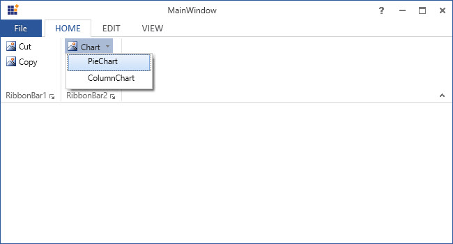
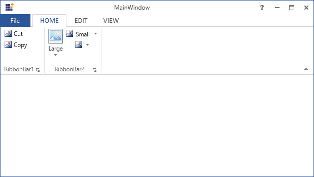
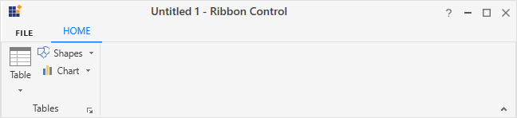

# SplitButton in WPF Ribbon     

SplitButton can perform like both normal Button as well as DropDownButton. It allow to click the button directly by clicking the upper part of the button and also it display list of items while click on the arrow.

## Add DropDownMenuItem

DropDownMenuItem are the items with `Header` property that is used to set header.





<syncfusion:Ribbon Name="_ribbon" HorizontalAlignment="Stretch" VerticalAlignment="Top">
<syncfusion:RibbonTab Name="_ribbonTab1" Caption="HOME"  IsChecked="True">
<syncfusion:RibbonBar Name="_ribbonBar1" Header="RibbonBar1">
<syncfusion:RibbonButton   Label="Cut"/>
<syncfusion:RibbonButton   Label="Copy"/>
</syncfusion:RibbonBar>
<syncfusion:RibbonBar Name="_ribbonBar2" Header="RibbonBar2">
<syncfusion:SplitButton Label="Chart">
<syncfusion:DropDownMenuItem Header="PieChart"/>
<syncfusion:DropDownMenuItem Header="ColumnChart"/>
</syncfusion:SplitButton>
<syncfusion:SplitButton Label="Table"/>
</syncfusion:RibbonBar>
</syncfusion:RibbonTab>
<syncfusion:RibbonTab Caption="EDIT"  IsChecked="False"/>
<syncfusion:RibbonTab Caption="VIEW"  IsChecked="False"/>
</syncfusion:Ribbon>





Create instance of `DropDownMenuItem` and add it to SplitButton in code behind.





SplitButton _splitbutton = new SplitButton() { Label = "Chart" };
DropDownMenuItem _dropDownMenuItem1 = new DropDownMenuItem() { Header = "PieChart" };
DropDownMenuItem _dropDownMenuItem2 = new DropDownMenuItem() { Header = "ColumnChart" };
_splitbutton.Items.Add(_dropDownMenuItem1);
_splitbutton.Items.Add(_dropDownMenuItem2);
_RibbonBar2.Items.Add(_splitbutton);





Dim _splitbutton As New SplitButton() With {.Label = "Chart"}
Dim _dropDownMenuItem1 As New DropDownMenuItem() With {.Header = "PieChart"}
Dim _dropDownMenuItem2 As New DropDownMenuItem() With {.Header = "ColumnChart"}
_splitbutton.Items.Add(_dropDownMenuItem1)
_splitbutton.Items.Add(_dropDownMenuItem2)
_RibbonBar2.Items.Add(_splitbutton)





## Set various sizes for SplitButton

[`SplitButton`](https://help.syncfusion.com/cr/cref_files/wpf/Syncfusion.Tools.Wpf~Syncfusion.Windows.Tools.Controls.SplitButton.html) supports three types of size modes and it can be set using the [`SizeForm`](https://help.syncfusion.com/cr/cref_files/wpf/Syncfusion.Tools.Wpf~Syncfusion.Windows.Tools.Controls.RibbonButton~SizeForm.html) property. The different [`SizeForm`](https://help.syncfusion.com/cr/cref_files/wpf/Syncfusion.Tools.Wpf~Syncfusion.Windows.Tools.SizeForm.html) available are as follows:

 * **ExtraSmall** - Displays only the image in 16 * 16 size.
 * **Small** - Displays the label and the image in 16 * 16 size.
 * **Large** - Displays the label and the image in 32 * 32 size.





<syncfusion:SplitButton SizeForm="Large" Label="Large"/>
<syncfusion:SplitButton SizeForm="Small" Label="Small"/>
<syncfusion:SplitButton SizeForm="ExtraSmall" Label="ExtraSmall"/>









SplitButton _splitbutton1 = new SplitButton(){Label = "Large",SizeForm= SizeForm.Large};
SplitButton _splitbutton2 = new SplitButton(){Label = "Small",SizeForm= SizeForm.Small};
SplitButton _splitbutton3 = new SplitButton(){Label = "ExtraSmall",SizeForm= SizeForm.ExtraSmall};
_ribbonBar2.Items.Add(_splitbutton1);
_ribbonBar2.Items.Add(_splitbutton2);
_ribbonBar2.Items.Add(_splitbutton3);





Dim _splitbutton1 As New SplitButton() With {
	.Label = "Large",
	.SizeForm= SizeForm.Large
}
Dim _splitbutton2 As New SplitButton() With {
	.Label = "Small",
	.SizeForm= SizeForm.Small
}
Dim _splitbutton3 As New SplitButton() With {
	.Label = "ExtraSmall",
	.SizeForm= SizeForm.ExtraSmall
}
_ribbonBar2.Items.Add(_splitbutton1)
_ribbonBar2.Items.Add(_splitbutton2)
_ribbonBar2.Items.Add(_splitbutton3)





N> When **simplified** layout is set, [`SplitButton`](https://help.syncfusion.com/cr/cref_files/wpf/Syncfusion.Tools.Wpf~Syncfusion.Windows.Tools.Controls.SplitButton.html) displays the image in 20 * 20 size irrespective of the size form. Also, the text in the **Large** size form will appear to the right of the image.

## Setting image to SplitButton

[`SplitButton`](https://help.syncfusion.com/cr/cref_files/wpf/Syncfusion.Tools.Wpf~Syncfusion.Windows.Tools.Controls.SplitButton.html) allows to display a normal image or vector image using the [`IconType`](https://help.syncfusion.com/cr/cref_files/wpf/Syncfusion.Tools.Wpf~Syncfusion.Windows.Tools.Controls.RibbonItemsControl~IconType.html) enumeration property. The default value of the [`IconType`](https://help.syncfusion.com/cr/cref_files/wpf/Syncfusion.Tools.Wpf~Syncfusion.Windows.Tools.Controls.RibbonItemsControl~IconType.html) property is **"Icon"**. The [`IconType`](https://help.syncfusion.com/cr/cref_files/wpf/Syncfusion.Tools.Wpf~Syncfusion.Windows.Tools.IconType.html) enumeration has the following values:

* **Icon** - Gets the detail of the icon path from the [`SmallIcon`](https://help.syncfusion.com/cr/cref_files/wpf/Syncfusion.Tools.Wpf~Syncfusion.Windows.Tools.Controls.RibbonItemsControl~SmallIcon.html), [`MediumIcon`](https://help.syncfusion.com/cr/cref_files/wpf/Syncfusion.Tools.Wpf~Syncfusion.Windows.Tools.Controls.RibbonItemsControl~MediumIcon.html) or [`LargeIcon`](https://help.syncfusion.com/cr/cref_files/wpf/Syncfusion.Tools.Wpf~Syncfusion.Windows.Tools.Controls.RibbonItemsControl~LargeIcon.html) properties and sets it to the SplitButton.
* **VectorImage** - Gets the details of the icon path data from the [`VectorImage`](https://help.syncfusion.com/cr/cref_files/wpf/Syncfusion.Tools.Wpf~Syncfusion.Windows.Tools.Controls.RibbonItemsControl~VectorImage.html) property and sets it to the SplitButton.

### Setting image path

[`SplitButton`](https://help.syncfusion.com/cr/cref_files/wpf/Syncfusion.Tools.Wpf~Syncfusion.Windows.Tools.Controls.SplitButton.html) allows to set the image according to the different [`SizeForm`](https://help.syncfusion.com/cr/cref_files/wpf/Syncfusion.Tools.Wpf~Syncfusion.Windows.Tools.Controls.RibbonItemsControl~SizeForm.html) values. To set the image to SplitButton, the following properties are used:

* [`SmallIcon`](https://help.syncfusion.com/cr/cref_files/wpf/Syncfusion.Tools.Wpf~Syncfusion.Windows.Tools.Controls.RibbonItemsControl~SmallIcon.html) - 16 * 16 size image to be displayed in normal layout for **"ExtraSmall"** and **"Small"** size form.
* [`MediumIcon`](https://help.syncfusion.com/cr/cref_files/wpf/Syncfusion.Tools.Wpf~Syncfusion.Windows.Tools.Controls.RibbonItemsControl~MediumIcon.html) - 20 * 20 size image to be displayed in simplified layout.
* [`LargeIcon`](https://help.syncfusion.com/cr/cref_files/wpf/Syncfusion.Tools.Wpf~Syncfusion.Windows.Tools.Controls.RibbonItemsControl~LargeIcon.html) - 32 * 32 size image to be displayed in normal layout for **"Large"** size form.





<syncfusion:RibbonWindow x:Class="RibbonButton_IconTemp.Window1"
        xmlns="http://schemas.microsoft.com/winfx/2006/xaml/presentation"
        xmlns:x="http://schemas.microsoft.com/winfx/2006/xaml"
        xmlns:d="http://schemas.microsoft.com/expression/blend/2008"
        xmlns:mc="http://schemas.openxmlformats.org/markup-compatibility/2006"
        xmlns:local="clr-namespace:RibbonButton_IconTemp" 
        xmlns:skin="clr-namespace:Syncfusion.SfSkinManager;assembly=Syncfusion.SfSkinManager.WPF"
        mc:Ignorable="d" xmlns:syncfusion="http://schemas.syncfusion.com/wpf"
        skin:SfSkinManager.VisualStyle="MaterialLight"
        Title="Untitled 1 - Ribbon Control" Height="450" Width="800">
    <Grid x:Name="grid">
        <syncfusion:Ribbon x:Name="_ribbon" VerticalAlignment="Top" EnableSimplifiedLayoutMode="True">
            <syncfusion:RibbonTab Caption="HOME"  IsChecked="True">
                <syncfusion:RibbonBar Header="Tables">
                    <syncfusion:SplitButton
                                    Label="Table"
                                    LargeIcon="Resources/Table_32.png"
                                    MediumIcon="Resources/Table20.png"
                                    SizeForm="Large">
                    </syncfusion:SplitButton>
                    <syncfusion:SplitButton
                                    Label="Shapes"
                                    SmallIcon="Resources/Insert Shapes16.png"
                                    MediumIcon="Resources/Insert Shapes20.png"
                                    SizeForm="Small">
                    </syncfusion:SplitButton>
                    <syncfusion:SplitButton
                                    Label="Chart"
                                    SmallIcon="Resources/Base chart16.png"
                                    MediumIcon="Resources/Base chart20.png"
                                    SizeForm="Small">
                    </syncfusion:SplitButton>
                </syncfusion:RibbonBar>
            </syncfusion:RibbonTab>
        </syncfusion:Ribbon>
    </Grid>
</syncfusion:RibbonWindow>





Ribbon ribbon = new Ribbon();
ribbon.VerticalAlignment = VerticalAlignment.Top;
ribbon.EnableSimplifiedLayoutMode = true;
// Creating new tabs
RibbonTab homeTab = new RibbonTab();
homeTab.Caption = "Home";
homeTab.IsChecked = true;

// Creating new bar
RibbonBar tablesBar = new RibbonBar();
tablesBar.Header = "Tables";
// Creating items
SplitButton tableButton = new SplitButton();
tableButton.Label = "Table";
tableButton.SizeForm = SizeForm.Large;
tableButton.MediumIcon = new BitmapImage(new Uri(@"/Resources/Table20.png", UriKind.RelativeOrAbsolute));
tableButton.LargeIcon = new BitmapImage(new Uri(@"/Resources/Table_32.png", UriKind.RelativeOrAbsolute));

SplitButton shapesButton = new SplitButton();
shapesButton.Label = "Shapes";
shapesButton.SizeForm = SizeForm.Small;
shapesButton.MediumIcon = new BitmapImage(new Uri(@"/Resources/Insert Shapes20.png", UriKind.RelativeOrAbsolute));
shapesButton.SmallIcon = new BitmapImage(new Uri(@"/Resources/Insert Shapes16.png", UriKind.RelativeOrAbsolute));

SplitButton chartButton = new SplitButton();
chartButton.Label = "Chart";
chartButton.SizeForm = SizeForm.Small;
chartButton.MediumIcon = new BitmapImage(new Uri(@"/Resources/Base chart20.png", UriKind.RelativeOrAbsolute));
chartButton.SmallIcon = new BitmapImage(new Uri(@"/Resources/Base chart16.png", UriKind.RelativeOrAbsolute));

// Adding items to bar
tablesBar.Items.Add(tableButton);
tablesBar.Items.Add(shapesButton);
tablesBar.Items.Add(chartButton);

// Adding bars to the tabs
homeTab.Items.Add(tablesBar);

// Adding tabs to ribbon
ribbon.Items.Add(homeTab);
grid.Children.Add(ribbon);
SfSkinManager.SetVisualStyle(this, VisualStyles.MaterialLight);





*Normal layout*

*Simplified layout*

### Setting vector image 

The [`VectorImage`](https://help.syncfusion.com/cr/cref_files/wpf/Syncfusion.Tools.Wpf~Syncfusion.Windows.Tools.Controls.RibbonItemsControl~VectorImage.html) property is of the type `ObservableCollection<Path>` which allows the image to be set as path type. The SplitButton will automatically resize the image according to its [`SizeForm`](https://help.syncfusion.com/cr/cref_files/wpf/Syncfusion.Tools.Wpf~Syncfusion.Windows.Tools.Controls.RibbonItemsControl~SizeForm.html). For simplified layout, the image will be resized to 20 * 20 size which is the standard.





<syncfusion:RibbonWindow x:Class="RibbonButton_IconTemp.Window1"
        xmlns="http://schemas.microsoft.com/winfx/2006/xaml/presentation"
        xmlns:x="http://schemas.microsoft.com/winfx/2006/xaml"
        xmlns:d="http://schemas.microsoft.com/expression/blend/2008"
        xmlns:mc="http://schemas.openxmlformats.org/markup-compatibility/2006"
        xmlns:local="clr-namespace:RibbonButton_IconTemp" xmlns:skin="clr-namespace:Syncfusion.SfSkinManager;assembly=Syncfusion.SfSkinManager.WPF"
        mc:Ignorable="d" xmlns:syncfusion="http://schemas.syncfusion.com/wpf"
        skin:SfSkinManager.VisualStyle="MaterialLight"
        Title="Untitled 1 - Ribbon Control" Height="450" Width="800">
    <Grid x:Name="grid">
        <syncfusion:Ribbon x:Name="_ribbon" VerticalAlignment="Top" EnableSimplifiedLayoutMode="True">
            <syncfusion:RibbonTab Caption="HOME"  IsChecked="True">
                <syncfusion:RibbonBar Header="Tables">
                    <syncfusion:SplitButton
                                    IconType="VectorImage"
                                    Label="Table"
                                    SizeForm="Large">
                        <syncfusion:SplitButton.VectorImage>
                            <Path
                                 Margin="0.5,4.5,0.5,0.5"
                                 Data="M0,0 L27,0 27,23 0,23 z"
                                 Fill="White"
                                 Stretch="Fill" />
                            <Path
                                 Height="4"
                                 Margin="0.5,0.5,0.5,0"
                                 VerticalAlignment="Top"
                                 Data="M0,0 L27,0 27,4 0,4 z"
                                 Fill="#FFC8C6C4"
                                 Stretch="Fill" />
                            <Path
                                 Margin="1,5,1,1"
                                 Data="M9,8 L9,14 17,14 17,8 z M8,0 L9,0 9,7 17,7 17,0 18,0 18,7 26,7 26,8 18,8 18,14 26,14 26,15 18,15 18,22 17,22 17,15 9,15 9,22 8,22 8,15 0,15 0,14 8,14&#xa;8,8 0,8 0,7 8,7 z"
                                 Fill="#FF797774"
                                 Stretch="Fill" />
                            <Path
                                 Data="M0.99999994,5.0000001 L0.99999994,27 27,27 27,5.0000001 z M0.99999994,1 L0.99999994,4.0000002 27,4.0000002 27,1 z M0,0 L28,0 28,4.0000002 28,5.0000001 28,28 0,28 0,5.0000001 0,4.0000002 z"
                                 Fill="#FF3A3A38"
                                 Stretch="Fill" />
                        </syncfusion:SplitButton.VectorImage>
                    </syncfusion:SplitButton>
                    <syncfusion:SplitButton
                                    IconType="VectorImage"
                                    Label="Shapes"
                                    SizeForm="Small">
                        <syncfusion:SplitButton.VectorImage>
                            <Path
                                Margin="0.5,0.5,9.5,9.5"
                                Data="M0,0 L18,0 18,6.5250005 C17.833,6.5180005 17.668999,6.5000008 17.5,6.5000008 11.434998,6.5000008 6.5,11.435001 6.5,17.5 6.5,17.669002 6.5179977,17.833 6.5249977,18 L0,18 z"
                                Fill="#FF83BEEC"
                                Stretch="Fill" />
                            <Path
                                Margin="8.5,8.5,0.5,0.5"
                                Data="M9.5000001,0 C14.746998,0 19,4.253001 19,9.4999988 19,14.747001 14.746998,19.000001 9.5000001,19.000001 4.2539979,19.000001 8.1026528E-08,14.747001 0,9.4999988 8.1026528E-08,4.253001 4.2539979,0 9.5000001,0 z"
                                Fill="White"
                                Stretch="Fill" />
                            <Path
                                Margin="8,8,0,0"
                                Data="M10,0.99999995 C5.0369988,1.0000001 1.0000001,5.0370014 0.99999998,9.9999989 1.0000001,14.963001 5.0369988,19.000001 10,19.000001 14.962998,19.000001 19,14.963001 19,9.9999989 19,5.0370014 14.962998,1.0000001 10,0.99999995 z M10,0 C15.514,0 20,4.4860004 20,9.9999989 20,15.514 15.514,20.000001 10,20.000001 4.4860002,20.000001 9.5927689E-08,15.514 0,9.9999989 9.5927689E-08,4.4860004 4.4860002,0 10,0 z"
                                Fill="#FF3A3A38"
                                Stretch="Fill" />
                            <Path
                                Margin="0,0,9,9"
                                Data="M0,0 L19,0 19,7.0510015 C18.669998,7.0210008 18.337997,7.0000009 18,7.0000009 L18,1.0000002 0.99999988,1.0000002 0.99999988,18 7,18 C7,18.338001 7.0209999,18.670002 7.0509987,19 L0,19 z"
                                Fill="#FF0063B1"
                                Stretch="Fill" />
                        </syncfusion:SplitButton.VectorImage>
                    </syncfusion:SplitButton>
                    <syncfusion:SplitButton
                                    IconType="VectorImage"
                                    Label="Chart"
                                    SizeForm="Small">
                        <syncfusion:SplitButton.VectorImage>
                            <Path
                                Width="8"
                                Margin="0.5,11.5,0,0.5"
                                HorizontalAlignment="Left"
                                Data="M0,0 L7.9999996,0 7.9999996,16 0,16 z"
                                Fill="#FFC8C6C4"
                                Stretch="Fill" />
                            <Path
                                Width="9"
                                Margin="0,11,0,0"
                                HorizontalAlignment="Left"
                                Data="M0.99999667,0.99999994 L0.99999667,16 8.0000032,16 8.0000032,0.99999994 z M0,0 L9.0000004,0 9.0000004,17 3.2610174,17 2.5740174,17 0,17 z"
                                Fill="#FF797774"
                                Stretch="Fill" />
                            <Path
                                Width="8"
                                Margin="0,5.5,0.5,0.5"
                                HorizontalAlignment="Right"
                                Data="M0,0 L8.0000001,0 8.0000001,22 0,22 z"
                                Fill="#FF83BEEC"
                                Stretch="Fill" />
                            <Path
                                Width="9"
                                Margin="0,5,0,0"
                                HorizontalAlignment="Right"
                                Data="M1.0000001,1.0000001 L1.0000001,22 8,22 8,1.0000001 z M0,0 L9,0 9,23 0,23 z"
                                Fill="#FF0063B1"
                                Stretch="Fill" />
                            <Path
                                Margin="8.5,0.5"
                                Data="M0,0 L8,0 8,27 0,27 z"
                                Fill="White"
                                Stretch="Fill" />
                            <Path
                                Margin="8,0"
                                Data="M0.99999994,0.99999994 L0.99999994,27 7.9999999,27 7.9999999,0.99999994 z M0,0 L8.9999999,0 8.9999999,28 2.355,28 1.7929999,28 0,28 z"
                                Fill="#FF3A3A38"
                                Stretch="Fill" />
                        </syncfusion:SplitButton.VectorImage>
                    </syncfusion:SplitButton>
                </syncfusion:RibbonBar>
            </syncfusion:RibbonTab>
        </syncfusion:Ribbon>
    </Grid>
</syncfusion:RibbonWindow>





Ribbon ribbon = new Ribbon();
ribbon.VerticalAlignment = VerticalAlignment.Top;
ribbon.EnableSimplifiedLayoutMode = true;
// Creating new tabs
RibbonTab homeTab = new RibbonTab();
homeTab.Caption = "Home";
homeTab.IsChecked = true;

// Creating new bar
RibbonBar tablesBar = new RibbonBar();
tablesBar.Header = "Tables";
// Creating items
SplitButton tableButton = new SplitButton();
tableButton.Label = "Table";
tableButton.SizeForm = SizeForm.Large;
tableButton.IconType = IconType.VectorImage;

Path tablePath1 = new Path();
tablePath1.Data = Geometry.Parse("M0,0 L27,0 27,23 0,23 z");
tablePath1.Margin = new Thickness(0.5, 4.5, 0.5, 0.5);
tablePath1.Fill = new SolidColorBrush(Colors.White);

Path tablePath2 = new Path();
tablePath2.Data = Geometry.Parse("M0,0 L27,0 27,4 0,4 z");
tablePath2.Margin = new Thickness(0.5, 0.5, 0.5, 0);
tablePath2.Fill = new SolidColorBrush(Color.FromRgb(200, 198, 196));
tablePath2.Height = 4;
tablePath2.VerticalAlignment = VerticalAlignment.Top;

Path tablePath3 = new Path();
tablePath3.Data = Geometry.Parse("M9,8 L9,14 17,14 17,8 z M8,0 L9,0 9,7 17,7 17,0 18,0 18,7 26,7 26,8 18,8 18,14 26,14 26,15 18,15 18,22 17,22 17,15 9,15 9,22 8,22 8,15 0,15 0,14 8,14&#xa;8,8 0,8 0,7 8,7 z");
tablePath3.Margin = new Thickness(1, 5, 1, 1);
tablePath3.Fill = new SolidColorBrush(Color.FromRgb(121, 119, 116));

Path tablePath4 = new Path();
tablePath4.Data = Geometry.Parse("M0.99999994,5.0000001 L0.99999994,27 27,27 27,5.0000001 z M0.99999994,1 L0.99999994,4.0000002 27,4.0000002 27,1 z M0,0 L28,0 28,4.0000002 28,5.0000001 28,28 0,28 0,5.0000001 0,4.0000002 z");
tablePath4.Fill = new SolidColorBrush(Color.FromRgb(58, 58, 56));

tableButton.VectorImage.Add(tablePath1);
tableButton.VectorImage.Add(tablePath2);
tableButton.VectorImage.Add(tablePath3);
tableButton.VectorImage.Add(tablePath4);

SplitButton shapesButton = new SplitButton();
shapesButton.Label = "Shapes";
shapesButton.SizeForm = SizeForm.Small;
shapesButton.IconType = IconType.VectorImage;

Path shapePath1 = new Path();
shapePath1.Data = Geometry.Parse("M0,0 L18,0 18,6.5250005 C17.833,6.5180005 17.668999,6.5000008 17.5,6.5000008 11.434998,6.5000008 6.5,11.435001 6.5,17.5 6.5,17.669002 6.5179977,17.833 6.5249977,18 L0,18 z");
shapePath1.Margin = new Thickness(0.5, 0.5, 9.5, 9.5);
shapePath1.Fill = new SolidColorBrush(Color.FromRgb(131, 190, 236));

Path shapePath2 = new Path();
shapePath2.Data = Geometry.Parse("M9.5000001,0 C14.746998,0 19,4.253001 19,9.4999988 19,14.747001 14.746998,19.000001 9.5000001,19.000001 4.2539979,19.000001 8.1026528E-08,14.747001 0,9.4999988 8.1026528E-08,4.253001 4.2539979,0 9.5000001,0 z");
shapePath2.Margin = new Thickness(8.5, 8.5, 0.5, 0.5);
shapePath2.Fill = new SolidColorBrush(Colors.White);

Path shapePath3 = new Path();
shapePath3.Data = Geometry.Parse("M10,0.99999995 C5.0369988,1.0000001 1.0000001,5.0370014 0.99999998,9.9999989 1.0000001,14.963001 5.0369988,19.000001 10,19.000001 14.962998,19.000001 19,14.963001 19,9.9999989 19,5.0370014 14.962998,1.0000001 10,0.99999995 z M10,0 C15.514,0 20,4.4860004 20,9.9999989 20,15.514 15.514,20.000001 10,20.000001 4.4860002,20.000001 9.5927689E-08,15.514 0,9.9999989 9.5927689E-08,4.4860004 4.4860002,0 10,0 z");
shapePath3.Margin = new Thickness(8, 8, 0, 0);
shapePath3.Fill = new SolidColorBrush(Color.FromRgb(58, 58, 56));

Path shapePath4 = new Path();
shapePath4.Data = Geometry.Parse("M0,0 L19,0 19,7.0510015 C18.669998,7.0210008 18.337997,7.0000009 18,7.0000009 L18,1.0000002 0.99999988,1.0000002 0.99999988,18 7,18 C7,18.338001 7.0209999,18.670002 7.0509987,19 L0,19 z");
shapePath4.Margin = new Thickness(0, 0, 9, 9);
shapePath4.Fill = new SolidColorBrush(Color.FromRgb(0, 99, 177));

shapesButton.VectorImage.Add(shapePath1);
shapesButton.VectorImage.Add(shapePath2);
shapesButton.VectorImage.Add(shapePath3);
shapesButton.VectorImage.Add(shapePath4);

SplitButton chartButton = new SplitButton();
chartButton.Label = "Chart";
chartButton.SizeForm = SizeForm.Small;
chartButton.IconType = IconType.VectorImage;

Path chartPath1 = new Path();
chartPath1.Data = Geometry.Parse("M0,0 L7.9999996,0 7.9999996,16 0,16 z");
chartPath1.Margin = new Thickness(0.5, 11.5, 0, 0.5);
chartPath1.Fill = new SolidColorBrush(Color.FromRgb(200, 198, 196));
chartPath1.HorizontalAlignment = HorizontalAlignment.Left;
chartPath1.Width = 8;

Path chartPath2 = new Path();
chartPath2.Data = Geometry.Parse("M0.99999667,0.99999994 L0.99999667,16 8.0000032,16 8.0000032,0.99999994 z M0,0 L9.0000004,0 9.0000004,17 3.2610174,17 2.5740174,17 0,17 z");
chartPath2.Margin = new Thickness(0, 11, 0, 0);
chartPath2.Fill = new SolidColorBrush(Color.FromRgb(121, 119, 116));
chartPath2.HorizontalAlignment = HorizontalAlignment.Left;
chartPath2.Width = 9;

Path chartPath3 = new Path();
chartPath3.Data = Geometry.Parse("M0,0 L8.0000001,0 8.0000001,22 0,22 z");
chartPath3.Margin = new Thickness(0, 5.5, 0.5, 0.5);
chartPath3.Fill = new SolidColorBrush(Color.FromRgb(131, 190, 236));
chartPath3.HorizontalAlignment = HorizontalAlignment.Right;
chartPath3.Width = 8;

Path chartPath4 = new Path();
chartPath4.Data = Geometry.Parse("M1.0000001,1.0000001 L1.0000001,22 8,22 8,1.0000001 z M0,0 L9,0 9,23 0,23 z");
chartPath4.Margin = new Thickness(0, 5, 0, 0);
chartPath4.Fill = new SolidColorBrush(Color.FromRgb(0, 99, 177));
chartPath4.HorizontalAlignment = HorizontalAlignment.Right;
chartPath4.Width = 9;

Path chartPath5 = new Path();
chartPath5.Data = Geometry.Parse("M0,0 L8,0 8,27 0,27 z");
chartPath5.Margin = new Thickness(8.5, 0.5, 8.5, 0.5);
chartPath5.Fill = new SolidColorBrush(Colors.White);

Path chartPath6 = new Path();
chartPath6.Data = Geometry.Parse("M0.99999994,0.99999994 L0.99999994,27 7.9999999,27 7.9999999,0.99999994 z M0,0 L8.9999999,0 8.9999999,28 2.355,28 1.7929999,28 0,28 z");
chartPath6.Margin = new Thickness(8, 0, 8, 0);
chartPath6.Fill = new SolidColorBrush(Color.FromRgb(58, 58, 56));

chartButton.VectorImage.Add(chartPath1);
chartButton.VectorImage.Add(chartPath2);
chartButton.VectorImage.Add(chartPath3);
chartButton.VectorImage.Add(chartPath4);
chartButton.VectorImage.Add(chartPath5);
chartButton.VectorImage.Add(chartPath6);

// Adding items to bar
tablesBar.Items.Add(tableButton);
tablesBar.Items.Add(shapesButton);
tablesBar.Items.Add(chartButton);

// Adding bars to the tabs
homeTab.Items.Add(tablesBar);

// Adding tabs to ribbon
ribbon.Items.Add(homeTab);
grid.Children.Add(ribbon);
SfSkinManager.SetVisualStyle(this, VisualStyles.MaterialLight);





*Normal layout*

*Simplified layout*

## Add SplitButton to the simplified layout

When the simplified layout is enabled, the [`SplitButton`](https://help.syncfusion.com/cr/cref_files/wpf/Syncfusion.Tools.Wpf~Syncfusion.Windows.Tools.Controls.SplitButton.html) can be added and displayed in a single line as shown below. To know more about the simplified layout, refer [here](https://help.syncfusion.com/wpf/ribbon/simplifiedlayout).





<syncfusion:RibbonWindow x:Class="RibbonButton_IconTemp.Window1"
        xmlns="http://schemas.microsoft.com/winfx/2006/xaml/presentation"
        xmlns:x="http://schemas.microsoft.com/winfx/2006/xaml"
        xmlns:d="http://schemas.microsoft.com/expression/blend/2008"
        xmlns:mc="http://schemas.openxmlformats.org/markup-compatibility/2006"
        xmlns:local="clr-namespace:RibbonButton_IconTemp" 
        xmlns:skin="clr-namespace:Syncfusion.SfSkinManager;assembly=Syncfusion.SfSkinManager.WPF"
        mc:Ignorable="d" xmlns:syncfusion="http://schemas.syncfusion.com/wpf"
        skin:SfSkinManager.VisualStyle="MaterialLight"
        Title="Untitled 1 - Ribbon Control" Height="450" Width="800">
    <Grid x:Name="grid">
        <syncfusion:Ribbon x:Name="_ribbon" VerticalAlignment="Top" EnableSimplifiedLayoutMode="True">
            <syncfusion:RibbonTab Caption="HOME"  IsChecked="True">
                <syncfusion:RibbonBar Header="Tables">
                    <syncfusion:SplitButton
                                    Label="Table"
                                    MediumIcon="Resources/Table20.png"
                                    SizeForm="Large">
                    </syncfusion:SplitButton>
                    <syncfusion:SplitButton
                                    Label="Shapes"
                                    MediumIcon="Resources/Insert Shapes20.png"
                                    SizeForm="Small">
                    </syncfusion:SplitButton>
                    <syncfusion:SplitButton
                                    Label="Chart"
                                    MediumIcon="Resources/Base chart20.png"
                                    SizeForm="Small">
                    </syncfusion:SplitButton>
                </syncfusion:RibbonBar>
            </syncfusion:RibbonTab>
        </syncfusion:Ribbon>
    </Grid>
</syncfusion:RibbonWindow>





Ribbon ribbon = new Ribbon();
ribbon.VerticalAlignment = VerticalAlignment.Top;
ribbon.EnableSimplifiedLayoutMode = true;
// Creating new tabs
RibbonTab homeTab = new RibbonTab();
homeTab.Caption = "Home";
homeTab.IsChecked = true;

// Creating new bar
RibbonBar tablesBar = new RibbonBar();
tablesBar.Header = "Tables";
// Creating items
SplitButton tableButton = new SplitButton();
tableButton.Label = "Table";
tableButton.SizeForm = SizeForm.Large;
tableButton.MediumIcon = new BitmapImage(new Uri(@"/Resources/Table20.png", UriKind.RelativeOrAbsolute));

SplitButton shapesButton = new SplitButton();
shapesButton.Label = "Shapes";
shapesButton.SizeForm = SizeForm.Small;
shapesButton.MediumIcon = new BitmapImage(new Uri(@"/Resources/Insert Shapes20.png", UriKind.RelativeOrAbsolute));

SplitButton chartButton = new SplitButton();
chartButton.Label = "Chart";
chartButton.SizeForm = SizeForm.Small;
chartButton.MediumIcon = new BitmapImage(new Uri(@"/Resources/Base chart20.png", UriKind.RelativeOrAbsolute));

// Adding items to bar
tablesBar.Items.Add(tableButton);
tablesBar.Items.Add(shapesButton);
tablesBar.Items.Add(chartButton);

// Adding bars to the tabs
homeTab.Items.Add(tablesBar);

// Adding tabs to ribbon
ribbon.Items.Add(homeTab);
grid.Children.Add(ribbon);
SfSkinManager.SetVisualStyle(this, VisualStyles.MaterialLight);





When arranging in simplified layout alone, the **Margin**, **Width** and **Height** values of the SplitButton can be ignored as it will be resized automatically to the standard width and height. If the SplitButton is to be shown in both normal and simplified layout, **Margin**, **Width** and **Height** properties can be set for normal layout alone using triggers.





<syncfusion:SplitButton Label="Copy" syncfusion:SimplifiedLayoutSettings.DisplayMode="Normal,Simplified" SizeForm="Small" MediumIcon="/Resources/Copy_20.png" SmallIcon="/Resources/Copy16.png" >
    <syncfusion:SplitButton.Style>
        
    </syncfusion:SplitButton.Style>
</syncfusion:SplitButton >





