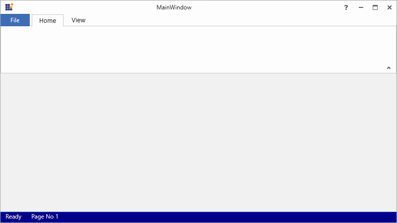

# Ribbon StatusBar in WPF Ribbon

The [RibbonStatusBar](https://help.syncfusion.com/cr/wpf/Syncfusion.Windows.Tools.Controls.RibbonStatusBar.html) control is added to [RibbonWindow](https://help.syncfusion.com/cr/wpf/Syncfusion.Windows.Tools.Controls.RibbonWindow.html) to display the current status of the application or document similar in Microsoft Office.





<syncfusion:RibbonWindow x:Class="Ribbonstatusbar_sample.MainWindow"
        xmlns="http://schemas.microsoft.com/winfx/2006/xaml/presentation"
        xmlns:x="http://schemas.microsoft.com/winfx/2006/xaml"
        xmlns:d="http://schemas.microsoft.com/expression/blend/2008"
        xmlns:mc="http://schemas.openxmlformats.org/markup-compatibility/2006"
        xmlns:local="clr-namespace:Ribbonstatusbar_sample"
        xmlns:syncfusion="http://schemas.syncfusion.com/wpf"
        xmlns:skin="clr-namespace:Syncfusion.SfSkinManager;assembly=Syncfusion.SfSkinManager.WPF"
        skin:SfSkinManager.VisualStyle="Office2016Colorful"
        mc:Ignorable="d"
        Title="MainWindow" Height="450" Width="800">
    <syncfusion:RibbonWindow.StatusBar>
        <syncfusion:RibbonStatusBar Background="DarkBlue">
            <WrapPanel>
                <TextBlock Text="Ready" Margin="10,0,0,0" Foreground="AntiqueWhite" />
                <TextBlock Text="Page No 1" Margin="20,0,0,0" Foreground="AntiqueWhite" />
            </WrapPanel>
        </syncfusion:RibbonStatusBar>
    </syncfusion:RibbonWindow.StatusBar>
    <Grid>
        <syncfusion:Ribbon x:Name="_ribbon" VerticalAlignment="Top">
            <syncfusion:RibbonTab Caption="HOME"  IsChecked="True"/>
            <syncfusion:RibbonTab Caption="VIEW"  IsChecked="False"/>
        </syncfusion:Ribbon>
    </Grid>
</syncfusion:RibbonWindow>





Create an instance of the StatusBar and assign it to `RibbonStatusBar` property of `RibbonWindow` through code behind.





//Initialize the Ribbon control.
Ribbon ribbon = new Ribbon();
ribbon.VerticalAlignment = VerticalAlignment.Top;

//Creating new tabs.
RibbonTab ribbonTab = new RibbonTab();
ribbonTab.Caption = "Home";
ribbonTab.IsChecked = true;

RibbonTab viewTab = new RibbonTab();
viewTab.Caption = "View";
viewTab.IsChecked = false;

//Adding tabs to the Ribbon.
ribbon.Items.Add(ribbonTab);
ribbon.Items.Add(viewTab);
grid.Children.Add(ribbon);

//Initialize the ribbon status bar.
RibbonStatusBar ribbonStatusBar = new RibbonStatusBar();
ribbonStatusBar.Background = Brushes.DarkBlue;

//Initializing wrap panel.
WrapPanel wrapPanel = new WrapPanel();

double left = 10, top = 0, right = 0, bottom = 0;
double left1 = 20, top1 = 0, right1 = 0, bottom1 = 0;

//Initialize the TextBlock and add the values.
TextBlock textBlock1 = new TextBlock { Text = "Ready", Foreground = Brushes.AntiqueWhite };
TextBlock textBlock2 = new TextBlock { Text = "Page No 1", Foreground = Brushes.AntiqueWhite };
textBlock1.Margin = new Thickness(left, top, right, bottom);
textBlock2.Margin = new Thickness(left1, top1, right1, bottom1);

//Add textblock to the wrappanel.
wrapPanel.Children.Add(textBlock1);
wrapPanel.Children.Add(textBlock2);

//Add the wrappanel to the statusbar.
ribbonStatusBar.Items.Add(wrapPanel);

//Add statusbar to the ribbonwindow.
this.StatusBar = ribbonStatusBar;





'Initialize the Ribbon control.
Dim ribbon As New Ribbon()
ribbon.VerticalAlignment = VerticalAlignment.Top

'Creating new tabs.
Dim ribbonTab As New RibbonTab()
ribbonTab.Caption = "Home"
ribbonTab.IsChecked = True

Dim viewTab As New RibbonTab()
viewTab.Caption = "View"
viewTab.IsChecked = False

'Adding tabs to the Ribbon.
ribbon.Items.Add(ribbonTab)
ribbon.Items.Add(viewTab)
grid.Children.Add(ribbon)

'Initialize the ribbon status bar.
Dim ribbonStatusBar As New RibbonStatusBar()
ribbonStatusBar.Background = Brushes.DarkBlue

'Initializing wrap panel.
Dim wrapPanel As New WrapPanel()

Dim left As Double = 10, top As Double = 0, right As Double = 0, bottom As Double = 0
Dim left1 As Double = 20, top1 As Double = 0, right1 As Double = 0, bottom1 As Double = 0

'Initialize the TextBlock and add the values.
Dim textBlock1 As TextBlock = New TextBlock With {.Text = "Ready", .Foreground = Brushes.AntiqueWhite}
Dim textBlock2 As TextBlock = New TextBlock With {.Text = "Page No 1", .Foreground = Brushes.AntiqueWhite}
textBlock1.Margin = New Thickness(left, top, right, bottom)
textBlock2.Margin = New Thickness(left1, top1, right1, bottom1)

'Add textblock to the wrappanel.
wrapPanel.Children.Add(textBlock1)
wrapPanel.Children.Add(textBlock2)

'Add the wrappanel to the statusbar.
ribbonStatusBar.Items.Add(wrapPanel)

'Add statusbar to the ribbonwindow.
Me.StatusBar = ribbonStatusBar





