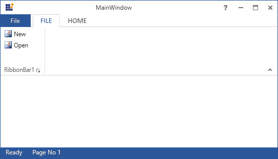

# Ribbon StatusBar

`RibbonStatusBar` control is added to RibbonWindow to display the current status of the application or document similar in Microsoft Office.





<syncfusion:RibbonWindow.StatusBar>
<syncfusion:RibbonStatusBar>
<WrapPanel>
<TextBlock Text="Ready" Margin="10,0,0,0" Foreground="AntiqueWhite"/>
<TextBlock Text="Page No 1" Margin="20,0,0,0" Foreground="AntiqueWhite"/>
</WrapPanel>
</syncfusion:RibbonStatusBar>
</syncfusion:RibbonWindow.StatusBar>
<syncfusion:Ribbon Name="_ribbon" HorizontalAlignment="Stretch"  VerticalAlignment="Top">
<!--Add RibbonTab and add its Items here-->
</syncfusion:Ribbon>





Create instance of StatusBar and assign it to RibbonStatusBar property of RibbonWindow through code behind.





RibbonStatusBar _ribbonStatusBar = new RibbonStatusBar();
WrapPanel _wrapPanel = new WrapPanel();
Label _textBlock1 = new Label() { Content = "Ready", Foreground = Brushes.WhiteSmoke };
Label _textBlock2 = new Label() { Content = "Page No 1", Foreground = Brushes.WhiteSmoke };
_wrapPanel.Children.Add(_textBlock1);
_wrapPanel.Children.Add(_textBlock2);
_ribbonStatusBar.Items.Add(_wrapPanel);
_ribbonWindow.StatusBar = _ribbonStatusBar;





Dim _ribbonStatusBar As New RibbonStatusBar()
Dim _wrapPanel As New WrapPanel()
Dim _textBlock1 As New Label() With {
	.Content = "Ready",
	.Foreground = Brushes.WhiteSmoke
}
Dim _textBlock2 As New Label() With {
	.Content = "Page No 1",
	.Foreground = Brushes.WhiteSmoke
}
_wrapPanel.Children.Add(_textBlock1)
_wrapPanel.Children.Add(_textBlock2)
_ribbonStatusBar.Items.Add(_wrapPanel)
_ribbonWindow.StatusBar = _ribbonStatusBar





