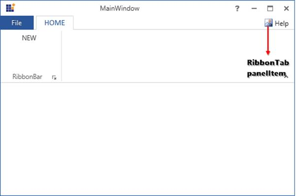

# Ribbon TabPanelItem

`RibbonTabPannelItem` can set in Ribbon to located below the close button of RibbonWindow.

The following code example illustrates how to use RibbonTabPannelItem control in Ribbon instance.





<syncfusion:Ribbon Name="_ribbon" HorizontalAlignment="Stretch" VerticalAlignment="Top">

<syncfusion:RibbonTab Name="_ribbonTab1" Caption="HOME"  IsChecked="True">

<syncfusion:RibbonBar Name="_ribbonBar1">

<syncfusion:RibbonMenuItem  Header="NEW" Width="100"></syncfusion:RibbonMenuItem>

</syncfusion:RibbonBar>

</syncfusion:RibbonTab>

<syncfusion:Ribbon.TabPanelItem>

<syncfusion:RibbonButton SizeForm="Small" Label="Help"/>

</syncfusion:Ribbon.TabPanelItem>

</syncfusion:Ribbon>





Create instance of RibbonButton and assign it to TabPanelItem property of Ribbon.





RibbonButton _ribbonButton = new RibbonButton() { Label="Help"};

_ribbon.TabPanelItem = _ribbonButton;





Dim _ribbonButton As New RibbonButton() With {.Label="Help"}

_ribbon.TabPanelItem = _ribbonButton


 


