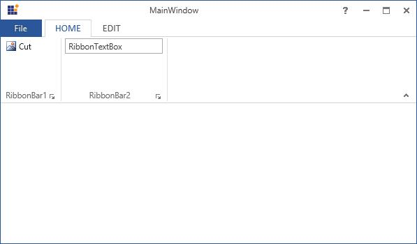

# RibbonTextBox

RibbonTextBox control provide similar set of functionalities like normal TextBox control in Ribbon Instance. 

The following code example illustrates how to use RibbonTextBox control in Ribbon instance.

You can use RibbonTextBox in Ribbon by add it inside the RibbonBar element.



[XAML]

<syncfusion:Ribbon Name="_ribbon" HorizontalAlignment="Stretch" VerticalAlignment="Top">

<syncfusion:RibbonTab Name="_ribbonTab1" Caption="HOME"  IsChecked="True">

<syncfusion:RibbonBar Name="_ribbonBar2" Header="RibbonBar1">

<syncfusion:RibbonButton   Label="Cut"/>

</syncfusion:RibbonBar>

<syncfusion:RibbonBar  Name="_ribbonBar2" Width="150" Header="RibbonBar2">

<syncfusion:RibbonTextBox  Width="140" Text="RibbonTextBox"></syncfusion:RibbonTextBox>

</syncfusion:RibbonBar>

</syncfusion:RibbonTab>

<syncfusion:RibbonTab Caption="EDIT"  IsChecked="False"/>

</syncfusion:Ribbon>



Create instance of RibbonTextBox and add it to RibbonBar Items.



[C#]

RibbonTextBox _ribbonTextBox = new RibbonTextBox(){Text = "RibbonTextBox"};

_ribbonBar2.Items.Add(_ribbonTextBox);



