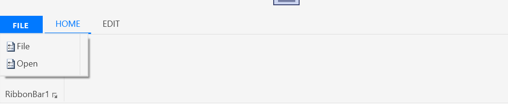
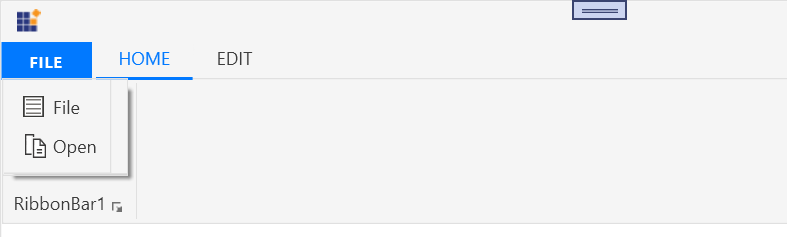

# SimpleMenuButton in WPF Ribbon

`SimpleMenuButton` provides functionality similar to other menu button and it doesn't carries a sub menu. It can be used with `ApplicationMenu` and it can also be placed inside the `RibbonBar` in Ribbon control.

## Setting Icon

[`SimpleMenuButton`](https://help.syncfusion.com/cr/wpf/Syncfusion.Windows.Tools.Controls.SimpleMenuButton.html) allows to set image path using [`Icon`](https://help.syncfusion.com/cr/wpf/Syncfusion.Windows.Tools.Controls.SimpleMenuButton.html#Syncfusion_Windows_Tools_Controls_SimpleMenuButton_Icon) property as below.





<syncfusion:RibbonWindow x:Class="TemplateSupport.MainWindow" 
        xmlns="http://schemas.microsoft.com/winfx/2006/xaml/presentation"
        xmlns:x="http://schemas.microsoft.com/winfx/2006/xaml"
        xmlns:d="http://schemas.microsoft.com/expression/blend/2008"
        xmlns:mc="http://schemas.openxmlformats.org/markup-compatibility/2006"
        xmlns:local="clr-namespace:TemplateSupport"
        xmlns:syncfusion="http://schemas.syncfusion.com/wpf"
        xmlns:skinManager="clr-namespace:Syncfusion.SfSkinManager;assembly=Syncfusion.SfSkinManager.WPF"                 
        mc:Ignorable="d"
        skinManager:SfSkinManager.VisualStyle="MaterialLight"
         Height="450" Width="800">
    <Grid>
        <syncfusion:Ribbon Name="_Ribbon1" HorizontalAlignment="Stretch" VerticalAlignment="Top">
            <syncfusion:RibbonTab Name="_RibbonTab1" Caption="HOME"  IsChecked="False">
            <syncfusion:RibbonBar Name="_RibbonBar1" Header="RibbonBar1">
            <syncfusion:SimpleMenuButton Icon="/Resources/Copy16.png" Label="Open"/>
            </syncfusion:RibbonBar>
            </syncfusion:RibbonTab>
            <syncfusion:RibbonTab Caption="EDIT"  IsChecked="False"/>
               <syncfusion:Ribbon.ApplicationMenu>
                    <syncfusion:ApplicationMenu Name="_ApplicationMenu" Width="38" Height="38" syncfusion:Ribbon.KeyTip="F" IsPopupOpen="False" ApplicationButtonImage="/Resources/App.ico">
                        <syncfusion:SimpleMenuButton Label="File" Icon="/Resources/Options.png"/>
                        <syncfusion:SimpleMenuButton Label="Open" Icon="/Resources/Copy16.png"/>
                    </syncfusion:ApplicationMenu>
                </syncfusion:Ribbon.ApplicationMenu>
        </syncfusion:Ribbon>
    </Grid>
</syncfusion:RibbonWindow>    





Create an instance of SimpleMenuButton and add it to ApplicationMenu through code behind.





using Syncfusion.SfSkinManager;
using Syncfusion.Windows.Tools.Controls;
using System;
using System.Windows;
using System.Windows.Media.Imaging;

namespace TemplateSupport
{
    /// 

    /// Interaction logic for MainWindow.xaml
    /// 

    public partial class MainWindow : RibbonWindow
    {
        public MainWindow()
        {
            InitializeComponent(); 
            Ribbon ribbon = new Ribbon();
            ribbon.VerticalAlignment = VerticalAlignment.Top;
            // Creating new tabs
            RibbonTab homeTab = new RibbonTab();
            homeTab.Caption = "Home";
            homeTab.IsChecked = true;
            RibbonTab editTab = new RibbonTab();
            editTab.Caption = "Edit";
            // Creating new bar
            RibbonBar ribbonBar = new RibbonBar();
            ribbonBar.Header = "Clipboard";
            // Creating items
            ApplicationMenu _ApplicationMenu = new ApplicationMenu();
            ribbon.ApplicationMenu = _ApplicationMenu;
            SimpleMenuButton _SimpleMenuButton = new SimpleMenuButton() { Label = "File", Width = 100, Icon = new BitmapImage(new Uri(@"/Resources/Options.png", UriKind.RelativeOrAbsolute)) };        
            SimpleMenuButton _SimpleMenuButton1 = new SimpleMenuButton() { Label = "Open", Width = 100, Icon = new BitmapImage(new Uri(@"/Resources/Options.png", UriKind.RelativeOrAbsolute)) };
            SimpleMenuButton _SimpleMenuButton2 = new SimpleMenuButton() { Label = "Menu", Width = 100, Icon = new BitmapImage(new Uri(@"/Resources/Copy16.png", UriKind.RelativeOrAbsolute)) };
            _ApplicationMenu.Items.Add(_SimpleMenuButton);
            _ApplicationMenu.Items.Add(_SimpleMenuButton1);
            ribbonBar.Items.Add(_SimpleMenuButton2);
            homeTab.Items.Add(ribbonBar);
            ribbon.Items.Add(homeTab);
            ribbon.Items.Add(editTab);
            grid.Children.Add(ribbon);
            SfSkinManager.SetVisualStyle(this, VisualStyles.MaterialLight);
        }
    }
}





Dim _SimpleMenuButton As New SimpleMenuButton() With {
	.Label = "File",
	.Width = 100
}
Dim _SimpleMenuButton1 As New SimpleMenuButton() With {
	.Label = "Open",
	.Width = 100
}
_ApplicationMenu.Items.Add(_SimpleMenuButton)
_ApplicationMenu.Items.Add(_SimpleMenuButton1)





### Setting icon template

The `IconTemplate` property provides support to set any type of image such as glyph, font or any custom content to the [`SimpleMenuButton`](https://help.syncfusion.com/cr/wpf/Syncfusion.Windows.Tools.Controls.SimpleMenuButton.html). The [`SimpleMenuButton`](https://help.syncfusion.com/cr/wpf/Syncfusion.Windows.Tools.Controls.SimpleMenuButton.html) will automatically resize the template content.





<syncfusion:RibbonWindow x:Class="TemplateSupport.MainWindow" 
        xmlns="http://schemas.microsoft.com/winfx/2006/xaml/presentation"
        xmlns:x="http://schemas.microsoft.com/winfx/2006/xaml"
        xmlns:d="http://schemas.microsoft.com/expression/blend/2008"
        xmlns:mc="http://schemas.openxmlformats.org/markup-compatibility/2006"
        xmlns:local="clr-namespace:TemplateSupport"
        xmlns:syncfusion="http://schemas.syncfusion.com/wpf"
        xmlns:skinManager="clr-namespace:Syncfusion.SfSkinManager;assembly=Syncfusion.SfSkinManager.WPF"                 
        mc:Ignorable="d"
        skinManager:SfSkinManager.VisualStyle="MaterialLight"
         Height="450" Width="800">
    <Grid>
        <syncfusion:Ribbon Name="_Ribbon1" HorizontalAlignment="Stretch" VerticalAlignment="Top">
            <syncfusion:RibbonTab  Caption="HOME"  IsChecked="False">
                <syncfusion:RibbonBar Header="RibbonBar1">
                    <syncfusion:SimpleMenuButton Label="Menu">
                        <syncfusion:SimpleMenuButton.IconTemplate>
                            <DataTemplate >
                                <Grid>
                                    <Path
                                    Margin="3,1,0.5,0.5"
                                    Data="M5.5000009,2.500005 L10.500001,2.500005 14.500001,6.500005 14.500001,14.500005 5.5000009,14.500005 z M0,0 L4.0000037,0 4.0000037,12 0,12 z"
                                    Fill="White"
                                    Stretch="Fill" />
                                    <Path
                                    Margin="2,0,0,0"
                                    Data="M9.0000026,11.999999 L13.000003,11.999999 13.000003,12.999999 9.0000026,12.999999 z M9.0000026,9.9999986 L13.000003,9.9999986 13.000003,10.999999 9.0000026,10.999999 z M12,4.7070035 L12,7.0000033 14.293,7.0000033 z M6.9999967,4.0000001 L6.9999967,15 14.999997,15 14.999997,8.0000033 11,8.0000033 11,4.0000001 z M5.9999967,2.9999999 L11.706997,2.9999999 15.999997,7.293 15.999997,16 5.9999967,16 z M0,0 L6.9999967,0 6.9999967,2 5.9999971,2 5.9999971,1 1,1 1,13 4.9999976,13 4.9999976,14 0,14 z"
                                    Fill="#FF3A3939"
                                    Stretch="Fill" />
                                </Grid>
                            </DataTemplate>
                        </syncfusion:SimpleMenuButton.IconTemplate>
                    </syncfusion:SimpleMenuButton>
                </syncfusion:RibbonBar>
            </syncfusion:RibbonTab>
            <syncfusion:RibbonTab Caption="EDIT"  IsChecked="False"/>
            <syncfusion:Ribbon.ApplicationMenu>
                <syncfusion:ApplicationMenu Name="_ApplicationMenu" Width="38" Height="38" syncfusion:Ribbon.KeyTip="F" IsPopupOpen="False">
                    <syncfusion:SimpleMenuButton Label="File">
                        <syncfusion:SimpleMenuButton.IconTemplate>
                            <DataTemplate>
                                <Grid>
                                    <Path
                                    Width="13"
                                    Height="16"
                                    Margin="0.5"
                                    Data="M0,0 L11,0 11,15 0,15 z"
                                    Fill="White"
                                    Stretch="Fill" />
                                    <Path
                                    Margin="1"
                                    Data="M1,1 L1,15 11,15 11,1 z M0,0 L12,0 12,4.158 12,5.0689998 12,16 0,16 z"
                                    Fill="#FF3A3A38"
                                    Stretch="Fill" />
                                    <Path
                                    Margin="3"
                                    Data="M0,8.9999991 L5.9999999,8.9999991 5.9999999,9.999999 0,9.999999 z M3.2782552E-06,5.9999998 L6.0000033,5.9999998 6.0000033,6.9999996 3.2782552E-06,6.9999996 z M3.2782552E-06,2.9999995 L6.0000033,2.9999995 6.0000033,3.9999995 3.2782552E-06,3.9999995 z M3.4272668E-06,0 L6.0000033,0 6.0000033,0.99999952 3.4272668E-06,0.99999952 z"
                                    Fill="#FF797774"
                                    Stretch="Fill" />
                                </Grid>
                            </DataTemplate>
                        </syncfusion:SimpleMenuButton.IconTemplate>
                    </syncfusion:SimpleMenuButton>
                    <syncfusion:SimpleMenuButton Label="Open" >
                        <syncfusion:SimpleMenuButton.IconTemplate>
                            <DataTemplate >
                                <Grid>
                                    <Path
                                    Margin="3,1,0.5,0.5"
                                    Data="M5.5000009,2.500005 L10.500001,2.500005 14.500001,6.500005 14.500001,14.500005 5.5000009,14.500005 z M0,0 L4.0000037,0 4.0000037,12 0,12 z"
                                    Fill="White"
                                    Stretch="Fill" />
                                    <Path
                                    Margin="2,0,0,0"
                                    Data="M9.0000026,11.999999 L13.000003,11.999999 13.000003,12.999999 9.0000026,12.999999 z M9.0000026,9.9999986 L13.000003,9.9999986 13.000003,10.999999 9.0000026,10.999999 z M12,4.7070035 L12,7.0000033 14.293,7.0000033 z M6.9999967,4.0000001 L6.9999967,15 14.999997,15 14.999997,8.0000033 11,8.0000033 11,4.0000001 z M5.9999967,2.9999999 L11.706997,2.9999999 15.999997,7.293 15.999997,16 5.9999967,16 z M0,0 L6.9999967,0 6.9999967,2 5.9999971,2 5.9999971,1 1,1 1,13 4.9999976,13 4.9999976,14 0,14 z"
                                    Fill="#FF3A3939"
                                    Stretch="Fill" />
                                </Grid>
                            </DataTemplate>
                        </syncfusion:SimpleMenuButton.IconTemplate>
                    </syncfusion:SimpleMenuButton>  
                </syncfusion:ApplicationMenu>
            </syncfusion:Ribbon.ApplicationMenu>
        </syncfusion:Ribbon>
    </Grid>
</syncfusion:RibbonWindow>





using Syncfusion.SfSkinManager;
using Syncfusion.Windows.Tools.Controls;
using System;
using System.Windows;
using System.Drawing;
using System.Windows.Controls;
using System.Windows.Media;
using System.Windows.Media.Imaging;
using System.Windows.Shapes;

namespace TemplateSupport
{
    /// 

    /// Interaction logic for MainWindow.xaml
    /// 

    public partial class MainWindow : RibbonWindow
    {
        public MainWindow()
        {
            InitializeComponent(); 
            Ribbon ribbon = new Ribbon();
            ribbon.VerticalAlignment = VerticalAlignment.Top;
            // Creating new tabs
            RibbonTab homeTab = new RibbonTab();
            homeTab.Caption = "Home";
            homeTab.IsChecked = true;
            RibbonTab editTab = new RibbonTab();
            editTab.Caption = "Edit";
            // Creating new bar
            RibbonBar ribbonBar = new RibbonBar();
            ribbonBar.Header = "Clipboard";
            // Creating items
            ApplicationMenu _ApplicationMenu = new ApplicationMenu();
            ribbon.ApplicationMenu = _ApplicationMenu;
            DataTemplate iconTemplate1 = new DataTemplate();
            FrameworkElementFactory gridElement = new FrameworkElementFactory(typeof(Grid));
            FrameworkElementFactory pathElement1 = new FrameworkElementFactory(typeof(Path));
            FrameworkElementFactory pathElement2 = new FrameworkElementFactory(typeof(Path));
            pathElement1.SetValue(Path.DataProperty, Geometry.Parse("M5.5000009,2.500005 L10.500001,2.500005 14.500001,6.500005 14.500001,14.500005 5.5000009,14.500005 z M0,0 L4.0000037,0 4.0000037,12 0,12 z"));
            pathElement1.SetValue(Path.MarginProperty, new Thickness(3, 1, 0.5, 0.5));
            pathElement1.SetValue(Path.FillProperty, Brushes.White);
            pathElement1.SetValue(Path.StretchProperty, Stretch.Fill);
            pathElement2.SetValue(Path.DataProperty, Geometry.Parse("M9.0000026,11.999999 L13.000003,11.999999 13.000003,12.999999 9.0000026,12.999999 z M9.0000026,9.9999986 L13.000003,9.9999986 13.000003,10.999999 9.0000026,10.999999 z M12,4.7070035 L12,7.0000033 14.293,7.0000033 z M6.9999967,4.0000001 L6.9999967,15 14.999997,15 14.999997,8.0000033 11,8.0000033 11,4.0000001 z M5.9999967,2.9999999 L11.706997,2.9999999 15.999997,7.293 15.999997,16 5.9999967,16 z M0,0 L6.9999967,0 6.9999967,2 5.9999971,2 5.9999971,1 1,1 1,13 4.9999976,13 4.9999976,14 0,14 z"));
            pathElement2.SetValue(Path.MarginProperty, new Thickness(2, 0, 0, 0));
            pathElement2.SetValue(Path.FillProperty, new SolidColorBrush(Color.FromRgb(58, 57, 57)));
            pathElement2.SetValue(Path.StretchProperty, Stretch.Fill);
            gridElement.AppendChild(pathElement1);
            gridElement.AppendChild(pathElement2); 
            iconTemplate1.VisualTree = gridElement;
            DataTemplate iconTemplate2 = new DataTemplate();
            FrameworkElementFactory grid2 = new FrameworkElementFactory(typeof(Grid));
            FrameworkElementFactory pathData1 = new FrameworkElementFactory(typeof(Path));
            FrameworkElementFactory pathData2 = new FrameworkElementFactory(typeof(Path));
            FrameworkElementFactory pathData3 = new FrameworkElementFactory(typeof(Path));
            pathData1.SetValue(Path.DataProperty, Geometry.Parse("M0,0 L11,0 11,15 0,15 z"));
            pathData1.SetValue(Path.MarginProperty, new Thickness(0.5));
            pathData1.SetValue(Path.FillProperty, Brushes.White);
            pathData1.SetValue(Path.StretchProperty, Stretch.Fill);
            pathData2.SetValue(Path.DataProperty, Geometry.Parse("M1,1 L1,15 11,15 11,1 z M0,0 L12,0 12,4.158 12,5.0689998 12,16 0,16 z"));
            pathData2.SetValue(Path.MarginProperty, new Thickness(1));
            pathData2.SetValue(Path.FillProperty, new SolidColorBrush(Color.FromRgb(58, 58, 56)));
            pathData2.SetValue(Path.StretchProperty, Stretch.Fill);
            pathData3.SetValue(Path.DataProperty, Geometry.Parse("M0,8.9999991 L5.9999999,8.9999991 5.9999999,9.999999 0,9.999999 z M3.2782552E-06,5.9999998 L6.0000033,5.9999998 6.0000033,6.9999996 3.2782552E-06,6.9999996 z M3.2782552E-06,2.9999995 L6.0000033,2.9999995 6.0000033,3.9999995 3.2782552E-06,3.9999995 z M3.4272668E-06,0 L6.0000033,0 6.0000033,0.99999952 3.4272668E-06,0.99999952 z"));
            pathData3.SetValue(Path.MarginProperty, new Thickness(3));
            pathData3.SetValue(Path.FillProperty, new SolidColorBrush(Color.FromRgb(121,119,116)));
            pathData3.SetValue(Path.StretchProperty, Stretch.Fill);
            grid2.AppendChild(pathData1);
            grid2.AppendChild(pathData2);
            grid2.AppendChild(pathData3); 
            iconTemplate2.VisualTree = grid2;
            SimpleMenuButton _SimpleMenuButton = new SimpleMenuButton() { Label = "File", Width = 100,IconTemplate=iconTemplate2 };        
            SimpleMenuButton _SimpleMenuButton1 = new SimpleMenuButton() { Label = "Open", Width = 100,IconTemplate=iconTemplate1 };
            SimpleMenuButton _SimpleMenuButton2 = new SimpleMenuButton() { Label = "Menu", Width = 100,IconTemplate=iconTemplate1 };
            _ApplicationMenu.Items.Add(_SimpleMenuButton);
            _ApplicationMenu.Items.Add(_SimpleMenuButton1);
            ribbonBar.Items.Add(_SimpleMenuButton2);
            homeTab.Items.Add(ribbonBar);
            ribbon.Items.Add(homeTab);
            ribbon.Items.Add(editTab);
            grid.Children.Add(ribbon);
            SfSkinManager.SetVisualStyle(this, VisualStyles.MaterialLight);
        }
    }
}





