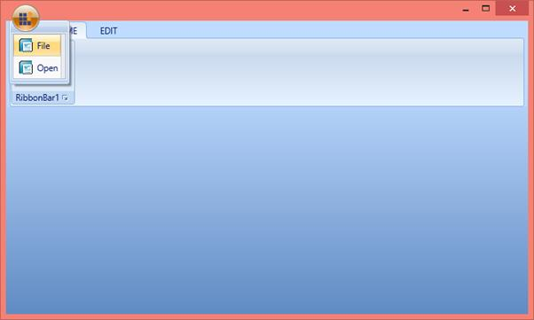

# SimpleMenuButton

The difference between SimpleMenuButton and the other menu button is that it cannot have a sub menu. This control when added outside the ribbon instance will not have the desired appearance.

SimpleMenuButton can be used with ApplicationMenu. 

The following code example illustrates How to use SimpleMenuButton control in Ribbon instance.



[XAML]

<syncfusion:Ribbon Name="_Ribbon1" HorizontalAlignment="Stretch" VerticalAlignment="Top">

<syncfusion:RibbonTab Name="_RibbonTab1" Caption="HOME"  IsChecked="False">

<syncfusion:RibbonBar Name="_RibbonBar1" Header="RibbonBar1"/>

</syncfusion:RibbonTab>

<syncfusion:RibbonTab Caption="EDIT"  IsChecked="False"/>

<syncfusion:Ribbon.ApplicationMenu>

<syncfusion:ApplicationMenu Name="_ApplicationMenu" Width="38" Height="38" syncfusion:Ribbon.KeyTip="F" IsPopupOpen="False" ApplicationButtonImage="syncfusion.png">

<syncfusion:SimpleMenuButton Label="File" Icon="Document32.png"/>

<syncfusion:SimpleMenuButton Label="Open" Icon="Document32.png"/>

</syncfusion:ApplicationMenu>

</syncfusion:Ribbon.ApplicationMenu>

</syncfusion:Ribbon>



Create instance of SimpleMenuButton and add it to ApplicationMenu Items.



[C#]

SimpleMenuButton _SimpleMenuButton = new SimpleMenuButton() { Label = "File", Width = 100 };

SimpleMenuButton _SimpleMenuButton1 = new SimpleMenuButton() { Label = "Open", Width = 100 };

_ApplicationMenu.Items.Add(_SimpleMenuButton);

_ApplicationMenu.Items.Add(_SimpleMenuButton1);



