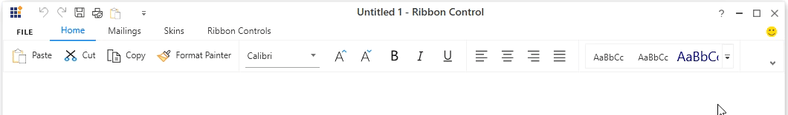
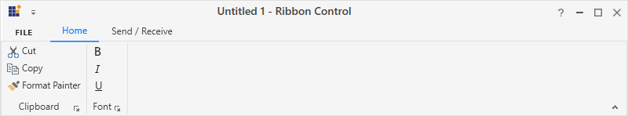
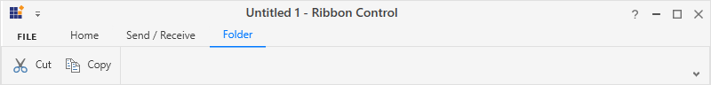
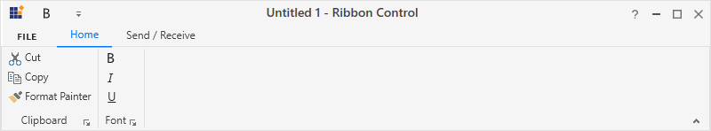
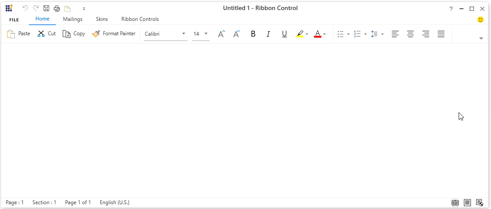

# Simplified Layout in WPF Ribbon

 The Ribbon is available in simplified layout which is designed to display the most commonly used Ribbon commands in a single line interface, allowing more screen space for compact viewing of the content. For the best user experience, the other Ribbon commands are located under the overflow menu. It also provides option to switch back and forth between the simplified and the normal layout using the minimize button.

 The [`LayoutMode`](https://help.syncfusion.com/cr/wpf/Syncfusion.Windows.Tools.Controls.Ribbon.html#Syncfusion_Windows_Tools_Controls_Ribbon_LayoutMode) enumeration property provides an option to load the Ribbon control in simplified layout. It contains the following options like:

 * **Normal** - The Ribbon items are arranged in the standard layout. This is the default value.
 * **Simplified** - The Ribbon items are arranged in the simplified layout.

 

 

 <Grid>
 <syncfusion:Ribbon x:Name="ribbon" LayoutMode="Simplified" VerticalAlignment="Top">            
 </syncfusion:Ribbon>
 </Grid>

 

 

 Ribbon ribbon = new Ribbon();
 ribbon.VerticalAlignment = VerticalAlignment.Top;
 ribbon.LayoutMode = LayoutMode.Simplified;
 grid.Children.Add(ribbon);

 

 

## Switching between simplified and normal layouts

 The Ribbon control allows to switch between simplified and normal layouts at runtime using the Ribbon minimize button located in the lower right corner of the Ribbon. To enable this option, set the [`EnableSimplifiedLayoutMode`](https://help.syncfusion.com/cr/wpf/Syncfusion.Windows.Tools.Controls.Ribbon.html#Syncfusion_Windows_Tools_Controls_Ribbon_EnableSimplifiedLayoutMode) property to **True**. By default, its value is **False**.

 

 

 <Grid>
 <syncfusion:Ribbon x:Name="ribbon" EnableSimplifiedLayoutMode="True" VerticalAlignment="Top">            
 </syncfusion:Ribbon>
 </Grid>

 

 

 Ribbon ribbon = new Ribbon();
 ribbon.VerticalAlignment = VerticalAlignment.Top;
 ribbon.EnableSimplifiedLayoutMode = true;
 grid.Children.Add(ribbon);
 
 

 

 

## Visibility of the Ribbon items between normal and simplified layout

 The Ribbon items can be set common between different layouts or can be made visible only in a particular layout using the [`SimplifiedLayoutSettings.DisplayMode`](https://help.syncfusion.com/cr/wpf/Syncfusion.Windows.Tools.Controls.SimplifiedLayoutSettings.html#Syncfusion_Windows_Tools_Controls_SimplifiedLayoutSettings_SetDisplayMode_System_Windows_UIElement_Syncfusion_Windows_Tools_DisplayMode_) attached property. By default, items will be displayed in both normal and simplified layout. The [`DisplayMode`](https://help.syncfusion.com/cr/wpf/Syncfusion.Windows.Tools.DisplayMode.html) is of flag enumeration type that contains the following values.

 * **Normal** - The item will be displayed only in the normal layout.
 * **Simplified** - The item will be displayed only in the simplified layout.
 * **OverflowMenu** - The item will be displayed only inside the overflow menu when simplified layout is enabled.

 Also, the [`DisplayMode`](https://help.syncfusion.com/cr/wpf/Syncfusion.Windows.Tools.Controls.SimplifiedLayoutSettings.html#Syncfusion_Windows_Tools_Controls_SimplifiedLayoutSettings_SetDisplayMode_System_Windows_UIElement_Syncfusion_Windows_Tools_DisplayMode_) property allows the following value combinations as well.

 * **Normal, Simplified** – The item will be displayed in both normal and simplified layout.
 * **Normal, OverflowMenu** – The item will be displayed in both normal layout and inside overflow menu during simplified layout.
 * **Simplified, OverflowMenu** – The item will be displayed in simplified layout.
 * **Normal, Simplified, OverflowMenu** – The item will be displayed in both normal and simplified layout.

 In the below code snippet, the [`SimplifiedLayoutSettings.DisplayMode`](https://help.syncfusion.com/cr/wpf/Syncfusion.Windows.Tools.Controls.SimplifiedLayoutSettings.html#Syncfusion_Windows_Tools_Controls_SimplifiedLayoutSettings_SetDisplayMode_System_Windows_UIElement_Syncfusion_Windows_Tools_DisplayMode_) property for *Paste* option is set to **"Simplified"**, so it will only be displayed only in the simplified layout. The [`SimplifiedLayoutSettings.DisplayMode`](https://help.syncfusion.com/cr/wpf/Syncfusion.Windows.Tools.Controls.SimplifiedLayoutSettings.html#Syncfusion_Windows_Tools_Controls_SimplifiedLayoutSettings_SetDisplayMode_System_Windows_UIElement_Syncfusion_Windows_Tools_DisplayMode_) property for *Underline* option is set to **"Normal, Overflow"**, so it will be displayed in the normal layout and will also be displayed inside the overflow menu in the simplified layout.

 

 
 
 <!-- This item will only be displayed in simplified layout -->
 <syncfusion:RibbonButton Label="Paste" syncfusion:SimplifiedLayoutSettings.DisplayMode="Simplified" />            
 
 <!-- This item will only be displayed in normal layout -->
 <syncfusion:RibbonButton syncfusion:SimplifiedLayoutSettings.DisplayMode="Normal" SizeForm="ExtraSmall" />

 <!-- This item will be displayed in normal layout and inside overflow menu during simplified layout -->
 <syncfusion:RibbonButton Label="Underline"  syncfusion:SimplifiedLayoutSettings.DisplayMode="Normal,OverflowMenu"  SizeForm="ExtraSmall”/>
  
 <!-- This item will be displayed both in normal and simplified layout --> 
 <syncfusion:RibbonButton Label="Italic" SizeForm="ExtraSmall"/>

 

 

 // This item will only be displayed in simplified layout 
 RibbonButton pasteButton = new RibbonButton();
 pasteButton.Label = "Paste";
 SimplifiedLayoutSettings.SetDisplayMode(pasteButton, DisplayMode.Simplified);

 // This item will only be displayed in normal layout 
 RibbonButton boldButton = new RibbonButton();
 boldButton.Label = "Bold";
 boldButton.SizeForm = SizeForm.ExtraSmall;
 SimplifiedLayoutSettings.SetDisplayMode(boldButton, DisplayMode.Normal);

 // This item will be displayed in normal layout and inside overflow menu during simplified layout 
 RibbonButton underlineButton = new RibbonButton();
 underlineButton.Label = "Underline";
 SimplifiedLayoutSettings.SetDisplayMode(underlineButton, DisplayMode.Normal | DisplayMode.OverflowMenu);

 // This item will be displayed both in normal and simplified layout 
 RibbonButton italicButton = new RibbonButton();
 italicButton.Label = "Paste";
 
 

 

 When using simplified layout, the **Margin**, **Width** and **Height** values of the Ribbon items can be ignored as they are changed based on the size form and layout mode. If the item to be shown in both normal and simplified layout, the **Margin**, **Width** and **Height** properties can be set for normal layout alone using triggers. 

 

 
 
 <syncfusion:RibbonButton Label="Copy" syncfusion:SimplifiedLayoutSettings.DisplayMode="Normal,Simplified"   SizeForm="Small" MediumIcon="/Resources/Copy_20.png" SmallIcon="/Resources/Copy16.png" >
    <syncfusion:RibbonButton.Style >
        
    </syncfusion:RibbonButton.Style>
 </syncfusion:RibbonButton>

 

 

## Setting image for Ribbon items

 For **"Normal"** layout mode, the images from the [`SmallIcon`](https://help.syncfusion.com/cr/wpf/Syncfusion.Windows.Tools.Controls.RibbonItemsControl.html#Syncfusion_Windows_Tools_Controls_RibbonItemsControl_SmallIcon) and [`LargeIcon`](https://help.syncfusion.com/cr/wpf/Syncfusion.Windows.Tools.Controls.RibbonItemsControl.html#Syncfusion_Windows_Tools_Controls_RibbonItemsControl_LargeIcon) properties are used inside the Ribbon items based on the size mode (extra small, small and large). However, the simplified layout mode uses 20 * 20 image size for the Ribbon items as standard and it can be obtained from the [`MediumIcon`](https://help.syncfusion.com/cr/wpf/Syncfusion.Windows.Tools.Controls.RibbonItemsControl.html#Syncfusion_Windows_Tools_Controls_RibbonItemsControl_MediumIcon) property. In-case if the [`IconTemplate`](https://help.syncfusion.com/cr/wpf/Syncfusion.Windows.Tools.Controls.RibbonButton.html#Syncfusion_Windows_Tools_Controls_RibbonButton_IconTemplate) property is used to display the image, the simplified layout will automatically resize it to 20 * 20 size.

 

 

 <syncfusion:RibbonButton Label="Paste" syncfusion:SimplifiedLayoutSettings.DisplayMode="Simplified" MediumIcon="/Resources/Paste20.png" />
 <syncfusion:RibbonButton Label="Italic" SizeForm="ExtraSmall">
    <syncfusion:RibbonButton.IconTemplate >
        <DataTemplate>
            <Path Margin="4,2,2,1"
              Data="M2.000005,0 L6.000005,0 6.000005,1 4.4186966,1 2.4888427,8.9999952 4,8.9999952 4,9.9999952 0,9.9999952 0,8.9999952 1.4594386,8.9999952 3.3901918,1 2.000005,1 z"
              Fill= "Black" />
        </DataTemplate>
    </syncfusion:RibbonButton.IconTemplate>
 </syncfusion:RibbonButton>

 



 RibbonButton pasteButton = new RibbonButton();
 pasteButton.Label = "Paste";
 pasteButton.MediumIcon = new BitmapImage(new Uri(@"/Resources/Paste20.png", UriKind.RelativeOrAbsolute));
 SimplifiedLayoutSettings.SetDisplayMode(pasteButton, DisplayMode.Simplified);

 RibbonButton italicButton = new RibbonButton();
 italicButton.Label = "Italic";
 italicButton.SizeForm = SizeForm.ExtraSmall;
 DataTemplate iconDataTemplate = new DataTemplate();
 FrameworkElementFactory icon_element = new FrameworkElementFactory(typeof(Path));
 icon_element.SetValue(Path.MarginProperty, new Thickness(4, 2, 2, 2));
 icon_element.SetValue(Path.FillProperty, new SolidColorBrush(Colors.Black));
 icon_element.SetValue(Path.DataProperty, Geometry.Parse("M2.000005,0 L6.000005,0 6.000005,1 4.4186966,1 2.4888427,8.9999952 4,8.9999952 4,9.9999952 0,9.9999952 0,8.9999952 1.4594386,8.9999952 3.3901918,1 2.000005,1 z"));
 iconDataTemplate.VisualTree = icon_element;
 italicButton.IconTemplate = iconDataTemplate;

 

 

 The following screenshot shows the simplified layout within the Ribbon control.

 
 
 N> View [sample](https://github.com/SyncfusionExamples/How-to-customize-the-simplified-layout-in-Ribbon) in GitHub.

## Customizing the Ribbon during runtime through the QAT window

 The Ribbon control allows to customize the Ribbon and Ribbon items through the QAT window, where user can add the Ribbon items to a new [`RibbonTab`](https://help.syncfusion.com/cr/wpf/Syncfusion.Windows.Tools.Controls.RibbonTab.html) or [`RibbonBar`](https://help.syncfusion.com/cr/wpf/Syncfusion.Windows.Tools.Controls.RibbonBar.html). The newly added [`RibbonTab`](https://help.syncfusion.com/cr/wpf/Syncfusion.Windows.Tools.Controls.RibbonTab.html) or [`RibbonBar`](https://help.syncfusion.com/cr/wpf/Syncfusion.Windows.Tools.Controls.RibbonBar.html) will only be visible in the respective layout in which items were added originally. In the below example, the [`LayoutMode`](https://help.syncfusion.com/cr/wpf/Syncfusion.Windows.Tools.Controls.Ribbon.html#Syncfusion_Windows_Tools_Controls_Ribbon_LayoutMode) is set as **"Simplified"** and a new [`RibbonTab`](https://help.syncfusion.com/cr/wpf/Syncfusion.Windows.Tools.Controls.RibbonTab.html) named *Folder* is created and added using the QAT window. This tab will now be visible only in the simplified layout and not in the normal layout which is the default behavior. 

 
 
 *Normal layout*

 
 *Simplified layout*

 In the meantime, the Ribbon control also allows to add items to the Quick Access Toolbar (QAT) with the help of the QAT window or through the context menu shortcut. Items added during normal or simplified layout will always be visible even when switching between layouts. In the below example, the [`LayoutMode`](https://help.syncfusion.com/cr/wpf/Syncfusion.Windows.Tools.Controls.Ribbon.html#Syncfusion_Windows_Tools_Controls_Ribbon_LayoutMode) is set as **"Simplified"** and the *Bold* item is added to the QAT through the context menu. This item will now be constantly visible in both normal and simplified layouts.

  
 *Normal layout*

 
 *Simplified layout*
 

## Resizing Ribbon in simplified layout

 While re-sizing the Ribbon, when the width of the window decreases and touches the last positioned item in the Ribbon, the appropriate item will be moved inside the overflow menu automatically. The same behavior will continue for each item when the window is resized continuously.

 

